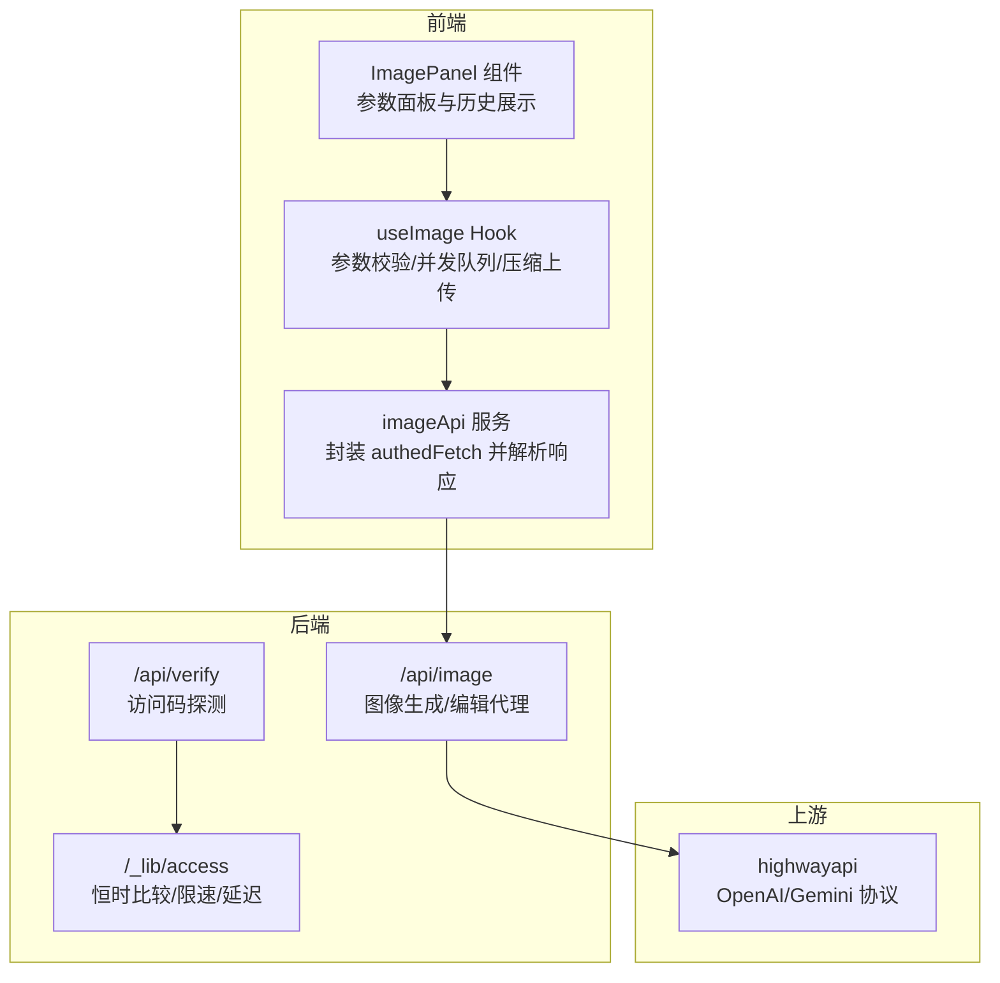
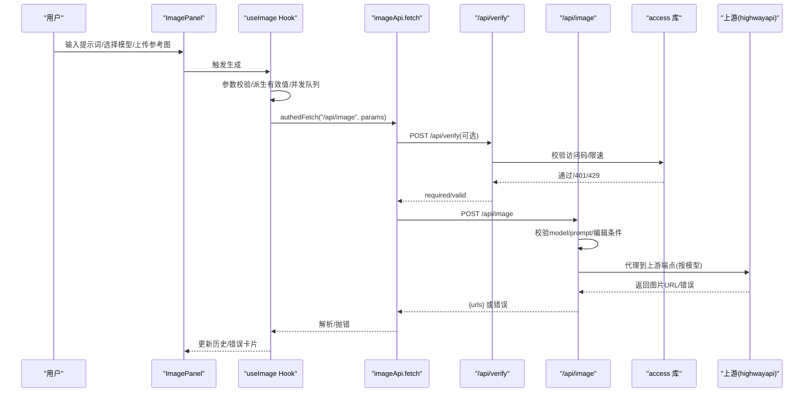
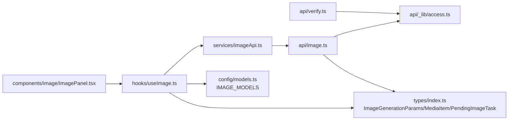

# API 参考文档

<cite>
**本文引用的文件**
- [api/image.ts](file://api/image.ts)
- [src/services/imageApi.ts](file://src/services/imageApi.ts)
- [src/hooks/useImage.ts](file://src/hooks/useImage.ts)
- [src/types/index.ts](file://src/types/index.ts)
- [src/services/accessCode.ts](file://src/services/accessCode.ts)
- [api/_lib/access.ts](file://api/_lib/access.ts)
- [api/verify.ts](file://api/verify.ts)
- [src/components/image/ImagePanel.tsx](file://src/components/image/ImagePanel.tsx)
- [src/config/models.ts](file://src/config/models.ts)
- [ImageGenAPI/reference-gpt-image-2-text-to-image.md](file://ImageGenAPI/reference-gpt-image-2-text-to-image.md)
- [ImageGenAPI/reference-gpt-image-2-edit.md](file://ImageGenAPI/reference-gpt-image-2-edit.md)
- [ImageGenAPI/reference-gemini-3.1-flash-image-text-to-image.md](file://ImageGenAPI/reference-gemini-3.1-flash-image-text-to-image.md)
- [ImageGenAPI/reference-gemini-3.1-flash-image-edit.md](file://ImageGenAPI/reference-gemini-3.1-flash-image-edit.md)
- [ImageGenAPI/reference-gemini-3-pro-image-text-to-image.md](file://ImageGenAPI/reference-gemini-3-pro-image-text-to-image.md)
- [ImageGenAPI/reference-gemini-3-pro-image-edit.md](file://ImageGenAPI/reference-gemini-3-pro-image-edit.md)
</cite>

## 目录
1. [简介](#简介)
2. [项目结构](#项目结构)
3. [核心组件](#核心组件)
4. [架构总览](#架构总览)
5. [详细组件分析](#详细组件分析)
6. [依赖关系分析](#依赖关系分析)
7. [性能考虑](#性能考虑)
8. [故障排除指南](#故障排除指南)
9. [结论](#结论)
10. [附录](#附录)

## 简介
本文件为 AIShop 的图像生成 API 提供全面的参考文档，覆盖以下模型与能力：
- 文本到图像：GPT Image 2、Gemini 3.1 Flash、Gemini 3.1 Pro
- 图像编辑：GPT Image 2、Gemini 3.1 Flash、Gemini 3.1 Pro

文档内容包括：
- 端点定义与请求/响应规范
- 认证方式与请求头设置
- 请求参数与可选值
- 错误处理策略与状态码
- 速率限制、并发控制与配额管理
- API 版本与迁移建议

## 项目结构
AIShop 采用前端 React + Vite 与后端 Vercel Serverless Function 的分层架构。图像生成流程由前端 Hook 组织参数并通过受保护的 fetch 调用后端 API，后端再代理至上游服务商（如 highwayapi）。

图表来源
- [src/components/image/ImagePanel.tsx:63-434](file://src/components/image/ImagePanel.tsx#L63-L434)
- [src/hooks/useImage.ts:128-393](file://src/hooks/useImage.ts#L128-L393)
- [src/services/imageApi.ts:1-41](file://src/services/imageApi.ts#L1-L41)
- [api/image.ts:104-310](file://api/image.ts#L104-L310)
- [api/_lib/access.ts:1-156](file://api/_lib/access.ts#L1-L156)
- [api/verify.ts:11-33](file://api/verify.ts#L11-L33)

章节来源
- [src/components/image/ImagePanel.tsx:63-434](file://src/components/image/ImagePanel.tsx#L63-L434)
- [src/hooks/useImage.ts:128-393](file://src/hooks/useImage.ts#L128-L393)
- [src/services/imageApi.ts:1-41](file://src/services/imageApi.ts#L1-L41)
- [api/image.ts:104-310](file://api/image.ts#L104-L310)
- [api/_lib/access.ts:1-156](file://api/_lib/access.ts#L1-L156)
- [api/verify.ts:11-33](file://api/verify.ts#L11-L33)

## 核心组件
- 前端参数与并发控制：useImage Hook 负责参数有效性、尺寸/比例/质量选项、上传图片压缩与并发队列、超时与取消。
- 认证与访问码：accessCode 服务负责本地存储访问码、自动注入请求头、401 事件广播与探测。
- 后端代理：/api/image 将前端请求映射到上游模型端点，统一封装响应与错误。
- 上游适配：extractUrls 抽象上游差异，统一返回 { urls: string[] }。

章节来源
- [src/hooks/useImage.ts:128-393](file://src/hooks/useImage.ts#L128-L393)
- [src/services/accessCode.ts:37-113](file://src/services/accessCode.ts#L37-L113)
- [api/image.ts:64-102](file://api/image.ts#L64-L102)
- [api/image.ts:104-310](file://api/image.ts#L104-L310)

## 架构总览
下图展示了从用户输入到上游返回的完整链路，包括认证、参数校验、并发与错误处理。

图表来源
- [src/components/image/ImagePanel.tsx:134-142](file://src/components/image/ImagePanel.tsx#L134-L142)
- [src/hooks/useImage.ts:228-286](file://src/hooks/useImage.ts#L228-L286)
- [src/services/imageApi.ts:8-40](file://src/services/imageApi.ts#L8-L40)
- [api/verify.ts:11-33](file://api/verify.ts#L11-L33)
- [api/image.ts:104-310](file://api/image.ts#L104-L310)
- [api/_lib/access.ts:120-155](file://api/_lib/access.ts#L120-L155)

## 详细组件分析

### 端点：/api/image（图像生成与编辑）
- 方法：POST
- URL：/api/image
- 功能：根据 model 与是否存在参考图，路由到对应上游端点；统一封装响应为 { urls: string[] }。
- 请求头：
  - Content-Type: application/json
  - X-Access-Code: 可选（当服务端配置了 ACCESS_CODE 时生效）
- 请求体字段：
  - model: string（必填，见“支持的模型”）
  - prompt: string（必填，非空）
  - images: string[]（可选，编辑模式下的 base64 或 URL）
  - aspectRatio: string（可选，部分模型支持）
  - size: string（可选，尺寸规格因模型而异）
  - quality: string（可选，GPT Image 2 支持 low/medium/high）
  - outputFormat: string（可选，MIME 类型）
  - n: number（可选，生成数量）

- 响应体：
  - 成功：{ urls: string[] }
  - 失败：{ error: string, detail?: any }

- 重要行为：
  - GPT Image 2 编辑：images 仅支持单张；base64 需补全 data URI 前缀（如 data:image/jpeg;base64,...）。
  - Gemini 编辑：支持 image_urls 与 image_base64s 混合，二者合计不超过 14 张；base64 需为裸字符串（无 data URI 前缀）。
  - 响应统一抽取：支持 Gemini 的 image_urls 与 OpenAI 兼容的 data/images 结构。

章节来源
- [api/image.ts:49-58](file://api/image.ts#L49-L58)
- [api/image.ts:104-310](file://api/image.ts#L104-L310)
- [api/image.ts:64-102](file://api/image.ts#L64-L102)

### 认证与访问码
- 前端：
  - 自动注入 X-Access-Code 请求头（若本地存在）。
  - 401 时清除本地访问码并广播 unauthorized 事件，触发登录界面。
  - 提供探测接口 /api/verify，判断服务端是否启用访问码及本地访问码是否有效。
- 后端：
  - ACCESS_CODE 环境变量为空则跳过校验；否则执行恒时比较、失败计数与锁定。
  - Edge 与 Node 运行时分别提供 IP 提取与统一校验逻辑。

章节来源
- [src/services/accessCode.ts:37-113](file://src/services/accessCode.ts#L37-L113)
- [api/verify.ts:11-33](file://api/verify.ts#L11-L33)
- [api/_lib/access.ts:25-155](file://api/_lib/access.ts#L25-L155)

### 参数与选项（按模型）
- GPT Image 2
  - 文生图：支持 size（如 1024x1024 等）、quality（low/medium/high）、output_format（png/jpeg）等。
  - 图像编辑：支持 image（单张 URL/base64）、mask（可选）、size、quality、output_format 等。
- Gemini 3.1 Flash
  - 文生图：size（0.5K/1K/2K/4K）、aspect_ratio、output_format（image/png 或 image/jpeg）、google.web_search/image_search。
  - 图像编辑：size、aspect_ratio、image_urls（最多 14 张）、image_base64s（最多 14 张）、output_format。
- Gemini 3.1 Pro
  - 文生图：size（1K/2K/4K）、aspect_ratio（1:1、3:2、2:3、3:4、4:3、4:5、5:4、9:16、16:9、21:9）、output_format（image/png、image/jpeg、image/webp）。
  - 图像编辑：size、aspect_ratio、image_urls、image_base64s。

章节来源
- [src/config/models.ts:181-215](file://src/config/models.ts#L181-L215)
- [ImageGenAPI/reference-gpt-image-2-text-to-image.md:19-74](file://ImageGenAPI/reference-gpt-image-2-text-to-image.md#L19-L74)
- [ImageGenAPI/reference-gpt-image-2-edit.md:19-70](file://ImageGenAPI/reference-gpt-image-2-edit.md#L19-L70)
- [ImageGenAPI/reference-gemini-3.1-flash-image-text-to-image.md:19-66](file://ImageGenAPI/reference-gemini-3.1-flash-image-text-to-image.md#L19-L66)
- [ImageGenAPI/reference-gemini-3.1-flash-image-edit.md:19-78](file://ImageGenAPI/reference-gemini-3.1-flash-image-edit.md#L19-L78)
- [ImageGenAPI/reference-gemini-3-pro-image-text-to-image.md:19-62](file://ImageGenAPI/reference-gemini-3-pro-image-text-to-image.md#L19-L62)
- [ImageGenAPI/reference-gemini-3-pro-image-edit.md:19-64](file://ImageGenAPI/reference-gemini-3-pro-image-edit.md#L19-L64)

### 错误处理与状态码
- 前端：
  - 非 2xx：优先展示上游 detail/error；若无 detail 则回退到 error 或状态码描述。
  - 未返回 urls：抛出“未返回图片地址”。
- 后端：
  - Method Not Allowed：405
  - 访问码校验失败：401（携带错误信息）
  - 访问码锁定：429（返回 Retry-After）
  - 缺少必要字段：400
  - 不支持的模型：400
  - 上游请求失败：502（透传 detail）
  - 上游非 JSON：502（返回原始文本）
  - 上游无图片：502（返回原始负载）

章节来源
- [src/services/imageApi.ts:19-40](file://src/services/imageApi.ts#L19-L40)
- [api/image.ts:109-133](file://api/image.ts#L109-L133)
- [api/image.ts:167-254](file://api/image.ts#L167-L254)
- [api/image.ts:258-308](file://api/image.ts#L258-L308)

### 并发控制与超时
- 前端：
  - 每个生成任务独立 AbortController，超时 55 秒；支持取消与重试。
  - 并发队列：loading/error 卡片与历史记录分离展示，避免 DOM 抖动。
- 后端：
  - Serverless 超时 60 秒，满足图片生成场景。

章节来源
- [src/hooks/useImage.ts:228-286](file://src/hooks/useImage.ts#L228-L286)
- [api/image.ts:17-26](file://api/image.ts#L17-L26)

### 速率限制与配额
- 速率限制：
  - 单实例内存级限速：1 分钟内失败 10 次锁定 1 小时；每次失败固定延迟 800ms。
  - 429 响应包含 Retry-After；401 时记录失败并延迟。
- 配额与并发：
  - Gemini 编辑支持最多 14 张参考图；GPT Image 2 编辑仅 1 张。
  - 前端上传大小限制 4MB；图片压缩至最大边 1024px，JPEG 质量 0.85。
- 使用统计：
  - 后端记录成功/失败，便于审计与监控（需结合日志系统）。

章节来源
- [api/_lib/access.ts:7-155](file://api/_lib/access.ts#L7-L155)
- [src/hooks/useImage.ts:89-125](file://src/hooks/useImage.ts#L89-L125)
- [src/hooks/useImage.ts:33-37](file://src/hooks/useImage.ts#L33-L37)

### API 版本与迁移
- 当前后端路由采用固定上游路径（/v3/{model-slug}-{text-to-image|edit}），与 OpenAI 兼容路径（/openai/v1）隔离。
- 迁移建议：
  - 保持请求体字段稳定（prompt/model/size/aspectRatio/quality/outputFormat/n）。
  - 对于 GPT Image 2，继续遵循 base64 data URI 前缀要求；对于 Gemini，区分 image_urls 与 image_base64s。
  - 如上游变更响应结构，后端 extractUrls 已抽象兼容，前端仍以 urls 为准。

章节来源
- [api/image.ts:34-47](file://api/image.ts#L34-L47)
- [api/image.ts:64-102](file://api/image.ts#L64-L102)

## 依赖关系分析

图表来源
- [src/types/index.ts:68-103](file://src/types/index.ts#L68-L103)
- [src/config/models.ts:181-215](file://src/config/models.ts#L181-L215)
- [src/components/image/ImagePanel.tsx:63-90](file://src/components/image/ImagePanel.tsx#L63-L90)
- [src/hooks/useImage.ts:1-393](file://src/hooks/useImage.ts#L1-L393)
- [src/services/imageApi.ts:1-41](file://src/services/imageApi.ts#L1-L41)
- [api/verify.ts:11-33](file://api/verify.ts#L11-L33)
- [api/_lib/access.ts:1-156](file://api/_lib/access.ts#L1-L156)
- [api/image.ts:1-310](file://api/image.ts#L1-L310)

章节来源
- [src/types/index.ts:68-103](file://src/types/index.ts#L68-L103)
- [src/config/models.ts:181-215](file://src/config/models.ts#L181-L215)
- [src/components/image/ImagePanel.tsx:63-90](file://src/components/image/ImagePanel.tsx#L63-L90)
- [src/hooks/useImage.ts:1-393](file://src/hooks/useImage.ts#L1-L393)
- [src/services/imageApi.ts:1-41](file://src/services/imageApi.ts#L1-L41)
- [api/verify.ts:11-33](file://api/verify.ts#L11-L33)
- [api/_lib/access.ts:1-156](file://api/_lib/access.ts#L1-L156)
- [api/image.ts:1-310](file://api/image.ts#L1-L310)

## 性能考虑
- 前端：
  - 图片压缩与懒加载减少首屏压力；并发队列避免重复请求。
- 后端：
  - 60 秒超时满足生成场景；bodyParser sizeLimit 提升至 10MB，避免大体积 base64 被拒。
- 网络：
  - 建议使用 HTTPS；合理设置 CDN 与边缘缓存（如适用）。

[本节为通用指导，无需特定文件来源]

## 故障排除指南
- 401 未授权
  - 检查本地访问码是否正确；确认 /api/verify 返回 required=true 且 valid=true。
  - 前端收到 401 会清除本地访问码并触发登录界面。
- 429 速率限制
  - 查看 Retry-After；等待锁定结束（约 1 小时）。
- 502 上游错误
  - 检查上游返回的 detail；确认模型/尺寸/格式是否符合要求。
- 未返回图片地址
  - 确认上游返回结构已被 extractUrls 正确解析；检查 images/url/b64_json 字段。
- GPT Image 2 编辑图片未识别
  - 确保 base64 带 data URI 前缀（如 data:image/jpeg;base64,...）。

章节来源
- [src/services/accessCode.ts:49-56](file://src/services/accessCode.ts#L49-L56)
- [api/_lib/access.ts:63-104](file://api/_lib/access.ts#L63-L104)
- [api/image.ts:258-308](file://api/image.ts#L258-L308)
- [src/services/imageApi.ts:35-40](file://src/services/imageApi.ts#L35-L40)

## 结论
AIShop 的图像生成 API 通过清晰的前后端职责划分与统一的后端代理层，实现了对多家模型提供商的兼容与抽象。前端提供直观的参数面板与并发控制，后端提供访问码校验、限速与错误透传。遵循本文档的请求规范与错误处理策略，可稳定地调用 GPT Image 2、Gemini 3.1 Flash 与 Gemini 3.1 Pro 的文本到图像与图像编辑能力。

[本节为总结，无需特定文件来源]

## 附录

### 支持的模型与端点映射
- gpt-image-2
  - 文本到图像：/v3/gpt-image-2-text-to-image
  - 图像编辑：/v3/gpt-image-2-edit
- gemini-3.1-flash
  - 文本到图像：/v3/gemini-3.1-flash-image-text-to-image
  - 图像编辑：/v3/gemini-3.1-flash-image-edit
- gemini-3-pro
  - 文本到图像：/v3/gemini-3-pro-image-text-to-image
  - 图像编辑：/v3/gemini-3-pro-image-edit

章节来源
- [api/image.ts:34-47](file://api/image.ts#L34-L47)

### 请求体字段对照（摘要）
- model: string（必填）
- prompt: string（必填）
- images: string[]（编辑模式）
- aspectRatio: string（可选）
- size: string（可选）
- quality: string（可选，GPT）
- outputFormat: string（可选）
- n: number（可选）

章节来源
- [api/image.ts:49-58](file://api/image.ts#L49-L58)
- [src/types/index.ts:68-78](file://src/types/index.ts#L68-L78)