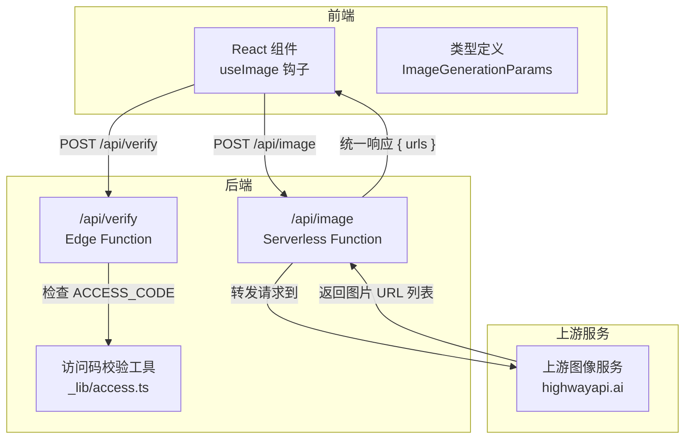
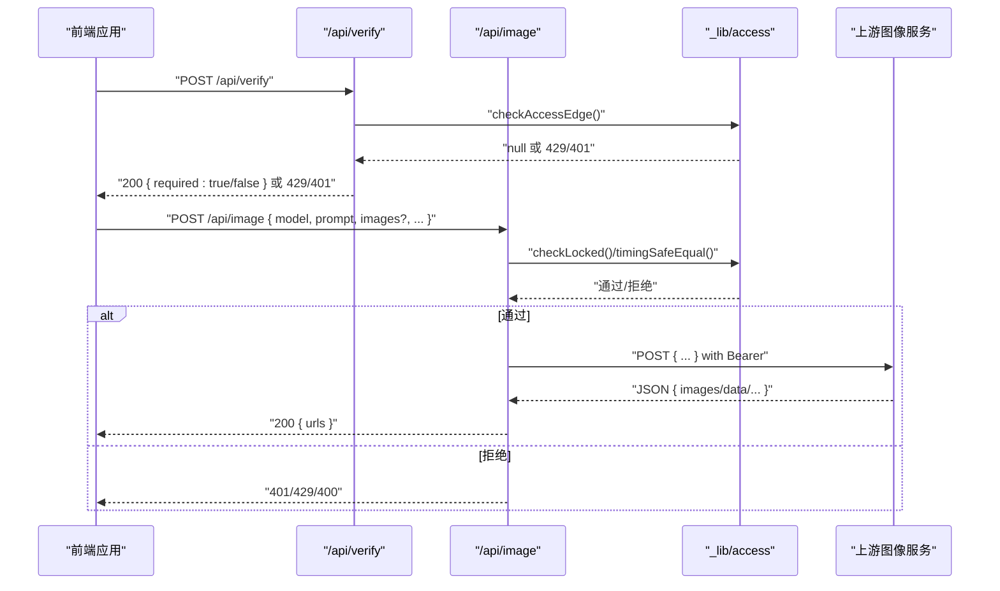
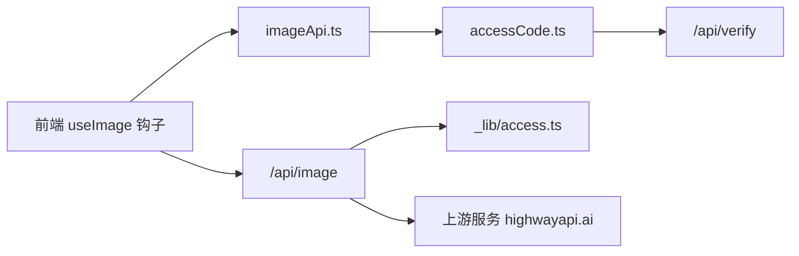
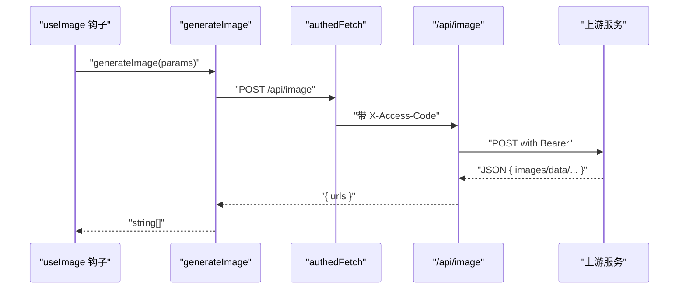

# GPT Image 2 API

<cite>
**本文引用的文件**
- [api/image.ts](file://api/image.ts)
- [api/verify.ts](file://api/verify.ts)
- [api/_lib/access.ts](file://api/_lib/access.ts)
- [src/services/imageApi.ts](file://src/services/imageApi.ts)
- [src/services/accessCode.ts](file://src/services/accessCode.ts)
- [src/hooks/useImage.ts](file://src/hooks/useImage.ts)
- [src/types/index.ts](file://src/types/index.ts)
- [src/config/models.ts](file://src/config/models.ts)
- [ImageGenAPI/reference-gpt-image-2-text-to-image.md](file://ImageGenAPI/reference-gpt-image-2-text-to-image.md)
- [ImageGenAPI/reference-gpt-image-2-edit.md](file://ImageGenAPI/reference-gpt-image-2-edit.md)
</cite>

## 目录
1. [简介](#简介)
2. [项目结构](#项目结构)
3. [核心组件](#核心组件)
4. [架构总览](#架构总览)
5. [详细组件分析](#详细组件分析)
6. [依赖关系分析](#依赖关系分析)
7. [性能考量](#性能考量)
8. [故障排查指南](#故障排查指南)
9. [结论](#结论)
10. [附录](#附录)

## 简介
本文件为 GPT Image 2 文生图与图像编辑 API 的权威参考文档。基于仓库中的官方文档与实现代码，系统性梳理了：
- 文本到图像（Text-to-Image）与图像编辑（Image Edit）两个端点的请求参数、默认值、取值范围与行为约束
- 请求头与认证机制（Bearer Token 与访问码）
- 响应格式与错误处理策略
- 前端调用流程、并发控制与超时策略
- 性能优化建议与最佳实践

## 项目结构
本项目采用前后端分离架构：
- 前端：React + TypeScript，负责参数收集、图片压缩、并发队列与 UI 展示
- 后端：Vercel Serverless Function（Node Runtime）与 Edge Function（访问码校验），负责代理上游图像生成服务、参数适配与错误透传

图表来源
- [api/image.ts:104-310](file://api/image.ts#L104-L310)
- [api/verify.ts:11-32](file://api/verify.ts#L11-L32)
- [api/_lib/access.ts:120-155](file://api/_lib/access.ts#L120-L155)

章节来源
- [api/image.ts:1-310](file://api/image.ts#L1-L310)
- [src/hooks/useImage.ts:128-393](file://src/hooks/useImage.ts#L128-L393)
- [src/types/index.ts:68-103](file://src/types/index.ts#L68-L103)

## 核心组件
- 后端代理接口：/api/image，负责参数适配、上游转发、错误透传与统一响应
- 访问码校验：/api/verify，Edge Runtime 校验 X-Access-Code，配合服务端限速与恒定时间比较
- 前端调用封装：generateImage，统一错误处理与响应提取
- 前端交互钩子：useImage，负责参数持久化、并发队列、超时与历史记录

章节来源
- [api/image.ts:104-310](file://api/image.ts#L104-L310)
- [api/verify.ts:11-32](file://api/verify.ts#L11-L32)
- [src/services/imageApi.ts:8-40](file://src/services/imageApi.ts#L8-L40)
- [src/hooks/useImage.ts:128-393](file://src/hooks/useImage.ts#L128-L393)

## 架构总览
下图展示了从前端到后端再到上游服务的完整调用链路与关键决策点。

图表来源
- [api/image.ts:104-310](file://api/image.ts#L104-L310)
- [api/verify.ts:11-32](file://api/verify.ts#L11-L32)
- [api/_lib/access.ts:120-155](file://api/_lib/access.ts#L120-L155)

## 详细组件分析

### 文本到图像 API（GPT Image 2）
- 端点：/api/image（当 model=gpt-image-2 且无 images 时）
- 上游路径：/v3/gpt-image-2-text-to-image
- 请求头
  - Content-Type: application/json
  - Authorization: Bearer {上游 API 密钥}
  - X-Access-Code: （可选，由前端注入，服务端校验）
- 请求体字段
  - model: gpt-image-2（必填）
  - prompt: 文本提示词（必填，非空）
  - n: 生成数量，默认 1，取值范围 [1,10]
  - size: 尺寸，默认 1024x1024，可选值见下方“章节来源”
  - quality: 质量等级，默认 medium，可选 low/medium/high
  - background: 背景设置，默认 auto，可选 opaque/auto
  - moderation: 内容审核，默认 auto，可选 low/auto
  - output_format: 输出格式，默认 png，可选 png/jpeg
  - output_compression: 输出压缩等级（0-100），仅对 jpeg 有效
- 响应体
  - { urls: string[] }，包含生成的图片 URL 列表

章节来源
- [ImageGenAPI/reference-gpt-image-2-text-to-image.md:5-74](file://ImageGenAPI/reference-gpt-image-2-text-to-image.md#L5-L74)
- [api/image.ts:181-216](file://api/image.ts#L181-L216)
- [api/image.ts:256-308](file://api/image.ts#L256-L308)

### 图像编辑 API（GPT Image 2）
- 端点：/api/image（当 model=gpt-image-2 且存在 images 时）
- 上游路径：/v3/gpt-image-2-edit
- 请求头
  - Content-Type: application/json
  - Authorization: Bearer {上游 API 密钥}
  - X-Access-Code: （可选）
- 请求体字段
  - model: gpt-image-2（必填）
  - image: 要编辑的图片（必填），支持单张 URL/base64
  - prompt: 文本提示词（必填，非空）
  - n: 生成数量，默认 1，取值范围 [1,10]
  - size: 尺寸，默认 1024x1024，可选值见下方“章节来源”
  - quality: 质量等级，默认 low，可选 low/medium/high
  - background: 背景设置，默认 auto，可选 opaque/auto
  - output_format: 输出格式，默认 png，可选 png/jpeg
  - mask: 遮罩图（可选，PNG，alpha 通道）
- 响应体
  - { urls: string[] }，包含生成的图片 URL 列表

章节来源
- [ImageGenAPI/reference-gpt-image-2-edit.md:5-70](file://ImageGenAPI/reference-gpt-image-2-edit.md#L5-L70)
- [api/image.ts:182-206](file://api/image.ts#L182-L206)
- [api/image.ts:256-308](file://api/image.ts#L256-L308)

### 请求参数与取值范围对照
- n：1-10
- size（GPT Image 2 文生图）：1024x1024、1024x1536、1536x1024、2048x2048、2048x1152、3840x2160、2160x3840、2048x1360、1360x2048、1152x2048、2048x1536、1536x2048、2048x880、880x2048、688x2048、2048x688、2048x1024、1024x2048、auto
- size（GPT Image 2 编辑）：auto、688x2048、880x2048、1024x1024、1024x1536、1024x2048、1152x2048、1360x2048、1536x1024、1536x2048、2048x688、2048x880、2048x1024、2048x1152、2048x1360、2048x1536、2048x2048、2160x3840、3840x2160
- quality：low/medium/high
- background：opaque/auto
- moderation（文生图）：low/auto
- output_format：png/jpeg
- output_compression：0-100（仅对 jpeg 有效）

章节来源
- [ImageGenAPI/reference-gpt-image-2-text-to-image.md:21-67](file://ImageGenAPI/reference-gpt-image-2-text-to-image.md#L21-L67)
- [ImageGenAPI/reference-gpt-image-2-edit.md:21-63](file://ImageGenAPI/reference-gpt-image-2-edit.md#L21-L63)

### 认证与访问控制
- Bearer Token
  - 后端向上游转发时，使用 Authorization: Bearer {上游 API 密钥}
  - 前端无需感知上游密钥，统一通过后端代理
- 访问码（X-Access-Code）
  - 前端通过 localStorage 存储访问码，并在每次请求时注入 X-Access-Code
  - 服务端在 /api/verify 中进行 Edge Runtime 校验；在 /api/image 中进行 Node Runtime 校验
  - 校验采用恒定时间比较，失败后触发 800ms 延迟与 IP 限速（1 分钟内失败 10 次锁定 1 小时）
- 响应头
  - 429 场景返回 Retry-After

章节来源
- [api/image.ts:259-266](file://api/image.ts#L259-L266)
- [src/services/accessCode.ts:37-57](file://src/services/accessCode.ts#L37-L57)
- [api/verify.ts:11-32](file://api/verify.ts#L11-L32)
- [api/_lib/access.ts:25-34](file://api/_lib/access.ts#L25-L34)
- [api/_lib/access.ts:63-97](file://api/_lib/access.ts#L63-L97)

### 前端调用与错误处理
- 前端通过 generateImage 发起 /api/image 请求，统一处理 4xx/5xx 与空结果
- useImage 钩子负责：
  - 参数持久化（localStorage）
  - 并发队列与超时（55s）
  - 历史记录与重试
  - 图片压缩（base64，不含 data URI 前缀，JPEG 质量 0.85，最大边 1024px）

章节来源
- [src/services/imageApi.ts:8-40](file://src/services/imageApi.ts#L8-L40)
- [src/hooks/useImage.ts:89-125](file://src/hooks/useImage.ts#L89-L125)
- [src/hooks/useImage.ts:228-286](file://src/hooks/useImage.ts#L228-L286)

### JSON Schema 定义（基于实现与官方文档）
- 请求体（通用）
  - model: string（必填）
  - prompt: string（必填）
  - images?: string[]（编辑模式）
  - aspectRatio?: string（非 GPT 模型）
  - size?: string
  - quality?: string
  - outputFormat?: string
  - n?: number
- 响应体
  - urls: string[]（至少一个）

章节来源
- [src/types/index.ts:68-78](file://src/types/index.ts#L68-L78)
- [api/image.ts:49-58](file://api/image.ts#L49-L58)
- [api/image.ts:300-308](file://api/image.ts#L300-L308)

## 依赖关系分析

图表来源
- [src/hooks/useImage.ts:128-393](file://src/hooks/useImage.ts#L128-L393)
- [src/services/imageApi.ts:8-40](file://src/services/imageApi.ts#L8-L40)
- [src/services/accessCode.ts:37-57](file://src/services/accessCode.ts#L37-L57)
- [api/image.ts:104-310](file://api/image.ts#L104-L310)
- [api/verify.ts:11-32](file://api/verify.ts#L11-L32)
- [api/_lib/access.ts:120-155](file://api/_lib/access.ts#L120-L155)

章节来源
- [src/config/models.ts:181-215](file://src/config/models.ts#L181-L215)
- [src/hooks/useImage.ts:10-15](file://src/hooks/useImage.ts#L10-L15)

## 性能考量
- 前端图片压缩
  - 最大边 1024px，JPEG 质量 0.85，减少 base64 体积，降低上游传输与解析成本
- 并发与超时
  - 前端并发队列 + 55s 超时，避免长时间占用资源
- 上游转发
  - 服务端统一提取图片 URL，兼容多协议响应结构，减少前端分支逻辑
- 访问码限速
  - 1 分钟 10 次失败锁定 1 小时，降低暴力尝试风险

章节来源
- [src/hooks/useImage.ts:89-125](file://src/hooks/useImage.ts#L89-L125)
- [src/hooks/useImage.ts:242-245](file://src/hooks/useImage.ts#L242-L245)
- [api/_lib/access.ts:63-97](file://api/_lib/access.ts#L63-L97)

## 故障排查指南
- 400 Bad Request
  - 缺少 model 或 prompt，或 JSON 解析失败
- 401 Unauthorized
  - 访问码无效或过期；前端会清除本地访问码并触发未授权事件
- 429 Too Many Requests
  - IP 被限速锁定，返回 Retry-After
- 502 Bad Gateway
  - 上游请求失败或返回非 JSON；后端透传上游错误详情
- 500 Internal Server Error
  - 上游 API 密钥未配置
- 502（无图片）
  - 上游未返回任何图片 URL

章节来源
- [api/image.ts:109-154](file://api/image.ts#L109-L154)
- [api/image.ts:267-288](file://api/image.ts#L267-L288)
- [api/image.ts:290-305](file://api/image.ts#L290-L305)
- [src/services/accessCode.ts:49-54](file://src/services/accessCode.ts#L49-L54)

## 结论
本参考文档基于仓库中的官方文档与实现代码，系统化整理了 GPT Image 2 的文生图与图像编辑接口规范、认证与访问控制、响应与错误处理、前端调用与性能优化策略。建议在生产环境中：
- 严格管理上游 Bearer Token 与访问码
- 控制并发与超时，合理设置 n 与 size
- 对 base64 图片进行预压缩，减少传输与解析成本
- 做好错误监控与日志记录，及时定位上游异常

## 附录

### 请求与响应示例（路径引用）
- 文本到图像请求体字段与默认值：参见 [ImageGenAPI/reference-gpt-image-2-text-to-image.md:19-67](file://ImageGenAPI/reference-gpt-image-2-text-to-image.md#L19-L67)
- 图像编辑请求体字段与默认值：参见 [ImageGenAPI/reference-gpt-image-2-edit.md:19-63](file://ImageGenAPI/reference-gpt-image-2-edit.md#L19-L63)
- 统一响应体结构：参见 [api/image.ts:300-308](file://api/image.ts#L300-L308)

### 前端调用序列（基于实现）

图表来源
- [src/hooks/useImage.ts:228-286](file://src/hooks/useImage.ts#L228-L286)
- [src/services/imageApi.ts:8-40](file://src/services/imageApi.ts#L8-L40)
- [src/services/accessCode.ts:37-57](file://src/services/accessCode.ts#L37-L57)
- [api/image.ts:104-310](file://api/image.ts#L104-L310)