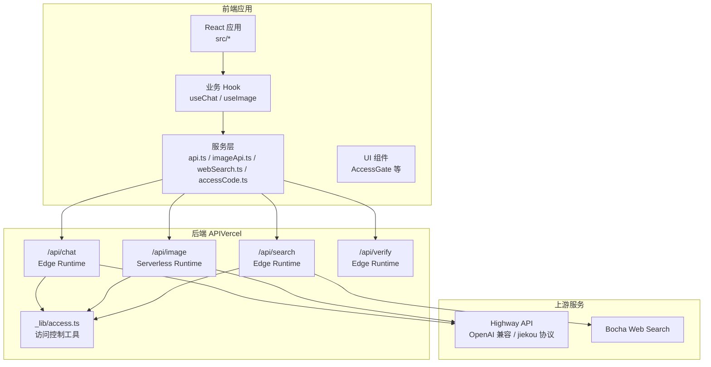
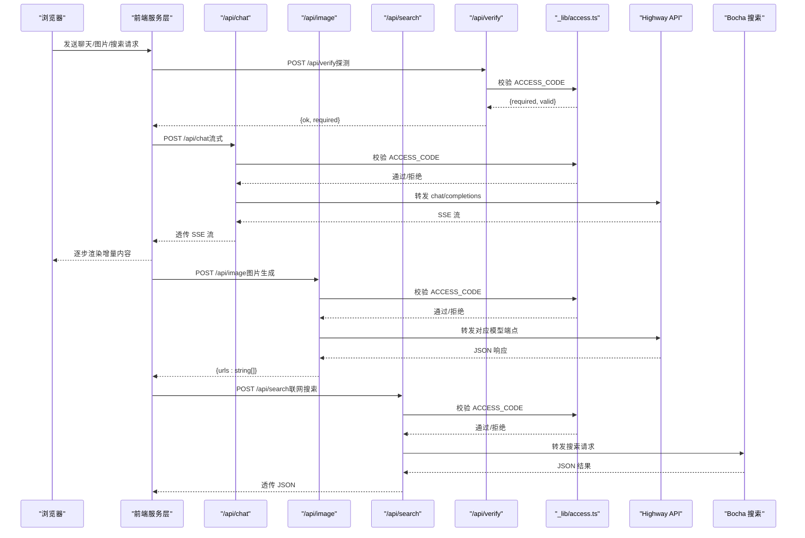
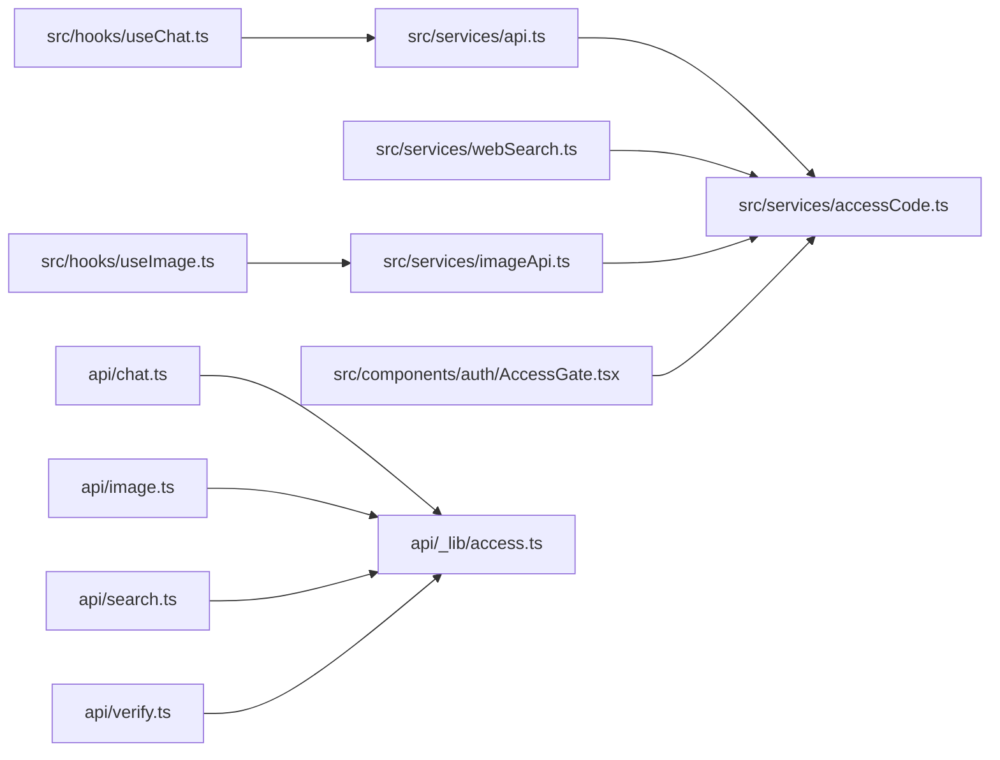
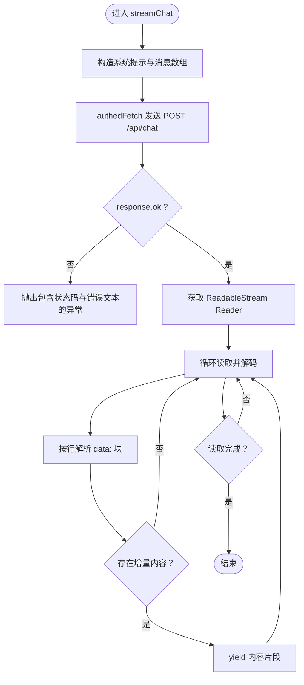

# API 集成

<cite>
**本文档引用的文件**
- [api/chat.ts](file://api/chat.ts)
- [api/image.ts](file://api/image.ts)
- [api/search.ts](file://api/search.ts)
- [api/verify.ts](file://api/verify.ts)
- [api/_lib/access.ts](file://api/_lib/access.ts)
- [src/services/api.ts](file://src/services/api.ts)
- [src/hooks/useChat.ts](file://src/hooks/useChat.ts)
- [src/hooks/useImage.ts](file://src/hooks/useImage.ts)
- [src/services/webSearch.ts](file://src/services/webSearch.ts)
- [src/components/auth/AccessGate.tsx](file://src/components/auth/AccessGate.tsx)
- [src/services/accessCode.ts](file://src/services/accessCode.ts)
- [src/services/imageApi.ts](file://src/services/imageApi.ts)
- [src/types/index.ts](file://src/types/index.ts)
- [package.json](file://package.json)
</cite>

## 目录
1. [简介](#简介)
2. [项目结构](#项目结构)
3. [核心组件](#核心组件)
4. [架构总览](#架构总览)
5. [详细组件分析](#详细组件分析)
6. [依赖关系分析](#依赖关系分析)
7. [性能考量](#性能考量)
8. [故障排查指南](#故障排查指南)
9. [结论](#结论)
10. [附录](#附录)

## 简介
本文件面向 AIShop 的 API 集成系统，系统由前端 React + TypeScript 应用与后端 Vercel 边缘/服务器函数组成，提供聊天、图片生成、网络搜索与访问控制等能力。文档重点涵盖：
- 前端 API 服务封装：请求处理、响应解析、错误管理与流式处理
- 网络搜索集成：搜索结果获取、格式化与上下文注入
- 后端 API 层设计：访问控制、代理转发、安全验证
- 各端点功能与使用：/api/chat、/api/image、/api/search、/api/verify
- 流式 API 处理：AsyncGenerator 与实时数据传输
- 最佳实践与性能优化建议

## 项目结构
整体采用“前端应用 + 后端边缘/服务器函数”的分层架构：
- 前端位于 src/，包含页面组件、业务 Hook、服务层与类型定义
- 后端位于 api/，封装了聊天、图片、搜索与访问校验的边缘/服务器函数
- 服务端密钥通过环境变量管理，前端仅通过受控的代理端点访问上游服务

图表来源
- [api/chat.ts:1-50](file://api/chat.ts#L1-L50)
- [api/image.ts:1-310](file://api/image.ts#L1-L310)
- [api/search.ts:1-66](file://api/search.ts#L1-L66)
- [api/verify.ts:1-33](file://api/verify.ts#L1-L33)
- [api/_lib/access.ts:1-156](file://api/_lib/access.ts#L1-L156)

章节来源
- [package.json:1-40](file://package.json#L1-L40)

## 核心组件
- 前端 API 封装
  - 流式聊天：通过 AsyncGenerator 逐块解析 SSE 数据，前端按原逻辑解析增量内容
  - 图片生成：统一封装请求参数与错误处理，返回图片 URL 列表
  - 网络搜索：调用 /api/search，解析 Bocha 返回的网页条目并格式化为上下文
  - 访问控制：统一注入 X-Access-Code 头，处理 401 事件并自动锁回登录界面
- 后端 API 层
  - /api/chat：代理 Highway API 的 OpenAI 兼容接口，支持流式与非流式
  - /api/image：代理 Highway API 的图片生成接口，兼容 GPT Image 2 与 Gemini 系列
  - /api/search：代理博查网络搜索，透传上游 JSON
  - /api/verify：访问码校验探针，返回服务端是否启用访问码及本地码有效性
  - 访问控制：恒定时间比较、内存级 IP 限速、失败延迟与跨实例弱一致性

章节来源
- [src/services/api.ts:1-83](file://src/services/api.ts#L1-L83)
- [src/services/imageApi.ts:1-41](file://src/services/imageApi.ts#L1-L41)
- [src/services/webSearch.ts:1-58](file://src/services/webSearch.ts#L1-L58)
- [src/services/accessCode.ts:1-113](file://src/services/accessCode.ts#L1-L113)
- [api/chat.ts:1-50](file://api/chat.ts#L1-L50)
- [api/image.ts:1-310](file://api/image.ts#L1-L310)
- [api/search.ts:1-66](file://api/search.ts#L1-L66)
- [api/verify.ts:1-33](file://api/verify.ts#L1-L33)
- [api/_lib/access.ts:1-156](file://api/_lib/access.ts#L1-L156)

## 架构总览
前端通过受控代理端点访问上游服务，后端负责密钥管理、访问控制与上游适配。访问控制在 Edge Runtime 中统一实现，图片生成使用更长超时的 Serverless Runtime。

图表来源
- [src/services/api.ts:13-82](file://src/services/api.ts#L13-L82)
- [src/services/imageApi.ts:8-40](file://src/services/imageApi.ts#L8-L40)
- [src/services/webSearch.ts:20-46](file://src/services/webSearch.ts#L20-L46)
- [src/services/accessCode.ts:37-57](file://src/services/accessCode.ts#L37-L57)
- [api/chat.ts:11-49](file://api/chat.ts#L11-L49)
- [api/image.ts:104-309](file://api/image.ts#L104-L309)
- [api/search.ts:11-65](file://api/search.ts#L11-L65)
- [api/verify.ts:11-32](file://api/verify.ts#L11-L32)
- [api/_lib/access.ts:120-155](file://api/_lib/access.ts#L120-L155)

## 详细组件分析

### 前端 API 服务封装
- 流式聊天（AsyncGenerator）
  - 构造系统提示与消息数组，开启 stream=true
  - 读取 Response.body 的 ReadableStream，按行解析 data: 块
  - 提取 choices[0].delta.content 的增量片段并 yield
  - 错误时抛出包含状态码与错误文本的异常
- 图片生成
  - 统一参数结构，支持 GPT 与 Gemini 的差异化字段
  - 对上游错误进行解析，优先展示 detail 字段，其次 status 文本
  - 返回图片 URL 数组，供 UI 展示
- 网络搜索
  - 调用 /api/search，解析 Bocha 的 data.webPages.value
  - 格式化为上下文文本，注入到系统消息中参与后续对话
- 访问控制
  - 自动注入 X-Access-Code 头
  - 401 时清除本地码并广播事件，AccessGate 锁回登录界面

章节来源
- [src/services/api.ts:13-82](file://src/services/api.ts#L13-L82)
- [src/services/imageApi.ts:8-40](file://src/services/imageApi.ts#L8-L40)
- [src/services/webSearch.ts:20-58](file://src/services/webSearch.ts#L20-L58)
- [src/services/accessCode.ts:37-113](file://src/services/accessCode.ts#L37-L113)

### 后端 API 层设计
- /api/chat（Edge Runtime）
  - 方法校验：仅允许 POST
  - 访问控制：checkAccessEdge 校验 ACCESS_CODE，支持 IP 锁定与恒定时间比较
  - 密钥校验：HIGHWAY_API_KEY 存在性检查
  - 透传请求体至上游 OpenAI 兼容端点，直接透传上游响应（含 SSE）
- /api/image（Serverless Runtime）
  - 方法校验：仅允许 POST
  - 访问控制：checkAccessEdge 校验 ACCESS_CODE（Node 版本）
  - 密钥校验：HIGHWAY_API_KEY 存在性检查
  - 请求体解析与参数校验：model/prompt 必填，images 可选
  - 模型路由与请求体适配：GPT Image 2 与 Gemini 系列差异化处理
  - 上游响应解析：extractUrls 统一抽取 URL 列表（支持 base64/data URI）
  - 错误透传：上游非 2xx 时透传状态码与 JSON/文本
- /api/search（Edge Runtime）
  - 方法校验：仅允许 POST
  - 访问控制：checkAccessEdge 校验 ACCESS_CODE
  - 密钥校验：BOCHA_API_KEY 存在性检查
  - 请求体解析与参数校验：query 必填
  - 透传请求至 Bocha，透传响应（JSON）
- /api/verify（Edge Runtime）
  - 方法校验：允许 GET/POST
  - 未配置 ACCESS_CODE：直接放行，返回 required=false
  - 已配置 ACCESS_CODE：checkAccessEdge 校验，通过返回 required=true，失败返回 429/401

章节来源
- [api/chat.ts:11-49](file://api/chat.ts#L11-L49)
- [api/image.ts:104-309](file://api/image.ts#L104-L309)
- [api/search.ts:11-65](file://api/search.ts#L11-L65)
- [api/verify.ts:11-32](file://api/verify.ts#L11-L32)
- [api/_lib/access.ts:120-155](file://api/_lib/access.ts#L120-L155)

### 访问控制机制
- 恒定时间字符串比较：避免时序侧信道
- 内存级 IP 限速：单实例内强一致，失败计数窗口与锁定时长可控
- 失败延迟：每次失败固定延迟，提升暴力破解成本
- Edge 与 Node 版本：分别提供 getEdgeClientIp/getNodeClientIp 与 checkAccessEdge
- 前端联动：authedFetch 自动注入头并在 401 时触发全局事件

章节来源
- [api/_lib/access.ts:25-34](file://api/_lib/access.ts#L25-L34)
- [api/_lib/access.ts:40-57](file://api/_lib/access.ts#L40-L57)
- [api/_lib/access.ts:63-97](file://api/_lib/access.ts#L63-L97)
- [api/_lib/access.ts:120-155](file://api/_lib/access.ts#L120-L155)
- [src/services/accessCode.ts:37-57](file://src/services/accessCode.ts#L37-L57)

### 网络搜索集成
- 前端：searchWeb 调用 /api/search，解析 Bocha 的 data.webPages.value
- 格式化：formatSearchResultsForContext 生成带来源标注的上下文文本
- 集成：useChat 在发送消息前可选执行搜索并将上下文注入系统消息

章节来源
- [src/services/webSearch.ts:20-58](file://src/services/webSearch.ts#L20-L58)
- [src/hooks/useChat.ts:170-197](file://src/hooks/useChat.ts#L170-L197)

### 流式 API 处理
- 前端：streamChat 使用 AsyncGenerator 读取 SSE，按行解析 data 块，yield 增量内容
- 后端：/api/chat 直接透传上游 SSE 流，前端无需额外解析
- 错误处理：response.ok 校验失败时抛出包含状态码与错误文本的异常

章节来源
- [src/services/api.ts:13-82](file://src/services/api.ts#L13-L82)
- [api/chat.ts:31-48](file://api/chat.ts#L31-L48)

## 依赖关系分析

图表来源
- [src/services/api.ts:1-83](file://src/services/api.ts#L1-L83)
- [src/services/accessCode.ts:1-113](file://src/services/accessCode.ts#L1-L113)
- [src/hooks/useChat.ts:1-370](file://src/hooks/useChat.ts#L1-L370)
- [src/services/webSearch.ts:1-58](file://src/services/webSearch.ts#L1-L58)
- [src/hooks/useImage.ts:1-393](file://src/hooks/useImage.ts#L1-L393)
- [src/services/imageApi.ts:1-41](file://src/services/imageApi.ts#L1-L41)
- [src/components/auth/AccessGate.tsx:1-150](file://src/components/auth/AccessGate.tsx#L1-L150)
- [api/chat.ts:1-50](file://api/chat.ts#L1-L50)
- [api/image.ts:1-310](file://api/image.ts#L1-L310)
- [api/search.ts:1-66](file://api/search.ts#L1-L66)
- [api/verify.ts:1-33](file://api/verify.ts#L1-L33)
- [api/_lib/access.ts:1-156](file://api/_lib/access.ts#L1-L156)

## 性能考量
- 流式传输
  - 前端使用 ReadableStream + TextDecoder 逐步解码，降低首包延迟与内存占用
  - 后端直接透传上游 SSE，减少中间层编码/解码开销
- 访问控制
  - Edge Runtime 中实现恒定时间比较与内存级限速，避免外部依赖
  - 跨实例严格限速建议使用 Vercel KV/Upstash Redis
- 图片生成
  - Serverless Runtime 提供更长超时（60s），适合图片生成场景
  - 前端对 base64 进行压缩，减少传输体积
- 前端缓存与状态
  - localStorage 持久化访问码与会话，减少重复登录与请求
  - 并发队列与超时控制，避免 UI 卡顿与资源浪费

## 故障排查指南
- 401 未授权
  - 现象：前端收到 401，自动锁回登录界面
  - 处理：确认 ACCESS_CODE 配置与前端 X-Access-Code 头是否正确
- 429 限速
  - 现象：返回 Retry-After 或服务端锁定
  - 处理：等待锁定时间结束后重试，或联系管理员
- 500/502 上游错误
  - 现象：后端返回上游错误详情
  - 处理：检查密钥配置与上游服务可用性
- 流式解析异常
  - 现象：前端解析 data: 行失败
  - 处理：确认后端透传 SSE 且前端按行解析逻辑正常
- 图片生成为空
  - 现象：返回空 URL 列表
  - 处理：检查上游响应结构与 extractUrls 逻辑

章节来源
- [src/services/accessCode.ts:49-54](file://src/services/accessCode.ts#L49-L54)
- [api/_lib/access.ts:120-155](file://api/_lib/access.ts#L120-L155)
- [api/image.ts:274-308](file://api/image.ts#L274-L308)
- [src/services/api.ts:48-51](file://src/services/api.ts#L48-L51)
- [src/services/imageApi.ts:19-39](file://src/services/imageApi.ts#L19-L39)

## 结论
本系统通过清晰的前后端职责划分与统一的访问控制策略，实现了安全、可扩展的 API 集成。前端以流式与异步方式高效消费后端代理，后端以最小适配成本对接多上游服务。建议在生产环境中结合缓存与限速策略进一步优化性能与安全性。

## 附录

### API 端点一览与使用说明

- /api/chat
  - 方法：POST
  - 请求头：Content-Type: application/json
  - 请求体字段：
    - model: 模型标识（如 highway 的兼容模型）
    - messages: 消息数组（包含 system/user/assistant）
    - stream: 是否启用流式（true/false）
    - temperature: 采样温度
  - 响应：SSE 流（choices[0].delta.content 增量片段）
  - 错误：401 未授权；405 方法不允许；500/502 上游错误
  - 参考实现：[api/chat.ts:11-49](file://api/chat.ts#L11-L49)，[src/services/api.ts:13-82](file://src/services/api.ts#L13-L82)

- /api/image
  - 方法：POST
  - 请求头：Content-Type: application/json
  - 请求体字段：
    - model: gpt-image-2 / gemini-3.1-flash / gemini-3-pro
    - prompt: 文本提示词（必填）
    - images: 编辑模式下的参考图（URL/base64，可选）
    - aspectRatio/size/quality/outputFormat/n: 模型相关参数
  - 响应：{ urls: string[] }
  - 错误：400 参数缺失；401/429 访问控制；500/502 上游错误
  - 参考实现：[api/image.ts:104-309](file://api/image.ts#L104-L309)，[src/services/imageApi.ts:8-40](file://src/services/imageApi.ts#L8-L40)

- /api/search
  - 方法：POST
  - 请求头：Content-Type: application/json
  - 请求体字段：query（必填）
  - 响应：透传 Bocha 的 JSON（包含 data.webPages.value）
  - 错误：400/401/429/500/502
  - 参考实现：[api/search.ts:11-65](file://api/search.ts#L11-L65)，[src/services/webSearch.ts:20-46](file://src/services/webSearch.ts#L20-L46)

- /api/verify
  - 方法：POST/GET
  - 请求头：可选 X-Access-Code（本地码）
  - 响应：{ ok: boolean, required: boolean }
  - 错误：401/429（当 ACCESS_CODE 已配置且校验失败）
  - 参考实现：[api/verify.ts:11-32](file://api/verify.ts#L11-L32)，[src/services/accessCode.ts:66-79](file://src/services/accessCode.ts#L66-L79)

### 类型定义与参数说明
- Message 与 MessageContent：支持文本与图片混合内容
- ImageGenerationParams：图片生成请求参数集合
- Conversation/TabMode：会话与标签页模式类型
- 参考实现：[src/types/index.ts:1-103](file://src/types/index.ts#L1-L103)

### 流程图：前端流式聊天处理

图表来源
- [src/services/api.ts:13-82](file://src/services/api.ts#L13-L82)