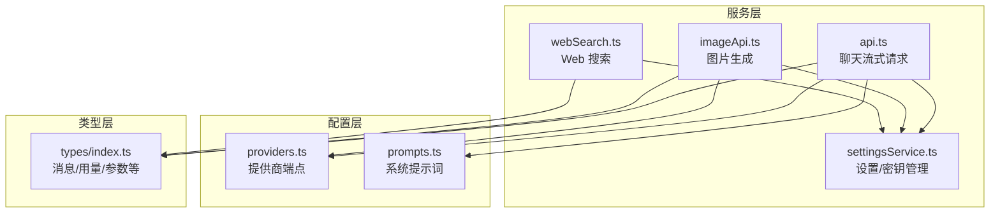
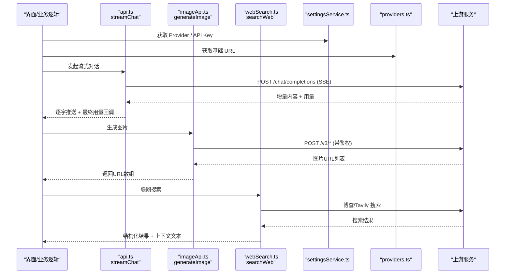
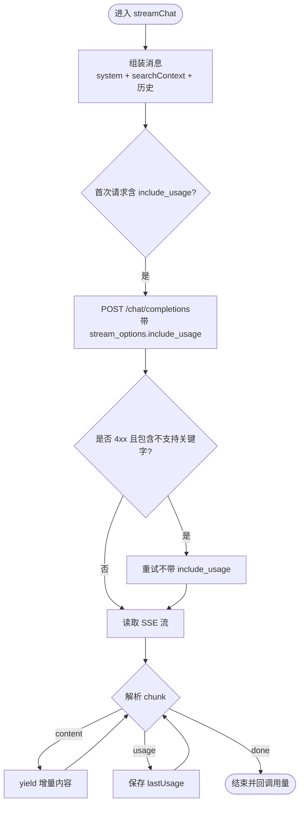
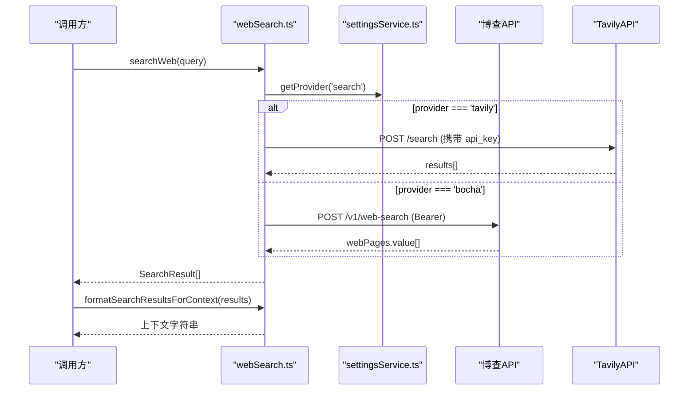
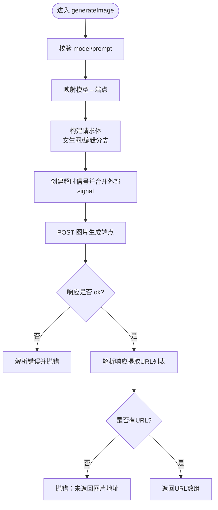
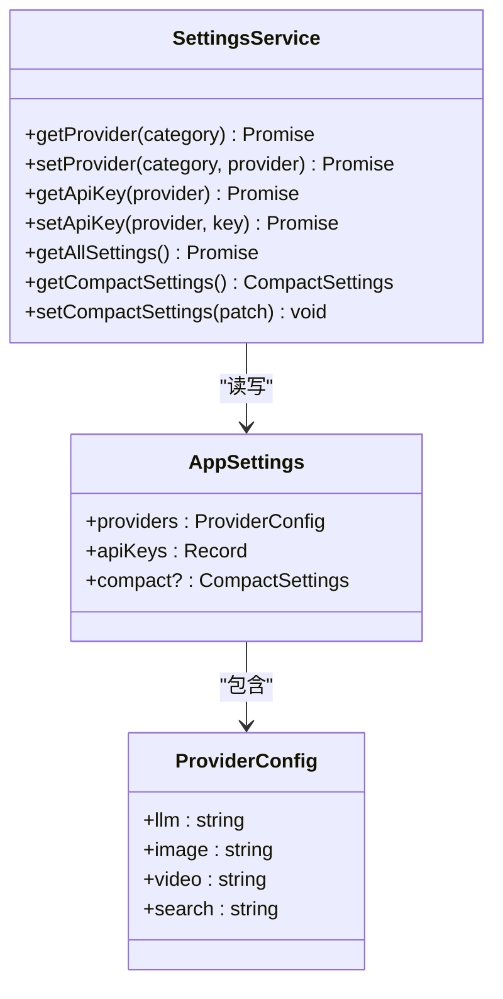
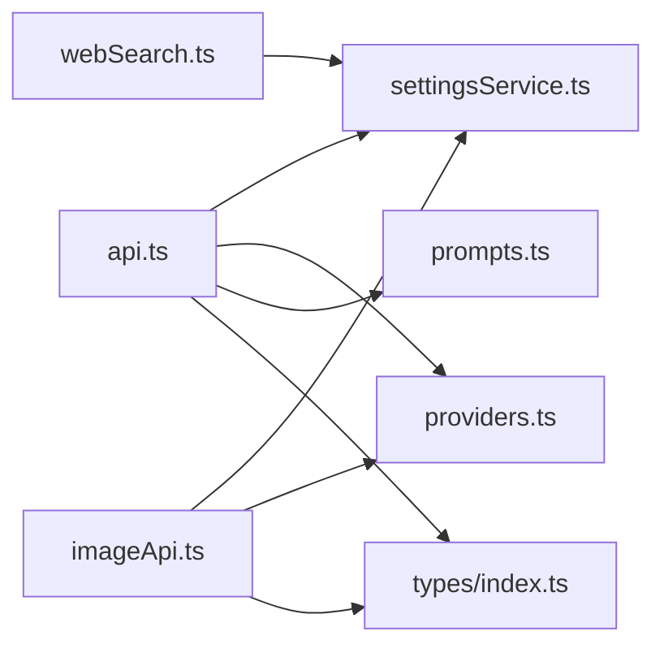

# API 集成

<cite>
**本文引用的文件**
- [src/services/api.ts](file://src/services/api.ts)
- [src/services/webSearch.ts](file://src/services/webSearch.ts)
- [src/services/imageApi.ts](file://src/services/imageApi.ts)
- [src/services/settingsService.ts](file://src/services/settingsService.ts)
- [src/config/providers.ts](file://src/config/providers.ts)
- [src/config/prompts.ts](file://src/config/prompts.ts)
- [src/types/index.ts](file://src/types/index.ts)
</cite>

## 目录
1. [简介](#简介)
2. [项目结构](#项目结构)
3. [核心组件](#核心组件)
4. [架构总览](#架构总览)
5. [详细组件分析](#详细组件分析)
6. [依赖关系分析](#依赖关系分析)
7. [性能考虑](#性能考虑)
8. [故障排查指南](#故障排查指南)
9. [结论](#结论)
10. [附录](#附录)

## 简介
本文件为 AIShop 前端 API 集成层的全面文档，聚焦于：
- 聊天流式请求封装、错误处理与重试机制
- Web 搜索服务集成（博查/Tavily）与结果格式化
- 图片生成服务的模型路由、参数构建与响应解析
- 设置服务（Provider 与 API Key）的配置管理与动态更新
- 后端接口调用约定（基于 OpenAI 兼容协议）
- 认证授权与安全注意事项
- 第三方服务集成方式与配置方法
- 调用示例与错误处理最佳实践

## 项目结构
前端通过 services 层统一封装对外部服务的调用，config 层管理提供商端点与系统提示词，types 层定义数据契约。

图表来源
- [src/services/api.ts:44-173](file://src/services/api.ts#L44-L173)
- [src/services/imageApi.ts:149-243](file://src/services/imageApi.ts#L149-L243)
- [src/services/webSearch.ts:23-117](file://src/services/webSearch.ts#L23-L117)
- [src/services/settingsService.ts:59-100](file://src/services/settingsService.ts#L59-L100)
- [src/config/providers.ts:7-18](file://src/config/providers.ts#L7-L18)
- [src/config/prompts.ts:47-53](file://src/config/prompts.ts#L47-L53)
- [src/types/index.ts:34-42](file://src/types/index.ts#L34-L42)

章节来源
- [src/services/api.ts:44-173](file://src/services/api.ts#L44-L173)
- [src/services/imageApi.ts:149-243](file://src/services/imageApi.ts#L149-L243)
- [src/services/webSearch.ts:23-117](file://src/services/webSearch.ts#L23-L117)
- [src/services/settingsService.ts:59-100](file://src/services/settingsService.ts#L59-L100)
- [src/config/providers.ts:7-18](file://src/config/providers.ts#L7-L18)
- [src/config/prompts.ts:47-53](file://src/config/prompts.ts#L47-L53)
- [src/types/index.ts:34-42](file://src/types/index.ts#L34-L42)

## 核心组件
- 聊天流式服务：提供流式对话能力，自动注入系统提示词与联网搜索结果上下文，支持用量统计与失败回退重试。
- 图片生成服务：按模型路由到不同上游端点，统一构建请求体并解析多种响应格式，内置超时与取消控制。
- Web 搜索服务：根据设置选择博查或 Tavily，统一返回结构化结果并提供上下文格式化。
- 设置服务：持久化 Provider 与 API Key，支持动态切换与读取。
- 提供商配置：集中维护各提供商的聊天与图片基础地址。
- 类型定义：消息、用量、图片生成参数等统一契约。

章节来源
- [src/services/api.ts:44-173](file://src/services/api.ts#L44-L173)
- [src/services/imageApi.ts:149-243](file://src/services/imageApi.ts#L149-L243)
- [src/services/webSearch.ts:23-117](file://src/services/webSearch.ts#L23-L117)
- [src/services/settingsService.ts:59-100](file://src/services/settingsService.ts#L59-L100)
- [src/config/providers.ts:7-18](file://src/config/providers.ts#L7-L18)
- [src/types/index.ts:34-42](file://src/types/index.ts#L34-L42)

## 架构总览
下图展示从 UI 到外部服务的调用路径与关键职责分工。

图表来源
- [src/services/api.ts:44-173](file://src/services/api.ts#L44-L173)
- [src/services/imageApi.ts:149-243](file://src/services/imageApi.ts#L149-L243)
- [src/services/webSearch.ts:23-117](file://src/services/webSearch.ts#L23-L117)
- [src/services/settingsService.ts:59-100](file://src/services/settingsService.ts#L59-L100)
- [src/config/providers.ts:7-18](file://src/config/providers.ts#L7-L18)

## 详细组件分析

### 聊天流式服务（streamChat）
- 功能要点
  - 动态注入系统提示词与可选的联网搜索结果上下文
  - 将本地存储的图片引用转换为 data URL 后发送
  - 使用 SSE 流式接收增量内容与用量信息
  - 对不支持 stream_options 的上游进行自动回退重试
  - 在 finally 中回调真实用量，便于成本统计与缓存命中率分析
- 错误处理
  - 4xx 且包含特定关键字时去掉 include_usage 重试一次
  - 其他 4xx/5xx 直接抛出错误
  - 无响应体时抛出明确错误
- 复杂度与性能
  - 流式解析采用缓冲+行切分，避免全量加载
  - usage 解析兼容多字段命名，降低网关差异影响

图表来源
- [src/services/api.ts:44-173](file://src/services/api.ts#L44-L173)
- [src/config/prompts.ts:47-53](file://src/config/prompts.ts#L47-L53)

章节来源
- [src/services/api.ts:44-173](file://src/services/api.ts#L44-L173)
- [src/config/prompts.ts:47-53](file://src/config/prompts.ts#L47-L53)
- [src/types/index.ts:34-42](file://src/types/index.ts#L34-L42)

### Web 搜索服务（searchWeb）
- 功能要点
  - 根据设置选择博查或 Tavily
  - 统一返回 SearchResult 结构
  - 提供 formatSearchResultsForContext 将结果拼接为系统提示上下文
- 错误处理
  - 任一提供商未配置 API Key 时输出警告并返回空结果
  - 网络或上游错误捕获并返回空结果，保证上层流程不中断
- 结果格式化
  - 博查：name/url/snippet/siteName
  - Tavily：title/url/content → siteName 由 URL 主机名推导

图表来源
- [src/services/webSearch.ts:23-117](file://src/services/webSearch.ts#L23-L117)
- [src/services/settingsService.ts:59-74](file://src/services/settingsService.ts#L59-L74)

章节来源
- [src/services/webSearch.ts:23-117](file://src/services/webSearch.ts#L23-L117)
- [src/services/settingsService.ts:59-74](file://src/services/settingsService.ts#L59-L74)

### 图片生成服务（generateImage）
- 功能要点
  - 按模型映射到具体端点（gpt-image-2、gemini-3.1-flash、gemini-3-pro）
  - 构建请求体：区分文生图与编辑模式；处理 base64/data URI/URL 输入
  - 合并外部取消信号与内部超时信号（默认 120s）
  - 统一解析多种上游响应结构，提取图片 URL 列表
- 错误处理
  - 缺失必填参数抛错
  - 非 2xx 响应尝试解析 detail/error 并抛出友好错误
  - AbortError 区分“用户取消”和“上游超时”
- 性能与安全
  - 超时保护避免长连接挂起
  - 仅传递必要参数，减少无效负载

图表来源
- [src/services/imageApi.ts:6-19](file://src/services/imageApi.ts#L6-L19)
- [src/services/imageApi.ts:66-143](file://src/services/imageApi.ts#L66-L143)
- [src/services/imageApi.ts:149-243](file://src/services/imageApi.ts#L149-L243)

章节来源
- [src/services/imageApi.ts:6-19](file://src/services/imageApi.ts#L6-L19)
- [src/services/imageApi.ts:66-143](file://src/services/imageApi.ts#L66-L143)
- [src/services/imageApi.ts:149-243](file://src/services/imageApi.ts#L149-L243)

### 设置服务（settingsService）
- 功能要点
  - 以 localStorage 持久化 providers 与 apiKeys
  - 提供 get/set Provider 与 API Key 的异步接口
  - 提供 compact 压缩相关设置的默认值与合并策略
- 动态更新
  - 任意时刻修改 Provider 或 API Key 后立即生效
  - 所有服务通过 settingsService 读取最新配置

图表来源
- [src/services/settingsService.ts:5-25](file://src/services/settingsService.ts#L5-L25)
- [src/services/settingsService.ts:59-100](file://src/services/settingsService.ts#L59-L100)

章节来源
- [src/services/settingsService.ts:5-25](file://src/services/settingsService.ts#L5-L25)
- [src/services/settingsService.ts:59-100](file://src/services/settingsService.ts#L59-L100)

### 提供商配置（providers.ts）
- 集中维护 chatBaseUrl 与 imageBaseUrl
- 当前默认 fastapi 提供商指向统一网关地址
- 新增提供商只需扩展 PROVIDERS 并暴露 getProviderConfig

章节来源
- [src/config/providers.ts:1-18](file://src/config/providers.ts#L1-L18)

### 类型定义（types/index.ts）
- 消息、用量、图片生成参数、账单等统一契约
- 用量 TokenUsage 用于记录 prompt/completion/total/cached/cacheWrite 等
- 图片生成参数 ImageGenerationParams 覆盖 prompt/model/images/aspectRatio/size/quality/outputFormat/n

章节来源
- [src/types/index.ts:34-42](file://src/types/index.ts#L34-L42)
- [src/types/index.ts:177-187](file://src/types/index.ts#L177-L187)

## 依赖关系分析
- 聊天流式服务依赖：
  - settingsService 获取 llm Provider 与 API Key
  - providers 获取 chatBaseUrl
  - prompts 获取系统提示词
  - types 中的 Message、TokenUsage
- 图片生成服务依赖：
  - settingsService 获取 image Provider 与 API Key
  - providers 获取 imageBaseUrl
  - types 中的 ImageGenerationParams
- Web 搜索服务依赖：
  - settingsService 获取 search Provider 与各引擎 API Key
  - 直接调用上游搜索 API

图表来源
- [src/services/api.ts:44-173](file://src/services/api.ts#L44-L173)
- [src/services/imageApi.ts:149-243](file://src/services/imageApi.ts#L149-L243)
- [src/services/webSearch.ts:23-117](file://src/services/webSearch.ts#L23-L117)
- [src/services/settingsService.ts:59-100](file://src/services/settingsService.ts#L59-L100)
- [src/config/providers.ts:7-18](file://src/config/providers.ts#L7-L18)
- [src/config/prompts.ts:47-53](file://src/config/prompts.ts#L47-L53)
- [src/types/index.ts:34-42](file://src/types/index.ts#L34-L42)

章节来源
- [src/services/api.ts:44-173](file://src/services/api.ts#L44-L173)
- [src/services/imageApi.ts:149-243](file://src/services/imageApi.ts#L149-L243)
- [src/services/webSearch.ts:23-117](file://src/services/webSearch.ts#L23-L117)
- [src/services/settingsService.ts:59-100](file://src/services/settingsService.ts#L59-L100)
- [src/config/providers.ts:7-18](file://src/config/providers.ts#L7-L18)
- [src/config/prompts.ts:47-53](file://src/config/prompts.ts#L47-L53)
- [src/types/index.ts:34-42](file://src/types/index.ts#L34-L42)

## 性能考虑
- 聊天流式
  - 使用 TextDecoder 与缓冲行切分，避免大对象内存占用
  - 对不支持的 stream_options 做最小化重试，减少失败开销
- 图片生成
  - 120s 超时保护，防止长连接阻塞
  - 合并外部取消信号，及时释放资源
- Web 搜索
  - 失败时返回空结果，避免阻断主流程
  - 结果格式化仅在需要时执行，减少不必要计算

[本节为通用指导，无需特定文件来源]

## 故障排查指南
- 聊天流式
  - 现象：首次请求 4xx 且包含 stream_options/include_usage/unknown/unsupported/invalid
    - 处理：自动去掉 include_usage 重试一次
  - 现象：无响应体
    - 处理：抛出“No response body”，检查网络与上游状态
  - 现象：用量未回调
    - 处理：确认上游是否返回 usage 字段；若未返回则不会触发回调
- 图片生成
  - 现象：AbortError
    - 区分：用户主动取消 vs 上游超时（120s），分别抛出不同错误
  - 现象：非 2xx
    - 处理：优先取 detail/error.message，否则使用 status 描述
  - 现象：未返回图片地址
    - 处理：检查上游响应结构与 extractUrls 解析逻辑
- Web 搜索
  - 现象：返回空数组
    - 可能原因：未配置对应 Provider 的 API Key；上游错误或网络异常
- 设置服务
  - 现象：切换 Provider 后未生效
    - 检查是否正确调用 setProvider/getProvider；确认 localStorage 写入成功

章节来源
- [src/services/api.ts:102-118](file://src/services/api.ts#L102-L118)
- [src/services/imageApi.ts:183-243](file://src/services/imageApi.ts#L183-L243)
- [src/services/webSearch.ts:23-36](file://src/services/webSearch.ts#L23-L36)
- [src/services/settingsService.ts:59-100](file://src/services/settingsService.ts#L59-L100)

## 结论
本集成层通过统一的设置与提供商配置，将聊天、图片与搜索三类能力解耦并标准化：
- 聊天流式具备健壮的错误回退与用量统计
- 图片生成支持多模型与多上游响应格式，具备超时与取消保护
- Web 搜索可插拔切换提供商，并提供上下文格式化
- 设置服务提供动态配置能力，确保运行时灵活调整
建议在生产环境结合网关限流、重试与监控指标，进一步提升稳定性与可观测性。

[本节为总结性内容，无需特定文件来源]

## 附录

### 后端 API 接口说明（OpenAI 兼容）
- 聊天接口
  - 路径：{chatBaseUrl}/chat/completions
  - 方法：POST
  - 请求头：Content-Type: application/json；Authorization: Bearer {apiKey}
  - 请求体关键字段：model、messages、stream=true、temperature=0.7；可选 stream_options.include_usage
  - 响应：SSE 流，包含 choices[].delta.content 增量；最后可能包含 usage 的额外 chunk
- 图片接口
  - 路径：{imageBaseUrl}/v3/*（按模型映射到具体端点）
  - 方法：POST
  - 请求头：Content-Type: application/json；Authorization: Bearer {apiKey}
  - 请求体：按模型与模式（文生图/编辑）构建，支持 size/quality/output_format/n/aspect_ratio 等
  - 响应：兼容多种结构，提取图片 URL 列表
- Web 搜索接口
  - 博查：POST https://api.bochaai.com/v1/web-search（Bearer）
  - Tavily：POST https://api.tavily.com/search（body 中 api_key）

章节来源
- [src/services/api.ts:84-100](file://src/services/api.ts#L84-L100)
- [src/services/imageApi.ts:6-19](file://src/services/imageApi.ts#L6-L19)
- [src/services/webSearch.ts:3-4](file://src/services/webSearch.ts#L3-L4)

### 认证授权与安全
- 鉴权方式
  - 聊天与图片：Authorization: Bearer {apiKey}
  - Web 搜索：博查使用 Bearer；Tavily 在请求体中传递 api_key
- 安全建议
  - 不在日志中打印完整 API Key
  - 限制前端可访问的域名与跨域策略
  - 对敏感操作增加二次确认与权限校验

章节来源
- [src/services/api.ts:84-100](file://src/services/api.ts#L84-L100)
- [src/services/imageApi.ts:192-202](file://src/services/imageApi.ts#L192-L202)
- [src/services/webSearch.ts:48-55](file://src/services/webSearch.ts#L48-L55)
- [src/services/webSearch.ts:81-91](file://src/services/webSearch.ts#L81-L91)

### 调用示例与最佳实践
- 聊天流式调用
  - 步骤：准备 messages 与 systemPrompt；调用 streamChat；订阅 yield 增量；在 finally 中处理用量回调
  - 最佳实践：传入 AbortSignal 支持取消；合理设置 temperature；关注 usage 统计
- 图片生成调用
  - 步骤：构造 ImageGenerationParams；调用 generateImage；处理 URL 列表；注意超时与取消
  - 最佳实践：编辑模式需正确传入 base64/data URI/URL；根据模型选择合适的 size/quality/output_format
- Web 搜索调用
  - 步骤：调用 searchWeb；如需上下文，使用 formatSearchResultsForContext 拼接
  - 最佳实践：未配置 API Key 时降级为空结果；捕获异常避免阻断主流程

章节来源
- [src/services/api.ts:44-173](file://src/services/api.ts#L44-L173)
- [src/services/imageApi.ts:149-243](file://src/services/imageApi.ts#L149-L243)
- [src/services/webSearch.ts:23-117](file://src/services/webSearch.ts#L23-L117)

### 第三方服务集成与配置
- 提供商配置
  - 在 providers.ts 中新增 Provider 并设置 chatBaseUrl/imageBaseUrl
  - 通过 settingsService.setProvider 动态切换
- API Key 管理
  - 通过 settingsService.setApiKey 保存各提供商密钥
  - 读取时使用 settingsService.getApiKey
- 搜索提供商
  - 博查：需在设置中配置 bocha 的 API Key
  - Tavily：需在设置中配置 tavily 的 API Key

章节来源
- [src/config/providers.ts:7-18](file://src/config/providers.ts#L7-L18)
- [src/services/settingsService.ts:59-100](file://src/services/settingsService.ts#L59-L100)
- [src/services/webSearch.ts:23-36](file://src/services/webSearch.ts#L23-L36)