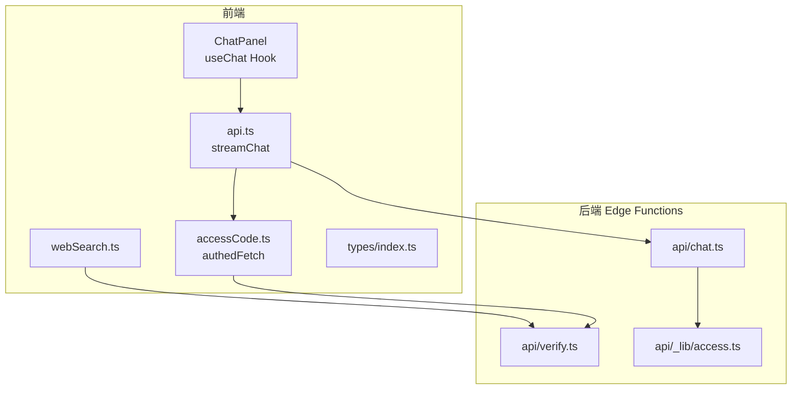
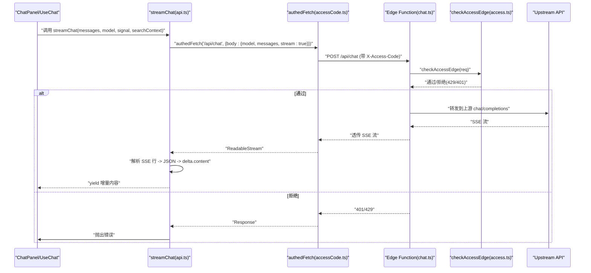
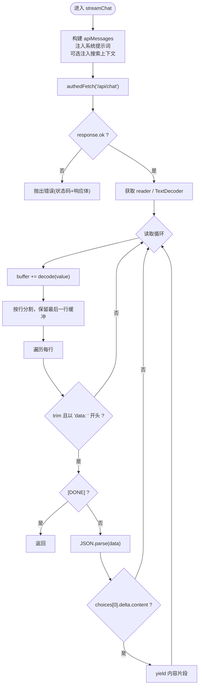
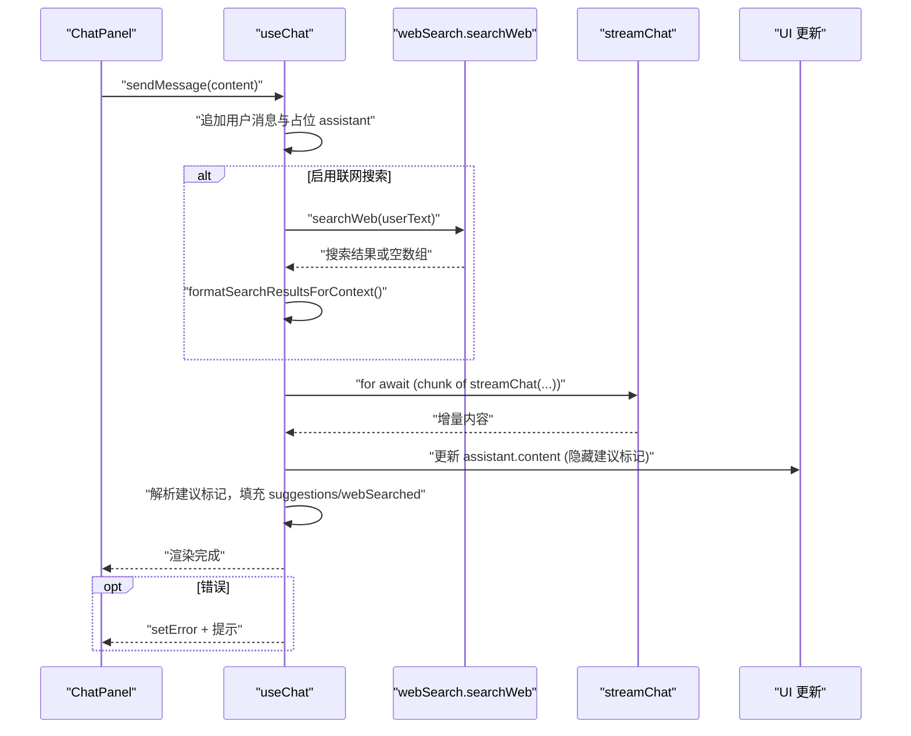
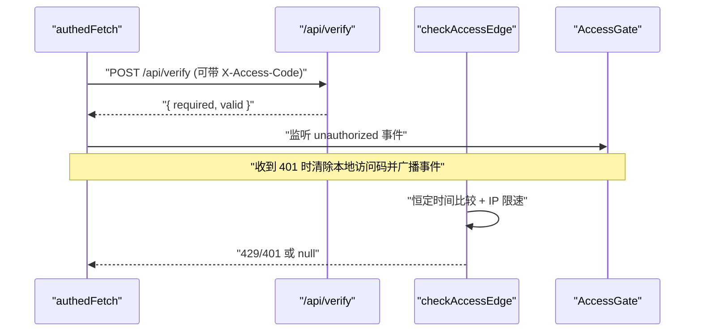
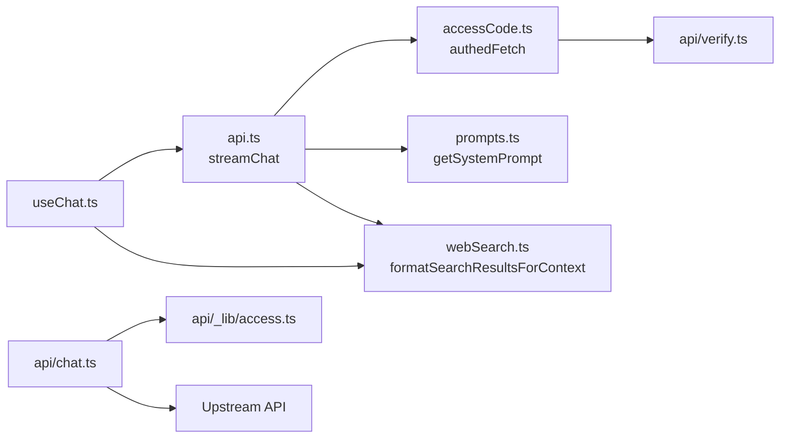

# 前端 API 服务封装

<cite>
**本文档引用的文件**
- [src/services/api.ts](file://src/services/api.ts)
- [api/chat.ts](file://api/chat.ts)
- [src/hooks/useChat.ts](file://src/hooks/useChat.ts)
- [src/services/accessCode.ts](file://src/services/accessCode.ts)
- [api/_lib/access.ts](file://api/_lib/access.ts)
- [src/config/prompts.ts](file://src/config/prompts.ts)
- [src/services/webSearch.ts](file://src/services/webSearch.ts)
- [src/types/index.ts](file://src/types/index.ts)
- [src/components/chat/ChatPanel.tsx](file://src/components/chat/ChatPanel.tsx)
- [src/components/auth/AccessGate.tsx](file://src/components/auth/AccessGate.tsx)
- [api/verify.ts](file://api/verify.ts)
- [src/config/models.ts](file://src/config/models.ts)
</cite>

## 目录
1. [简介](#简介)
2. [项目结构](#项目结构)
3. [核心组件](#核心组件)
4. [架构总览](#架构总览)
5. [详细组件分析](#详细组件分析)
6. [依赖关系分析](#依赖关系分析)
7. [性能考量](#性能考量)
8. [故障排查指南](#故障排查指南)
9. [结论](#结论)
10. [附录](#附录)

## 简介
本文件面向 AIShop 前端的 API 服务封装，重点围绕 streamChat 函数展开，系统性解释其流式 API 处理、AsyncGenerator 使用、实时数据传输机制、请求构建（消息格式转换、系统提示词注入、搜索上下文集成）、错误处理策略（HTTP 状态码检查、响应体解析、异常抛出）、访问控制集成（authedFetch 使用与认证令牌传递），并提供完整的 API 调用示例、最佳实践、性能优化建议与调试技巧。

## 项目结构
AIShop 前端采用“React + Vercel Edge Functions”的前后端分离架构：
- 前端负责 UI、状态管理、流式渲染与用户交互；
- 后端 Edge Functions 负责访问码校验、上游 API 代理与 SSE 透传；
- 服务层封装了 API 调用、访问码管理、搜索集成等通用能力。

图表来源
- [src/services/api.ts:1-83](file://src/services/api.ts#L1-L83)
- [api/chat.ts:1-50](file://api/chat.ts#L1-L50)
- [src/services/accessCode.ts:1-113](file://src/services/accessCode.ts#L1-L113)
- [api/verify.ts:1-33](file://api/verify.ts#L1-L33)
- [api/_lib/access.ts:1-156](file://api/_lib/access.ts#L1-L156)

章节来源
- [src/services/api.ts:1-83](file://src/services/api.ts#L1-L83)
- [api/chat.ts:1-50](file://api/chat.ts#L1-L50)
- [src/services/accessCode.ts:1-113](file://src/services/accessCode.ts#L1-L113)
- [api/verify.ts:1-33](file://api/verify.ts#L1-L33)
- [api/_lib/access.ts:1-156](file://api/_lib/access.ts#L1-L156)

## 核心组件
- streamChat：前端流式聊天主入口，负责构建消息、发起请求、解析 SSE、产出增量内容。
- useChat：聊天业务钩子，协调消息状态、联网搜索、流式渲染与错误处理。
- accessCode.ts：访问码客户端工具，封装 authedFetch 与探测/校验逻辑。
- api/chat.ts：Edge Function 代理，转发到上游 OpenAI 兼容接口，透传 SSE。
- api/_lib/access.ts：访问码校验共享库，含恒定时间比较、IP 限速与失败延迟。
- webSearch.ts：可选的联网搜索服务，提供搜索结果格式化为系统提示词上下文。
- 类型定义：Message、Conversation、Model 等类型约束。

章节来源
- [src/services/api.ts:13-82](file://src/services/api.ts#L13-L82)
- [src/hooks/useChat.ts:69-370](file://src/hooks/useChat.ts#L69-L370)
- [src/services/accessCode.ts:37-57](file://src/services/accessCode.ts#L37-L57)
- [api/chat.ts:11-49](file://api/chat.ts#L11-L49)
- [api/_lib/access.ts:120-155](file://api/_lib/access.ts#L120-L155)
- [src/services/webSearch.ts:20-57](file://src/services/webSearch.ts#L20-L57)
- [src/types/index.ts:1-103](file://src/types/index.ts#L1-L103)

## 架构总览
前端通过 streamChat 发起流式请求，经由 authedFetch 注入访问码头，Edge Function 在服务端进行访问码校验与上游 API 转发，最终以 SSE 形式将增量数据返回前端，前端使用 AsyncGenerator 逐步消费并更新 UI。

图表来源
- [src/services/api.ts:34-51](file://src/services/api.ts#L34-L51)
- [src/services/accessCode.ts:37-57](file://src/services/accessCode.ts#L37-L57)
- [api/chat.ts:16-18](file://api/chat.ts#L16-L18)
- [api/_lib/access.ts:120-155](file://api/_lib/access.ts#L120-L155)

## 详细组件分析

### streamChat 组件分析
- 请求构建
  - 系统提示词注入：通过 getSystemPrompt 获取默认系统提示词，作为首条 system 消息。
  - 搜索上下文集成：当存在 searchContext 时，追加一条 system 消息，将搜索结果摘要注入上下文。
  - 消息映射：将前端 Message 映射为 OpenAI 兼容的 ChatCompletionMessage，保留 role 与 content。
  - 参数设置：model、messages、stream=true、temperature=0.7。
- 认证与访问控制
  - 使用 authedFetch 自动注入 X-Access-Code 请求头，若服务端返回 401，清除本地访问码并广播 unauthorized 事件。
- 流式解析
  - 读取 Response.body 的 Reader，使用 TextDecoder 流式解码。
  - 按行解析，过滤以 "data: " 开头的行，跳过空行与 "[DONE]" 结束标记。
  - 解析 JSON，提取 choices[0].delta.content，yield 给调用方。
- 错误处理
  - 非 OK 状态码：读取文本并抛出包含状态码与错误信息的 Error。
  - 无 body：抛出错误。
  - JSON 解析异常：吞掉异常，继续解析后续行。

图表来源
- [src/services/api.ts:19-82](file://src/services/api.ts#L19-L82)

章节来源
- [src/services/api.ts:13-82](file://src/services/api.ts#L13-L82)
- [src/config/prompts.ts:28-30](file://src/config/prompts.ts#L28-L30)
- [src/services/webSearch.ts:48-57](file://src/services/webSearch.ts#L48-L57)
- [src/services/accessCode.ts:37-57](file://src/services/accessCode.ts#L37-L57)

### useChat 组件分析
- 状态管理
  - conversations、activeId、isLoading、error、webSearchEnabled 等状态持久化到 localStorage。
  - selectedModel 与 lastUsedModel 读取自本地存储。
- 发送消息流程
  - 追加用户消息与占位的 assistant 消息，标记 isStreaming=true。
  - 可选执行联网搜索：提取用户文本，调用 searchWeb，格式化为搜索上下文。
  - 调用 streamChat，for-await-of 逐步接收增量内容，使用 getDisplayContent 隐藏建议标记，更新 assistant 消息。
  - 解析建议标记，填充 suggestions、webSearched、searchResults、webSearchFailed。
- 错误处理
  - 捕获异常：AbortError 快速返回；其他错误统一设置 error 并在 UI 上提示。
  - finally 清理 loading 状态与 AbortController。
- 停止生成
  - 通过 AbortController.abort() 中断流式请求。

图表来源
- [src/hooks/useChat.ts:135-248](file://src/hooks/useChat.ts#L135-L248)
- [src/services/webSearch.ts:20-46](file://src/services/webSearch.ts#L20-L46)
- [src/services/webSearch.ts:48-57](file://src/services/webSearch.ts#L48-L57)

章节来源
- [src/hooks/useChat.ts:69-370](file://src/hooks/useChat.ts#L69-L370)
- [src/services/webSearch.ts:20-57](file://src/services/webSearch.ts#L20-L57)

### 访问控制与认证集成
- 客户端
  - authedFetch：自动从 localStorage 读取访问码，注入 X-Access-Code 请求头；收到 401 时清除本地访问码并广播 unauthorized 事件，供 AccessGate 监听并切换到登录态。
  - probeAccessCode：探测服务端是否要求访问码及本地访问码是否有效，用于初始化时决定是否显示登录界面。
  - verifyAccessCode：校验某个访问码是否正确，支持返回锁定剩余秒数。
- 服务端
  - api/verify.ts：判断服务端是否启用访问码校验，返回 required 与 valid 状态。
  - api/_lib/access.ts：checkAccessEdge 实现恒定时间比较、IP 限速与失败延迟，返回 429/401 或 null。
  - api/chat.ts：在 Edge Runtime 中调用 checkAccessEdge，未通过则直接返回相应错误；通过则转发到上游 API 并透传 SSE。

图表来源
- [src/services/accessCode.ts:66-79](file://src/services/accessCode.ts#L66-L79)
- [src/services/accessCode.ts:88-110](file://src/services/accessCode.ts#L88-L110)
- [api/verify.ts:11-32](file://api/verify.ts#L11-L32)
- [api/_lib/access.ts:120-155](file://api/_lib/access.ts#L120-L155)

章节来源
- [src/services/accessCode.ts:37-57](file://src/services/accessCode.ts#L37-L57)
- [src/services/accessCode.ts:66-110](file://src/services/accessCode.ts#L66-L110)
- [api/verify.ts:11-32](file://api/verify.ts#L11-L32)
- [api/_lib/access.ts:120-155](file://api/_lib/access.ts#L120-L155)

### Edge Function 代理与 SSE 透传
- api/chat.ts
  - 仅允许 POST 方法，调用 checkAccessEdge 进行访问码校验。
  - 读取请求体并转发到上游 chat/completions，透传上游响应体（SSE）与头部。
  - 若未配置密钥，返回 500 并提示未配置。

章节来源
- [api/chat.ts:11-49](file://api/chat.ts#L11-L49)
- [api/_lib/access.ts:120-155](file://api/_lib/access.ts#L120-L155)

## 依赖关系分析
- 组件耦合
  - streamChat 依赖：authedFetch、getSystemPrompt、webSearch.formatSearchResultsForContext。
  - useChat 依赖：streamChat、webSearch、storage、titleGenerator、models。
  - 访问控制：authedFetch 依赖 localStorage 与 /api/verify。
- 外部依赖
  - Vercel Edge Runtime：服务端运行时，支持 fetch、Headers、ReadableStream。
  - 上游 OpenAI 兼容接口：SSE 流式响应。

图表来源
- [src/services/api.ts:1-83](file://src/services/api.ts#L1-L83)
- [src/services/accessCode.ts:1-113](file://src/services/accessCode.ts#L1-L113)
- [api/chat.ts:1-50](file://api/chat.ts#L1-L50)
- [api/_lib/access.ts:1-156](file://api/_lib/access.ts#L1-L156)
- [src/services/webSearch.ts:1-58](file://src/services/webSearch.ts#L1-L58)
- [src/config/prompts.ts:1-31](file://src/config/prompts.ts#L1-L31)

章节来源
- [src/services/api.ts:1-83](file://src/services/api.ts#L1-L83)
- [src/hooks/useChat.ts:1-370](file://src/hooks/useChat.ts#L1-L370)
- [src/services/accessCode.ts:1-113](file://src/services/accessCode.ts#L1-L113)
- [api/chat.ts:1-50](file://api/chat.ts#L1-L50)
- [api/_lib/access.ts:1-156](file://api/_lib/access.ts#L1-L156)
- [src/services/webSearch.ts:1-58](file://src/services/webSearch.ts#L1-L58)
- [src/config/prompts.ts:1-31](file://src/config/prompts.ts#L1-L31)

## 性能考量
- 流式渲染
  - 使用 AsyncGenerator 逐步渲染，避免一次性拼接大字符串导致主线程阻塞。
  - 建议在 UI 层使用虚拟滚动与懒加载，减少 DOM 更新压力。
- SSE 解析
  - 使用 TextDecoder 流式解码，按行解析，避免全量缓存。
  - 对异常 JSON 行进行容错处理，保证稳定性。
- 网络与并发
  - 使用 AbortController 控制请求生命周期，及时取消不再需要的请求。
  - 服务端 Edge Function 透传 SSE，避免额外序列化开销。
- 存储与状态
  - 会话与模型选择持久化到 localStorage，减少重复计算与网络请求。
- 搜索上下文
  - 搜索结果仅在启用联网搜索时注入，避免不必要的上下文膨胀。

[本节为通用性能建议，无需特定文件来源]

## 故障排查指南
- 常见错误与定位
  - 401 未授权：检查本地访问码是否正确、是否被服务端 401 清除；确认 /api/verify 返回 required/valid 状态。
  - 429 限速：服务端对失败尝试进行 IP 限速与延迟，等待锁定时间后重试。
  - 500 服务端错误：检查服务端是否配置了密钥；查看 Edge Function 日志。
  - 无响应体：确保上游 API 返回可读流；检查浏览器对 SSE 的支持。
- 调试技巧
  - 在浏览器开发者工具 Network 面板观察 /api/chat 的 SSE 流，确认 data: 行与 [DONE] 结束标记。
  - 在控制台监听 unauthorized 事件，验证 authedFetch 的 401 处理链路。
  - 使用 AbortController.abort() 验证中断逻辑，观察 UI 是否正确停止渲染。
  - 打印 getDisplayContent 与 parseSuggestions 的中间结果，确认建议标记处理逻辑。
- 最佳实践
  - 在 UI 层对建议标记进行隐藏处理，避免中间状态闪现。
  - 对搜索失败进行降级处理，不影响主对话流。
  - 对异常 JSON 行进行吞并，保证流式体验连续性。

章节来源
- [src/services/accessCode.ts:49-54](file://src/services/accessCode.ts#L49-L54)
- [api/chat.ts:20-26](file://api/chat.ts#L20-L26)
- [src/hooks/useChat.ts:231-247](file://src/hooks/useChat.ts#L231-L247)

## 结论
AIShop 的前端 API 服务封装以 streamChat 为核心，结合 useChat 的状态管理与 UI 渲染，实现了稳定、可扩展的流式聊天体验。通过访问码校验与 Edge Function 代理，系统在安全性与性能之间取得平衡。建议在生产环境中持续关注 SSE 稳定性、错误处理与用户体验细节，以获得更佳的交互质量。

[本节为总结性内容，无需特定文件来源]

## 附录

### API 调用示例与最佳实践
- 基本调用
  - 参数：messages（包含系统提示词与历史对话）、model（如 gpt-5.4-nano）、signal（可选 AbortController.signal）、searchContext（可选）。
  - 流式处理：for-await-of 遍历增量内容，逐步更新 UI。
  - 错误处理：捕获异常并根据错误类型进行提示或重试。
- 搜索上下文集成
  - 在启用联网搜索时，先调用 searchWeb，再将格式化后的上下文注入到 system 消息中。
- 认证与访问控制
  - 使用 authedFetch 自动注入访问码；在收到 401 时清除本地访问码并触发登录界面。
- 性能优化
  - 使用虚拟滚动与懒加载；避免一次性渲染大量 DOM；合理使用 AbortController 控制请求生命周期。

章节来源
- [src/services/api.ts:13-82](file://src/services/api.ts#L13-L82)
- [src/hooks/useChat.ts:135-248](file://src/hooks/useChat.ts#L135-L248)
- [src/services/webSearch.ts:20-57](file://src/services/webSearch.ts#L20-L57)
- [src/services/accessCode.ts:37-57](file://src/services/accessCode.ts#L37-L57)