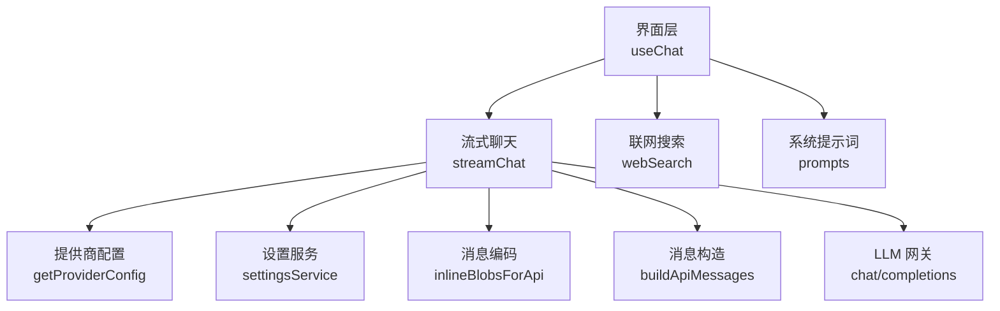
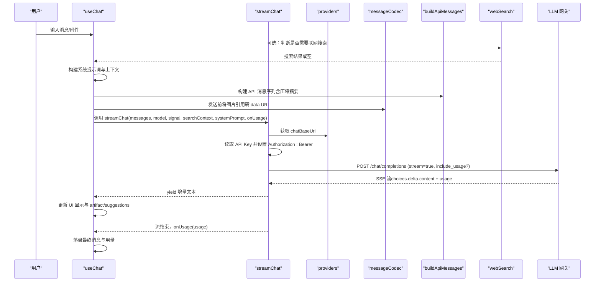
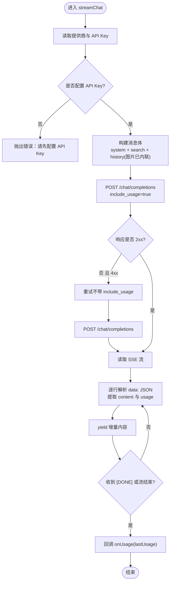
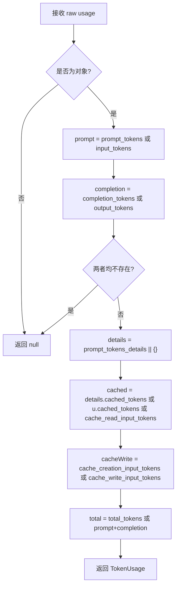
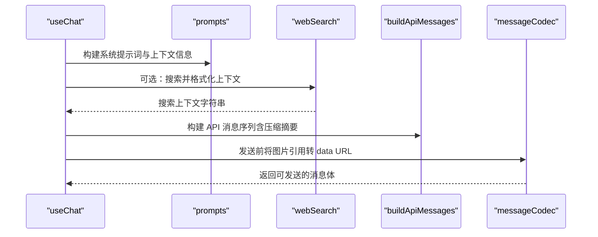
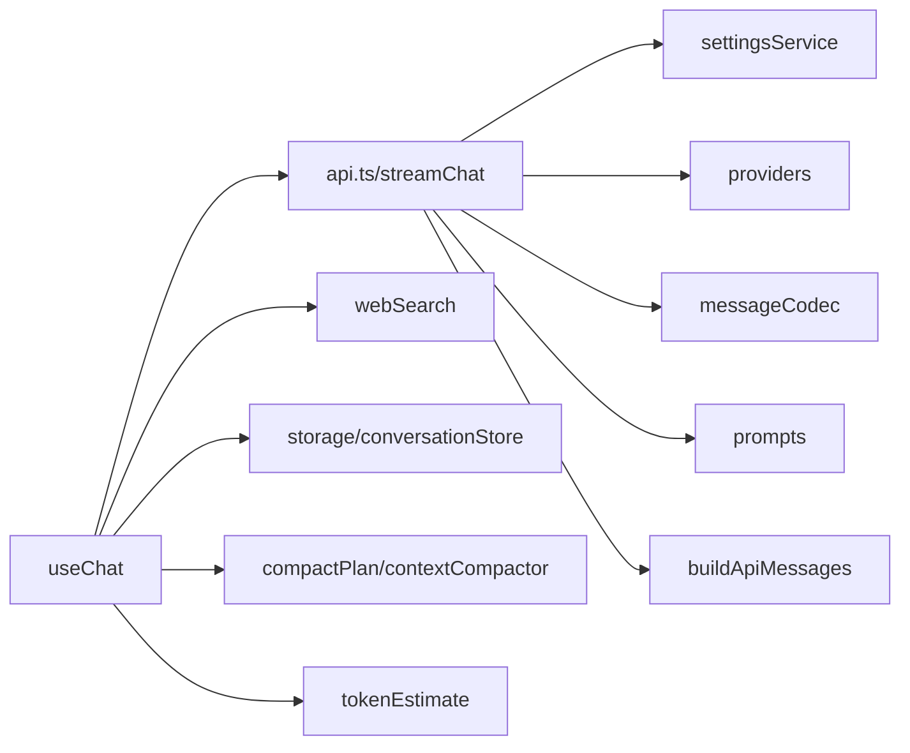

# 前端 API 服务层

<cite>
**本文引用的文件**
- [src/services/api.ts](file://src/services/api.ts)
- [src/hooks/useChat.ts](file://src/hooks/useChat.ts)
- [src/types/index.ts](file://src/types/index.ts)
- [src/config/providers.ts](file://src/config/providers.ts)
- [src/config/prompts.ts](file://src/config/prompts.ts)
- [src/db/messageCodec.ts](file://src/db/messageCodec.ts)
- [src/utils/buildApiMessages.ts](file://src/utils/buildApiMessages.ts)
- [src/services/webSearch.ts](file://src/services/webSearch.ts)
- [src/services/settingsService.ts](file://src/services/settingsService.ts)
</cite>

## 目录
1. [简介](#简介)
2. [项目结构](#项目结构)
3. [核心组件](#核心组件)
4. [架构总览](#架构总览)
5. [详细组件分析](#详细组件分析)
6. [依赖关系分析](#依赖关系分析)
7. [性能考量](#性能考量)
8. [故障排查指南](#故障排查指南)
9. [结论](#结论)
10. [附录：请求与响应示例](#附录请求与响应示例)

## 简介
本文件面向 AIShop 前端 API 服务层，重点说明流式聊天实现、TokenUsage 解析、消息处理流程（系统提示词注入、搜索上下文集成、图片 Blob 内联转换）、认证授权机制（API Key 获取与 Bearer Token 设置），并提供完整的请求/响应示例与错误处理最佳实践，以及性能优化建议与调试技巧。

## 项目结构
- 服务层入口：streamChat 位于 src/services/api.ts，负责构建请求、发起 SSE 流、解析增量内容与用量。
- 调用方：useChat Hook 编排发送消息、搜索上下文、压缩策略、UI 状态更新与错误处理。
- 配置与提供商：src/config/providers.ts 提供 chatBaseUrl；src/config/prompts.ts 提供系统提示词与上下文信息。
- 数据编解码：src/db/messageCodec.ts 负责图片 Blob 的 data URL 内联与引用还原。
- 消息构造：src/utils/buildApiMessages.ts 将会话与压缩区间转换为 API 消息序列。
- 联网搜索：src/services/webSearch.ts 统一接入博查/Tavily，并格式化为上下文文本。
- 设置与鉴权：src/services/settingsService.ts 管理提供商与 API Key。

图表来源
- [src/services/api.ts:44-172](file://src/services/api.ts#L44-L172)
- [src/config/providers.ts:1-19](file://src/config/providers.ts#L1-L19)
- [src/services/settingsService.ts:59-100](file://src/services/settingsService.ts#L59-L100)
- [src/db/messageCodec.ts:57-79](file://src/db/messageCodec.ts#L57-L79)
- [src/utils/buildApiMessages.ts:27-65](file://src/utils/buildApiMessages.ts#L27-L65)
- [src/services/webSearch.ts:23-36](file://src/services/webSearch.ts#L23-L36)
- [src/config/prompts.ts:51-93](file://src/config/prompts.ts#L51-L93)

章节来源
- [src/services/api.ts:44-172](file://src/services/api.ts#L44-L172)
- [src/hooks/useChat.ts:494-783](file://src/hooks/useChat.ts#L494-L783)
- [src/config/providers.ts:1-19](file://src/config/providers.ts#L1-L19)
- [src/config/prompts.ts:51-93](file://src/config/prompts.ts#L51-L93)
- [src/db/messageCodec.ts:57-79](file://src/db/messageCodec.ts#L57-L79)
- [src/utils/buildApiMessages.ts:27-65](file://src/utils/buildApiMessages.ts#L27-L65)
- [src/services/webSearch.ts:23-36](file://src/services/webSearch.ts#L23-L36)
- [src/services/settingsService.ts:59-100](file://src/services/settingsService.ts#L59-L100)

## 核心组件
- streamChat：基于 AsyncGenerator 的流式聊天函数，负责读取 SSE 流、解析增量内容、提取用量、容错重试。
- parseUsage：多网关兼容的 TokenUsage 解析器，兜底多种字段命名。
- buildSystemPrompt / getSystemPrompt：组装系统提示词与基础上下文信息。
- inlineBlobsForApi：在发送前将 IndexedDB 中的图片引用转为 data URL。
- buildApiMessages：将会话与压缩摘要合并为 API 消息序列。
- searchWeb + formatSearchResultsForContext：联网搜索并格式化为上下文注入。
- settingsService：提供商与 API Key 的存取。

章节来源
- [src/services/api.ts:17-42](file://src/services/api.ts#L17-L42)
- [src/services/api.ts:44-172](file://src/services/api.ts#L44-L172)
- [src/config/prompts.ts:51-93](file://src/config/prompts.ts#L51-L93)
- [src/db/messageCodec.ts:57-79](file://src/db/messageCodec.ts#L57-L79)
- [src/utils/buildApiMessages.ts:27-65](file://src/utils/buildApiMessages.ts#L27-L65)
- [src/services/webSearch.ts:107-117](file://src/services/webSearch.ts#L107-L117)
- [src/services/settingsService.ts:59-100](file://src/services/settingsService.ts#L59-L100)

## 架构总览
下图展示一次“发送消息”的端到端流程：从 UI 触发到流式输出完成，包含搜索上下文注入、系统提示词注入、图片内联、SSE 流读取与用量回调。

图表来源
- [src/hooks/useChat.ts:494-783](file://src/hooks/useChat.ts#L494-L783)
- [src/services/api.ts:44-172](file://src/services/api.ts#L44-L172)
- [src/config/providers.ts:1-19](file://src/config/providers.ts#L1-L19)
- [src/db/messageCodec.ts:57-79](file://src/db/messageCodec.ts#L57-L79)
- [src/utils/buildApiMessages.ts:27-65](file://src/utils/buildApiMessages.ts#L27-L65)
- [src/services/webSearch.ts:23-36](file://src/services/webSearch.ts#L23-L36)

## 详细组件分析

### streamChat：流式聊天与 SSE 处理
- 参数与职责
  - messages：已按压缩视图与图片内联处理后的消息数组。
  - model：当前模型 ID。
  - signal：AbortSignal，支持取消。
  - searchContext：联网搜索结果拼接的上下文字符串。
  - systemPrompt：系统提示词（可覆盖默认）。
  - onUsage：流结束时回调真实用量。
- 关键流程
  - 读取提供商与 API Key，校验缺失时抛出错误。
  - 构建消息体：system 提示词 + 可选搜索上下文 + 历史消息（图片已内联）。
  - 首次请求携带 stream_options.include_usage=true；若网关不支持（4xx），自动重试不带该参数。
  - 使用 ReadableStream + TextDecoder 分块读取，按行解析 data: JSON 片段。
  - 每个 chunk 都检查 usage，避免遗漏末尾仅带 usage 的片段。
  - 遇到 [DONE] 或流结束，finally 中回调 onUsage。
- 错误处理
  - 未配置 API Key 直接抛错。
  - 非 2xx 且非 4xx 的 include_usage 失败，直接抛错。
  - 网络错误或无效响应体抛错。
- 性能要点
  - 仅在发送前对当前轮次消息进行图片内联，避免提前展开整段历史。
  - 增量解析采用缓冲+分割，减少内存分配。

图表来源
- [src/services/api.ts:44-172](file://src/services/api.ts#L44-L172)

章节来源
- [src/services/api.ts:44-172](file://src/services/api.ts#L44-L172)

### TokenUsage 解析逻辑
- 目标：兼容不同网关返回的 usage 字段差异（如 prompt_tokens/input_tokens、completion_tokens/output_tokens、cached_tokens/cache_read_input_tokens、cache_creation_input_tokens 等）。
- 策略：
  - 优先取标准字段，否则回退到别名。
  - totalTokens 优先用网关返回，否则用 prompt + completion 求和。
  - cachedTokens 与 cacheWriteTokens 可选，用于成本核算与缓存命中率分析。
- 复杂度：O(1)，仅对象字段访问与数值判定。

图表来源
- [src/services/api.ts:17-42](file://src/services/api.ts#L17-L42)

章节来源
- [src/services/api.ts:17-42](file://src/services/api.ts#L17-L42)
- [src/types/index.ts:29-42](file://src/types/index.ts#L29-L42)

### 消息处理流程：系统提示词、搜索上下文、图片内联
- 系统提示词注入
  - 默认系统提示词来自 prompts，包含回复格式、建议生成等约束。
  - useChat 会附加基础上下文信息（时间、时区、语言、设备、当前模型）。
- 搜索上下文集成
  - 根据用户问题与小模型判断决定是否联网搜索。
  - 搜索结果通过 formatSearchResultsForContext 拼接为一段 system 上下文，插入到消息序列。
- 图片 Blob 内联转换
  - 消息中的图片以 aishop-blob:<id> 引用存储。
  - 发送前通过 inlineBlobsForApi 将引用还原为 data URL，确保模型可读。
  - 仅在发送前执行，避免提前加载整段历史图片造成内存压力。

图表来源
- [src/config/prompts.ts:51-93](file://src/config/prompts.ts#L51-L93)
- [src/services/webSearch.ts:107-117](file://src/services/webSearch.ts#L107-L117)
- [src/utils/buildApiMessages.ts:27-65](file://src/utils/buildApiMessages.ts#L27-L65)
- [src/db/messageCodec.ts:57-79](file://src/db/messageCodec.ts#L57-L79)

章节来源
- [src/config/prompts.ts:51-93](file://src/config/prompts.ts#L51-L93)
- [src/services/webSearch.ts:23-36](file://src/services/webSearch.ts#L23-L36)
- [src/utils/buildApiMessages.ts:27-65](file://src/utils/buildApiMessages.ts#L27-L65)
- [src/db/messageCodec.ts:57-79](file://src/db/messageCodec.ts#L57-L79)
- [src/hooks/useChat.ts:494-783](file://src/hooks/useChat.ts#L494-L783)

### 认证授权机制：API Key 与 Bearer Token
- API Key 获取
  - 通过 settingsService.getProvider('llm') 确定提供商。
  - 通过 settingsService.getApiKey(provider) 读取本地存储的密钥。
- Bearer Token 设置
  - 在请求头中设置 Authorization: Bearer ${apiKey}。
  - 若未配置 API Key，立即抛出错误，阻止无凭据请求。
- 扩展点
  - 其他服务（如联网搜索、用量账单）也遵循相同模式：先读 provider 与 apiKey，再拼接到请求头或参数。

章节来源
- [src/services/api.ts:53-90](file://src/services/api.ts#L53-L90)
- [src/services/settingsService.ts:59-100](file://src/services/settingsService.ts#L59-L100)
- [src/services/webSearch.ts:41-69](file://src/services/webSearch.ts#L41-L69)

### 错误处理与重试机制
- 请求阶段
  - 缺少 API Key：直接抛错。
  - 首次请求携带 include_usage=true；若网关不支持（4xx 且错误文本匹配 stream_options/include_usage/unknown/unsupported/invalid），则去掉该参数重试一次。
  - 非 2xx 且不属于上述重试场景：抛错并附带状态码与响应体。
- 流阶段
  - 无响应体：抛错。
  - 解析 JSON 失败：跳过残缺片段，继续消费后续数据。
- 取消与中断
  - 通过 AbortController 支持用户停止生成；useChat 捕获 AbortError 并更新 UI 状态。

章节来源
- [src/services/api.ts:53-118](file://src/services/api.ts#L53-L118)
- [src/services/api.ts:120-172](file://src/services/api.ts#L120-L172)
- [src/hooks/useChat.ts:741-780](file://src/hooks/useChat.ts#L741-L780)

## 依赖关系分析
- streamChat 依赖
  - settingsService：提供商与 API Key。
  - providers：chatBaseUrl。
  - messageCodec：图片内联。
  - prompts：系统提示词。
  - buildApiMessages：消息序列构造。
- useChat 依赖
  - streamChat：流式输出。
  - webSearch：联网搜索。
  - storage/conversationStore：持久化与恢复。
  - compactPlan/contextCompactor：上下文压缩。
  - tokenEstimate：用量估算与汇总。

图表来源
- [src/services/api.ts:44-172](file://src/services/api.ts#L44-L172)
- [src/hooks/useChat.ts:494-783](file://src/hooks/useChat.ts#L494-L783)

章节来源
- [src/services/api.ts:44-172](file://src/services/api.ts#L44-L172)
- [src/hooks/useChat.ts:494-783](file://src/hooks/useChat.ts#L494-L783)

## 性能考量
- 图片内联时机
  - 仅在发送前对当前轮次消息进行内联，避免提前加载整段历史图片导致内存峰值。
- 流式解析
  - 使用 TextDecoder 流式解码与缓冲分割，降低内存占用与 GC 压力。
- 用量统计
  - 每次 chunk 都检查 usage，避免遗漏末尾仅带 usage 的片段。
- 上下文压缩
  - 在发送前评估阈值，必要时压缩冷区间，减少 prompt 长度与成本。
- 并发与取消
  - 使用 AbortController 及时中断长耗时请求，释放资源。

[本节为通用性能指导，不直接分析具体文件]

## 故障排查指南
- 常见问题
  - 未配置 API Key：检查设置面板是否正确保存提供商与密钥。
  - 网关不支持 include_usage：自动重试逻辑应生效；若仍失败，查看错误文本是否匹配关键词。
  - 图片无法显示：确认 IndexedDB 中存在对应 blob，且 inlineBlobsForApi 能成功读取。
  - 搜索结果为空：检查搜索提供商配置与密钥，或降级为不使用联网搜索。
- 调试技巧
  - 在浏览器开发者工具 Network 面板查看 SSE 流与请求头。
  - 在 Console 中打印 parseUsage 中间结果，验证字段映射。
  - 临时关闭 include_usage 以排除网关兼容性问题。
  - 使用 useChat 的错误状态与消息标记（stoppedByUser、webSearchFailed）定位问题阶段。

章节来源
- [src/services/api.ts:53-118](file://src/services/api.ts#L53-L118)
- [src/services/api.ts:120-172](file://src/services/api.ts#L120-L172)
- [src/hooks/useChat.ts:741-780](file://src/hooks/useChat.ts#L741-L780)
- [src/services/webSearch.ts:41-69](file://src/services/webSearch.ts#L41-L69)

## 结论
本服务层通过 streamChat 实现了稳定、可扩展的流式聊天能力，结合多网关兼容的 TokenUsage 解析、智能的系统提示词与搜索上下文注入、以及高效的图片内联与压缩策略，提供了良好的用户体验与成本控制。配合完善的错误处理与调试手段，可在复杂网络与网关环境下保持鲁棒性。

[本节为总结性内容，不直接分析具体文件]

## 附录：请求与响应示例
- 请求示例（OpenAI 兼容接口）
  - 方法：POST
  - 路径：{chatBaseUrl}/chat/completions
  - 头部：
    - Content-Type: application/json
    - Authorization: Bearer {apiKey}
  - 主体字段：
    - model: string（例如 gpt-5.4-nano）
    - messages: Array<{role, content}>（system 提示词 + 搜索上下文 + 历史消息）
    - stream: true
    - stream_options.include_usage: true（可选，部分网关不支持）
    - temperature: 0.7
- 响应示例（SSE 流）
  - 数据行格式：data: {JSON}
  - 增量内容：choices[0].delta.content
  - 用量统计：usage.prompt_tokens / completion_tokens / total_tokens（字段名可能因网关而异）
  - 结束标记：data: [DONE]
- 错误示例
  - 4xx（不包含 include_usage 支持）：自动重试不带该参数
  - 5xx 或其他错误：抛出错误并附带状态码与响应体

章节来源
- [src/services/api.ts:84-118](file://src/services/api.ts#L84-L118)
- [src/services/api.ts:120-172](file://src/services/api.ts#L120-L172)
- [src/config/providers.ts:1-19](file://src/config/providers.ts#L1-L19)