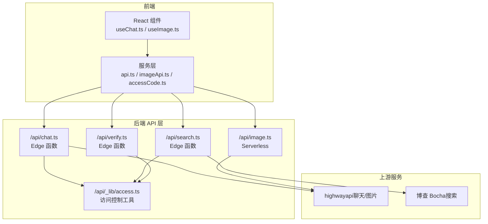
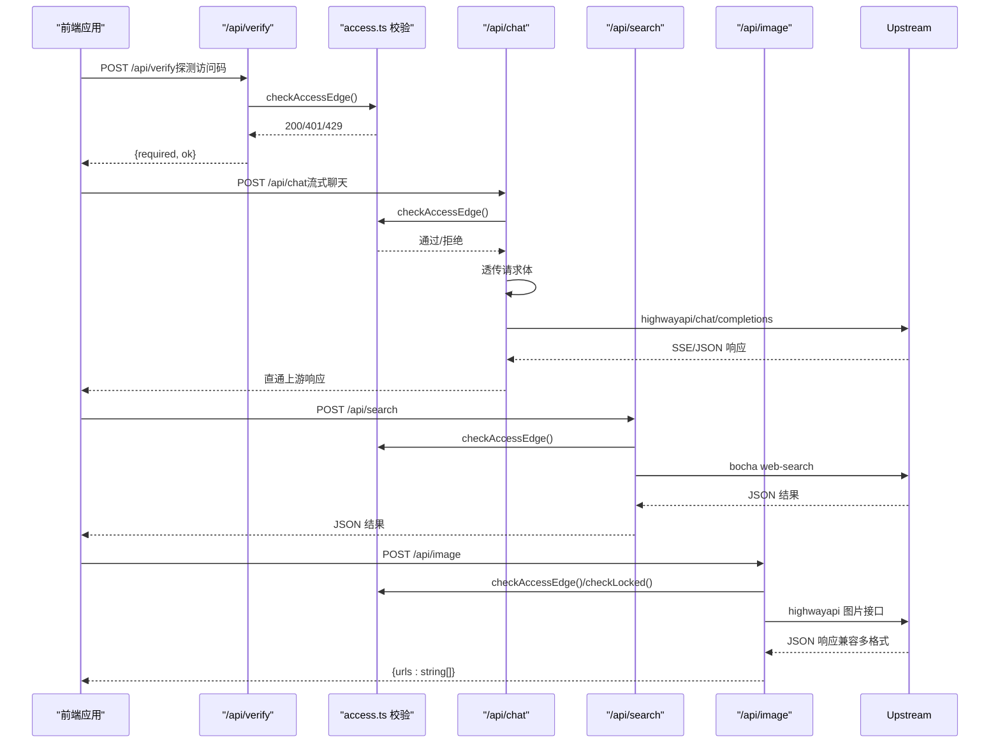
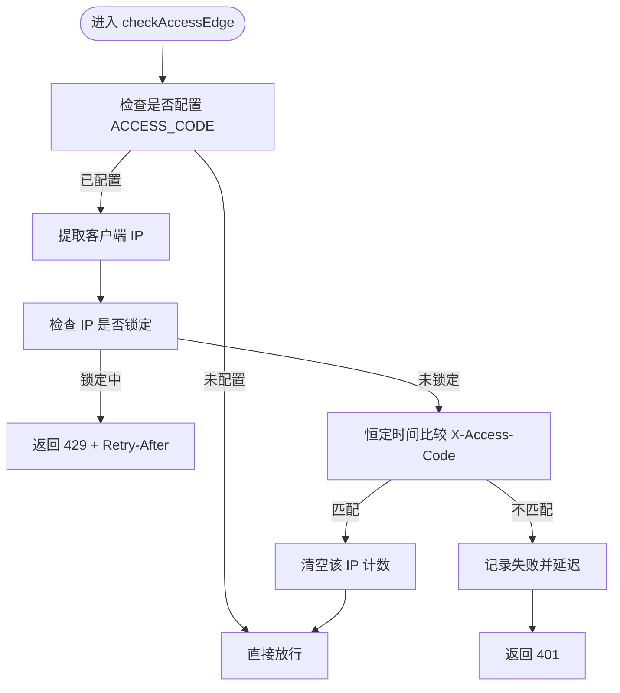
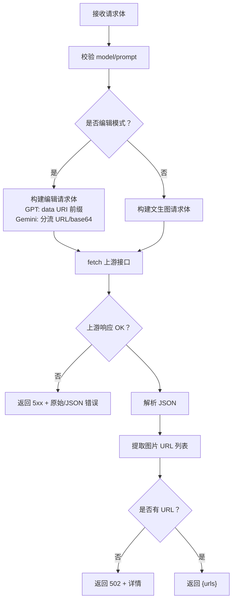
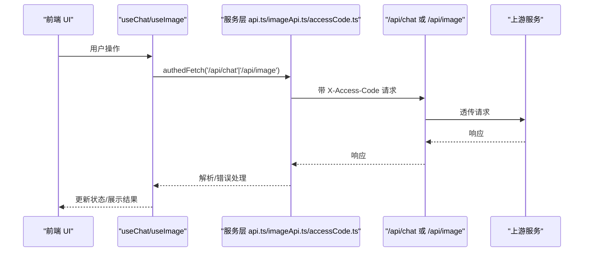
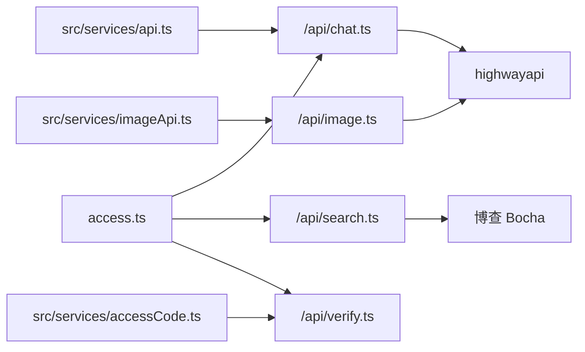

# 后端 API 层设计

<cite>
**本文档引用的文件**
- [access.ts](file://api/_lib/access.ts)
- [chat.ts](file://api/chat.ts)
- [image.ts](file://api/image.ts)
- [search.ts](file://api/search.ts)
- [verify.ts](file://api/verify.ts)
- [api.ts](file://src/services/api.ts)
- [accessCode.ts](file://src/services/accessCode.ts)
- [imageApi.ts](file://src/services/imageApi.ts)
- [models.ts](file://src/config/models.ts)
- [useChat.ts](file://src/hooks/useChat.ts)
- [useImage.ts](file://src/hooks/useImage.ts)
- [AccessGate.tsx](file://src/components/auth/AccessGate.tsx)
- [index.ts](file://src/types/index.ts)
</cite>

## 目录
1. [简介](#简介)
2. [项目结构](#项目结构)
3. [核心组件](#核心组件)
4. [架构总览](#架构总览)
5. [详细组件分析](#详细组件分析)
6. [依赖关系分析](#依赖关系分析)
7. [性能考量](#性能考量)
8. [故障排查指南](#故障排查指南)
9. [结论](#结论)
10. [附录](#附录)

## 简介
本文件面向 AIShop 后端 API 层的设计与实现，系统性梳理以下方面：
- API 端点功能与参数规范：/api/chat、/api/image、/api/search、/api/verify
- 访问控制与安全验证：access.ts 中的恒定时间比较、内存级 IP 限速、失败延迟与统一校验流程
- 代理转发机制：如何将请求转发至不同 AI 服务提供商（如 highwayapi、博查 Bocha）
- 错误处理与响应格式标准化：统一的错误载荷与状态码策略
- 使用示例：请求格式、响应结构与错误码定义
- 安全与最佳实践：输入验证、速率限制、日志记录与前端联动

## 项目结构
后端 API 层位于 api/ 目录，采用 Vercel 边缘函数（Edge Functions）与服务器函数（Serverless）混合部署：
- Edge 函数：/api/chat.ts、/api/search.ts、/api/verify.ts，具备低延迟与高并发优势
- 服务器函数：/api/image.ts，因图片生成较长超时需求（60s）采用 Node.js Serverless

图表来源
- [chat.ts:1-50](file://api/chat.ts#L1-L50)
- [image.ts:1-310](file://api/image.ts#L1-L310)
- [search.ts:1-66](file://api/search.ts#L1-L66)
- [verify.ts:1-33](file://api/verify.ts#L1-L33)
- [access.ts:1-156](file://api/_lib/access.ts#L1-L156)

章节来源
- [chat.ts:1-50](file://api/chat.ts#L1-L50)
- [image.ts:1-310](file://api/image.ts#L1-L310)
- [search.ts:1-66](file://api/search.ts#L1-L66)
- [verify.ts:1-33](file://api/verify.ts#L1-L33)
- [access.ts:1-156](file://api/_lib/access.ts#L1-L156)

## 核心组件
- 访问控制库（access.ts）：提供恒定时间字符串比较、IP 限速、失败延迟、统一 Edge/Node 校验入口
- 聊天代理（/api/chat.ts）：转发 OpenAI 兼容接口，支持流式与非流式响应
- 图片代理（/api/image.ts）：统一 GPT Image 2 与 Gemini 的图片生成/编辑接口，兼容多上游响应格式
- 搜索代理（/api/search.ts）：转发博查（Bocha）联网搜索接口
- 访问码探针（/api/verify.ts）：前端用于探测访问码状态与服务端启用情况
- 前端服务层：封装 authedFetch、流式聊天与图片生成调用

章节来源
- [access.ts:1-156](file://api/_lib/access.ts#L1-L156)
- [chat.ts:1-50](file://api/chat.ts#L1-L50)
- [image.ts:1-310](file://api/image.ts#L1-L310)
- [search.ts:1-66](file://api/search.ts#L1-L66)
- [verify.ts:1-33](file://api/verify.ts#L1-L33)
- [api.ts:1-83](file://src/services/api.ts#L1-L83)
- [imageApi.ts:1-41](file://src/services/imageApi.ts#L1-L41)
- [accessCode.ts:1-113](file://src/services/accessCode.ts#L1-L113)

## 架构总览
后端 API 层通过统一的访问控制与代理转发，屏蔽上游差异，向上提供稳定一致的接口契约。Edge 函数负责低延迟场景（聊天、搜索、访问码探针），Serverless 负责长时任务（图片生成）。前端通过服务层封装统一的请求与错误处理。

图表来源
- [verify.ts:11-32](file://api/verify.ts#L11-L32)
- [access.ts:120-155](file://api/_lib/access.ts#L120-L155)
- [chat.ts:11-49](file://api/chat.ts#L11-L49)
- [search.ts:11-65](file://api/search.ts#L11-L65)
- [image.ts:104-309](file://api/image.ts#L104-L309)

## 详细组件分析

### 访问控制与安全验证（access.ts）
- 恒定时间比较：避免时序侧信道泄露，确保无论输入长度如何，比较耗时一致
- IP 限速与锁定：基于内存 Map 维护每 IP 的失败计数、窗口与锁定时间，单实例内强一致
- 失败延迟：每次失败附加固定延迟，显著提升暴力破解成本
- Edge/Node 统一校验：提供 Edge 与 Node 版本的 IP 提取与校验入口，统一返回值与响应
- 429/401/200 场景：锁定期间返回 429（含 Retry-After），校验失败返回 401，通过返回 null

图表来源
- [access.ts:120-155](file://api/_lib/access.ts#L120-L155)

章节来源
- [access.ts:1-156](file://api/_lib/access.ts#L1-L156)

### /api/chat：聊天代理
- 运行时：Edge 函数
- 方法：仅允许 POST
- 请求体：透传前端消息数组与模型参数（如 temperature、stream 等）
- 上游：highwayapi 的 OpenAI 兼容接口
- 响应：直接透传上游响应，支持 SSE 流式输出
- 安全：启用统一访问控制，失败延迟与 IP 锁定

章节来源
- [chat.ts:1-50](file://api/chat.ts#L1-L50)
- [api.ts:13-82](file://src/services/api.ts#L13-L82)

### /api/image：图片生成与编辑代理
- 运行时：Vercel Serverless（Node.js），最大执行时长 60s
- 方法：仅允许 POST
- 请求体字段：
  - model：必填（gpt-image-2、gemini-3.1-flash、gemini-3-pro）
  - prompt：必填
  - images：可选（编辑模式，支持 URL/base64/data URI）
  - aspectRatio/size/quality/outputFormat/n：可选
- 上游映射：
  - gpt-image-2：textToImage/edit
  - gemini-3.1-flash：textToImage/edit
  - gemini-3-pro：textToImage/edit
- 响应：统一 { urls: string[] }，兼容上游返回差异（GPT 的 data/images 或 Gemini 的 image_urls）
- 错误处理：透传上游错误码与消息，必要时解析 JSON；当无图片返回时返回 502

图表来源
- [image.ts:104-309](file://api/image.ts#L104-L309)

章节来源
- [image.ts:1-310](file://api/image.ts#L1-L310)
- [imageApi.ts:1-41](file://src/services/imageApi.ts#L1-L41)
- [models.ts:181-215](file://src/config/models.ts#L181-L215)

### /api/search：联网搜索代理
- 运行时：Edge 函数
- 方法：仅允许 POST
- 请求体：{ query: string }（必需）
- 上游：博查 Bocha 的 web-search 接口
- 响应：直接透传上游 JSON 文本

章节来源
- [search.ts:1-66](file://api/search.ts#L1-L66)

### /api/verify：访问码探针
- 运行时：Edge 函数
- 方法：POST/GET 均可
- 行为：若未配置 ACCESS_CODE 则返回 { required: false, ok: true }；否则执行统一校验，返回 { required: true, ok: true } 或 429/401

章节来源
- [verify.ts:1-33](file://api/verify.ts#L1-L33)

### 前端集成与错误处理
- 流式聊天：前端通过 streamChat 以 SSE 方式解析增量数据，遇到错误抛出异常
- 图片生成：前端通过 generateImage 发起请求，解析 { urls }，失败时优先展示上游 detail/error
- 访问码：前端通过 accessCode.ts 的 authedFetch 注入 X-Access-Code，监听 401 事件并回退到登录界面

图表来源
- [api.ts:13-82](file://src/services/api.ts#L13-L82)
- [imageApi.ts:8-40](file://src/services/imageApi.ts#L8-L40)
- [accessCode.ts:37-57](file://src/services/accessCode.ts#L37-L57)
- [chat.ts:11-49](file://api/chat.ts#L11-L49)
- [image.ts:104-309](file://api/image.ts#L104-L309)

章节来源
- [api.ts:1-83](file://src/services/api.ts#L1-L83)
- [imageApi.ts:1-41](file://src/services/imageApi.ts#L1-L41)
- [accessCode.ts:1-113](file://src/services/accessCode.ts#L1-L113)
- [useChat.ts:135-248](file://src/hooks/useChat.ts#L135-L248)
- [useImage.ts:228-327](file://src/hooks/useImage.ts#L228-L327)
- [AccessGate.tsx:23-149](file://src/components/auth/AccessGate.tsx#L23-L149)

## 依赖关系分析
- API 层依赖 access.ts 提供统一的安全校验与限速逻辑
- /api/chat 与 /api/search 依赖上游服务（highwayapi/博查）
- /api/image 依赖上游服务（highwayapi），并兼容多模型与多响应格式
- 前端通过服务层封装统一的请求与错误处理，减少对具体 API 的耦合

图表来源
- [access.ts:1-156](file://api/_lib/access.ts#L1-L156)
- [chat.ts:1-50](file://api/chat.ts#L1-L50)
- [image.ts:1-310](file://api/image.ts#L1-L310)
- [search.ts:1-66](file://api/search.ts#L1-L66)
- [verify.ts:1-33](file://api/verify.ts#L1-L33)
- [api.ts:1-83](file://src/services/api.ts#L1-L83)
- [imageApi.ts:1-41](file://src/services/imageApi.ts#L1-L41)
- [accessCode.ts:1-113](file://src/services/accessCode.ts#L1-L113)

章节来源
- [access.ts:1-156](file://api/_lib/access.ts#L1-L156)
- [chat.ts:1-50](file://api/chat.ts#L1-L50)
- [image.ts:1-310](file://api/image.ts#L1-L310)
- [search.ts:1-66](file://api/search.ts#L1-L66)
- [verify.ts:1-33](file://api/verify.ts#L1-L33)
- [api.ts:1-83](file://src/services/api.ts#L1-L83)
- [imageApi.ts:1-41](file://src/services/imageApi.ts#L1-L41)
- [accessCode.ts:1-113](file://src/services/accessCode.ts#L1-L113)

## 性能考量
- Edge 函数优势：低延迟、高并发，适合聊天与搜索等短时请求
- Serverless 图片生成：因生成时长较长（60s），采用 Node.js Serverless 以满足超时需求
- 流式传输：/api/chat 支持 SSE，前端按行解析增量数据，降低首包延迟
- 代理直通：避免额外序列化/反序列化开销，直接透传上游响应头与主体
- 限速与失败延迟：通过内存级限速与失败延迟显著抑制暴力破解与滥用

## 故障排查指南
- 401 未授权
  - 原因：访问码不匹配或未配置
  - 处理：确认 X-Access-Code 请求头与服务端 ACCESS_CODE 一致；使用 /api/verify 探测
- 429 速率限制
  - 原因：同一 IP 在失败窗口内多次失败被锁定
  - 处理：等待 Retry-After 秒；检查客户端 IP 提取是否正确
- 500 服务端配置错误
  - 原因：缺少上游密钥（如 HIGHWAY_API_KEY、BOCHA_API_KEY）
  - 处理：在环境变量中设置对应密钥
- 502 上游错误/非 JSON
  - 原因：上游不可达或返回非 JSON
  - 处理：检查上游服务状态；前端展示 detail 或原始响应
- 502 无图片返回
  - 原因：上游未返回任何图片 URL
  - 处理：检查请求体字段与模型支持情况

章节来源
- [chat.ts:20-26](file://api/chat.ts#L20-L26)
- [search.ts:20-26](file://api/search.ts#L20-L26)
- [image.ts:135-139](file://api/image.ts#L135-L139)
- [image.ts:267-272](file://api/image.ts#L267-L272)
- [image.ts:290-298](file://api/image.ts#L290-L298)
- [image.ts:300-305](file://api/image.ts#L300-L305)
- [access.ts:120-155](file://api/_lib/access.ts#L120-L155)

## 结论
AIShop 后端 API 层通过统一的访问控制与代理转发，实现了对多上游服务的一致抽象。Edge 函数承担低延迟场景，Serverless 负责长时任务，前端通过服务层封装统一的请求与错误处理，形成清晰的职责边界与良好的扩展性。建议在生产环境中结合跨实例限速方案（如 KV/Redis）进一步强化安全，并完善日志审计与监控告警。

## 附录

### API 端点一览与参数规范
- /api/chat
  - 方法：POST
  - 请求体：透传前端消息数组与模型参数（如 temperature、stream 等）
  - 响应：直接透传上游响应（SSE 或 JSON）
  - 安全：启用统一访问控制
- /api/image
  - 方法：POST
  - 请求体字段：model（必填）、prompt（必填）、images（可选）、aspectRatio/size/quality/outputFormat/n（可选）
  - 响应：{ urls: string[] }
  - 安全：启用统一访问控制与 IP 限速
- /api/search
  - 方法：POST
  - 请求体：{ query: string }（必填）
  - 响应：JSON 文本（透传上游）
  - 安全：启用统一访问控制
- /api/verify
  - 方法：POST/GET
  - 响应：{ required: boolean, ok: boolean } 或 429/401

章节来源
- [chat.ts:11-49](file://api/chat.ts#L11-L49)
- [image.ts:156-173](file://api/image.ts#L156-L173)
- [image.ts:308-309](file://api/image.ts#L308-L309)
- [search.ts:28-44](file://api/search.ts#L28-L44)
- [verify.ts:16-31](file://api/verify.ts#L16-L31)

### 错误码与响应格式
- 400：请求参数缺失或无效（如缺少 model/prompt、JSON 解析失败）
- 401：访问码不正确
- 405：方法不允许
- 429：速率限制锁定（返回 Retry-After）
- 500：服务端配置错误（如缺少密钥）
- 502：上游错误或非 JSON 响应
- 200：成功（/api/verify 返回状态；/api/image 返回 { urls }）

章节来源
- [chat.ts:12-14](file://api/chat.ts#L12-L14)
- [chat.ts:21-26](file://api/chat.ts#L21-L26)
- [image.ts:109-111](file://api/image.ts#L109-L111)
- [image.ts:167-172](file://api/image.ts#L167-L172)
- [image.ts:152-154](file://api/image.ts#L152-L154)
- [image.ts:135-139](file://api/image.ts#L135-L139)
- [image.ts:267-272](file://api/image.ts#L267-L272)
- [image.ts:290-298](file://api/image.ts#L290-L298)
- [image.ts:300-305](file://api/image.ts#L300-L305)
- [search.ts:12-14](file://api/search.ts#L12-L14)
- [search.ts:38-44](file://api/search.ts#L38-L44)
- [verify.ts:12-14](file://api/verify.ts#L12-L14)

### 安全与最佳实践
- 输入验证：后端严格校验必填字段与 JSON 格式，前端亦进行基础校验
- 速率限制：基于内存的 IP 限速与失败延迟，单实例内强一致；跨实例建议使用 KV/Redis
- 日志记录：建议在边缘网关/平台侧开启访问日志与错误日志，结合追踪 ID 定位问题
- 前端联动：通过 /api/verify 自动探测访问码状态，401 时自动回退登录界面
- 密钥管理：密钥仅保存在服务端环境变量，前端通过代理访问

章节来源
- [access.ts:1-156](file://api/_lib/access.ts#L1-L156)
- [accessCode.ts:66-79](file://src/services/accessCode.ts#L66-L79)
- [AccessGate.tsx:23-54](file://src/components/auth/AccessGate.tsx#L23-L54)