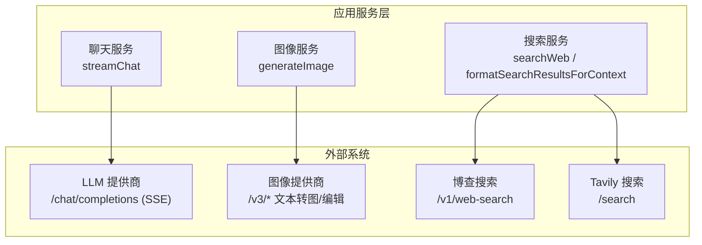
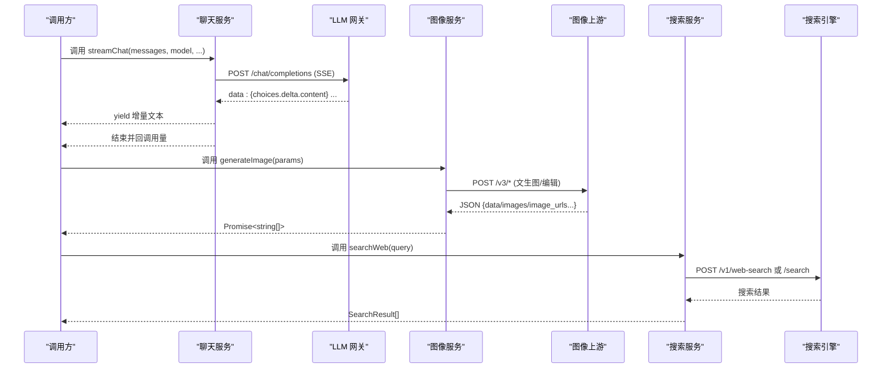
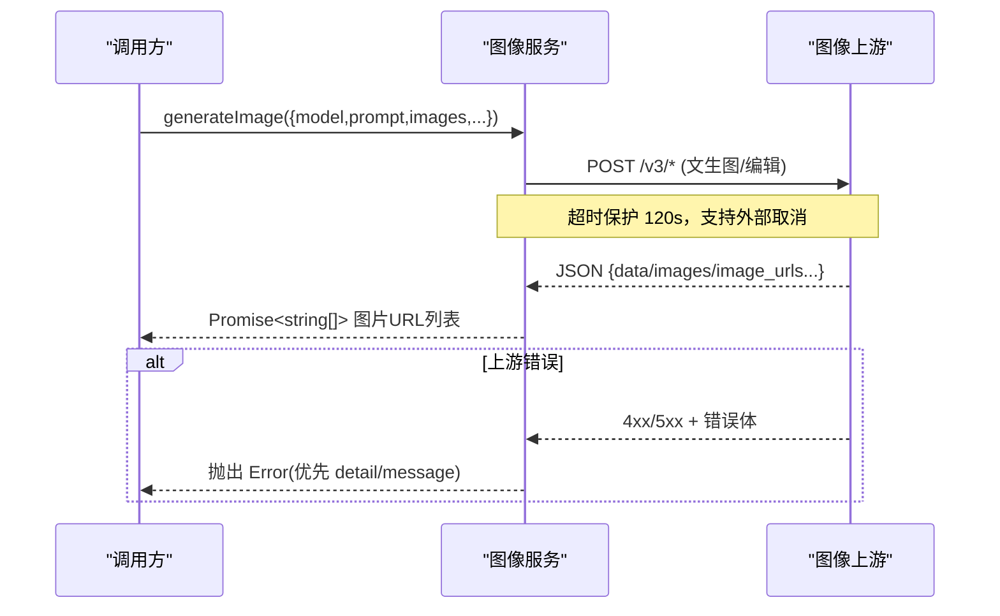
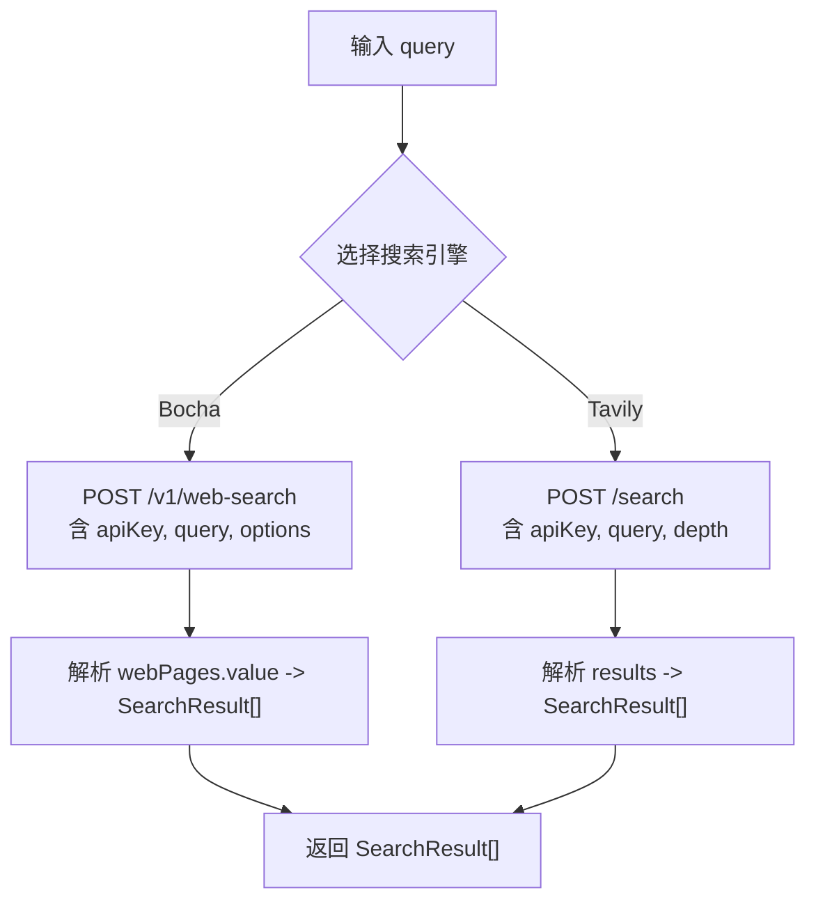
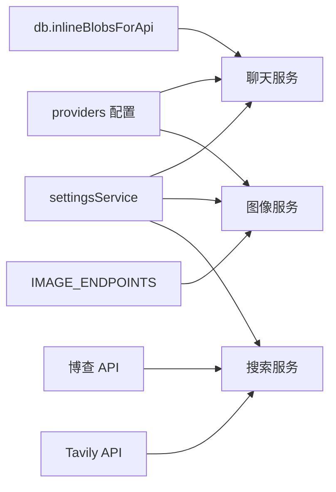

# 后端 API 接口

<cite>
**本文引用的文件**
- [src/services/api.ts](file://src/services/api.ts)
- [src/services/imageApi.ts](file://src/services/imageApi.ts)
- [src/services/webSearch.ts](file://src/services/webSearch.ts)
- [src/types/index.ts](file://src/types/index.ts)
- [src/config/version.ts](file://src/config/version.ts)
</cite>

## 目录
1. [简介](#简介)
2. [项目结构](#项目结构)
3. [核心组件](#核心组件)
4. [架构总览](#架构总览)
5. [详细组件分析](#详细组件分析)
6. [依赖关系分析](#依赖关系分析)
7. [性能考虑](#性能考虑)
8. [故障排查指南](#故障排查指南)
9. [结论](#结论)
10. [附录](#附录)

## 简介
本参考文档面向 AIShop 后端的 HTTP 接口，覆盖聊天流式响应、图像生成任务与状态、联网搜索查询语法与结果格式，以及访问控制、错误处理与版本管理。文档基于仓库中的前端服务层代码进行逆向梳理，明确各接口的调用方式、请求参数、响应结构与异常行为，帮助客户端正确集成并稳定使用。

## 项目结构
AIShop 的后端能力通过前端服务层封装为三类核心能力：
- 聊天对话：流式文本生成与用量统计
- 图像生成：多模型直连上游，统一返回图片 URL 列表
- 联网搜索：统一入口路由至不同搜索引擎，并格式化上下文



图示来源
- [src/services/api.ts:44-172](file://src/services/api.ts#L44-L172)
- [src/services/imageApi.ts:6-19](file://src/services/imageApi.ts#L6-L19)
- [src/services/webSearch.ts:3-4](file://src/services/webSearch.ts#L3-L4)

章节来源
- [src/services/api.ts:44-172](file://src/services/api.ts#L44-L172)
- [src/services/imageApi.ts:6-19](file://src/services/imageApi.ts#L6-L19)
- [src/services/webSearch.ts:23-35](file://src/services/webSearch.ts#L23-L35)

## 核心组件
- 聊天流式接口：以 Server-Sent Events（SSE）形式逐块返回内容，并在末尾尝试解析用量信息。
- 图像生成接口：根据模型映射到具体上游路径，支持文生图与图编辑；失败时抛出结构化错误。
- 搜索接口：统一入口，按配置选择博查或 Tavily，返回标准化搜索结果并可格式化上下文。

章节来源
- [src/services/api.ts:44-172](file://src/services/api.ts#L44-L172)
- [src/services/imageApi.ts:149-243](file://src/services/imageApi.ts#L149-L243)
- [src/services/webSearch.ts:23-117](file://src/services/webSearch.ts#L23-L117)

## 架构总览
聊天、图像与搜索三个服务均遵循“读取设置 → 构建请求 → 发起网络请求 → 解析响应”的统一流程。其中：
- 聊天服务采用异步生成器实现流式输出，并在最后回调用量。
- 图像服务对多种上游响应结构做兼容抽取，统一返回 URL 数组。
- 搜索服务提供统一入口与结果格式化，便于注入 LLM 上下文。



图示来源
- [src/services/api.ts:84-172](file://src/services/api.ts#L84-L172)
- [src/services/imageApi.ts:175-243](file://src/services/imageApi.ts#L175-L243)
- [src/services/webSearch.ts:41-105](file://src/services/webSearch.ts#L41-L105)

## 详细组件分析

### 聊天接口（流式 SSE）
- HTTP 方法：POST
- 路径：由提供商配置决定的基础地址 + /chat/completions
- 认证：Authorization: Bearer <API Key>
- 请求体关键字段：
  - model: string
  - messages: 包含 system/user/assistant 的消息数组，图片以 data URL 内联
  - stream: true
  - stream_options.include_usage: 可选，用于索取真实用量（部分网关不支持时会回退重试）
  - temperature: 0.7
- 响应：SSE 数据流
  - 每行形如 data: {...}，解析 choices[0].delta.content 得到增量文本
  - 结束时可能包含仅带 usage 的 chunk
  - 最终会回调 onUsage 携带 TokenUsage
- 错误处理：
  - 若首次请求因 include_usage 不被支持而返回 4xx，将去掉该字段重试一次
  - 其他 4xx/5xx 直接抛错，消息中包含状态码与原始错误文本
- 超时与取消：
  - 支持 AbortSignal 传入，可取消流式请求

```mermaid
flowchart TD
Start(["进入 streamChat"]) --> Build["组装消息与系统提示<br/>内联图片为 data URL"]
Build --> Send{"是否包含 include_usage"}
Send --> |是| Req1["POST /chat/completions<br/>含 stream_options.include_usage"]
Send --> |否| Req2["POST /chat/completions<br/>不含 include_usage"]
Req1 --> Check{"响应是否 4xx"}
Check --> |是且原因相关| Retry["移除 include_usage 重试"]
Check --> |否| Stream["读取 SSE 流"]
Retry --> Stream
Stream --> Parse{"解析 data 行"}
Parse --> |有 content| Yield["yield 增量文本"]
Parse --> |usage| Save["记录用量"]
Parse --> |[DONE]| End["结束流"]
Yield --> Parse
Save --> Parse
End --> Callback["回调 onUsage(如有)"]
```

图示来源
- [src/services/api.ts:61-118](file://src/services/api.ts#L61-L118)
- [src/services/api.ts:120-172](file://src/services/api.ts#L120-L172)

章节来源
- [src/services/api.ts:44-172](file://src/services/api.ts#L44-L172)
- [src/types/index.ts:34-42](file://src/types/index.ts#L34-L42)

### 图像生成接口（任务管理与状态）
- HTTP 方法：POST
- 路径：由提供商基础地址 + 模型映射的 /v3/* 端点
  - gpt-image-2: /v3/gpt-image-2-text-to-image 或 /v3/gpt-image-2-edit
  - gemini-3.1-flash: /v3/gemini-3.1-flash-image-text-to-image 或 /v3/gemini-3.1-flash-image-edit
  - gemini-3-pro: /v3/gemini-3-pro-image-text-to-image 或 /v3/gemini-3-pro-image-edit
- 认证：Authorization: Bearer <API Key>
- 请求体关键字段（按模型与模式动态构建）：
  - 通用：prompt, size, output_format, n, aspect_ratio（视模型而定）
  - 编辑模式：image（GPT Image 2，需完整 data URI）、image_base64s 或 image_urls（Gemini）
- 响应：JSON，兼容多种结构，统一抽取图片 URL 数组
  - 支持 base64 返回时自动转换为 data:image/png;base64,...
- 超时与取消：
  - 默认 120 秒超时；支持外部 AbortSignal 合并取消
- 错误处理：
  - 优先取上游 detail/error.message，否则返回状态码信息
  - 未返回任何图片地址时抛错



图示来源
- [src/services/imageApi.ts:6-19](file://src/services/imageApi.ts#L6-L19)
- [src/services/imageApi.ts:66-143](file://src/services/imageApi.ts#L66-L143)
- [src/services/imageApi.ts:149-243](file://src/services/imageApi.ts#L149-L243)

章节来源
- [src/services/imageApi.ts:149-243](file://src/services/imageApi.ts#L149-L243)
- [src/types/index.ts:177-214](file://src/types/index.ts#L177-L214)

### 搜索接口（查询语法与结果格式）
- HTTP 方法：POST
- 路径：
  - 博查：https://api.bochaai.com/v1/web-search
  - Tavily：https://api.tavily.com/search
- 认证：
  - 博查：Authorization: Bearer <API Key>
  - Tavily：请求体 api_key
- 查询语法：
  - 博查：{ query, freshness: 'noLimit', summary: true, count: 10 }
  - Tavily：{ api_key, query, search_depth: 'advanced' }
- 结果格式：
  - 统一为 SearchResult[]，字段包括 name、url、snippet、siteName
  - 提供 formatSearchResultsForContext 将结果转为 LLM 可读的上下文文本
- 错误处理：
  - 非 200 响应抛错，包含搜索引擎名称与状态码



图示来源
- [src/services/webSearch.ts:23-35](file://src/services/webSearch.ts#L23-L35)
- [src/services/webSearch.ts:41-69](file://src/services/webSearch.ts#L41-L69)
- [src/services/webSearch.ts:74-105](file://src/services/webSearch.ts#L74-L105)
- [src/services/webSearch.ts:107-117](file://src/services/webSearch.ts#L107-L117)

章节来源
- [src/services/webSearch.ts:23-117](file://src/services/webSearch.ts#L23-L117)

### 访问控制与安全策略
- 密钥管理：所有对外请求通过 settingsService 获取 provider 与对应 API Key，缺失时直接抛错，避免无鉴权调用。
- 传输安全：全部使用 HTTPS 与 Authorization: Bearer 头；图片生成与聊天均要求有效密钥。
- 错误最小化暴露：上游错误尽量提取 detail/message 后抛出，不泄露内部细节。
- 注意：当前仓库未实现服务端侧的访问码校验逻辑；如需在接入层增加访问码验证，应在网关或服务入口处统一实现。

章节来源
- [src/services/api.ts:53-59](file://src/services/api.ts#L53-L59)
- [src/services/imageApi.ts:153-159](file://src/services/imageApi.ts#L153-L159)
- [src/services/webSearch.ts:41-46](file://src/services/webSearch.ts#L41-L46)

### 错误代码定义与异常处理规范
- 聊天接口：
  - 当 include_usage 不被支持时，先尝试带该字段请求，若返回 4xx 则去掉该字段重试
  - 其他 4xx/5xx 直接抛错，包含状态码与原始错误文本
- 图像接口：
  - 超时：120 秒，区分外部取消与内部超时，分别抛出不同错误
  - 上游错误：优先取 detail 或 error.message，否则返回状态码信息
  - 无图片返回：抛出“未返回图片地址”
- 搜索接口：
  - 非 200 响应抛错，包含搜索引擎名称与状态码
- 用量解析：
  - 兼容多种网关字段命名，无法解析时忽略，不影响主流程

章节来源
- [src/services/api.ts:102-118](file://src/services/api.ts#L102-L118)
- [src/services/imageApi.ts:183-243](file://src/services/imageApi.ts#L183-L243)
- [src/services/webSearch.ts:57-95](file://src/services/webSearch.ts#L57-L95)

### 接口版本管理与向后兼容性
- 应用版本：通过构建时注入的版本常量提供版本信息，便于调试与追踪。
- 图像端点版本：上游路径固定为 /v3/*，建议保持路径稳定以维持兼容性。
- 聊天用量字段：由于各网关字段不一致，已做兼容解析；未来新增字段应继续采用兜底策略。
- 建议：
  - 对外暴露的接口应保持语义稳定，新增字段采用可选扩展
  - 对上游变更采用适配层隔离，避免影响调用方

章节来源
- [src/config/version.ts:1-17](file://src/config/version.ts#L1-L17)
- [src/services/imageApi.ts:6-19](file://src/services/imageApi.ts#L6-L19)
- [src/services/api.ts:17-42](file://src/services/api.ts#L17-L42)

## 依赖关系分析
- 聊天服务依赖：
  - settingsService：获取 LLM provider 与 API Key
  - providers 配置：确定 chatBaseUrl
  - db.inlineBlobsForApi：将消息中的图片引用转为 data URL
- 图像服务依赖：
  - settingsService：获取 image provider 与 API Key
  - providers 配置：确定 imageBaseUrl
  - 模型到端点的映射表：IMAGE_ENDPOINTS
- 搜索服务依赖：
  - settingsService：获取 search provider 与对应 API Key
  - 外部搜索引擎 API



图示来源
- [src/services/api.ts:53-55](file://src/services/api.ts#L53-L55)
- [src/services/imageApi.ts:153-155](file://src/services/imageApi.ts#L153-L155)
- [src/services/webSearch.ts:23-35](file://src/services/webSearch.ts#L23-L35)

章节来源
- [src/services/api.ts:53-55](file://src/services/api.ts#L53-L55)
- [src/services/imageApi.ts:153-155](file://src/services/imageApi.ts#L153-L155)
- [src/services/webSearch.ts:23-35](file://src/services/webSearch.ts#L23-L35)

## 性能考虑
- 聊天流式：
  - 增量推送减少首屏延迟
  - 仅在必要时请求 include_usage，降低不必要开销
  - 图片按需内联，避免提前加载整段历史
- 图像生成：
  - 120 秒超时防止长时间挂起
  - 合并外部取消信号，及时释放资源
- 搜索：
  - 统一结果格式，减少上层处理成本
  - 支持摘要与限制数量，控制上下文大小

## 故障排查指南
- 聊天接口
  - 现象：流中断或无用量
  - 排查：检查 include_usage 是否被上游拒绝；确认流结束前是否有 usage chunk；核对 onUsage 回调是否触发
- 图像接口
  - 现象：请求超时或无图片返回
  - 排查：确认上游返回结构是否被识别；检查图片是否为合法 data URI 或 URL；查看错误消息中的 detail/message
- 搜索接口
  - 现象：结果为空或报错
  - 排查：确认所选 provider 的 API Key 是否配置；检查响应状态码与返回字段

章节来源
- [src/services/api.ts:102-172](file://src/services/api.ts#L102-L172)
- [src/services/imageApi.ts:183-243](file://src/services/imageApi.ts#L183-L243)
- [src/services/webSearch.ts:57-105](file://src/services/webSearch.ts#L57-L105)

## 结论
AIShop 的后端能力通过清晰的服务层抽象，将聊天、图像与搜索三大能力统一封装，具备稳定的错误处理、兼容性与可扩展性。建议在接入层补充访问码校验与审计日志，以增强安全性与可观测性。

## 附录

### 接口清单与调用示例

- 聊天（流式）
  - 方法：POST
  - 路径：{chatBaseUrl}/chat/completions
  - 请求头：Authorization: Bearer <API Key>
  - 请求体：
    - model: string
    - messages: Message[]（system/user/assistant，图片为 data URL）
    - stream: true
    - stream_options.include_usage: boolean（可选）
    - temperature: number
  - 响应：SSE 数据流，增量 content 与结尾 usage
  - 示例：调用 streamChat(messages, model, signal?, searchContext?, systemPrompt?, onUsage?)
  
  章节来源
  - [src/services/api.ts:44-172](file://src/services/api.ts#L44-L172)

- 图像生成（文生图/编辑）
  - 方法：POST
  - 路径：{imageBaseUrl}/v3/{model-endpoint}
  - 请求头：Authorization: Bearer <API Key>
  - 请求体：
    - prompt: string
    - model: string
    - images?: string[]（编辑模式，支持 URL 或 base64/data URI）
    - size?: string
    - quality?: string
    - output_format?: string
    - n?: number
    - aspect_ratio?: string（Gemini）
  - 响应：Promise<string[]> 图片 URL 列表
  - 示例：调用 generateImage(params, signal?)
  
  章节来源
  - [src/services/imageApi.ts:66-143](file://src/services/imageApi.ts#L66-L143)
  - [src/services/imageApi.ts:149-243](file://src/services/imageApi.ts#L149-L243)

- 联网搜索
  - 方法：POST
  - 路径：
    - 博查：https://api.bochaai.com/v1/web-search
    - Tavily：https://api.tavily.com/search
  - 请求头/体：
    - 博查：Authorization: Bearer <API Key>；{ query, freshness, summary, count }
    - Tavily：{ api_key, query, search_depth }
  - 响应：SearchResult[]
  - 辅助：formatSearchResultsForContext(results) 生成 LLM 上下文
  - 示例：调用 searchWeb(query)，再根据需要格式化
  
  章节来源
  - [src/services/webSearch.ts:23-117](file://src/services/webSearch.ts#L23-L117)

### 数据类型参考
- Message、MessageVersion、TokenUsage、ImageGenerationParams、PendingImageTask 等类型定义见 types/index.ts，用于约束请求与响应结构。

章节来源
- [src/types/index.ts:34-42](file://src/types/index.ts#L34-L42)
- [src/types/index.ts:67-107](file://src/types/index.ts#L67-L107)
- [src/types/index.ts:177-214](file://src/types/index.ts#L177-L214)