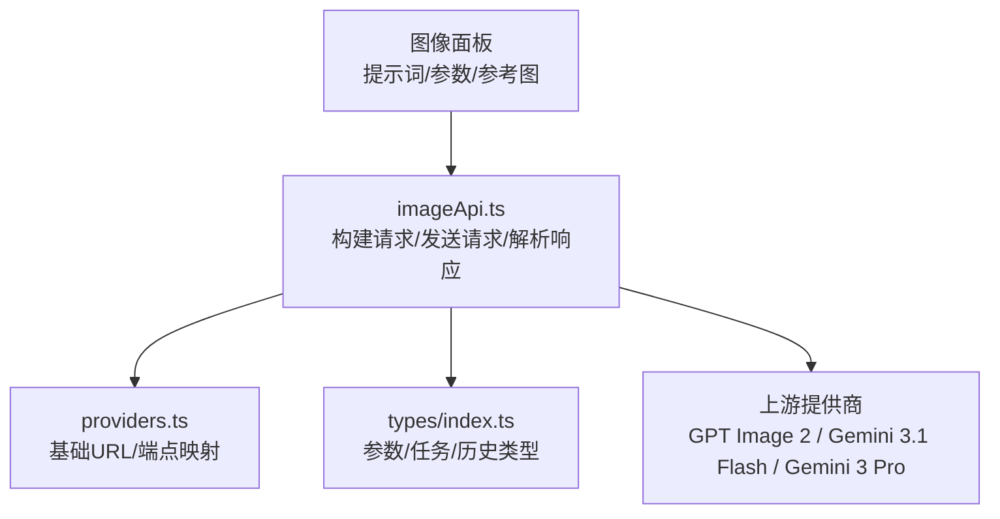
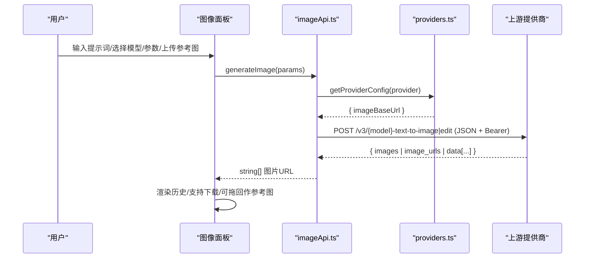
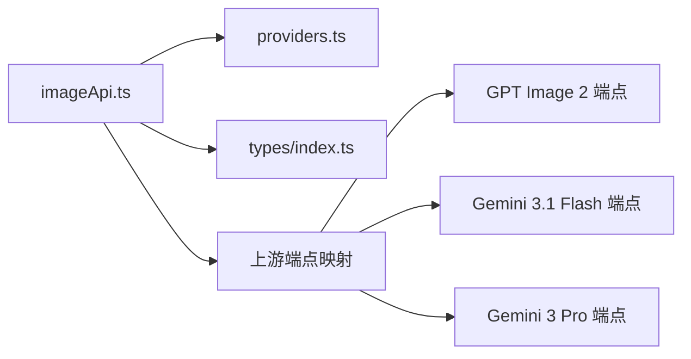

# 图像生成 API

<cite>
**本文引用的文件**
- [src/services/imageApi.ts](file://src/services/imageApi.ts)
- [src/config/providers.ts](file://src/config/providers.ts)
- [src/config/models.ts](file://src/config/models.ts)
- [src/types/index.ts](file://src/types/index.ts)
- [ImageGenAPI/reference-gpt-image-2-text-to-image.md](file://ImageGenAPI/reference-gpt-image-2-text-to-image.md)
- [ImageGenAPI/reference-gpt-image-2-edit.md](file://ImageGenAPI/reference-gpt-image-2-edit.md)
- [ImageGenAPI/reference-gemini-3.1-flash-image-text-to-image.md](file://ImageGenAPI/reference-gemini-3.1-flash-image-text-to-image.md)
- [ImageGenAPI/reference-gemini-3.1-flash-image-edit.md](file://ImageGenAPI/reference-gemini-3.1-flash-image-edit.md)
- [ImageGenAPI/reference-gemini-3-pro-image-text-to-image.md](file://ImageGenAPI/reference-gemini-3-pro-image-text-to-image.md)
- [ImageGenAPI/reference-gemini-3-pro-image-edit.md](file://ImageGenAPI/reference-gemini-3-pro-image-edit.md)
</cite>

## 目录
1. [简介](#简介)
2. [项目结构](#项目结构)
3. [核心组件](#核心组件)
4. [架构总览](#架构总览)
5. [详细接口说明](#详细接口说明)
6. [依赖关系分析](#依赖关系分析)
7. [性能与并发](#性能与并发)
8. [错误处理与排障](#错误处理与排障)
9. [结论](#结论)
10. [附录：端点清单与示例](#附录端点清单与示例)

## 简介
本文件为 AIShop 图像生成 API 的完整接口文档，覆盖文本到图像生成、图像编辑、批量任务队列机制、支持的 AI 模型提供商（GPT Image 2、Gemini 3.1 Flash、Gemini 3 Pro）的参数与限制、调用示例、错误处理策略与性能优化建议。同时提供图像格式转换、压缩与存储相关的前端行为说明。

## 项目结构
AIShop 的图像生成功能由前端 UI、状态管理、服务层与上游提供商组成。关键路径如下：
- 前端面板：负责提示词输入、参考图上传/拖拽、参数选择（尺寸、质量、宽高比、输出格式）、任务提交与结果展示。
- 服务层：将统一参数转换为各模型的上游请求体，并发起 HTTP 请求，解析响应中的图片 URL。
- 配置层：维护模型列表、提供商基础地址与端点映射。
- 类型定义：统一描述请求参数、历史项、待处理任务等数据结构。

图表来源
- [src/services/imageApi.ts:1-257](file://src/services/imageApi.ts#L1-L257)
- [src/config/providers.ts:1-18](file://src/config/providers.ts#L1-L18)
- [src/types/index.ts:177-214](file://src/types/index.ts#L177-L214)

章节来源
- [src/services/imageApi.ts:1-257](file://src/services/imageApi.ts#L1-L257)
- [src/config/providers.ts:1-18](file://src/config/providers.ts#L1-L18)
- [src/types/index.ts:177-214](file://src/types/index.ts#L177-L214)

## 核心组件
- 图像生成服务（imageApi.ts）
  - 根据模型与参数构建上游请求体，支持文生图与图像编辑两种模式。
  - 自动识别并兼容多种上游响应结构，提取图片 URL 数组。
  - 设置超时与取消信号，统一错误消息提取。
- 提供商配置（providers.ts）
  - 维护提供商名称与基础 URL，当前默认提供商为“接口AI”。
- 模型配置（models.ts）
  - 定义可用的图像模型：gpt-image-2、gemini-3.1-flash、gemini-3-pro。
- 类型定义（types/index.ts）
  - 统一描述图像生成参数、历史记录项、待处理任务等。

章节来源
- [src/services/imageApi.ts:1-257](file://src/services/imageApi.ts#L1-L257)
- [src/config/providers.ts:1-18](file://src/config/providers.ts#L1-L18)
- [src/config/models.ts:237-271](file://src/config/models.ts#L237-L271)
- [src/types/index.ts:177-214](file://src/types/index.ts#L177-L214)

## 架构总览
图像生成的端到端流程：
1. 用户在图像面板输入提示词、选择模型与参数，可选择上传参考图进入编辑模式。
2. 服务层根据模型与模式构建上游请求体，并携带 Authorization 头发起 POST 请求。
3. 上游返回后，服务层解析出图片 URL 数组，返回给上层用于展示与下载。
4. 前端将结果加入历史，支持瀑布流展示、下载与再次作为参考图使用。

图表来源
- [src/services/imageApi.ts:149-243](file://src/services/imageApi.ts#L149-L243)
- [src/config/providers.ts:1-18](file://src/config/providers.ts#L1-L18)

## 详细接口说明

### 通用约定
- 认证方式：请求头 Authorization 使用 Bearer Token。
- 内容类型：application/json。
- 基础地址：由 providers.ts 中配置的 imageBaseUrl 决定，当前默认提供商为“接口AI”。
- 模型路由：通过 src/services/imageApi.ts 中的 IMAGE_ENDPOINTS 映射到具体端点路径。

章节来源
- [src/config/providers.ts:1-18](file://src/config/providers.ts#L1-L18)
- [src/services/imageApi.ts:5-19](file://src/services/imageApi.ts#L5-L19)

### 文本到图像生成（Text-to-Image）

#### GPT Image 2
- 端点路径：/v3/gpt-image-2-text-to-image
- 必填字段：prompt（最大长度 32000 字符）
- 可选字段：
  - n：生成数量，范围 1-10
  - size：像素尺寸，支持多档固定尺寸与 auto
  - quality：low/medium/high
  - background：opaque/auto
  - moderation：low/auto
  - output_format：png/jpeg
  - output_compression：0-100（仅 jpeg 有效）
- 响应：images 数组（图片 URL）

章节来源
- [ImageGenAPI/reference-gpt-image-2-text-to-image.md:19-74](file://ImageGenAPI/reference-gpt-image-2-text-to-image.md#L19-L74)
- [src/services/imageApi.ts:77-109](file://src/services/imageApi.ts#L77-L109)

#### Gemini 3.1 Flash
- 端点路径：/v3/gemini-3.1-flash-image-text-to-image
- 必填字段：prompt
- 可选字段：
  - size：0.5K/1K/2K/4K（0.5K 仅适用于 Flash）
  - aspect_ratio：1:1, 1:4, 1:8, 2:3, 3:2, 3:4, 4:1, 4:3, 4:5, 5:4, 8:1, 9:16, 16:9, 21:9
  - google.web_search / google.image_search：布尔开关
  - output_format：image/png, image/jpeg
- 响应：image_urls 数组；可能包含 grounding_metadata

章节来源
- [ImageGenAPI/reference-gemini-3.1-flash-image-text-to-image.md:19-66](file://ImageGenAPI/reference-gemini-3.1-flash-image-text-to-image.md#L19-L66)
- [src/services/imageApi.ts:111-143](file://src/services/imageApi.ts#L111-L143)

#### Gemini 3 Pro
- 端点路径：/v3/gemini-3-pro-image-text-to-image
- 必填字段：prompt
- 可选字段：
  - size：1K/2K/4K
  - aspect_ratio：1:1, 3:2, 2:3, 3:4, 4:3, 4:5, 5:4, 9:16, 16:9, 21:9
  - google.web_search：布尔开关
  - output_format：image/png, image/jpeg, image/webp
- 响应：image_urls 数组；可能包含 grounding_metadata

章节来源
- [ImageGenAPI/reference-gemini-3-pro-image-text-to-image.md:19-62](file://ImageGenAPI/reference-gemini-3-pro-image-text-to-image.md#L19-L62)
- [src/services/imageApi.ts:111-143](file://src/services/imageApi.ts#L111-L143)

### 图像编辑（Image Edit）

#### GPT Image 2 编辑
- 端点路径：/v3/gpt-image-2-edit
- 必填字段：image（单张图片 URL/base64）、prompt（最大长度 32000 字符）
- 可选字段：
  - mask：带透明通道的 PNG 遮罩
  - size：多档像素尺寸或 auto
  - quality：low/medium/high
  - background：opaque/auto
  - output_format：png/jpeg
  - n：生成数量，范围 1-10
- 响应：images 数组

注意：当 image 为 base64 时，必须携带完整 data URI 前缀（如 data:image/jpeg;base64,...），否则上游无法识别 MIME 类型。

章节来源
- [ImageGenAPI/reference-gpt-image-2-edit.md:19-70](file://ImageGenAPI/reference-gpt-image-2-edit.md#L19-L70)
- [src/services/imageApi.ts:77-109](file://src/services/imageApi.ts#L77-L109)

#### Gemini 3.1 Flash 编辑
- 端点路径：/v3/gemini-3.1-flash-image-edit
- 必填字段：prompt
- 可选字段：
  - size：0.5K/1K/2K/4K
  - aspect_ratio：同上（含超宽/超长比例）
  - image_urls：最多 14 张参考图 URL
  - image_base64s：裸 base64 图片数组（无 data URI 前缀）
  - google.web_search / google.image_search：布尔开关
  - output_format：image/png, image/jpeg
- 响应：image_urls 数组；可能包含 grounding_metadata

章节来源
- [ImageGenAPI/reference-gemini-3.1-flash-image-edit.md:19-78](file://ImageGenAPI/reference-gemini-3.1-flash-image-edit.md#L19-L78)
- [src/services/imageApi.ts:111-143](file://src/services/imageApi.ts#L111-L143)

#### Gemini 3 Pro 编辑
- 端点路径：/v3/gemini-3-pro-image-edit
- 必填字段：prompt
- 可选字段：
  - size：1K/2K/4K
  - aspect_ratio：同上（不含极宽/极长比例）
  - image_urls：参考图 URL 列表
  - image_base64s：裸 base64 图片数组
  - google.web_search：布尔开关
- 响应：image_urls 数组；可能包含 grounding_metadata

章节来源
- [ImageGenAPI/reference-gemini-3-pro-image-edit.md:19-64](file://ImageGenAPI/reference-gemini-3-pro-image-edit.md#L19-L64)
- [src/services/imageApi.ts:111-143](file://src/services/imageApi.ts#L111-L143)

### 参数与数据模型
- 统一请求参数（ImageGenerationParams）
  - prompt：提示词
  - model：模型标识（gpt-image-2、gemini-3.1-flash、gemini-3-pro）
  - images：参考图（base64 或 URL），用于编辑模式
  - aspectRatio：宽高比（Gemini 系列）
  - size：尺寸（像素或 K 档位）
  - quality：质量等级（GPT Image 2）
  - outputFormat：输出格式（png/jpeg 或 image/png 等 MIME）
  - n：生成数量（GPT Image 2）

章节来源
- [src/types/index.ts:177-187](file://src/types/index.ts#L177-L187)

### 批量图像生成与任务队列
- 任务提交：前端在图像面板调用 generateImage，传入上述参数。
- 进度查询：当前实现为同步等待上游响应，未暴露独立进度查询端点。
- 结果下载：返回的图片 URL 可直接下载；若图片以 aishop-blob:<id> 形式存储在 IndexedDB，则先读取 blob 再生成临时 object URL 进行下载。
- 重试与取消：前端维护 PendingImageTask 列表，支持重试失败任务与取消进行中任务（通过 AbortSignal）。

章节来源
- [src/types/index.ts:189-214](file://src/types/index.ts#L189-L214)
- [src/services/imageApi.ts:183-216](file://src/services/imageApi.ts#L183-L216)

## 依赖关系分析
- imageApi.ts 依赖：
  - settingsService：获取当前提供商与 API Key
  - providers.ts：获取 imageBaseUrl
  - types/index.ts：参数与任务类型
- 上游端点映射：
  - gpt-image-2 → /v3/gpt-image-2-text-to-image 与 /v3/gpt-image-2-edit
  - gemini-3.1-flash → /v3/gemini-3.1-flash-image-text-to-image 与 /v3/gemini-3.1-flash-image-edit
  - gemini-3-pro → /v3/gemini-3-pro-image-text-to-image 与 /v3/gemini-3-pro-image-edit

图表来源
- [src/services/imageApi.ts:5-19](file://src/services/imageApi.ts#L5-L19)
- [src/config/providers.ts:1-18](file://src/config/providers.ts#L1-L18)

章节来源
- [src/services/imageApi.ts:5-19](file://src/services/imageApi.ts#L5-L19)
- [src/config/providers.ts:1-18](file://src/config/providers.ts#L1-L18)

## 性能与并发
- 超时控制：默认 120 秒超时，避免长时间挂起。
- 取消机制：支持外部 AbortSignal 与内部超时信号合并，便于取消任务。
- 并发队列：前端维护 PendingImageTask 列表，支持重试与取消；当前未在后端实现异步队列，所有请求均为即时调用。
- 图片传输：
  - 优先返回 URL，减少带宽占用。
  - 若上游返回 base64，会转为 data URI 供前端直接使用。
  - 本地 IndexedDB 存储的图片通过 aishop-blob:<id> 引用，下载时按需加载并释放临时 URL。

章节来源
- [src/services/imageApi.ts:183-216](file://src/services/imageApi.ts#L183-L216)
- [src/services/imageApi.ts:21-63](file://src/services/imageApi.ts#L21-L63)

## 错误处理与排障
- 前置校验：
  - 未配置 API Key：抛出错误提示配置。
  - 缺少必填字段（model/prompt）：抛出明确错误。
  - 不支持的模型：抛出错误。
- 网络与上游错误：
  - 区分超时与外部取消，分别抛出不同错误信息。
  - 非 2xx 响应时，尝试解析 detail/error 字段，拼接友好错误消息。
  - 未返回图片地址：抛出错误。
- 常见问题排查：
  - GPT Image 2 编辑模式 base64 需带 data URI 前缀，否则请求可能一直挂起。
  - Gemini 编辑模式 image_base64s 需要裸 base64（无 data URI 前缀）。
  - 超大图片拖入会被忽略（前端限制 50MB 上限）。

章节来源
- [src/services/imageApi.ts:157-243](file://src/services/imageApi.ts#L157-L243)

## 结论
AIShop 图像生成 API 通过统一的服务层封装，屏蔽了不同上游模型的差异，提供了稳定的文本到图像与图像编辑能力。系统具备完善的错误处理、超时与取消机制，以及友好的前端交互体验。对于批量场景，当前采用前端任务队列管理，适合中小规模并发；如需更高吞吐，可在后端引入异步队列与任务状态查询。

## 附录：端点清单与示例

### 端点清单
- GPT Image 2
  - 文本到图像：POST /v3/gpt-image-2-text-to-image
  - 图像编辑：POST /v3/gpt-image-2-edit
- Gemini 3.1 Flash
  - 文本到图像：POST /v3/gemini-3.1-flash-image-text-to-image
  - 图像编辑：POST /v3/gemini-3.1-flash-image-edit
- Gemini 3 Pro
  - 文本到图像：POST /v3/gemini-3-pro-image-text-to-image
  - 图像编辑：POST /v3/gemini-3-pro-image-edit

章节来源
- [src/services/imageApi.ts:5-19](file://src/services/imageApi.ts#L5-L19)

### 调用示例（概念性）
- 文本到图像（GPT Image 2）
  - 方法：POST
  - 头部：Content-Type: application/json；Authorization: Bearer {API密钥}
  - 请求体关键字段：prompt、n、size、quality、output_format
  - 响应：images 数组
- 图像编辑（Gemini 3.1 Flash）
  - 方法：POST
  - 头部：Content-Type: application/json；Authorization: Bearer {API密钥}
  - 请求体关键字段：prompt、size、aspect_ratio、image_urls 或 image_base64s、output_format
  - 响应：image_urls 数组

章节来源
- [ImageGenAPI/reference-gpt-image-2-text-to-image.md:19-74](file://ImageGenAPI/reference-gpt-image-2-text-to-image.md#L19-L74)
- [ImageGenAPI/reference-gemini-3.1-flash-image-edit.md:19-78](file://ImageGenAPI/reference-gemini-3.1-flash-image-edit.md#L19-L78)

### 图像格式转换、压缩与存储
- 格式转换：
  - GPT Image 2：支持 png/jpeg 输出。
  - Gemini 3.1 Flash：支持 image/png、image/jpeg。
  - Gemini 3 Pro：支持 image/png、image/jpeg、image/webp。
- 压缩：
  - GPT Image 2：output_compression 仅对 jpeg 有效，范围 0-100。
- 存储：
  - 前端使用 IndexedDB 存储图片 blob，引用协议为 aishop-blob:<id>。
  - 下载时按需读取并创建临时 object URL，完成后释放。

章节来源
- [ImageGenAPI/reference-gpt-image-2-text-to-image.md:57-67](file://ImageGenAPI/reference-gpt-image-2-text-to-image.md#L57-L67)
- [ImageGenAPI/reference-gemini-3.1-flash-image-text-to-image.md:51-55](file://ImageGenAPI/reference-gemini-3.1-flash-image-text-to-image.md#L51-L55)
- [ImageGenAPI/reference-gemini-3-pro-image-text-to-image.md:47-51](file://ImageGenAPI/reference-gemini-3-pro-image-text-to-image.md#L47-L51)