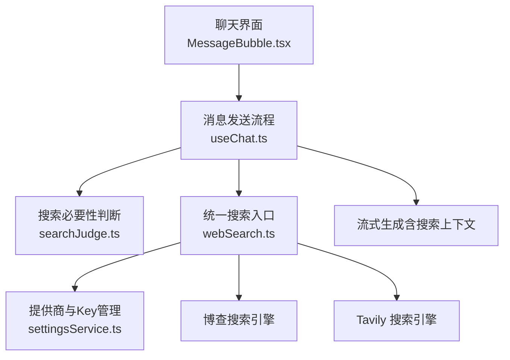
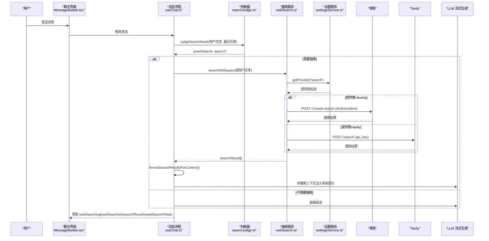
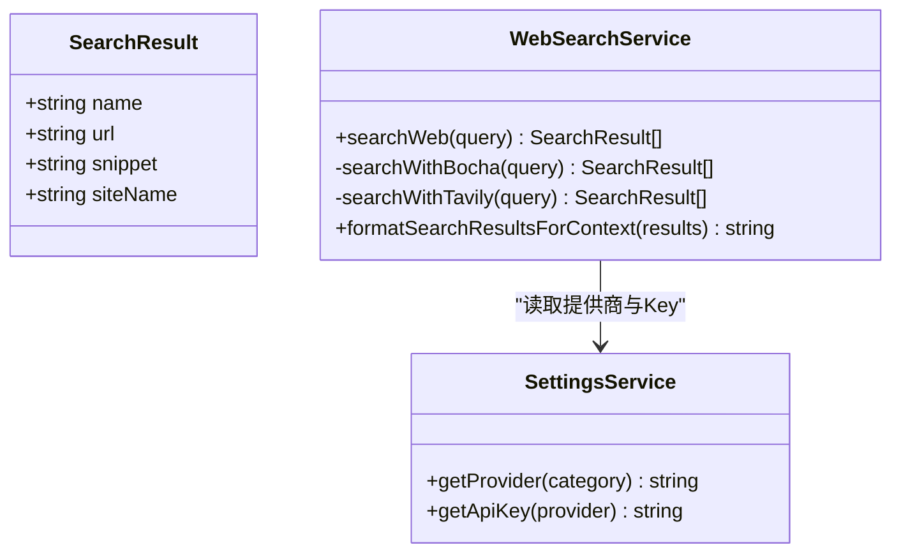
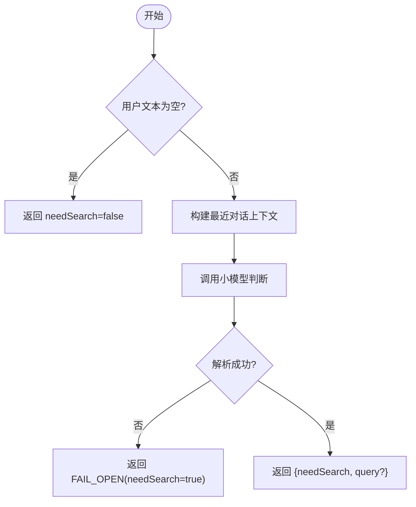
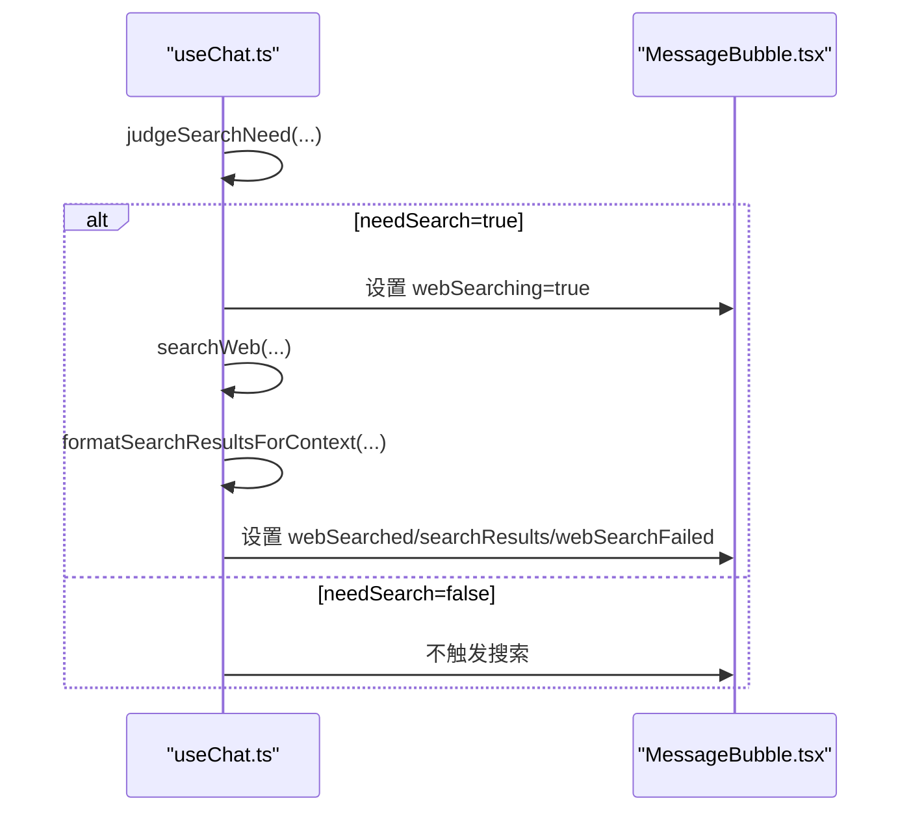
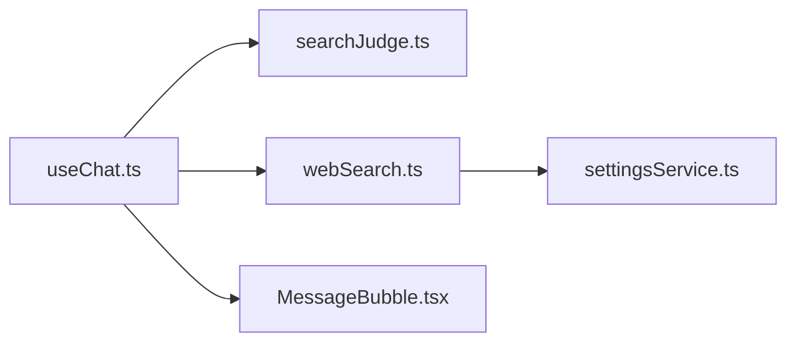

# 搜索 API

<cite>
**本文引用的文件**
- [webSearch.ts](file://src/services/webSearch.ts)
- [settingsService.ts](file://src/services/settingsService.ts)
- [searchJudge.ts](file://src/services/searchJudge.ts)
- [useChat.ts](file://src/hooks/useChat.ts)
- [MessageBubble.tsx](file://src/components/chat/MessageBubble.tsx)
- [index.ts](file://src/types/index.ts)
</cite>

## 目录
1. [简介](#简介)
2. [项目结构](#项目结构)
3. [核心组件](#核心组件)
4. [架构总览](#架构总览)
5. [详细组件分析](#详细组件分析)
6. [依赖关系分析](#依赖关系分析)
7. [性能与优化建议](#性能与优化建议)
8. [故障排查指南](#故障排查指南)
9. [结论](#结论)
10. [附录：API 调用示例与错误处理](#附录api-调用示例与错误处理)

## 简介
本文件为 AIShop 的“联网搜索”能力提供面向开发者的接口文档。内容覆盖：
- 查询语法与参数（关键词、高级过滤、排序）
- 搜索结果数据结构（标题、摘要、URL、站点名等）
- 搜索上下文集成机制（如何将搜索结果注入聊天对话）
- 配置选项（搜索引擎选择、结果数量限制、缓存策略）
- 性能优化建议与最佳实践
- 完整的 API 调用示例与错误处理方案

说明：当前实现以“前端服务层 + 外部搜索引擎”的方式工作，通过统一入口根据设置路由到不同搜索引擎；同时结合小模型判断是否需要联网搜索，并将搜索结果格式化后作为系统提示的一部分参与流式生成。

## 项目结构
围绕搜索能力的核心文件与职责如下：
- src/services/webSearch.ts：统一搜索入口，封装博查与 Tavily 两种引擎的调用与结果归一化，并提供上下文格式化函数。
- src/services/settingsService.ts：本地持久化的提供商与 API Key 管理，用于动态切换搜索引擎。
- src/services/searchJudge.ts：基于小模型的“是否需要联网搜索”判断器，避免对闲聊/代码类问题误触发搜索。
- src/hooks/useChat.ts：在消息发送流程中集成搜索判断、执行搜索、将搜索结果注入上下文，并更新 UI 状态。
- src/components/chat/MessageBubble.tsx：渲染“正在搜索”、“已搜索来源”和“搜索失败”等用户可见状态。
- src/types/index.ts：定义消息体中与搜索相关的字段（如 webSearching、webSearched、searchResults 等）。

图表来源
- [useChat.ts:621-686](file://src/hooks/useChat.ts#L621-L686)
- [webSearch.ts:20-36](file://src/services/webSearch.ts#L20-L36)
- [settingsService.ts:59-84](file://src/services/settingsService.ts#L59-L84)
- [MessageBubble.tsx:812-889](file://src/components/chat/MessageBubble.tsx#L812-L889)

章节来源
- [webSearch.ts:1-117](file://src/services/webSearch.ts#L1-L117)
- [settingsService.ts:1-101](file://src/services/settingsService.ts#L1-L101)
- [searchJudge.ts:1-125](file://src/services/searchJudge.ts#L1-L125)
- [useChat.ts:600-799](file://src/hooks/useChat.ts#L600-L799)
- [MessageBubble.tsx:812-889](file://src/components/chat/MessageBubble.tsx#L812-L889)
- [index.ts:84-107](file://src/types/index.ts#L84-L107)

## 核心组件
- 统一搜索入口 searchWeb(query)
  - 从 settingsService 读取当前搜索提供商（默认 bocha），按 provider 路由到对应引擎。
  - 返回统一的 SearchResult[]，包含 name/url/snippet/siteName。
  - 异常时返回空数组并记录错误日志。
- 搜索引擎适配
  - 博查：POST 请求，携带 Authorization Bearer key，支持 freshness/count/summary 等参数。
  - Tavily：POST 请求，body 中包含 api_key/query/search_depth 等参数。
- 上下文格式化 formatSearchResultsForContext(results)
  - 将搜索结果转换为自然语言段落，供 LLM 作为参考资料使用。
- 搜索必要性判断 judgeSearchNeed(userText, recentMessages)
  - 使用便宜小模型快速判断是否需要联网搜索，避免对不需要的问题触发搜索。
  - 返回 needSearch 与可选 query（更适合搜索引擎的精炼关键词）。
- 聊天集成 useChat
  - 在发送消息前进行判断，必要时执行搜索，将搜索结果注入系统提示，并在 UI 上展示搜索状态与来源。

章节来源
- [webSearch.ts:20-117](file://src/services/webSearch.ts#L20-L117)
- [searchJudge.ts:15-125](file://src/services/searchJudge.ts#L15-L125)
- [useChat.ts:621-686](file://src/hooks/useChat.ts#L621-L686)

## 架构总览
下图展示了从用户输入到搜索结果注入 LLM 的完整流程，以及 UI 的状态反馈。

图表来源
- [useChat.ts:621-686](file://src/hooks/useChat.ts#L621-L686)
- [webSearch.ts:20-117](file://src/services/webSearch.ts#L20-L117)
- [settingsService.ts:59-84](file://src/services/settingsService.ts#L59-L84)
- [searchJudge.ts:80-125](file://src/services/searchJudge.ts#L80-L125)

## 详细组件分析

### 统一搜索入口与数据模型
- 入口函数
  - searchWeb(query): 根据设置选择搜索引擎，返回统一结构的 SearchResult[]。
- 搜索结果数据结构
  - name: 标题/名称
  - url: 链接
  - snippet: 摘要/内容片段
  - siteName: 站点域名或站点名
- 搜索引擎差异
  - 博查：支持 freshness/noLimit、count、summary 等参数，返回 webPages.value 列表。
  - Tavily：支持 search_depth=advanced，返回 results 列表，siteName 由 URL 解析得到。

图表来源
- [webSearch.ts:6-117](file://src/services/webSearch.ts#L6-L117)
- [settingsService.ts:59-84](file://src/services/settingsService.ts#L59-L84)

章节来源
- [webSearch.ts:6-117](file://src/services/webSearch.ts#L6-L117)
- [settingsService.ts:59-84](file://src/services/settingsService.ts#L59-L84)

### 搜索必要性判断
- 目标：避免对闲聊、代码、翻译等明显不需要实时信息的问题触发搜索。
- 方法：调用一个便宜小模型，附带最近几条消息作为上下文，输出 JSON 表示是否需要搜索及精炼关键词。
- 容错：若判断失败，默认放行（FAIL_OPEN），保证该搜的问题不被漏掉。

图表来源
- [searchJudge.ts:21-125](file://src/services/searchJudge.ts#L21-L125)

章节来源
- [searchJudge.ts:15-125](file://src/services/searchJudge.ts#L15-L125)

### 聊天集成与上下文注入
- 流程要点
  - 在发送消息前，先调用 judgeSearchNeed 决定是否搜索。
  - 若需要搜索，立即在 UI 显示“正在搜索...”，然后调用 searchWeb。
  - 将搜索结果格式化为自然语言段落，作为系统提示的一部分传给 LLM。
  - 搜索完成后更新消息状态：webSearching、webSearched、searchResults、webSearchFailed。
- UI 表现
  - 搜索中：顶部显示旋转图标与“正在搜索...”
  - 搜索完成：可折叠展示“已搜索N个来源”，点击可打开链接
  - 搜索失败：黄色提示“联网搜索失败，以下回答未参考网络信息”

图表来源
- [useChat.ts:621-686](file://src/hooks/useChat.ts#L621-L686)
- [MessageBubble.tsx:812-889](file://src/components/chat/MessageBubble.tsx#L812-L889)

章节来源
- [useChat.ts:621-686](file://src/hooks/useChat.ts#L621-L686)
- [MessageBubble.tsx:812-889](file://src/components/chat/MessageBubble.tsx#L812-L889)

### 搜索结果数据结构与字段说明
- 统一结构
  - name: 标题/名称
  - url: 链接
  - snippet: 摘要/内容片段
  - siteName: 站点名或域名
- 与消息类型的关联
  - Message.searchResults: 存储本次搜索的来源列表（name/url/siteName）
  - Message.webSearching/webSearched/webSearchFailed: 控制 UI 状态

章节来源
- [webSearch.ts:6-11](file://src/services/webSearch.ts#L6-L11)
- [index.ts:84-107](file://src/types/index.ts#L84-L107)

## 依赖关系分析
- 模块耦合
  - webSearch.ts 依赖 settingsService.ts 获取提供商与 API Key。
  - useChat.ts 依赖 searchJudge.ts 做搜索必要性判断，并依赖 webSearch.ts 执行搜索。
  - MessageBubble.tsx 消费 useChat.ts 暴露的消息状态来渲染搜索相关 UI。
- 外部依赖
  - 博查搜索引擎 API
  - Tavily 搜索引擎 API
- 潜在风险
  - 若任一搜索引擎不可用，应降级为“搜索失败”并继续生成回答。
  - 若判断层失败，默认放行以保证召回率。

图表来源
- [useChat.ts:621-686](file://src/hooks/useChat.ts#L621-L686)
- [webSearch.ts:20-117](file://src/services/webSearch.ts#L20-L117)
- [settingsService.ts:59-84](file://src/services/settingsService.ts#L59-L84)
- [MessageBubble.tsx:812-889](file://src/components/chat/MessageBubble.tsx#L812-L889)

章节来源
- [useChat.ts:621-686](file://src/hooks/useChat.ts#L621-L686)
- [webSearch.ts:20-117](file://src/services/webSearch.ts#L20-L117)
- [settingsService.ts:59-84](file://src/services/settingsService.ts#L59-L84)
- [MessageBubble.tsx:812-889](file://src/components/chat/MessageBubble.tsx#L812-L889)

## 性能与优化建议
- 减少不必要的搜索
  - 使用 judgeSearchNeed 避免对闲聊/代码类问题触发搜索，降低延迟与成本。
- 控制结果数量
  - 博查侧可通过 count 控制返回条数；Tavily 侧可在后续扩展 depth/limit 等参数。
- 缓存策略
  - 当前未实现搜索缓存。建议对相同 query 的结果进行短期缓存（例如内存 Map，TTL 5-10 分钟），以减少重复请求。
- 并发与超时
  - 为 fetch 增加合理超时与重试（指数退避），避免阻塞主流程。
- 上下文长度
  - formatSearchResultsForContext 会拼接所有结果，建议在结果较多时截断或分页，控制 prompt 长度。
- 提供商切换
  - 通过 settingsService 动态切换搜索引擎，便于 A/B 测试与故障转移。

[本节为通用指导，不直接分析具体文件]

## 故障排查指南
- 常见问题
  - 未配置 API Key：各搜索引擎会在缺少 key 时返回空结果并打印警告。
  - 网络错误/超时：searchWeb 捕获异常并返回空数组，useChat 标记 webSearchFailed。
  - 搜索结果为空：视为失败，仍会继续生成回答，但不会引用网络信息。
- 定位步骤
  - 检查 settingsService 中的 providers 与 apiKeys 是否正确保存。
  - 查看浏览器控制台日志，确认是否出现“Web search failed”或搜索引擎错误。
  - 在 MessageBubble 中观察“正在搜索”、“已搜索来源”、“搜索失败”等状态变化。
- 恢复策略
  - 自动降级：搜索失败不影响正常回答生成。
  - 手动重试：用户可重新发送消息，或在设置中切换搜索引擎。

章节来源
- [webSearch.ts:41-105](file://src/services/webSearch.ts#L41-L105)
- [useChat.ts:644-673](file://src/hooks/useChat.ts#L644-L673)
- [MessageBubble.tsx:812-889](file://src/components/chat/MessageBubble.tsx#L812-L889)

## 结论
AIShop 的搜索能力通过“小模型判断 + 统一搜索入口 + 多引擎适配 + 聊天上下文注入”的组合，实现了按需联网搜索与无缝的用户体验。当前实现已具备：
- 灵活的搜索引擎选择与密钥管理
- 智能的搜索必要性判断
- 稳定的错误降级与 UI 反馈
- 可扩展的数据结构与上下文注入机制

建议后续增强：
- 引入搜索结果的短期缓存与去重
- 提供更丰富的过滤与排序参数（如时间范围、站点白名单、相关性权重）
- 增加搜索质量评估与回退策略（如多引擎并行取优）

[本节为总结性内容，不直接分析具体文件]

## 附录：API 调用示例与错误处理

### 查询语法与参数
- 关键词搜索
  - 直接使用用户问题或 judgeSearchNeed 返回的精炼 query。
- 高级过滤
  - 博查：freshness=noLimit、summary=true、count=10
  - Tavily：search_depth=advanced
- 排序
  - 当前由搜索引擎内部决定；如需自定义排序，可在本地对 SearchResult[] 按 siteName/name/snippet 等字段二次排序。

章节来源
- [webSearch.ts:48-68](file://src/services/webSearch.ts#L48-L68)
- [webSearch.ts:81-104](file://src/services/webSearch.ts#L81-L104)

### 搜索结果数据结构
- 字段
  - name: 标题/名称
  - url: 链接
  - snippet: 摘要/内容片段
  - siteName: 站点名或域名
- 用途
  - 用于 UI 展示来源列表
  - 用于 formatSearchResultsForContext 构造系统提示

章节来源
- [webSearch.ts:6-11](file://src/services/webSearch.ts#L6-L11)
- [webSearch.ts:107-116](file://src/services/webSearch.ts#L107-L116)

### 搜索上下文集成机制
- 将 SearchResult[] 格式化为自然语言段落，作为系统提示的一部分传入 LLM。
- 在 useChat 中，搜索完成后立即更新消息状态，确保 UI 及时反映搜索进度与结果。

章节来源
- [webSearch.ts:107-116](file://src/services/webSearch.ts#L107-L116)
- [useChat.ts:644-673](file://src/hooks/useChat.ts#L644-L673)

### 配置选项
- 搜索引擎选择
  - 通过 settingsService.getProvider('search') 获取当前提供商，默认 bocha。
- 结果数量限制
  - 博查：count 参数控制返回条数。
  - Tavily：可在后续扩展 limit 等参数。
- 缓存策略
  - 当前未实现；建议对相同 query 的结果进行短期缓存。

章节来源
- [settingsService.ts:59-84](file://src/services/settingsService.ts#L59-L84)
- [webSearch.ts:48-68](file://src/services/webSearch.ts#L48-L68)
- [webSearch.ts:81-104](file://src/services/webSearch.ts#L81-L104)

### 完整调用示例（步骤说明）
- 步骤
  1) 调用 judgeSearchNeed 判断是否需要搜索。
  2) 若需要，调用 searchWeb 执行搜索。
  3) 将搜索结果格式化为上下文，并注入系统提示。
  4) 更新 UI 状态（webSearching/webSearched/searchResults/webSearchFailed）。
- 参考路径
  - 判断与执行：useChat.ts 中的搜索分支
  - 搜索实现：webSearch.ts 中的统一入口与引擎适配
  - 上下文格式化：webSearch.ts 中的 formatSearchResultsForContext

章节来源
- [useChat.ts:621-686](file://src/hooks/useChat.ts#L621-L686)
- [webSearch.ts:20-117](file://src/services/webSearch.ts#L20-L117)

### 错误处理方案
- 无 API Key：返回空结果并打印警告。
- 网络错误/超时：捕获异常，标记搜索失败，继续生成回答。
- 搜索引擎返回非 2xx：抛出错误并被上层捕获，标记失败。
- UI 反馈：显示“正在搜索...”、“已搜索来源”或“搜索失败”提示。

章节来源
- [webSearch.ts:41-105](file://src/services/webSearch.ts#L41-L105)
- [useChat.ts:644-673](file://src/hooks/useChat.ts#L644-L673)
- [MessageBubble.tsx:812-889](file://src/components/chat/MessageBubble.tsx#L812-L889)