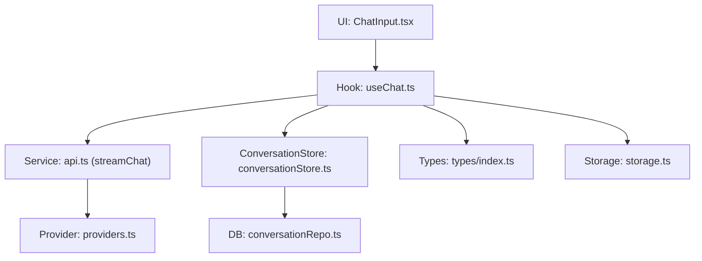
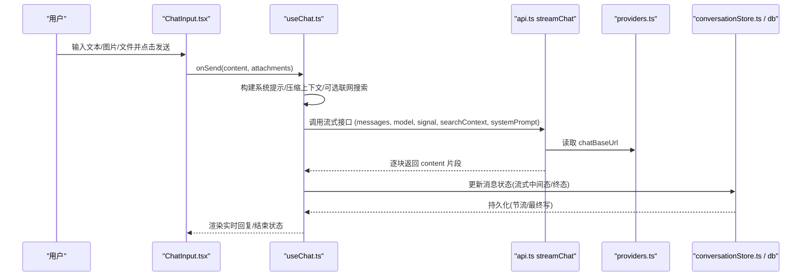
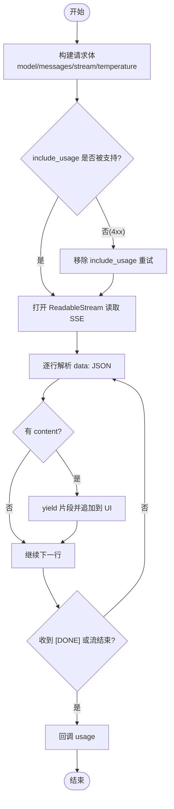
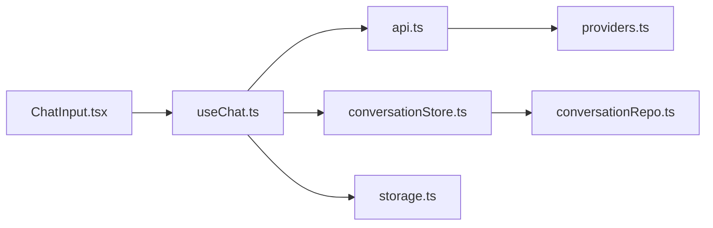

# 聊天 API

<cite>
**本文引用的文件**
- [src/services/api.ts](file://src/services/api.ts)
- [src/hooks/useChat.ts](file://src/hooks/useChat.ts)
- [src/components/chat/ChatInput.tsx](file://src/components/chat/ChatInput.tsx)
- [src/types/index.ts](file://src/types/index.ts)
- [src/config/providers.ts](file://src/config/providers.ts)
- [src/services/conversationStore.ts](file://src/services/conversationStore.ts)
- [src/db/conversationRepo.ts](file://src/db/conversationRepo.ts)
- [src/services/storage.ts](file://src/services/storage.ts)
</cite>

## 目录
1. [简介](#简介)
2. [项目结构](#项目结构)
3. [核心组件](#核心组件)
4. [架构总览](#架构总览)
5. [详细组件分析](#详细组件分析)
6. [依赖关系分析](#依赖关系分析)
7. [性能考量](#性能考量)
8. [故障排查指南](#故障排查指南)
9. [结论](#结论)
10. [附录：接口与示例](#附录接口与示例)

## 简介
本文件为 AIShop 聊天模块的接口与集成文档，聚焦于“聊天消息发送”“流式响应（SSE）”“多模态消息（文本、图像、文件）”“会话管理（创建、历史加载、状态同步）”以及“客户端集成要点（连接管理与消息序列化）”。内容基于仓库中的前端实现进行梳理，便于后端对接与客户端集成。

## 项目结构
AIShop 的聊天能力由以下关键部分组成：
- 类型定义：统一消息、会话、用量等数据结构
- 服务层：封装 SSE 流式请求、提供商配置、本地存储
- Hook 层：编排发送流程、压缩策略、联网搜索、流式渲染
- UI 层：输入框、附件上传、引用消息、停止生成
- 持久化：IndexedDB 会话与消息读写、增量落盘

图表来源
- [src/components/chat/ChatInput.tsx:1-467](file://src/components/chat/ChatInput.tsx#L1-L467)
- [src/hooks/useChat.ts:1-800](file://src/hooks/useChat.ts#L1-L800)
- [src/services/api.ts:1-173](file://src/services/api.ts#L1-L173)
- [src/config/providers.ts:1-19](file://src/config/providers.ts#L1-L19)
- [src/services/conversationStore.ts:1-348](file://src/services/conversationStore.ts#L1-L348)
- [src/db/conversationRepo.ts:1-108](file://src/db/conversationRepo.ts#L1-L108)
- [src/types/index.ts:1-252](file://src/types/index.ts#L1-L252)
- [src/services/storage.ts:1-63](file://src/services/storage.ts#L1-L63)

章节来源
- [src/components/chat/ChatInput.tsx:1-467](file://src/components/chat/ChatInput.tsx#L1-L467)
- [src/hooks/useChat.ts:1-800](file://src/hooks/useChat.ts#L1-L800)
- [src/services/api.ts:1-173](file://src/services/api.ts#L1-L173)
- [src/config/providers.ts:1-19](file://src/config/providers.ts#L1-L19)
- [src/services/conversationStore.ts:1-348](file://src/services/conversationStore.ts#L1-L348)
- [src/db/conversationRepo.ts:1-108](file://src/db/conversationRepo.ts#L1-L108)
- [src/types/index.ts:1-252](file://src/types/index.ts#L1-L252)
- [src/services/storage.ts:1-63](file://src/services/storage.ts#L1-L63)

## 核心组件
- 流式聊天服务：提供异步生成器，按块推送文本片段，支持用量统计与错误重试
- 会话与消息模型：Message、MessageContent、FileAttachment、Conversation、TokenUsage 等
- 会话持久化：增量写入、流式节流落盘、分页加载历史
- 输入与多模态：支持纯文本、图文混排、文件附件（文本内容注入上下文）
- 提供商配置：可切换后端地址，默认使用 OpenAI 兼容路径

章节来源
- [src/services/api.ts:44-173](file://src/services/api.ts#L44-L173)
- [src/types/index.ts:1-252](file://src/types/index.ts#L1-L252)
- [src/services/conversationStore.ts:1-348](file://src/services/conversationStore.ts#L1-L348)
- [src/components/chat/ChatInput.tsx:1-467](file://src/components/chat/ChatInput.tsx#L1-L467)
- [src/config/providers.ts:1-19](file://src/config/providers.ts#L1-L19)

## 架构总览
聊天发送端到响应的整体流程如下：

图表来源
- [src/components/chat/ChatInput.tsx:70-118](file://src/components/chat/ChatInput.tsx#L70-L118)
- [src/hooks/useChat.ts:494-783](file://src/hooks/useChat.ts#L494-L783)
- [src/services/api.ts:44-173](file://src/services/api.ts#L44-L173)
- [src/config/providers.ts:7-18](file://src/config/providers.ts#L7-L18)
- [src/services/conversationStore.ts:184-257](file://src/services/conversationStore.ts#L184-L257)

## 详细组件分析

### 聊天消息发送接口
- 请求入口
  - 前端通过 Hook 组装 messages、systemPrompt、searchContext，调用流式接口
  - 请求体包含 model、messages、stream=true、temperature 等
  - 可选 include_usage 以获取真实 token 用量；若网关不支持会回退重试
- 参数说明
  - model: 模型标识
  - messages: 系统提示 + 历史消息（含文本与图片），图片在发送前会被内联为 data URL
  - stream: true
  - temperature: 采样温度
  - stream_options.include_usage: 可选，用于获取 usage
- 响应处理
  - 使用 ReadableStream 解析 SSE 行，提取 delta.content 拼接输出
  - 遇到 [DONE] 或流结束时，回调 usage 供展示
  - 对 4xx 且包含特定关键字的错误自动去掉 include_usage 重试一次

章节来源
- [src/services/api.ts:44-173](file://src/services/api.ts#L44-L173)
- [src/hooks/useChat.ts:678-740](file://src/hooks/useChat.ts#L678-L740)

### 流式响应（SSE）机制
- 连接建立
  - 使用 fetch 发起 POST 到 provider.chatBaseUrl/chat/completions
  - 设置 Authorization 头与 Content-Type
- 数据分块传输
  - 服务端以 SSE 格式返回 data: JSON 行，最后可能附带 usage
  - 客户端按行缓冲、解析 JSON，提取 choices[0].delta.content 并 yield
- 错误重连处理
  - 当 include_usage 不被识别时，服务端返回 4xx，客户端捕获后移除该字段并重试
  - 非 4xx 错误直接抛出，上层捕获并更新 UI

图表来源
- [src/services/api.ts:84-173](file://src/services/api.ts#L84-L173)

章节来源
- [src/services/api.ts:84-173](file://src/services/api.ts#L84-L173)

### 多模态消息支持
- 文本
  - 普通字符串或 MessageContent[] 中的 text 项
- 图像
  - 通过 MessageContent[] 中 type=image_url 的项携带 base64 图片
  - 发送前将 IndexedDB 中的 blob 引用还原为 data URL 以便模型消费
- 文件
  - 支持拖拽/选择上传多种格式（txt/md/pdf/csv/json/doc/docx/pptx/ppt/rtf/odt/odp/ods/xlsx/xls）
  - 文件大小限制 20MB，最多 5 个文件
  - 文本类文件会被解析为文本内容，并以固定格式拼接到上下文中作为“用户上传了文档”的上下文
  - 图片类文件以 image_url 形式加入消息

章节来源
- [src/components/chat/ChatInput.tsx:61-228](file://src/components/chat/ChatInput.tsx#L61-L228)
- [src/components/chat/ChatInput.tsx:70-118](file://src/components/chat/ChatInput.tsx#L70-L118)
- [src/hooks/useChat.ts:571-595](file://src/hooks/useChat.ts#L571-L595)
- [src/services/api.ts:69-82](file://src/services/api.ts#L69-L82)
- [src/types/index.ts:53-65](file://src/types/index.ts#L53-L65)

### 会话管理端点与流程
由于本项目为前端应用，会话管理通过 IndexedDB 完成，不涉及后端 REST 端点。以下为前端侧的关键流程：
- 会话创建
  - 启动时若无活跃会话则创建新记录，并持久化
  - 支持复用空会话避免重复创建
- 历史消息获取
  - 打开会话时加载最近 N 条消息（默认 60 条）
  - 向上滚动加载更多更早的消息（每次 40 条）
- 会话状态同步
  - 元数据变更（标题、模型、收藏等）走局部 patch
  - 消息变更采用 diff 后定向写入，流式期间节流落盘，页面隐藏/关闭前强制 flush

章节来源
- [src/services/conversationStore.ts:64-112](file://src/services/conversationStore.ts#L64-L112)
- [src/services/conversationStore.ts:184-257](file://src/services/conversationStore.ts#L184-L257)
- [src/db/conversationRepo.ts:14-108](file://src/db/conversationRepo.ts#L14-L108)
- [src/hooks/useChat.ts:195-288](file://src/hooks/useChat.ts#L195-L288)

### 客户端集成要点
- WebSocket 连接管理
  - 当前实现不使用 WebSocket，而是基于 fetch + ReadableStream 的 SSE 流式传输
  - 如需接入 WebSocket，需替换 streamChat 的实现并保持相同的消息协议
- 消息序列化
  - 发送前将图片从 IndexedDB 还原为 data URL
  - 文件附件以结构化方式注入上下文，避免破坏消息时序
  - 流式过程中按行解析 SSE，丢弃残缺 JSON，保证稳定性
- 错误与取消
  - 支持 AbortController 中断生成，标记 stoppedByUser
  - 对 include_usage 不兼容的后端自动降级重试
  - 网络/鉴权错误统一捕获并提示

章节来源
- [src/services/api.ts:84-118](file://src/services/api.ts#L84-L118)
- [src/hooks/useChat.ts:741-783](file://src/hooks/useChat.ts#L741-L783)
- [src/services/api.ts:120-173](file://src/services/api.ts#L120-L173)

## 依赖关系分析
- 组件耦合
  - ChatInput 仅依赖 Hook 暴露的 onSend/onStop，低耦合
  - useChat 依赖 api.ts 的流式能力、conversationStore 的持久化、storage 的设置存取
  - api.ts 依赖 providers.ts 的 endpoint 配置
- 外部依赖
  - 后端 OpenAI 兼容接口 /chat/completions
  - IndexedDB 用于会话与消息持久化
  - localStorage 用于轻量设置（模型、搜索开关、上次会话 ID）

图表来源
- [src/components/chat/ChatInput.tsx:1-467](file://src/components/chat/ChatInput.tsx#L1-L467)
- [src/hooks/useChat.ts:1-800](file://src/hooks/useChat.ts#L1-L800)
- [src/services/api.ts:1-173](file://src/services/api.ts#L1-L173)
- [src/config/providers.ts:1-19](file://src/config/providers.ts#L1-L19)
- [src/services/conversationStore.ts:1-348](file://src/services/conversationStore.ts#L1-L348)
- [src/db/conversationRepo.ts:1-108](file://src/db/conversationRepo.ts#L1-L108)
- [src/services/storage.ts:1-63](file://src/services/storage.ts#L1-L63)

章节来源
- [src/components/chat/ChatInput.tsx:1-467](file://src/components/chat/ChatInput.tsx#L1-L467)
- [src/hooks/useChat.ts:1-800](file://src/hooks/useChat.ts#L1-L800)
- [src/services/api.ts:1-173](file://src/services/api.ts#L1-L173)
- [src/config/providers.ts:1-19](file://src/config/providers.ts#L1-L19)
- [src/services/conversationStore.ts:1-348](file://src/services/conversationStore.ts#L1-L348)
- [src/db/conversationRepo.ts:1-108](file://src/db/conversationRepo.ts#L1-L108)
- [src/services/storage.ts:1-63](file://src/services/storage.ts#L1-L63)

## 性能考量
- 流式节流落盘：流式期间每 1 秒批量写入一次，避免频繁 IO 导致卡顿
- 增量持久化：仅写入变化的消息与元数据，减少磁盘压力
- 按需加载：会话列表只读元数据，进入会话再加载最近消息，提升首屏速度
- 图片内联时机：仅在发送前还原图片，避免提前占用内存
- 压缩策略：接近上下文上限时自动压缩冷区间，降低 token 消耗

章节来源
- [src/services/conversationStore.ts:39-44](file://src/services/conversationStore.ts#L39-L44)
- [src/services/conversationStore.ts:153-183](file://src/services/conversationStore.ts#L153-L183)
- [src/services/conversationStore.ts:184-257](file://src/services/conversationStore.ts#L184-L257)
- [src/services/api.ts:69-82](file://src/services/api.ts#L69-L82)

## 故障排查指南
- 无法获取用量
  - 现象：usage 未返回
  - 原因：部分网关不支持 include_usage
  - 处理：已自动降级重试，无需额外操作
- 请求失败
  - 现象：显示“请求失败”
  - 原因：网络异常、鉴权失败、后端 5xx
  - 处理：检查网络与 API Key，查看错误信息
- 流式中断
  - 现象：生成中途停止
  - 原因：用户主动停止或网络断开
  - 处理：检查 AbortController 状态，必要时重新发送
- 文件过大或格式不支持
  - 现象：提示超过大小限制或格式不支持
  - 处理：压缩文件或更换格式

章节来源
- [src/services/api.ts:102-118](file://src/services/api.ts#L102-L118)
- [src/hooks/useChat.ts:741-783](file://src/hooks/useChat.ts#L741-L783)
- [src/components/chat/ChatInput.tsx:155-184](file://src/components/chat/ChatInput.tsx#L155-L184)

## 结论
AIShop 的聊天 API 通过前端流式 SSE 实现即时响应，结合多模态消息与智能压缩策略，兼顾体验与成本。会话管理完全在本地完成，具备高可用与离线友好特性。后端只需提供 OpenAI 兼容的 /chat/completions 接口即可无缝对接。

## 附录：接口与示例

### 请求格式（POST /chat/completions）
- 路径
  - {provider.chatBaseUrl}/chat/completions
- 头部
  - Content-Type: application/json
  - Authorization: Bearer {apiKey}
- 请求体字段
  - model: string
  - messages: Array<{role, content}>
    - role: system | user | assistant
    - content: string | Array<{type:'text'|'image_url', text?, image_url:{url}} >
  - stream: true
  - temperature: number
  - stream_options.include_usage: boolean（可选）
- 响应
  - SSE 流，每行 data: JSON
  - 典型 chunk: {choices:[{delta:{content:"..."}}]}
  - 结尾可能包含 usage 的独立 chunk
  - 结束标志: data: [DONE]

章节来源
- [src/services/api.ts:84-173](file://src/services/api.ts#L84-L173)
- [src/config/providers.ts:7-18](file://src/config/providers.ts#L7-L18)

### 参数验证与约束
- 图片
  - 通过 MessageContent[] 的 image_url 传递 base64
  - 发送前会将 IndexedDB 中的 blob 引用转换为 data URL
- 文件
  - 最大单文件 20MB，最多 5 个
  - 支持的文本格式：txt/md/pdf/csv/json/doc/docx/pptx/ppt/rtf/odt/odp/ods/xlsx/xls
  - 图片格式：jpg/jpeg/png/gif/webp/bmp/svg
- 上下文
  - 系统提示与搜索上下文会作为 system 消息插入
  - 文件内容会以固定格式注入到用户消息之前

章节来源
- [src/components/chat/ChatInput.tsx:61-228](file://src/components/chat/ChatInput.tsx#L61-L228)
- [src/hooks/useChat.ts:571-595](file://src/hooks/useChat.ts#L571-L595)
- [src/services/api.ts:61-82](file://src/services/api.ts#L61-L82)

### 响应结构与用法
- 流式内容
  - 逐块 delta.content 拼接为完整回复
  - 流结束后清理 artifact/suggestions 等标记
- 用量统计
  - 若支持 include_usage，会在流末尾返回 usage
  - 字段包括 promptTokens、completionTokens、totalTokens、cachedTokens、cacheWriteTokens

章节来源
- [src/services/api.ts:127-173](file://src/services/api.ts#L127-L173)
- [src/types/index.ts:34-42](file://src/types/index.ts#L34-L42)

### 错误码与异常处理
- 4xx 且包含 stream_options/include_usage/unknown/unsupported/invalid
  - 行为：移除 include_usage 重试一次
- 其他 4xx/5xx
  - 行为：抛出错误，上层捕获并提示
- AbortError
  - 行为：标记 stoppedByUser，停止流式更新

章节来源
- [src/services/api.ts:102-118](file://src/services/api.ts#L102-L118)
- [src/hooks/useChat.ts:741-783](file://src/hooks/useChat.ts#L741-L783)

### 客户端集成指南
- 连接管理
  - 使用 fetch + ReadableStream 实现 SSE，无需 WebSocket
  - 支持 AbortController 中断请求
- 消息序列化
  - 发送前将图片还原为 data URL
  - 文件内容以结构化方式注入上下文
  - 流式接收按行解析，忽略残缺 JSON
- 状态同步
  - 流式中间态节流落盘，页面隐藏/关闭前强制 flush
  - 会话元数据变更走局部 patch，减少写入开销

章节来源
- [src/services/api.ts:120-173](file://src/services/api.ts#L120-L173)
- [src/services/conversationStore.ts:153-183](file://src/services/conversationStore.ts#L153-L183)
- [src/services/conversationStore.ts:338-348](file://src/services/conversationStore.ts#L338-L348)