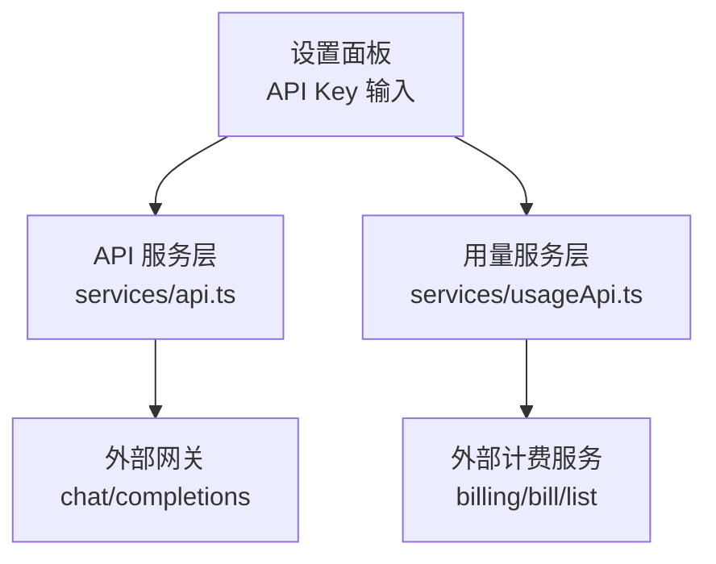
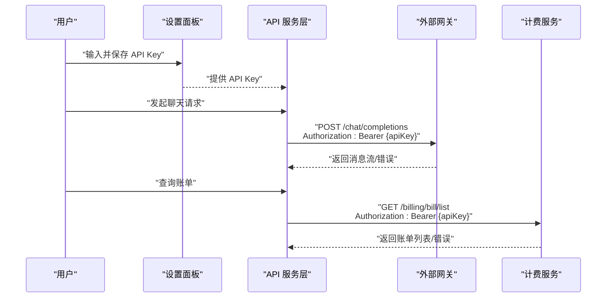
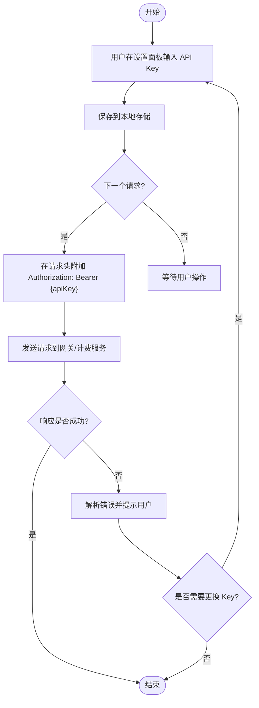
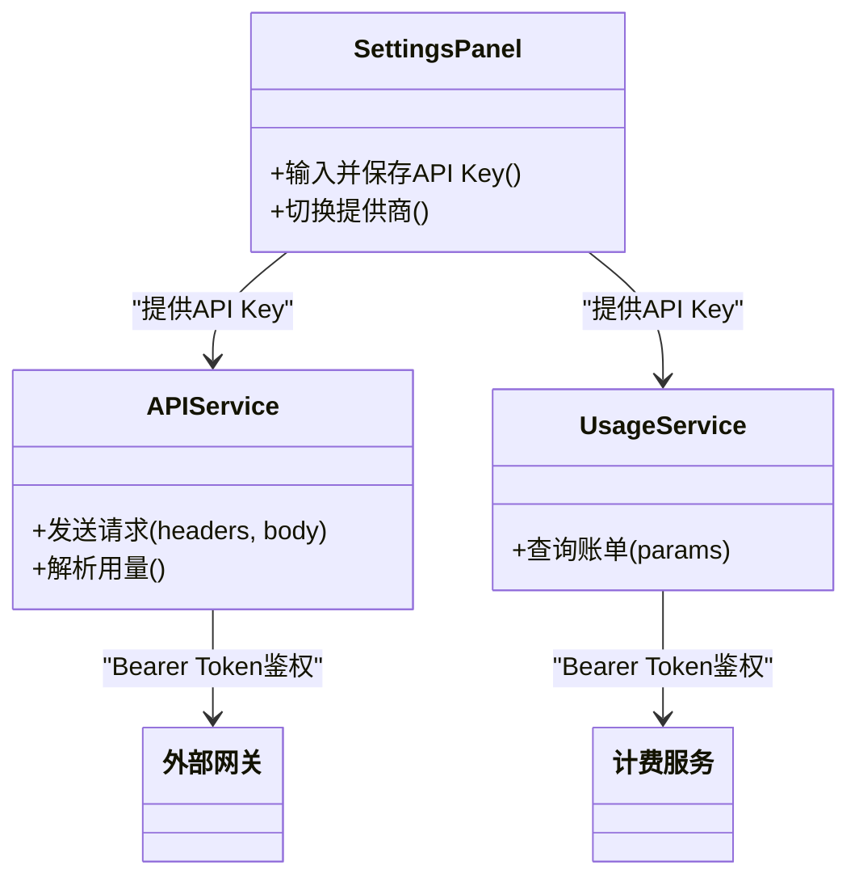
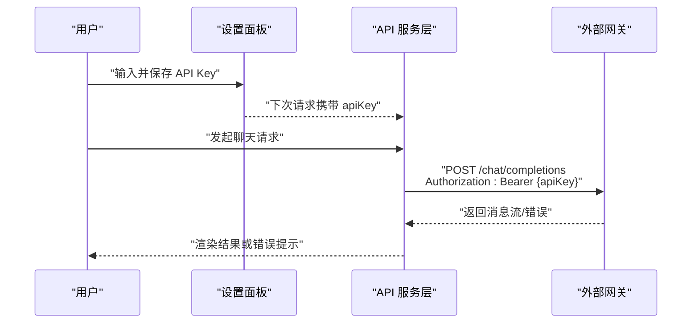
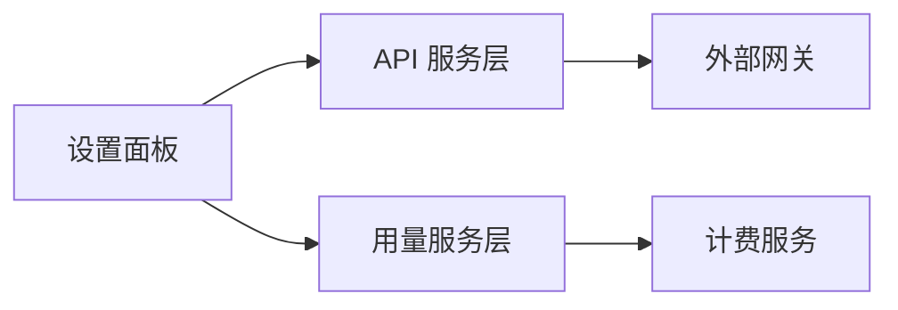

# 访问控制 API

<cite>
**本文引用的文件**
- [README.md](file://README.md)
- [package.json](file://package.json)
- [vite.config.ts](file://vite.config.ts)
- [src/services/api.ts](file://src/services/api.ts)
- [src/services/usageApi.ts](file://src/services/usageApi.ts)
- [src/components/settings/SettingsPanel.tsx](file://src/components/settings/SettingsPanel.tsx)
</cite>

## 目录
1. [简介](#简介)
2. [项目结构](#项目结构)
3. [核心组件](#核心组件)
4. [架构总览](#架构总览)
5. [详细组件分析](#详细组件分析)
6. [依赖关系分析](#依赖关系分析)
7. [性能考虑](#性能考虑)
8. [故障排查指南](#故障排查指南)
9. [结论](#结论)
10. [附录](#附录)

## 简介
本安全文档聚焦 AIShop 的访问控制相关能力，围绕“访问码验证接口”的认证流程（令牌生成、验证与刷新）、权限检查逻辑（用户角色与资源访问控制）、安全策略配置（访问频率限制、IP 白名单、会话管理）、错误响应格式与安全事件日志记录进行系统化说明。同时提供完整的认证流程示例、常见问题解决方案以及部署最佳实践，帮助开发者在生产环境中安全、稳定地运行 AIShop。

## 项目结构
AIShop 采用前端工程化组织方式，核心访问控制与安全相关代码主要位于 services 层与设置面板中：
- services/api.ts：封装对外部网关的调用，统一注入 Authorization 头，体现基于令牌的鉴权模式。
- services/usageApi.ts：账单查询等外部服务调用，同样使用 Bearer Token 鉴权。
- components/settings/SettingsPanel.tsx：提供 API Key 输入与管理界面，是令牌来源的前端入口。
- 其他配置文件（如 vite.config.ts、package.json）用于构建与依赖管理，不直接承载访问控制逻辑。

图表来源
- [src/components/settings/SettingsPanel.tsx:181-204](file://src/components/settings/SettingsPanel.tsx#L181-L204)
- [src/services/api.ts:84-106](file://src/services/api.ts#L84-L106)
- [src/services/usageApi.ts:46-73](file://src/services/usageApi.ts#L46-L73)

章节来源
- [README.md:1-74](file://README.md#L1-L74)
- [package.json:1-200](file://package.json)
- [vite.config.ts:1-200](file://vite.config.ts)

## 核心组件
- 令牌注入与鉴权：所有对外请求在 headers 中携带 Authorization: Bearer <token>，由前端服务层统一组装，确保下游网关能识别并校验令牌。
- 令牌来源与生命周期：通过设置面板收集并持久化 API Key；应用启动或切换提供商时从本地存储读取并注入到后续请求。
- 错误处理与重试：对不支持的参数或网关差异进行兼容处理（例如 stream_options 不被支持时的降级重试）。
- 用量与计费：独立的服务模块负责查询账单信息，同样遵循 Bearer Token 鉴权。

章节来源
- [src/services/api.ts:84-106](file://src/services/api.ts#L84-L106)
- [src/services/usageApi.ts:46-73](file://src/services/usageApi.ts#L46-L73)
- [src/components/settings/SettingsPanel.tsx:181-204](file://src/components/settings/SettingsPanel.tsx#L181-L204)

## 架构总览
下图展示了 AIShop 访问控制的端到端流程：用户在设置面板输入 API Key，服务层将其作为 Bearer Token 附加到每个出站请求；网关侧完成令牌校验后返回业务数据或错误。

图表来源
- [src/components/settings/SettingsPanel.tsx:181-204](file://src/components/settings/SettingsPanel.tsx#L181-L204)
- [src/services/api.ts:84-106](file://src/services/api.ts#L84-L106)
- [src/services/usageApi.ts:46-73](file://src/services/usageApi.ts#L46-L73)

## 详细组件分析

### 令牌生成、验证与刷新机制
- 令牌生成：在本项目中，令牌即上游提供商的 API Key，由用户在设置面板输入并保存。该 Key 将作为 Bearer Token 用于后续所有外部调用。
- 令牌验证：每次请求均携带 Authorization: Bearer <apiKey>，由网关或服务端进行签名与权限校验。若校验失败，将返回相应 HTTP 状态码与错误信息。
- 令牌刷新：当 API Key 变更时，需在设置面板更新并重新保存；前端会在下一次请求时自动使用新 Key。建议结合本地存储与版本控制，避免旧 Key 残留。

图表来源
- [src/components/settings/SettingsPanel.tsx:181-204](file://src/components/settings/SettingsPanel.tsx#L181-L204)
- [src/services/api.ts:84-106](file://src/services/api.ts#L84-L106)
- [src/services/usageApi.ts:46-73](file://src/services/usageApi.ts#L46-L73)

章节来源
- [src/components/settings/SettingsPanel.tsx:181-204](file://src/components/settings/SettingsPanel.tsx#L181-L204)
- [src/services/api.ts:84-106](file://src/services/api.ts#L84-L106)
- [src/services/usageApi.ts:46-73](file://src/services/usageApi.ts#L46-L73)

### 权限检查的实现逻辑（用户角色管理与资源访问控制）
- 当前实现以“令牌即权限”的方式工作：只要持有有效的 API Key，即可访问对应的外部服务。
- 角色与资源控制：如需更细粒度的权限控制（如按角色限制模型、功能或配额），应在网关或服务端层实现，并在前端根据返回结果展示可用能力。
- 建议扩展：在服务层增加本地权限缓存与校验，结合后端返回的角色/权限字段，动态启用或禁用功能入口。

图表来源
- [src/components/settings/SettingsPanel.tsx:181-204](file://src/components/settings/SettingsPanel.tsx#L181-L204)
- [src/services/api.ts:84-106](file://src/services/api.ts#L84-L106)
- [src/services/usageApi.ts:46-73](file://src/services/usageApi.ts#L46-L73)

章节来源
- [src/components/settings/SettingsPanel.tsx:181-204](file://src/components/settings/SettingsPanel.tsx#L181-L204)
- [src/services/api.ts:84-106](file://src/services/api.ts#L84-L106)
- [src/services/usageApi.ts:46-73](file://src/services/usageApi.ts#L46-L73)

### 安全策略配置（访问频率限制、IP 白名单、会话管理）
- 访问频率限制：建议在网关层实施速率限制（如每分钟请求数、并发上限），防止滥用与资源耗尽。
- IP 白名单：可在网关或反向代理层配置允许的客户端 IP 范围，减少未授权访问风险。
- 会话管理：对于需要会话状态的交互，建议使用服务端会话或短期令牌（JWT）配合刷新机制，避免在前端长期暴露敏感凭证。

[本节为通用安全策略建议，不直接分析具体文件]

### 错误响应格式与安全事件日志记录
- 错误响应：当网关或服务返回非 2xx 状态码时，应解析响应体并向上抛出结构化错误，便于上层捕获与提示。
- 日志记录：建议记录关键安全事件（如鉴权失败、异常重试、超时），包含时间戳、请求路径、状态码与摘要信息，便于审计与排障。

章节来源
- [src/services/api.ts:84-106](file://src/services/api.ts#L84-L106)
- [src/services/usageApi.ts:46-73](file://src/services/usageApi.ts#L46-L73)

### 完整认证流程示例
以下示例展示从用户输入 API Key 到成功调用外部服务的完整流程：

图表来源
- [src/components/settings/SettingsPanel.tsx:181-204](file://src/components/settings/SettingsPanel.tsx#L181-L204)
- [src/services/api.ts:84-106](file://src/services/api.ts#L84-L106)

章节来源
- [src/components/settings/SettingsPanel.tsx:181-204](file://src/components/settings/SettingsPanel.tsx#L181-L204)
- [src/services/api.ts:84-106](file://src/services/api.ts#L84-L106)

### 常见安全问题与解决方案
- 问题：API Key 泄露或被恶意抓取
  - 方案：最小化前端暴露面，使用网关层鉴权与限流；必要时引入短期令牌与刷新机制。
- 问题：频繁请求导致资源耗尽
  - 方案：实施速率限制与熔断策略；对异常流量进行告警与封禁。
- 问题：未授权访问
  - 方案：启用 IP 白名单与域名校验；对所有出站请求强制携带 Authorization。
- 问题：错误信息泄露敏感数据
  - 方案：统一错误响应格式，仅返回必要信息；服务端记录详细日志但不回显给客户端。

[本节为通用安全建议，不直接分析具体文件]

## 依赖关系分析
- 前端服务层依赖外部网关与计费服务，并通过统一的 Authorization 头进行鉴权。
- 设置面板为令牌来源，影响所有后续请求的安全上下文。
- 构建与运行时依赖由 package.json 与 vite.config.ts 管理，确保环境一致性与可重现性。

图表来源
- [src/components/settings/SettingsPanel.tsx:181-204](file://src/components/settings/SettingsPanel.tsx#L181-L204)
- [src/services/api.ts:84-106](file://src/services/api.ts#L84-L106)
- [src/services/usageApi.ts:46-73](file://src/services/usageApi.ts#L46-L73)

章节来源
- [package.json:1-200](file://package.json)
- [vite.config.ts:1-200](file://vite.config.ts)

## 性能考虑
- 请求合并与去重：对高频短请求进行合并，减少网络开销。
- 超时与重试：为外部调用设置合理超时与重试策略，避免阻塞主线程。
- 流式响应：优先使用流式传输以降低首字节延迟。
- 缓存策略：对只读数据（如模型列表）进行本地缓存，减少重复请求。

[本节为通用性能建议，不直接分析具体文件]

## 故障排查指南
- 鉴权失败：检查 Authorization 头是否正确携带；确认 API Key 有效且未被吊销。
- 网关不支持参数：参考现有实现中对 stream_options 的兼容处理，遇到 4xx 时降级重试。
- 超时与中断：检查网络环境与超时配置；必要时增加重试与退避策略。
- 日志定位：查看服务端日志中的鉴权失败、异常堆栈与请求摘要，快速定位问题根因。

章节来源
- [src/services/api.ts:84-106](file://src/services/api.ts#L84-L106)
- [src/services/usageApi.ts:46-73](file://src/services/usageApi.ts#L46-L73)

## 结论
AIShop 的访问控制以“Bearer Token 鉴权”为核心，通过设置面板集中管理 API Key，并在服务层统一注入到所有出站请求。为保障生产环境安全，建议结合网关层的速率限制、IP 白名单与会话管理，完善错误响应格式与安全事件日志记录。通过上述措施，可有效降低未授权访问与滥用风险，提升系统的稳定性与可维护性。

## 附录
- 部署建议
  - 在反向代理或网关层启用 HTTPS、CORS 与速率限制。
  - 使用环境变量或密钥管理服务注入 API Key，避免硬编码。
  - 定期轮换 API Key，并监控异常访问行为。
- 最佳实践
  - 最小权限原则：仅授予必要的模型与功能访问。
  - 分层鉴权：前端做基础校验，网关与服务端做最终校验。
  - 可观测性：记录关键安全事件，建立告警与审计机制。

[本节为通用建议，不直接分析具体文件]