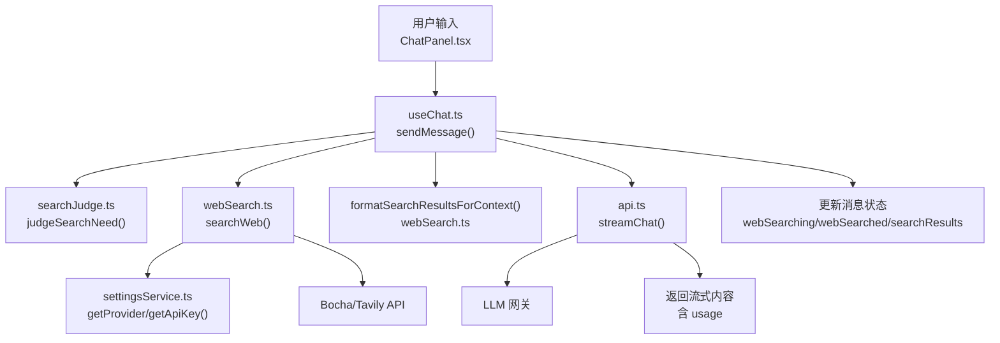
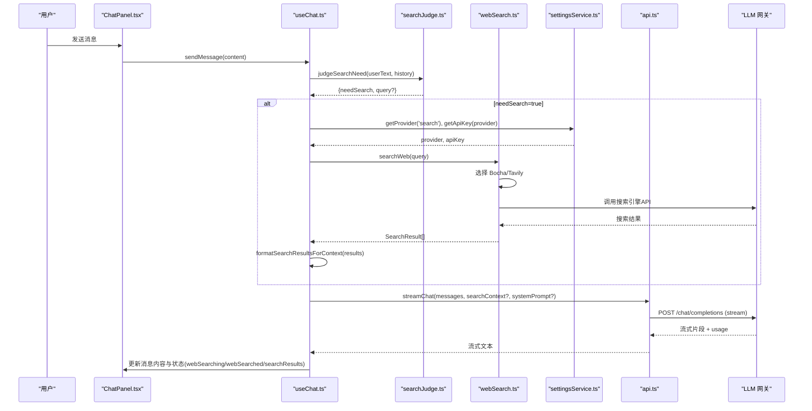
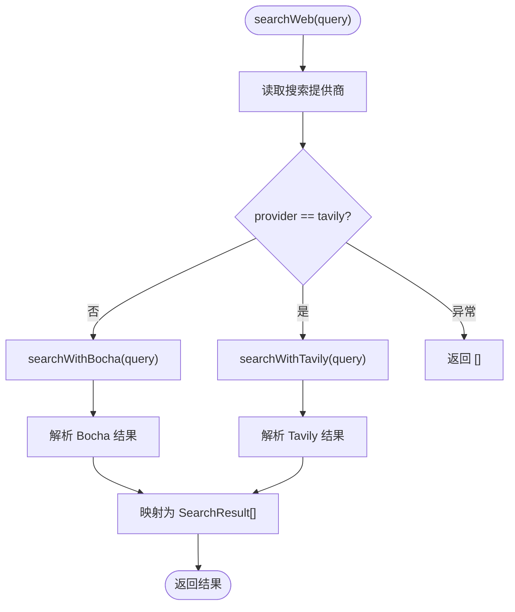
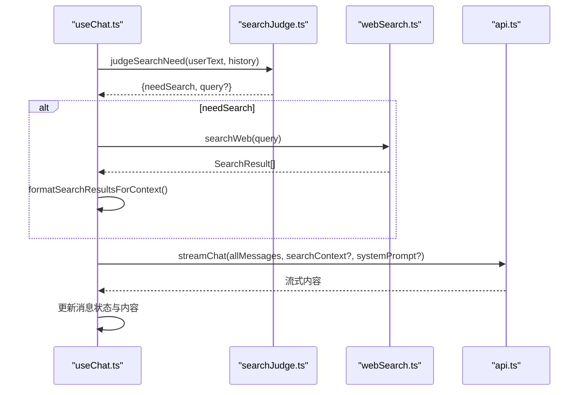
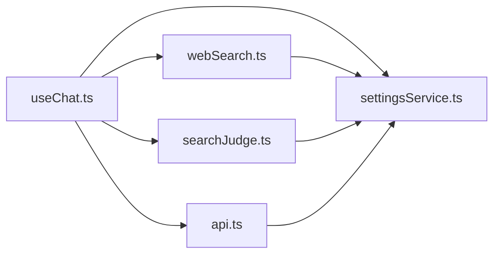

# 网络搜索集成

<cite>
**本文引用的文件**
- [webSearch.ts](file://src/services/webSearch.ts)
- [settingsService.ts](file://src/services/settingsService.ts)
- [searchJudge.ts](file://src/services/searchJudge.ts)
- [useChat.ts](file://src/hooks/useChat.ts)
- [api.ts](file://src/services/api.ts)
- [index.ts](file://src/types/index.ts)
- [ChatPanel.tsx](file://src/components/chat/ChatPanel.tsx)
</cite>

## 目录
1. [简介](#简介)
2. [项目结构](#项目结构)
3. [核心组件](#核心组件)
4. [架构总览](#架构总览)
5. [详细组件分析](#详细组件分析)
6. [依赖关系分析](#依赖关系分析)
7. [性能与缓存策略](#性能与缓存策略)
8. [故障排查指南](#故障排查指南)
9. [结论](#结论)
10. [附录：配置与扩展](#附录配置与扩展)

## 简介
本文件面向 AIShop 的“网络搜索集成功能”，系统性说明：
- Web 搜索服务的调用方式、参数配置与结果格式化逻辑
- 搜索结果的结构化处理（标题提取、摘要生成、URL 规范化等）
- 搜索上下文的构建方式，以及在聊天对话中的集成使用
- 搜索服务的错误处理与降级策略
- 搜索功能的配置方法与自定义扩展指南
- 搜索性能优化与缓存策略建议

## 项目结构
与网络搜索相关的关键代码主要分布在以下位置：
- 搜索服务与提供商路由：src/services/webSearch.ts
- 设置与密钥管理：src/services/settingsService.ts
- 是否需要联网的判断：src/services/searchJudge.ts
- 聊天流程集成（发送消息、构造上下文、状态更新）：src/hooks/useChat.ts
- LLM 流式请求与系统提示注入：src/services/api.ts
- 类型定义（消息、版本、用量等）：src/types/index.ts
- 聊天面板 UI（展示搜索状态、来源等）：src/components/chat/ChatPanel.tsx

图表来源
- [useChat.ts:494-782](file://src/hooks/useChat.ts#L494-L782)
- [searchJudge.ts:80-124](file://src/services/searchJudge.ts#L80-L124)
- [webSearch.ts:23-105](file://src/services/webSearch.ts#L23-L105)
- [settingsService.ts:59-84](file://src/services/settingsService.ts#L59-L84)
- [api.ts:44-172](file://src/services/api.ts#L44-L172)

章节来源
- [useChat.ts:494-782](file://src/hooks/useChat.ts#L494-L782)
- [webSearch.ts:23-105](file://src/services/webSearch.ts#L23-L105)
- [settingsService.ts:59-84](file://src/services/settingsService.ts#L59-L84)
- [searchJudge.ts:80-124](file://src/services/searchJudge.ts#L80-L124)
- [api.ts:44-172](file://src/services/api.ts#L44-L172)

## 核心组件
- 搜索入口与提供商路由：统一入口 searchWeb 根据设置选择 Bocha 或 Tavily。
- 提供商适配：
  - Bocha：POST 到 https://api.bochaai.com/v1/web-search，携带 query/freshness/summary/count。
  - Tavily：POST 到 https://api.tavily.com/search，携带 api_key/query/search_depth。
- 结果标准化：将不同提供商的结果映射为统一的 SearchResult 结构（name/url/snippet/siteName）。
- 上下文格式化：formatSearchResultsForContext 将搜索结果拼接成系统提示片段，供 LLM 参考回答并标注引用。
- 智能判断：judgeSearchNeed 基于小模型对问题是否需联网进行轻量分类，避免无谓搜索。
- 聊天集成：useChat.sendMessage 在发送前判断是否需要搜索；若需要则并行执行搜索、格式化上下文，再发起流式对话。
- 设置与密钥：settingsService 提供 getProvider/getApiKey 读写 localStorage。

章节来源
- [webSearch.ts:23-116](file://src/services/webSearch.ts#L23-L116)
- [searchJudge.ts:80-124](file://src/services/searchJudge.ts#L80-L124)
- [useChat.ts:621-676](file://src/hooks/useChat.ts#L621-L676)
- [settingsService.ts:59-84](file://src/services/settingsService.ts#L59-L84)

## 架构总览
下图展示了从用户输入到最终回复的完整链路，包括搜索决策、搜索执行、上下文注入与流式响应。

图表来源
- [useChat.ts:494-782](file://src/hooks/useChat.ts#L494-L782)
- [searchJudge.ts:80-124](file://src/services/searchJudge.ts#L80-L124)
- [webSearch.ts:23-105](file://src/services/webSearch.ts#L23-L105)
- [api.ts:44-172](file://src/services/api.ts#L44-L172)

## 详细组件分析

### 搜索服务与提供商路由（webSearch.ts）
- 统一入口 searchWeb：
  - 读取当前搜索提供商（默认 bocha），按 provider 路由到对应实现。
  - 捕获异常并返回空数组作为降级结果。
- Bocha 搜索：
  - 通过 settingsService.getApiKey('bocha') 获取密钥。
  - 请求体包含 query、freshness=noLimit、summary=true、count=10。
  - 解析 data.webPages.value 并映射为标准 SearchResult。
- Tavily 搜索：
  - 通过 settingsService.getApiKey('tavily') 获取密钥。
  - 请求体包含 api_key、query、search_depth=advanced。
  - 解析 results 列表，title→name、url→url、content→snippet，siteName 由 URL hostname 推导。
- 结果格式化：
  - formatSearchResultsForContext 将结果拼接为带编号、来源站点与链接的参考资料块，便于 LLM 引用。

图表来源
- [webSearch.ts:23-105](file://src/services/webSearch.ts#L23-L105)

章节来源
- [webSearch.ts:23-116](file://src/services/webSearch.ts#L23-L116)

### 智能搜索判断（searchJudge.ts）
- 目标：避免对闲聊、写代码、翻译等明显不需要实时信息的问题触发联网搜索。
- 方法：
  - 使用固定便宜小模型（JUDGE_MODEL）进行非流式请求。
  - 传入最近最多 MAX_CONTEXT_MESSAGES 条历史，构建简短上下文。
  - 输出 JSON：{ needSearch: boolean, query?: string }。
  - 失败时采用 FAIL_OPEN 兜底（保持旧行为，宁可搜也不要漏搜）。
- 集成点：useChat.sendMessage 在 webSearchEnabled 开启时先调用 judgeSearchNeed，再决定是否搜索。

章节来源
- [searchJudge.ts:1-124](file://src/services/searchJudge.ts#L1-L124)
- [useChat.ts:621-676](file://src/hooks/useChat.ts#L621-L676)

### 聊天集成与上下文注入（useChat.ts）
- 发送消息流程：
  - 插入用户消息与占位的助手消息。
  - 若启用联网搜索，先调用 judgeSearchNeed 判断是否需要搜索。
  - 若需要搜索：
    - 立即显示“正在搜索”状态（webSearching）。
    - 调用 searchWeb 获取结果。
    - 使用 formatSearchResultsForContext 生成 searchContext。
    - 记录 searchSources 用于后续展示。
  - 将 searchContext 作为系统提示的一部分注入 streamChat。
  - 流式接收 LLM 回复，实时更新消息内容。
  - 完成后更新 webSearched、searchResults、webSearchFailed 等状态。
- 状态字段（MessageVersion/Message）：
  - webSearching：搜索进行中
  - webSearched：搜索完成且有结果
  - webSearchFailed：搜索失败或无结果
  - searchResults：搜索结果摘要（名称、站点、链接）

图表来源
- [useChat.ts:621-676](file://src/hooks/useChat.ts#L621-L676)
- [api.ts:44-172](file://src/services/api.ts#L44-L172)

章节来源
- [useChat.ts:494-782](file://src/hooks/useChat.ts#L494-L782)
- [index.ts:67-107](file://src/types/index.ts#L67-L107)

### 流式对话与系统提示注入（api.ts）
- streamChat 负责：
  - 组装 messages：system（可选包含 searchContext）、user/assistant 历史。
  - 图片数据还原为 data URL 后发送。
  - 尝试 include_usage 获取真实用量，如不支持则自动重试不带该参数。
  - 解析 SSE 流，逐段 yield 内容，并在结尾回调 usage。
- 搜索上下文注入：
  - 当存在 searchContext 时，将其作为 system 消息插入，使 LLM 基于搜索结果回答并标注来源。

章节来源
- [api.ts:44-172](file://src/services/api.ts#L44-L172)

### 设置与密钥管理（settingsService.ts）
- 存储位置：localStorage，键名 aishop_settings。
- 能力：
  - getProvider/setProvider：管理 llm/image/video/search 提供商。
  - getApiKey/setApiKey：管理各提供商的 API Key。
  - getCompactSettings/setCompactSettings：压缩相关设置。
- 默认值：
  - 默认搜索提供商为 bocha。
  - 压缩阈值、热窗口大小等默认值已内置。

章节来源
- [settingsService.ts:1-101](file://src/services/settingsService.ts#L1-L101)

### 前端展示与交互（ChatPanel.tsx）
- 聊天面板承载消息渲染、折叠浏览、搜索对话内内容等功能。
- 与 useChat 配合，传递 webSearchEnabled 开关，控制是否允许联网搜索。
- 消息气泡中可展示搜索状态与来源（由 useChat 更新的状态驱动）。

章节来源
- [ChatPanel.tsx:1-623](file://src/components/chat/ChatPanel.tsx#L1-L623)

## 依赖关系分析
- useChat 依赖：
  - searchJudge：决定是否需要搜索
  - webSearch：执行搜索并格式化结果
  - api：发起流式对话并将 searchContext 注入
  - settingsService：读取提供商与密钥
- webSearch 依赖：
  - settingsService：读取搜索提供商与对应 API Key
- searchJudge 依赖：
  - settingsService：读取 LLM 提供商与密钥以调用小模型判断
- api 依赖：
  - settingsService：读取 LLM 提供商与密钥
  - config/providers：提供商配置（chatBaseUrl 等）

图表来源
- [useChat.ts:494-782](file://src/hooks/useChat.ts#L494-L782)
- [webSearch.ts:23-105](file://src/services/webSearch.ts#L23-L105)
- [searchJudge.ts:80-124](file://src/services/searchJudge.ts#L80-L124)
- [api.ts:44-172](file://src/services/api.ts#L44-L172)
- [settingsService.ts:59-84](file://src/services/settingsService.ts#L59-L84)

章节来源
- [useChat.ts:494-782](file://src/hooks/useChat.ts#L494-L782)
- [webSearch.ts:23-105](file://src/services/webSearch.ts#L23-L105)
- [searchJudge.ts:80-124](file://src/services/searchJudge.ts#L80-L124)
- [api.ts:44-172](file://src/services/api.ts#L44-L172)
- [settingsService.ts:59-84](file://src/services/settingsService.ts#L59-L84)

## 性能与缓存策略
- 当前实现要点：
  - 搜索仅在 webSearchEnabled 且 judgeSearchNeed 判定为需要时才执行，减少不必要调用。
  - 搜索与 LLM 流式对话串行执行，避免并发风暴。
  - 搜索结果仅用于构造系统提示，不持久化大对象，降低内存占用。
- 建议优化方向（概念性指导）：
  - 搜索缓存：对相同 query 在短时间内复用结果（例如基于 query 的简单哈希缓存），注意 freshness 与时效性权衡。
  - 去重与截断：对搜索结果按域名或标题去重，限制最大条目数，减少 prompt 长度。
  - 异步优先级：搜索失败不应阻塞主流程，当前已实现降级为空结果并标记失败。
  - 用量与成本：结合 api.ts 返回的真实 usage，统计搜索带来的额外 token 消耗，评估性价比。
  - 并发控制：如需多轮快速追问，可对搜索请求做节流与合并，避免重复调用。

[本节为通用性能建议，不直接分析具体文件]

## 故障排查指南
- 常见问题与定位：
  - 未配置 API Key：
    - webSearch 会警告并返回空结果；useChat 会标记 webSearchFailed。
    - 检查 settingsService 中对应 provider 的 apiKeys。
  - 搜索结果为空：
    - 可能因网络错误、提供商限流或无匹配结果；useChat 会将 webSearched=false 且 webSearchFailed=true。
  - 判断层失败：
    - searchJudge 失败时采用 FAIL_OPEN，仍会触发搜索；检查 LLM 提供商配置与 chatBaseUrl。
  - LLM 请求失败：
    - api.ts 会抛出错误并回退不带 include_usage 的重试；查看错误信息与状态码。
- 调试建议：
  - 观察控制台日志：搜索提供商选择、API 错误信息。
  - 检查消息状态字段：webSearching/webSearched/webSearchFailed/searchResults。
  - 确认 settingsService 中 providers.search 与 apiKeys 是否正确。

章节来源
- [webSearch.ts:23-105](file://src/services/webSearch.ts#L23-L105)
- [useChat.ts:621-676](file://src/hooks/useChat.ts#L621-L676)
- [searchJudge.ts:80-124](file://src/services/searchJudge.ts#L80-L124)
- [api.ts:102-118](file://src/services/api.ts#L102-L118)

## 结论
AIShop 的网络搜索集成通过“智能判断 + 多提供商路由 + 统一结果格式 + 上下文注入”的方式，实现了按需联网、稳定降级与良好的用户体验。搜索过程与聊天流式对话紧密耦合，既保证了回答的时效性与准确性，又避免了不必要的资源消耗。通过合理的配置与扩展点，可灵活接入新的搜索提供商或优化搜索策略。

## 附录：配置与扩展

### 配置方法
- 设置搜索提供商与 API Key：
  - 使用 settingsService.setProvider('search', 'bocha'|'tavily') 切换提供商。
  - 使用 settingsService.setApiKey('bocha'|'tavily', key) 配置对应密钥。
- 启用/禁用联网搜索：
  - 在 ChatPanel 或上层容器中通过 webSearchEnabled 控制是否允许搜索。
  - 实际是否搜索由 judgeSearchNeed 决定，避免无意义调用。

章节来源
- [settingsService.ts:59-84](file://src/services/settingsService.ts#L59-L84)
- [ChatPanel.tsx:494-595](file://src/components/chat/ChatPanel.tsx#L494-L595)
- [useChat.ts:621-676](file://src/hooks/useChat.ts#L621-L676)

### 自定义扩展指南
- 新增搜索提供商：
  - 在 webSearch.ts 中添加新分支，实现 searchWithNewProvider，遵循 SearchResult 结构。
  - 在 settingsService 中注册新 provider（如需要）。
  - 在界面中提供选择新提供商的能力（上层组件扩展）。
- 调整搜索参数：
  - Bocha：可调整 freshness、summary、count。
  - Tavily：可调整 search_depth、max_results 等（依据提供商接口）。
- 优化上下文格式化：
  - 修改 formatSearchResultsForContext，调整引用样式、排序规则或截断策略。
- 增强判断层：
  - 在 searchJudge.ts 中调整 JUDGE_PROMPT、MAX_CONTEXT_MESSAGES 或更换 JUDGE_MODEL，提升判断准确率。

章节来源
- [webSearch.ts:23-116](file://src/services/webSearch.ts#L23-L116)
- [searchJudge.ts:21-35](file://src/services/searchJudge.ts#L21-L35)
- [settingsService.ts:37-42](file://src/services/settingsService.ts#L37-L42)