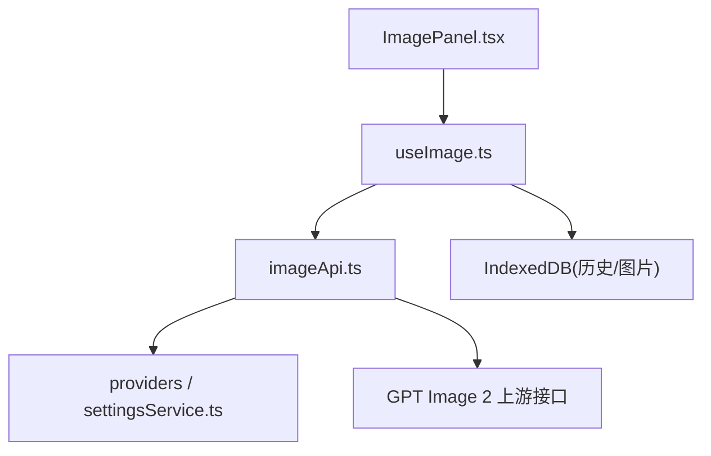
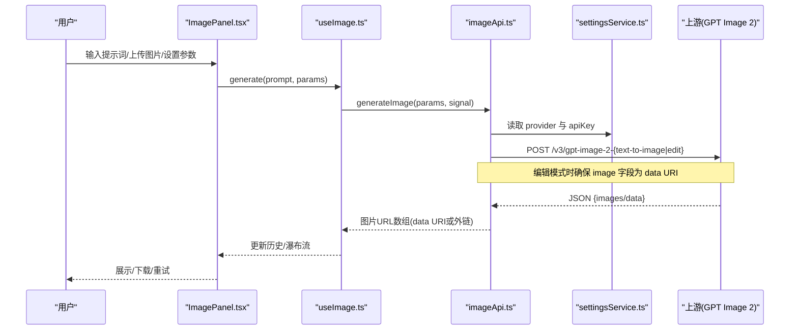
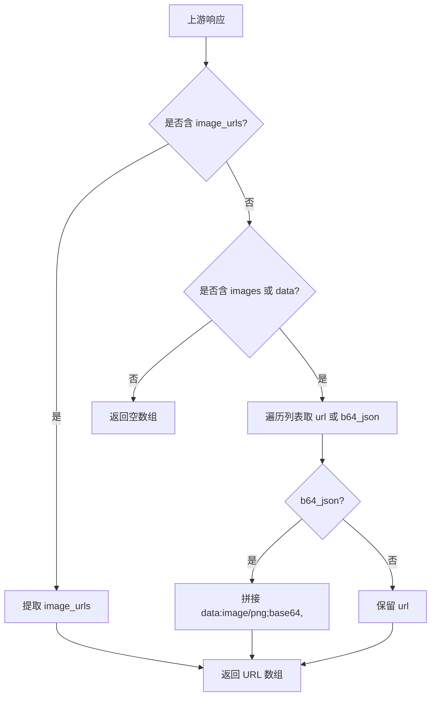
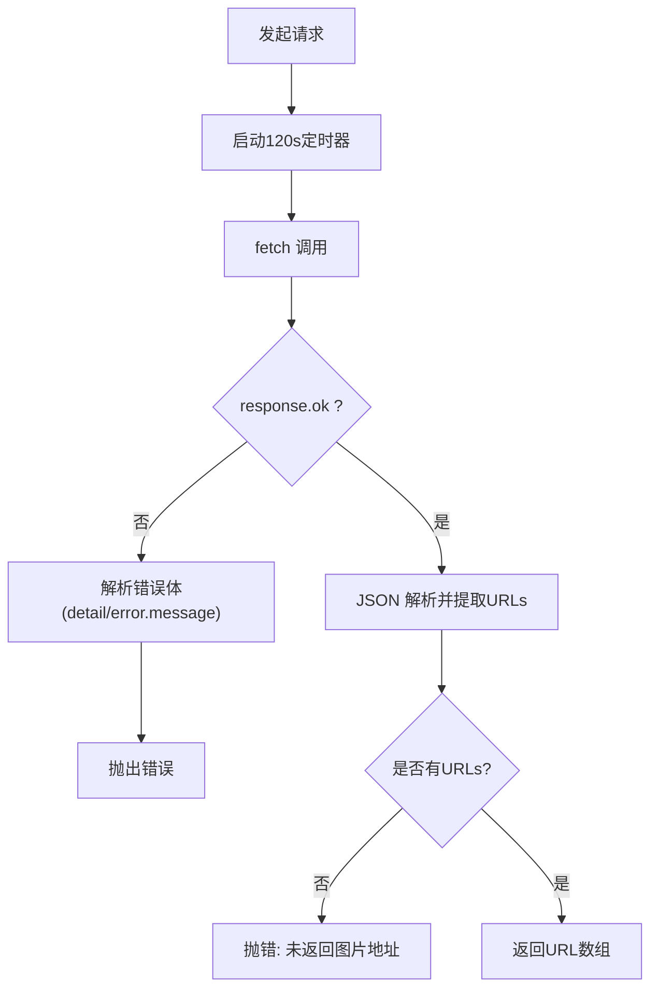
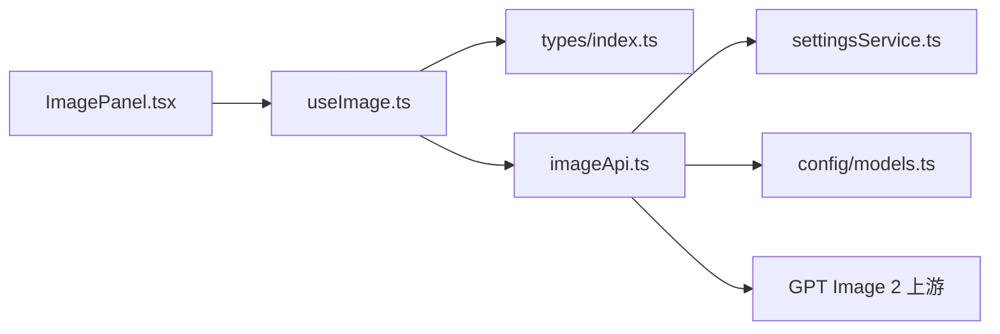

# GPT Image 2 集成

<cite>
**本文引用的文件**
- [reference-gpt-image-2-text-to-image.md](file://ImageGenAPI/reference-gpt-image-2-text-to-image.md)
- [reference-gpt-image-2-edit.md](file://ImageGenAPI/reference-gpt-image-2-edit.md)
- [imageApi.ts](file://src/services/imageApi.ts)
- [useImage.ts](file://src/hooks/useImage.ts)
- [ImagePanel.tsx](file://src/components/image/ImagePanel.tsx)
- [models.ts](file://src/config/models.ts)
- [index.ts](file://src/types/index.ts)
- [settingsService.ts](file://src/services/settingsService.ts)
</cite>

## 目录
1. [简介](#简介)
2. [项目结构](#项目结构)
3. [核心组件](#核心组件)
4. [架构总览](#架构总览)
5. [详细组件分析](#详细组件分析)
6. [依赖关系分析](#依赖关系分析)
7. [性能与超时控制](#性能与超时控制)
8. [故障排查指南](#故障排查指南)
9. [结论](#结论)
10. [附录：参数与场景对照](#附录参数与场景对照)

## 简介
本文件面向在项目中集成 GPT Image 2 模型的开发者，系统性说明两种模式（文本到图像、图像编辑）的 API 调用方式、请求参数构建、响应格式处理、错误处理机制，重点解释 base64 图片格式的 data URI 前缀处理逻辑以及 OpenAI 兼容协议的实现细节。文档同时覆盖尺寸、质量、输出格式等参数的配置选项与使用场景，并提供完整的调用流程示例与最佳实践建议。

## 项目结构
围绕 GPT Image 2 的图片生成能力，本项目采用“前端 UI + Hook 状态管理 + 服务层封装”的分层组织：
- 参考文档：ImageGenAPI 下提供 GPT Image 2 文生图与图像编辑的接口规范。
- 服务层：src/services/imageApi.ts 负责根据模型选择上游端点、构造请求体、统一解析响应、错误处理与超时控制。
- 业务 Hook：src/hooks/useImage.ts 负责用户交互参数聚合、并发任务队列、历史持久化与尺寸探测。
- 界面层：src/components/image/ImagePanel.tsx 提供拖拽上传、参数面板、瀑布流展示与下载等能力。
- 配置与类型：src/config/models.ts 定义可用模型；src/types/index.ts 定义请求/响应数据结构；src/services/settingsService.ts 管理提供商与密钥。

图表来源
- [imageApi.ts:6-19](file://src/services/imageApi.ts#L6-L19)
- [useImage.ts:274-387](file://src/hooks/useImage.ts#L274-L387)
- [ImagePanel.tsx:369-469](file://src/components/image/ImagePanel.tsx#L369-L469)
- [settingsService.ts:59-84](file://src/services/settingsService.ts#L59-L84)

章节来源
- [imageApi.ts:6-19](file://src/services/imageApi.ts#L6-L19)
- [useImage.ts:274-387](file://src/hooks/useImage.ts#L274-L387)
- [ImagePanel.tsx:369-469](file://src/components/image/ImagePanel.tsx#L369-L469)
- [settingsService.ts:59-84](file://src/services/settingsService.ts#L59-L84)

## 核心组件
- 服务层 imageApi.ts
  - 端点映射：gpt-image-2 对应 text-to-image 与 edit 两个路径。
  - 请求体构建：针对 gpt-image-2 区分编辑/文生图，自动补齐 base64 的 data URI 前缀。
  - 响应解析：兼容多种上游返回结构，提取图片 URL 或 base64（并转为 data URI）。
  - 错误处理：网络异常、超时、非 2xx 响应均抛出结构化错误。
  - 超时控制：默认 120s AbortController，支持外部取消信号合并。
- Hook useImage.ts
  - 参数派生：按模型选择 size、quality、aspectRatio 等默认值与可选集。
  - 并发队列：pendingTasks 管理 loading/error 状态，支持重试与取消。
  - 历史与尺寸：成功后写入 IndexedDB，尝试获取首图尺寸用于瀑布流占位。
- 界面 ImagePanel.tsx
  - 拖拽上传与本地图片转 File，限制最大数量与大小。
  - 参数面板：size、quality、比例等下拉/网格选择器。
  - 结果展示：瀑布流卡片、下载、删除、错误重试。

章节来源
- [imageApi.ts:21-63](file://src/services/imageApi.ts#L21-L63)
- [imageApi.ts:66-143](file://src/services/imageApi.ts#L66-L143)
- [imageApi.ts:149-243](file://src/services/imageApi.ts#L149-L243)
- [useImage.ts:25-45](file://src/hooks/useImage.ts#L25-L45)
- [useImage.ts:274-387](file://src/hooks/useImage.ts#L274-L387)
- [ImagePanel.tsx:408-571](file://src/components/image/ImagePanel.tsx#L408-L571)

## 架构总览
下图展示了从用户输入到上游 API 再到结果展示的完整链路，包括关键分支（编辑/文生图、base64 前缀处理、超时与错误）。

图表来源
- [imageApi.ts:6-19](file://src/services/imageApi.ts#L6-L19)
- [imageApi.ts:66-143](file://src/services/imageApi.ts#L66-L143)
- [imageApi.ts:149-243](file://src/services/imageApi.ts#L149-L243)
- [useImage.ts:274-387](file://src/hooks/useImage.ts#L274-L387)
- [settingsService.ts:59-84](file://src/services/settingsService.ts#L59-L84)

## 详细组件分析

### 文本到图像（Text-to-Image）
- 上游接口
  - 端点：/v3/gpt-image-2-text-to-image
  - 必需头：Content-Type: application/json，Authorization: Bearer {API Key}
  - 请求体关键字段：prompt、n、size、quality、background、moderation、output_format、output_compression
  - 响应：images 数组（可能包含 url 或 b64_json）
- 前端行为
  - 当未上传图片时进入文生图分支，构建请求体不包含 image 字段。
  - 默认 size=1024x1024，quality=medium，output_format=png。
  - 响应中若返回 b64_json，会被转换为 data:image/png;base64,... 供浏览器直接渲染。

章节来源
- [reference-gpt-image-2-text-to-image.md:9-73](file://ImageGenAPI/reference-gpt-image-2-text-to-image.md#L9-L73)
- [imageApi.ts:77-109](file://src/services/imageApi.ts#L77-L109)
- [imageApi.ts:21-63](file://src/services/imageApi.ts#L21-L63)

### 图像编辑（Image Edit）
- 上游接口
  - 端点：/v3/gpt-image-2-edit
  - 必需头：Content-Type: application/json，Authorization: Bearer {API Key}
  - 请求体关键字段：image（单张参考图）、prompt、mask（可选）、size、quality、background、output_format
  - 响应：images 数组（可能包含 url 或 b64_json）
- OpenAI 兼容协议与 base64 前缀
  - 编辑模式要求 image 字段为字符串，支持 URL 或 base64。
  - 若传入裸 base64，必须补全 data URI 前缀（如 data:image/jpeg;base64,...），否则上游无法识别 MIME 类型，请求会挂起直至超时。
  - 代码中已实现自动补齐：检测是否以 http(s):// 或 data: 开头，否则拼接 data:image/jpeg;base64, 前缀。
- 前端行为
  - 当存在上传图片时进入编辑分支，仅取第一张作为参考图（maxUploadCount=1）。
  - 压缩后的 base64 由 Hook 产出（不含前缀），在服务层补齐前缀后发送。

章节来源
- [reference-gpt-image-2-edit.md:9-69](file://ImageGenAPI/reference-gpt-image-2-edit.md#L9-L69)
- [imageApi.ts:77-109](file://src/services/imageApi.ts#L77-L109)
- [useImage.ts:217-238](file://src/hooks/useImage.ts#L217-L238)

### 响应格式处理与数据流
- 统一抽取函数 extractUrls
  - 优先匹配 Gemini 自定义结构的 image_urls。
  - 其次匹配 GPT Image 2/OpenAI 兼容结构的 images 或 data 列表。
  - 对 b64_json 自动添加 data:image/png;base64, 前缀，便于前端直接使用。
- 数据流向
  - 上游返回 → extractUrls → Promise<string[]> → Hook 写入历史并尝试获取首图尺寸 → UI 瀑布流渲染。

图表来源
- [imageApi.ts:21-63](file://src/services/imageApi.ts#L21-L63)

章节来源
- [imageApi.ts:21-63](file://src/services/imageApi.ts#L21-L63)

### 错误处理与超时控制
- 超时控制
  - 默认 120s 超时（AbortController），适合 GPT Image 2 生成耗时（通常 60-90s）。
  - 支持外部 signal 合并，允许用户手动取消任务。
- 错误分类
  - 网络/超时：AbortError 区分用户取消与服务超时。
  - HTTP 非 2xx：解析 detail 或 error.message，组合友好消息。
  - 无图片返回：抛错提示“未返回图片地址”。
- 前端处理
  - Hook 将失败任务标记为 error，支持重试与关闭。
  - 用户可点击取消按钮中断当前任务。

图表来源
- [imageApi.ts:149-243](file://src/services/imageApi.ts#L149-L243)

章节来源
- [imageApi.ts:149-243](file://src/services/imageApi.ts#L149-L243)
- [useImage.ts:336-356](file://src/hooks/useImage.ts#L336-L356)

### 参数配置与使用场景
- 尺寸 size
  - 文本到图像：支持 1024x1024、1024x1536、1536x1024、2048x2048 等具体像素尺寸，以及 auto。
  - 图像编辑：同样支持上述尺寸集合。
  - 默认：1024x1024。
- 质量 quality
  - low：速度最快、成本最低。
  - medium：平衡质量与速度（文本到图像默认）。
  - high：质量最佳但最慢、成本最高。
- 输出格式 output_format
  - png 或 jpeg。
  - 文本到图像支持 output_compression（仅 jpeg 有效，范围 0-100）。
- 背景 background
  - opaque 或 auto（默认 auto）。
- 内容审核 moderation
  - low 或 auto（默认 auto）。
- 数量 n
  - 1-10，实际返回可能少于请求数量。

章节来源
- [reference-gpt-image-2-text-to-image.md:21-67](file://ImageGenAPI/reference-gpt-image-2-text-to-image.md#L21-L67)
- [reference-gpt-image-2-edit.md:21-63](file://ImageGenAPI/reference-gpt-image-2-edit.md#L21-L63)
- [useImage.ts:25-45](file://src/hooks/useImage.ts#L25-L45)

### 调用流程示例（端到端）
- 文本到图像
  - 用户在 ImagePanel 输入 prompt，选择 size/quality/output_format，点击发送。
  - useImage 组装参数（无 images），调用 imageApi.generateImage。
  - imageApi 构建请求体（不含 image），POST 到 /v3/gpt-image-2-text-to-image。
  - 响应解析出 URLs（可能为外链或 data URI），Hook 写入历史并渲染。
- 图像编辑
  - 用户上传一张图片（被压缩为裸 base64），选择 prompt 与参数。
  - useImage 组装参数（images=[base64]），调用 imageApi.generateImage。
  - imageApi 将裸 base64 补齐为 data:image/jpeg;base64,...，POST 到 /v3/gpt-image-2-edit。
  - 响应解析出 URLs，Hook 写入历史并渲染。

章节来源
- [ImagePanel.tsx:603-615](file://src/components/image/ImagePanel.tsx#L603-L615)
- [useImage.ts:358-387](file://src/hooks/useImage.ts#L358-L387)
- [imageApi.ts:66-143](file://src/services/imageApi.ts#L66-L143)
- [imageApi.ts:149-243](file://src/services/imageApi.ts#L149-L243)

## 依赖关系分析
- 模块耦合
  - ImagePanel 依赖 useImage 暴露的状态与方法，不直接访问网络。
  - useImage 依赖 imageApi 进行网络请求，依赖 types 定义的数据结构。
  - imageApi 依赖 settingsService 获取 provider 与 apiKey，依赖 models 中的 IMAGE_ENDPOINTS 映射。
- 外部依赖
  - 上游 GPT Image 2 接口（OpenAI 兼容协议）。
  - 浏览器 fetch、Canvas、IndexedDB。

图表来源
- [imageApi.ts:6-19](file://src/services/imageApi.ts#L6-L19)
- [useImage.ts:274-387](file://src/hooks/useImage.ts#L274-L387)
- [ImagePanel.tsx:369-469](file://src/components/image/ImagePanel.tsx#L369-L469)
- [settingsService.ts:59-84](file://src/services/settingsService.ts#L59-L84)
- [models.ts:237-271](file://src/config/models.ts#L237-L271)

章节来源
- [imageApi.ts:6-19](file://src/services/imageApi.ts#L6-L19)
- [useImage.ts:274-387](file://src/hooks/useImage.ts#L274-L387)
- [ImagePanel.tsx:369-469](file://src/components/image/ImagePanel.tsx#L369-L469)
- [settingsService.ts:59-84](file://src/services/settingsService.ts#L59-L84)
- [models.ts:237-271](file://src/config/models.ts#L237-L271)

## 性能与超时控制
- 超时策略
  - 默认 120s 超时，避免长耗时请求阻塞页面。
  - 支持外部取消信号，用户可随时终止任务。
- 图片压缩
  - 上传时压缩至最大边 1024px、JPEG 质量 0.85，减少传输体积。
- 响应优化
  - 优先返回外链 URL；若返回 b64_json，前端直接以 data URI 渲染，避免额外解码。
- 建议
  - 在高并发场景下，结合队列与取消机制，避免重复请求。
  - 合理设置 quality 与 size，平衡质量与速度。

[本节为通用指导，无需特定文件引用]

## 故障排查指南
- 常见问题
  - 请求一直挂起：检查编辑模式下 image 字段是否为 data URI（需带前缀）。
  - 返回空图片：确认上游响应是否包含 images 或 data 列表。
  - 认证失败：检查 Authorization 头是否正确携带 Bearer Token。
  - 超时：适当延长超时或降低 quality/size。
- 定位方法
  - 查看 pendingTasks 的错误信息。
  - 检查 network 面板的请求体与响应体。
  - 确认 settingsService 中配置的 provider 与 apiKey。

章节来源
- [imageApi.ts:149-243](file://src/services/imageApi.ts#L149-L243)
- [useImage.ts:336-356](file://src/hooks/useImage.ts#L336-L356)

## 结论
本项目通过清晰的分层设计与统一的响应解析，实现了对 GPT Image 2 两种模式（文本到图像、图像编辑）的稳定集成。重点解决了 base64 的 data URI 前缀问题与多上游响应兼容，提供了完善的错误处理与超时控制。配合前端丰富的参数面板与瀑布流展示，形成完整的图片生成工作流。

[本节为总结性内容，无需特定文件引用]

## 附录：参数与场景对照
- 文本到图像
  - 典型场景：根据描述生成新图。
  - 推荐参数：size=1024x1024 或 1536x1024；quality=medium；output_format=png。
- 图像编辑
  - 典型场景：基于参考图进行局部修改或风格迁移。
  - 推荐参数：size=auto 或 1024x1024；quality=low/medium；output_format=jpeg（如需压缩）。
- 质量与成本
  - low：快速低成本；high：高质量高成本。
- 输出格式
  - png：无损；jpeg：可压缩（output_compression 0-100）。

章节来源
- [reference-gpt-image-2-text-to-image.md:21-67](file://ImageGenAPI/reference-gpt-image-2-text-to-image.md#L21-L67)
- [reference-gpt-image-2-edit.md:21-63](file://ImageGenAPI/reference-gpt-image-2-edit.md#L21-L63)
- [useImage.ts:25-45](file://src/hooks/useImage.ts#L25-L45)