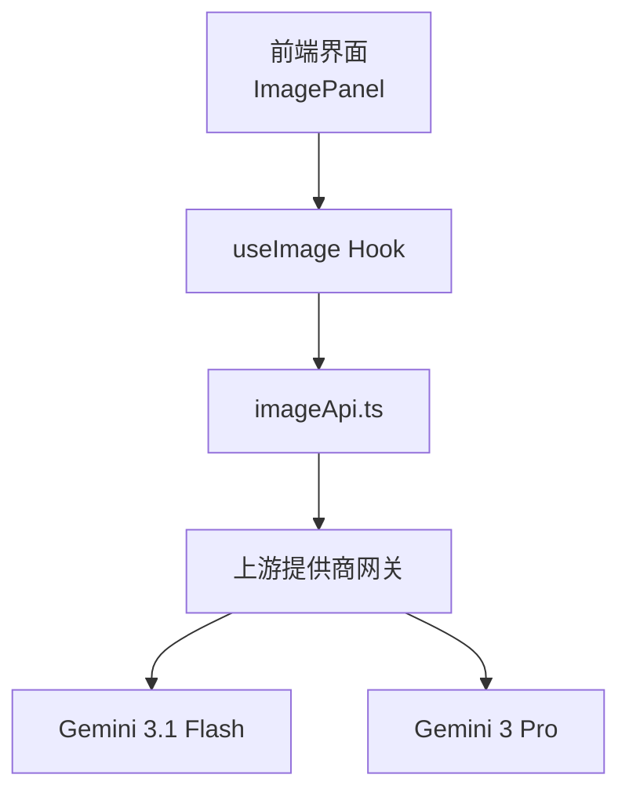
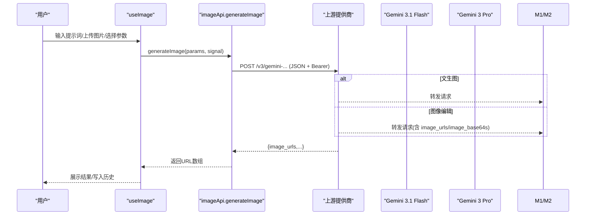
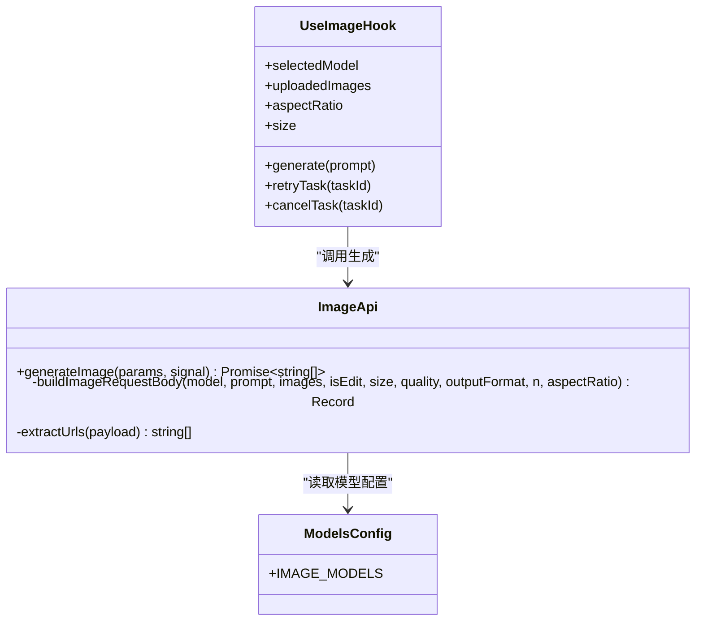

# Gemini 模型集成

<cite>
**本文引用的文件**
- [reference-gemini-3.1-flash-image-text-to-image.md](file://ImageGenAPI/reference-gemini-3.1-flash-image-text-to-image.md)
- [reference-gemini-3.1-flash-image-edit.md](file://ImageGenAPI/reference-gemini-3.1-flash-image-edit.md)
- [reference-gemini-3-pro-image-text-to-image.md](file://ImageGenAPI/reference-gemini-3-pro-image-text-to-image.md)
- [reference-gemini-3-pro-image-edit.md](file://ImageGenAPI/reference-gemini-3-pro-image-edit.md)
- [imageApi.ts](file://src/services/imageApi.ts)
- [useImage.ts](file://src/hooks/useImage.ts)
- [models.ts](file://src/config/models.ts)
- [index.ts](file://src/types/index.ts)
</cite>

## 目录
1. [简介](#简介)
2. [项目结构](#项目结构)
3. [核心组件](#核心组件)
4. [架构总览](#架构总览)
5. [详细组件分析](#详细组件分析)
6. [依赖关系分析](#依赖关系分析)
7. [性能与适用场景](#性能与适用场景)
8. [调用示例与最佳实践](#调用示例与最佳实践)
9. [故障排查](#故障排查)
10. [结论](#结论)

## 简介
本文件面向在项目中集成 Gemini 系列图像模型（Gemini 3.1 Flash 与 Gemini 3 Pro）的开发者，系统说明两个模型在“文本到图像”和“图像编辑”两类能力上的 API 差异、请求参数结构、响应格式处理、图片格式支持；解释 image_urls 与 image_base64s 的区别与使用场景；给出 aspectRatio 的配置方法；并提供批量处理、参数优化与错误处理的实现方案。

## 项目结构
本项目将 Gemini 图像模型的接入点集中在服务层与前端 Hook：
- 服务层 imageApi.ts：负责根据所选模型构建上游请求体、发起 HTTP 请求、统一解析响应并返回图片 URL 数组。
- 前端 Hook useImage.ts：封装用户交互、参数选择（尺寸、宽高比）、并发队列、历史持久化等。
- 配置 models.ts：声明可用的图像模型及元信息。
- 类型 index.ts：定义 ImageGenerationParams 等关键类型。
- 参考文档：ImageGenAPI 下的四个 Markdown 文件，分别描述 Gemini 3.1 Flash 与 Gemini 3 Pro 的文本生成与编辑接口规范。

图表来源
- [imageApi.ts:6-19](file://src/services/imageApi.ts#L6-L19)
- [useImage.ts:25-45](file://src/hooks/useImage.ts#L25-L45)
- [models.ts:237-271](file://src/config/models.ts#L237-L271)

章节来源
- [imageApi.ts:6-19](file://src/services/imageApi.ts#L6-L19)
- [useImage.ts:25-45](file://src/hooks/useImage.ts#L25-L45)
- [models.ts:237-271](file://src/config/models.ts#L237-L271)

## 核心组件
- 模型路由与端点映射：通过 IMAGE_ENDPOINTS 将模型 ID 映射到文本生成与编辑的上游路径。
- 请求体构建：buildImageRequestBody 根据模型与模式（文生图/编辑）组装参数，区分 Gemini 与 GPT 的差异。
- 响应解析：extractUrls 兼容多种上游返回结构，统一抽取图片 URL 列表。
- 前端参数控制：useImage 提供尺寸、宽高比、质量等选项，并根据模型动态限制上传数量与可选值。

章节来源
- [imageApi.ts:21-63](file://src/services/imageApi.ts#L21-L63)
- [imageApi.ts:66-143](file://src/services/imageApi.ts#L66-L143)
- [useImage.ts:25-45](file://src/hooks/useImage.ts#L25-L45)

## 架构总览
下图展示了从前端到上游模型的端到端流程，包括参数构建、请求发送、超时与取消、响应统一解析。

图表来源
- [imageApi.ts:149-243](file://src/services/imageApi.ts#L149-L243)
- [imageApi.ts:6-19](file://src/services/imageApi.ts#L6-L19)

## 详细组件分析

### 文本到图像（Text-to-Image）
- 共同点
  - 请求头：Content-Type: application/json；Authorization: Bearer {API密钥}
  - 必填字段：prompt
  - 可选字段：size、google.web_search、aspect_ratio、output_format
  - 响应：image_urls（数组），可选 grounding_metadata

- 差异对比
  - Gemini 3.1 Flash
    - size 可选：0.5K、1K、2K、4K（0.5K 仅适用于该模型）
    - aspect_ratio 支持更丰富的比例，包含超宽/超长：1:1、1:4、1:8、2:3、3:2、3:4、4:1、4:3、4:5、5:4、8:1、9:16、16:9、21:9
    - output_format 支持：image/png、image/jpeg
  - Gemini 3 Pro
    - size 可选：1K、2K、4K（不支持 0.5K）
    - aspect_ratio 支持：1:1、3:2、2:3、3:4、4:3、4:5、5:4、9:16、16:9、21:9
    - output_format 支持：image/png、image/jpeg、image/webp

章节来源
- [reference-gemini-3.1-flash-image-text-to-image.md:9-55](file://ImageGenAPI/reference-gemini-3.1-flash-image-text-to-image.md#L9-L55)
- [reference-gemini-3-pro-image-text-to-image.md:9-51](file://ImageGenAPI/reference-gemini-3-pro-image-text-to-image.md#L9-L51)

### 图像编辑（Image Editing）
- 共同点
  - 请求头：同上
  - 必填字段：prompt
  - 可选字段：size、google.web_search、image_urls、image_base64s、aspect_ratio、output_format
  - 响应：image_urls（数组），可选 grounding_metadata

- 差异对比
  - Gemini 3.1 Flash
    - 最多可传入 14 张参考图（image_urls 与 image_base64s 合计不超过 14）
    - aspect_ratio 支持更丰富比例（同文生图）
    - output_format 支持：image/png、image/jpeg
  - Gemini 3 Pro
    - 未明确上限（按协议字段存在）
    - aspect_ratio 支持：1:1、3:2、2:3、3:4、4:3、4:5、5:4、9:16、16:9、21:9
    - 未显式列出 output_format 枚举（通常遵循通用 PNG/JPEG/WebP 能力）

章节来源
- [reference-gemini-3.1-flash-image-edit.md:9-67](file://ImageGenAPI/reference-gemini-3.1-flash-image-edit.md#L9-L67)
- [reference-gemini-3-pro-image-edit.md:9-59](file://ImageGenAPI/reference-gemini-3-pro-image-edit.md#L9-L59)

### image_urls 与 image_base64s 的区别与使用场景
- image_urls：用于传入远程图片地址，适合已有在线资源或已上传至对象存储的图片。
- image_base64s：用于传入裸 Base64 字符串（不含 data URI 前缀），适合本地文件或需要内联传输的场景。
- 前端分流逻辑：以 http(s):// 开头的视为 URL，其余（裸 base64 或 data URI）会被提取为裸 base64 放入 image_base64s。两者总数受模型限制（Flash 最多 14）。

章节来源
- [imageApi.ts:111-134](file://src/services/imageApi.ts#L111-L134)
- [reference-gemini-3.1-flash-image-edit.md:45-61](file://ImageGenAPI/reference-gemini-3.1-flash-image-edit.md#L45-L61)

### aspectRatio 参数的配置方法
- 前端选项由 useImage 根据模型动态生成：
  - Google 模型（Flash/Pro）：非编辑模式下提供标准比例集合；编辑模式下额外提供 auto。
  - 默认值：Flash/Pro 默认为 1:1；GPT 模型使用 auto（占位）。
- 实际发送到上游时：
  - 文生图：始终携带 aspect_ratio（默认 1:1）。
  - 图像编辑：若为 auto 或不传则不携带该字段；否则携带所选比例。

章节来源
- [useImage.ts:25-45](file://src/hooks/useImage.ts#L25-L45)
- [useImage.ts:252-272](file://src/hooks/useImage.ts#L252-L272)
- [imageApi.ts:127-141](file://src/services/imageApi.ts#L127-L141)

### 请求体构建与响应解析
- 请求体构建
  - 模型识别：gemini-3.1-flash 与 gemini-3-pro 走同一分支，依据 isEdit 决定是否附带 image_urls/image_base64s。
  - 尺寸与输出格式：默认 1K 与 image/png，可按需覆盖。
- 响应解析
  - 优先读取 image_urls 数组；若不存在，兼容 images/data 列表中的 url 或 b64_json（转为 data URI）。
  - 若未解析到任何 URL，抛出“未返回图片地址”。

章节来源
- [imageApi.ts:66-143](file://src/services/imageApi.ts#L66-L143)
- [imageApi.ts:21-63](file://src/services/imageApi.ts#L21-L63)
- [imageApi.ts:237-242](file://src/services/imageApi.ts#L237-L242)

### 类图（代码级）

图表来源
- [imageApi.ts:149-243](file://src/services/imageApi.ts#L149-L243)
- [useImage.ts:123-468](file://src/hooks/useImage.ts#L123-L468)
- [models.ts:237-271](file://src/config/models.ts#L237-L271)

## 依赖关系分析
- 模块耦合
  - useImage 依赖 imageApi 完成网络请求；imageApi 依赖 providers 配置获取 base_url 与鉴权。
  - 类型集中管理于 types/index.ts，确保前后端参数一致。
- 外部依赖
  - 上游提供商网关（jiekou/Gemini 通道）：承载具体模型推理。
- 潜在风险
  - 不同模型对 size、aspect_ratio、output_format 的支持差异需在 UI 层做限制，避免无效参数导致失败。
  - 超时与取消：imageApi 内置 120s 超时，并与外部 AbortSignal 合并，便于 UI 取消任务。

章节来源
- [imageApi.ts:149-243](file://src/services/imageApi.ts#L149-L243)
- [useImage.ts:274-356](file://src/hooks/useImage.ts#L274-L356)
- [index.ts:177-214](file://src/types/index.ts#L177-L214)

## 性能与适用场景
- 模型选择建议
  - Gemini 3.1 Flash
    - 优势：速度快、成本低，支持 0.5K 小尺寸，适合快速迭代、移动端预览、批量生成。
    - 适用：电商商品图、社交媒体配图、大量 A/B 测试。
  - Gemini 3 Pro
    - 优势：质量更高、复杂指令理解更强，适合高质量出图与复杂编辑任务。
    - 适用：品牌主视觉、广告素材、精细修图与多轮编辑。
- 尺寸与格式
  - Flash 支持 0.5K/1K/2K/4K；Pro 支持 1K/2K/4K。
  - 输出格式：Flash 支持 PNG/JPEG；Pro 额外支持 WebP（视上游实现）。
- 并发与队列
  - useImage 维护 pendingTasks 队列，支持重试、取消、错误卡片展示，提升用户体验。
- 参考图数量
  - Flash 编辑模式最多 14 张参考图；合理控制输入图数量有助于降低延迟与成本。

章节来源
- [useImage.ts:25-45](file://src/hooks/useImage.ts#L25-L45)
- [reference-gemini-3.1-flash-image-edit.md:45-61](file://ImageGenAPI/reference-gemini-3.1-flash-image-edit.md#L45-L61)
- [reference-gemini-3-pro-image-text-to-image.md:21-25](file://ImageGenAPI/reference-gemini-3-pro-image-text-to-image.md#L21-L25)

## 调用示例与最佳实践

### 文本到图像（文生图）
- 必要参数
  - prompt：描述要生成的图片内容
  - model：gemini-3.1-flash 或 gemini-3-pro
  - size：Flash 可用 0.5K/1K/2K/4K；Pro 可用 1K/2K/4K
  - aspect_ratio：按模型支持的比例设置，默认 1:1
  - output_format：Flash 支持 image/png、image/jpeg；Pro 支持 image/png、image/jpeg、image/webp
- 可选增强
  - google.web_search：启用后基于真实世界信息生成更准确的图片
- 响应处理
  - 读取 image_urls 数组进行展示；忽略 grounding_metadata（调试用途）

章节来源
- [reference-gemini-3.1-flash-image-text-to-image.md:19-55](file://ImageGenAPI/reference-gemini-3.1-flash-image-text-to-image.md#L19-L55)
- [reference-gemini-3-pro-image-text-to-image.md:19-51](file://ImageGenAPI/reference-gemini-3-pro-image-text-to-image.md#L19-L51)
- [imageApi.ts:149-243](file://src/services/imageApi.ts#L149-L243)

### 图像编辑（多图编辑）
- 必要参数
  - prompt：描述期望的编辑效果
  - model：gemini-3.1-flash 或 gemini-3-pro
- 输入图片
  - image_urls：远程图片地址列表
  - image_base64s：裸 Base64 字符串列表（不含 data URI 前缀）
  - 注意：两者合计数量受模型限制（Flash 最多 14）
- 可选参数
  - size、aspect_ratio、output_format、google.web_search
- 响应处理
  - 读取 image_urls 数组；如需本地预览，可将 base64 转为 data URI 显示

章节来源
- [reference-gemini-3.1-flash-image-edit.md:19-67](file://ImageGenAPI/reference-gemini-3.1-flash-image-edit.md#L19-L67)
- [reference-gemini-3-pro-image-edit.md:19-59](file://ImageGenAPI/reference-gemini-3-pro-image-edit.md#L19-L59)
- [imageApi.ts:111-134](file://src/services/imageApi.ts#L111-L134)

### 批量图片处理
- 策略
  - 使用 useImage 的 pendingTasks 队列并发提交多个任务，每个任务独立 AbortController。
  - 对返回结果去重并限制数量（params.n），避免重复渲染。
- 优化
  - 对本地图片先压缩（最大边长 1024px，JPEG 质量 0.85），减少传输体积。
  - 合理设置 size 与 aspect_ratio，避免不必要的超大图生成。

章节来源
- [useImage.ts:274-356](file://src/hooks/useImage.ts#L274-L356)
- [useImage.ts:84-120](file://src/hooks/useImage.ts#L84-L120)
- [imageApi.ts:237-242](file://src/services/imageApi.ts#L237-L242)

### 参数优化建议
- 尺寸
  - 预览/移动端优先使用 0.5K/1K；最终交付再切换至 2K/4K。
- 宽高比
  - 根据业务模板固定比例（如 1:1、16:9、9:16），减少试错成本。
- 输出格式
  - 网页展示优先 JPEG/WebP（体积小）；需要透明背景选 PNG。
- 搜索增强
  - 对事实性强的主题开启 google.web_search，提高准确性。

章节来源
- [useImage.ts:25-45](file://src/hooks/useImage.ts#L25-L45)
- [reference-gemini-3.1-flash-image-text-to-image.md:27-38](file://ImageGenAPI/reference-gemini-3.1-flash-image-text-to-image.md#L27-L38)
- [reference-gemini-3-pro-image-text-to-image.md:27-35](file://ImageGenAPI/reference-gemini-3-pro-image-text-to-image.md#L27-L35)

### 错误处理与超时
- 超时控制
  - 默认 120s 超时；若外部信号触发取消，会区分“手动取消”与“超时”。
- 错误消息
  - 优先取上游 detail/error.message；若无 JSON，回退为状态码提示。
- 前端反馈
  - 失败任务进入 pendingTasks 的错误状态，支持重试与关闭错误卡片。

章节来源
- [imageApi.ts:183-235](file://src/services/imageApi.ts#L183-L235)
- [useImage.ts:336-356](file://src/hooks/useImage.ts#L336-L356)

## 故障排查
- 常见问题
  - 未返回图片地址：检查响应中是否存在 image_urls；确认上游返回结构。
  - 请求一直挂起：检查是否为 GPT 兼容路径（本项目 Gemini 路径无需 data URI 前缀）；确认网络与鉴权。
  - 参数不生效：确认所选模型支持的 size/aspect_ratio/output_format 是否在允许范围内。
- 定位步骤
  - 查看 pendingTasks 的错误信息；核对 buildImageRequestBody 构造的参数。
  - 检查 extractUrls 是否能正确解析响应；必要时打印原始响应。

章节来源
- [imageApi.ts:218-242](file://src/services/imageApi.ts#L218-L242)
- [useImage.ts:336-356](file://src/hooks/useImage.ts#L336-L356)

## 结论
本项目通过统一的 service 层与前端 Hook，将 Gemini 3.1 Flash 与 Gemini 3 Pro 的文本到图像与图像编辑能力无缝集成。二者在尺寸、宽高比、输出格式上存在差异，但共享一致的请求头与响应结构。开发时应根据业务需求选择合适的模型与参数，并结合批量处理、参数优化与错误处理策略，获得稳定高效的图像生成体验。