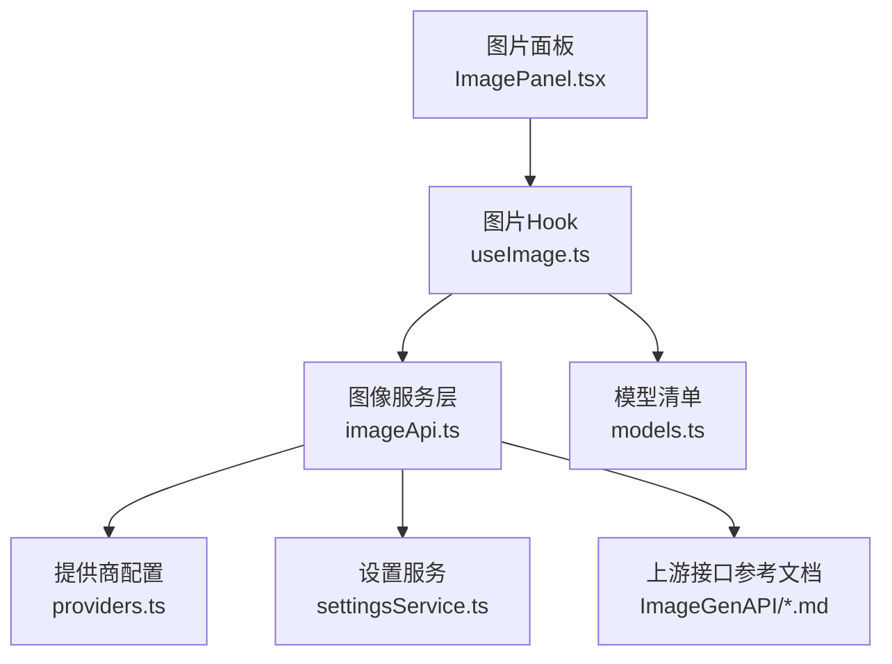
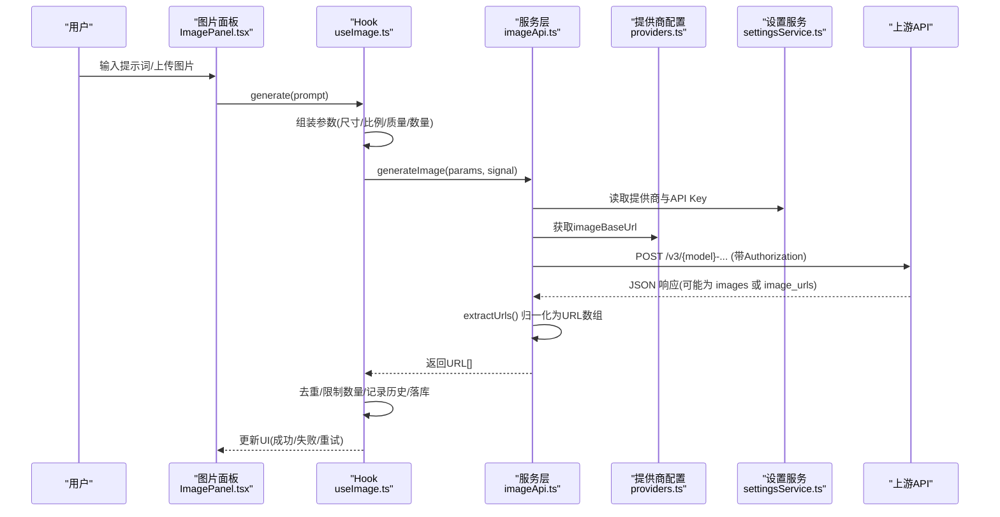
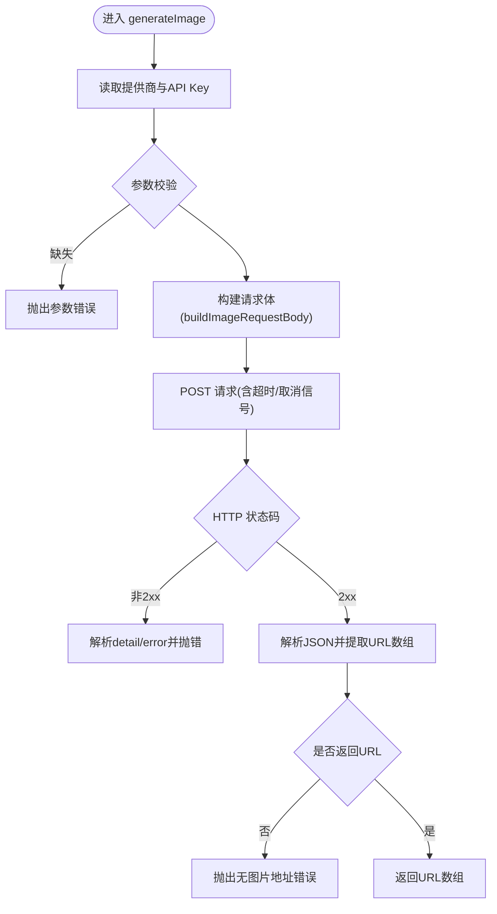
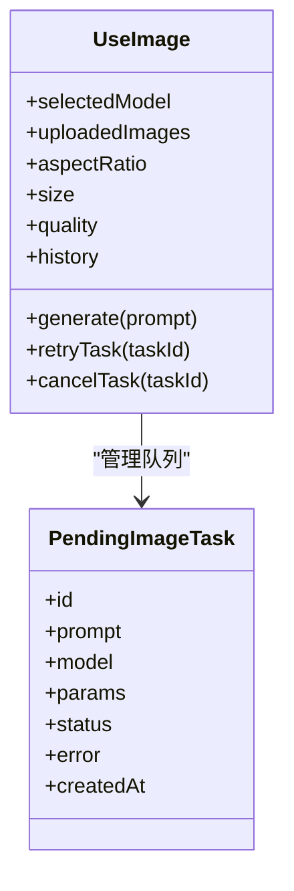
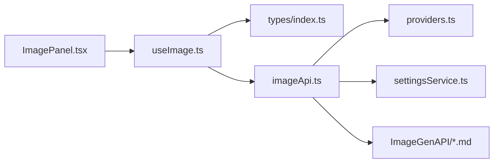

# 图像API集成

<cite>
**本文引用的文件**
- [imageApi.ts](file://src/services/imageApi.ts)
- [models.ts](file://src/config/models.ts)
- [providers.ts](file://src/config/providers.ts)
- [settingsService.ts](file://src/services/settingsService.ts)
- [useImage.ts](file://src/hooks/useImage.ts)
- [index.ts（类型定义）](file://src/types/index.ts)
- [reference-gpt-image-2-text-to-image.md](file://ImageGenAPI/reference-gpt-image-2-text-to-image.md)
- [reference-gpt-image-2-edit.md](file://ImageGenAPI/reference-gpt-image-2-edit.md)
- [reference-gemini-3.1-flash-image-text-to-image.md](file://ImageGenAPI/reference-gemini-3.1-flash-image-text-to-image.md)
- [reference-gemini-3.1-flash-image-edit.md](file://ImageGenAPI/reference-gemini-3.1-flash-image-edit.md)
- [reference-gemini-3-pro-image-text-to-image.md](file://ImageGenAPI/reference-gemini-3-pro-image-text-to-image.md)
- [reference-gemini-3-pro-image-edit.md](file://ImageGenAPI/reference-gemini-3-pro-image-edit.md)
</cite>

## 目录
1. [简介](#简介)
2. [项目结构](#项目结构)
3. [核心组件](#核心组件)
4. [架构总览](#架构总览)
5. [详细组件分析](#详细组件分析)
6. [依赖关系分析](#依赖关系分析)
7. [性能与参数对比](#性能与参数对比)
8. [故障排查与调试](#故障排查与调试)
9. [结论](#结论)
10. [附录：模型与接口速查](#附录模型与接口速查)

## 简介
本文件面向 AIShop 的“图像生成”能力，系统化说明 imageApi 服务层如何统一对接多个上游 AI 图像模型（GPT Image 2、Gemini 3.1 Flash、Gemini 3 Pro），覆盖文本到图像与图像编辑两种模式。文档涵盖请求构建、响应解析、错误处理、超时控制、多模型切换与动态参数适配，并提供各模型的参数差异、性能特征与使用建议，以及监控、日志与调试方法。

## 项目结构
AIShop 的图像功能由前端 Hook、服务层、配置与参考文档共同组成：
- 前端 Hook 负责用户交互、参数选择、并发任务队列、历史管理与重试/取消等流程编排。
- 服务层 imageApi 负责根据所选模型与模式构造上游请求、发起 HTTP 调用、统一解析响应并抛出错误。
- 配置模块提供模型清单与提供商端点基地址。
- 设置服务管理当前使用的提供商与 API Key。
- 参考文档定义了各模型的具体请求/响应字段与取值范围。

图表来源
- [useImage.ts:123-385](file://src/hooks/useImage.ts#L123-L385)
- [imageApi.ts:149-242](file://src/services/imageApi.ts#L149-L242)
- [providers.ts:1-18](file://src/config/providers.ts#L1-L18)
- [settingsService.ts:59-100](file://src/services/settingsService.ts#L59-L100)
- [models.ts:237-271](file://src/config/models.ts#L237-L271)

章节来源
- [useImage.ts:123-385](file://src/hooks/useImage.ts#L123-L385)
- [imageApi.ts:149-242](file://src/services/imageApi.ts#L149-L242)
- [providers.ts:1-18](file://src/config/providers.ts#L1-L18)
- [settingsService.ts:59-100](file://src/services/settingsService.ts#L59-L100)
- [models.ts:237-271](file://src/config/models.ts#L237-L271)

## 核心组件
- 图像服务层（imageApi.ts）
  - 统一入口 generateImage(params, signal?) 负责鉴权、路由、请求体构建、网络请求、超时控制、错误处理与响应归一化。
  - 通过 IMAGE_ENDPOINTS 将模型映射到具体上游路径；buildImageRequestBody 按模型与模式（文生图/编辑）拼装不同字段；extractUrls 兼容多种上游返回结构。
- 前端 Hook（useImage.ts）
  - 维护模型、尺寸、比例、质量等参数，按模型类型动态适配；组织上传参考图、压缩、并发任务队列、重试/取消、历史落库与瀑布流占位尺寸计算。
- 配置与设置
  - providers.ts 提供提供商端点基地址；settingsService.ts 持久化当前提供商与 API Key；models.ts 暴露支持的图像模型列表。

章节来源
- [imageApi.ts:5-143](file://src/services/imageApi.ts#L5-L143)
- [imageApi.ts:149-242](file://src/services/imageApi.ts#L149-L242)
- [useImage.ts:17-45](file://src/hooks/useImage.ts#L17-L45)
- [useImage.ts:274-385](file://src/hooks/useImage.ts#L274-L385)
- [providers.ts:1-18](file://src/config/providers.ts#L1-L18)
- [settingsService.ts:59-100](file://src/services/settingsService.ts#L59-L100)
- [models.ts:237-271](file://src/config/models.ts#L237-L271)

## 架构总览
下图展示从用户触发到上游响应的完整调用链路与关键分支。

图表来源
- [useImage.ts:274-385](file://src/hooks/useImage.ts#L274-L385)
- [imageApi.ts:149-242](file://src/services/imageApi.ts#L149-L242)
- [providers.ts:1-18](file://src/config/providers.ts#L1-L18)
- [settingsService.ts:59-100](file://src/services/settingsService.ts#L59-L100)

## 详细组件分析

### 服务层：imageApi.ts
- 多模型路由
  - 通过 IMAGE_ENDPOINTS 将 gpt-image-2、gemini-3.1-flash、gemini-3-pro 分别映射到“文生图”和“编辑”两个上游路径。
- 请求体构建（buildImageRequestBody）
  - GPT Image 2：
    - 文生图：prompt、n、size、quality、output_format。
    - 编辑：image（单张，支持 URL 或 data URI base64）、prompt、n、size、quality、output_format。
  - Gemini 系列：
    - 文生图：prompt、size、aspect_ratio、output_format。
    - 编辑：prompt、size、aspect_ratio、output_format，以及 image_urls 与 image_base64s（自动分流 URL 与裸 base64）。
- 响应解析（extractUrls）
  - 兼容 Gemini 的 image_urls 与 GPT 的 images/data 结构，同时支持 b64_json 转为 data URI。
- 网络请求与错误处理
  - 使用 Bearer Token 鉴权；120s 超时；合并外部 AbortSignal；非 2xx 时尝试解析 detail/error 并抛出友好错误；未返回图片地址时抛错。

图表来源
- [imageApi.ts:149-242](file://src/services/imageApi.ts#L149-L242)

章节来源
- [imageApi.ts:5-143](file://src/services/imageApi.ts#L5-L143)
- [imageApi.ts:149-242](file://src/services/imageApi.ts#L149-L242)

### 前端 Hook：useImage.ts
- 模型与参数适配
  - 根据模型类型决定默认 size、aspectRatio、quality 选项；编辑模式下 Google 模型 aspectRatio 固定为 auto。
  - 限制上传数量：GPT 仅 1 张，Google 最多 14 张。
- 并发任务队列
  - 每个任务独立 AbortController；支持重试、取消、错误卡片展示；成功后去重并限制返回数量。
- 历史与存储
  - 成功后写入 IndexedDB，并将内存中的 base64 替换为 blob 引用以节省内存；异步回填宽高用于瀑布流布局。
- 图片压缩
  - 前端压缩至最大边长 1024px、JPEG 质量 0.85，输出裸 base64（不含 data URI 前缀），便于上游要求裸 base64 的场景。

图表来源
- [useImage.ts:17-45](file://src/hooks/useImage.ts#L17-L45)
- [useImage.ts:274-385](file://src/hooks/useImage.ts#L274-L385)
- [index.ts:205-214](file://src/types/index.ts#L205-L214)

章节来源
- [useImage.ts:17-45](file://src/hooks/useImage.ts#L17-L45)
- [useImage.ts:274-385](file://src/hooks/useImage.ts#L274-L385)
- [index.ts:177-214](file://src/types/index.ts#L177-L214)

### 配置与设置
- 提供商端点（providers.ts）
  - 提供 imageBaseUrl，供 imageApi 拼接具体模型路径。
- 设置服务（settingsService.ts）
  - 管理当前 image 提供商与对应 API Key，默认值为 fastapi。
- 模型清单（models.ts）
  - 暴露 IMAGE_MODELS，包含 gpt-image-2、gemini-3.1-flash、gemini-3-pro。

章节来源
- [providers.ts:1-18](file://src/config/providers.ts#L1-L18)
- [settingsService.ts:59-100](file://src/services/settingsService.ts#L59-L100)
- [models.ts:237-271](file://src/config/models.ts#L237-L271)

## 依赖关系分析
- useImage.ts 依赖 models.ts 获取可用模型；依赖 imageApi.ts 发起请求；依赖 db 进行历史读写。
- imageApi.ts 依赖 settingsService.ts 获取提供商与密钥；依赖 providers.ts 获取基地址；依赖 ImageGenAPI 参考文档确定字段语义。
- 所有模块通过 types/index.ts 的类型约束保持前后端一致。

图表来源
- [useImage.ts:1-14](file://src/hooks/useImage.ts#L1-L14)
- [imageApi.ts:1-4](file://src/services/imageApi.ts#L1-L4)
- [providers.ts:1-18](file://src/config/providers.ts#L1-L18)
- [settingsService.ts:59-100](file://src/services/settingsService.ts#L59-L100)

章节来源
- [useImage.ts:1-14](file://src/hooks/useImage.ts#L1-L14)
- [imageApi.ts:1-4](file://src/services/imageApi.ts#L1-L4)
- [providers.ts:1-18](file://src/config/providers.ts#L1-L18)
- [settingsService.ts:59-100](file://src/services/settingsService.ts#L59-L100)

## 性能与参数对比
- 模型与模式
  - GPT Image 2：支持文生图与编辑；编辑仅支持单张参考图；支持 quality（low/medium/high）与多种像素尺寸；输出格式 png/jpeg。
  - Gemini 3.1 Flash：支持文生图与编辑；编辑支持 URL 与 Base64 混合输入，最多 14 张；支持 0.5K/1K/2K/4K 尺寸；宽高比丰富；输出 image/png、image/jpeg。
  - Gemini 3 Pro：支持文生图与编辑；编辑支持 URL/Base64；支持 1K/2K/4K；宽高比较 Flash 略少；输出 image/png、image/jpeg、image/webp。
- 典型参数建议
  - 快速出图：Flash 1K/1:1，低延迟；适合草稿与批量探索。
  - 高质量：Pro 2K/4K，复杂场景或精细细节；注意耗时与成本。
  - GPT 编辑：适合对单图进行风格化或局部修改；quality 高则耗时更长。
- 并发与体验
  - Hook 层对返回结果去重并限制数量；失败任务可重试；支持取消；历史落库后释放内存（base64→blob引用）。

章节来源
- [reference-gpt-image-2-text-to-image.md:19-67](file://ImageGenAPI/reference-gpt-image-2-text-to-image.md#L19-L67)
- [reference-gpt-image-2-edit.md:19-69](file://ImageGenAPI/reference-gpt-image-2-edit.md#L19-L69)
- [reference-gemini-3.1-flash-image-text-to-image.md:19-65](file://ImageGenAPI/reference-gemini-3.1-flash-image-text-to-image.md#L19-L65)
- [reference-gemini-3.1-flash-image-edit.md:19-77](file://ImageGenAPI/reference-gemini-3.1-flash-image-edit.md#L19-L77)
- [reference-gemini-3-pro-image-text-to-image.md:19-61](file://ImageGenAPI/reference-gemini-3-pro-image-text-to-image.md#L19-L61)
- [reference-gemini-3-pro-image-edit.md:19-63](file://ImageGenAPI/reference-gemini-3-pro-image-edit.md#L19-L63)
- [useImage.ts:274-385](file://src/hooks/useImage.ts#L274-L385)

## 故障排查与调试
- 常见错误
  - 未配置 API Key：在设置中配置 image 提供商的 API Key。
  - 不支持的模型：确认 selectedModel 属于 IMAGE_MODELS。
  - 缺少必填字段：确保 prompt 非空且符合长度限制。
  - 上游超时：默认 120s 超时；可在 Hook 层手动取消任务。
  - 未返回图片地址：检查上游响应结构与 extractUrls 兼容性。
- 调试建议
  - 在浏览器开发者工具 Network 面板查看请求头 Authorization 与请求体字段是否正确。
  - 关注控制台日志：Hook 层会打印加载历史失败、保存历史失败等错误信息。
  - 使用重试：失败任务可通过 ErrorCard 的重试按钮用原参数重新发起。
  - 区分取消与超时：Hook 层能识别手动取消与内部超时，分别给出不同提示。

章节来源
- [imageApi.ts:149-242](file://src/services/imageApi.ts#L149-L242)
- [useImage.ts:336-355](file://src/hooks/useImage.ts#L336-L355)

## 结论
AIShop 的图像 API 集成通过清晰的分层设计实现了多模型统一接入：Hook 层专注用户体验与参数适配，服务层负责协议转换与健壮性保障，配置与设置模块提供灵活的提供商管理能力。借助完善的错误处理、超时控制与重试机制，系统能在不同上游之间稳定工作，并为后续扩展新模型预留了良好空间。

## 附录：模型与接口速查
- GPT Image 2
  - 文生图：请求体包含 n、size、prompt、quality、background、moderation、output_format、output_compression；响应 images。
  - 编辑：请求体包含 n、mask、size、image、prompt、quality、background、output_format；响应 images。
- Gemini 3.1 Flash
  - 文生图：请求体包含 size、google、prompt、aspect_ratio、output_format；响应 image_urls、grounding_metadata。
  - 编辑：请求体包含 size、google、prompt、image_urls、aspect_ratio、image_base64s、output_format；响应 image_urls、grounding_metadata。
- Gemini 3 Pro
  - 文生图：请求体包含 size、google、prompt、aspect_ratio、output_format；响应 image_urls、grounding_metadata。
  - 编辑：请求体包含 size、google、prompt、image_urls、aspect_ratio、image_base64s；响应 image_urls、grounding_metadata。

章节来源
- [reference-gpt-image-2-text-to-image.md:19-73](file://ImageGenAPI/reference-gpt-image-2-text-to-image.md#L19-L73)
- [reference-gpt-image-2-edit.md:19-69](file://ImageGenAPI/reference-gpt-image-2-edit.md#L19-L69)
- [reference-gemini-3.1-flash-image-text-to-image.md:19-65](file://ImageGenAPI/reference-gemini-3.1-flash-image-text-to-image.md#L19-L65)
- [reference-gemini-3.1-flash-image-edit.md:19-77](file://ImageGenAPI/reference-gemini-3.1-flash-image-edit.md#L19-L77)
- [reference-gemini-3-pro-image-text-to-image.md:19-61](file://ImageGenAPI/reference-gemini-3-pro-image-text-to-image.md#L19-L61)
- [reference-gemini-3-pro-image-edit.md:19-63](file://ImageGenAPI/reference-gemini-3-pro-image-edit.md#L19-L63)