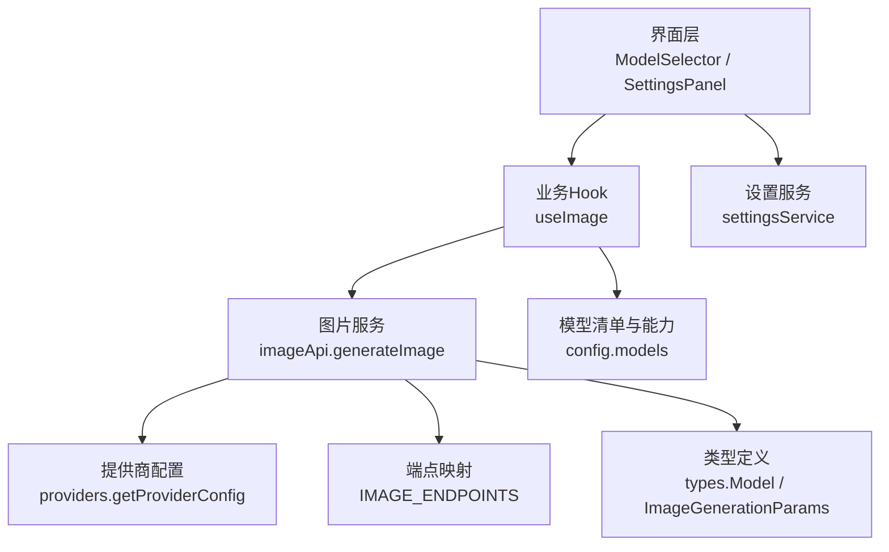
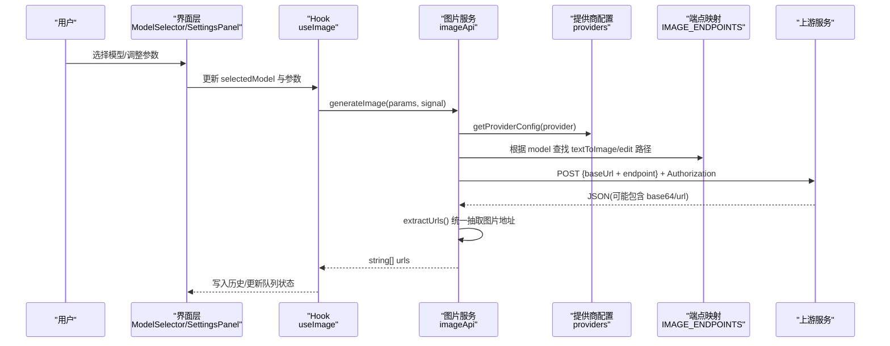
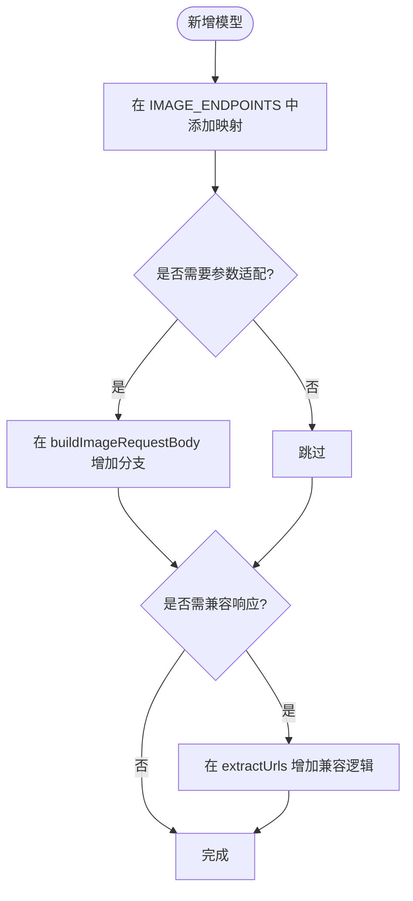
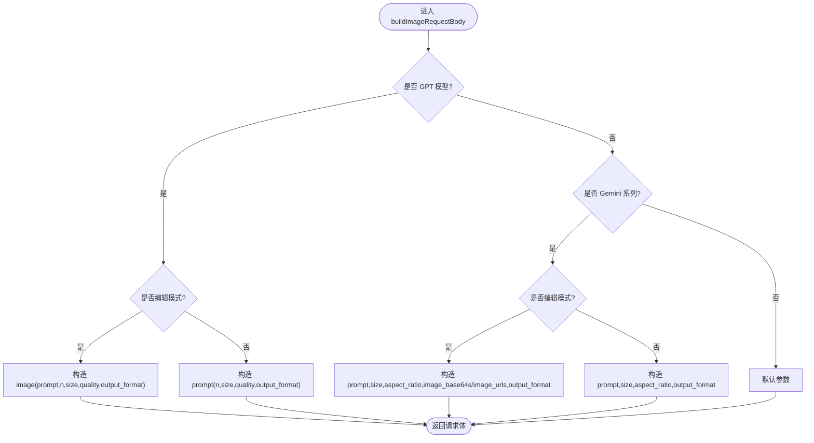
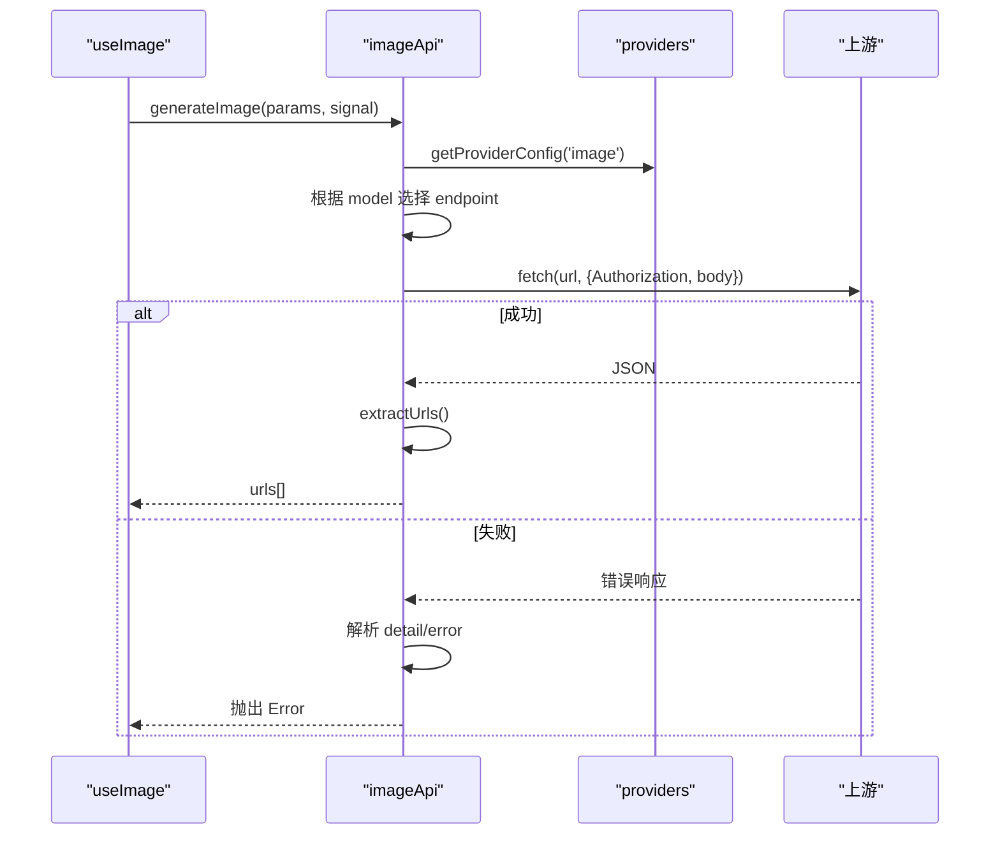
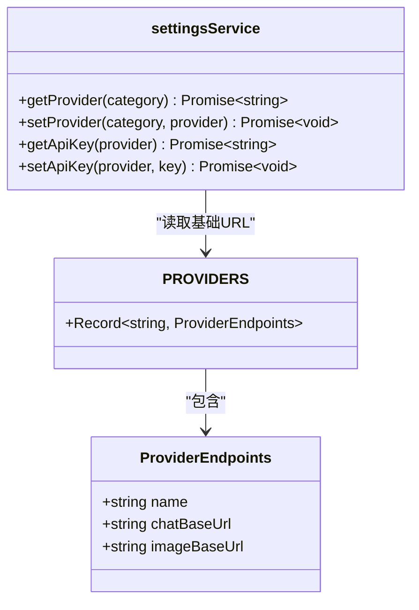
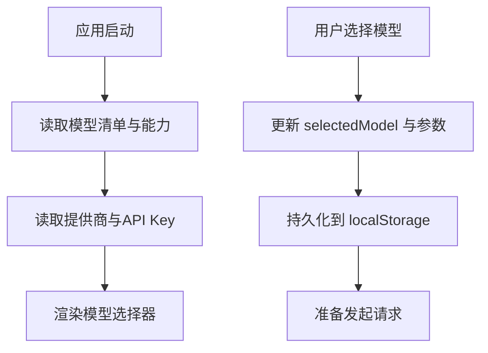
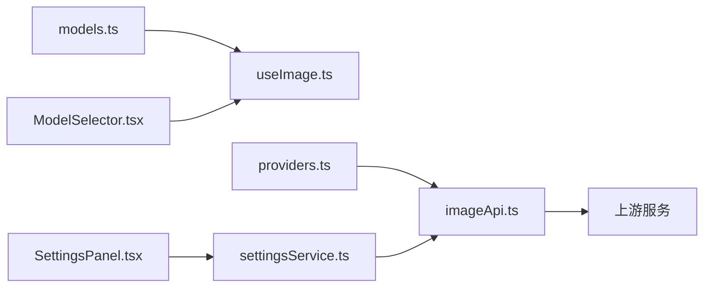

# 模型切换机制

<cite>
**本文引用的文件**
- [src/config/models.ts](file://src/config/models.ts)
- [src/services/imageApi.ts](file://src/services/imageApi.ts)
- [src/hooks/useImage.ts](file://src/hooks/useImage.ts)
- [src/types/index.ts](file://src/types/index.ts)
- [src/config/providers.ts](file://src/config/providers.ts)
- [src/services/settingsService.ts](file://src/services/settingsService.ts)
- [src/components/common/ModelSelector.tsx](file://src/components/common/ModelSelector.tsx)
- [src/components/settings/SettingsPanel.tsx](file://src/components/settings/SettingsPanel.tsx)
</cite>

## 目录
1. [简介](#简介)
2. [项目结构](#项目结构)
3. [核心组件](#核心组件)
4. [架构总览](#架构总览)
5. [详细组件分析](#详细组件分析)
6. [依赖关系分析](#依赖关系分析)
7. [性能考量](#性能考量)
8. [故障排查指南](#故障排查指南)
9. [结论](#结论)
10. [附录：添加新模型的完整指南](#附录添加新模型的完整指南)

## 简介
本文件系统性说明多模型切换机制，重点覆盖：
- IMAGE_ENDPOINTS 映射表的设计原理与扩展方法
- 模型能力检测、参数适配、端点路由的核心逻辑
- 提供商配置系统（API Key 管理、基础 URL 配置、模型能力矩阵）
- 运行时模型切换的实现方案（动态配置加载与缓存）
- 添加新模型的完整步骤（配置文件、端点定义、参数映射等）

## 项目结构
围绕“图片生成”的多模型切换涉及以下关键模块：
- 模型清单与能力矩阵：src/config/models.ts
- 类型定义：src/types/index.ts
- 提供商配置与基础URL：src/config/providers.ts
- 设置服务（Provider 选择与 API Key 持久化）：src/services/settingsService.ts
- 图片生成服务（端点路由、请求体构建、响应解析）：src/services/imageApi.ts
- 图片业务 Hook（模型选择、参数适配、并发队列、历史）：src/hooks/useImage.ts
- UI 模型选择器与设置面板：src/components/common/ModelSelector.tsx、src/components/settings/SettingsPanel.tsx

图表来源
- [src/services/imageApi.ts:6-19](file://src/services/imageApi.ts#L6-L19)
- [src/config/providers.ts:1-18](file://src/config/providers.ts#L1-L18)
- [src/config/models.ts:237-283](file://src/config/models.ts#L237-L283)
- [src/types/index.ts:109-123](file://src/types/index.ts#L109-L123)
- [src/hooks/useImage.ts:123-214](file://src/hooks/useImage.ts#L123-L214)
- [src/components/settings/SettingsPanel.tsx:93-103](file://src/components/settings/SettingsPanel.tsx#L93-L103)

章节来源
- [src/config/models.ts:237-283](file://src/config/models.ts#L237-L283)
- [src/services/imageApi.ts:6-19](file://src/services/imageApi.ts#L6-L19)
- [src/config/providers.ts:1-18](file://src/config/providers.ts#L1-L18)
- [src/services/settingsService.ts:59-84](file://src/services/settingsService.ts#L59-L84)
- [src/hooks/useImage.ts:123-214](file://src/hooks/useImage.ts#L123-L214)
- [src/components/common/ModelSelector.tsx:18-47](file://src/components/common/ModelSelector.tsx#L18-L47)
- [src/components/settings/SettingsPanel.tsx:93-103](file://src/components/settings/SettingsPanel.tsx#L93-L103)

## 核心组件
- 模型清单与能力矩阵：集中维护各模型的能力标签（输入/输出能力、上下文长度、最大 token、价格），用于前端展示与能力判断。
- 提供商配置：以键值对形式维护不同提供商的基础 URL（chatBaseUrl、imageBaseUrl），并提供 getProviderConfig 获取当前配置。
- 设置服务：负责在 localStorage 中持久化当前选择的提供商与对应 API Key，提供读写接口。
- 图片服务：实现模型到上游端点的映射、请求体构建、超时控制、错误处理、统一响应抽取。
- 图片 Hook：封装模型选择、参数适配（尺寸、比例、质量）、并发任务队列、历史记录与重试/取消。
- UI 组件：模型选择器按厂商分组显示；设置面板提供提供商切换与 API Key 编辑。

章节来源
- [src/config/models.ts:109-123](file://src/config/models.ts#L109-L123)
- [src/config/providers.ts:1-18](file://src/config/providers.ts#L1-L18)
- [src/services/settingsService.ts:5-25](file://src/services/settingsService.ts#L5-L25)
- [src/services/imageApi.ts:65-143](file://src/services/imageApi.ts#L65-L143)
- [src/hooks/useImage.ts:252-273](file://src/hooks/useImage.ts#L252-L273)
- [src/components/common/ModelSelector.tsx:18-47](file://src/components/common/ModelSelector.tsx#L18-L47)
- [src/components/settings/SettingsPanel.tsx:93-103](file://src/components/settings/SettingsPanel.tsx#L93-L103)

## 架构总览
下图展示了从用户选择模型到调用上游图片生成接口的完整流程，包括端点路由、参数适配、错误处理与结果归一化。

图表来源
- [src/services/imageApi.ts:149-242](file://src/services/imageApi.ts#L149-L242)
- [src/config/providers.ts:15-18](file://src/config/providers.ts#L15-L18)
- [src/services/imageApi.ts:6-19](file://src/services/imageApi.ts#L6-L19)
- [src/hooks/useImage.ts:358-387](file://src/hooks/useImage.ts#L358-L387)

## 详细组件分析

### 端点映射表 IMAGE_ENDPOINTS 设计与扩展
- 设计要点
  - 以模型 id 为键，值为对象，分别定义文本转图像与图像编辑两个上游路径。
  - 通过模型 id 直接查表，避免运行时分支判断，提高可维护性与扩展性。
- 扩展方法
  - 新增模型时，在映射表中增加一条记录，指定 textToImage 与 edit 的相对路径。
  - 若该模型需要特殊参数适配，则在 buildImageRequestBody 中增加分支处理。
  - 若上游返回格式不同，可在 extractUrls 中补充兼容逻辑。

图表来源
- [src/services/imageApi.ts:6-19](file://src/services/imageApi.ts#L6-L19)
- [src/services/imageApi.ts:65-143](file://src/services/imageApi.ts#L65-L143)
- [src/services/imageApi.ts:25-63](file://src/services/imageApi.ts#L25-L63)

章节来源
- [src/services/imageApi.ts:6-19](file://src/services/imageApi.ts#L6-L19)
- [src/services/imageApi.ts:65-143](file://src/services/imageApi.ts#L65-L143)
- [src/services/imageApi.ts:25-63](file://src/services/imageApi.ts#L25-L63)

### 模型能力检测与参数适配
- 能力检测
  - 使用 Model 类型中的 inputCapabilities/outputCapabilities 描述模型能力，用于前端展示与校验。
  - 在 useImage 中根据模型 id 判断是否为 GPT 或 Google 系列，从而决定可用选项集（尺寸、比例、质量）。
- 参数适配
  - GPT 系列：支持 size、quality、output_format，编辑模式要求 image 字段为字符串（支持 URL 或 data URI）。
  - Gemini 系列：支持 size、aspect_ratio、output_format；编辑模式下区分 image_urls 与 image_base64s。
  - 非编辑模式：GPT 仅 prompt+size/quality；Gemini 额外携带 aspect_ratio。

图表来源
- [src/services/imageApi.ts:65-143](file://src/services/imageApi.ts#L65-L143)
- [src/hooks/useImage.ts:252-273](file://src/hooks/useImage.ts#L252-L273)

章节来源
- [src/types/index.ts:109-123](file://src/types/index.ts#L109-L123)
- [src/services/imageApi.ts:65-143](file://src/services/imageApi.ts#L65-L143)
- [src/hooks/useImage.ts:252-273](file://src/hooks/useImage.ts#L252-L273)

### 端点路由与请求执行
- 路由逻辑
  - 根据 selectedModel 在 IMAGE_ENDPOINTS 中查找对应的 textToImage 或 edit 路径。
  - 结合 settingsService 获取当前 image 提供商，再通过 providers 获取 imageBaseUrl。
  - 拼接最终 URL 并发起 POST 请求，携带 Authorization 头。
- 超时与取消
  - 内置 120 秒超时 AbortController，并与外部传入的 signal 合并，支持用户手动取消。
- 错误处理
  - 非 2xx 响应时尝试解析 detail/error 字段，组合友好错误消息抛出。
- 响应解析
  - extractUrls 兼容多种上游返回结构（base64、url、数组包裹），统一返回字符串数组。

图表来源
- [src/services/imageApi.ts:149-242](file://src/services/imageApi.ts#L149-L242)
- [src/config/providers.ts:15-18](file://src/config/providers.ts#L15-L18)

章节来源
- [src/services/imageApi.ts:149-242](file://src/services/imageApi.ts#L149-L242)
- [src/config/providers.ts:15-18](file://src/config/providers.ts#L15-L18)

### 提供商配置系统与 API Key 管理
- 提供商配置
  - PROVIDERS 维护多个提供商的基础 URL（chatBaseUrl、imageBaseUrl），getProviderConfig 提供读取。
- 设置服务
  - settingsService 在 localStorage 中持久化当前选择的提供商与 API Key。
  - 提供 getProvider/setProvider、getApiKey/setApiKey 等方法。
- 设置面板
  - SettingsPanel 允许用户选择提供商并输入 API Key，实时保存到本地存储。

图表来源
- [src/config/providers.ts:1-18](file://src/config/providers.ts#L1-L18)
- [src/services/settingsService.ts:59-84](file://src/services/settingsService.ts#L59-L84)
- [src/components/settings/SettingsPanel.tsx:93-103](file://src/components/settings/SettingsPanel.tsx#L93-L103)

章节来源
- [src/config/providers.ts:1-18](file://src/config/providers.ts#L1-L18)
- [src/services/settingsService.ts:59-84](file://src/services/settingsService.ts#L59-L84)
- [src/components/settings/SettingsPanel.tsx:93-103](file://src/components/settings/SettingsPanel.tsx#L93-L103)

### 运行时模型切换与缓存机制
- 模型选择与持久化
  - useImage 在本地存储中维护当前图片模型 id，并在切换时重置相关参数（尺寸、比例、质量）。
  - ModelSelector 提供分组展示与选择交互，将选中模型 id 回传给父级状态。
- 缓存策略
  - 模型清单与能力矩阵在 config/models.ts 中静态导出，启动即加载，无需网络请求。
  - 提供商配置与 API Key 通过 settingsService 从 localStorage 读取，减少重复 IO。
  - 图片历史存储在 IndexedDB，避免内存占用过大。

图表来源
- [src/hooks/useImage.ts:48-63](file://src/hooks/useImage.ts#L48-L63)
- [src/hooks/useImage.ts:204-214](file://src/hooks/useImage.ts#L204-L214)
- [src/config/models.ts:275-283](file://src/config/models.ts#L275-L283)
- [src/services/settingsService.ts:59-84](file://src/services/settingsService.ts#L59-L84)

章节来源
- [src/hooks/useImage.ts:48-63](file://src/hooks/useImage.ts#L48-L63)
- [src/hooks/useImage.ts:204-214](file://src/hooks/useImage.ts#L204-L214)
- [src/config/models.ts:275-283](file://src/config/models.ts#L275-L283)
- [src/services/settingsService.ts:59-84](file://src/services/settingsService.ts#L59-L84)

## 依赖关系分析
- 低耦合高内聚
  - 模型清单与能力矩阵独立于请求逻辑，便于扩展与维护。
  - 端点映射与参数适配集中在 imageApi，屏蔽上游差异。
  - 提供商配置与设置服务解耦，便于替换后端网关。
- 关键依赖链
  - useImage -> imageApi -> providers/settingsService -> 上游服务
  - ModelSelector -> 上层状态 -> useImage
  - SettingsPanel -> settingsService -> providers

图表来源
- [src/config/models.ts:237-283](file://src/config/models.ts#L237-L283)
- [src/services/imageApi.ts:149-242](file://src/services/imageApi.ts#L149-L242)
- [src/config/providers.ts:15-18](file://src/config/providers.ts#L15-L18)
- [src/services/settingsService.ts:59-84](file://src/services/settingsService.ts#L59-L84)
- [src/components/common/ModelSelector.tsx:18-47](file://src/components/common/ModelSelector.tsx#L18-L47)
- [src/components/settings/SettingsPanel.tsx:93-103](file://src/components/settings/SettingsPanel.tsx#L93-L103)

章节来源
- [src/config/models.ts:237-283](file://src/config/models.ts#L237-L283)
- [src/services/imageApi.ts:149-242](file://src/services/imageApi.ts#L149-L242)
- [src/config/providers.ts:15-18](file://src/config/providers.ts#L15-L18)
- [src/services/settingsService.ts:59-84](file://src/services/settingsService.ts#L59-L84)
- [src/components/common/ModelSelector.tsx:18-47](file://src/components/common/ModelSelector.tsx#L18-L47)
- [src/components/settings/SettingsPanel.tsx:93-103](file://src/components/settings/SettingsPanel.tsx#L93-L103)

## 性能考量
- 请求超时控制：内置 120 秒超时，避免长时间挂起；支持外部取消信号合并。
- 并发队列：useImage 维护 pendingTasks，避免重复提交与资源竞争。
- 响应归一化：extractUrls 兼容多种返回结构，减少上层处理复杂度。
- 本地缓存：模型清单与提供商配置本地加载，减少网络与 IO 开销。
- 历史存储：图片历史落库，避免内存中持有大体积 base64。

[本节为通用性能建议，不直接分析具体文件]

## 故障排查指南
- 常见错误与定位
  - 未配置 API Key：检查设置面板中对应提供商的 API Key 是否已保存。
  - 不支持的模型：确认模型 id 是否在 IMAGE_ENDPOINTS 中存在。
  - 上游超时：检查网络与上游服务状态，必要时延长超时或重试。
  - 无图片地址返回：查看 extractUrls 是否能识别上游返回结构。
- 调试建议
  - 在浏览器开发者工具中观察请求 URL、Headers、Body 与响应。
  - 逐步打印 buildImageRequestBody 的输出，确认参数是否符合上游要求。
  - 使用 cancelTask/retryTask 进行任务管理与重试。

章节来源
- [src/services/imageApi.ts:149-242](file://src/services/imageApi.ts#L149-L242)
- [src/hooks/useImage.ts:389-412](file://src/hooks/useImage.ts#L389-L412)

## 结论
本项目通过清晰的模型清单、灵活的端点映射、统一的参数适配与健壮的错误处理，实现了多模型切换与多提供商接入。设置服务与提供商配置解耦，便于扩展新的 AI 模型与服务端点。运行时采用本地缓存与 IndexedDB 存储，兼顾性能与用户体验。

[本节为总结性内容，不直接分析具体文件]

## 附录：添加新模型的完整指南
- 步骤概览
  1) 在模型清单中登记新模型（id、name、provider、type、能力矩阵、价格等）。
  2) 在 IMAGE_ENDPOINTS 中为新模型定义 textToImage 与 edit 的上游路径。
  3) 如上游参数不同，在 buildImageRequestBody 中增加分支处理。
  4) 如上游返回结构不同，在 extractUrls 中补充兼容逻辑。
  5) 在 useImage 中为新模型定义默认参数与选项集（尺寸、比例、质量等）。
  6) 如需新提供商，先在 PROVIDERS 中配置基础 URL，并在设置面板中暴露选择项。
  7) 测试端到端流程：选择模型、上传图片（编辑模式）、发起请求、查看历史。

- 配置文件修改
  - 模型清单：在 src/config/models.ts 中新增条目，确保 type 为 'image'，并填写 inputCapabilities/outputCapabilities。
  - 端点映射：在 src/services/imageApi.ts 的 IMAGE_ENDPOINTS 中添加映射。
  - 提供商配置：在 src/config/providers.ts 中新增提供商基础 URL。
  - 设置面板：在 src/components/settings/SettingsPanel.tsx 的 PROVIDER_OPTIONS 中增加新提供商选项。

- 端点定义与参数映射
  - 端点：textToImage 与 edit 分别对应文本转图与图像编辑。
  - 参数：根据模型特性在 buildImageRequestBody 中映射 prompt、size、aspectRatio、quality、outputFormat、images 等。
  - 响应：在 extractUrls 中兼容 base64 与 url 两种返回。

- 运行时行为
  - 模型切换：useImage 在切换时重置参数并持久化。
  - 缓存：模型清单与提供商配置本地加载；历史落库。
  - 错误：统一错误消息与超时控制。

章节来源
- [src/config/models.ts:237-283](file://src/config/models.ts#L237-L283)
- [src/services/imageApi.ts:6-19](file://src/services/imageApi.ts#L6-L19)
- [src/services/imageApi.ts:65-143](file://src/services/imageApi.ts#L65-L143)
- [src/services/imageApi.ts:25-63](file://src/services/imageApi.ts#L25-L63)
- [src/config/providers.ts:1-18](file://src/config/providers.ts#L1-L18)
- [src/components/settings/SettingsPanel.tsx:13-21](file://src/components/settings/SettingsPanel.tsx#L13-L21)
- [src/hooks/useImage.ts:252-273](file://src/hooks/useImage.ts#L252-L273)
- [src/hooks/useImage.ts:358-387](file://src/hooks/useImage.ts#L358-L387)