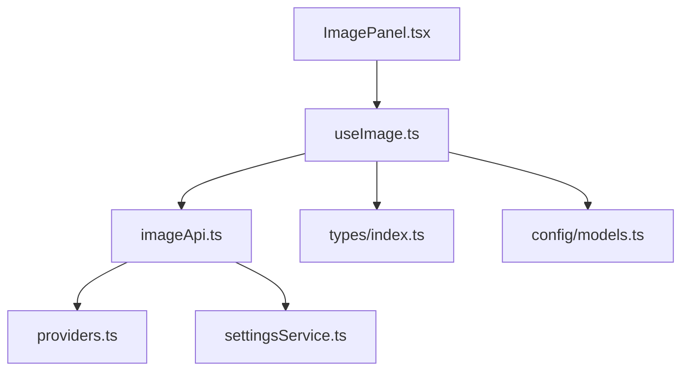
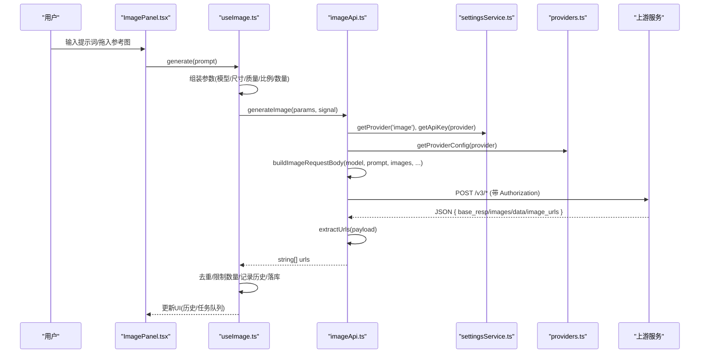
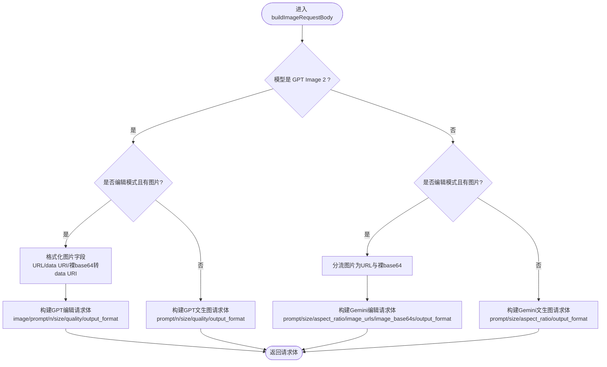
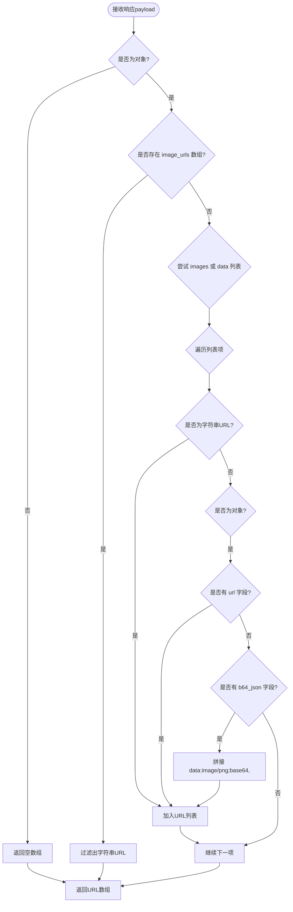
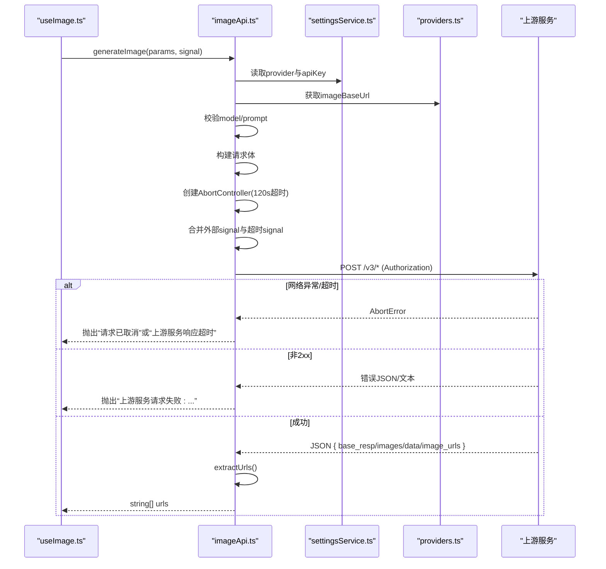
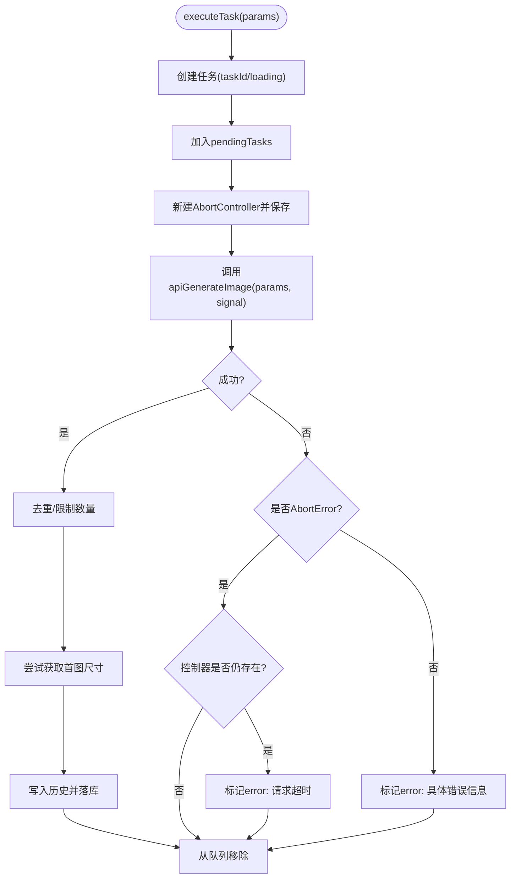
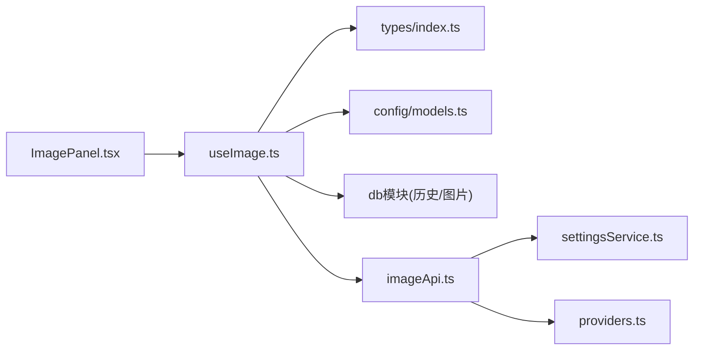

# 请求响应处理

<cite>
**本文引用的文件**
- [imageApi.ts](file://src/services/imageApi.ts)
- [useImage.ts](file://src/hooks/useImage.ts)
- [ImagePanel.tsx](file://src/components/image/ImagePanel.tsx)
- [models.ts](file://src/config/models.ts)
- [providers.ts](file://src/config/providers.ts)
- [settingsService.ts](file://src/services/settingsService.ts)
- [index.ts](file://src/types/index.ts)
</cite>

## 目录
1. [简介](#简介)
2. [项目结构](#项目结构)
3. [核心组件](#核心组件)
4. [架构总览](#架构总览)
5. [详细组件分析](#详细组件分析)
6. [依赖关系分析](#依赖关系分析)
7. [性能考量](#性能考量)
8. [故障排查指南](#故障排查指南)
9. [结论](#结论)
10. [附录](#附录)

## 简介
本文件聚焦于图像生成 API 的请求与响应处理链路，覆盖以下关键主题：
- 请求体构建逻辑：不同模型（GPT Image 2、Gemini 系列）的参数适配、图片格式转换（URL/base64/data URI）、默认值设置。
- 响应数据提取机制：兼容多种上游返回结构（base_resp、images、data、image_urls），统一抽取图片 URL 数组。
- 错误处理策略：网络错误、超时、上游服务错误的统一封装与区分。
- AbortSignal 的使用与请求取消机制：用户手动取消与内部超时的合并与区分。
- 完整流程图：从参数校验到结果返回的全链路说明。

## 项目结构
图像生成功能由前端 UI、Hook 状态管理、API 服务层与提供商配置共同组成：
- UI 层：ImagePanel 负责输入、上传参考图、发起生成、展示历史与任务队列。
- Hook 层：useImage 维护模型选择、参数、并发任务队列、历史持久化。
- API 层：imageApi 负责构建请求体、发送请求、解析响应、错误处理。
- 配置层：providers 提供基础 URL；models 定义可用图像模型；types 定义数据结构。

图表来源
- [ImagePanel.tsx:369-777](file://src/components/image/ImagePanel.tsx#L369-L777)
- [useImage.ts:123-467](file://src/hooks/useImage.ts#L123-L467)
- [imageApi.ts:149-257](file://src/services/imageApi.ts#L149-L257)
- [providers.ts:1-18](file://src/config/providers.ts#L1-L18)
- [settingsService.ts:59-100](file://src/services/settingsService.ts#L59-L100)
- [models.ts:237-271](file://src/config/models.ts#L237-L271)
- [index.ts:177-214](file://src/types/index.ts#L177-L214)

章节来源
- [ImagePanel.tsx:369-777](file://src/components/image/ImagePanel.tsx#L369-L777)
- [useImage.ts:123-467](file://src/hooks/useImage.ts#L123-L467)
- [imageApi.ts:149-257](file://src/services/imageApi.ts#L149-L257)
- [providers.ts:1-18](file://src/config/providers.ts#L1-L18)
- [settingsService.ts:59-100](file://src/services/settingsService.ts#L59-L100)
- [models.ts:237-271](file://src/config/models.ts#L237-L271)
- [index.ts:177-214](file://src/types/index.ts#L177-L214)

## 核心组件
- 请求体构建器：根据模型与模式（文生图/编辑）构造不同的字段与默认值，并处理图片格式转换。
- 响应提取器：兼容多上游返回结构，统一输出图片 URL 数组。
- 请求执行器：带超时控制、AbortSignal 合并、错误分类与消息包装。
- Hook 状态机：维护并发任务队列、重试/取消、历史落库与尺寸回填。

章节来源
- [imageApi.ts:66-143](file://src/services/imageApi.ts#L66-L143)
- [imageApi.ts:25-63](file://src/services/imageApi.ts#L25-L63)
- [imageApi.ts:149-257](file://src/services/imageApi.ts#L149-L257)
- [useImage.ts:274-407](file://src/hooks/useImage.ts#L274-L407)

## 架构总览
下图展示了从用户输入到最终结果返回的端到端流程，包括参数校验、请求构建、网络请求、响应解析与错误处理。

图表来源
- [ImagePanel.tsx:603-615](file://src/components/image/ImagePanel.tsx#L603-L615)
- [useImage.ts:359-387](file://src/hooks/useImage.ts#L359-L387)
- [imageApi.ts:149-243](file://src/services/imageApi.ts#L149-L243)
- [settingsService.ts:59-84](file://src/services/settingsService.ts#L59-L84)
- [providers.ts:1-18](file://src/config/providers.ts#L1-L18)

## 详细组件分析

### 请求体构建逻辑（buildImageRequestBody）
- 模型路由：
  - GPT Image 2：
    - 编辑模式：image 字段为字符串，支持 URL 或 data URI；若传入裸 base64，自动补全 data:image/jpeg;base64, 前缀以满足上游 MIME 识别要求。
    - 文生图模式：仅包含 prompt、n、size、quality、output_format。
  - Gemini 系列（gemini-3.1-flash / gemini-3-pro）：
    - 编辑模式：将图片分流为 image_urls（http(s) 开头）与 image_base64s（裸 base64，去除 data URI 前缀）。
    - 文生图模式：包含 prompt、size、aspect_ratio、output_format。
- 默认值策略：
  - GPT：size 默认 1024x1024，quality 默认 medium，output_format 默认 png。
  - Gemini：size 默认 1K，aspect_ratio 默认 1:1，output_format 默认 image/png。
- 参数来源：
  - useImage 中根据模型类型决定有效选项（如 Google 模型的宽高比选项、GPT 的质量等级等），并在 generate 时填充到 params。

图表来源
- [imageApi.ts:66-143](file://src/services/imageApi.ts#L66-L143)
- [useImage.ts:32-45](file://src/hooks/useImage.ts#L32-L45)
- [useImage.ts:252-272](file://src/hooks/useImage.ts#L252-L272)
- [useImage.ts:359-387](file://src/hooks/useImage.ts#L359-L387)

章节来源
- [imageApi.ts:66-143](file://src/services/imageApi.ts#L66-L143)
- [useImage.ts:32-45](file://src/hooks/useImage.ts#L32-L45)
- [useImage.ts:252-272](file://src/hooks/useImage.ts#L252-L272)
- [useImage.ts:359-387](file://src/hooks/useImage.ts#L359-L387)

### 响应数据提取机制（extractUrls）
- 兼容结构：
  - Gemini/jiekou 自定义协议：支持顶层 image_urls 数组。
  - GPT Image 2 / OpenAI 兼容：支持 images 或 data 数组，元素可为字符串 URL 或对象 { url | b64_json }。
  - base64 兼容：当元素为 b64_json 时，转换为 data:image/png;base64,... 以便前端直接作为 src 使用。
- 返回值：统一的图片 URL 数组，供上层去重与限制数量后写入历史。

图表来源
- [imageApi.ts:25-63](file://src/services/imageApi.ts#L25-L63)

章节来源
- [imageApi.ts:25-63](file://src/services/imageApi.ts#L25-L63)

### 请求执行与错误处理（generateImage）
- 参数校验：
  - 必须提供 model 与 prompt（非空且可 trim）。
  - 不支持的模型会抛出明确错误。
- 超时控制：
  - 内置 120 秒超时（AbortController + setTimeout），适用于 GPT Image 2 等耗时较长的场景。
- 取消机制：
  - 支持外部 AbortSignal（来自 useImage 的任务控制器），并与内部超时信号合并。
  - 区分“用户手动取消”和“内部超时”，分别抛出不同错误消息。
- 网络与上游错误：
  - 非 2xx 响应时，优先解析 detail/error.message 字段，组合成友好错误信息。
  - 无法解析 JSON 时回退为原始文本。
- 响应解析：
  - 调用 extractUrls 获取图片 URL 数组；为空则抛错“未返回图片地址”。

图表来源
- [imageApi.ts:149-243](file://src/services/imageApi.ts#L149-L243)
- [imageApi.ts:245-257](file://src/services/imageApi.ts#L245-L257)
- [useImage.ts:274-356](file://src/hooks/useImage.ts#L274-L356)

章节来源
- [imageApi.ts:149-243](file://src/services/imageApi.ts#L149-L243)
- [imageApi.ts:245-257](file://src/services/imageApi.ts#L245-L257)
- [useImage.ts:274-356](file://src/hooks/useImage.ts#L274-L356)

### 并发任务与取消机制（useImage）
- 任务队列：
  - 每个生成任务分配唯一 taskId，加入 pendingTasks，状态为 loading。
  - 每个任务拥有独立 AbortController，用于用户手动取消。
- 成功路径：
  - 从 API 返回的 URLs 去重并限制数量为 n。
  - 尝试获取第一张图片的尺寸用于瀑布流占位计算。
  - 写入历史并落库（IndexedDB），同时替换内存中的 base64 引用为 blob 引用以节省内存。
- 失败路径：
  - 区分 AbortError：若控制器已被移除，视为用户手动取消，直接移除任务；否则标记为 error 并提示“请求超时，请稍后重试”。
  - 其他错误：记录错误信息并显示在任务卡片中。
- 取消与重试：
  - cancelTask：删除控制器并 abort，移除任务。
  - retryTask：用原参数重新发起请求。

图表来源
- [useImage.ts:274-356](file://src/hooks/useImage.ts#L274-L356)

章节来源
- [useImage.ts:274-356](file://src/hooks/useImage.ts#L274-L356)

### 图片压缩与上传（useImage）
- 压缩策略：
  - 最大边长 1024px，JPEG 质量 0.85，输出裸 base64（不含 data URI 前缀）。
  - 用于编辑模式下上传参考图，减少带宽与存储压力。
- 上传限制：
  - 不同模型的最大上传数量不同（GPT 1 张，Google 最多 14 张）。
  - 切换模型时自动裁剪超出上限的图片。

章节来源
- [useImage.ts:84-120](file://src/hooks/useImage.ts#L84-L120)
- [useImage.ts:41-45](file://src/hooks/useImage.ts#L41-L45)
- [useImage.ts:217-238](file://src/hooks/useImage.ts#L217-L238)

## 依赖关系分析
- 模块耦合：
  - ImagePanel 依赖 useImage 暴露的状态与方法。
  - useImage 依赖 types 定义的数据结构与 models 提供的模型列表。
  - imageApi 依赖 settingsService 与 providers 获取配置与密钥。
- 外部依赖：
  - fetch API 用于网络请求。
  - IndexedDB 用于历史与图片二进制存储（通过 db 模块）。
- 潜在循环依赖：
  - 当前结构清晰分层，未见循环导入迹象。

图表来源
- [ImagePanel.tsx:369-777](file://src/components/image/ImagePanel.tsx#L369-L777)
- [useImage.ts:123-467](file://src/hooks/useImage.ts#L123-L467)
- [imageApi.ts:149-257](file://src/services/imageApi.ts#L149-L257)
- [settingsService.ts:59-100](file://src/services/settingsService.ts#L59-L100)
- [providers.ts:1-18](file://src/config/providers.ts#L1-L18)
- [index.ts:177-214](file://src/types/index.ts#L177-L214)

章节来源
- [ImagePanel.tsx:369-777](file://src/components/image/ImagePanel.tsx#L369-L777)
- [useImage.ts:123-467](file://src/hooks/useImage.ts#L123-L467)
- [imageApi.ts:149-257](file://src/services/imageApi.ts#L149-L257)
- [settingsService.ts:59-100](file://src/services/settingsService.ts#L59-L100)
- [providers.ts:1-18](file://src/config/providers.ts#L1-L18)
- [index.ts:177-214](file://src/types/index.ts#L177-L214)

## 性能考量
- 图片压缩：限制最大边长与 JPEG 质量，降低传输体积与内存占用。
- 并发控制：每个任务独立控制器，避免级联取消；队列化管理提升用户体验。
- 历史优化：落库后将内存中的 base64 替换为 blob 引用，防止大图片长期驻留内存。
- 超时策略：120 秒超时平衡生成时长与资源释放，避免长时间挂起。

[本节为通用指导，不直接分析具体文件]

## 故障排查指南
- 常见错误与定位：
  - “请先在设置中配置图片 API Key”：检查 settingsService 中 image 提供商与 apiKey 是否已配置。
  - “Missing required field: model/prompt”：确认 useImage.generate 是否正确组装参数。
  - “不支持的图片模型”：检查 IMAGE_ENDPOINTS 映射是否包含所选模型。
  - “上游服务请求失败”：查看上游返回的 detail/error.message，必要时调整 provider 配置。
  - “请求已取消”：确认是否触发了用户手动取消或页面卸载清理。
  - “上游服务响应超时”：检查网络状况或上游服务负载，考虑调整超时策略。
  - “未返回图片地址”：核对上游响应结构是否符合预期（base_resp/images/data/image_urls）。
- 调试建议：
  - 在 useImage.executeTask 的 catch 分支打印错误堆栈。
  - 在 imageApi.extractUrls 处断点验证响应结构。
  - 检查 providers.ts 中 imageBaseUrl 与 endpoints 是否正确。

章节来源
- [imageApi.ts:149-243](file://src/services/imageApi.ts#L149-L243)
- [useImage.ts:336-356](file://src/hooks/useImage.ts#L336-L356)
- [providers.ts:1-18](file://src/config/providers.ts#L1-L18)

## 结论
该图像 API 请求响应处理链路通过清晰的模块化设计实现了多模型适配、灵活的图片格式转换、健壮的响应解析与完善的错误处理。结合 AbortSignal 的合并与区分，既保证了用户体验（可取消），又确保了系统稳定性（超时保护）。整体架构易于扩展新模型与新上游协议，具备良好的可维护性与性能表现。

[本节为总结性内容，不直接分析具体文件]

## 附录
- 关键数据类型：
  - ImageGenerationParams：包含 prompt、model、images、aspectRatio、size、quality、outputFormat、n。
  - ImageHistoryItem：记录生成的图片 URL、提示词、模型、时间戳及可选尺寸信息。
  - PendingImageTask：表示待处理/错误任务，携带完整参数用于重试。

章节来源
- [index.ts:177-214](file://src/types/index.ts#L177-L214)