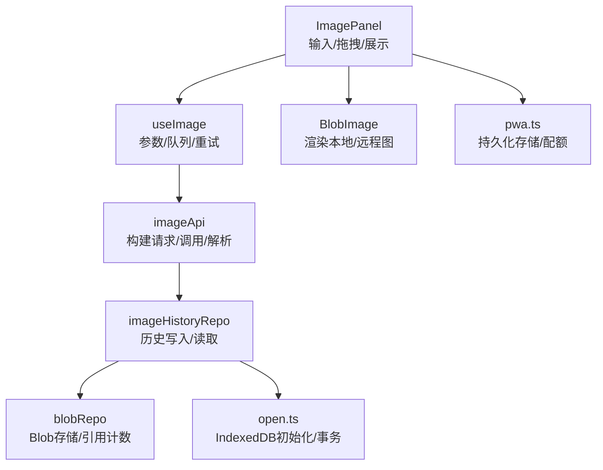
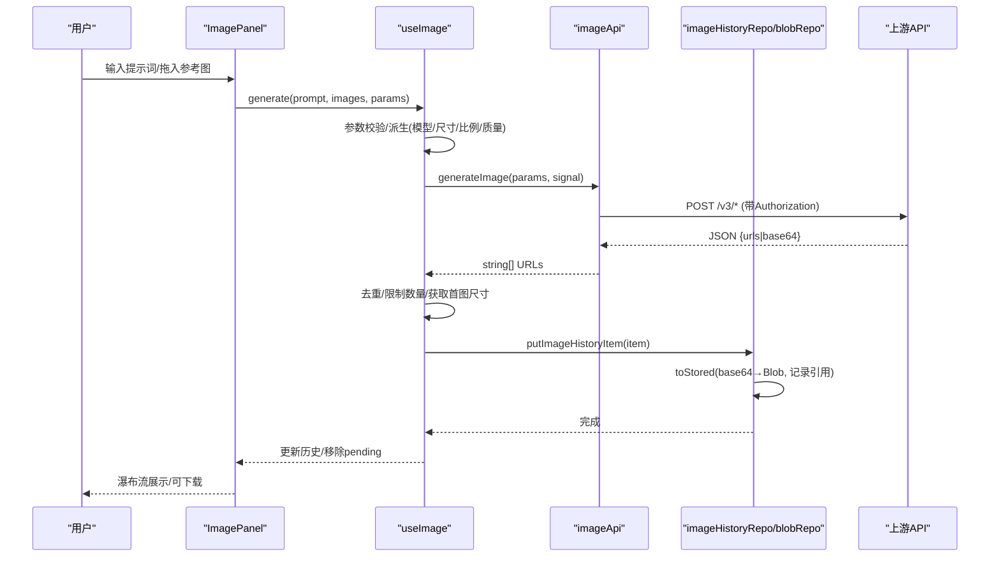
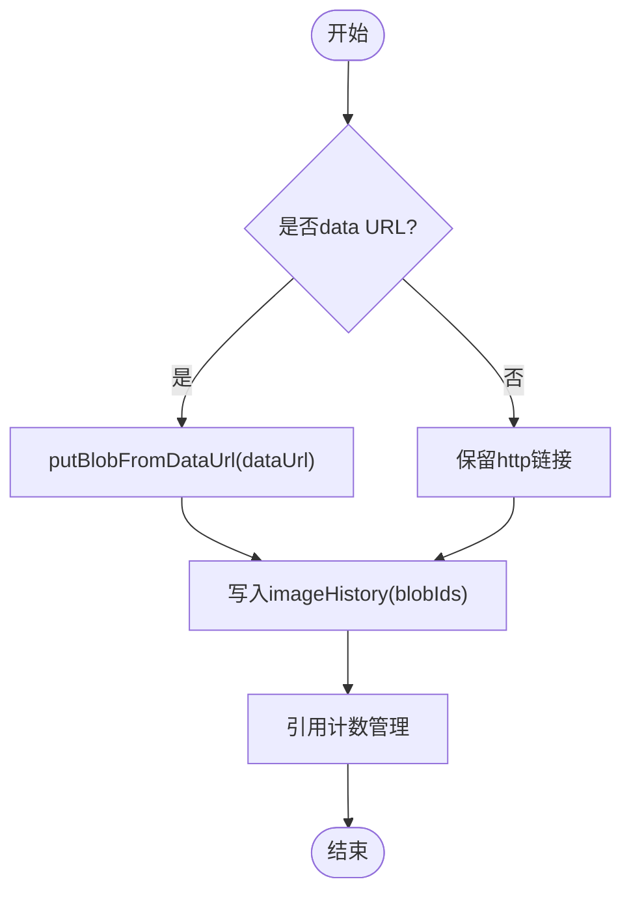
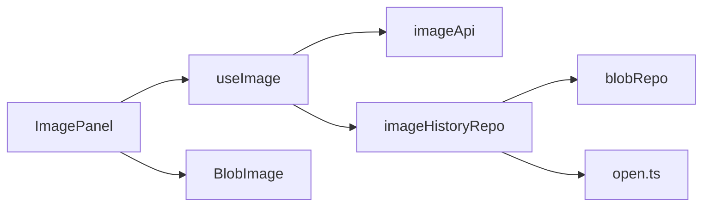

# 图像处理工作流

<cite>
**本文引用的文件**
- [src/services/imageApi.ts](file://src/services/imageApi.ts)
- [src/hooks/useImage.ts](file://src/hooks/useImage.ts)
- [src/components/image/ImagePanel.tsx](file://src/components/image/ImagePanel.tsx)
- [src/types/index.ts](file://src/types/index.ts)
- [src/config/models.ts](file://src/config/models.ts)
- [src/db/imageHistoryRepo.ts](file://src/db/imageHistoryRepo.ts)
- [src/db/blobRepo.ts](file://src/db/blobRepo.ts)
- [src/db/open.ts](file://src/db/open.ts)
- [src/components/common/BlobImage.tsx](file://src/components/common/BlobImage.tsx)
- [src/utils/pwa.ts](file://src/utils/pwa.ts)
</cite>

## 目录
1. [简介](#简介)
2. [项目结构](#项目结构)
3. [核心组件](#核心组件)
4. [架构总览](#架构总览)
5. [详细组件分析](#详细组件分析)
6. [依赖关系分析](#依赖关系分析)
7. [性能考量](#性能考量)
8. [故障排查指南](#故障排查指南)
9. [结论](#结论)
10. [附录](#附录)

## 简介
本文件系统化梳理 AIShop 的图像处理工作流，覆盖从用户输入到最终图像生成的完整链路：参数校验、文件预处理（压缩/尺寸提取）、API 调用（多模型适配与超时控制）、结果处理（URL/base64 统一抽取）、历史持久化（IndexedDB + Blob 引用计数）、批量任务调度（并发队列）以及错误处理与重试机制。同时给出存储管理策略、性能优化建议与常见问题排查方法。

## 项目结构
围绕图片生成能力，前端采用“Hook + 服务 + UI”的分层组织：
- 交互层：ImagePanel 负责输入、拖拽上传、瀑布流展示、下载与删除等。
- 状态与流程层：useImage Hook 封装模型选择、参数派生、并发队列、重试/取消、历史读写。
- 网络层：imageApi 负责构建请求体、调用上游 API、解析响应、超时与错误处理。
- 存储层：db 模块提供 IndexedDB 访问、Blob 内容寻址存储与引用计数、历史增删改查。
- 配置与类型：models 定义可用模型；types 定义请求/响应/历史数据结构。

图表来源
- [src/components/image/ImagePanel.tsx:369-777](file://src/components/image/ImagePanel.tsx#L369-L777)
- [src/hooks/useImage.ts:123-467](file://src/hooks/useImage.ts#L123-L467)
- [src/services/imageApi.ts:149-243](file://src/services/imageApi.ts#L149-L243)
- [src/db/imageHistoryRepo.ts:84-144](file://src/db/imageHistoryRepo.ts#L84-L144)
- [src/db/blobRepo.ts:40-168](file://src/db/blobRepo.ts#L40-L168)
- [src/db/open.ts:31-74](file://src/db/open.ts#L31-L74)
- [src/components/common/BlobImage.tsx:1-60](file://src/components/common/BlobImage.tsx#L1-L60)
- [src/utils/pwa.ts:42-89](file://src/utils/pwa.ts#L42-L89)

章节来源
- [src/components/image/ImagePanel.tsx:369-777](file://src/components/image/ImagePanel.tsx#L369-L777)
- [src/hooks/useImage.ts:123-467](file://src/hooks/useImage.ts#L123-L467)
- [src/services/imageApi.ts:149-243](file://src/services/imageApi.ts#L149-L243)
- [src/db/imageHistoryRepo.ts:84-144](file://src/db/imageHistoryRepo.ts#L84-L144)
- [src/db/blobRepo.ts:40-168](file://src/db/blobRepo.ts#L40-L168)
- [src/db/open.ts:31-74](file://src/db/open.ts#L31-L74)
- [src/components/common/BlobImage.tsx:1-60](file://src/components/common/BlobImage.tsx#L1-L60)
- [src/utils/pwa.ts:42-89](file://src/utils/pwa.ts#L42-L89)

## 核心组件
- 图片面板 ImagePanel：承载提示词输入、参考图拖拽/上传、参数选择、瀑布流展示、下载与删除。
- 图片 Hook useImage：维护模型、上传列表、宽高比/尺寸/质量等参数，编排生成任务、并发队列、重试/取消、历史落库。
- 图片 API imageApi：根据模型拼装请求体，调用上游端点，统一抽取图片 URL，处理超时与错误。
- 数据库 imageHistoryRepo/blobRepo：将 base64 转为 Blob 并内容寻址存储，维护引用计数；历史按时间索引查询。
- 通用 BlobImage：对 http/data URL 与 aishop-blob:<id> 透明渲染。

章节来源
- [src/components/image/ImagePanel.tsx:369-777](file://src/components/image/ImagePanel.tsx#L369-L777)
- [src/hooks/useImage.ts:123-467](file://src/hooks/useImage.ts#L123-L467)
- [src/services/imageApi.ts:149-243](file://src/services/imageApi.ts#L149-L243)
- [src/db/imageHistoryRepo.ts:84-144](file://src/db/imageHistoryRepo.ts#L84-L144)
- [src/db/blobRepo.ts:40-168](file://src/db/blobRepo.ts#L40-L168)
- [src/components/common/BlobImage.tsx:1-60](file://src/components/common/BlobImage.tsx#L1-L60)

## 架构总览
下图展示了从用户输入到结果展示的端到端流程，包括参数校验、并发队列、API 调用、结果处理与持久化。

图表来源
- [src/components/image/ImagePanel.tsx:603-615](file://src/components/image/ImagePanel.tsx#L603-L615)
- [src/hooks/useImage.ts:359-387](file://src/hooks/useImage.ts#L359-L387)
- [src/services/imageApi.ts:149-243](file://src/services/imageApi.ts#L149-L243)
- [src/db/imageHistoryRepo.ts:37-88](file://src/db/imageHistoryRepo.ts#L37-L88)

## 详细组件分析

### 参数验证与模型适配
- 必填字段校验：model、prompt 非空；未配置 API Key 时直接报错。
- 模型路由：gpt-image-2 与 Gemini 系列分别映射不同端点路径。
- 编辑模式识别：存在 images 即进入编辑流程，使用 edit 端点。
- 参数派生：
  - GPT：size 来自预设像素尺寸；quality 可选 low/medium/high；不使用 aspectRatio。
  - Gemini：size 为 K 档位；aspectRatio 支持多种比例；编辑模式下自动比例。
- 上传上限：GPT 仅 1 张参考图；Gemini 最多 14 张。

章节来源
- [src/services/imageApi.ts:6-19](file://src/services/imageApi.ts#L6-L19)
- [src/services/imageApi.ts:66-143](file://src/services/imageApi.ts#L66-L143)
- [src/services/imageApi.ts:149-177](file://src/services/imageApi.ts#L149-L177)
- [src/hooks/useImage.ts:17-45](file://src/hooks/useImage.ts#L17-L45)
- [src/hooks/useImage.ts:252-272](file://src/hooks/useImage.ts#L252-L272)
- [src/config/models.ts:237-271](file://src/config/models.ts#L237-L271)

### 文件预处理（压缩与尺寸）
- 压缩：Canvas 缩放至最大边 1024px，JPEG 质量 0.85，输出裸 base64（不含 data URI）。
- 尺寸探测：首次成功返回的图片尝试解码尺寸用于瀑布流占位；若失败则回退正方形布局。
- 拖拽兼容：支持外部文件、data URL、blob URL、http(s) URL（含 CORS 回退），统一转 File 后进入压缩流程。

章节来源
- [src/hooks/useImage.ts:84-120](file://src/hooks/useImage.ts#L84-L120)
- [src/hooks/useImage.ts:152-194](file://src/hooks/useImage.ts#L152-L194)
- [src/components/image/ImagePanel.tsx:438-571](file://src/components/image/ImagePanel.tsx#L438-L571)

### API 调用与响应解析
- 请求体构建：
  - GPT 编辑：image 字段需为完整 data URI；否则补前缀。
  - Gemini 编辑：区分 image_urls 与 image_base64s；data URI 会剥离前缀为裸 base64。
- 超时控制：120s 超时 AbortController，合并外部取消信号。
- 响应解析：兼容多种上游格式（image_urls、images、data），统一抽取 URL 数组；支持 base64 直接作为 src。
- 错误处理：优先取 detail/error.message；非 2xx 抛错；无 URL 抛错。

章节来源
- [src/services/imageApi.ts:66-143](file://src/services/imageApi.ts#L66-L143)
- [src/services/imageApi.ts:183-243](file://src/services/imageApi.ts#L183-L243)

### 结果处理与历史持久化
- 结果处理：去重并限制返回数量；尝试获取首图尺寸；构造历史项并追加到 state。
- 持久化：
  - base64 → Blob：通过 blobRepo 内容寻址存储，避免重复写入。
  - 历史表：按 timestamp 索引排序；读回时将 Blob ID 转换为 aishop-blob:<id> 供 UI 渲染。
  - 尺寸回填：启动时扫描缺失 width/height 的历史项，异步计算并写回。
- 下载：aishop-blob 协议先取 Blob 再创建临时 object URL，下载完成后延迟释放。

章节来源
- [src/hooks/useImage.ts:275-356](file://src/hooks/useImage.ts#L275-L356)
- [src/db/imageHistoryRepo.ts:37-88](file://src/db/imageHistoryRepo.ts#L37-L88)
- [src/db/blobRepo.ts:40-78](file://src/db/blobRepo.ts#L40-L78)
- [src/components/image/ImagePanel.tsx:66-92](file://src/components/image/ImagePanel.tsx#L66-L92)

### 批量处理的调度算法与资源管理
- 并发队列：每个生成任务在 pendingTasks 中排队，独立 AbortController 管理生命周期。
- 任务状态：loading → success（移除 pending，加入历史）或 error（显示错误卡片，支持重试/关闭）。
- 资源清理：组件卸载时统一 abort 所有控制器；任务完成后从 Map 中移除。
- 取消与重试：cancelTask 主动中止；retryTask 用原参数重新执行。

章节来源
- [src/hooks/useImage.ts:136-202](file://src/hooks/useImage.ts#L136-L202)
- [src/hooks/useImage.ts:275-412](file://src/hooks/useImage.ts#L275-L412)

### 错误处理、重试与降级
- 网络层：AbortError 区分“用户取消”和“超时”，抛出明确错误信息。
- 业务层：未返回图片地址、未配置 API Key、不支持模型等场景均抛错。
- UI 层：错误卡片提供重试与关闭；加载失败图片忽略并继续渲染其他。
- 降级策略：CORS 失败时使用 Canvas 回退；无法解码尺寸时回退正方形占位。

章节来源
- [src/services/imageApi.ts:183-243](file://src/services/imageApi.ts#L183-L243)
- [src/hooks/useImage.ts:336-356](file://src/hooks/useImage.ts#L336-L356)
- [src/components/image/ImagePanel.tsx:514-571](file://src/components/image/ImagePanel.tsx#L514-L571)

### 存储管理机制（IndexedDB + 本地缓存）
- 内容寻址：Blob ID = SHA-256，相同内容只存一份，refCount 递增。
- 引用计数：删除/覆盖历史时减少引用；归零不立即删除，由 sweepOrphanBlobs 批量清理。
- 历史表：imageHistory 以 by_timestamp 索引；读回时把 Blob ID 转为 aishop-blob:<id>。
- 持久化存储：支持 requestPersistentStorage 申请持久化，降低被系统回收风险。

图表来源
- [src/db/imageHistoryRepo.ts:37-61](file://src/db/imageHistoryRepo.ts#L37-L61)
- [src/db/blobRepo.ts:40-78](file://src/db/blobRepo.ts#L40-L78)
- [src/db/blobRepo.ts:131-168](file://src/db/blobRepo.ts#L131-L168)
- [src/utils/pwa.ts:42-89](file://src/utils/pwa.ts#L42-L89)

章节来源
- [src/db/imageHistoryRepo.ts:37-144](file://src/db/imageHistoryRepo.ts#L37-L144)
- [src/db/blobRepo.ts:40-168](file://src/db/blobRepo.ts#L40-L168)
- [src/utils/pwa.ts:42-89](file://src/utils/pwa.ts#L42-L89)

## 依赖关系分析
- 组件依赖：ImagePanel 依赖 useImage；useImage 依赖 imageApi 与 db 模块；UI 通过 BlobImage 渲染本地/远程图。
- 数据流：useImage 组装参数 → imageApi 调用上游 → 返回 URL → 持久化到 imageHistory → 渲染到瀑布流。
- 存储耦合：imageHistoryRepo 依赖 blobRepo 进行二进制存储；两者共用 open.ts 提供的 IndexedDB 连接与事务。

图表来源
- [src/components/image/ImagePanel.tsx:369-777](file://src/components/image/ImagePanel.tsx#L369-L777)
- [src/hooks/useImage.ts:123-467](file://src/hooks/useImage.ts#L123-L467)
- [src/services/imageApi.ts:149-243](file://src/services/imageApi.ts#L149-L243)
- [src/db/imageHistoryRepo.ts:84-144](file://src/db/imageHistoryRepo.ts#L84-L144)
- [src/db/blobRepo.ts:40-168](file://src/db/blobRepo.ts#L40-L168)
- [src/db/open.ts:31-74](file://src/db/open.ts#L31-L74)
- [src/components/common/BlobImage.tsx:1-60](file://src/components/common/BlobImage.tsx#L1-L60)

章节来源
- [src/components/image/ImagePanel.tsx:369-777](file://src/components/image/ImagePanel.tsx#L369-L777)
- [src/hooks/useImage.ts:123-467](file://src/hooks/useImage.ts#L123-L467)
- [src/services/imageApi.ts:149-243](file://src/services/imageApi.ts#L149-L243)
- [src/db/imageHistoryRepo.ts:84-144](file://src/db/imageHistoryRepo.ts#L84-L144)
- [src/db/blobRepo.ts:40-168](file://src/db/blobRepo.ts#L40-L168)
- [src/db/open.ts:31-74](file://src/db/open.ts#L31-L74)
- [src/components/common/BlobImage.tsx:1-60](file://src/components/common/BlobImage.tsx#L1-L60)

## 性能考量
- 内存管理
  - 压缩图片限制最大边 1024px，降低内存占用与传输体积。
  - 历史项成功后立即落库并将 base64 替换为 Blob 引用，避免内存常驻大对象。
  - Blob 引用计数与批量清理，防止孤儿 Blob 长期占用空间。
- 网络请求优化
  - 120s 超时控制，避免长挂起；合并外部取消信号，及时中断无用请求。
  - 响应解析兼容多种格式，减少二次转换开销。
- 渲染优化
  - 首次加载时异步回填缺失的尺寸，提升瀑布流布局稳定性。
  - 下载时临时 object URL 延迟释放，避免浏览器尚未读取就撤销导致失败。
- 存储优化
  - 内容寻址存储避免重复写入；统计 orphanBytes 辅助容量治理。
  - 请求持久化存储，降低移动端被系统回收的风险。

[本节为通用性能讨论，不直接分析具体代码行]

## 故障排查指南
- 常见错误
  - 未配置 API Key：检查设置中图片提供商的密钥是否已填写。
  - 不支持的模型：确认当前选择的模型是否在支持的映射表中。
  - 请求超时：等待 120s 后仍无响应，可能是上游繁忙或网络问题，建议重试。
  - 未返回图片地址：上游异常或格式不符，查看控制台错误日志。
- 调试步骤
  - 打开浏览器开发者工具 Network 面板，观察请求头 Authorization 与请求体是否正确。
  - 检查 IndexedDB 中 imageHistory 与 blobs 表，确认历史记录与 Blob 引用计数是否正常。
  - 对于 CORS 失败的远程图片，确认是否走 Canvas 回退路径。
- 恢复操作
  - 重试：点击错误卡片的重试按钮，使用原参数重新发起请求。
  - 清理：清空历史或触发孤儿 Blob 清理，释放存储空间。

章节来源
- [src/services/imageApi.ts:149-243](file://src/services/imageApi.ts#L149-L243)
- [src/hooks/useImage.ts:336-412](file://src/hooks/useImage.ts#L336-L412)
- [src/db/imageHistoryRepo.ts:121-144](file://src/db/imageHistoryRepo.ts#L121-L144)
- [src/db/blobRepo.ts:131-168](file://src/db/blobRepo.ts#L131-L168)

## 结论
AIShop 的图像处理工作流通过清晰的分层设计与完善的错误处理机制，实现了从用户输入到图像生成、持久化与展示的完整闭环。其亮点包括：
- 多模型适配与灵活的参数派生，兼顾 GPT 与 Gemini 的差异。
- 基于 IndexedDB 的内容寻址与引用计数，有效管理本地存储与内存。
- 并发队列与超时控制，保障批量任务的稳定执行。
- 丰富的降级策略与用户体验优化，提升鲁棒性与可用性。

建议在后续迭代中持续监控存储占用与网络成功率，结合统计指标进一步优化阈值与策略。

[本节为总结性内容，不直接分析具体代码行]

## 附录
- 关键类型定义：ImageGenerationParams、ImageHistoryItem、PendingImageTask 等见 types 文件。
- 模型配置：IMAGE_MODELS 定义了可用的图片模型及其元信息。

章节来源
- [src/types/index.ts:177-214](file://src/types/index.ts#L177-L214)
- [src/config/models.ts:237-271](file://src/config/models.ts#L237-L271)