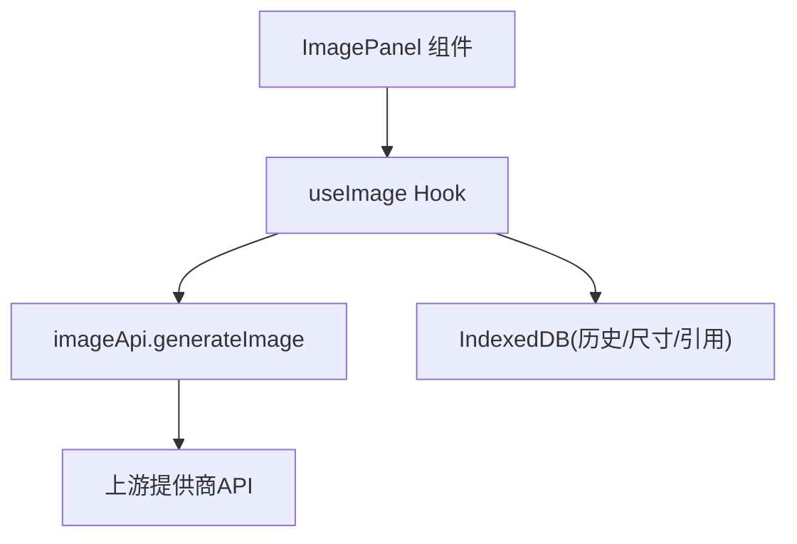
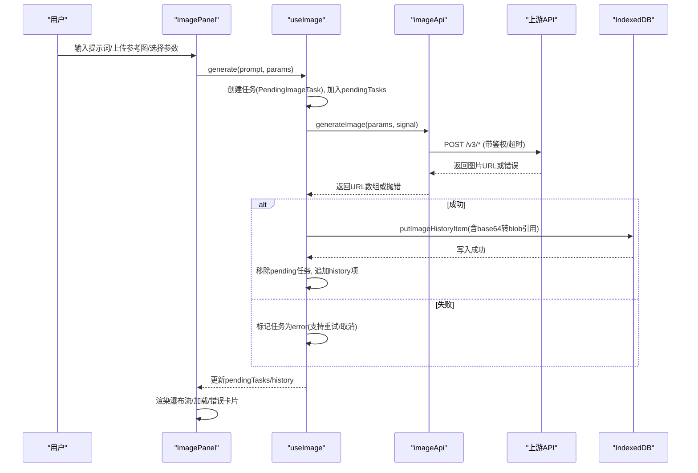
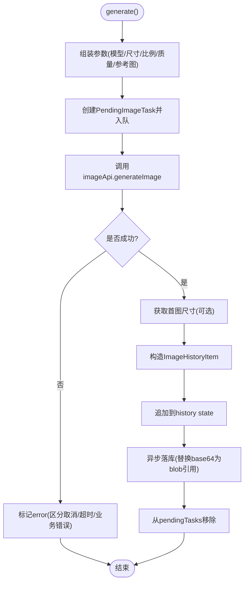
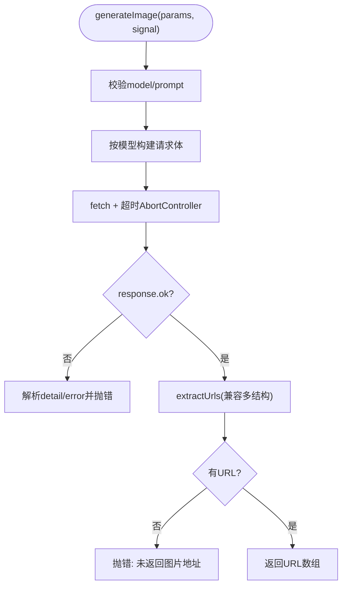
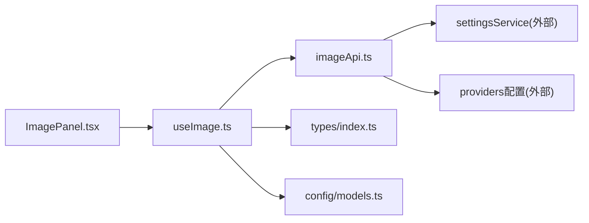

# 图像状态管理

<cite>
**本文引用的文件**
- [useImage.ts](file://src/hooks/useImage.ts)
- [imageApi.ts](file://src/services/imageApi.ts)
- [ImagePanel.tsx](file://src/components/image/ImagePanel.tsx)
- [index.ts](file://src/types/index.ts)
- [models.ts](file://src/config/models.ts)
</cite>

## 目录
1. [简介](#简介)
2. [项目结构](#项目结构)
3. [核心组件](#核心组件)
4. [架构总览](#架构总览)
5. [详细组件分析](#详细组件分析)
6. [依赖关系分析](#依赖关系分析)
7. [性能考量](#性能考量)
8. [故障排查指南](#故障排查指南)
9. [结论](#结论)
10. [附录](#附录)

## 简介
本文围绕 AIShop 的图像状态管理进行系统化文档化，重点解析 useImage Hook 的实现架构与数据流，涵盖任务队列、进度跟踪、错误处理、重试机制、并发控制、批量生成、以及历史持久化等。同时给出 PendingImageTask 与 ImageHistoryItem 的数据模型设计思路、使用场景与最佳实践，并说明与后端 API 集成的错误处理与恢复策略。

## 项目结构
图像功能由三层构成：
- 视图层：ImagePanel 负责用户交互（输入提示词、上传参考图、选择模型/尺寸/比例/质量）、渲染瀑布流照片墙、展示 Pending 任务卡片（加载中/错误）。
- 状态层：useImage Hook 集中管理模型选择、上传图片、参数派生、任务队列、历史记录、重试/取消/删除等能力。
- 服务层：imageApi 封装上游图片生成 API 的请求构建、超时控制、响应解析与错误统一抛出。

图表来源
- [ImagePanel.tsx:369-940](file://src/components/image/ImagePanel.tsx#L369-L940)
- [useImage.ts:123-469](file://src/hooks/useImage.ts#L123-L469)
- [imageApi.ts:149-243](file://src/services/imageApi.ts#L149-L243)

章节来源
- [ImagePanel.tsx:369-940](file://src/components/image/ImagePanel.tsx#L369-L940)
- [useImage.ts:123-469](file://src/hooks/useImage.ts#L123-L469)
- [imageApi.ts:149-243](file://src/services/imageApi.ts#L149-L243)

## 核心组件
- useImage Hook
  - 维护选中模型、上传图片数组、宽高比/尺寸/质量等参数，并提供 generate/retry/cancel/dismiss/delete/clear 等方法。
  - 通过 pendingTasks 实现任务队列与进度跟踪；通过 AbortController 实现任务取消与超时控制。
  - 成功时创建 ImageHistoryItem 并落库 IndexedDB，失败时标记为 error 并保留可重试。
- imageApi 服务
  - 根据模型映射到不同端点，构建请求体（区分文本生成与编辑模式），统一提取返回的图片 URL。
  - 内置 120s 超时与外部 signal 合并，区分“用户取消”和“超时”，并规范化错误消息。
- ImagePanel 组件
  - 提供拖拽上传、参考图预览、参数面板、发送按钮、瀑布流照片墙、Pending 任务卡片渲染。
  - 将 useImage 暴露的状态与方法绑定到 UI，完成端到端交互闭环。

章节来源
- [useImage.ts:123-469](file://src/hooks/useImage.ts#L123-L469)
- [imageApi.ts:149-243](file://src/services/imageApi.ts#L149-L243)
- [ImagePanel.tsx:369-940](file://src/components/image/ImagePanel.tsx#L369-L940)

## 架构总览
下图展示了从用户输入到结果展示的完整流程，包括任务入队、并发控制、API 调用、结果入库与 UI 更新。

图表来源
- [useImage.ts:275-356](file://src/hooks/useImage.ts#L275-L356)
- [imageApi.ts:149-243](file://src/services/imageApi.ts#L149-L243)
- [ImagePanel.tsx:703-731](file://src/components/image/ImagePanel.tsx#L703-L731)

## 详细组件分析

### useImage Hook：任务队列与生命周期
- 任务入队与执行
  - 每次 generate 会创建一个 PendingImageTask（id/prompt/model/params/status='loading'），追加到 pendingTasks 末尾，保证 UI 位置稳定。
  - 为每个任务分配独立 AbortController，并通过 Map 缓存以便取消。
- 并发控制
  - 当前实现以“多任务并行”为主：每次 generate 都会立即发起请求，未做全局并发上限限制。可通过引入令牌桶/信号量在 executeTask 前加锁实现限流。
- 进度与状态
  - loading：任务在队列中且正在请求。
  - error：请求异常或超时，保留 error 信息，支持重试。
  - 成功：从队列移除，构造 ImageHistoryItem 并追加到 history，随后异步落库。
- 错误处理与恢复
  - 区分 AbortError：若控制器已被移除则视为手动取消；否则视为超时，标记 error。
  - 其他错误：记录错误消息，允许重试。
- 历史与尺寸回填
  - 首次加载 history 后，对缺失 width/height 的条目尝试从 blob 引用或远程 URL 获取尺寸，并写回 IndexedDB，避免重复解码。
- 模型切换与参数派生
  - 切换模型时重置宽高比/尺寸/质量，并根据模型类型裁剪上传数量（GPT 单图，Google 多图）。
  - 提供 effectiveAspectRatio/effectiveSize 等派生值，防止无效选项导致 UI 抖动。

图表来源
- [useImage.ts:275-356](file://src/hooks/useImage.ts#L275-L356)
- [useImage.ts:152-194](file://src/hooks/useImage.ts#L152-L194)

章节来源
- [useImage.ts:123-469](file://src/hooks/useImage.ts#L123-L469)

### imageApi：请求构建、超时与错误统一
- 端点映射
  - 根据模型选择 text-to-image 或 edit 端点，拼接基础 URL。
- 请求体构建
  - GPT Image 2：编辑模式需将 base64 转为 data URI；非编辑模式仅传 prompt/size/quality/output_format/n。
  - Gemini 系列：编辑模式区分 image_urls 与 image_base64s；非编辑模式传入 aspect_ratio。
- 超时与取消
  - 内部 120s 超时；支持外部 AbortSignal 合并，区分“用户取消”与“超时”。
- 响应解析
  - 兼容多种上游响应结构，统一抽取图片 URL 列表；若无 URL 则抛错。
- 错误处理
  - 非 2xx：解析 detail/error.message，组合友好错误消息并抛出。
  - 网络异常：包装为统一错误。

图表来源
- [imageApi.ts:65-143](file://src/services/imageApi.ts#L65-L143)
- [imageApi.ts:149-243](file://src/services/imageApi.ts#L149-L243)

章节来源
- [imageApi.ts:149-243](file://src/services/imageApi.ts#L149-L243)

### ImagePanel：UI 与状态绑定
- 输入与上传
  - 支持拖拽外部图片/照片墙内图片作为参考图；限制最大上传数；超大文件拦截。
- 参数面板
  - 九宫格比例选择器、浮动尺寸/质量选择器，动态受模型影响。
- 瀑布流与任务卡片
  - 将 history 扁平化为 PhotoItem，与 pendingTasks 合并渲染；Pending 任务显示 LoadingCard/ErrorCard，支持取消/重试/关闭。
- 下载与删除
  - 下载时将 aishop-blob:<id> 转换为临时 object URL 并触发下载；删除历史项同步清理本地存储。

章节来源
- [ImagePanel.tsx:369-940](file://src/components/image/ImagePanel.tsx#L369-L940)

### 数据模型：PendingImageTask 与 ImageHistoryItem
- PendingImageTask
  - 字段：id、prompt、model、params、status('loading'|'error')、error、createdAt。
  - 用途：表示队列中的任务，承载重试所需的全部参数，便于失败后可原地重试。
- ImageHistoryItem
  - 字段：id、urls[]、prompt、model、timestamp、aspectRatio?、size?、quality?、sourceImages?、width?、height?、thumbnailUrl?。
  - 用途：持久化一次生成的结果及元信息；width/height 用于瀑布流占位计算，提升滚动体验。

章节来源
- [index.ts:177-214](file://src/types/index.ts#L177-L214)

## 依赖关系分析
- 模块耦合
  - ImagePanel 依赖 useImage 提供的状态与方法；useImage 依赖 imageApi 与 IndexedDB；imageApi 依赖配置与设置服务。
- 外部依赖
  - 上游提供商 API（OpenAI/Gemini）；浏览器原生能力（Canvas/Fetch/AbortController）。
- 潜在循环依赖
  - 当前无循环依赖；Hook 与服务解耦清晰。

图表来源
- [ImagePanel.tsx:369-940](file://src/components/image/ImagePanel.tsx#L369-L940)
- [useImage.ts:123-469](file://src/hooks/useImage.ts#L123-L469)
- [imageApi.ts:149-243](file://src/services/imageApi.ts#L149-L243)

章节来源
- [ImagePanel.tsx:369-940](file://src/components/image/ImagePanel.tsx#L369-L940)
- [useImage.ts:123-469](file://src/hooks/useImage.ts#L123-L469)
- [imageApi.ts:149-243](file://src/services/imageApi.ts#L149-L243)

## 性能考量
- 内存占用优化
  - 历史落库时将 base64 替换为 blob 引用，避免内存常驻大对象。
  - 首次启动时对缺失尺寸的条目增量回填，减少后续解码开销。
- 渲染性能
  - 瀑布流采用扁平化 PhotoItem 列表，结合宽高占位减少重排。
  - Pending 任务卡片与历史卡片分离渲染，避免阻塞。
- 网络与并发
  - 当前为多任务并行，建议在高并发场景引入并发上限（如最多 3 个并发请求），避免带宽/配额耗尽。
  - 120s 超时适合长耗时生成，可根据模型调整。
- I/O 优化
  - 历史写库采用“追加式”而非整体写回，降低频繁 state 变化带来的全量落盘压力。

[本节为通用性能建议，不直接分析具体代码行]

## 故障排查指南
- 常见错误定位
  - 未配置 API Key：imageApi 会抛出明确错误，需在设置中配置。
  - 不支持的模型：检查模型 ID 是否在映射表中。
  - 未返回图片地址：检查上游响应结构是否符合预期。
  - 请求超时：确认网络状况与上游负载，必要时延长超时或降级模型。
  - 用户取消：AbortError 会被识别为手动取消，不会污染历史。
- 恢复策略
  - 重试：Pending 任务保留原参数，点击重试即可重新发起。
  - 取消：通过 AbortController 中断进行中请求，释放资源。
  - 历史清理：支持单条删除与清空，确保脏数据及时清理。
- 调试建议
  - 关注控制台日志：useImage 与 imageApi 的错误日志包含上下文信息。
  - 检查 IndexedDB：确认历史与 blob 引用是否正确写入。
  - 监控网络：查看请求头 Authorization 与请求体是否合规。

章节来源
- [imageApi.ts:149-243](file://src/services/imageApi.ts#L149-L243)
- [useImage.ts:336-356](file://src/hooks/useImage.ts#L336-L356)

## 结论
useImage Hook 以简洁而强大的方式实现了图像生成的状态管理：通过任务队列与 AbortController 实现并发与取消，通过 IndexedDB 持久化历史与尺寸，配合 imageApi 的统一错误处理与超时控制，形成稳定的端到端流程。建议在大规模使用时引入并发限制与更细粒度的重试策略，进一步提升鲁棒性与用户体验。

## 附录
- 模型与参数
  - 支持的图像模型与默认参数在配置中定义，切换模型时自动重置相关参数。
- 最佳实践
  - 合理设置并发上限，避免资源争用。
  - 利用有效参数派生（effectiveAspectRatio/effectiveSize）避免无效选项。
  - 优先使用 blob 引用存储大图，减少内存压力。
  - 对用户可见的错误提供重试入口，提升容错性。

[本节为总结性内容，不直接分析具体代码行]