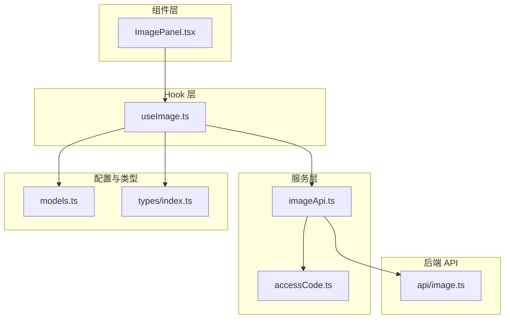
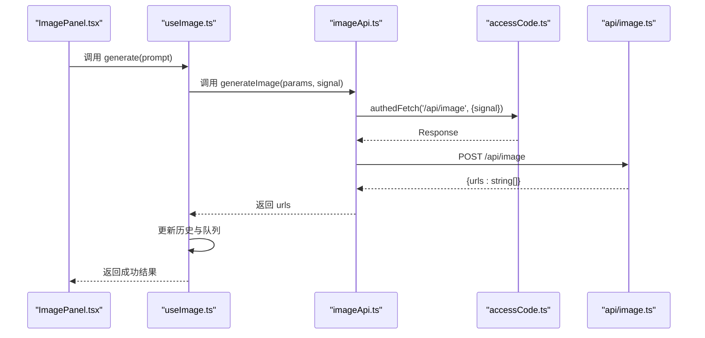
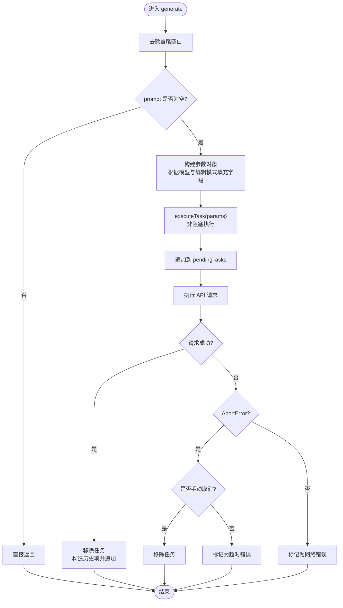
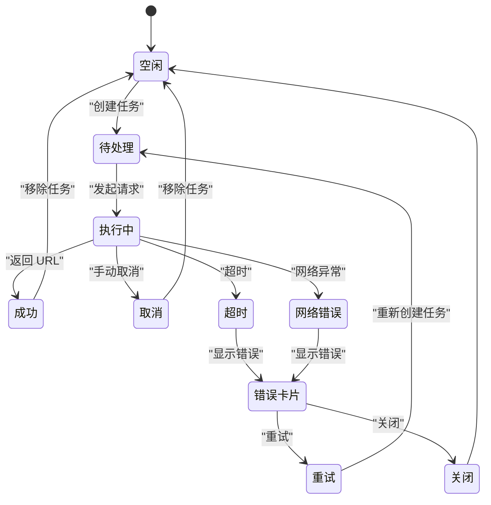
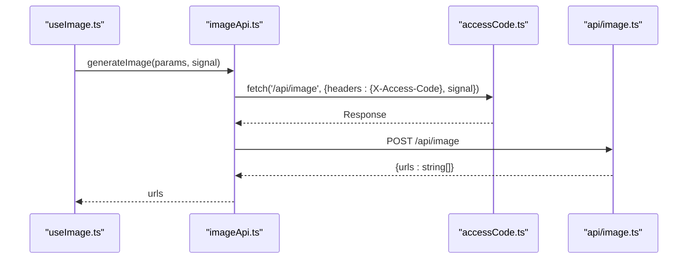
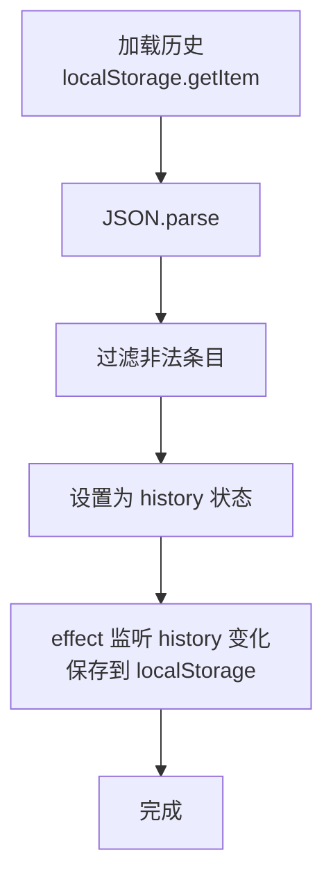
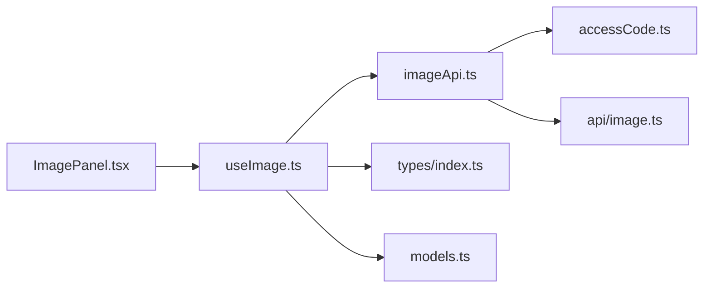

# 图像状态管理

<cite>
**本文引用的文件**
- [useImage.ts](file://src/hooks/useImage.ts)
- [imageApi.ts](file://src/services/imageApi.ts)
- [ImagePanel.tsx](file://src/components/image/ImagePanel.tsx)
- [image.ts](file://api/image.ts)
- [models.ts](file://src/config/models.ts)
- [index.ts](file://src/types/index.ts)
- [accessCode.ts](file://src/services/accessCode.ts)
- [verify.ts](file://api/verify.ts)
</cite>

## 目录
1. [简介](#简介)
2. [项目结构](#项目结构)
3. [核心组件](#核心组件)
4. [架构总览](#架构总览)
5. [详细组件分析](#详细组件分析)
6. [依赖关系分析](#依赖关系分析)
7. [性能考量](#性能考量)
8. [故障排查指南](#故障排查指南)
9. [结论](#结论)
10. [附录](#附录)

## 简介
本文件围绕图像状态管理 Hook useImage 的设计与实现展开，系统性阐述其状态初始化、任务队列管理、进度跟踪机制、图像生成流程的状态转换、与 API 服务层的交互方式、历史记录管理与持久化策略，并给出最佳实践与性能优化建议。目标读者既包括前端开发者，也包括对技术细节感兴趣的产品与运营人员。

## 项目结构
本项目采用“组件 + Hook + 服务层 + 类型定义 + 配置”的分层组织方式：
- 组件层：负责 UI 展示与用户交互，如图像面板组件。
- Hook 层：封装业务状态与副作用，如 useImage。
- 服务层：封装网络请求与鉴权，如 imageApi、accessCode。
- 类型定义：统一的数据结构与接口约束，如 ImageGenerationParams、ImageHistoryItem、PendingImageTask。
- 配置层：模型与参数选项，如 IMAGE_MODELS、尺寸与比例等。

图表来源
- [ImagePanel.tsx:63-90](file://src/components/image/ImagePanel.tsx#L63-L90)
- [useImage.ts:128-392](file://src/hooks/useImage.ts#L128-L392)
- [imageApi.ts:8-40](file://src/services/imageApi.ts#L8-L40)
- [accessCode.ts:37-57](file://src/services/accessCode.ts#L37-L57)
- [image.ts:104-309](file://api/image.ts#L104-L309)
- [models.ts:181-215](file://src/config/models.ts#L181-L215)
- [index.ts:68-102](file://src/types/index.ts#L68-L102)

章节来源
- [useImage.ts:128-392](file://src/hooks/useImage.ts#L128-L392)
- [ImagePanel.tsx:63-90](file://src/components/image/ImagePanel.tsx#L63-L90)
- [imageApi.ts:8-40](file://src/services/imageApi.ts#L8-L40)
- [image.ts:104-309](file://api/image.ts#L104-L309)
- [models.ts:181-215](file://src/config/models.ts#L181-L215)
- [index.ts:68-102](file://src/types/index.ts#L68-L102)
- [accessCode.ts:37-57](file://src/services/accessCode.ts#L37-L57)

## 核心组件
本节聚焦 useImage Hook 的职责边界与关键能力：
- 状态初始化：模型选择、历史记录、上传图片、参数（宽高比、尺寸、质量）、并发任务队列。
- 任务队列管理：追加任务、取消任务、重试任务、错误卡片关闭。
- 进度跟踪：loading 动画、错误提示、成功后历史项追加。
- 与服务层交互：通过 imageApi 发起请求，携带 AbortController 信号与超时控制。
- 历史记录管理：localStorage 持久化、历史项结构扩展、删除与清空操作。
- 参数派生与有效性：根据模型与编辑模式动态计算可用选项与有效值，避免脏值。

章节来源
- [useImage.ts:128-392](file://src/hooks/useImage.ts#L128-L392)
- [index.ts:68-102](file://src/types/index.ts#L68-L102)

## 架构总览
useImage 作为状态中心，协调组件层与服务层之间的数据流与控制流。其核心交互如下：

图表来源
- [ImagePanel.tsx:134-142](file://src/components/image/ImagePanel.tsx#L134-L142)
- [useImage.ts:289-317](file://src/hooks/useImage.ts#L289-L317)
- [imageApi.ts:8-40](file://src/services/imageApi.ts#L8-L40)
- [accessCode.ts:37-57](file://src/services/accessCode.ts#L37-L57)
- [image.ts:104-309](file://api/image.ts#L104-L309)

## 详细组件分析

### useImage Hook 设计与实现
- 状态初始化
  - 模型选择与默认参数：从 localStorage 加载上次模型，否则使用首个可用模型；根据模型设置默认宽高比与尺寸。
  - 历史记录：从 localStorage 初始化，过滤非法条目，保证类型安全。
  - 上传图片：基于文件压缩与数量上限，确保编辑模式下的参考图数量不超过模型允许的最大值。
- 任务队列管理
  - PendingImageTask：包含任务 ID、参数副本、状态（loading/error）、创建时间等。
  - 控制器映射：使用 Map 存储每个任务对应的 AbortController，配合 55 秒超时。
  - 非阻塞执行：generate 不 await，直接触发 executeTask，实现并发队列。
- 进度跟踪机制
  - loading 卡片：追加到历史末尾，避免挤占已有图片位置。
  - 错误处理：区分超时与手动取消；超时显示“请求超时，请稍后重试”，手动取消直接移除。
  - 成功回调：从队列移除任务，构造历史项并追加到末尾。
- 与 API 服务层交互
  - generateImage：封装 authedFetch，统一错误消息格式，返回图片 URL 数组。
  - 超时与取消：AbortController + setTimeout，确保资源释放与 UI 一致性。
- 历史记录管理
  - localStorage：键名固定，保存与加载均做健壮性检查。
  - 结构扩展：历史项包含模型、尺寸、宽高比、质量、源图数量等元信息，便于展示与检索。
  - 删除与清空：支持单项删除与批量清空。

图表来源
- [useImage.ts:289-317](file://src/hooks/useImage.ts#L289-L317)
- [useImage.ts:228-286](file://src/hooks/useImage.ts#L228-L286)
- [imageApi.ts:8-40](file://src/services/imageApi.ts#L8-L40)

章节来源
- [useImage.ts:128-392](file://src/hooks/useImage.ts#L128-L392)
- [imageApi.ts:8-40](file://src/services/imageApi.ts#L8-L40)

### 图像生成流程的状态转换
- 任务创建：generate 触发 executeTask，生成唯一任务 ID，状态设为 loading，加入队列。
- 任务执行：调用 generateImage，携带 AbortController 信号与 55 秒超时。
- 任务完成：成功返回 URL 数组，移除队列项，构造历史项并追加。
- 任务取消：手动取消时先删除控制器映射，再 abort，最后从队列移除。
- 任务错误：区分超时与网络错误，分别更新状态与错误信息。

图表来源
- [useImage.ts:228-286](file://src/hooks/useImage.ts#L228-L286)
- [useImage.ts:319-342](file://src/hooks/useImage.ts#L319-L342)

章节来源
- [useImage.ts:228-286](file://src/hooks/useImage.ts#L228-L286)
- [useImage.ts:319-342](file://src/hooks/useImage.ts#L319-L342)

### 与 API 服务层的交互
- 请求发送：imageApi.generateImage 使用 authedFetch，自动注入访问码头，支持 AbortSignal。
- 响应处理：统一解析响应体，提取 URL 数组；对上游错误进行透传与格式化。
- 错误捕获：区分网络异常、上游错误、空结果等场景，抛出可读错误信息。

图表来源
- [imageApi.ts:8-40](file://src/services/imageApi.ts#L8-L40)
- [accessCode.ts:37-57](file://src/services/accessCode.ts#L37-L57)
- [image.ts:104-309](file://api/image.ts#L104-L309)

章节来源
- [imageApi.ts:8-40](file://src/services/imageApi.ts#L8-L40)
- [accessCode.ts:37-57](file://src/services/accessCode.ts#L37-L57)
- [image.ts:104-309](file://api/image.ts#L104-L309)

### 历史记录管理机制
- 数据持久化：localStorage 键名固定，保存历史数组；加载时进行类型校验与过滤。
- 缓存策略：组件卸载时清理所有 AbortController，避免悬挂请求；历史项结构扩展，便于后续检索与统计。
- 内存优化：压缩上传图片为 base64，限制最大边长与质量；限制最大上传数量，防止内存膨胀。

图表来源
- [useImage.ts:56-82](file://src/hooks/useImage.ts#L56-L82)
- [useImage.ts:144-147](file://src/hooks/useImage.ts#L144-L147)

章节来源
- [useImage.ts:56-82](file://src/hooks/useImage.ts#L56-L82)
- [useImage.ts:144-147](file://src/hooks/useImage.ts#L144-L147)

### 参数派生与有效性
- 模型适配：根据模型类型动态计算宽高比、尺寸、质量等选项集合。
- 有效值回退：若当前选择不在可用选项内，自动回落到第一个选项，避免脏值。
- 编辑模式：当存在上传图片时，编辑模式启用更丰富的参数组合。

章节来源
- [useImage.ts:158-226](file://src/hooks/useImage.ts#L158-L226)
- [models.ts:181-215](file://src/config/models.ts#L181-L215)

## 依赖关系分析
- 组件依赖 Hook：ImagePanel 通过 useImage 获取状态与动作，解耦 UI 与业务逻辑。
- Hook 依赖服务层：useImage 依赖 imageApi，后者依赖 accessCode 实现鉴权与错误传播。
- 服务层依赖后端 API：imageApi 调用 /api/image，由 api/image.ts 实现代理与上游对接。
- 类型与配置：useImage 依赖 types 定义的参数与历史项结构，依赖 models 提供的模型与参数选项。

图表来源
- [ImagePanel.tsx:63-90](file://src/components/image/ImagePanel.tsx#L63-L90)
- [useImage.ts:128-392](file://src/hooks/useImage.ts#L128-L392)
- [imageApi.ts:8-40](file://src/services/imageApi.ts#L8-L40)
- [accessCode.ts:37-57](file://src/services/accessCode.ts#L37-L57)
- [image.ts:104-309](file://api/image.ts#L104-L309)
- [index.ts:68-102](file://src/types/index.ts#L68-L102)
- [models.ts:181-215](file://src/config/models.ts#L181-L215)

章节来源
- [ImagePanel.tsx:63-90](file://src/components/image/ImagePanel.tsx#L63-L90)
- [useImage.ts:128-392](file://src/hooks/useImage.ts#L128-L392)
- [imageApi.ts:8-40](file://src/services/imageApi.ts#L8-L40)
- [accessCode.ts:37-57](file://src/services/accessCode.ts#L37-L57)
- [image.ts:104-309](file://api/image.ts#L104-L309)
- [index.ts:68-102](file://src/types/index.ts#L68-L102)
- [models.ts:181-215](file://src/config/models.ts#L181-L215)

## 性能考量
- 并发与超时：每个任务独立的 AbortController 与 55 秒超时，避免长时间占用资源；非阻塞执行提升用户体验。
- 内存优化：上传图片压缩、最大边长与质量控制、最大上传数量限制，降低内存峰值。
- UI 体验：loading 卡片追加到末尾，避免布局抖动；错误卡片提供重试与关闭按钮，减少无效重试。
- 服务端超时：后端 API 设置最大执行时长，避免长时间连接占用。
- 鉴权与限速：服务端统一鉴权与限速，结合前端探测与事件广播，提升整体稳定性。

章节来源
- [useImage.ts:228-286](file://src/hooks/useImage.ts#L228-L286)
- [useImage.ts:169-200](file://src/hooks/useImage.ts#L169-L200)
- [image.ts:17-26](file://api/image.ts#L17-L26)

## 故障排查指南
- 生成失败
  - 检查后端响应：确认 /api/image 返回的 JSON 结构与 URL 数组。
  - 检查上游错误：查看后端日志与错误透传信息，定位上游接口问题。
  - 检查鉴权：确认 X-Access-Code 是否正确，必要时清除本地存储并重新验证。
- 超时与取消
  - 超时：确认 55 秒超时设置与网络状况；适当调整前端超时或后端执行时长。
  - 取消：确认是否手动取消；检查控制器映射与状态更新逻辑。
- 历史记录异常
  - 检查 localStorage 数据格式与完整性；必要时清理异常条目。
- 参数无效
  - 确认模型与编辑模式下的参数集合；检查有效值回退逻辑。

章节来源
- [imageApi.ts:19-40](file://src/services/imageApi.ts#L19-L40)
- [image.ts:256-309](file://api/image.ts#L256-L309)
- [accessCode.ts:37-57](file://src/services/accessCode.ts#L37-L57)
- [useImage.ts:56-82](file://src/hooks/useImage.ts#L56-L82)

## 结论
useImage Hook 通过清晰的状态划分、健壮的任务队列与错误处理、与服务层的紧密协作，实现了稳定高效的图像生成体验。其参数派生与有效性保障、历史记录持久化与内存优化策略，共同构成了可维护、可扩展的状态管理体系。建议在实际部署中结合监控与日志，持续优化超时与限速策略，进一步提升稳定性与用户体验。

## 附录
- 关键流程路径
  - 生成流程：[useImage.ts:289-317](file://src/hooks/useImage.ts#L289-L317) → [imageApi.ts:8-40](file://src/services/imageApi.ts#L8-L40) → [image.ts:104-309](file://api/image.ts#L104-L309)
  - 任务队列：[useImage.ts:228-286](file://src/hooks/useImage.ts#L228-L286)
  - 历史记录：[useImage.ts:56-82](file://src/hooks/useImage.ts#L56-L82)
- 类型定义
  - 参数与历史项：[index.ts:68-102](file://src/types/index.ts#L68-L102)
- 模型配置
  - 图像模型与参数：[models.ts:181-215](file://src/config/models.ts#L181-L215)