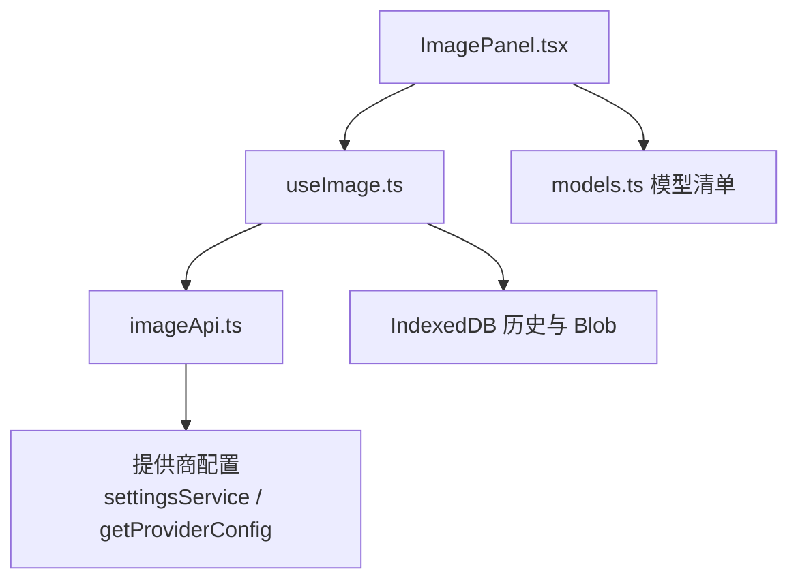
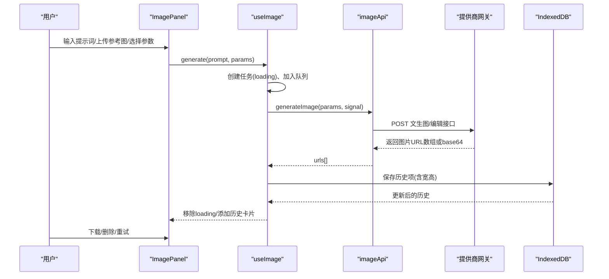
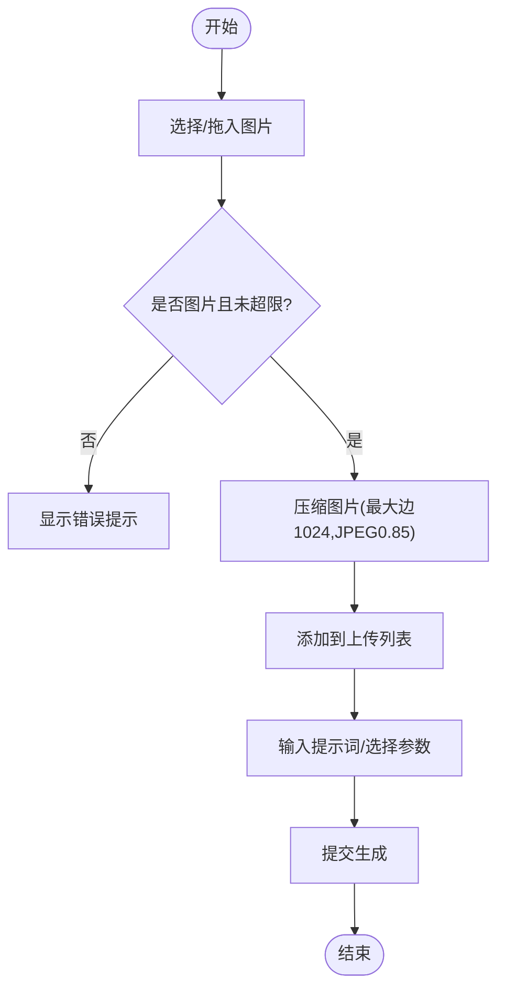
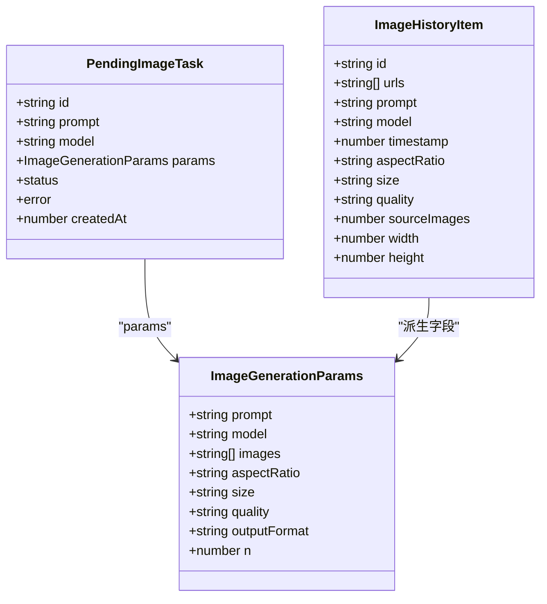
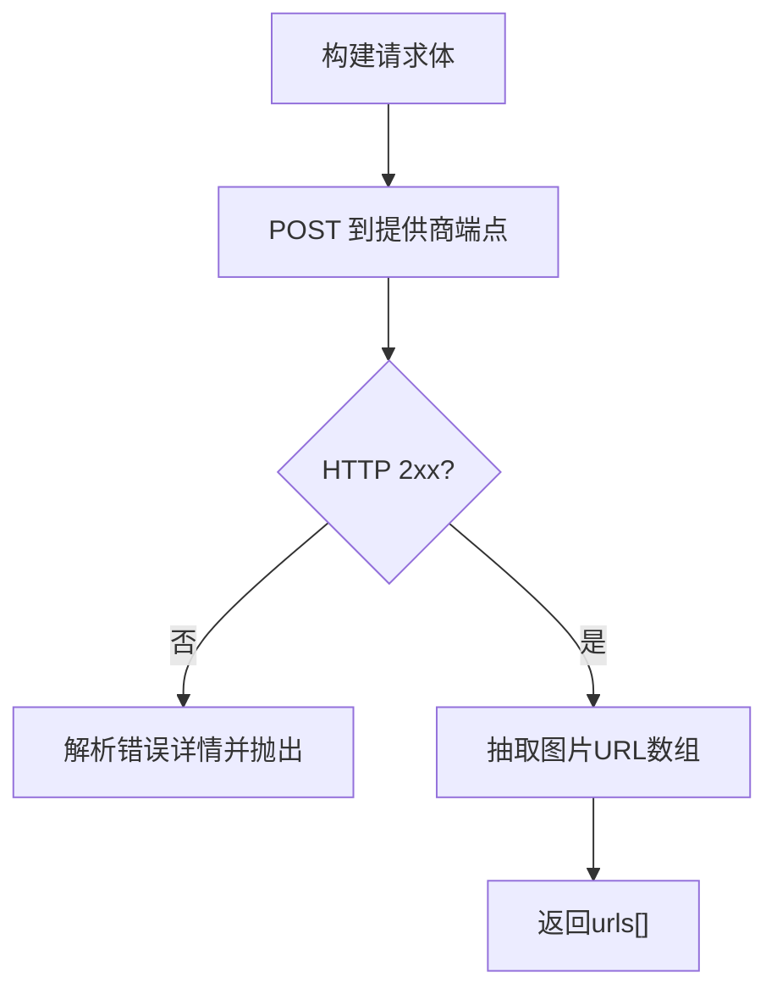
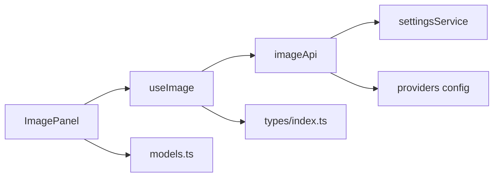

# 图像生成功能

<cite>
**本文引用的文件**
- [ImagePanel.tsx](file://src/components/image/ImagePanel.tsx)
- [useImage.ts](file://src/hooks/useImage.ts)
- [imageApi.ts](file://src/services/imageApi.ts)
- [models.ts](file://src/config/models.ts)
- [index.ts](file://src/types/index.ts)
- [reference-gpt-image-2-text-to-image.md](file://ImageGenAPI/reference-gpt-image-2-text-to-image.md)
- [reference-gpt-image-2-edit.md](file://ImageGenAPI/reference-gpt-image-2-edit.md)
- [reference-gemini-3.1-flash-image-text-to-image.md](file://ImageGenAPI/reference-gemini-3.1-flash-image-text-to-image.md)
- [reference-gemini-3.1-flash-image-edit.md](file://ImageGenAPI/reference-gemini-3.1-flash-image-edit.md)
</cite>

## 目录
1. [简介](#简介)
2. [项目结构](#项目结构)
3. [核心组件](#核心组件)
4. [架构总览](#架构总览)
5. [详细组件分析](#详细组件分析)
6. [依赖关系分析](#依赖关系分析)
7. [性能考虑](#性能考虑)
8. [故障排查指南](#故障排查指南)
9. [结论](#结论)
10. [附录：工作流与配置示例](#附录工作流与配置示例)

## 简介
本章节面向 AIShop 的“图像生成”能力，系统性说明前端图像面板、任务队列与进度跟踪、服务层 API 调用、模型集成（GPT Image 2、Gemini 3.1 Flash/Pro）以及性能优化与错误处理策略。文档同时提供端到端的工作流示例和自定义模型配置方法，帮助开发者快速理解并扩展该功能。

## 项目结构
图像生成功能由三层构成：
- 界面层：ImagePanel 负责用户交互、参数配置、图片上传与展示、历史记录瀑布流渲染。
- 状态与流程层：useImage Hook 管理模型选择、参数派生、并发任务队列、历史持久化与进度跟踪。
- 服务层：imageApi 统一封装不同模型的文本到图像与图像编辑请求，解析多种上游响应格式。

图表来源
- [ImagePanel.tsx:369-777](file://src/components/image/ImagePanel.tsx#L369-L777)
- [useImage.ts:123-468](file://src/hooks/useImage.ts#L123-L468)
- [imageApi.ts:149-243](file://src/services/imageApi.ts#L149-L243)
- [models.ts:237-271](file://src/config/models.ts#L237-L271)

章节来源
- [ImagePanel.tsx:369-777](file://src/components/image/ImagePanel.tsx#L369-L777)
- [useImage.ts:123-468](file://src/hooks/useImage.ts#L123-L468)
- [imageApi.ts:149-243](file://src/services/imageApi.ts#L149-L243)
- [models.ts:237-271](file://src/config/models.ts#L237-L271)

## 核心组件
- ImagePanel：提供提示词输入、参考图拖拽/上传、比例/尺寸/质量等参数选择、瀑布流照片墙、下载与删除历史、错误与加载卡片展示。
- useImage：维护选中模型、上传图片列表、宽高比/尺寸/质量等参数；实现并发任务队列、AbortController 取消、重试与失败态管理；将结果写入 IndexedDB 并回填宽高用于瀑布流布局。
- imageApi：根据模型映射到对应端点，构建请求体（支持 GPT Image 2 与 Gemini 系列），发起带超时与合并取消信号的 fetch 请求，统一抽取图片 URL。

章节来源
- [ImagePanel.tsx:369-777](file://src/components/image/ImagePanel.tsx#L369-L777)
- [useImage.ts:123-468](file://src/hooks/useImage.ts#L123-L468)
- [imageApi.ts:149-243](file://src/services/imageApi.ts#L149-L243)

## 架构总览
下图展示了从用户操作到最终落库的完整链路，包括并发任务、取消与超时控制、多模型适配与响应解析。

图表来源
- [ImagePanel.tsx:603-635](file://src/components/image/ImagePanel.tsx#L603-L635)
- [useImage.ts:275-356](file://src/hooks/useImage.ts#L275-L356)
- [imageApi.ts:149-243](file://src/services/imageApi.ts#L149-L243)

## 详细组件分析

### ImagePanel 图像面板
- 参数配置
  - 模型选择：通过 ModelSelector 切换 IMAGE_MODELS 中的模型，影响可用比例、尺寸、质量选项与最大上传数。
  - 宽高比：Google 模型支持多比例（如 1:1、16:9、9:16 等），GPT 模型使用 auto。
  - 尺寸：GPT 支持具体像素尺寸（如 1024x1024、2048x2048），Google 支持 0.5K/1K/2K/4K。
  - 质量：仅 GPT 模型暴露 low/medium/high。
- 图片上传与参考图
  - 支持点击选择与拖拽上传，限制单文件大小上限，过滤非图片类型，达到模型最大上传数量时截断。
  - 内部 URL 拖拽（照片墙中已生成的图片）可转为 File 作为参考图。
  - 上传前对图片进行压缩（最大边长 1024px，JPEG 0.85），减少传输体积。
- 历史记录与瀑布流
  - 使用 MasonryPhotoWall 渲染历史与 pending 任务卡片，按 urls 展开为扁平卡片，支持下载与删除。
  - 首次加载会尝试补齐缺失的宽高信息，优先从 Blob 记录读取，避免重复解码。
- 下载与存储
  - 下载时若为 aishop-blob 协议，先取 Blob 再创建临时 object URL，完成后延迟撤销释放内存。
- 错误与提示
  - 上传错误、拖拽不支持内容、网络异常等均有明确提示与关闭按钮。

图表来源
- [ImagePanel.tsx:438-571](file://src/components/image/ImagePanel.tsx#L438-L571)
- [useImage.ts:84-120](file://src/hooks/useImage.ts#L84-L120)

章节来源
- [ImagePanel.tsx:369-777](file://src/components/image/ImagePanel.tsx#L369-L777)
- [useImage.ts:84-120](file://src/hooks/useImage.ts#L84-L120)

### useImage Hook：任务队列与进度跟踪
- 模型与参数派生
  - 根据模型自动设置默认宽高比、尺寸、质量，并限制最大上传数（GPT 1 张，Google 最多 14 张）。
  - 有效值会在选项变化时回落到首个合法值，避免脏值。
- 并发任务队列
  - 每次 generate 创建唯一 taskId，加入 pendingTasks 队列，状态为 loading。
  - 每个任务持有独立 AbortController，支持手动取消与超时取消。
  - 成功后去重并截取 n 个 URL，计算首图宽高后写入历史并落库，再从队列移除。
  - 失败时标记 error，支持重试与关闭错误卡片。
- 历史持久化
  - 启动时异步加载历史，并回填缺失宽高；新增或删除均定向写库，避免全量写盘。
- 取消与超时
  - 外部取消：通过 AbortSignal 中断请求，区分手动取消与超时。
  - 内部超时：imageApi 设置 120s 超时，超时报错并标记任务失败。

图表来源
- [index.ts:177-214](file://src/types/index.ts#L177-L214)
- [useImage.ts:275-356](file://src/hooks/useImage.ts#L275-L356)

章节来源
- [useImage.ts:123-468](file://src/hooks/useImage.ts#L123-L468)
- [index.ts:177-214](file://src/types/index.ts#L177-L214)

### imageApi 服务层：多模型 API 调用
- 端点映射
  - 根据模型 ID 映射到对应的文本到图像与编辑端点路径。
- 请求体构建
  - GPT Image 2：编辑模式需传入 base64 或 URL，base64 必须带 data URI 前缀；支持 n、size、quality、output_format。
  - Gemini 系列：编辑模式支持 image_urls 与 image_base64s 混合，总数不超过 14；支持 aspect_ratio、size、output_format。
- 响应解析
  - 兼容 Gemini 的 image_urls 数组与 GPT 的 images/data 数组，自动将 b64_json 转换为 data URI。
- 超时与取消
  - 内置 120s 超时；支持外部 AbortSignal 与内部超时信号合并，区分“请求已取消”与“上游超时”。
- 错误处理
  - 非 2xx 响应时解析 detail/error.message，拼接友好错误消息抛出。

图表来源
- [imageApi.ts:66-143](file://src/services/imageApi.ts#L66-L143)
- [imageApi.ts:149-243](file://src/services/imageApi.ts#L149-L243)

章节来源
- [imageApi.ts:149-243](file://src/services/imageApi.ts#L149-L243)
- [imageApi.ts:66-143](file://src/services/imageApi.ts#L66-L143)

## 依赖关系分析
- 组件依赖
  - ImagePanel 依赖 useImage 提供的状态与方法，依赖 models.ts 的模型清单，依赖 PhotoCard/MasonryPhotoWall 进行渲染。
- Hook 依赖
  - useImage 依赖 types 定义的数据结构，依赖 imageApi 发起请求，依赖 IndexedDB 读写历史与 Blob。
- 服务层依赖
  - imageApi 依赖 settingsService 获取提供商与 API Key，依赖 providers 配置获取基础 URL，依赖模型端点映射。

图表来源
- [ImagePanel.tsx:369-777](file://src/components/image/ImagePanel.tsx#L369-L777)
- [useImage.ts:123-468](file://src/hooks/useImage.ts#L123-L468)
- [imageApi.ts:149-243](file://src/services/imageApi.ts#L149-L243)
- [models.ts:237-271](file://src/config/models.ts#L237-L271)
- [index.ts:177-214](file://src/types/index.ts#L177-L214)

章节来源
- [ImagePanel.tsx:369-777](file://src/components/image/ImagePanel.tsx#L369-L777)
- [useImage.ts:123-468](file://src/hooks/useImage.ts#L123-L468)
- [imageApi.ts:149-243](file://src/services/imageApi.ts#L149-L243)
- [models.ts:237-271](file://src/config/models.ts#L237-L271)
- [index.ts:177-214](file://src/types/index.ts#L177-L214)

## 性能考虑
- 图片压缩与传输
  - 上传时对图片进行压缩（最大边 1024px，JPEG 0.85），显著降低带宽占用与请求体大小。
- 瀑布流占位与渲染
  - 首次加载历史时回填宽高，优先从 Blob 记录读取，避免重复解码；未知宽高时 fallback 正方形占位，提升首屏体验。
- 并发与取消
  - 每个任务独立 AbortController，支持用户主动取消；imageApi 内置 120s 超时，防止长时间挂起。
- 存储与内存
  - 历史落库后将 base64 替换为 blob 引用，避免内存常驻大对象；下载时使用临时 object URL 并及时撤销。
- 批量生成
  - 当前 generate 固定 n=1，可通过扩展 useImage 与 imageApi 支持更大批量；注意上游限制与超时策略。

[本节为通用性能建议，不直接分析具体文件]

## 故障排查指南
- 未配置 API Key
  - 现象：调用 imageApi 直接报错提示需配置图片 API Key。
  - 处理：在设置中配置提供商与密钥。
- 请求超时
  - 现象：任务进入 error 状态，提示“请求超时，请稍后重试”。
  - 原因：imageApi 内置 120s 超时；上游服务繁忙或网络问题。
  - 处理：稍后重试或检查网络与提供商状态。
- 上游错误
  - 现象：非 2xx 响应，错误消息来自 detail 或 error.message。
  - 处理：查看上游返回的具体错误信息，调整参数或重试。
- 图片无法加载
  - 现象：拖拽远程 URL 失败或 CORS 限制。
  - 处理：确保跨域允许或使用本地数据；必要时改用 base64 上传。
- 下载失败
  - 现象：aishop-blob 协议无法直接下载。
  - 处理：系统会自动转换为临时 object URL 并延迟撤销；确认浏览器允许下载。

章节来源
- [imageApi.ts:149-243](file://src/services/imageApi.ts#L149-L243)
- [useImage.ts:275-356](file://src/hooks/useImage.ts#L275-L356)
- [ImagePanel.tsx:66-92](file://src/components/image/ImagePanel.tsx#L66-L92)

## 结论
AIShop 的图像生成功能通过清晰的分层设计实现了良好的可扩展性与用户体验：ImagePanel 提供直观的参数配置与瀑布流展示；useImage 以并发队列与进度跟踪保障稳定执行；imageApi 统一多模型 API 调用与响应解析。结合合理的压缩、缓存与错误处理策略，整体性能与健壮性得到保障。后续可按需扩展批量生成、更多模型接入与更丰富的编辑能力。

[本节为总结，不直接分析具体文件]

## 附录：工作流与配置示例

### 端到端工作流示例
- 文本到图像（GPT Image 2）
  - 选择模型 GPT Image 2，设置尺寸与质量，输入提示词，点击生成。
  - 流程：ImagePanel -> useImage.generate -> imageApi 调用 GPT 文生图端点 -> 解析 images/data -> 写入历史 -> 瀑布流展示。
- 图像编辑（Gemini 3.1 Flash）
  - 选择 Gemini 3.1 Flash，上传参考图（URL 或 base64），设置宽高比与尺寸，输入编辑提示词。
  - 流程：ImagePanel -> useImage.generate -> imageApi 构建 image_urls/image_base64s -> 调用 Gemini 编辑端点 -> 解析 image_urls -> 写入历史 -> 瀑布流展示。

章节来源
- [imageApi.ts:66-143](file://src/services/imageApi.ts#L66-L143)
- [reference-gpt-image-2-text-to-image.md:19-73](file://ImageGenAPI/reference-gpt-image-2-text-to-image.md#L19-L73)
- [reference-gemini-3.1-flash-image-edit.md:19-77](file://ImageGenAPI/reference-gemini-3.1-flash-image-edit.md#L19-L77)

### 模型配置方法
- 模型清单
  - 在 models.ts 的 IMAGE_MODELS 中声明模型 ID、名称、提供商与能力，供 ImagePanel 与 useImage 使用。
- 端点映射
  - 在 imageApi.ts 的 IMAGE_ENDPOINTS 中为模型添加 textToImage 与 edit 端点路径。
- 提供商配置
  - 通过 settingsService 与 getProviderConfig 获取 imageBaseUrl 与 API Key，确保请求可正确路由与鉴权。

章节来源
- [models.ts:237-271](file://src/config/models.ts#L237-L271)
- [imageApi.ts:6-19](file://src/services/imageApi.ts#L6-L19)
- [imageApi.ts:149-160](file://src/services/imageApi.ts#L149-L160)

### 关键 API 参考摘要
- GPT Image 2 文生图
  - 请求头：Content-Type application/json，Authorization Bearer {API Key}
  - 请求体关键字段：prompt、n、size、quality、output_format
  - 响应：images 数组包含图片 URL
- GPT Image 2 图像编辑
  - 请求体关键字段：image（URL/base64）、prompt、mask（可选）、size、quality、output_format
  - 响应：images 数组
- Gemini 3.1 Flash 文生图
  - 请求体关键字段：prompt、size、aspect_ratio、output_format
  - 响应：image_urls 数组
- Gemini 3.1 Flash 图像编辑
  - 请求体关键字段：prompt、image_urls 与/或 image_base64s（总数≤14）、size、aspect_ratio、output_format
  - 响应：image_urls 数组

章节来源
- [reference-gpt-image-2-text-to-image.md:9-73](file://ImageGenAPI/reference-gpt-image-2-text-to-image.md#L9-L73)
- [reference-gpt-image-2-edit.md:9-69](file://ImageGenAPI/reference-gpt-image-2-edit.md#L9-L69)
- [reference-gemini-3.1-flash-image-text-to-image.md:9-65](file://ImageGenAPI/reference-gemini-3.1-flash-image-text-to-image.md#L9-L65)
- [reference-gemini-3.1-flash-image-edit.md:9-77](file://ImageGenAPI/reference-gemini-3.1-flash-image-edit.md#L9-L77)