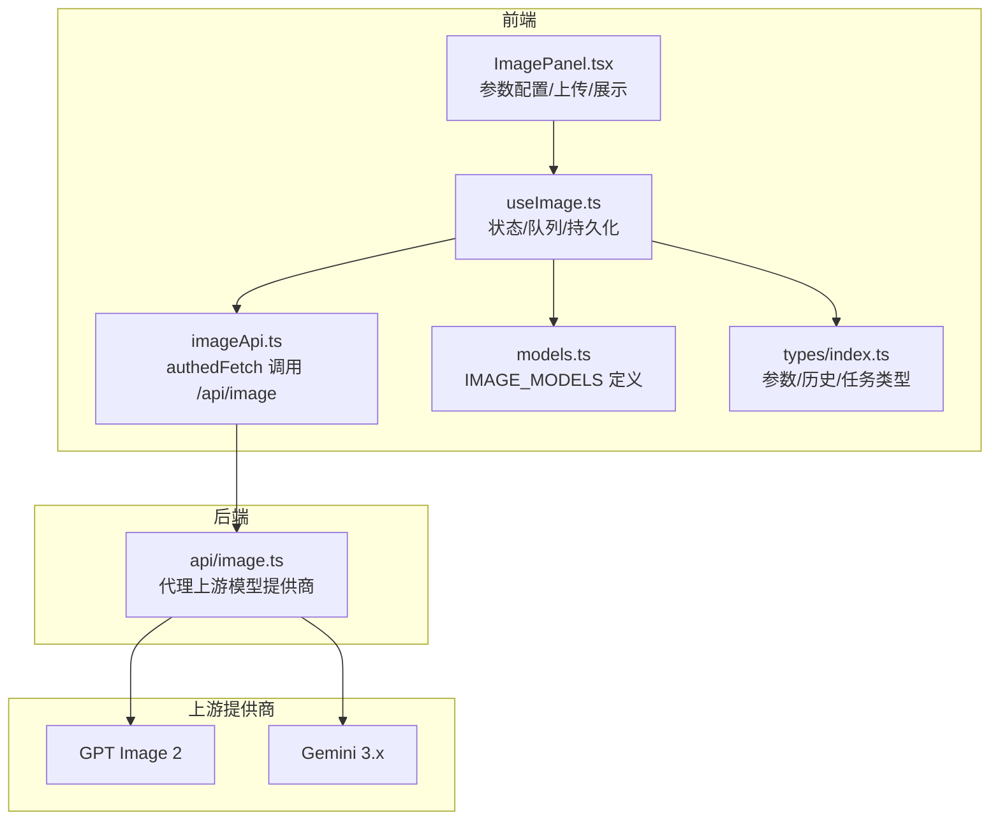
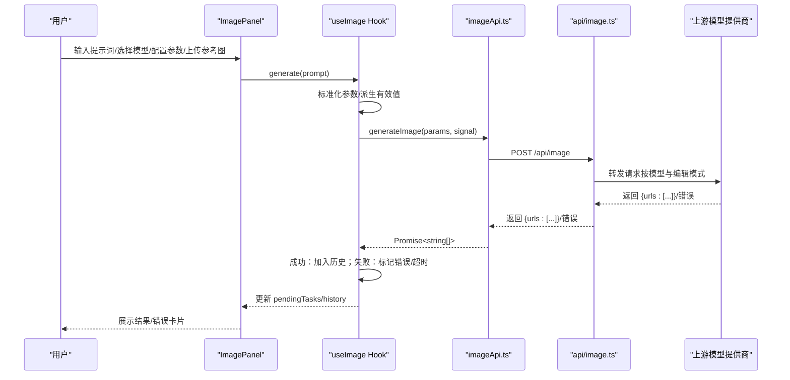
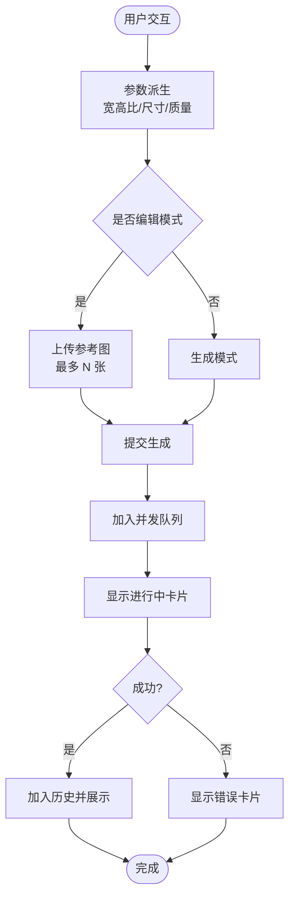
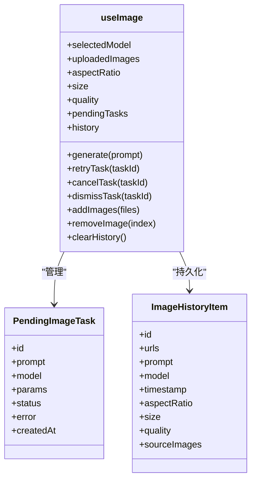
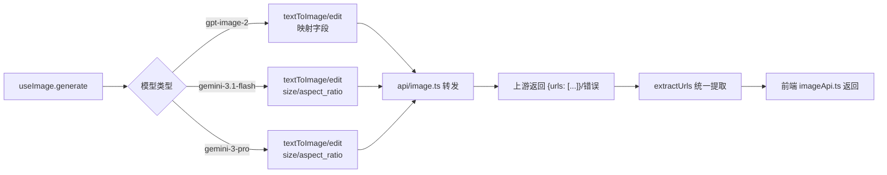
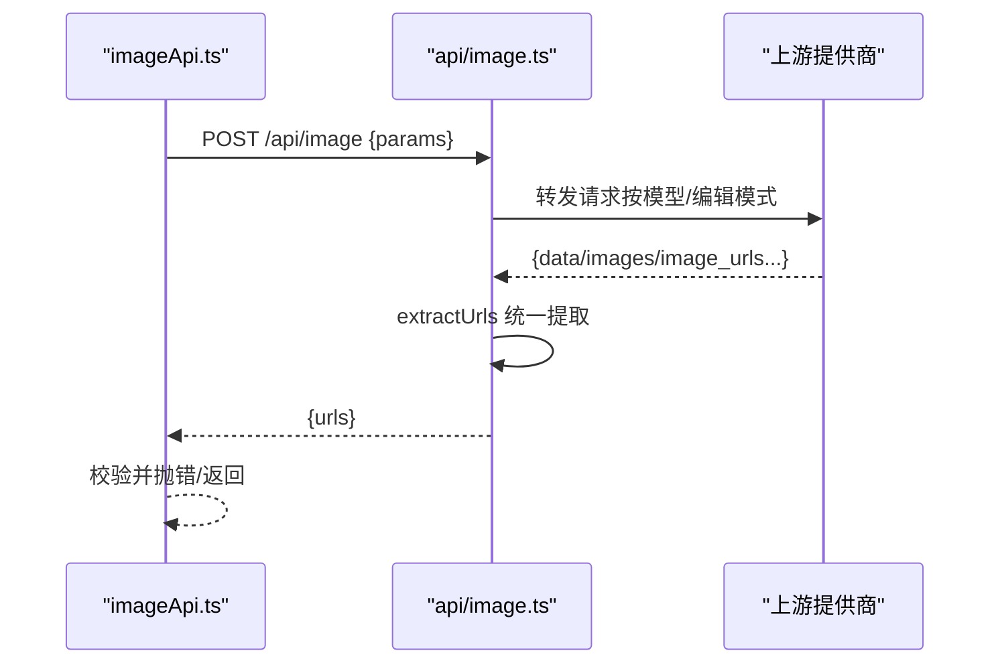
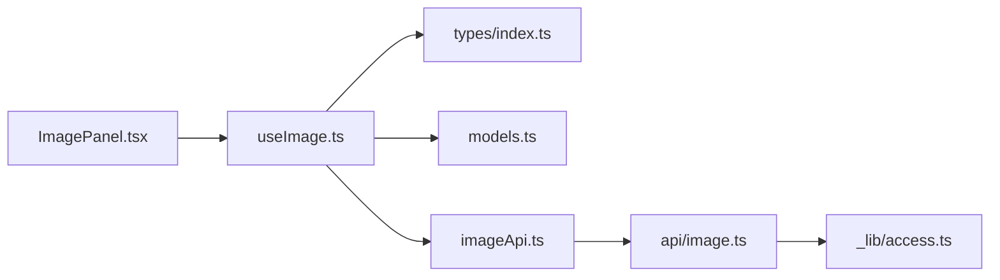

# 图像生成功能

<cite>
**本文引用的文件**
- [ImagePanel.tsx](file://src/components/image/ImagePanel.tsx)
- [useImage.ts](file://src/hooks/useImage.ts)
- [image.ts](file://api/image.ts)
- [imageApi.ts](file://src/services/imageApi.ts)
- [models.ts](file://src/config/models.ts)
- [index.ts](file://src/types/index.ts)
- [storage.ts](file://src/services/storage.ts)
- [reference-gpt-image-2-text-to-image.md](file://ImageGenAPI/reference-gpt-image-2-text-to-image.md)
- [reference-gpt-image-2-edit.md](file://ImageGenAPI/reference-gpt-image-2-edit.md)
- [reference-gemini-3.1-flash-image-text-to-image.md](file://ImageGenAPI/reference-gemini-3.1-flash-image-text-to-image.md)
- [reference-gemini-3-pro-image-text-to-image.md](file://ImageGenAPI/reference-gemini-3-pro-image-text-to-image.md)
- [reference-gemini-3.1-flash-image-edit.md](file://ImageGenAPI/reference-gemini-3.1-flash-image-edit.md)
</cite>

## 目录
1. [简介](#简介)
2. [项目结构](#项目结构)
3. [核心组件](#核心组件)
4. [架构总览](#架构总览)
5. [详细组件分析](#详细组件分析)
6. [依赖关系分析](#依赖关系分析)
7. [性能考虑](#性能考虑)
8. [故障排查指南](#故障排查指南)
9. [结论](#结论)
10. [附录](#附录)

## 简介
本文件面向 AIShop 的图像生成功能，系统性梳理图像面板 ImagePanel 的设计与实现、参数配置界面、生成控制与结果展示；深入解释图像状态管理 Hook 的工作机制（任务队列、进度跟踪、错误处理）；阐述与不同 AI 模型提供商（GPT Image 2、Gemini 3.1 Flash、Gemini 3.1 Pro）的集成方式与 API 调用差异；说明分辨率、风格、质量等参数对生成结果的影响；提供完整的 API 调用示例与响应处理流程；解释批量生成、历史记录管理与文件下载的实现；最后给出性能优化建议与常见问题排查方法。

## 项目结构
图像生成功能主要由以下层次构成：
- UI 层：图像面板组件负责参数配置、上传参考图、输入提示词、展示历史与进行中的任务。
- Hook 层：useImage 负责状态管理、参数派生、并发队列、超时与错误处理、本地持久化。
- 服务层：前端通过 imageApi.ts 调用后端 /api/image；后端在 api/image.ts 中代理上游模型提供商接口。
- 配置层：models.ts 定义可用图像模型；types/index.ts 定义参数与历史项类型。
- 文档层：ImageGenAPI 下的各模型参考文档，明确上游 API 的请求体字段与响应结构。

**图表来源**
- [ImagePanel.tsx:63-434](file://src/components/image/ImagePanel.tsx#L63-L434)
- [useImage.ts:128-393](file://src/hooks/useImage.ts#L128-L393)
- [imageApi.ts:8-41](file://src/services/imageApi.ts#L8-L41)
- [image.ts:104-310](file://api/image.ts#L104-L310)
- [models.ts:181-215](file://src/config/models.ts#L181-L215)
- [index.ts:68-103](file://src/types/index.ts#L68-L103)

**章节来源**
- [ImagePanel.tsx:63-434](file://src/components/image/ImagePanel.tsx#L63-L434)
- [useImage.ts:128-393](file://src/hooks/useImage.ts#L128-L393)
- [imageApi.ts:8-41](file://src/services/imageApi.ts#L8-L41)
- [image.ts:104-310](file://api/image.ts#L104-L310)
- [models.ts:181-215](file://src/config/models.ts#L181-L215)
- [index.ts:68-103](file://src/types/index.ts#L68-L103)

## 核心组件
- 图像面板 ImagePanel：提供模型选择、参数配置（宽高比、尺寸、质量）、参考图上传、提示词输入、历史展示与进行中任务卡片、下载与删除操作。
- 图像状态管理 Hook useImage：封装参数派生、上传图片压缩与裁剪、并发任务队列、超时与错误处理、历史记录持久化。
- 后端代理 api/image.ts：根据模型与是否编辑模式选择上游 endpoint，统一封装请求体与响应提取，支持访问码校验与限流。
- 前端服务 imageApi.ts：封装 /api/image 的调用，统一错误处理与返回值校验。
- 模型配置 models.ts：声明可用图像模型及其能力。
- 类型定义 types/index.ts：定义 ImageGenerationParams、ImageHistoryItem、PendingImageTask 等类型。

**章节来源**
- [ImagePanel.tsx:63-434](file://src/components/image/ImagePanel.tsx#L63-L434)
- [useImage.ts:128-393](file://src/hooks/useImage.ts#L128-L393)
- [image.ts:104-310](file://api/image.ts#L104-L310)
- [imageApi.ts:8-41](file://src/services/imageApi.ts#L8-L41)
- [models.ts:181-215](file://src/config/models.ts#L181-L215)
- [index.ts:68-103](file://src/types/index.ts#L68-L103)

## 架构总览
图像生成的端到端流程如下：
- 用户在 ImagePanel 输入提示词并选择模型与参数，必要时上传参考图。
- useImage 将参数标准化并派生有效值，构造 ImageGenerationParams。
- imageApi.ts 通过 authedFetch 调用 /api/image。
- 后端 api/image.ts 根据模型与是否编辑模式选择对应上游 endpoint，组装请求体并转发。
- 上游返回统一的图片 URL 数组，后端提取并返回给前端。
- 前端将成功结果加入历史，失败或超时更新进行中任务状态。

**图表来源**
- [ImagePanel.tsx:134-142](file://src/components/image/ImagePanel.tsx#L134-L142)
- [useImage.ts:289-317](file://src/hooks/useImage.ts#L289-L317)
- [imageApi.ts:8-41](file://src/services/imageApi.ts#L8-L41)
- [image.ts:104-310](file://api/image.ts#L104-L310)

## 详细组件分析

### 图像面板 ImagePanel 设计与实现
- 参数配置界面
  - 模型选择：通过 ModelSelector 与 IMAGE_MODELS 绑定，支持 GPT Image 2、Nanobanana 2、Nanobanana Pro。
  - 宽高比：根据模型与是否编辑模式动态显示选项；GPT 不使用该参数，统一占位。
  - 尺寸：GPT 支持具体像素尺寸；Gemini 支持 0.5K/1K/2K/4K（Flash）或 1K/2K/4K（Pro）。
  - 质量：仅 GPT 模型显示，支持 low/medium/high。
- 生成控制
  - 提示词输入：支持 Enter 发送、Shift+Enter 换行；提交后清空并自适应高度。
  - 参考图上传：限制单次最大上传数量，4MB 以内；超出部分提示忽略；压缩为 base64。
  - 编辑模式：当存在参考图时启用编辑模式，允许取消、重试、关闭错误任务。
- 结果展示
  - 历史网格：平铺展示历史图片，悬停显示下载与删除按钮；支持按模型标签展示。
  - 进行中/错误卡片：追加到网格末尾，避免布局抖动；错误卡片提供重试与关闭。
  - 文件下载：触发 a.download，安全命名，时间戳后缀。

**图表来源**
- [ImagePanel.tsx:63-434](file://src/components/image/ImagePanel.tsx#L63-L434)
- [useImage.ts:128-393](file://src/hooks/useImage.ts#L128-L393)

**章节来源**
- [ImagePanel.tsx:63-434](file://src/components/image/ImagePanel.tsx#L63-L434)
- [models.ts:181-215](file://src/config/models.ts#L181-L215)

### 图像状态管理 Hook 机制
- 参数派生与有效性
  - 默认值：GPT 使用 '1024x1024'/'1K'，Google 使用 '1:1'/'1K'；GPT 质量默认 'medium'。
  - 有效值回退：若当前值不在选项集合内，回落到首个选项，避免脏值。
- 并发队列与超时
  - 每个任务分配唯一 ID，追加到 pendingTasks；独立 AbortController + 55s 超时。
  - 超时判断：通过控制器是否存在区分手动取消与超时，分别处理。
- 错误处理
  - 统一捕获 AbortError 与其它异常，更新任务状态与错误信息；支持重试与关闭。
- 本地持久化
  - 历史记录保存至 localStorage；模型选择与参数变更自动持久化。
- 上传图片管理
  - 压缩为 JPEG（最大边 1024px，质量 0.85），裁剪到最大上传数量，支持移除与清空。

**图表来源**
- [useImage.ts:128-393](file://src/hooks/useImage.ts#L128-L393)
- [index.ts:94-103](file://src/types/index.ts#L94-L103)
- [index.ts:80-91](file://src/types/index.ts#L80-L91)

**章节来源**
- [useImage.ts:128-393](file://src/hooks/useImage.ts#L128-L393)
- [index.ts:68-103](file://src/types/index.ts#L68-L103)

### 与不同 AI 模型提供商的集成
- GPT Image 2
  - 文生图：支持 n、size、quality、output_format 等字段；质量影响速度与成本。
  - 图片编辑：支持 image（URL/base64）、mask、size、quality 等；需确保 base64 带 data URI 前缀。
- Gemini 3.1 Flash / 3.1 Pro
  - 文生图：支持 size（0.5K/1K/2K/4K 或 1K/2K/4K）、aspect_ratio、output_format；可启用 web_search/image_search。
  - 图片编辑：支持 image_urls 与 image_base64s（合计不超过 14 张）；支持 aspect_ratio 与 output_format。
- 后端适配
  - 根据模型与是否编辑模式选择对应 endpoint；对 GPT 编辑时强制 data URI 前缀；对 Gemini 编辑时分流 URL/base64。
  - 统一响应提取：兼容 Gemini 的 image_urls 与 GPT 的 images/data 字段，返回 string[]。

**图表来源**
- [image.ts:34-47](file://api/image.ts#L34-L47)
- [image.ts:181-254](file://api/image.ts#L181-L254)
- [image.ts:64-102](file://api/image.ts#L64-L102)
- [useImage.ts:289-317](file://src/hooks/useImage.ts#L289-L317)

**章节来源**
- [image.ts:34-47](file://api/image.ts#L34-L47)
- [image.ts:181-254](file://api/image.ts#L181-L254)
- [image.ts:64-102](file://api/image.ts#L64-L102)
- [reference-gpt-image-2-text-to-image.md:19-67](file://ImageGenAPI/reference-gpt-image-2-text-to-image.md#L19-L67)
- [reference-gpt-image-2-edit.md:19-63](file://ImageGenAPI/reference-gpt-image-2-edit.md#L19-L63)
- [reference-gemini-3.1-flash-image-text-to-image.md:19-55](file://ImageGenAPI/reference-gemini-3.1-flash-image-text-to-image.md#L19-L55)
- [reference-gemini-3-pro-image-text-to-image.md:19-51](file://ImageGenAPI/reference-gemini-3-pro-image-text-to-image.md#L19-L51)
- [reference-gemini-3.1-flash-image-edit.md:19-67](file://ImageGenAPI/reference-gemini-3.1-flash-image-edit.md#L19-L67)

### 图像生成参数配置与影响
- 分辨率与尺寸
  - GPT：支持具体像素尺寸（如 1024x1024、1024x1536、1536x1024、2048x2048 等）。
  - Gemini：支持 0.5K/1K/2K/4K（Flash）或 1K/2K/4K（Pro）；编辑模式可指定 aspect_ratio。
- 风格与宽高比
  - Gemini 支持多种标准比例（如 1:1、3:2、2:3、4:3、3:4、16:9、9:16、21:9）；编辑模式可设为 'auto'。
- 质量
  - GPT 支持 low/medium/high，质量越高成本与耗时越高。
- 输出格式
  - GPT：png、jpeg；Gemini：image/png、image/jpeg（Pro 可为 image/webp）。
- 生成数量与并发
  - 支持 n 控制生成数量；并发队列逐个执行，避免资源争用。

**章节来源**
- [useImage.ts:17-37](file://src/hooks/useImage.ts#L17-L37)
- [useImage.ts:205-226](file://src/hooks/useImage.ts#L205-L226)
- [reference-gpt-image-2-text-to-image.md:27-61](file://ImageGenAPI/reference-gpt-image-2-text-to-image.md#L27-L61)
- [reference-gemini-3.1-flash-image-text-to-image.md:21-49](file://ImageGenAPI/reference-gemini-3.1-flash-image-text-to-image.md#L21-L49)
- [reference-gemini-3-pro-image-text-to-image.md:21-51](file://ImageGenAPI/reference-gemini-3-pro-image-text-to-image.md#L21-L51)

### API 调用示例与响应处理
- 前端调用
  - generateImage(params, signal)：POST /api/image，返回 string[]。
  - 错误处理：优先展示上游 detail/error 字段，拼接上下文信息。
- 后端代理
  - 根据模型与是否编辑模式选择 endpoint；组装请求体并转发。
  - 统一响应提取：兼容 Gemini 的 image_urls 与 GPT 的 images/data。
- 响应处理
  - 成功：返回 { urls }；失败：透传上游错误码与消息。
  - 前端：校验 urls 非空，否则抛错。

**图表来源**
- [imageApi.ts:8-41](file://src/services/imageApi.ts#L8-L41)
- [image.ts:64-102](file://api/image.ts#L64-L102)
- [image.ts:256-309](file://api/image.ts#L256-L309)

**章节来源**
- [imageApi.ts:8-41](file://src/services/imageApi.ts#L8-L41)
- [image.ts:64-102](file://api/image.ts#L64-L102)
- [image.ts:256-309](file://api/image.ts#L256-L309)

### 批量生成、历史记录管理与文件下载
- 批量生成
  - 通过并发队列逐个执行任务，避免 UI 抖动；追加到末尾，保持布局稳定。
- 历史记录
  - 本地持久化存储；支持删除单条与一键清空；历史项包含模型、尺寸、质量、宽高比、参考图数量等元信息。
- 文件下载
  - 触发 a.download，安全命名（去除非法字符），时间戳后缀，支持 PNG 格式。

**章节来源**
- [useImage.ts:344-351](file://src/hooks/useImage.ts#L344-L351)
- [ImagePanel.tsx:51-61](file://src/components/image/ImagePanel.tsx#L51-L61)
- [ImagePanel.tsx:248-252](file://src/components/image/ImagePanel.tsx#L248-L252)

## 依赖关系分析
- 组件耦合
  - ImagePanel 依赖 useImage 的状态与方法；useImage 依赖 models.ts 的模型定义与 types.ts 的类型。
  - imageApi.ts 依赖 accessCode.ts 的认证封装；api/image.ts 依赖 _lib/access.ts 的访问控制与限流。
- 外部依赖
  - 上游提供商：GPT Image 2、Gemini 3.x；后端统一映射与响应提取。
- 循环依赖
  - 当前结构未发现循环依赖；类型与配置通过导出文件解耦。

**图表来源**
- [ImagePanel.tsx:12-15](file://src/components/image/ImagePanel.tsx#L12-L15)
- [useImage.ts:2-4](file://src/hooks/useImage.ts#L2-L4)
- [imageApi.ts:2](file://src/services/imageApi.ts#L2)
- [image.ts:15](file://api/image.ts#L15)

**章节来源**
- [ImagePanel.tsx:12-15](file://src/components/image/ImagePanel.tsx#L12-L15)
- [useImage.ts:2-4](file://src/hooks/useImage.ts#L2-L4)
- [imageApi.ts:2](file://src/services/imageApi.ts#L2)
- [image.ts:15](file://api/image.ts#L15)

## 性能考虑
- 图片压缩与传输
  - 前端压缩为 JPEG（最大边 1024px，质量 0.85），减少体积与网络开销。
  - GPT 编辑时强制 data URI 前缀，避免上游识别失败导致长时间等待。
- 并发与超时
  - 单任务并发队列，避免资源争用；统一 55s 超时，及时释放资源。
- UI 渲染
  - 历史与进行中卡片追加到末尾，避免网格重排；懒加载与固定容器滚动提升体验。
- 后端吞吐
  - Vercel 60s 超时配置，bodyParser sizeLimit 提升大图传输稳定性。

[本节为通用建议，无需特定文件来源]

## 故障排查指南
- 常见错误与定位
  - 未返回图片地址：检查上游响应结构与 extractUrls；确认模型与编辑模式匹配。
  - 访问码校验失败：核对 ACCESS_CODE 与 X-Access-Code；查看限流状态。
  - 超时：确认 55s 超时与手动取消分支；检查网络与上游性能。
  - GPT 编辑图片格式：确保 base64 带 data URI 前缀；URL 直传亦可。
- 日志与调试
  - 前端：打印 params、signal、response.ok 与错误 detail。
  - 后端：记录上游状态码与原始响应，便于定位上游问题。

**章节来源**
- [imageApi.ts:19-33](file://src/services/imageApi.ts#L19-L33)
- [image.ts:113-133](file://api/image.ts#L113-L133)
- [image.ts:274-288](file://api/image.ts#L274-L288)
- [useImage.ts:265-285](file://src/hooks/useImage.ts#L265-L285)

## 结论
AIShop 的图像生成功能通过清晰的分层设计实现了良好的扩展性与用户体验：UI 层直观易用，Hook 层负责复杂的并发与状态管理，后端代理层屏蔽上游差异并统一响应。针对不同模型的参数差异与调用方式，系统在前端与后端均做了充分适配与健壮的错误处理。配合本地持久化与下载功能，满足了从创作到归档的完整工作流。

[本节为总结，无需特定文件来源]

## 附录
- 模型与参数参考
  - GPT Image 2 文生图与编辑：参考文档明确了字段与取值范围。
  - Gemini 3.1 Flash/Pro 文生图与编辑：参考文档明确了尺寸、宽高比与输出格式。
- 历史与模型持久化
  - 历史记录与模型选择均持久化至 localStorage，保证会话连续性。

**章节来源**
- [reference-gpt-image-2-text-to-image.md:19-67](file://ImageGenAPI/reference-gpt-image-2-text-to-image.md#L19-L67)
- [reference-gpt-image-2-edit.md:19-63](file://ImageGenAPI/reference-gpt-image-2-edit.md#L19-L63)
- [reference-gemini-3.1-flash-image-text-to-image.md:19-55](file://ImageGenAPI/reference-gemini-3.1-flash-image-text-to-image.md#L19-L55)
- [reference-gemini-3-pro-image-text-to-image.md:19-51](file://ImageGenAPI/reference-gemini-3-pro-image-text-to-image.md#L19-L51)
- [storage.ts:3-25](file://src/services/storage.ts#L3-L25)
- [useImage.ts:40-82](file://src/hooks/useImage.ts#L40-L82)