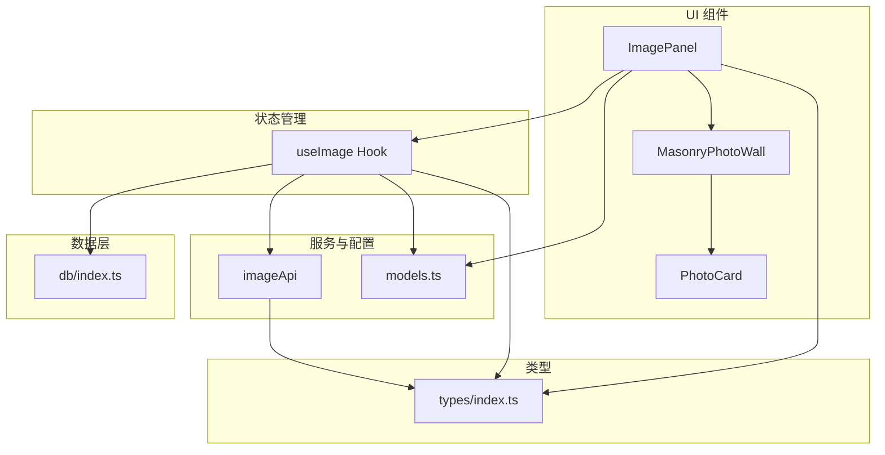
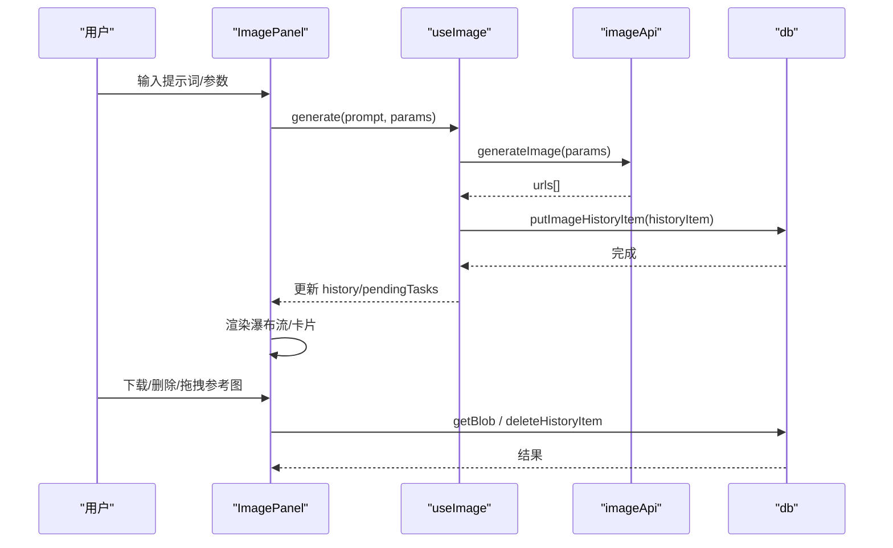
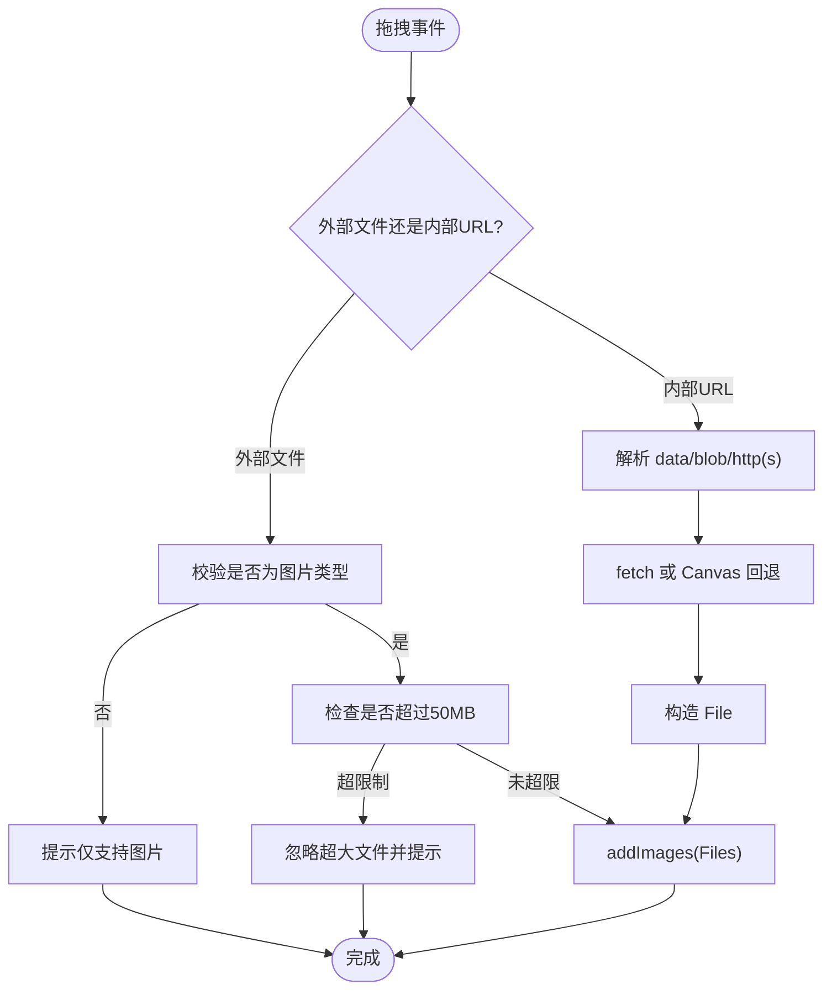
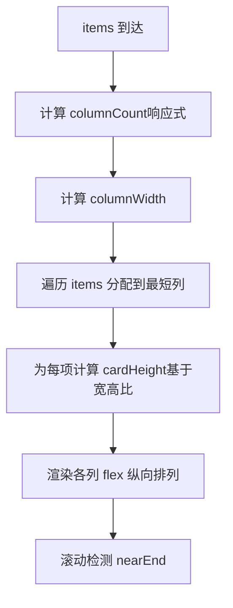
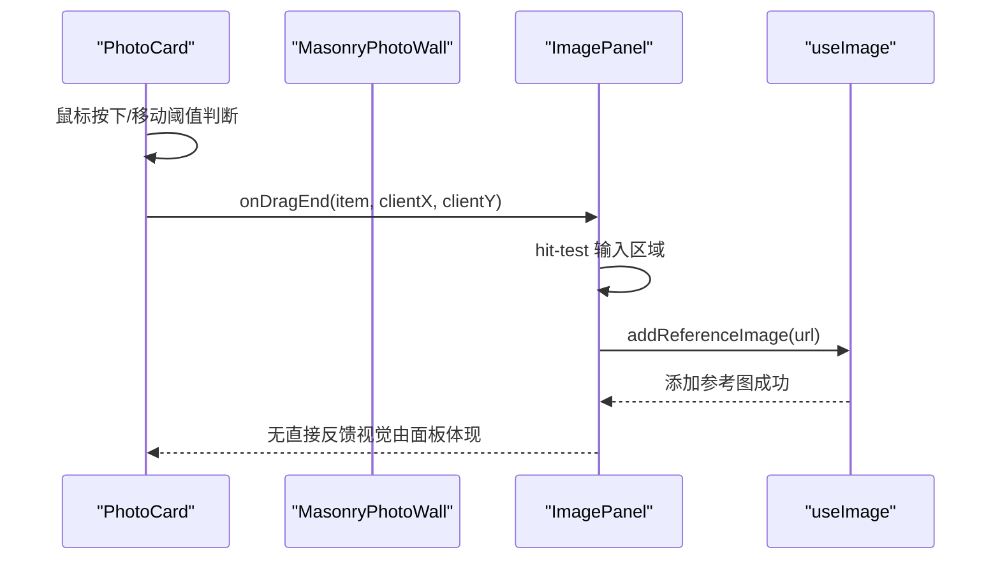
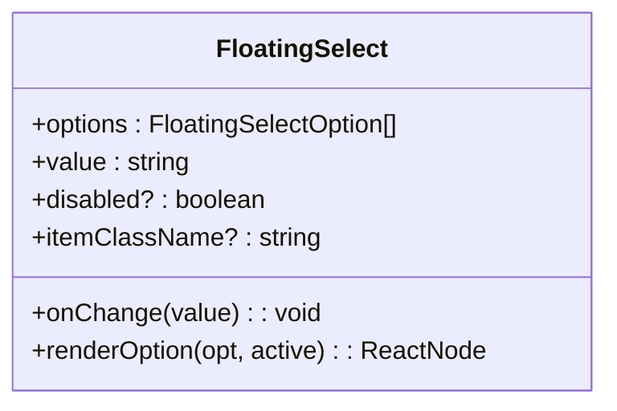
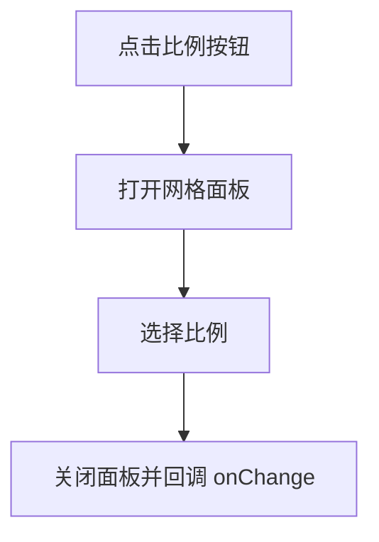
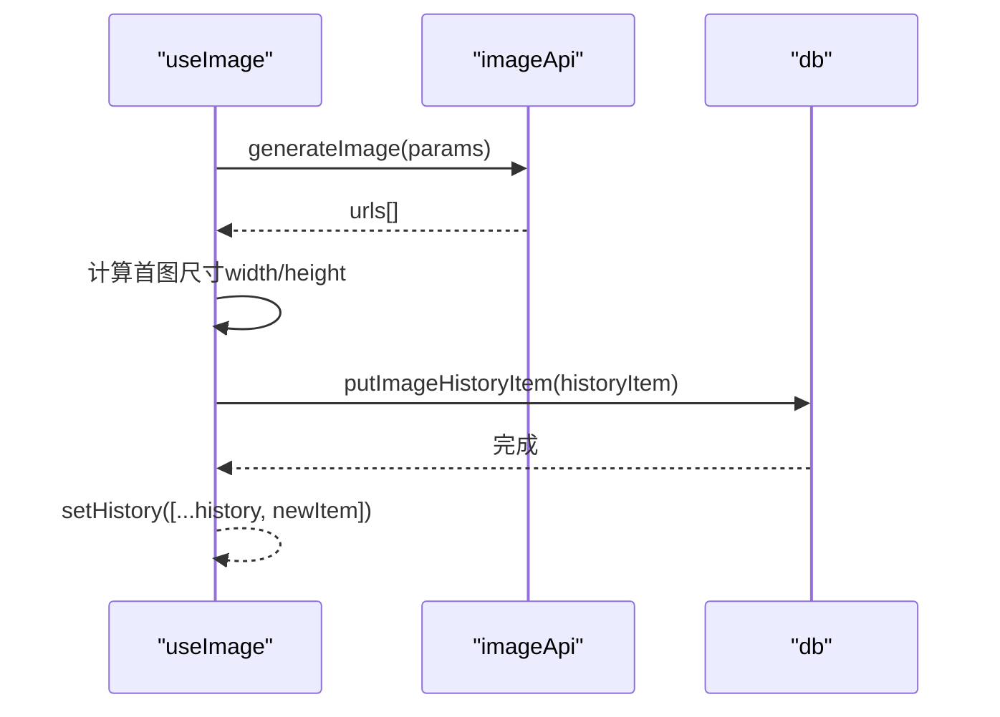
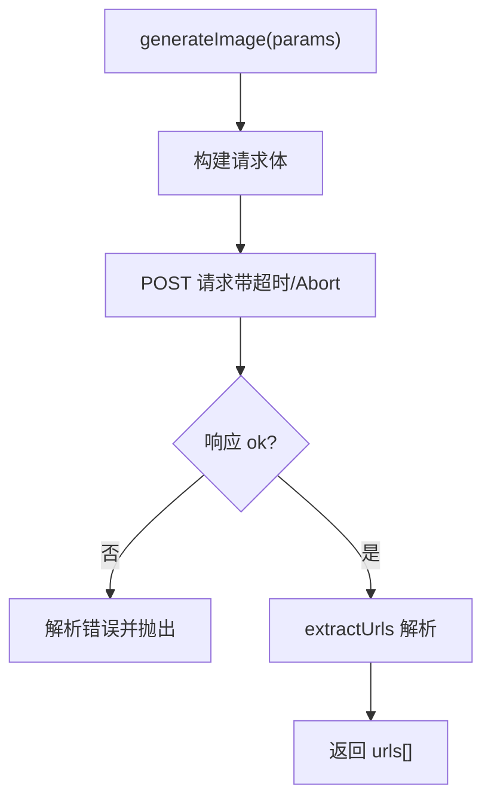
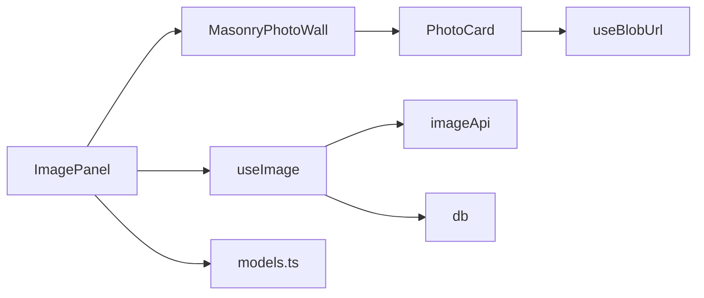

# 图像面板组件

<cite>
**本文引用的文件**
- [ImagePanel.tsx](file://src/components/image/ImagePanel.tsx)
- [MasonryPhotoWall.tsx](file://src/components/image/MasonryPhotoWall.tsx)
- [PhotoCard.tsx](file://src/components/image/PhotoCard.tsx)
- [useImage.ts](file://src/hooks/useImage.ts)
- [imageApi.ts](file://src/services/imageApi.ts)
- [models.ts](file://src/config/models.ts)
- [db/index.ts](file://src/db/index.ts)
- [index.ts（类型定义）](file://src/types/index.ts)
</cite>

## 目录
1. [简介](#简介)
2. [项目结构](#项目结构)
3. [核心组件与职责](#核心组件与职责)
4. [架构总览](#架构总览)
5. [详细组件分析](#详细组件分析)
6. [依赖关系分析](#依赖关系分析)
7. [性能与优化](#性能与优化)
8. [故障排查](#故障排查)
9. [使用示例与扩展指南](#使用示例与扩展指南)
10. [结论](#结论)

## 简介
本文件面向 AIShop 的“图像面板”子系统，系统性解析 ImagePanel、MasonryPhotoWall、PhotoCard、FloatingSelect、AspectRatioGrid 等组件的实现机制与交互流程。重点覆盖：
- 拖拽上传参考图（外部文件、内部图片 URL）
- 图片预览与瀑布流布局
- 参数配置界面（模型、比例、尺寸、质量）
- 并发任务队列（加载/错误状态、重试/取消）
- 下载与删除历史图片
- 响应式设计与用户体验优化

## 项目结构
图像面板位于 src/components/image，配合 hooks、services、types、config 与 db 层协同工作：
- 组件层：ImagePanel（主面板）、MasonryPhotoWall（瀑布流布局）、PhotoCard（卡片渲染与交互）
- 状态层：useImage（模型、参数、上传、生成、历史、并发任务）
- 服务层：imageApi（上游 API 请求、超时控制、响应解析）
- 配置层：models（可用图像模型列表）
- 数据层：db（IndexedDB 存取、Blob 引用转换）
- 类型层：types（请求参数、历史记录、任务状态等）

图表来源
- [ImagePanel.tsx:1-20](file://src/components/image/ImagePanel.tsx#L1-L20)
- [MasonryPhotoWall.tsx:1-22](file://src/components/image/MasonryPhotoWall.tsx#L1-L22)
- [PhotoCard.tsx:1-25](file://src/components/image/PhotoCard.tsx#L1-L25)
- [useImage.ts:1-14](file://src/hooks/useImage.ts#L1-L14)
- [imageApi.ts:1-19](file://src/services/imageApi.ts#L1-L19)
- [models.ts:237-271](file://src/config/models.ts#L237-L271)
- [db/index.ts:83-89](file://src/db/index.ts#L83-L89)
- [index.ts（类型定义）:177-214](file://src/types/index.ts#L177-L214)

章节来源
- [ImagePanel.tsx:1-20](file://src/components/image/ImagePanel.tsx#L1-L20)
- [MasonryPhotoWall.tsx:1-22](file://src/components/image/MasonryPhotoWall.tsx#L1-L22)
- [PhotoCard.tsx:1-25](file://src/components/image/PhotoCard.tsx#L1-L25)
- [useImage.ts:1-14](file://src/hooks/useImage.ts#L1-L14)
- [imageApi.ts:1-19](file://src/services/imageApi.ts#L1-L19)
- [models.ts:237-271](file://src/config/models.ts#L237-L271)
- [db/index.ts:83-89](file://src/db/index.ts#L83-L89)
- [index.ts（类型定义）:177-214](file://src/types/index.ts#L177-L214)

## 核心组件与职责
- ImagePanel：面板入口，聚合输入区、参数选择器、照片墙容器；处理拖拽上传、提交生成、下载/删除历史、浮动选择器等。
- MasonryPhotoWall：列式瀑布流布局，按最短列优先算法分配项，支持响应式列数、滚动接近底部回调、占位高度防抖动。
- PhotoCard：单张卡片渲染（图片/骨架/错误），提供菜单（下载/删除）、App 内拖拽（将图片作为参考图拖入输入区）。
- FloatingSelect：通用浮动下拉选择器，自动定位（上/下），支持动画与键盘/点击关闭。
- AspectRatioGrid：九宫格比例选择器，内置比例图标，弹出网格选择。
- useImage：集中管理模型、上传、参数、生成、历史、并发任务、持久化等。
- imageApi：封装上游图片生成接口，统一响应解析、超时控制、错误处理。

章节来源
- [ImagePanel.tsx:94-367](file://src/components/image/ImagePanel.tsx#L94-L367)
- [MasonryPhotoWall.tsx:25-60](file://src/components/image/MasonryPhotoWall.tsx#L25-L60)
- [PhotoCard.tsx:26-55](file://src/components/image/PhotoCard.tsx#L26-L55)
- [useImage.ts:122-150](file://src/hooks/useImage.ts#L122-L150)
- [imageApi.ts:145-243](file://src/services/imageApi.ts#L145-L243)

## 架构总览
图像面板的数据流与控制流如下：
- 用户输入提示词与参数 → useImage.generate → executeTask → imageApi.generateImage → 返回图片 URL 数组
- 成功：写入 IndexedDB 并更新 history；失败：进入 pendingTasks 错误态，支持重试/关闭
- 历史数据扁平化为 FlatCard → 转为 PhotoItem → 由 MasonryPhotoWall 计算列高并渲染 PhotoCard
- 拖拽上传：外部文件/URL → addImages → 压缩为 base64 → 作为编辑模式参考图参与生成
- 下载：从 IndexedDB 取 Blob 创建临时 Object URL → 触发浏览器下载 → 延迟释放

图表来源
- [ImagePanel.tsx:603-635](file://src/components/image/ImagePanel.tsx#L603-L635)
- [useImage.ts:358-387](file://src/hooks/useImage.ts#L358-L387)
- [imageApi.ts:149-243](file://src/services/imageApi.ts#L149-L243)
- [db/index.ts:83-89](file://src/db/index.ts#L83-L89)

## 详细组件分析

### ImagePanel：拖拽上传、参数配置、照片墙集成
- 拖拽上传
  - 支持外部文件拖入（仅图片类型，大小上限 50MB）
  - 支持内部图片 URL 拖入（data URI/blob/http(s)），通过 fetch + Canvas 回退绕过 CORS
  - 达到最大上传数量时给出提示
- 参数配置界面
  - 模型选择：ModelSelector（来自 common）
  - 比例选择：AspectRatioGrid（九宫格，auto 或固定比例）
  - 尺寸/质量：根据模型动态展示（GPT 显示尺寸/质量，Google 显示尺寸/比例）
- 照片墙集成
  - 将 history 扁平化为 FlatCard，再转为 PhotoItem
  - 将 pendingTasks 转为 Loading/Error 卡片，插入瀑布流
- 下载与删除
  - 下载：从 IndexedDB 取 Blob，创建临时 Object URL，触发 a.download，延迟释放
  - 删除：调用 deleteHistoryItem，同步本地 state 与 IndexedDB
- 拖拽参考图
  - 在 PhotoCard 的 onDragEnd 中做 hit-test，若落在输入区域则将该图片作为参考图添加

图表来源
- [ImagePanel.tsx:413-571](file://src/components/image/ImagePanel.tsx#L413-L571)
- [useImage.ts:217-238](file://src/hooks/useImage.ts#L217-L238)

章节来源
- [ImagePanel.tsx:21-22](file://src/components/image/ImagePanel.tsx#L21-L22)
- [ImagePanel.tsx:94-367](file://src/components/image/ImagePanel.tsx#L94-L367)
- [ImagePanel.tsx:413-571](file://src/components/image/ImagePanel.tsx#L413-L571)
- [ImagePanel.tsx:603-701](file://src/components/image/ImagePanel.tsx#L603-L701)

### MasonryPhotoWall：瀑布流布局原理与性能策略
- 布局算法
  - 最短列优先：维护每列当前高度，每次将新项放入最矮列，实现真正瀑布流
  - 列宽计算：根据容器宽度与间距计算 columnWidth，用于计算卡片高度
- 响应式列数
  - 基于断点配置（2/3/4/5 列），监听容器宽度变化（ResizeObserver）
- 防布局抖动
  - 提前计算卡片高度（基于 width/height 或正方形占位），避免图片加载导致的重排
- 无限加载
  - 滚动接近底部（距离 < 400px）触发 onNearEnd 回调，便于分页加载
- 可访问性与样式
  - 隐藏滚动条但保留滚动能力，适配移动端

图表来源
- [MasonryPhotoWall.tsx:27-36](file://src/components/image/MasonryPhotoWall.tsx#L27-L36)
- [MasonryPhotoWall.tsx:64-71](file://src/components/image/MasonryPhotoWall.tsx#L64-L71)
- [MasonryPhotoWall.tsx:87-117](file://src/components/image/MasonryPhotoWall.tsx#L87-L117)
- [MasonryPhotoWall.tsx:138-158](file://src/components/image/MasonryPhotoWall.tsx#L138-L158)
- [MasonryPhotoWall.tsx:160-200](file://src/components/image/MasonryPhotoWall.tsx#L160-L200)

章节来源
- [MasonryPhotoWall.tsx:1-22](file://src/components/image/MasonryPhotoWall.tsx#L1-L22)
- [MasonryPhotoWall.tsx:27-36](file://src/components/image/MasonryPhotoWall.tsx#L27-L36)
- [MasonryPhotoWall.tsx:64-71](file://src/components/image/MasonryPhotoWall.tsx#L64-L71)
- [MasonryPhotoWall.tsx:87-117](file://src/components/image/MasonryPhotoWall.tsx#L87-L117)
- [MasonryPhotoWall.tsx:138-158](file://src/components/image/MasonryPhotoWall.tsx#L138-L158)
- [MasonryPhotoWall.tsx:160-200](file://src/components/image/MasonryPhotoWall.tsx#L160-L200)

### PhotoCard：交互行为（下载、删除、拖拽参考图）
- 图片加载与占位
  - 使用 thumbnailUrl（可能来自 IndexedDB 的 blob 引用）进行懒加载
  - 加载中显示骨架屏，错误显示警告图标
- 上下文菜单
  - 下载：调用父级传入的 onDownload
  - 删除：调用 onDelete
- App 内拖拽
  - 鼠标按下后移动超过阈值启动拖拽，跟随鼠标显示浮动缩略图
  - 释放时通过 onDragEnd 上报坐标，供父级做 hit-test（如拖入输入区）

图表来源
- [PhotoCard.tsx:118-166](file://src/components/image/PhotoCard.tsx#L118-L166)
- [ImagePanel.tsx:679-701](file://src/components/image/ImagePanel.tsx#L679-L701)

章节来源
- [PhotoCard.tsx:26-55](file://src/components/image/PhotoCard.tsx#L26-L55)
- [PhotoCard.tsx:71-116](file://src/components/image/PhotoCard.tsx#L71-L116)
- [PhotoCard.tsx:118-166](file://src/components/image/PhotoCard.tsx#L118-L166)
- [PhotoCard.tsx:170-299](file://src/components/image/PhotoCard.tsx#L170-L299)

### FloatingSelect：通用浮动选择器
- 功能要点
  - 按钮触发打开/关闭，支持禁用态
  - 自动定位：根据按钮位置与窗口空间决定上/下弹出
  - 动画过渡：mounted 后两帧开启可见性，关闭延时卸载 DOM
  - 事件处理：点击外部关闭、Esc 键关闭
- 可定制
  - renderOption 自定义选项渲染
  - itemClassName 自定义选项样式

图表来源
- [ImagePanel.tsx:94-107](file://src/components/image/ImagePanel.tsx#L94-L107)
- [ImagePanel.tsx:109-242](file://src/components/image/ImagePanel.tsx#L109-L242)

章节来源
- [ImagePanel.tsx:94-242](file://src/components/image/ImagePanel.tsx#L94-L242)

### AspectRatioGrid：比例选择器
- 功能要点
  - 九宫格网格展示可选比例（含 auto）
  - 每个选项带比例示意图（AspectRatioIcon）
  - 弹出定位：绝对定位在按钮上方，支持动画与点击外部关闭
- 适用场景
  - Google 模型文本到图像时使用固定比例
  - 编辑模式下可切换 auto

图表来源
- [ImagePanel.tsx:244-367](file://src/components/image/ImagePanel.tsx#L244-L367)

章节来源
- [ImagePanel.tsx:244-367](file://src/components/image/ImagePanel.tsx#L244-L367)

### useImage：状态管理与生成流程
- 模型与参数
  - 根据模型动态设置默认比例/尺寸/质量
  - 上传数量上限随模型不同而变化（GPT 单张，Google 多张）
- 上传图片
  - 压缩为 base64（最大边 1024，JPEG 0.85），提升传输效率
- 生成任务
  - 并发队列：pendingTasks 记录 loading/error 状态
  - 成功：写入 IndexedDB 并更新 history（追加末尾保持顺序）
  - 失败：错误信息展示，支持重试/关闭
- 历史与维度回填
  - 启动时扫描缺失 width/height 的历史项，尝试从 Blob 或图片获取并写回库

图表来源
- [useImage.ts:274-356](file://src/hooks/useImage.ts#L274-L356)
- [useImage.ts:358-387](file://src/hooks/useImage.ts#L358-L387)
- [useImage.ts:152-194](file://src/hooks/useImage.ts#L152-L194)

章节来源
- [useImage.ts:15-65](file://src/hooks/useImage.ts#L15-L65)
- [useImage.ts:66-120](file://src/hooks/useImage.ts#L66-L120)
- [useImage.ts:122-214](file://src/hooks/useImage.ts#L122-L214)
- [useImage.ts:217-267](file://src/hooks/useImage.ts#L217-L267)
- [useImage.ts:274-356](file://src/hooks/useImage.ts#L274-L356)
- [useImage.ts:358-427](file://src/hooks/useImage.ts#L358-L427)

### imageApi：上游请求封装
- 端点映射：根据模型选择 text-to-image 或 edit 路径
- 请求体构建：区分 GPT 与 Gemini 的参数格式（base64/data URI/URL）
- 超时控制：120s 超时，支持外部 AbortSignal（用户取消）
- 响应解析：兼容多种返回结构，提取图片 URL 数组
- 错误处理：优先读取 detail/error.message，抛出友好错误

图表来源
- [imageApi.ts:5-19](file://src/services/imageApi.ts#L5-L19)
- [imageApi.ts:21-63](file://src/services/imageApi.ts#L21-L63)
- [imageApi.ts:65-143](file://src/services/imageApi.ts#L65-L143)
- [imageApi.ts:145-243](file://src/services/imageApi.ts#L145-L243)

章节来源
- [imageApi.ts:1-19](file://src/services/imageApi.ts#L1-L19)
- [imageApi.ts:21-63](file://src/services/imageApi.ts#L21-L63)
- [imageApi.ts:65-143](file://src/services/imageApi.ts#L65-L143)
- [imageApi.ts:145-243](file://src/services/imageApi.ts#L145-L243)

## 依赖关系分析
- ImagePanel 依赖 useImage 提供的状态与方法，依赖 models 配置，依赖 db 进行下载/删除
- MasonryPhotoWall 不关心内容类型，仅依赖 PhotoItem 数据结构
- PhotoCard 依赖 useBlobUrl 将 aishop-blob:<id> 转换为可渲染 URL
- useImage 依赖 imageApi 发起请求，依赖 db 读写历史与 Blob
- imageApi 依赖 settingsService 与 providers 配置

图表来源
- [ImagePanel.tsx:1-20](file://src/components/image/ImagePanel.tsx#L1-L20)
- [useImage.ts:1-14](file://src/hooks/useImage.ts#L1-L14)
- [imageApi.ts:1-19](file://src/services/imageApi.ts#L1-L19)
- [db/index.ts:83-89](file://src/db/index.ts#L83-L89)
- [models.ts:237-271](file://src/config/models.ts#L237-L271)

章节来源
- [ImagePanel.tsx:1-20](file://src/components/image/ImagePanel.tsx#L1-L20)
- [useImage.ts:1-14](file://src/hooks/useImage.ts#L1-L14)
- [imageApi.ts:1-19](file://src/services/imageApi.ts#L1-L19)
- [db/index.ts:83-89](file://src/db/index.ts#L83-L89)
- [models.ts:237-271](file://src/config/models.ts#L237-L271)

## 性能与优化
- 瀑布流占位高度
  - 通过 width/height 计算卡片高度，避免图片加载导致的布局抖动
  - 缺失尺寸时回退为正方形占位
- 图片压缩
  - 上传前压缩至最大边 1024，JPEG 0.85，减少内存与网络开销
- 并发任务管理
  - 使用 AbortController 支持取消与超时，避免资源泄漏
- 滚动优化
  - 隐藏滚动条但保留滚动能力，减少视觉干扰
  - 滚动接近底部触发加载，便于后续接入虚拟滚动/分页
- 下载优化
  - 下载时创建临时 Object URL，延迟释放以避免竞态

[本节为通用性能讨论，无需特定文件引用]

## 故障排查
- 拖拽上传失败
  - 检查文件类型是否为图片，是否超过 50MB
  - 远程 URL 拖拽可能受 CORS 限制，已内置 Canvas 回退方案
- 图片无法显示
  - 确认 thumbnailUrl 是否解析成功（aishop-blob:<id> 需通过 useBlobUrl 转换）
  - 检查 onError 是否被触发，必要时查看网络与存储状态
- 生成失败/超时
  - 检查 imageApi 的错误消息（detail/error.message）
  - 使用重试功能重新发起请求
- 下载失败
  - 确认 IndexedDB 中是否存在对应 Blob
  - 注意临时 Object URL 的释放时机

章节来源
- [ImagePanel.tsx:413-571](file://src/components/image/ImagePanel.tsx#L413-L571)
- [PhotoCard.tsx:170-200](file://src/components/image/PhotoCard.tsx#L170-L200)
- [imageApi.ts:183-243](file://src/services/imageApi.ts#L183-L243)

## 使用示例与扩展指南
- 基本用法
  - 在页面中引入 ImagePanel，它将自动挂载照片墙与输入区
  - 通过 useImage 暴露的状态与方法进行扩展（如自定义参数面板）
- 自定义参数界面
  - 复用 FloatingSelect 与 AspectRatioGrid 快速搭建下拉/网格选择器
  - 通过 useImage 的 aspectRatioOptions/sizeOptions/qualityOptions 动态渲染
- 扩展卡片类型
  - 在 MasonryPhotoWall 中通过 renderCard 替换 PhotoCard，支持视频/音频等媒体
- 无限加载
  - 在 MasonryPhotoWall 的 onNearEnd 中实现分页加载逻辑
- 响应式适配
  - 利用 COLUMN_BREAKPOINTS 调整断点，适配不同屏幕尺寸
- 体验优化
  - 使用骨架屏与占位高度减少闪烁
  - 提供明确的错误提示与重试入口

[本节为概念性指导，无需特定文件引用]

## 结论
AIShop 图像面板以清晰的组件分层与职责划分实现了强大的图片生成与管理工作流：
- ImagePanel 负责编排输入、参数、照片墙与交互
- MasonryPhotoWall 提供高性能瀑布流布局与响应式适配
- PhotoCard 提供丰富的卡片交互（下载、删除、拖拽参考图）
- FloatingSelect 与 AspectRatioGrid 提供灵活的参数选择体验
- useImage 与 imageApi 共同保障生成流程的可靠性与可维护性
整体设计兼顾了性能、可扩展性与用户体验，适合进一步扩展更多媒体类型与高级功能。