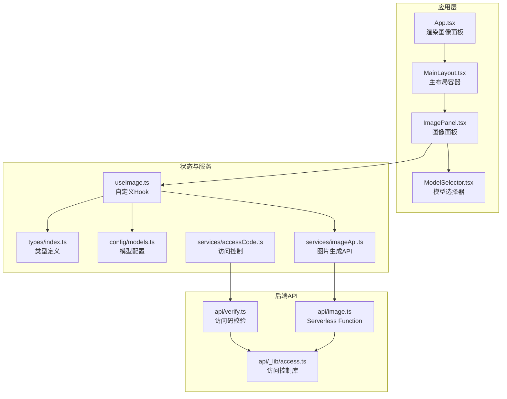
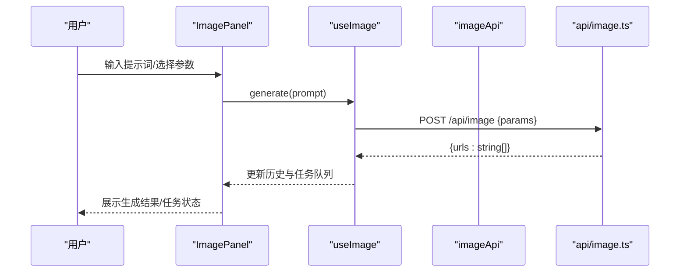
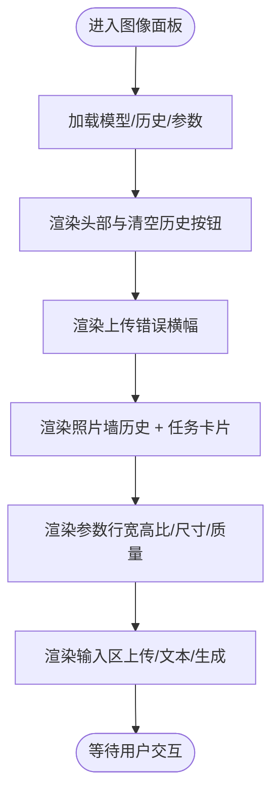
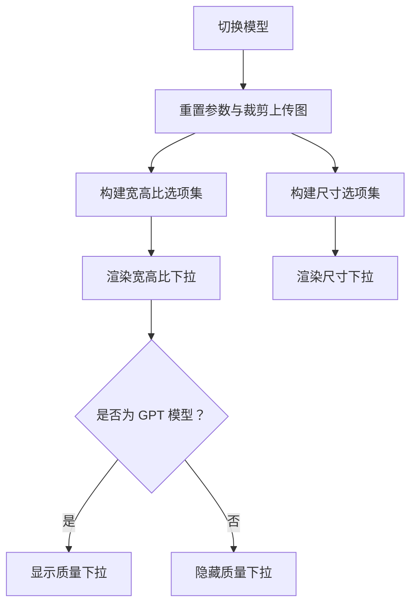
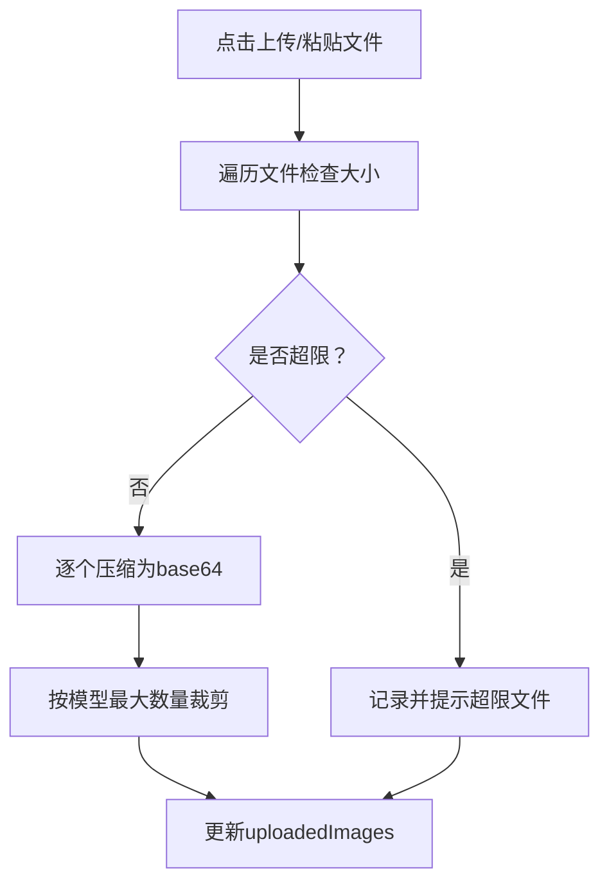
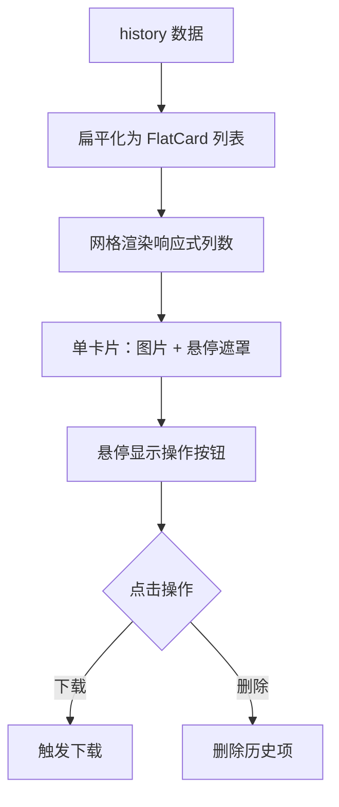
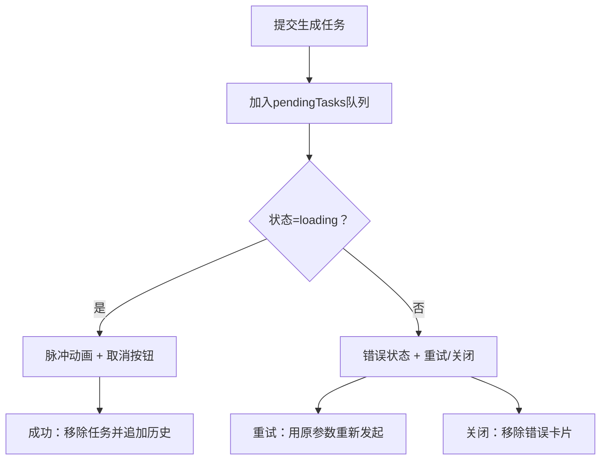
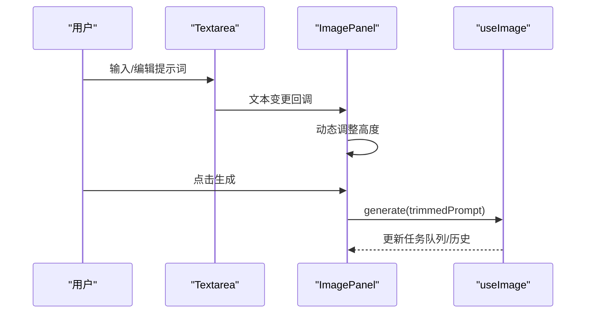
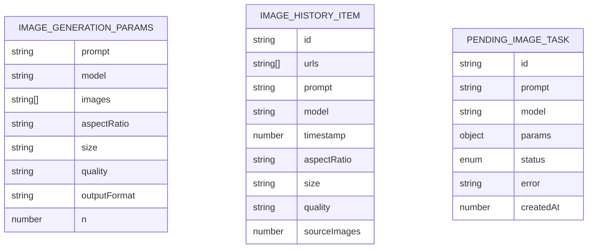
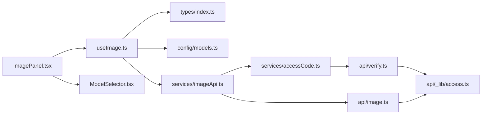

# 图像面板组件

<cite>
**本文档引用的文件**
- [ImagePanel.tsx](file://src/components/image/ImagePanel.tsx)
- [useImage.ts](file://src/hooks/useImage.ts)
- [index.ts](file://src/types/index.ts)
- [models.ts](file://src/config/models.ts)
- [imageApi.ts](file://src/services/imageApi.ts)
- [ModelSelector.tsx](file://src/components/common/ModelSelector.tsx)
- [App.tsx](file://src/App.tsx)
- [MainLayout.tsx](file://src/components/layout/MainLayout.tsx)
- [accessCode.ts](file://src/services/accessCode.ts)
- [AccessGate.tsx](file://src/components/auth/AccessGate.tsx)
- [image.ts](file://api/image.ts)
- [verify.ts](file://api/verify.ts)
- [access.ts](file://api/_lib/access.ts)
</cite>

## 目录
1. [简介](#简介)
2. [项目结构](#项目结构)
3. [核心组件](#核心组件)
4. [架构总览](#架构总览)
5. [详细组件分析](#详细组件分析)
6. [依赖关系分析](#依赖关系分析)
7. [性能考量](#性能考量)
8. [故障排查指南](#故障排查指南)
9. [结论](#结论)
10. [附录](#附录)

## 简介
图像面板组件负责提供 AI 绘图与图像编辑的完整工作流，包含：
- 参数配置：宽高比、尺寸、质量等
- 图像上传与预览：参考图上传、预览条、多图上传上限
- 生成历史展示：网格布局、悬停操作（下载、删除）、模型标签
- 任务状态管理：进行中、错误状态的可视化反馈与用户操作（取消、重试、关闭）
- 用户交互：提示词输入、快捷键、模型切换、清空历史等

组件通过自定义 Hook 管理状态与副作用，并与后端 API 交互完成图片生成。

## 项目结构
图像面板位于组件树的图像标签页中，整体布局由主布局组件承载，认证门控确保访问安全。

**图表来源**
- [App.tsx:11-67](file://src/App.tsx#L11-L67)
- [MainLayout.tsx:45-227](file://src/components/layout/MainLayout.tsx#L45-L227)
- [ImagePanel.tsx:63-434](file://src/components/image/ImagePanel.tsx#L63-L434)
- [ModelSelector.tsx:43-173](file://src/components/common/ModelSelector.tsx#L43-L173)
- [useImage.ts:128-393](file://src/hooks/useImage.ts#L128-L393)
- [imageApi.ts:8-41](file://src/services/imageApi.ts#L8-L41)
- [models.ts:181-215](file://src/config/models.ts#L181-L215)
- [types/index.ts:68-103](file://src/types/index.ts#L68-L103)
- [accessCode.ts:37-113](file://src/services/accessCode.ts#L37-L113)
- [image.ts:104-310](file://api/image.ts#L104-L310)
- [verify.ts:11-33](file://api/verify.ts#L11-L33)
- [access.ts:120-155](file://api/_lib/access.ts#L120-L155)

**章节来源**
- [App.tsx:11-67](file://src/App.tsx#L11-L67)
- [MainLayout.tsx:45-227](file://src/components/layout/MainLayout.tsx#L45-L227)
- [ImagePanel.tsx:63-434](file://src/components/image/ImagePanel.tsx#L63-L434)

## 核心组件
- 图像面板（ImagePanel）：UI 主体，负责布局、参数配置、上传与预览、历史展示、任务状态管理与用户交互。
- 自定义 Hook（useImage）：集中管理状态（模型、参数、上传图、历史、任务队列）、计算属性、并发任务执行与持久化。
- 模型选择器（ModelSelector）：提供模型切换 UI，支持弹出菜单与定位计算。
- 访问控制（AccessGate + accessCode）：前端认证门控与带访问码的 fetch 包装。
- 图片生成 API（imageApi）：封装后端 /api/image 调用，处理错误与返回值。
- 后端 API（api/image.ts）：Serverless Function，代理上游图片生成服务，兼容多种模型与响应格式。

**章节来源**
- [ImagePanel.tsx:63-434](file://src/components/image/ImagePanel.tsx#L63-L434)
- [useImage.ts:128-393](file://src/hooks/useImage.ts#L128-L393)
- [ModelSelector.tsx:43-173](file://src/components/common/ModelSelector.tsx#L43-L173)
- [accessCode.ts:37-113](file://src/services/accessCode.ts#L37-L113)
- [imageApi.ts:8-41](file://src/services/imageApi.ts#L8-L41)
- [image.ts:104-310](file://api/image.ts#L104-L310)

## 架构总览
图像面板采用“视图组件 + 自定义 Hook + 服务层 + 后端 API”的分层架构：
- 视图组件负责 UI 布局与用户交互
- 自定义 Hook 负责状态管理、副作用与业务逻辑
- 服务层封装网络请求与错误处理
- 后端 API 代理上游服务，统一输出格式

**图表来源**
- [ImagePanel.tsx:134-142](file://src/components/image/ImagePanel.tsx#L134-L142)
- [useImage.ts:289-317](file://src/hooks/useImage.ts#L289-L317)
- [imageApi.ts:8-41](file://src/services/imageApi.ts#L8-L41)
- [image.ts:104-310](file://api/image.ts#L104-L310)

## 详细组件分析

### 布局结构与状态管理
- 布局分为四层区域：头部（模型选择与清空历史）、上传错误横幅、照片墙（历史 + 进行中/错误任务卡片）、参数行（宽高比/尺寸/质量）、输入区（上传按钮、文本域、生成按钮）。
- 状态管理集中在 useImage Hook：
  - 模型与参数：selectedModel、aspectRatio、size、quality
  - 上传图：uploadedImages（base64 预览）
  - 历史：history（ImageHistoryItem[]）
  - 任务队列：pendingTasks（PendingImageTask[]）
  - 计算属性：isEditMode、maxUploadCount、各选项集、有效值回退

**图表来源**
- [ImagePanel.tsx:165-432](file://src/components/image/ImagePanel.tsx#L165-L432)
- [useImage.ts:128-393](file://src/hooks/useImage.ts#L128-L393)

**章节来源**
- [ImagePanel.tsx:165-432](file://src/components/image/ImagePanel.tsx#L165-L432)
- [useImage.ts:128-393](file://src/hooks/useImage.ts#L128-L393)

### 参数配置界面
- 宽高比选择器：根据模型与编辑模式动态生成选项（GPT 模型占位为 auto；Google 模型提供一组常用比例；编辑模式可选 auto）。
- 尺寸设置：GPT 模型支持多种像素尺寸；Google 模型按版本提供不同的尺寸集合。
- 质量调节：仅 GPT 模型显示，提供 low/medium/high 三档。
- 计算属性：当当前值不在有效选项内时，自动回退到首个选项，保证 UI 稳定性。

**图表来源**
- [useImage.ts:158-167](file://src/hooks/useImage.ts#L158-L167)
- [useImage.ts:205-219](file://src/hooks/useImage.ts#L205-L219)
- [useImage.ts:353-391](file://src/hooks/useImage.ts#L353-L391)

**章节来源**
- [useImage.ts:205-219](file://src/hooks/useImage.ts#L205-L219)
- [useImage.ts:353-391](file://src/hooks/useImage.ts#L353-L391)

### 图像上传与预览机制
- 文件大小限制：单文件不超过 4MB，超出将被忽略并在横幅提示。
- 多图上传：根据模型最大上传数量限制，自动裁剪多余图片。
- 压缩策略：上传前将图片压缩为 JPEG（最大边 1024px，质量 0.85），仅保留 base64 数据，不包含 data URI 前缀。
- 预览条：编辑模式下在底部展示参考图缩略图，支持移除单张与添加更多。

**图表来源**
- [ImagePanel.tsx:99-132](file://src/components/image/ImagePanel.tsx#L99-L132)
- [useImage.ts:170-191](file://src/hooks/useImage.ts#L170-L191)
- [useImage.ts:89-125](file://src/hooks/useImage.ts#L89-L125)

**章节来源**
- [ImagePanel.tsx:99-132](file://src/components/image/ImagePanel.tsx#L99-L132)
- [useImage.ts:170-191](file://src/hooks/useImage.ts#L170-L191)
- [useImage.ts:89-125](file://src/hooks/useImage.ts#L89-L125)

### 生成历史展示
- 网格布局：使用 CSS Grid 实现响应式列数（2/3/4），每张卡片包含图片、悬停遮罩层。
- 悬停效果：显示下载与删除按钮，展示提示词与模型名称。
- 下载功能：触发浏览器下载，文件名为“提示词_时间戳.png”，自动清理临时元素。
- 删除功能：支持删除单条历史项，同时更新本地存储。

**图表来源**
- [ImagePanel.tsx:29-45](file://src/components/image/ImagePanel.tsx#L29-L45)
- [ImagePanel.tsx:217-255](file://src/components/image/ImagePanel.tsx#L217-L255)
- [ImagePanel.tsx:51-61](file://src/components/image/ImagePanel.tsx#L51-L61)

**章节来源**
- [ImagePanel.tsx:29-45](file://src/components/image/ImagePanel.tsx#L29-L45)
- [ImagePanel.tsx:217-255](file://src/components/image/ImagePanel.tsx#L217-L255)
- [ImagePanel.tsx:51-61](file://src/components/image/ImagePanel.tsx#L51-L61)

### 任务状态管理
- 进行中：显示旋转加载图标、提示词与取消按钮。
- 错误状态：显示警告图标、错误信息与重试/关闭按钮。
- 超时与取消：55 秒超时触发 AbortController，区分手动取消与超时，分别处理 UI 与状态。
- 并发队列：任务以追加方式呈现，避免影响现有历史卡片位置。

**图表来源**
- [useImage.ts:228-286](file://src/hooks/useImage.ts#L228-L286)
- [useImage.ts:319-342](file://src/hooks/useImage.ts#L319-L342)
- [ImagePanel.tsx:257-298](file://src/components/image/ImagePanel.tsx#L257-L298)

**章节来源**
- [useImage.ts:228-286](file://src/hooks/useImage.ts#L228-L286)
- [useImage.ts:319-342](file://src/hooks/useImage.ts#L319-L342)
- [ImagePanel.tsx:257-298](file://src/components/image/ImagePanel.tsx#L257-L298)

### 用户交互流程
- 提示词输入：支持 Enter 发送、Shift+Enter 换行，自动调整文本域高度。
- 上传参考图：点击附件按钮或拖拽文件，受最大上传数量限制。
- 模型切换：通过 ModelSelector 切换模型，自动重置参数并裁剪上传图。
- 清空历史：确认后清空本地历史存储。

**图表来源**
- [ImagePanel.tsx:144-156](file://src/components/image/ImagePanel.tsx#L144-L156)
- [ImagePanel.tsx:134-142](file://src/components/image/ImagePanel.tsx#L134-L142)
- [useImage.ts:289-317](file://src/hooks/useImage.ts#L289-L317)

**章节来源**
- [ImagePanel.tsx:144-156](file://src/components/image/ImagePanel.tsx#L144-L156)
- [ImagePanel.tsx:134-142](file://src/components/image/ImagePanel.tsx#L134-L142)
- [useImage.ts:289-317](file://src/hooks/useImage.ts#L289-L317)

### 数据模型与类型
- ImageGenerationParams：生成请求参数（提示词、模型、参考图、宽高比、尺寸、质量等）。
- ImageHistoryItem：历史项（ID、URL 列表、提示词、模型、时间戳、可选参数）。
- PendingImageTask：待处理/错误任务（ID、提示词、模型、参数、状态、创建时间）。

**图表来源**
- [types/index.ts:68-103](file://src/types/index.ts#L68-L103)

**章节来源**
- [types/index.ts:68-103](file://src/types/index.ts#L68-L103)

## 依赖关系分析
- 组件依赖：ImagePanel 依赖 useImage Hook、ModelSelector、类型定义与模型配置。
- 服务依赖：useImage 依赖 imageApi 与本地存储；imageApi 依赖带访问码的 fetch 包装。
- 后端依赖：api/image.ts 依赖访问控制库与上游服务，统一返回 { urls: string[] }。

**图表来源**
- [ImagePanel.tsx:63-90](file://src/components/image/ImagePanel.tsx#L63-L90)
- [useImage.ts:128-393](file://src/hooks/useImage.ts#L128-L393)
- [imageApi.ts:8-41](file://src/services/imageApi.ts#L8-L41)
- [accessCode.ts:37-113](file://src/services/accessCode.ts#L37-L113)
- [image.ts:104-310](file://api/image.ts#L104-L310)
- [verify.ts:11-33](file://api/verify.ts#L11-L33)
- [access.ts:120-155](file://api/_lib/access.ts#L120-L155)

**章节来源**
- [ImagePanel.tsx:63-90](file://src/components/image/ImagePanel.tsx#L63-L90)
- [useImage.ts:128-393](file://src/hooks/useImage.ts#L128-L393)
- [imageApi.ts:8-41](file://src/services/imageApi.ts#L8-L41)
- [accessCode.ts:37-113](file://src/services/accessCode.ts#L37-L113)
- [image.ts:104-310](file://api/image.ts#L104-L310)
- [verify.ts:11-33](file://api/verify.ts#L11-L33)
- [access.ts:120-155](file://api/_lib/access.ts#L120-L155)

## 性能考量
- 图片压缩：上传前压缩至最大边 1024px，降低传输体积与内存占用。
- 本地存储：历史与模型偏好持久化，减少重复加载。
- 任务并发：使用 AbortController 与超时控制，避免长时间悬挂。
- UI 响应：网格布局与懒加载，提升滚动性能。

[本节为通用性能建议，无需特定文件引用]

## 故障排查指南
- 生成失败：查看任务卡片中的错误信息，点击重试或关闭；若为超时，检查网络与上游服务状态。
- 访问受限：确认访问码是否正确与有效；多次失败会被限速锁定。
- 上传失败：检查文件大小与类型，确保不超过 4MB 且为图片；确认未达到模型最大上传数量。
- 下载问题：确认浏览器允许下载与弹窗；检查文件名是否包含非法字符。

**章节来源**
- [useImage.ts:265-282](file://src/hooks/useImage.ts#L265-L282)
- [accessCode.ts:88-110](file://src/services/accessCode.ts#L88-L110)
- [image.ts:274-308](file://api/image.ts#L274-L308)

## 结论
图像面板组件通过清晰的分层设计与完善的交互流程，提供了稳定高效的 AI 绘图体验。其状态管理、参数配置、上传预览、历史展示与任务状态反馈均围绕用户体验优化，适合在多模型与多场景下扩展使用。

[本节为总结性内容，无需特定文件引用]

## 附录

### 组件使用示例与最佳实践
- 基本使用：在应用中渲染图像标签页，组件自动加载模型与历史，用户可直接输入提示词生成图片。
- 参数选择：根据需求选择合适的宽高比与尺寸；编辑模式下可上传参考图。
- 上传规范：遵守文件大小限制，合理控制上传数量，避免影响生成性能。
- 历史管理：定期清理历史以节省存储空间；使用下载功能保存重要结果。
- 错误处理：遇到错误时优先重试，必要时联系管理员或检查访问码配置。

[本节为通用指导，无需特定文件引用]