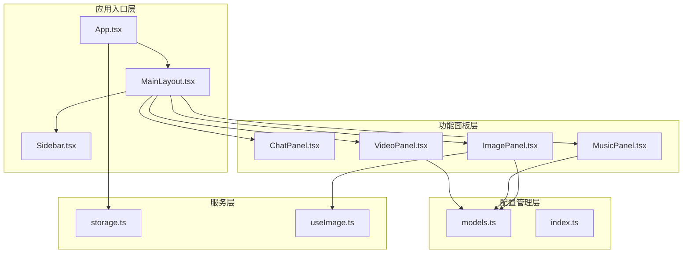
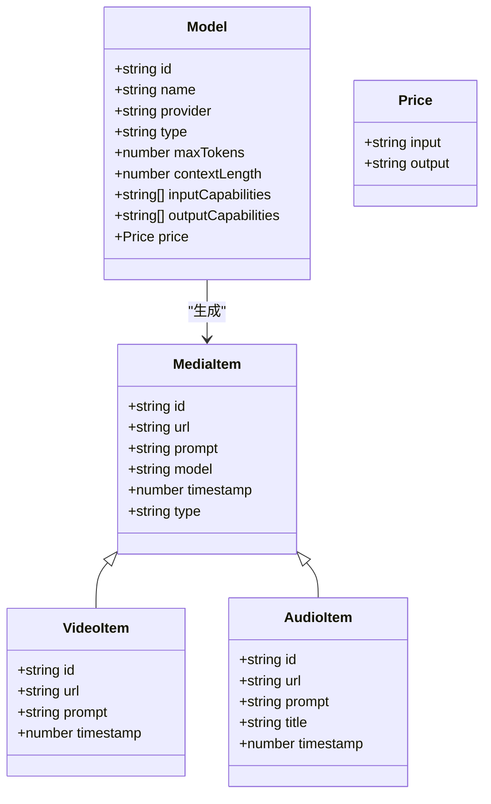
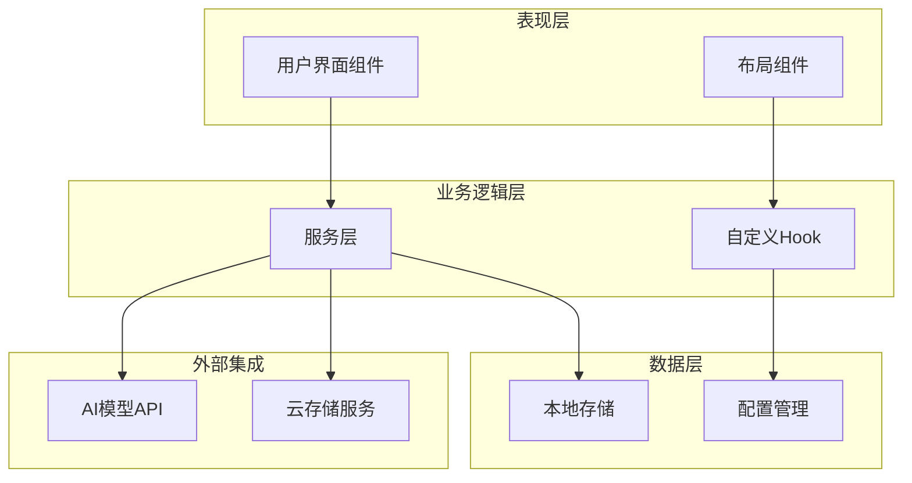
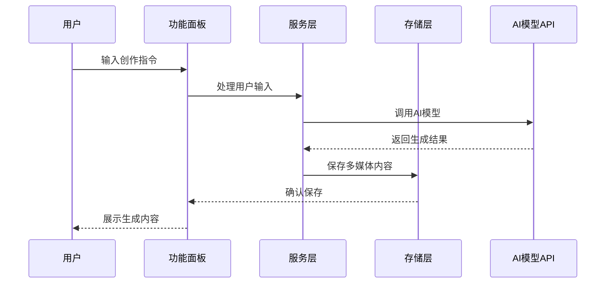
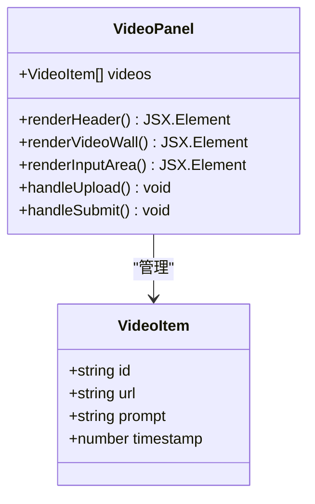
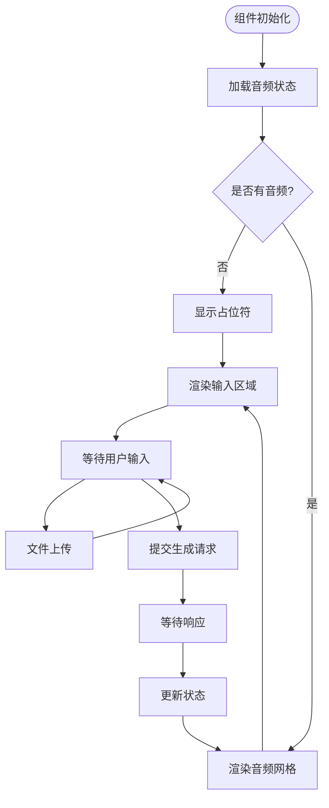
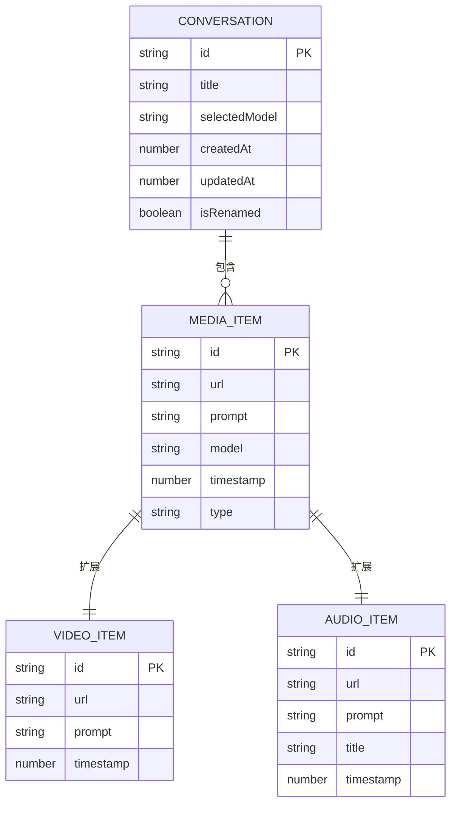
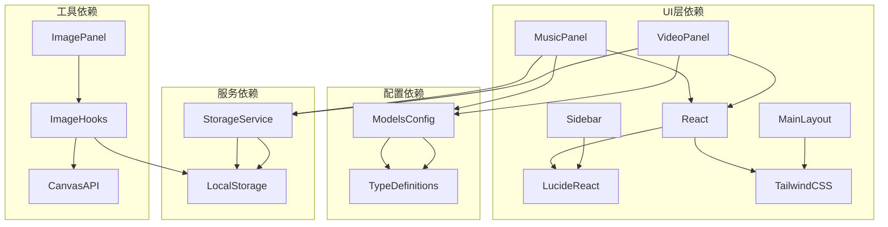

# 多媒体创作模块

<cite>
**本文档引用的文件**
- [VideoPanel.tsx](file://src/components/video/VideoPanel.tsx)
- [MusicPanel.tsx](file://src/components/music/MusicPanel.tsx)
- [App.tsx](file://src/App.tsx)
- [MainLayout.tsx](file://src/components/layout/MainLayout.tsx)
- [Sidebar.tsx](file://src/components/layout/Sidebar.tsx)
- [models.ts](file://src/config/models.ts)
- [index.ts](file://src/types/index.ts)
- [storage.ts](file://src/services/storage.ts)
- [ImagePanel.tsx](file://src/components/image/ImagePanel.tsx)
- [useImage.ts](file://src/hooks/useImage.ts)
- [需求文档.md](file://需求文档.md)
</cite>

## 目录
1. [简介](#简介)
2. [项目结构](#项目结构)
3. [核心组件](#核心组件)
4. [架构概览](#架构概览)
5. [详细组件分析](#详细组件分析)
6. [依赖关系分析](#依赖关系分析)
7. [性能考虑](#性能考虑)
8. [故障排除指南](#故障排除指南)
9. [结论](#结论)
10. [附录](#附录)

## 简介

AIShop 多媒体创作模块是一个基于 React 和 TypeScript 构建的综合 AI 创作平台，专注于提供视频生成、音乐创作等多媒体内容的生成与管理功能。该模块采用现代化的前端技术栈，包括 Vite 构建工具、TailwindCSS 样式框架和 Lucide React 图标库，为用户提供直观易用的多媒体创作体验。

当前版本实现了视频生成和音乐创作功能的基础框架，虽然核心功能仍处于"即将上线"状态，但已具备完整的组件结构和扩展接口，为后续的功能完善和性能优化奠定了坚实基础。

## 项目结构

多媒体创作模块在整体项目架构中占据重要地位，通过清晰的组件层次结构实现了功能的模块化管理：

**图表来源**
- [App.tsx:11-71](file://src/App.tsx#L11-L71)
- [MainLayout.tsx:45-98](file://src/components/layout/MainLayout.tsx#L45-L98)
- [Sidebar.tsx:48-195](file://src/components/layout/Sidebar.tsx#L48-L195)

**章节来源**
- [App.tsx:1-74](file://src/App.tsx#L1-L74)
- [MainLayout.tsx:1-227](file://src/components/layout/MainLayout.tsx#L1-L227)
- [Sidebar.tsx:1-197](file://src/components/layout/Sidebar.tsx#L1-L197)

## 核心组件

多媒体创作模块的核心由四个主要组件构成，每个组件都针对特定的多媒体类型提供了专门的用户界面和交互逻辑：

### 组件类型定义

模块使用统一的类型系统来确保各组件间的数据一致性：

**图表来源**
- [index.ts:49-56](file://src/types/index.ts#L49-L56)
- [VideoPanel.tsx:4-9](file://src/components/video/VideoPanel.tsx#L4-L9)
- [MusicPanel.tsx:4-10](file://src/components/music/MusicPanel.tsx#L4-L10)
- [models.ts:25-38](file://src/config/models.ts#L25-L38)

### 组件职责分工

- **VideoPanel**: 专门负责视频生成和管理的用户界面组件
- **MusicPanel**: 提供音乐创作和播放功能的交互界面
- **ImagePanel**: 虽然不是多媒体创作的核心，但为图片生成提供了完整的实现范例
- **Sidebar**: 管理应用的主要导航和功能切换

**章节来源**
- [VideoPanel.tsx:11-77](file://src/components/video/VideoPanel.tsx#L11-L77)
- [MusicPanel.tsx:12-79](file://src/components/music/MusicPanel.tsx#L12-L79)
- [index.ts:49-56](file://src/types/index.ts#L49-L56)

## 架构概览

多媒体创作模块采用了分层架构设计，确保了良好的可维护性和扩展性：

**图表来源**
- [App.tsx:11-71](file://src/App.tsx#L11-L71)
- [storage.ts:1-66](file://src/services/storage.ts#L1-L66)
- [models.ts:216-227](file://src/config/models.ts#L216-L227)

### 数据流架构

模块实现了清晰的数据流向机制，确保多媒体内容从生成到展示的完整生命周期管理：

**图表来源**
- [VideoPanel.tsx:48-73](file://src/components/video/VideoPanel.tsx#L48-L73)
- [MusicPanel.tsx:49-75](file://src/components/music/MusicPanel.tsx#L49-L75)
- [storage.ts:19-25](file://src/services/storage.ts#L19-L25)

## 详细组件分析

### VideoPanel 组件分析

VideoPanel 作为视频创作功能的核心组件，展现了现代多媒体应用的设计理念：

#### 组件结构设计

**图表来源**
- [VideoPanel.tsx:11-77](file://src/components/video/VideoPanel.tsx#L11-L77)
- [VideoPanel.tsx:4-9](file://src/components/video/VideoPanel.tsx#L4-L9)

#### 设计特点

1. **响应式布局**: 采用网格系统适配不同屏幕尺寸
2. **状态管理**: 使用 React useState 管理视频列表状态
3. **交互设计**: 提供悬停效果和渐变遮罩增强用户体验
4. **占位符设计**: "即将上线"的状态提示明确功能边界

#### 扩展指南

要实现完整的视频生成功能，需要以下改进：

1. **状态管理增强**: 实现视频列表的动态更新和持久化存储
2. **API 集成**: 添加与 AI 视频生成服务的连接
3. **文件处理**: 实现视频文件的上传、预处理和格式转换
4. **进度监控**: 添加生成进度显示和错误处理机制

**章节来源**
- [VideoPanel.tsx:11-77](file://src/components/video/VideoPanel.tsx#L11-L77)

### MusicPanel 组件分析

MusicPanel 为音乐创作功能提供了完整的界面框架，体现了多媒体应用的通用设计模式：

#### 组件架构

**图表来源**
- [MusicPanel.tsx:12-79](file://src/components/music/MusicPanel.tsx#L12-L79)

#### 功能特性

1. **音频播放**: 集成了 HTML5 音频播放器控件
2. **网格布局**: 使用响应式网格展示音频作品
3. **元数据管理**: 支持标题、提示词和时间戳的存储
4. **下载功能**: 为每首音频提供独立的下载按钮

#### 开发方向建议

音乐创作功能的实现需要重点关注以下几个方面：

1. **音频格式支持**: 确定支持的音频格式（MP3、WAV、FLAC 等）
2. **生成流程**: 实现从文本描述到音频文件的完整生成链路
3. **质量控制**: 提供音质、时长等参数的配置选项
4. **版权处理**: 实现生成内容的版权标识和使用限制

**章节来源**
- [MusicPanel.tsx:12-79](file://src/components/music/MusicPanel.tsx#L12-L79)

### 媒体内容管理策略

模块采用了统一的媒体内容管理策略，确保不同类型多媒体内容的一致性：

#### 数据模型统一

**图表来源**
- [index.ts:49-56](file://src/types/index.ts#L49-L56)
- [VideoPanel.tsx:4-9](file://src/components/video/VideoPanel.tsx#L4-L9)
- [MusicPanel.tsx:4-10](file://src/components/music/MusicPanel.tsx#L4-L10)

#### 存储管理方案

模块实现了基于浏览器本地存储的多媒体内容管理：

1. **localStorage 集成**: 使用统一的存储键值管理不同类型的媒体内容
2. **数据持久化**: 确保用户生成的内容在页面刷新后仍然可用
3. **兼容性处理**: 提供旧数据格式的兼容性支持
4. **错误处理**: 实现存储异常的安全降级机制

**章节来源**
- [index.ts:49-56](file://src/types/index.ts#L49-L56)
- [storage.ts:1-66](file://src/services/storage.ts#L1-L66)

## 依赖关系分析

多媒体创作模块的依赖关系体现了清晰的分层架构和模块化设计：

**图表来源**
- [VideoPanel.tsx:1](file://src/components/video/VideoPanel.tsx#L1)
- [MusicPanel.tsx:1](file://src/components/music/MusicPanel.tsx#L1)
- [models.ts:1](file://src/config/models.ts#L1)
- [storage.ts:1](file://src/services/storage.ts#L1)

### 外部依赖管理

模块对外部依赖进行了精心管理，确保了项目的稳定性和可维护性：

1. **核心依赖**: React 生态系统、TailwindCSS 样式框架
2. **图标系统**: Lucide React 提供一致的图标风格
3. **类型安全**: TypeScript 确保代码质量和开发体验
4. **构建工具**: Vite 提供快速的开发和构建体验

**章节来源**
- [package.json:12-38](file://package.json#L12-L38)
- [models.ts:1](file://src/config/models.ts#L1)
- [storage.ts:1](file://src/services/storage.ts#L1)

## 性能考虑

多媒体创作模块在性能优化方面采取了多项措施，确保应用的流畅运行：

### 内存管理

1. **状态优化**: 使用 React 的 useState 和 useEffect 合理管理组件状态
2. **资源释放**: 及时清理音频和视频元素，防止内存泄漏
3. **懒加载**: 对于大型媒体文件采用懒加载策略

### 网络优化

1. **CDN 集成**: 通过 CDN 加速静态资源的加载
2. **缓存策略**: 实现智能缓存机制减少重复请求
3. **并发控制**: 限制同时进行的媒体生成请求数量

### 用户体验优化

1. **加载指示**: 提供清晰的加载状态反馈
2. **错误处理**: 实现友好的错误提示和恢复机制
3. **响应式设计**: 确保在各种设备上的良好表现

## 故障排除指南

### 常见问题诊断

1. **组件不显示内容**
   - 检查视频/音频 URL 是否有效
   - 验证浏览器对相应格式的支持
   - 确认网络连接正常

2. **功能按钮不可用**
   - 检查组件是否处于"即将上线"状态
   - 验证模型配置是否正确
   - 确认权限设置允许相应操作

3. **存储问题**
   - 检查浏览器的本地存储权限
   - 验证存储空间是否充足
   - 确认数据格式的正确性

### 调试建议

1. **开发者工具**: 使用浏览器开发者工具检查网络请求和控制台错误
2. **日志记录**: 实现详细的错误日志记录机制
3. **状态检查**: 定期检查组件状态和 props 的正确性

**章节来源**
- [VideoPanel.tsx:48-73](file://src/components/video/VideoPanel.tsx#L48-L73)
- [MusicPanel.tsx:49-75](file://src/components/music/MusicPanel.tsx#L49-L75)
- [storage.ts:8-25](file://src/services/storage.ts#L8-L25)

## 结论

AIShop 多媒体创作模块展现了现代前端应用的优秀设计实践，通过清晰的组件架构、统一的数据模型和完善的扩展机制，为视频生成和音乐创作功能提供了坚实的技术基础。

当前版本虽然核心功能仍处于"即将上线"状态，但已经具备了完整的组件框架和 API 接口，为后续的功能完善和性能优化做好了充分准备。模块的设计充分考虑了可扩展性、可维护性和用户体验，在保证功能完整性的同时，也为未来的功能扩展预留了充足的空间。

随着 AI 模型能力的不断提升和多媒体技术的发展，该模块有望成为 AIShop 平台的重要组成部分，为用户提供更加丰富和便捷的多媒体创作体验。

## 附录

### 扩展开发最佳实践

#### 新功能模块添加流程

1. **需求分析**: 明确功能需求和用户场景
2. **架构设计**: 设计组件结构和数据流
3. **接口定义**: 定义组件 API 和数据模型
4. **实现开发**: 按照设计实现功能
5. **测试验证**: 进行功能测试和性能测试
6. **文档编写**: 更新相关文档和注释

#### 组件设计规范

1. **命名约定**: 使用语义化的组件名称
2. **Props 设计**: 简化 Props 接口，提供合理的默认值
3. **状态管理**: 合理划分组件状态和外部状态
4. **事件处理**: 统一事件处理模式和命名规范

#### API 集成方法

1. **接口抽象**: 抽象出统一的 API 访问层
2. **错误处理**: 实现统一的错误处理和重试机制
3. **缓存策略**: 设计合理的数据缓存和同步策略
4. **性能监控**: 实现 API 调用的性能监控和优化

### 预览、编辑和导出功能实现思路

#### 预览功能

1. **实时预览**: 实现用户输入的实时预览效果
2. **缩略图生成**: 为生成的多媒体内容生成缩略图
3. **播放控制**: 提供基本的播放、暂停、停止控制

#### 编辑功能

1. **参数调整**: 允许用户调整生成参数
2. **内容编辑**: 提供简单的编辑和修改功能
3. **效果预览**: 实时显示编辑效果

#### 导出功能

1. **格式支持**: 支持多种输出格式
2. **质量控制**: 提供质量级别的选择
3. **批量导出**: 支持多个内容的批量导出
4. **下载管理**: 实现下载进度跟踪和管理

**章节来源**
- [需求文档.md:17-21](file://需求文档.md#L17-L21)
- [ImagePanel.tsx:51-53](file://src/components/image/ImagePanel.tsx#L51-L53)