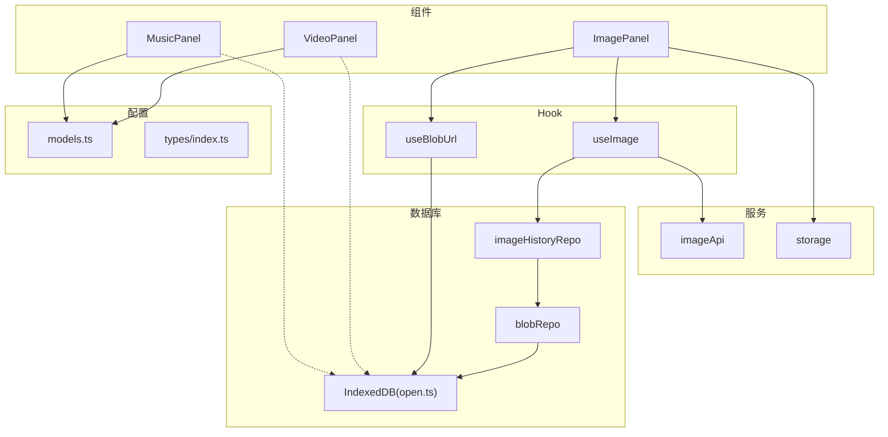
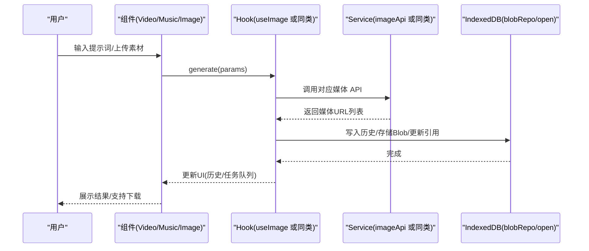
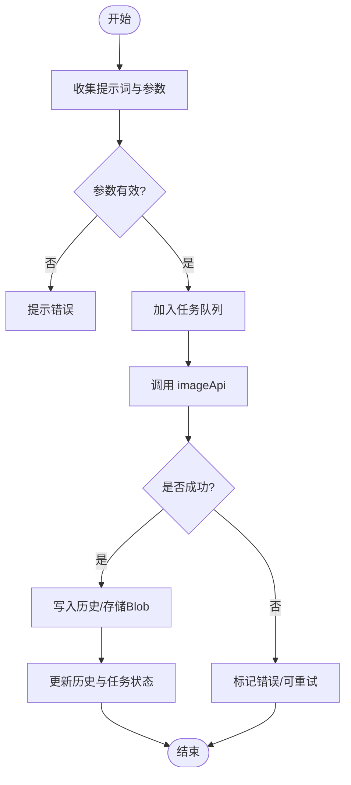
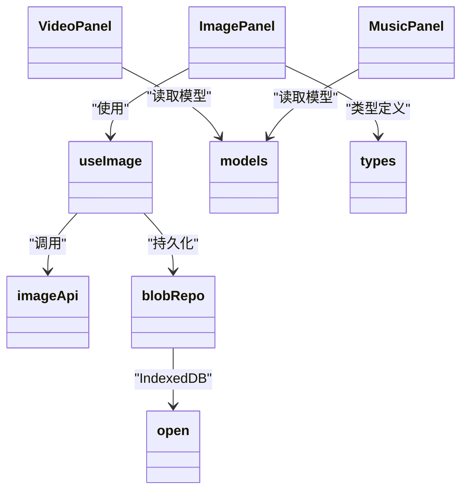

# 多媒体模块

<cite>
**本文引用的文件**
- [VideoPanel.tsx](file://src/components/video/VideoPanel.tsx)
- [MusicPanel.tsx](file://src/components/music/MusicPanel.tsx)
- [ImagePanel.tsx](file://src/components/image/ImagePanel.tsx)
- [useImage.ts](file://src/hooks/useImage.ts)
- [imageApi.ts](file://src/services/imageApi.ts)
- [models.ts](file://src/config/models.ts)
- [index.ts](file://src/types/index.ts)
- [storage.ts](file://src/services/storage.ts)
- [blobRepo.ts](file://src/db/blobRepo.ts)
- [open.ts](file://src/db/open.ts)
- [imageHistoryRepo.ts](file://src/db/imageHistoryRepo.ts)
- [useBlobUrl.ts](file://src/hooks/useBlobUrl.ts)
- [BlobImage.tsx](file://src/components/common/BlobImage.tsx)
- [App.tsx](file://src/App.tsx)
</cite>

## 目录
1. [简介](#简介)
2. [项目结构](#项目结构)
3. [核心组件](#核心组件)
4. [架构总览](#架构总览)
5. [详细组件分析](#详细组件分析)
6. [依赖关系分析](#依赖关系分析)
7. [性能与优化](#性能与优化)
8. [故障排查指南](#故障排查指南)
9. [结论](#结论)
10. [附录：扩展开发指南](#附录扩展开发指南)

## 简介
本模块聚焦 AIShop 的多媒体能力，重点说明视频与音乐面板的预留设计与扩展机制，并基于已实现的图片模块沉淀可复用的架构、数据流与存储策略。目标是帮助开发者快速接入新的媒体类型（视频、音乐），复用统一的模型配置、API 适配、IndexedDB 存储、缓存与传输优化方案。

## 项目结构
- 组件层
  - 视频面板：src/components/video/VideoPanel.tsx（占位）
  - 音乐面板：src/components/music/MusicPanel.tsx（占位）
  - 图片面板：src/components/image/ImagePanel.tsx（完整实现，可作为模板）
- Hook 层
  - useImage.ts：图片生成状态机、并发队列、历史落库、参数派生
  - useBlobUrl.ts：IndexedDB Blob 到 Object URL 的引用计数缓存
- 服务层
  - imageApi.ts：图片 API 请求封装、多上游响应解析、超时与取消
  - storage.ts：轻量设置项的 localStorage 存取
- 数据库层
  - open.ts：IndexedDB 初始化、表结构与连接管理
  - blobRepo.ts：二进制内容寻址存储 + 引用计数、孤儿清理
  - imageHistoryRepo.ts：图片历史写入、blob 引用转换
- 类型与配置
  - types/index.ts：通用类型（含 MediaItem、Model 等）
  - config/models.ts：模型清单（chat/image/video/music）
- 应用入口
  - App.tsx：路由与 Tab 切换（当前仅挂载 chat/image/favorites/me）

图表来源
- [ImagePanel.tsx:1-20](file://src/components/image/ImagePanel.tsx#L1-L20)
- [useImage.ts:1-20](file://src/hooks/useImage.ts#L1-L20)
- [imageApi.ts:1-20](file://src/services/imageApi.ts#L1-L20)
- [blobRepo.ts:1-20](file://src/db/blobRepo.ts#L1-L20)
- [open.ts:1-20](file://src/db/open.ts#L1-L20)
- [models.ts:237-283](file://src/config/models.ts#L237-L283)
- [index.ts:134-141](file://src/types/index.ts#L134-L141)

章节来源
- [App.tsx:58-94](file://src/App.tsx#L58-L94)
- [models.ts:237-283](file://src/config/models.ts#L237-L283)

## 核心组件
- VideoPanel：当前为占位视图，预留“即将上线”展示位，后续将承载视频墙、输入框、模型选择、下载等交互。
- MusicPanel：当前为占位视图，预留“即将上线”展示位，后续将承载音频墙、播放控制、模型选择、下载等交互。
- ImagePanel：完整实现，包含拖拽上传、参考图、比例/尺寸/质量选择、瀑布流照片墙、任务队列、错误重试、下载、IndexedDB 持久化等。

章节来源
- [VideoPanel.tsx:1-8](file://src/components/video/VideoPanel.tsx#L1-L8)
- [MusicPanel.tsx:1-8](file://src/components/music/MusicPanel.tsx#L1-L8)
- [ImagePanel.tsx:369-777](file://src/components/image/ImagePanel.tsx#L369-L777)

## 架构总览
多媒体模块采用“组件 + Hook + Service + DB”的分层设计：
- 组件负责 UI 与用户交互
- Hook 封装业务状态、并发队列、参数派生与持久化
- Service 统一对接上游 API（不同提供商/协议）
- DB 提供 IndexedDB 存储、Blob 引用计数与对象 URL 缓存

图表来源
- [useImage.ts:274-356](file://src/hooks/useImage.ts#L274-L356)
- [imageApi.ts:149-243](file://src/services/imageApi.ts#L149-L243)
- [blobRepo.ts:40-67](file://src/db/blobRepo.ts#L40-L67)
- [open.ts:14-57](file://src/db/open.ts#L14-L57)

## 详细组件分析

### VideoPanel（视频处理组件）
- 现状：占位视图，显示“即将上线”。
- 设计目标：
  - 视频墙：瀑布流/网格布局，卡片支持预览、下载、删除。
  - 输入区：文本提示、参考图/视频上传、模型选择、参数（时长、分辨率、帧率等）。
  - 任务队列：并发控制、重试、取消、错误提示。
  - 存储：视频片段以 Blob 形式存入 IndexedDB，使用引用计数避免重复存储；Object URL 缓存减少重复解码。
  - 传输：优先返回远程 URL，必要时回退到 data URL；下载时按需创建临时 Object URL。
- 扩展点：
  - 在 models.ts 中注册 VIDEO_MODELS 并提供端点映射。
  - 新建 videoApi.ts 仿照 imageApi.ts 封装请求、超时、取消、响应解析。
  - 新建 useVideo.ts 复用 useImage 的状态机模式（队列、历史、参数派生）。
  - 复用 blobRepo 与 useBlobUrl 进行存储与渲染。

章节来源
- [VideoPanel.tsx:1-8](file://src/components/video/VideoPanel.tsx#L1-L8)
- [models.ts:272-283](file://src/config/models.ts#L272-L283)

### MusicPanel（音乐创作组件）
- 现状：占位视图，显示“即将上线”。
- 设计目标：
  - 音频墙：卡片支持播放、暂停、下载、删除。
  - 输入区：提示词、风格/时长/采样率等参数、模型选择。
  - 任务队列：与视频一致，支持并发、重试、取消。
  - 存储：音频以 Blob 存储，引用计数管理；播放时使用 Object URL 缓存。
  - 传输：优先远程 URL，必要时回退 data URL；下载时临时 Object URL。
- 扩展点：
  - 在 models.ts 中注册 MUSIC_MODELS。
  - 新建 musicApi.ts 封装音乐生成 API。
  - 新建 useMusic.ts 复用状态机与持久化逻辑。
  - 复用 blobRepo 与 useBlobUrl。

章节来源
- [MusicPanel.tsx:1-8](file://src/components/music/MusicPanel.tsx#L1-L8)
- [models.ts:272-283](file://src/config/models.ts#L272-L283)

### ImagePanel（图片模块，可复用模板）
- 功能要点：
  - 拖拽上传与参考图：支持外部文件、data URL、blob URL、http(s) URL，自动压缩与校验大小。
  - 参数选择：根据模型动态计算宽高比、尺寸、质量选项。
  - 并发队列：每个任务独立 AbortController，支持取消、重试、错误卡片。
  - 历史与持久化：成功结果写入 IndexedDB，base64 转为 Blob 引用，内存释放。
  - 下载：对 aishop-blob:<id> 协议先取 Blob 再创建临时 Object URL 下载。
  - 渲染：瀑布流照片墙，懒加载与占位，支持从照片墙拖拽参考图到输入区。
- 关键流程（生成）：
  - 用户提交 -> Hook 构建参数 -> 调用 imageApi -> 解析响应 -> 写入历史/存储 -> 更新 UI。

图表来源
- [useImage.ts:274-356](file://src/hooks/useImage.ts#L274-L356)
- [imageApi.ts:149-243](file://src/services/imageApi.ts#L149-L243)
- [imageHistoryRepo.ts:1-33](file://src/db/imageHistoryRepo.ts#L1-L33)

章节来源
- [ImagePanel.tsx:369-777](file://src/components/image/ImagePanel.tsx#L369-L777)
- [useImage.ts:123-469](file://src/hooks/useImage.ts#L123-L469)
- [imageApi.ts:1-257](file://src/services/imageApi.ts#L1-L257)

## 依赖关系分析
- 组件依赖 Hook：VideoPanel/MusicPanel 未来将依赖 useVideo/useMusic；ImagePanel 依赖 useImage。
- Hook 依赖 Service：统一通过 imageApi 或同类 service 调用上游。
- Hook 依赖 DB：通过 blobRepo/open/imageHistoryRepo 管理持久化与引用计数。
- 配置与类型：所有媒体类型共享 types/index.ts 中的 Model、MediaItem 等；模型清单集中在 models.ts。

图表来源
- [ImagePanel.tsx:1-20](file://src/components/image/ImagePanel.tsx#L1-L20)
- [useImage.ts:1-20](file://src/hooks/useImage.ts#L1-L20)
- [imageApi.ts:1-20](file://src/services/imageApi.ts#L1-L20)
- [blobRepo.ts:1-20](file://src/db/blobRepo.ts#L1-L20)
- [open.ts:1-20](file://src/db/open.ts#L1-L20)
- [models.ts:237-283](file://src/config/models.ts#L237-L283)
- [index.ts:134-141](file://src/types/index.ts#L134-L141)

章节来源
- [App.tsx:58-94](file://src/App.tsx#L58-L94)
- [models.ts:237-283](file://src/config/models.ts#L237-L283)

## 性能与优化
- 存储优化
  - 内容寻址存储：相同内容的 Blob 只存一份，通过引用计数管理生命周期。
  - 批量清理：孤儿 Blob 在空闲时扫描回收，避免关键路径写放大。
  - 历史项中保留远程 URL，仅在需要本地保存时才转 Blob，降低空间占用。
- 渲染优化
  - Object URL 引用计数缓存：同一 Blob 多次渲染共用 URL，释放归零时撤销，避免内存泄漏。
  - 懒加载与占位：瀑布流与图片占位提升首屏体验。
- 传输优化
  - 超时与取消：统一 120s 超时，支持外部取消信号合并，避免无效等待。
  - 多上游兼容：自动识别多种响应格式，提取 URL 列表，提高鲁棒性。
- 建议
  - 视频/音乐首次预览尽量使用远程 URL，点击播放/下载再拉取或转 Blob。
  - 大文件分片/断点续传可在 Service 层实现，Hook 层保持状态机不变。

章节来源
- [blobRepo.ts:126-167](file://src/db/blobRepo.ts#L126-L167)
- [useBlobUrl.ts:30-61](file://src/hooks/useBlobUrl.ts#L30-L61)
- [imageApi.ts:183-216](file://src/services/imageApi.ts#L183-L216)

## 故障排查指南
- 无法加载图片/媒体
  - 检查 IndexedDB 是否存在对应 Blob，确认引用计数未归零。
  - 若为远程 URL，检查 CORS 与有效期。
- 生成失败/超时
  - 查看任务队列错误卡片信息，确认是否为上游错误或网络问题。
  - 检查 API Key 与模型端点配置是否正确。
- 存储空间不足
  - 触发孤儿 Blob 清理，释放无用资源。
- 常见问题定位
  - 下载失败：aishop-blob 协议需先取 Blob 再生成临时 Object URL。
  - 拖拽参考图失败：确保文件类型与大小限制合理，异常时提示用户。

章节来源
- [imageApi.ts:218-243](file://src/services/imageApi.ts#L218-L243)
- [blobRepo.ts:126-167](file://src/db/blobRepo.ts#L126-L167)
- [ImagePanel.tsx:631-662](file://src/components/image/ImagePanel.tsx#L631-L662)

## 结论
当前视频与音乐面板为预留占位，但整体架构已具备横向扩展能力。通过复用图片模块的 Hook、Service、DB 与缓存策略，可快速落地视频与音乐的多媒体能力。建议在 models.ts 中注册新模型，在 services 中新增对应 API 封装，在 hooks 中复用状态机与持久化逻辑，即可实现一致的体验与性能。

## 附录：扩展开发指南

### 添加新的媒体类型（以视频为例）
- 步骤
  1. 在 models.ts 中添加 VIDEO_MODELS 条目，并完善 getModelsByType 分支。
  2. 新建 videoApi.ts，参照 imageApi.ts 实现：
     - 模型 → 端点映射
     - 请求体构建（提示词、参数、参考素材）
     - 响应解析（URL 列表）
     - 超时与取消、错误处理
  3. 新建 useVideo.ts，复用 useImage 的模式：
     - 状态：selectedModel、uploadedImages、pendingTasks、history
     - 参数派生：时长、分辨率、帧率等
     - 执行：executeTask/generate/retry/cancel/dismiss
     - 持久化：写入历史、Blob 引用转换、尺寸/时长元数据
  4. 在 VideoPanel 中集成 useVideo，实现视频墙、输入区、下载等。
  5. 在 App.tsx 中增加视频 Tab 路由与挂载。

- 关键点
  - 使用 blobRepo 存储视频片段，引用计数避免重复。
  - 使用 useBlobUrl 渲染视频预览，释放时撤销 URL。
  - 下载时按需创建临时 Object URL，避免长期占用内存。

章节来源
- [models.ts:272-283](file://src/config/models.ts#L272-L283)
- [imageApi.ts:149-243](file://src/services/imageApi.ts#L149-L243)
- [useImage.ts:274-356](file://src/hooks/useImage.ts#L274-L356)
- [blobRepo.ts:40-67](file://src/db/blobRepo.ts#L40-L67)
- [useBlobUrl.ts:30-61](file://src/hooks/useBlobUrl.ts#L30-L61)
- [App.tsx:58-94](file://src/App.tsx#L58-L94)

### 多媒体资源的存储、缓存与传输优化策略
- 存储
  - 内容寻址：相同内容只存一份，refCount 管理生命周期。
  - 历史项优先保留远程 URL，仅在需要本地保存时转 Blob。
  - 孤儿清理：空闲时扫描 refCount<=0 的 Blob 并删除。
- 缓存
  - Object URL 引用计数：同一 Blob 多次渲染共用 URL，归零时撤销。
  - 懒加载：首屏不立即解码大媒体，按需加载。
- 传输
  - 超时与取消：统一超时时间，支持外部取消信号合并。
  - 多上游兼容：自动识别响应格式，提取 URL。
  - 下载：对 aishop-blob 协议先取 Blob 再生成临时 Object URL。

章节来源
- [blobRepo.ts:1-167](file://src/db/blobRepo.ts#L1-L167)
- [useBlobUrl.ts:30-61](file://src/hooks/useBlobUrl.ts#L30-L61)
- [imageApi.ts:183-243](file://src/services/imageApi.ts#L183-L243)
- [ImagePanel.tsx:631-662](file://src/components/image/ImagePanel.tsx#L631-L662)

### 与其他模块的集成方式与数据流转机制
- 与聊天模块
  - 共享 types/index.ts 中的 Message、MediaItem 等类型，便于在消息中嵌入媒体附件。
  - 可通过 ArtifactBlock 或 attachments 字段关联生成的媒体。
- 与设置模块
  - 通过 storage.ts 管理轻量设置（如主题、最后使用的模型）。
- 与数据库模块
  - 统一通过 open.ts 获取 IndexedDB 实例，保证连接复用与升级安全。
  - 通过 blobRepo 与 imageHistoryRepo 管理媒体与历史。

章节来源
- [index.ts:44-107](file://src/types/index.ts#L44-L107)
- [storage.ts:11-60](file://src/services/storage.ts#L11-L60)
- [open.ts:14-57](file://src/db/open.ts#L14-L57)

### 实际开发示例与最佳实践
- 示例：实现视频生成
  - 在 models.ts 注册视频模型
  - 在 videoApi.ts 封装请求与响应解析
  - 在 useVideo.ts 实现状态机与持久化
  - 在 VideoPanel 中集成 UI 与交互
  - 在 App.tsx 中挂载视频 Tab
- 最佳实践
  - 统一错误处理：Service 层抛出可读错误，Hook 层转换为任务错误卡片。
  - 资源释放：及时撤销 Object URL，避免内存泄漏。
  - 用户体验：拖拽上传、占位加载、错误重试、下载便捷。
  - 可扩展性：通过配置驱动模型与端点，便于新增媒体类型。

章节来源
- [models.ts:237-283](file://src/config/models.ts#L237-L283)
- [imageApi.ts:149-243](file://src/services/imageApi.ts#L149-L243)
- [useImage.ts:274-356](file://src/hooks/useImage.ts#L274-L356)
- [ImagePanel.tsx:369-777](file://src/components/image/ImagePanel.tsx#L369-L777)
- [App.tsx:58-94](file://src/App.tsx#L58-L94)