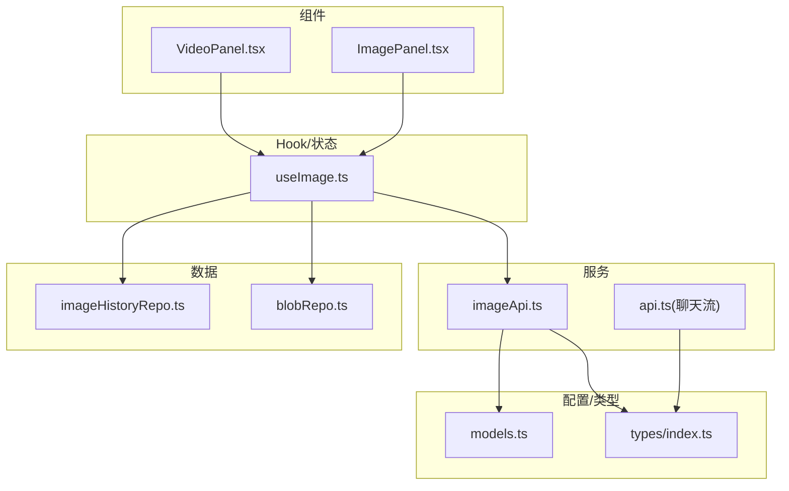
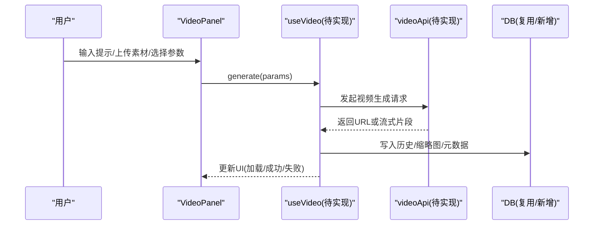
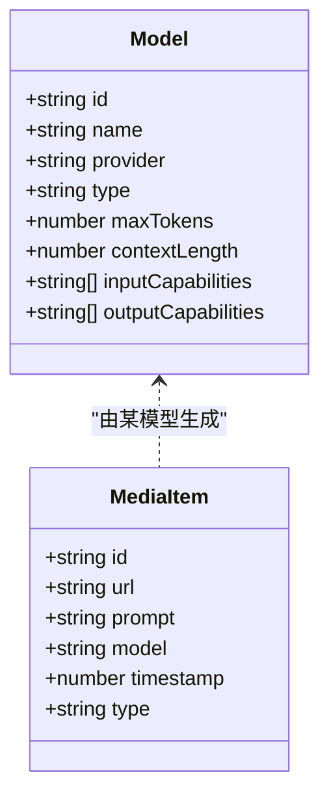

# 视频处理面板

<cite>
**本文引用的文件**
- [VideoPanel.tsx](file://src/components/video/VideoPanel.tsx)
- [models.ts](file://src/config/models.ts)
- [index.ts（类型定义）](file://src/types/index.ts)
- [ImagePanel.tsx](file://src/components/image/ImagePanel.tsx)
- [useImage.ts](file://src/hooks/useImage.ts)
- [imageApi.ts](file://src/services/imageApi.ts)
- [api.ts（聊天流式接口）](file://src/services/api.ts)
- [blobRepo.ts](file://db/blobRepo.ts)
- [imageHistoryRepo.ts](file://db/imageHistoryRepo.ts)
</cite>

## 目录
1. [简介](#简介)
2. [项目结构](#项目结构)
3. [核心组件与预留能力](#核心组件与预留能力)
4. [架构总览](#架构总览)
5. [详细组件分析](#详细组件分析)
6. [依赖关系分析](#依赖关系分析)
7. [性能与传输优化建议](#性能与传输优化建议)
8. [故障排查指南](#故障排查指南)
9. [结论](#结论)
10. [附录：开发指南与最佳实践](#附录开发指南与最佳实践)

## 简介
本文件为 VideoPanel 视频处理组件的专项文档。当前仓库中 VideoPanel 为占位实现，用于预留“视频生成、编辑、处理”等能力的扩展入口。本文基于现有代码结构与图片模块的实现模式，给出可扩展的架构设计、接口约定、状态管理、事件机制、存储与缓存策略、以及与聊天和其他组件的集成方式，帮助开发者快速补齐视频功能。

## 项目结构
- 组件层
  - src/components/video/VideoPanel.tsx：视频面板占位组件
  - src/components/image/ImagePanel.tsx：图片面板完整实现，可作为视频面板参考
- Hook 与状态
  - src/hooks/useImage.ts：图片生成流程的状态机、并发队列、历史持久化
- 服务层
  - src/services/imageApi.ts：图片模型请求封装、多上游适配、超时与错误处理
  - src/services/api.ts：聊天流式接口（可复用流式处理思路）
- 数据层
  - db/imageHistoryRepo.ts：图片历史持久化
  - db/blobRepo.ts：Blob 存储（可用于视频片段或缩略图）
- 配置与类型
  - src/config/models.ts：模型列表与类型枚举（包含 video 类型占位）
  - src/types/index.ts：通用类型（含 MediaItem 等）

图表来源
- [VideoPanel.tsx:1-8](file://src/components/video/VideoPanel.tsx#L1-L8)
- [ImagePanel.tsx:1-800](file://src/components/image/ImagePanel.tsx#L1-L800)
- [useImage.ts:1-469](file://src/hooks/useImage.ts#L1-L469)
- [imageApi.ts:1-257](file://src/services/imageApi.ts#L1-L257)
- [api.ts:44-173](file://src/services/api.ts#L44-L173)
- [models.ts:237-284](file://src/config/models.ts#L237-L284)
- [index.ts:134-141](file://src/types/index.ts#L134-L141)

章节来源
- [VideoPanel.tsx:1-8](file://src/components/video/VideoPanel.tsx#L1-L8)
- [models.ts:237-284](file://src/config/models.ts#L237-L284)
- [index.ts:134-141](file://src/types/index.ts#L134-L141)

## 核心组件与预留能力
- VideoPanel 当前仅渲染“即将上线”提示，作为占位视图，便于后续接入视频能力。
- 类型系统已预留视频相关能力：
  - Model.type 支持 'video'
  - MediaItem.type 支持 'video'
- 模型配置中 VIDEO_MODELS 为空数组，表示尚未提供具体视频模型，但已具备扩展点。

章节来源
- [VideoPanel.tsx:1-8](file://src/components/video/VideoPanel.tsx#L1-L8)
- [index.ts:109-141](file://src/types/index.ts#L109-L141)
- [models.ts:272-284](file://src/config/models.ts#L272-L284)

## 架构总览
建议采用与图片模块一致的“组件 + Hook + 服务 + 数据层”分层架构：
- 组件层：VideoPanel 负责 UI 与用户交互（上传、参数选择、结果展示、下载/分享）
- Hook 层：useVideo（新建）负责状态管理、并发队列、重试/取消、历史持久化
- 服务层：videoApi（新建）封装不同视频模型的请求构建、响应解析、超时控制、错误处理
- 数据层：复用 blobRepo 与 imageHistoryRepo（或新增 videoHistoryRepo）进行本地存储与索引

[此图为概念性流程图，不直接映射到具体源码]

## 详细组件分析

### VideoPanel 占位组件
- 当前行为：居中显示“即将上线”文本
- 扩展点：后续替换为完整的视频工作区（输入区、参数区、结果墙、工具栏）

章节来源
- [VideoPanel.tsx:1-8](file://src/components/video/VideoPanel.tsx#L1-L8)

### 参考实现：ImagePanel 与 useImage
- ImagePanel 展示了完整的媒体面板实现范式：
  - 拖拽/选择上传、参数选择（比例/尺寸/质量）、瀑布流结果展示、下载与删除
  - 使用 MasonryPhotoWall 与 PhotoCard 组合呈现
- useImage 提供了可复用的状态机与并发队列：
  - 任务队列（pendingTasks）、AbortController 取消、重试与错误卡片
  - 历史持久化（IndexedDB），并回填宽高以优化瀑布流布局
  - 针对不同模型动态调整参数选项（GPT vs Gemini）

章节来源
- [ImagePanel.tsx:1-800](file://src/components/image/ImagePanel.tsx#L1-L800)
- [useImage.ts:1-469](file://src/hooks/useImage.ts#L1-L469)

### 服务层：imageApi 的请求封装与多上游适配
- 统一封装不同上游的图片生成接口，自动识别 text-to-image 与 edit 路径
- 兼容多种响应格式，抽取 URL 列表
- 超时控制（120s）与错误信息规范化
- 合并外部 AbortSignal 与内部超时信号

章节来源
- [imageApi.ts:1-257](file://src/services/imageApi.ts#L1-L257)

### 聊天流式接口：streamChat 的可复用思路
- 使用 ReadableStream 分块读取 SSE 数据，解析 usage 与内容增量
- 对不支持的参数做降级重试
- 适用于未来视频流式生成的场景（如进度/帧片段推送）

章节来源
- [api.ts:44-173](file://src/services/api.ts#L44-L173)

## 依赖关系分析
- 类型依赖
  - Model.type 包含 'video'，MediaItem.type 包含 'video'，为视频能力提供类型基础
- 配置依赖
  - VIDEO_MODELS 为空，需按模型接入后填充
- 数据依赖
  - 复用 blobRepo 存储视频片段/缩略图
  - 复用 imageHistoryRepo 或新建 videoHistoryRepo 存储视频历史元数据

图表来源
- [index.ts:109-141](file://src/types/index.ts#L109-L141)

章节来源
- [index.ts:109-141](file://src/types/index.ts#L109-L141)
- [models.ts:272-284](file://src/config/models.ts#L272-L284)

## 性能与传输优化建议
- 上传与压缩
  - 参考图片模块的 compressImage 思路，对上传视频进行关键帧采样与转码，降低体积
  - 限制最大文件大小与时长，避免浏览器卡顿
- 存储与缓存
  - 使用 blobRepo 存储原始视频与缩略图，减少内存占用
  - 对热门视频建立本地缓存索引，缩短二次加载时间
- 传输优化
  - 优先返回缩略图 URL，按需懒加载原片
  - 对于长视频，考虑分段加载或 HLS 播放
- 并发与取消
  - 使用 AbortController 管理并发任务，支持用户取消与超时
  - 失败任务支持重试，保留原始参数

[本节为通用指导，不直接引用具体源码]

## 故障排查指南
- 常见错误定位
  - 未配置 API Key：检查设置服务是否已配置对应 Provider 的密钥
  - 上游超时：确认网络与服务端可用性，必要时延长超时或启用重试
  - 响应格式不符：在服务层增加日志与容错分支，确保兼容多上游
- 调试建议
  - 在 Hook 层记录任务生命周期（创建、执行、完成、失败）
  - 在服务层打印请求体与响应头，便于定位协议差异
  - 对 Blob 读写异常，检查 IndexedDB 权限与存储空间

章节来源
- [imageApi.ts:149-243](file://src/services/imageApi.ts#L149-L243)
- [useImage.ts:275-356](file://src/hooks/useImage.ts#L275-L356)

## 结论
VideoPanel 当前为占位实现，已预留类型与配置扩展点。建议参照图片模块的成熟实现，快速搭建视频面板的组件、Hook、服务与数据层，保持统一的并发队列、错误处理、历史持久化与传输优化策略。通过模块化设计与清晰的接口约定，可平滑扩展新的视频处理能力。

[本节为总结性内容，不直接引用具体源码]

## 附录：开发指南与最佳实践

### 如何添加新的视频处理能力
- 步骤概览
  1) 在 models.ts 中添加视频模型条目（type: 'video'）
  2) 新建 videoApi.ts，封装请求构建、响应解析、超时与错误处理
  3) 新建 useVideo.ts，实现状态管理、并发队列、重试/取消、历史持久化
  4) 完善 VideoPanel.tsx，对接 useVideo 与 videoApi
  5) 复用 blobRepo 与 imageHistoryRepo（或新建 videoHistoryRepo）存储视频与元数据
- 关键要点
  - 保持与图片模块一致的任务模型（PendingTask、history item）
  - 统一错误消息与重试策略
  - 对大文件进行压缩与分片传输

章节来源
- [models.ts:272-284](file://src/config/models.ts#L272-L284)
- [imageApi.ts:1-257](file://src/services/imageApi.ts#L1-L257)
- [useImage.ts:1-469](file://src/hooks/useImage.ts#L1-L469)

### 与聊天模块及其他组件的集成
- 数据流转
  - 将视频结果以 MediaItem 形式纳入会话上下文，供聊天消息引用
  - 使用 MessageContent 的扩展字段承载视频 URL 与元数据
- 组件协作
  - 聊天消息气泡可嵌入视频播放器（参考 MessageImage 的思路）
  - 侧边栏或收藏面板可复用现有结构展示视频条目

章节来源
- [index.ts:53-107](file://src/types/index.ts#L53-L107)
- [index.ts:134-141](file://src/types/index.ts#L134-L141)

### 实际开发示例（步骤级）
- 新建 videoApi.ts
  - 定义模型到端点的映射
  - 构建请求体（提示词、参考视频、分辨率、时长、风格等）
  - 解析响应（URL 列表或流式片段）
- 新建 useVideo.ts
  - 维护 selectedModel、uploadedVideos、参数、pendingTasks、history
  - 实现 generate、retryTask、cancelTask、deleteHistoryItem
- 完善 VideoPanel.tsx
  - 接入 useVideo，实现上传、参数选择、结果展示、下载/分享
- 数据层
  - 使用 blobRepo 存储视频片段与缩略图
  - 使用 imageHistoryRepo 或新建 videoHistoryRepo 存储历史

章节来源
- [useImage.ts:275-356](file://src/hooks/useImage.ts#L275-L356)
- [imageApi.ts:65-143](file://src/services/imageApi.ts#L65-L143)
- [blobRepo.ts](file://db/blobRepo.ts)
- [imageHistoryRepo.ts](file://db/imageHistoryRepo.ts)

### 最佳实践建议
- 统一抽象：将“生成类”能力抽象为 Hook + Service 的组合，便于复用
- 错误边界：在服务层捕获并分类错误，在 Hook 层提供重试与降级
- 性能优先：先展示缩略图/低清预览，再按需加载高清资源
- 可观测性：记录关键指标（耗时、成功率、失败原因）以便持续优化

[本节为通用指导，不直接引用具体源码]