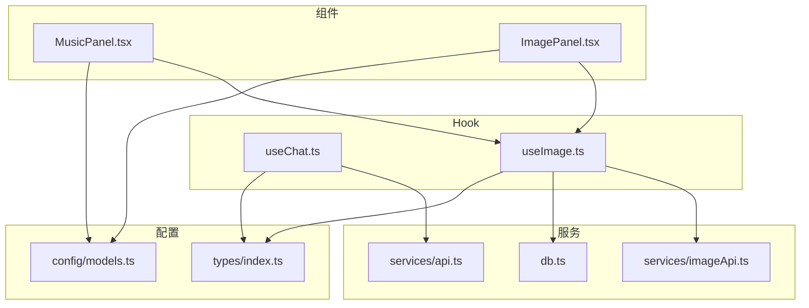
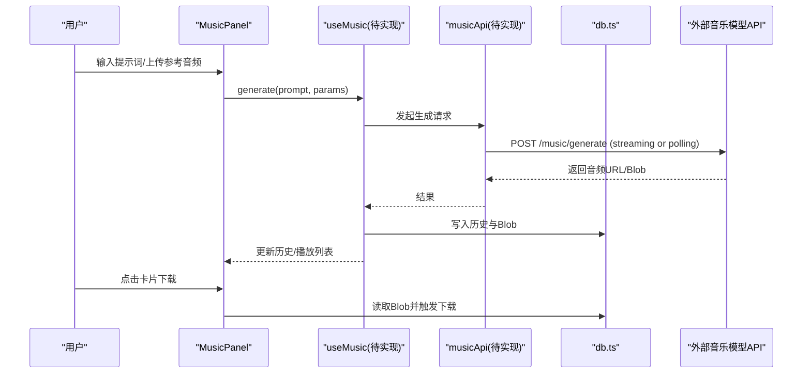
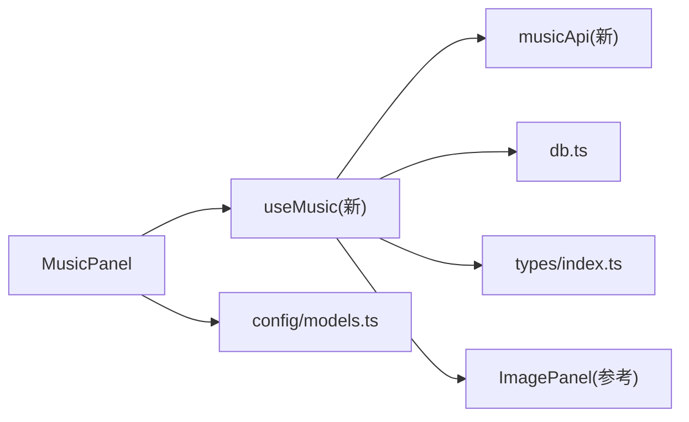
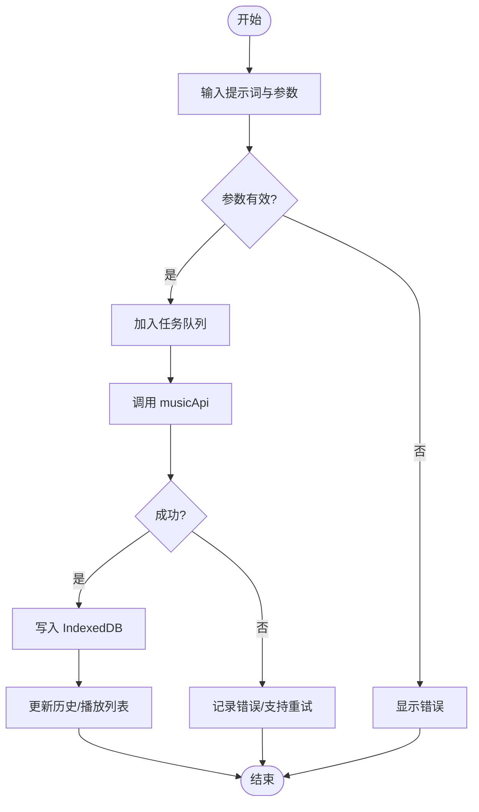

# 音乐创作面板

<cite>
**本文引用的文件**
- [MusicPanel.tsx](file://src/components/music/MusicPanel.tsx)
- [index.ts（类型定义）](file://src/types/index.ts)
- [models.ts（模型配置）](file://src/config/models.ts)
- [api.ts（聊天流式 API）](file://src/services/api.ts)
- [useChat.ts（聊天 Hook）](file://src/hooks/useChat.ts)
- [ImagePanel.tsx（图片面板参考实现）](file://src/components/image/ImagePanel.tsx)
- [useImage.ts（图片 Hook 参考实现）](file://src/hooks/useImage.ts)
- [imageApi.ts（图片 API 封装）](file://src/services/imageApi.ts)
- [db.ts（IndexedDB 工具，引用处）](file://src/db.ts)
- [需求文档.md](file://需求文档.md)
</cite>

## 目录
1. [简介](#简介)
2. [项目结构](#项目结构)
3. [核心组件](#核心组件)
4. [架构总览](#架构总览)
5. [详细组件分析](#详细组件分析)
6. [依赖关系分析](#依赖关系分析)
7. [性能与存储优化](#性能与存储优化)
8. [故障排查指南](#故障排查指南)
9. [结论](#结论)
10. [附录：开发指南与最佳实践](#附录开发指南与最佳实践)

## 简介
本文件为 MusicPanel 音乐创作组件的完整技术文档。当前 MusicPanel 处于预留占位阶段，界面显示“即将上线”，但项目已具备完善的类型体系、模型注册机制、以及可复用的媒体生成/历史/下载/存储模式（以图片模块为蓝本）。本文档将基于现有代码，说明音乐功能的扩展点、接口设计、状态管理、事件处理、以及与聊天和其他组件的集成方式，并提供音频资源存储策略、缓存机制和传输优化方案，帮助开发者快速落地音乐能力。

## 项目结构
- 组件层
  - 音乐：src/components/music/MusicPanel.tsx（占位）
  - 图片：src/components/image/ImagePanel.tsx（可复用参考）
- Hook 层
  - 聊天：src/hooks/useChat.ts（流式对话、上下文压缩、联网搜索等）
  - 图片：src/hooks/useImage.ts（并发队列、历史、参数选择、下载）
- 服务层
  - 聊天 API：src/services/api.ts（SSE 流式请求、用量解析）
  - 图片 API：src/services/imageApi.ts（图片生成封装）
  - IndexedDB：src/db.ts（Blob/历史记录存取）
- 配置层
  - 模型：src/config/models.ts（chat/image/video/music 模型数组及按类型获取）
  - 类型：src/types/index.ts（Message、MediaItem、Model、ImageHistoryItem 等）
- 需求：需求文档.md（明确音乐模式交互与下载能力）

图表来源
- [MusicPanel.tsx:1-8](file://src/components/music/MusicPanel.tsx#L1-L8)
- [ImagePanel.tsx:1-100](file://src/components/image/ImagePanel.tsx#L1-L100)
- [useImage.ts:1-120](file://src/hooks/useImage.ts#L1-L120)
- [useChat.ts:1-60](file://src/hooks/useChat.ts#L1-L60)
- [api.ts:44-173](file://src/services/api.ts#L44-L173)
- [models.ts:237-284](file://src/config/models.ts#L237-L284)
- [index.ts:134-141](file://src/types/index.ts#L134-L141)

章节来源
- [MusicPanel.tsx:1-8](file://src/components/music/MusicPanel.tsx#L1-L8)
- [models.ts:237-284](file://src/config/models.ts#L237-L284)
- [index.ts:134-141](file://src/types/index.ts#L134-L141)

## 核心组件
- MusicPanel：当前为占位组件，仅展示“即将上线”。后续应参照 ImagePanel 的模式，提供输入区、模型选择、音频墙、任务队列、下载与历史管理等能力。
- 类型与模型：
  - MediaItem 已支持 type: 'audio'，可用于统一媒体项表示。
  - Model.type 已包含 'music'，getModelsByType('music') 返回 MUSIC_MODELS（当前为空数组），便于后续接入音乐模型。
- 参考实现：
  - ImagePanel + useImage：提供了完整的“输入→参数选择→并发队列→API调用→历史持久化→下载”闭环，可直接迁移到音乐场景。

章节来源
- [MusicPanel.tsx:1-8](file://src/components/music/MusicPanel.tsx#L1-L8)
- [index.ts:134-141](file://src/types/index.ts#L134-L141)
- [models.ts:237-284](file://src/config/models.ts#L237-L284)
- [ImagePanel.tsx:1-120](file://src/components/image/ImagePanel.tsx#L1-L120)
- [useImage.ts:123-215](file://src/hooks/useImage.ts#L123-L215)

## 架构总览
音乐功能建议采用与图片一致的架构：
- 组件层：MusicPanel 负责 UI 与用户交互（输入、模型选择、音频墙、下载、错误提示）。
- Hook 层：useMusic（新建）封装状态、并发队列、参数校验、API 调用、历史读写、下载逻辑。
- 服务层：musicApi（新建）封装音乐生成 API 调用；复用 db.ts 进行 Blob/历史存储。
- 配置层：在 models.ts 中注册音乐模型；在 types/index.ts 中复用 MediaItem 或扩展 AudioHistoryItem。

图表来源
- [ImagePanel.tsx:60-92](file://src/components/image/ImagePanel.tsx#L60-L92)
- [useImage.ts:274-356](file://src/hooks/useImage.ts#L274-L356)
- [api.ts:44-173](file://src/services/api.ts#L44-L173)

## 详细组件分析

### MusicPanel 当前实现与扩展点
- 现状：占位组件，无业务逻辑。
- 扩展点：
  - 输入区：文本提示词、可选参考音频/歌词/风格标签。
  - 模型选择：复用 ModelSelector，数据源来自 getModelsByType('music')。
  - 音频墙：复用 MasonryPhotoWall 思路，渲染音频卡片（播放、时长、波形预览）。
  - 任务队列：PendingAudioTask 类似 PendingImageTask，支持 loading/error/retry/cancel。
  - 下载：复用 triggerDownload 思路，从 IndexedDB 取 Blob 后创建临时 URL 下载。

章节来源
- [MusicPanel.tsx:1-8](file://src/components/music/MusicPanel.tsx#L1-L8)
- [models.ts:275-284](file://src/config/models.ts#L275-L284)
- [ImagePanel.tsx:60-92](file://src/components/image/ImagePanel.tsx#L60-L92)

### 类型与数据模型
- MediaItem：type 已包含 'audio'，可作为通用媒体项。
- 建议新增：
  - AudioHistoryItem：继承 MediaItem 或独立，包含 urls[]、prompt、model、timestamp、duration、format、sampleRate 等。
  - PendingAudioTask：id、prompt、model、params、status、error、createdAt。
- 模型类型：Model.type 已支持 'music'，MUSIC_MODELS 待填充。

章节来源
- [index.ts:134-141](file://src/types/index.ts#L134-L141)
- [index.ts:109-123](file://src/types/index.ts#L109-L123)
- [models.ts:237-284](file://src/config/models.ts#L237-L284)

### 状态管理与事件处理
- 状态：
  - selectedModel、uploadedReferences（参考音频/歌词）、pendingTasks、history。
  - 参数：aspectRatio（不适用）、size（采样率/时长）、quality（比特率/格式）。
- 事件：
  - 提交生成：validate → enqueue task → call API → update history。
  - 取消/重试：AbortController 控制取消；失败时保留原参数重试。
  - 下载：从 IndexedDB 取 Blob → 创建临时 URL → 触发浏览器下载。
  - 播放：使用 HTMLAudioElement 或 Web Audio API 播放本地 Blob URL。

章节来源
- [useImage.ts:274-469](file://src/hooks/useImage.ts#L274-L469)
- [ImagePanel.tsx:60-92](file://src/components/image/ImagePanel.tsx#L60-L92)

### 与聊天模块的集成
- 复用 useChat 的流式能力（如需流式歌词/元数据生成），或独立 musicApi 直接返回音频结果。
- 若需在聊天中插入音频消息，可复用 MessageContent 的扩展或新增 audio_url 字段，并在聊天渲染中识别播放。
- 共享 IndexedDB 存储，确保跨模块一致的历史与 Blob 管理。

章节来源
- [useChat.ts:494-783](file://src/hooks/useChat.ts#L494-L783)
- [index.ts:53-57](file://src/types/index.ts#L53-L57)

## 依赖关系分析
- MusicPanel 依赖：
  - 模型配置：getModelsByType('music')
  - 类型：MediaItem、Model
  - 参考实现：ImagePanel 的 UI 模式与下载逻辑
  - Hook：useMusic（新建）
- useMusic 依赖：
  - musicApi（新建）
  - db.ts（Blob/历史）
  - types/index.ts（数据结构）
- 服务层：
  - api.ts 展示了流式请求、错误回退、用量解析等模式，可借鉴于音乐流式元数据或分片音频。

图表来源
- [models.ts:275-284](file://src/config/models.ts#L275-L284)
- [useImage.ts:274-469](file://src/hooks/useImage.ts#L274-L469)
- [api.ts:44-173](file://src/services/api.ts#L44-L173)

章节来源
- [models.ts:275-284](file://src/config/models.ts#L275-L284)
- [useImage.ts:274-469](file://src/hooks/useImage.ts#L274-L469)
- [api.ts:44-173](file://src/services/api.ts#L44-L173)

## 性能与存储优化
- 存储策略
  - 音频文件以 Blob 形式存入 IndexedDB，避免内存常驻大对象。
  - 历史记录仅保存元数据与 aishop-blob:<id> 引用，减少序列化体积。
  - 下载时按需读取 Blob 并创建临时 URL，完成后及时 revoke。
- 缓存机制
  - 对热门音频可建立短期内存缓存（如 WeakMap 或 Map），结合 LRU 淘汰。
  - 对于长音频，优先使用分段加载与断点续传（服务端支持 Range 时）。
- 传输优化
  - 优先使用流式响应（SSE/WebSocket）接收音频分片，边下边播。
  - 合理设置超时与重试策略，失败时降级为轮询或全量下载。
  - 压缩与转码：根据设备能力选择合适格式（mp3/aac/wav）与比特率。

[本节为通用指导，不直接分析具体文件]

## 故障排查指南
- 常见问题
  - API Key 未配置：参考聊天模块的错误提示与回退逻辑。
  - 网络错误/超时：记录错误信息，支持重试与取消。
  - 下载失败：检查 Blob 是否存在，确认临时 URL 是否及时释放。
  - 播放失败：检查 MIME 类型与浏览器兼容性。
- 调试建议
  - 打印任务队列状态（loading/error/success）。
  - 记录 IndexedDB 写入成功与否。
  - 捕获 AbortError 区分用户取消与系统超时。

章节来源
- [api.ts:102-118](file://src/services/api.ts#L102-L118)
- [useImage.ts:336-356](file://src/hooks/useImage.ts#L336-L356)
- [ImagePanel.tsx:60-92](file://src/components/image/ImagePanel.tsx#L60-L92)

## 结论
MusicPanel 当前为预留占位，但项目已具备完善的类型、模型注册、以及可复用的媒体生成/历史/下载/存储模式。通过参照 ImagePanel 的实现路径，可以快速构建音乐创作面板，包括输入、模型选择、音频墙、任务队列、下载与历史管理。建议在 models.ts 中注册音乐模型，在 services 中新增 musicApi，在 hooks 中新增 useMusic，并在 MusicPanel 中集成 UI 与交互。

[本节为总结性内容，不直接分析具体文件]

## 附录：开发指南与最佳实践

### 如何添加新的音频处理能力
- 步骤
  1. 在 config/models.ts 中添加音乐模型条目（type: 'music'），并完善价格、能力等字段。
  2. 在 types/index.ts 中定义 AudioHistoryItem、PendingAudioTask（可参考 ImageHistoryItem/PendingImageTask）。
  3. 在 services 中新增 musicApi.ts，封装音乐生成 API 调用（支持流式或轮询）。
  4. 在 hooks 中新增 useMusic.ts，实现：
     - 状态管理：selectedModel、uploadedReferences、pendingTasks、history
     - 参数校验与默认值
     - 并发队列：executeTask、retryTask、cancelTask
     - 历史持久化：putAudioHistoryItem、listAudioHistory
     - 下载：triggerDownload（复用图片模块思路）
  5. 在 components/music/MusicPanel.tsx 中实现 UI：
     - 输入区、模型选择、音频墙、任务卡片、下载按钮
  6. 复用 db.ts 的 Blob 存取与 parseBlobRefUrl/getBlob 工具。

章节来源
- [models.ts:237-284](file://src/config/models.ts#L237-L284)
- [index.ts:177-214](file://src/types/index.ts#L177-L214)
- [useImage.ts:274-469](file://src/hooks/useImage.ts#L274-L469)
- [ImagePanel.tsx:60-92](file://src/components/image/ImagePanel.tsx#L60-L92)

### 音频资源的存储策略、缓存机制与传输优化
- 存储：IndexedDB 存 Blob，历史记录存元数据与引用。
- 缓存：内存 LRU 缓存热门音频；长音频分段加载。
- 传输：优先流式；失败降级；合理超时与重试。

[本节为通用指导，不直接分析具体文件]

### 与聊天模块和其他组件的集成方式
- 聊天中插入音频消息：扩展 MessageContent 或新增 audio_url 字段，渲染时识别播放。
- 共享 IndexedDB：跨模块一致的历史与 Blob 管理。
- 复用 UI 模式：音频墙、任务卡片、下载逻辑与图片模块一致。

章节来源
- [useChat.ts:494-783](file://src/hooks/useChat.ts#L494-L783)
- [index.ts:53-57](file://src/types/index.ts#L53-L57)

### 实际的音频功能开发示例（流程）
- 用户输入提示词与参数 → 进入任务队列 → 调用 musicApi → 返回音频 URL/Blob → 写入 IndexedDB → 更新历史 → 用户点击下载或播放。

[本节为概念流程图，不直接映射具体文件]

### 最佳实践建议
- 遵循图片模块的架构与命名约定，保持代码一致性。
- 使用 AbortController 管理取消与超时，提升用户体验。
- 对大文件进行分片与流式处理，避免主线程阻塞。
- 严格校验输入与输出，提供友好的错误提示与重试机制。
- 利用 IndexedDB 的异步特性，避免同步 I/O 阻塞。

[本节为通用指导，不直接分析具体文件]