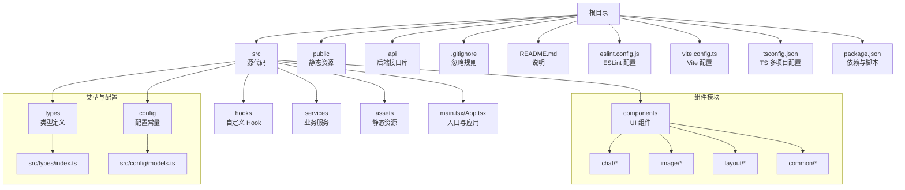
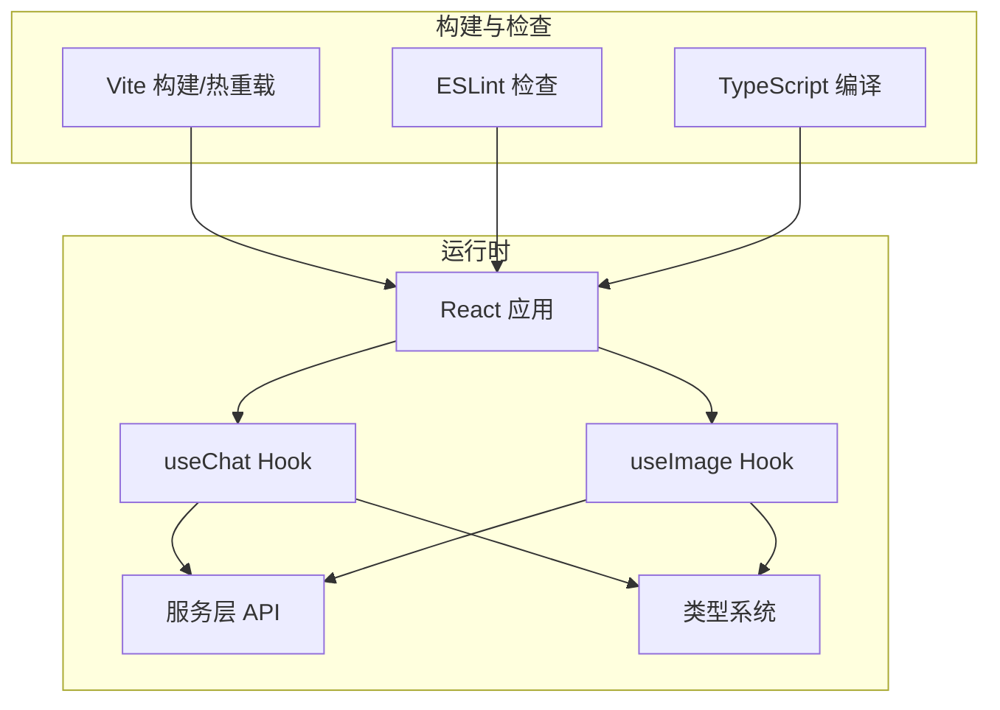
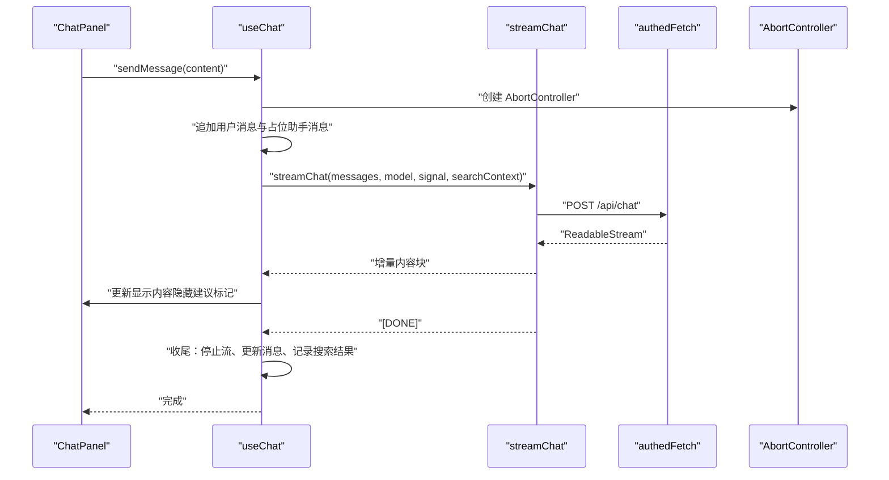
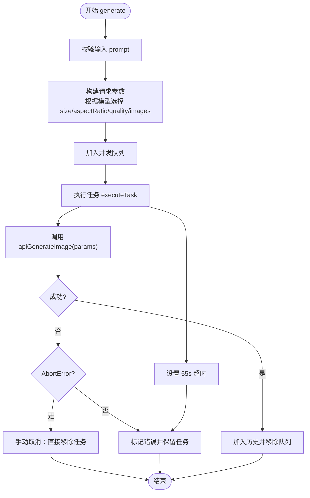
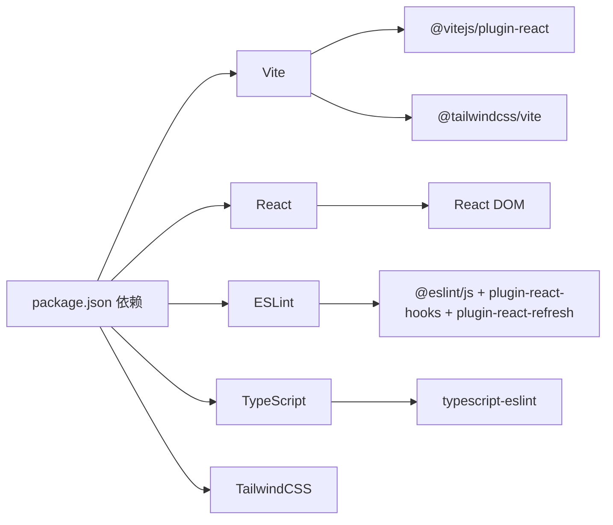

# 代码规范

<cite>
**本文引用的文件**
- [eslint.config.js](file://eslint.config.js)
- [vite.config.ts](file://vite.config.ts)
- [tsconfig.json](file://tsconfig.json)
- [tsconfig.app.json](file://tsconfig.app.json)
- [tsconfig.node.json](file://tsconfig.node.json)
- [package.json](file://package.json)
- [README.md](file://README.md)
- [src/types/index.ts](file://src/types/index.ts)
- [src/hooks/useChat.ts](file://src/hooks/useChat.ts)
- [src/hooks/useImage.ts](file://src/hooks/useImage.ts)
- [src/components/chat/ChatPanel.tsx](file://src/components/chat/ChatPanel.tsx)
- [src/config/models.ts](file://src/config/models.ts)
- [src/services/api.ts](file://src/services/api.ts)
- [src/main.tsx](file://src/main.tsx)
</cite>

## 目录
1. [简介](#简介)
2. [项目结构](#项目结构)
3. [核心组件](#核心组件)
4. [架构总览](#架构总览)
5. [详细组件分析](#详细组件分析)
6. [依赖关系分析](#依赖关系分析)
7. [性能考量](#性能考量)
8. [故障排查指南](#故障排查指南)
9. [结论](#结论)
10. [附录](#附录)

## 简介
本文件为 AIShop 项目的代码规范文档，聚焦于以下方面：
- ESLint 配置与规则实践：JavaScript/TypeScript 代码检查、React Hooks 规则、Vite 热重载规则
- TypeScript 类型系统：接口定义、泛型使用、类型安全与编译配置
- 组件命名与文件组织：组件命名、文件扩展名、目录结构
- 代码风格指南：缩进、注释、变量命名、函数定义
- 代码审查标准与检查清单：质量、性能、安全性评估要点

本规范以仓库现有配置与实现为基础，结合最佳实践给出可操作的指导。

## 项目结构
AIShop 采用基于功能模块的目录组织方式，前端核心位于 src 目录，包含组件、钩子、服务、类型与配置等。构建与开发工具由 Vite、ESLint、TypeScript 驱动。

图表来源
- [vite.config.ts:1-11](file://vite.config.ts#L1-L11)
- [tsconfig.json:1-8](file://tsconfig.json#L1-L8)
- [package.json:1-40](file://package.json#L1-L40)

章节来源
- [vite.config.ts:1-11](file://vite.config.ts#L1-L11)
- [tsconfig.json:1-8](file://tsconfig.json#L1-L8)
- [package.json:1-40](file://package.json#L1-L40)

## 核心组件
- ESLint 配置：统一推荐规则集，覆盖 JS/TS、React Hooks、React Refresh（Vite）、浏览器全局变量等
- TypeScript 编译：多项目引用配置，分别针对应用与 Node 工具链；启用严格未使用检测与语法擦除
- Vite 构建：集成 React 插件与 TailwindCSS 插件，支持热重载与快速构建
- 自定义 Hook：useChat、useImage 提供聊天与图像生成的业务逻辑与状态管理
- 类型系统：集中定义消息、会话、媒体、模型等核心类型，确保跨模块一致性

章节来源
- [eslint.config.js:1-23](file://eslint.config.js#L1-L23)
- [tsconfig.app.json:1-26](file://tsconfig.app.json#L1-L26)
- [tsconfig.node.json:1-25](file://tsconfig.node.json#L1-L25)
- [vite.config.ts:1-11](file://vite.config.ts#L1-L11)
- [src/hooks/useChat.ts:1-370](file://src/hooks/useChat.ts#L1-L370)
- [src/hooks/useImage.ts:1-393](file://src/hooks/useImage.ts#L1-L393)
- [src/types/index.ts:1-103](file://src/types/index.ts#L1-L103)

## 架构总览
AIShop 的前端采用 React + TypeScript + Vite 技术栈，通过自定义 Hook 管理业务状态，服务层封装 API 调用，类型系统贯穿全链路，确保类型安全与可维护性。

图表来源
- [src/main.tsx:1-11](file://src/main.tsx#L1-L11)
- [src/hooks/useChat.ts:1-370](file://src/hooks/useChat.ts#L1-L370)
- [src/hooks/useImage.ts:1-393](file://src/hooks/useImage.ts#L1-L393)
- [src/services/api.ts:1-83](file://src/services/api.ts#L1-L83)
- [eslint.config.js:1-23](file://eslint.config.js#L1-L23)
- [vite.config.ts:1-11](file://vite.config.ts#L1-L11)
- [tsconfig.app.json:1-26](file://tsconfig.app.json#L1-L26)

## 详细组件分析

### ESLint 配置与规则实践
- 规则来源
  - 推荐规则集：JS 推荐、TS 推荐、React Hooks 推荐、React Refresh（Vite）
  - 语言选项：浏览器全局变量可用
  - 忽略 dist 目录
- 建议增强
  - 生产环境建议启用类型感知规则，参考 README 中的类型检查配置片段
  - 可选引入 React X/DOM 插件以强化 React 相关规则
- 与 Vite 的集成
  - 使用 React Refresh 规则适配 Vite 的热重载机制，减少刷新带来的上下文丢失

章节来源
- [eslint.config.js:1-23](file://eslint.config.js#L1-L23)
- [README.md:14-74](file://README.md#L14-L74)

### TypeScript 类型系统与编译配置
- 类型定义
  - 核心类型集中在 src/types/index.ts，涵盖消息、会话、媒体、模型、Tab 模式、并发任务等
  - 使用联合类型与接口组合表达复杂数据结构，保证字段约束与可扩展性
- 编译配置
  - 多项目引用：tsconfig.json 引用 tsconfig.app.json 与 tsconfig.node.json
  - 应用侧：启用 JSX、严格未使用检测、语法擦除仅保留类型信息
  - Node 侧：面向工具链与配置文件的编译设置
- 泛型与类型安全
  - 在 Hook 返回值中使用泛型约束参数类型，确保调用方传入正确的数据结构
  - 在服务层使用类型别名与接口约束 API 输入输出，降低运行时风险

章节来源
- [src/types/index.ts:1-103](file://src/types/index.ts#L1-L103)
- [tsconfig.json:1-8](file://tsconfig.json#L1-L8)
- [tsconfig.app.json:1-26](file://tsconfig.app.json#L1-L26)
- [tsconfig.node.json:1-25](file://tsconfig.node.json#L1-L25)

### 组件命名约定与文件组织
- 命名约定
  - 组件文件采用帕斯卡命名（如 ChatPanel.tsx），便于区分模块与组件
  - Hook 文件以 use 前缀命名（如 useChat.ts、useImage.ts），遵循 React Hooks 约定
- 文件扩展名
  - React 组件使用 .tsx 扩展名，普通 TS 文件使用 .ts
- 目录结构
  - components 下按功能域划分（chat、image、layout、common）
  - hooks、services、types、config 分层清晰，职责单一
- 导出策略
  - 组件默认导出，便于 import { Component } from '...' 或 import Component from '...'

章节来源
- [src/components/chat/ChatPanel.tsx:1-354](file://src/components/chat/ChatPanel.tsx#L1-L354)
- [src/hooks/useChat.ts:1-370](file://src/hooks/useChat.ts#L1-L370)
- [src/hooks/useImage.ts:1-393](file://src/hooks/useImage.ts#L1-L393)

### 代码风格指南
- 缩进与空格
  - 使用一致的缩进宽度，避免混用制表符与空格
- 注释
  - 对外暴露的 Hook 返回值与复杂逻辑添加简要注释，说明用途与边界条件
- 变量命名
  - 使用语义化命名，避免缩写；常量使用全大写+下划线；私有辅助函数使用小驼峰
- 函数定义
  - 优先使用函数声明或箭头函数表达式，保持返回值类型明确
  - 对外暴露的回调参数使用类型约束，避免宽泛的 any

章节来源
- [src/hooks/useImage.ts:85-125](file://src/hooks/useImage.ts#L85-L125)
- [src/hooks/useChat.ts:135-250](file://src/hooks/useChat.ts#L135-L250)

### React Hooks 规则与最佳实践
- 使用 useCallback 包裹事件处理器与回调，避免不必要的重渲染
- 使用 useRef 存储可变状态（如 AbortController），并在组件卸载时清理
- 在异步流程中正确处理中断与超时，避免内存泄漏
- 将派生状态与计算属性通过 useMemo 缓存，减少重复计算

章节来源
- [src/hooks/useChat.ts:1-370](file://src/hooks/useChat.ts#L1-L370)
- [src/hooks/useImage.ts:1-393](file://src/hooks/useImage.ts#L1-L393)

### Vite 热重载规则与集成
- 插件集成
  - @vitejs/plugin-react：提供 React 支持
  - @tailwindcss/vite：集成 TailwindCSS
- 规则适配
  - ESLint 中启用 react-refresh 的 Vite 规则，确保热重载期间的类型与组件更新一致

章节来源
- [vite.config.ts:1-11](file://vite.config.ts#L1-L11)
- [eslint.config.js:1-23](file://eslint.config.js#L1-L23)

### 数据流与处理逻辑（以聊天为例）

图表来源
- [src/components/chat/ChatPanel.tsx:13-35](file://src/components/chat/ChatPanel.tsx#L13-L35)
- [src/hooks/useChat.ts:135-250](file://src/hooks/useChat.ts#L135-L250)
- [src/services/api.ts:13-83](file://src/services/api.ts#L13-L83)

### 并发队列与错误处理（以图像生成为例）

图表来源
- [src/hooks/useImage.ts:289-327](file://src/hooks/useImage.ts#L289-L327)
- [src/hooks/useImage.ts:228-286](file://src/hooks/useImage.ts#L228-L286)

## 依赖关系分析
- 构建与开发
  - Vite 作为打包与热重载引擎，React 插件提供 JSX 支持，TailwindCSS 插件提供样式能力
  - ESLint 与 TypeScript 提供静态检查与类型推断
- 运行时
  - React 19 作为 UI 框架，Lucide React 提供图标，TailwindCSS 提供样式基础
- 业务层
  - 自定义 Hook 管理状态与副作用，服务层封装 API 调用与认证

图表来源
- [package.json:12-38](file://package.json#L12-L38)
- [vite.config.ts:1-11](file://vite.config.ts#L1-L11)

章节来源
- [package.json:1-40](file://package.json#L1-L40)
- [vite.config.ts:1-11](file://vite.config.ts#L1-L11)

## 性能考量
- 流式渲染与自动滚动
  - 聊天面板根据滚动位置决定是否自动滚动，避免频繁滚动导致的重排
- 并发控制与超时
  - 图像生成使用并发队列与超时控制，防止请求堆积与长时间占用
- 本地存储与持久化
  - 会话与图像历史使用 localStorage，注意序列化/反序列化的健壮性与大小限制
- 类型检查与编译优化
  - 启用严格未使用检测与语法擦除，减少运行时负担

章节来源
- [src/components/chat/ChatPanel.tsx:45-67](file://src/components/chat/ChatPanel.tsx#L45-L67)
- [src/hooks/useImage.ts:140-155](file://src/hooks/useImage.ts#L140-L155)
- [src/hooks/useImage.ts:242-246](file://src/hooks/useImage.ts#L242-L246)
- [tsconfig.app.json:18-22](file://tsconfig.app.json#L18-L22)

## 故障排查指南
- ESLint 报错
  - 确认已安装所需插件与版本，检查配置是否覆盖到 TS/TSX 文件
  - 如需类型感知规则，参考 README 中的类型检查配置片段进行替换
- Vite 热重载异常
  - 确保已启用 react-refresh 规则，并检查插件顺序与版本兼容性
- TypeScript 编译错误
  - 检查 tsconfig.app.json 与 tsconfig.node.json 的引用路径与编译选项
  - 对未使用局部变量与参数启用严格检测，及时清理冗余代码
- 运行时问题
  - Chat：确认 AbortController 正确传递与清理，避免重复订阅
  - Image：检查超时与手动取消分支，确保队列状态一致性

章节来源
- [eslint.config.js:1-23](file://eslint.config.js#L1-L23)
- [README.md:14-74](file://README.md#L14-L74)
- [vite.config.ts:1-11](file://vite.config.ts#L1-L11)
- [tsconfig.app.json:1-26](file://tsconfig.app.json#L1-L26)
- [tsconfig.node.json:1-25](file://tsconfig.node.json#L1-L25)
- [src/hooks/useChat.ts:231-247](file://src/hooks/useChat.ts#L231-L247)
- [src/hooks/useImage.ts:265-285](file://src/hooks/useImage.ts#L265-L285)

## 结论
本规范基于 AIShop 项目的现有配置与实现，总结了 ESLint、TypeScript、Vite、React Hooks 与组件组织的最佳实践。建议在生产环境中进一步启用类型感知规则与更严格的样式规则，持续优化并发与缓存策略，确保代码质量、性能与安全性。

## 附录

### 代码审查检查清单
- 代码质量
  - 是否遵循命名约定与文件组织原则
  - 是否存在未使用的局部变量/参数
  - 是否使用类型约束而非 any
- 性能
  - 是否合理使用 useCallback/useMemo
  - 是否正确处理 AbortController 与资源释放
  - 是否避免不必要的重渲染与重复计算
- 安全性
  - 是否对用户输入进行必要校验与清理
  - 是否正确处理错误与异常分支
  - 是否避免在组件卸载后更新状态