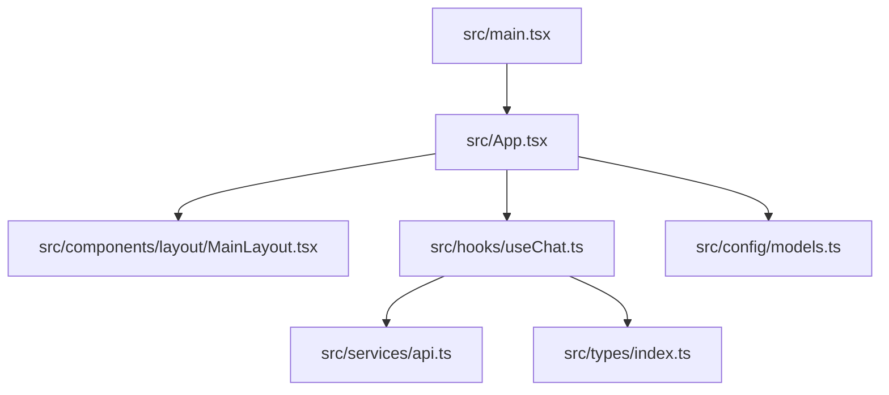
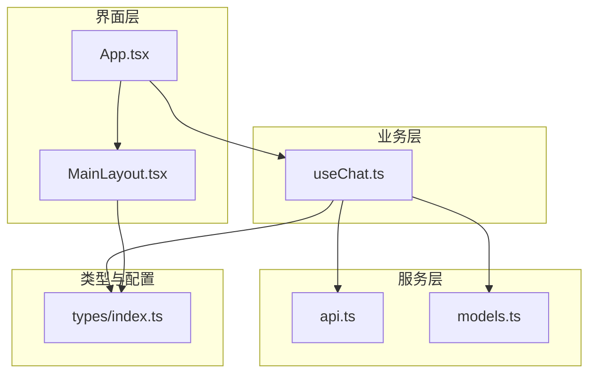
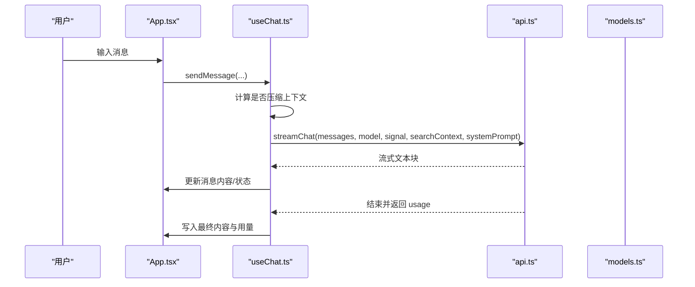
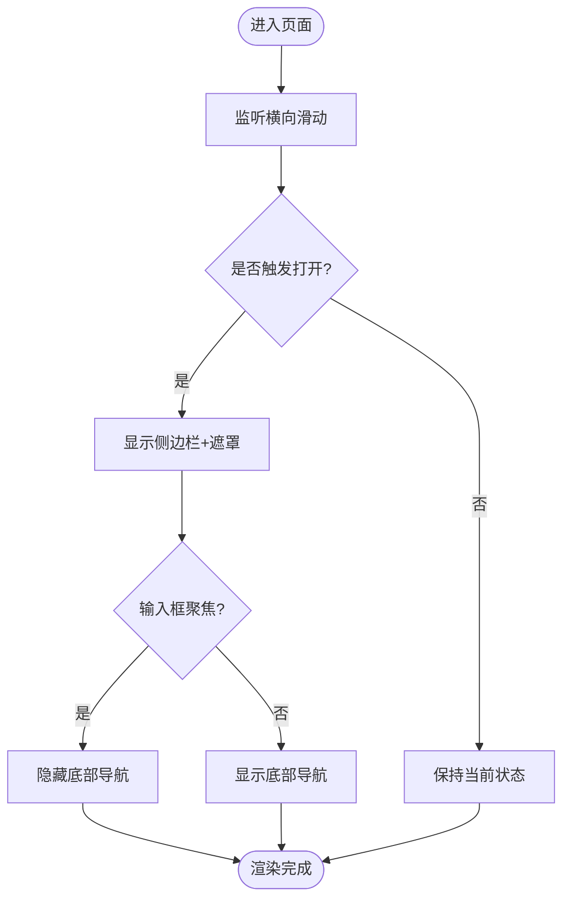
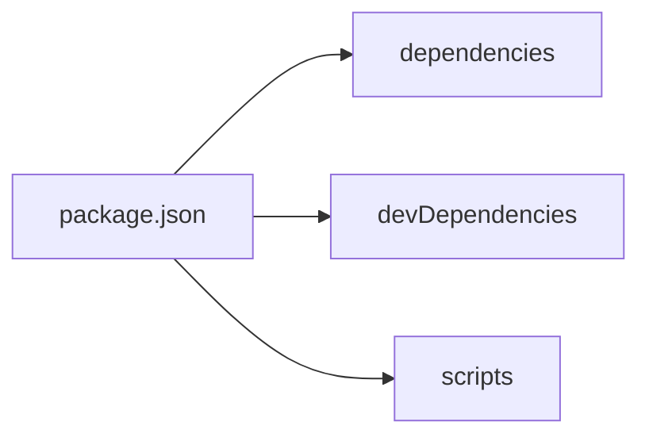
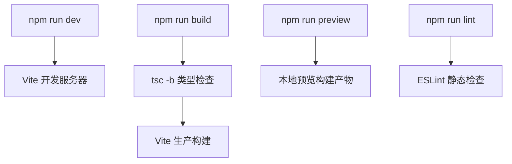

# 开发指南

<cite>
**本文引用的文件**
- [package.json](file://package.json)
- [vite.config.ts](file://vite.config.ts)
- [eslint.config.js](file://eslint.config.js)
- [tsconfig.json](file://tsconfig.json)
- [tsconfig.app.json](file://tsconfig.app.json)
- [tsconfig.node.json](file://tsconfig.node.json)
- [README.md](file://README.md)
- [src/main.tsx](file://src/main.tsx)
- [src/App.tsx](file://src/App.tsx)
- [src/types/index.ts](file://src/types/index.ts)
- [src/components/layout/MainLayout.tsx](file://src/components/layout/MainLayout.tsx)
- [src/hooks/useChat.ts](file://src/hooks/useChat.ts)
- [src/services/api.ts](file://src/services/api.ts)
- [src/config/models.ts](file://src/config/models.ts)
</cite>

## 目录
1. [简介](#简介)
2. [项目结构](#项目结构)
3. [核心组件](#核心组件)
4. [架构总览](#架构总览)
5. [详细组件分析](#详细组件分析)
6. [依赖关系分析](#依赖关系分析)
7. [性能与构建优化](#性能与构建优化)
8. [调试与排错](#调试与排错)
9. [测试策略与编写指南](#测试策略与编写指南)
10. [贡献流程与规范](#贡献流程与规范)
11. [结论](#结论)

## 简介
本指南面向 AIShop 项目的开发者，覆盖代码规范、ESLint 配置、TypeScript 类型检查、React 最佳实践、Vite 构建与优化、项目结构规范、调试技巧、测试策略以及贡献流程。目标是帮助团队在统一标准下高效协作，保证代码质量与可维护性。

## 项目结构
- 前端工程基于 React + TypeScript + Vite，使用 Tailwind CSS 进行样式管理。
- 入口文件为 src/main.tsx，应用根组件为 src/App.tsx。
- 业务逻辑集中在 hooks（如 useChat）、services（API 调用、存储等）、components（UI 组件）和 config（模型配置等）。
- 类型定义集中于 src/types/index.ts，便于跨模块共享。

图表来源
- [src/main.tsx:1-8](file://src/main.tsx#L1-L8)
- [src/App.tsx:1-147](file://src/App.tsx#L1-L147)
- [src/components/layout/MainLayout.tsx:1-205](file://src/components/layout/MainLayout.tsx#L1-L205)
- [src/hooks/useChat.ts:1-800](file://src/hooks/useChat.ts#L1-L800)
- [src/services/api.ts:1-173](file://src/services/api.ts#L1-L173)
- [src/config/models.ts:1-284](file://src/config/models.ts#L1-L284)
- [src/types/index.ts:1-252](file://src/types/index.ts#L1-L252)

章节来源
- [src/main.tsx:1-8](file://src/main.tsx#L1-L8)
- [src/App.tsx:1-147](file://src/App.tsx#L1-L147)
- [src/components/layout/MainLayout.tsx:1-205](file://src/components/layout/MainLayout.tsx#L1-L205)
- [src/types/index.ts:1-252](file://src/types/index.ts#L1-L252)

## 核心组件
- App：负责主题初始化、持久化存储申请、标签页切换、会话与收藏状态聚合、压缩结果反馈等。
- MainLayout：提供侧边栏、顶部导航、底部导航、手势滑动打开/收起侧边栏、输入框聚焦时隐藏底部导航等布局能力。
- useChat：封装聊天会话的启动、恢复、消息发送、流式响应处理、上下文压缩、联网搜索、用量统计、持久化等核心逻辑。
- api：实现与后端 LLM 的流式对话接口，包含请求头设置、错误重试、SSE 解析与用量提取。
- models：集中管理各厂商聊天/图像模型元数据，供 UI 选择与展示。

章节来源
- [src/App.tsx:1-147](file://src/App.tsx#L1-L147)
- [src/components/layout/MainLayout.tsx:1-205](file://src/components/layout/MainLayout.tsx#L1-L205)
- [src/hooks/useChat.ts:1-800](file://src/hooks/useChat.ts#L1-L800)
- [src/services/api.ts:1-173](file://src/services/api.ts#L1-L173)
- [src/config/models.ts:1-284](file://src/config/models.ts#L1-L284)

## 架构总览
整体采用“组件层 -> Hook 层 -> 服务层 -> 类型/配置”的分层架构。App 作为容器编排页面与全局状态；MainLayout 提供通用布局；useChat 承载复杂业务；api 负责网络通信；types 与 config 提供契约与常量。

图表来源
- [src/App.tsx:1-147](file://src/App.tsx#L1-L147)
- [src/components/layout/MainLayout.tsx:1-205](file://src/components/layout/MainLayout.tsx#L1-L205)
- [src/hooks/useChat.ts:1-800](file://src/hooks/useChat.ts#L1-L800)
- [src/services/api.ts:1-173](file://src/services/api.ts#L1-L173)
- [src/config/models.ts:1-284](file://src/config/models.ts#L1-L284)
- [src/types/index.ts:1-252](file://src/types/index.ts#L1-L252)

## 详细组件分析

### 聊天与会话流程（useChat + api）
- 启动阶段：加载会话列表，恢复上次会话或创建新会话，补齐缺失标题。
- 发送消息：可选自动压缩上下文，构造 API 消息体，支持附件与图片内联。
- 流式响应：逐块更新 UI，检测并渲染 artifact，解析建议项，最终落盘。
- 联网搜索：根据问题判断是否需要搜索，将搜索结果注入上下文。
- 用量统计：从 SSE 末尾 usage chunk 提取真实 token 用量。

图表来源
- [src/App.tsx:1-147](file://src/App.tsx#L1-L147)
- [src/hooks/useChat.ts:1-800](file://src/hooks/useChat.ts#L1-L800)
- [src/services/api.ts:1-173](file://src/services/api.ts#L1-L173)
- [src/config/models.ts:1-284](file://src/config/models.ts#L1-L284)

章节来源
- [src/hooks/useChat.ts:1-800](file://src/hooks/useChat.ts#L1-L800)
- [src/services/api.ts:1-173](file://src/services/api.ts#L1-L173)
- [src/App.tsx:1-147](file://src/App.tsx#L1-L147)

### 布局与交互（MainLayout）
- 侧边栏：支持横滑手势打开/收起，ESC 关闭，遮罩点击关闭。
- 输入框聚焦：隐藏底部导航避免遮挡。
- 顶部导航：模型选择、新建会话、联网搜索开关、上下文占用指示、压缩操作等。

图表来源
- [src/components/layout/MainLayout.tsx:1-205](file://src/components/layout/MainLayout.tsx#L1-L205)

章节来源
- [src/components/layout/MainLayout.tsx:1-205](file://src/components/layout/MainLayout.tsx#L1-L205)

### 类型与数据模型（types）
- 消息与会话：Message、Conversation、MessageVersion、TokenUsage、ContextSegment 等。
- 媒体与任务：MediaItem、ImageGenerationParams、PendingImageTask。
- 模型与用量：Model、UsageCycleType、BillItem、ModelUsageSummary。
- 这些类型贯穿 UI、Hook、Service，确保前后端数据一致性与可维护性。

章节来源
- [src/types/index.ts:1-252](file://src/types/index.ts#L1-L252)

## 依赖关系分析
- 运行时依赖：React、Tailwind、Markdown/KaTeX 渲染、IndexedDB 工具、PDF/XLSX 处理等。
- 开发依赖：Vite、TypeScript、ESLint、React Hooks/Refresh 插件等。
- 构建脚本：dev/build/lint/preview。

图表来源
- [package.json:1-47](file://package.json#L1-L47)

章节来源
- [package.json:1-47](file://package.json#L1-L47)

## 性能与构建优化
- 构建工具：Vite 作为开发与构建工具，启用 React 与 Tailwind 插件。
- 服务器：开发服务器绑定 0.0.0.0，便于局域网访问。
- 环境变量：通过 define 注入 __APP_VERSION__。
- 类型检查：TypeScript 目标 ES2023，模块解析为 bundler，开启严格 lint 相关选项。
- ESLint：启用 JS 推荐规则、TypeScript ESLint 推荐、React Hooks 与 Refresh 配置。

图表来源
- [package.json:1-47](file://package.json#L1-L47)
- [vite.config.ts:1-18](file://vite.config.ts#L1-L18)
- [eslint.config.js:1-23](file://eslint.config.js#L1-L23)
- [tsconfig.app.json:1-26](file://tsconfig.app.json#L1-L26)
- [tsconfig.node.json:1-25](file://tsconfig.node.json#L1-L25)

章节来源
- [vite.config.ts:1-18](file://vite.config.ts#L1-L18)
- [package.json:1-47](file://package.json#L1-L47)
- [eslint.config.js:1-23](file://eslint.config.js#L1-L23)
- [tsconfig.app.json:1-26](file://tsconfig.app.json#L1-L26)
- [tsconfig.node.json:1-25](file://tsconfig.node.json#L1-L25)

## 调试与排错
- 开发调试：
  - 使用浏览器开发者工具查看网络请求（SSE 流）、控制台日志与错误堆栈。
  - 利用 Vite 热更新快速验证改动。
- 常见问题定位：
  - API Key 未配置：会抛出明确错误提示，需在设置中配置。
  - 网关不支持 include_usage：会自动降级重试，不阻塞对话。
  - 流式中断：AbortError 会被捕获并标记消息为用户停止。
- 日志与追踪：
  - 关键路径已添加 console.error 与结构化日志，便于定位问题。

章节来源
- [src/services/api.ts:1-173](file://src/services/api.ts#L1-L173)
- [src/hooks/useChat.ts:1-800](file://src/hooks/useChat.ts#L1-L800)

## 测试策略与编写指南
- 单元测试：
  - 针对纯函数与工具方法（如摘要估算、上下文规划、消息构建）编写用例，确保边界条件正确。
  - 使用 Jest/Vitest 等框架，结合 Mock 外部依赖（如 IndexedDB、网络请求）。
- 组件测试：
  - 对关键 UI 组件（如聊天面板、布局）进行快照与交互测试，验证渲染与事件处理。
- 集成测试：
  - 模拟完整对话流程（发送消息、流式接收、用量统计），验证端到端行为。
- 建议：
  - 将测试与源码同目录组织，命名以 .test.ts/.test.tsx 结尾。
  - 对异步流程使用 async/await 与超时保护，避免测试挂起。

[本节为通用指导，不直接分析具体文件]

## 贡献流程与规范
- 代码风格与规范：
  - 遵循 ESLint 规则，提交前执行 npm run lint 修复问题。
  - 使用 TypeScript 严格模式，避免 any，尽量使用类型推断与显式类型标注。
  - 组件命名采用 PascalCase，文件按功能划分到对应目录。
- 提交规范：
  - 提交信息清晰描述变更目的与影响范围。
  - 小步提交，便于审查与回滚。
- 分支策略：
  - 主分支保持稳定，功能分支合并前需通过 lint 与测试。
- 文档更新：
  - 涉及公共 API、配置或行为变更时，同步更新 README 或相关文档。

章节来源
- [eslint.config.js:1-23](file://eslint.config.js#L1-L23)
- [package.json:1-47](file://package.json#L1-L47)
- [README.md:1-74](file://README.md#L1-L74)

## 结论
AIShop 采用清晰的层次化架构与严格的类型与规范体系，配合 Vite 的高效构建与 ESLint 的静态检查，保障了开发体验与代码质量。建议在后续迭代中持续完善测试覆盖、性能监控与文档沉淀，进一步提升团队协作效率与产品稳定性。