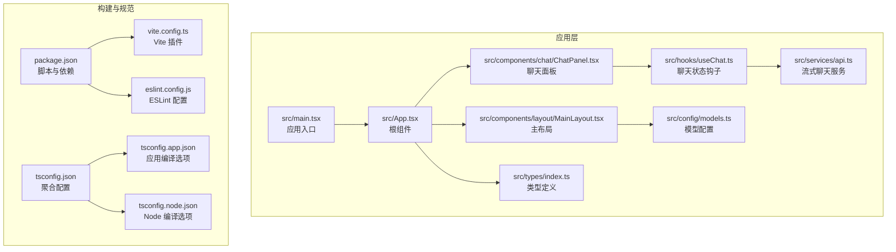
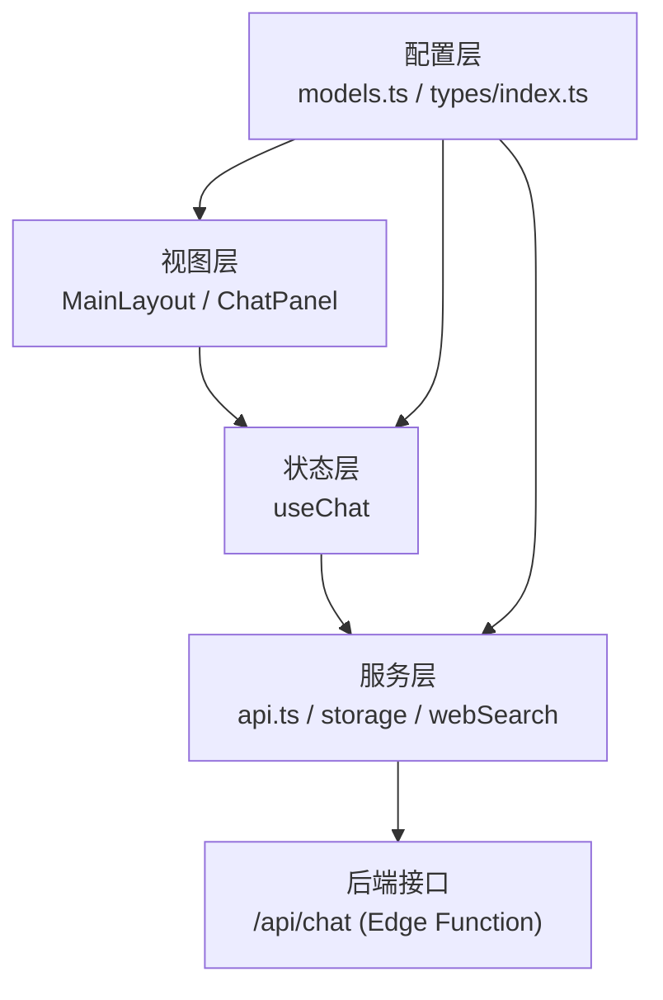
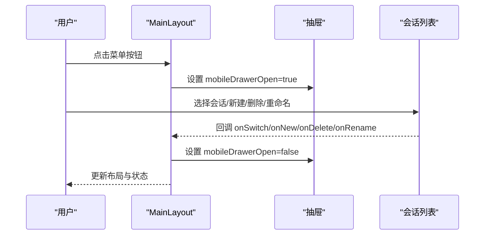
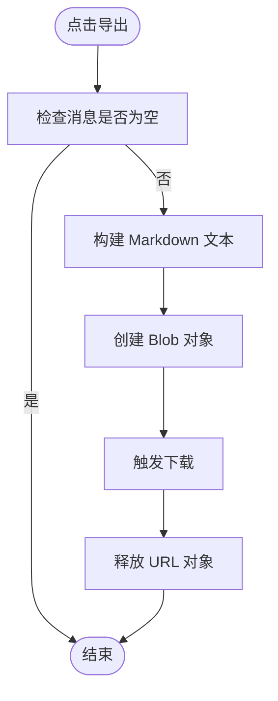
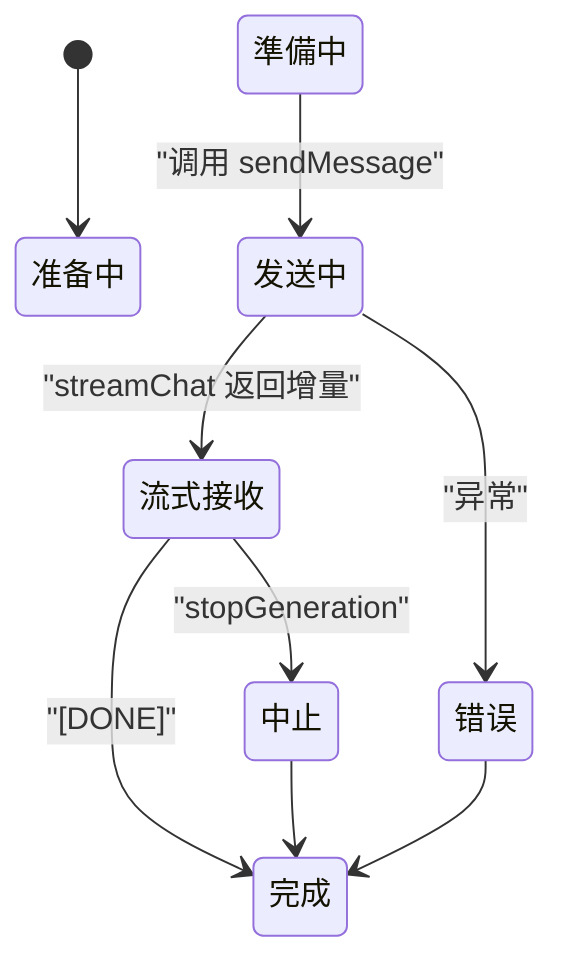
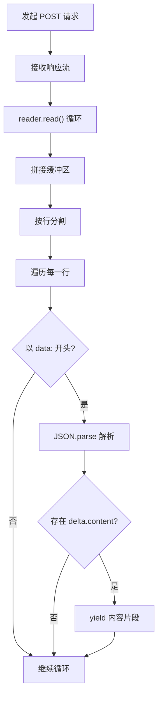
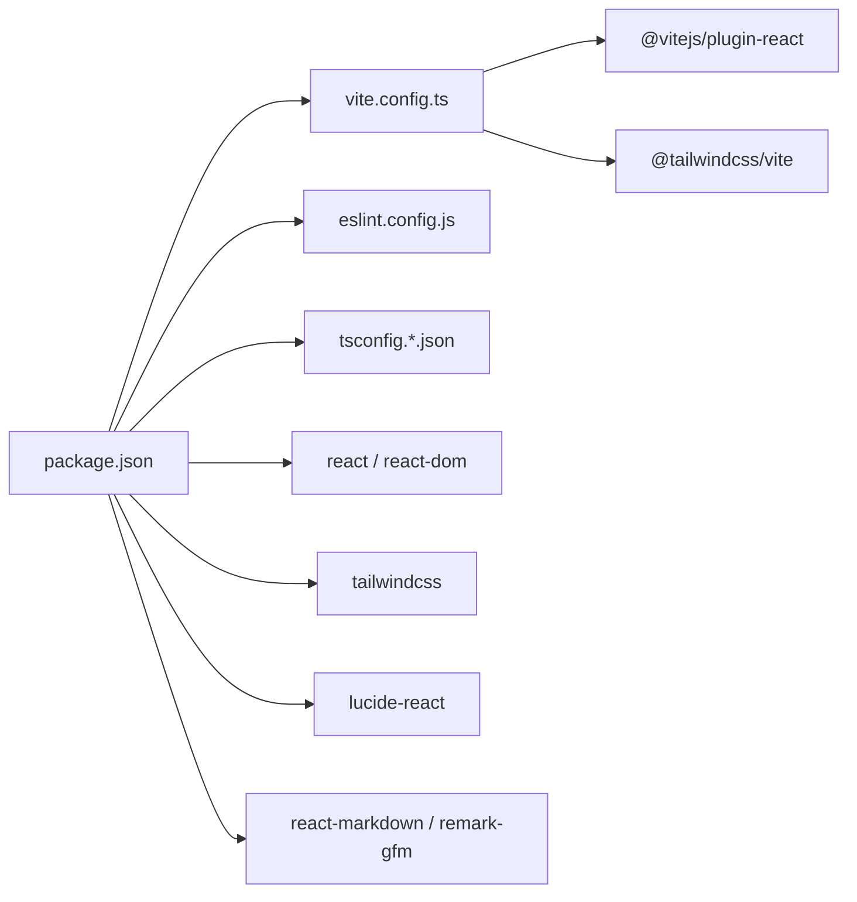

# 开发指南

<cite>
**本文引用的文件**
- [package.json](file://package.json)
- [vite.config.ts](file://vite.config.ts)
- [eslint.config.js](file://eslint.config.js)
- [tsconfig.json](file://tsconfig.json)
- [tsconfig.app.json](file://tsconfig.app.json)
- [tsconfig.node.json](file://tsconfig.node.json)
- [README.md](file://README.md)
- [src/main.tsx](file://src/main.tsx)
- [src/App.tsx](file://src/App.tsx)
- [src/types/index.ts](file://src/types/index.ts)
- [src/components/layout/MainLayout.tsx](file://src/components/layout/MainLayout.tsx)
- [src/hooks/useChat.ts](file://src/hooks/useChat.ts)
- [src/services/api.ts](file://src/services/api.ts)
- [src/config/models.ts](file://src/config/models.ts)
- [src/components/chat/ChatPanel.tsx](file://src/components/chat/ChatPanel.tsx)
</cite>

## 目录
1. [简介](#简介)
2. [项目结构](#项目结构)
3. [核心组件](#核心组件)
4. [架构总览](#架构总览)
5. [详细组件分析](#详细组件分析)
6. [依赖关系分析](#依赖关系分析)
7. [性能考虑](#性能考虑)
8. [故障排查指南](#故障排查指南)
9. [结论](#结论)
10. [附录](#附录)

## 简介
本开发指南面向 AIShop 项目，提供从代码规范、构建与开发环境配置，到新功能开发流程、代码审查标准、扩展与第三方库集成、常见问题排查与性能优化的系统性说明。文档结合仓库中的实际配置与源码，帮助开发者快速上手并高质量交付。

## 项目结构
AIShop 采用 React + TypeScript + Vite 的现代前端技术栈，使用 TailwindCSS v4 作为样式基础，配合 React Hooks 实现状态管理与业务逻辑封装。项目主要目录与职责如下：
- src：应用源码
  - components：UI 组件层（布局、通用组件、各能力面板）
  - hooks：自定义 Hook（如 useChat）
  - services：API 与工具服务（流式聊天、存储、Web 搜索等）
  - config：模型与提示词配置
  - types：全局类型定义
  - main.tsx/App.tsx：入口与根组件
- api：后端接口（Edge Function 代理）
- public：静态资源（含 providers）
- 配置文件：package.json、vite.config.ts、eslint.config.js、tsconfig.*.json

**图表来源**
- [src/main.tsx:1-11](file://src/main.tsx#L1-L11)
- [src/App.tsx:1-67](file://src/App.tsx#L1-L67)
- [src/components/layout/MainLayout.tsx:1-227](file://src/components/layout/MainLayout.tsx#L1-L227)
- [src/components/chat/ChatPanel.tsx:1-354](file://src/components/chat/ChatPanel.tsx#L1-L354)
- [src/hooks/useChat.ts:1-370](file://src/hooks/useChat.ts#L1-L370)
- [src/services/api.ts:1-83](file://src/services/api.ts#L1-L83)
- [src/config/models.ts:1-228](file://src/config/models.ts#L1-L228)
- [src/types/index.ts:1-103](file://src/types/index.ts#L1-L103)
- [package.json:1-40](file://package.json#L1-L40)
- [vite.config.ts:1-11](file://vite.config.ts#L1-L11)
- [eslint.config.js:1-23](file://eslint.config.js#L1-L23)
- [tsconfig.json:1-8](file://tsconfig.json#L1-L8)
- [tsconfig.app.json:1-26](file://tsconfig.app.json#L1-L26)
- [tsconfig.node.json:1-25](file://tsconfig.node.json#L1-L25)

**章节来源**
- [package.json:1-40](file://package.json#L1-L40)
- [vite.config.ts:1-11](file://vite.config.ts#L1-L11)
- [eslint.config.js:1-23](file://eslint.config.js#L1-L23)
- [tsconfig.json:1-8](file://tsconfig.json#L1-L8)
- [tsconfig.app.json:1-26](file://tsconfig.app.json#L1-L26)
- [tsconfig.node.json:1-25](file://tsconfig.node.json#L1-L25)
- [README.md:1-74](file://README.md#L1-L74)

## 核心组件
- 应用入口与根组件
  - 入口负责挂载根组件与全局样式，根组件负责路由态（Tab）与布局组合，并注入聊天 Hook。
- 主布局
  - 负责桌面/移动端布局切换、侧边抽屉、会话列表、模型选择器与底部 Tab。
- 聊天面板
  - 负责消息渲染、输入框、导出（Markdown/JSON）、拖拽导入、自动滚动与交互。
- 聊天 Hook
  - 负责会话持久化、消息流式渲染、联网搜索上下文拼接、停止生成、标题生成触发与会话管理。
- 流式聊天服务
  - 负责与后端 Edge Function 通信，解析 SSE 数据流，产出增量内容。
- 类型系统
  - 定义消息、会话、媒体、模型与 Tab 模式等核心类型，确保跨组件一致性。

**章节来源**
- [src/main.tsx:1-11](file://src/main.tsx#L1-L11)
- [src/App.tsx:1-67](file://src/App.tsx#L1-L67)
- [src/components/layout/MainLayout.tsx:1-227](file://src/components/layout/MainLayout.tsx#L1-L227)
- [src/components/chat/ChatPanel.tsx:1-354](file://src/components/chat/ChatPanel.tsx#L1-L354)
- [src/hooks/useChat.ts:1-370](file://src/hooks/useChat.ts#L1-L370)
- [src/services/api.ts:1-83](file://src/services/api.ts#L1-L83)
- [src/types/index.ts:1-103](file://src/types/index.ts#L1-L103)

## 架构总览
AIShop 采用“组件 + Hook + 服务”的分层架构：
- 视图层：组件负责 UI 与交互（MainLayout、ChatPanel 等）
- 状态层：Hook 封装业务状态与副作用（useChat）
- 服务层：封装 API 与工具（api.ts、storage、webSearch 等）
- 配置层：模型与类型定义（models.ts、types/index.ts）

**图表来源**
- [src/components/layout/MainLayout.tsx:1-227](file://src/components/layout/MainLayout.tsx#L1-L227)
- [src/components/chat/ChatPanel.tsx:1-354](file://src/components/chat/ChatPanel.tsx#L1-L354)
- [src/hooks/useChat.ts:1-370](file://src/hooks/useChat.ts#L1-L370)
- [src/services/api.ts:1-83](file://src/services/api.ts#L1-L83)
- [src/config/models.ts:1-228](file://src/config/models.ts#L1-L228)
- [src/types/index.ts:1-103](file://src/types/index.ts#L1-L103)

## 详细组件分析

### 组件：MainLayout（主布局）
- 功能要点
  - 桌面端：左侧 Sidebar + 主内容区
  - 移动端：顶部模型选择器胶囊 + 主内容 + 底部 Tab + 左侧抽屉（聊天）
  - 响应式判断与键盘事件（ESC 关闭抽屉）
  - 会话列表联动（切换/新建/删除/重命名）
- 设计模式
  - Props Drilling 明确，通过回调函数向下传递行为
  - 使用 Lucide 图标库提供一致的视觉语言
- 交互流程（移动端抽屉）

**图表来源**
- [src/components/layout/MainLayout.tsx:1-227](file://src/components/layout/MainLayout.tsx#L1-L227)

**章节来源**
- [src/components/layout/MainLayout.tsx:1-227](file://src/components/layout/MainLayout.tsx#L1-L227)

### 组件：ChatPanel（聊天面板）
- 功能要点
  - 消息列表渲染、自动滚动、滚动位置记忆
  - 导出为 Markdown/JSON、拖拽导入 .aishop.json
  - 建议快捷按钮（基于 Assistant 最后一条消息）
- 交互流程（导出）

**图表来源**
- [src/components/chat/ChatPanel.tsx:81-114](file://src/components/chat/ChatPanel.tsx#L81-L114)
- [src/components/chat/ChatPanel.tsx:116-154](file://src/components/chat/ChatPanel.tsx#L116-L154)

**章节来源**
- [src/components/chat/ChatPanel.tsx:1-354](file://src/components/chat/ChatPanel.tsx#L1-L354)

### 组件：useChat（聊天状态钩子）
- 功能要点
  - 会话持久化（localStorage）、模型选择、联网搜索开关
  - 流式生成：AbortController 控制、增量内容更新、建议标记解析
  - 会话管理：新建/切换/删除/重命名/导入
  - 标题生成触发（fire-and-forget）
- 状态流转（发送消息）

**图表来源**
- [src/hooks/useChat.ts:135-250](file://src/hooks/useChat.ts#L135-L250)
- [src/services/api.ts:13-83](file://src/services/api.ts#L13-L83)

**章节来源**
- [src/hooks/useChat.ts:1-370](file://src/hooks/useChat.ts#L1-L370)

### 组件：api.ts（流式聊天服务）
- 功能要点
  - 将消息与系统提示拼接为 API 请求体
  - 通过 fetch + ReadableStream 解析 SSE 数据块
  - 逐行解析 data: 行，提取 choices[0].delta.content
- 数据流（流式解析）

**图表来源**
- [src/services/api.ts:13-83](file://src/services/api.ts#L13-L83)

**章节来源**
- [src/services/api.ts:1-83](file://src/services/api.ts#L1-L83)

### 组件：模型配置与类型系统
- 模型配置
  - 提供多厂商多型号的聊天/图片/音视频模型清单，包含能力与价格字段
- 类型系统
  - 定义 Message、Conversation、MediaItem、Model、TabMode 等核心类型
  - 为组件与 Hook 提供强类型约束

**章节来源**
- [src/config/models.ts:1-228](file://src/config/models.ts#L1-L228)
- [src/types/index.ts:1-103](file://src/types/index.ts#L1-L103)

## 依赖关系分析
- 构建与运行
  - Vite 插件：@vitejs/plugin-react、@tailwindcss/vite
  - 脚本：dev/build/lint/preview
- 类型与规范
  - TypeScript 多配置文件组织（app/node 聚合）
  - ESLint flat config + TypeScript ESLint + React Hooks + React Refresh
- 运行时依赖
  - React 19、TailwindCSS v4、Lucide React、React Markdown 等

**图表来源**
- [package.json:1-40](file://package.json#L1-L40)
- [vite.config.ts:1-11](file://vite.config.ts#L1-L11)
- [eslint.config.js:1-23](file://eslint.config.js#L1-L23)
- [tsconfig.json:1-8](file://tsconfig.json#L1-L8)

**章节来源**
- [package.json:1-40](file://package.json#L1-L40)
- [vite.config.ts:1-11](file://vite.config.ts#L1-L11)
- [eslint.config.js:1-23](file://eslint.config.js#L1-L23)
- [tsconfig.json:1-8](file://tsconfig.json#L1-L8)

## 性能考虑
- 构建与打包
  - 使用 Vite 的原生 ES 模块与按需加载，减少打包体积
  - TypeScript 使用 bundler 模式与 noEmit，提升类型检查效率
- 运行时性能
  - ChatPanel 自动滚动与滚动位置记忆，避免不必要的重排
  - useChat 中增量更新消息，减少渲染压力
  - 流式渲染使用 AbortController，及时中断无用请求
- 调试与可观测性
  - 在开发阶段启用 ESLint 推荐规则，结合 TypeScript 类型检查尽早发现潜在问题
  - 使用浏览器 DevTools 的 Network 面板观察流式数据与 SSE 响应

[本节为通用指导，无需特定文件来源]

## 故障排查指南
- 开发环境无法热重载或样式不生效
  - 检查 Vite 插件是否正确启用（react、tailwindcss）
  - 确认 tsconfig 的 bundler 模式与 noEmit 配置
- ESLint 报错或类型检查失败
  - 按 README 建议升级为类型感知规则集，确保 project 解析路径正确
- 流式聊天无输出或中断
  - 检查后端 /api/chat 是否可达，确认请求体与头部设置
  - 在浏览器 Network 面板查看 SSE 数据行是否符合预期
- 会话导入失败
  - 确认 .aishop.json 版本号与字段结构一致

**章节来源**
- [README.md:14-74](file://README.md#L14-L74)
- [vite.config.ts:1-11](file://vite.config.ts#L1-L11)
- [tsconfig.app.json:1-26](file://tsconfig.app.json#L1-L26)
- [tsconfig.node.json:1-25](file://tsconfig.node.json#L1-L25)
- [src/services/api.ts:34-51](file://src/services/api.ts#L34-L51)
- [src/components/chat/ChatPanel.tsx:181-206](file://src/components/chat/ChatPanel.tsx#L181-L206)

## 结论
AIShop 项目遵循现代化前端工程实践，具备清晰的分层架构与完善的开发规范。通过本指南，开发者可以快速理解项目结构、掌握开发与调试方法，并在保证质量的前提下高效扩展新功能。

[本节为总结性内容，无需特定文件来源]

## 附录

### 代码规范与最佳实践
- ESLint 配置
  - 使用 flat config，推荐启用类型感知规则集（参考 README 中的类型检查与严格配置示例）
  - 扩展：可引入 React/React DOM 相关插件以强化 React 代码质量
- TypeScript 规范
  - 使用多配置文件组织（app/node），明确 bundler 模式与 noEmit
  - 启用严格未使用检测与语法限制，减少冗余与潜在错误
- 组件命名约定
  - 采用帕斯卡命名（如 MainLayout、ChatPanel），文件名与组件名一致
  - 布局组件统一以 Layout 结尾，面板组件以 Panel 结尾，通用组件置于 common 目录

**章节来源**
- [eslint.config.js:1-23](file://eslint.config.js#L1-L23)
- [README.md:14-74](file://README.md#L14-L74)
- [tsconfig.app.json:1-26](file://tsconfig.app.json#L1-L26)
- [tsconfig.node.json:1-25](file://tsconfig.node.json#L1-L25)

### 开发环境配置与优化
- Vite 构建配置
  - 启用 @vitejs/plugin-react 与 @tailwindcss/vite
  - 使用脚本：dev/build/lint/preview
- 热重载与调试
  - 使用 React Refresh 插件，确保组件热替换
  - 在浏览器中开启 React DevTools 与 ESLint 插件辅助调试

**章节来源**
- [vite.config.ts:1-11](file://vite.config.ts#L1-L11)
- [package.json:6-11](file://package.json#L6-L11)

### 新功能开发流程与规范
- 组件开发
  - 在对应功能域（如 components/chat）新增组件，遵循现有命名与结构
  - 通过 props 明确数据与行为边界，必要时拆分为更小的子组件
- 状态管理
  - 优先使用现有 Hook（如 useChat）或在其基础上扩展
  - 避免在组件内直接持久化复杂状态，尽量下沉至服务层
- API 集成
  - 在 services 下新增服务模块，封装 fetch 与流式解析
  - 统一错误处理与中止控制（AbortController）
- 测试方法
  - 单元测试：针对纯函数与工具函数
  - 集成测试：模拟流式响应与错误场景
  - 端到端测试：覆盖关键交互流程（发送消息、导出、导入）

**章节来源**
- [src/hooks/useChat.ts:1-370](file://src/hooks/useChat.ts#L1-L370)
- [src/services/api.ts:1-83](file://src/services/api.ts#L1-L83)
- [src/components/chat/ChatPanel.tsx:1-354](file://src/components/chat/ChatPanel.tsx#L1-L354)

### 代码审查标准与检查清单
- 代码质量
  - 是否通过 ESLint 与 TypeScript 检查
  - 是否遵循组件命名与目录结构约定
  - 是否存在重复逻辑与未使用代码
- 性能
  - 是否避免不必要的重渲染（如使用 memo、useCallback）
  - 是否合理使用流式渲染与中止控制
- 安全性
  - 是否对用户输入进行必要的校验与清理
  - 是否避免在客户端暴露敏感信息

**章节来源**
- [eslint.config.js:1-23](file://eslint.config.js#L1-L23)
- [tsconfig.app.json:18-22](file://tsconfig.app.json#L18-L22)
- [src/hooks/useChat.ts:252-255](file://src/hooks/useChat.ts#L252-L255)

### 扩展开发指南
- 添加新功能模块
  - 在 src/components 下新增模块目录与入口组件
  - 在 src/config/models.ts 中补充模型清单
  - 在 src/types/index.ts 中完善类型定义
- 修改现有功能
  - 保持向后兼容的 API 设计，避免破坏既有行为
  - 通过单元测试与集成测试验证变更
- 第三方库集成
  - 在 package.json 中声明依赖，遵循最小权限原则
  - 在 tsconfig 中配置类型声明，确保类型安全

**章节来源**
- [src/config/models.ts:1-228](file://src/config/models.ts#L1-L228)
- [src/types/index.ts:1-103](file://src/types/index.ts#L1-L103)
- [package.json:12-38](file://package.json#L12-L38)