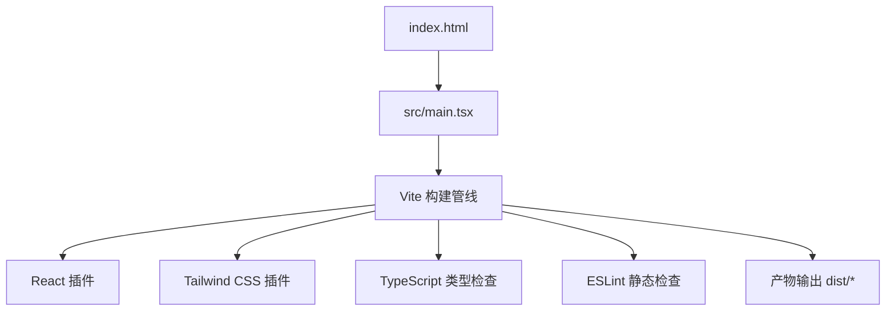
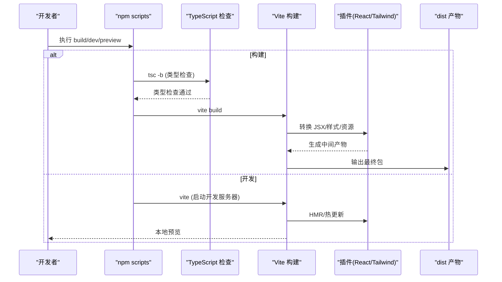
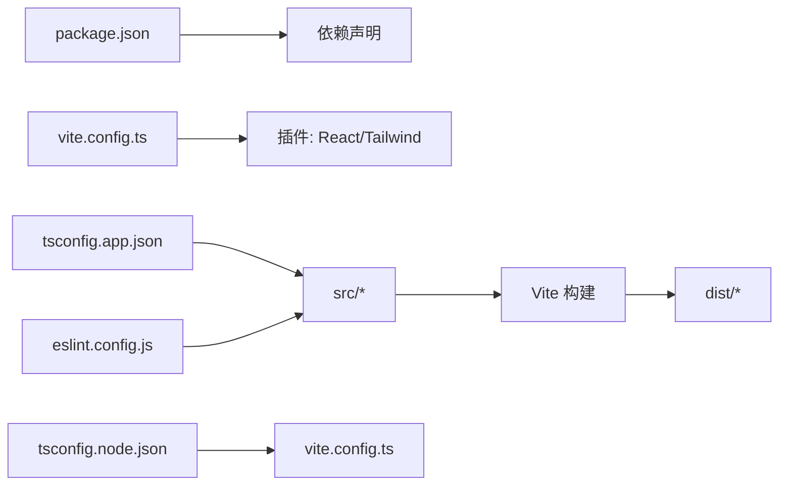

# 构建配置

<cite>
**本文引用的文件**
- [vite.config.ts](file://vite.config.ts)
- [package.json](file://package.json)
- [tsconfig.json](file://tsconfig.json)
- [tsconfig.app.json](file://tsconfig.app.json)
- [tsconfig.node.json](file://tsconfig.node.json)
- [eslint.config.js](file://eslint.config.js)
- [index.html](file://index.html)
- [src/main.tsx](file://src/main.tsx)
- [src/config/version.ts](file://src/config/version.ts)
</cite>

## 目录
1. [简介](#简介)
2. [项目结构](#项目结构)
3. [核心组件](#核心组件)
4. [架构总览](#架构总览)
5. [详细组件分析](#详细组件分析)
6. [依赖关系分析](#依赖关系分析)
7. [性能优化建议](#性能优化建议)
8. [故障排查指南](#故障排查指南)
9. [结论](#结论)
10. [附录](#附录)

## 简介
本文件为 AIShop 项目的构建配置文档，覆盖 Vite 开发服务器与生产构建、插件与环境变量、TypeScript 编译配置、npm scripts 使用方式、性能优化策略以及常见构建问题的排查方法。目标是帮助开发者快速理解并高效维护项目的构建流程。

## 项目结构
AIShop 采用现代前端工程化结构：
- 入口 HTML 位于根目录 index.html，加载 src/main.tsx 作为应用入口。
- Vite 配置文件 vite.config.ts 集中管理插件、开发服务器、常量注入等。
- TypeScript 配置拆分为 tsconfig.app.json（应用代码）与 tsconfig.node.json（Node/构建脚本），由 tsconfig.json 引用聚合。
- ESLint 通过 eslint.config.js 启用 React Hooks 与 React Refresh 规则。
- npm scripts 在 package.json 中定义 dev/build/lint/preview 等常用命令。

图表来源
- [index.html:1-23](file://index.html#L1-L23)
- [src/main.tsx:1-8](file://src/main.tsx#L1-L8)
- [vite.config.ts:1-18](file://vite.config.ts#L1-L18)
- [eslint.config.js:1-23](file://eslint.config.js#L1-L23)

章节来源
- [index.html:1-23](file://index.html#L1-L23)
- [src/main.tsx:1-8](file://src/main.tsx#L1-L8)
- [vite.config.ts:1-18](file://vite.config.ts#L1-L18)
- [eslint.config.js:1-23](file://eslint.config.js#L1-L23)

## 核心组件
- Vite 配置：包含 React 与 Tailwind CSS 插件、开发服务器 host 设置、构建时常量注入。
- TypeScript 配置：目标 ES2023、模块系统 esnext、bundler 解析模式、JSX react-jsx、严格 lint 相关选项。
- npm Scripts：dev、build、lint、preview 四个常用命令。
- ESLint：基于 flat config，启用 JS 推荐、TS 推荐、React Hooks、React Refresh 与浏览器全局。

章节来源
- [vite.config.ts:1-18](file://vite.config.ts#L1-L18)
- [tsconfig.app.json:1-26](file://tsconfig.app.json#L1-L26)
- [tsconfig.node.json:1-25](file://tsconfig.node.json#L1-L25)
- [package.json:1-47](file://package.json#L1-L47)
- [eslint.config.js:1-23](file://eslint.config.js#L1-L23)

## 架构总览
下图展示了从源码到产物的构建链路，包括类型检查、代码转换、样式处理与资源打包。

图表来源
- [package.json:6-10](file://package.json#L6-L10)
- [vite.config.ts:1-18](file://vite.config.ts#L1-L18)

## 详细组件分析

### Vite 配置详解
- 插件
  - React：提供 JSX/TSX 支持与 React Refresh。
  - Tailwind CSS：通过 @tailwindcss/vite 集成 Tailwind v4 的构建期处理。
- 开发服务器
  - host: '0.0.0.0'，允许局域网访问。
- 构建时常量注入
  - define 中将 __APP_VERSION__ 注入为 package.json 的 version，便于运行时获取版本信息。
- 环境变量
  - 当前未显式配置 .env 文件；可通过 Vite 默认的环境变量约定（如 import.meta.env.*）在后续扩展。

章节来源
- [vite.config.ts:1-18](file://vite.config.ts#L1-L18)
- [package.json:1-47](file://package.json#L1-L47)
- [src/config/version.ts:1-16](file://src/config/version.ts#L1-L16)

### TypeScript 编译配置
- 目标与库
  - target: es2023，lib: ES2023 + DOM（应用）或仅 ES2023（Node）。
- 模块系统
  - module: esnext，moduleResolution: bundler，支持现代模块语法与导入导出。
- JSX
  - jsx: react-jsx，启用新的 JSX 转换。
- 类型与检查
  - skipLibCheck: true 提升构建速度。
  - noUnusedLocals/noUnusedParameters/noFallthroughCasesInSwitch 增强代码质量。
  - verbatimModuleSyntax/moduleDetection: force 确保模块语法一致性。
- 文件范围
  - tsconfig.app.json include: ["src"]，tsconfig.node.json include: ["vite.config.ts"]。
- 聚合引用
  - tsconfig.json 通过 references 引用 app 与 node 两个子配置。

章节来源
- [tsconfig.app.json:1-26](file://tsconfig.app.json#L1-L26)
- [tsconfig.node.json:1-25](file://tsconfig.node.json#L1-L25)
- [tsconfig.json:1-8](file://tsconfig.json#L1-L8)

### npm Scripts 使用
- dev：启动 Vite 开发服务器，支持热更新。
- build：先执行 tsc -b 进行跨项目类型检查，再执行 vite build 生成生产包。
- lint：运行 ESLint 检查。
- preview：本地预览构建产物。

章节来源
- [package.json:6-10](file://package.json#L6-L10)

### 环境变量管理
- 当前仓库未包含 .env 文件；可在根目录创建 .env、.env.development、.env.production 等文件，并通过 import.meta.env.* 读取。
- 已使用 define 注入 __APP_VERSION__，示例用法见版本配置模块。

章节来源
- [vite.config.ts:14-16](file://vite.config.ts#L14-L16)
- [src/config/version.ts:1-16](file://src/config/version.ts#L1-L16)

### 入口与页面
- index.html 引入 /src/main.tsx 作为应用入口。
- main.tsx 初始化 React 根节点并挂载 App。

章节来源
- [index.html:1-23](file://index.html#L1-L23)
- [src/main.tsx:1-8](file://src/main.tsx#L1-L8)

## 依赖关系分析
- 构建工具链
  - Vite 作为核心构建器，配合 @vitejs/plugin-react 与 @tailwindcss/vite。
  - TypeScript 负责类型检查与语法转换（由 Vite 在开发时即时编译，构建前通过 tsc -b 做增量类型检查）。
  - ESLint 负责静态代码检查。
- 运行时依赖
  - React、ReactDOM 等 UI 框架与生态库。
  - Tailwind CSS 用于样式。
- 外部服务
  - 字体等资源通过 CDN 预连接，减少首屏延迟。

图表来源
- [package.json:12-45](file://package.json#L12-L45)
- [vite.config.ts:1-18](file://vite.config.ts#L1-L18)
- [tsconfig.app.json:1-26](file://tsconfig.app.json#L1-L26)
- [tsconfig.node.json:1-25](file://tsconfig.node.json#L1-L25)
- [eslint.config.js:1-23](file://eslint.config.js#L1-L23)

章节来源
- [package.json:12-45](file://package.json#L12-L45)
- [vite.config.ts:1-18](file://vite.config.ts#L1-L18)
- [tsconfig.app.json:1-26](file://tsconfig.app.json#L1-L26)
- [tsconfig.node.json:1-25](file://tsconfig.node.json#L1-L25)
- [eslint.config.js:1-23](file://eslint.config.js#L1-L23)

## 性能优化建议
- 代码分割
  - 利用动态 import() 对大体积功能模块进行按需加载（例如 PDF、Excel、Markdown 渲染等重型依赖）。
  - 将第三方库按路由或功能拆分，减少首屏体积。
- 资源压缩
  - 生产构建可开启 gzip/brotli 压缩（部署层或 CDN 侧），减小传输体积。
  - 图片与图标使用合适格式与尺寸，必要时进行压缩与懒加载。
- 缓存策略
  - 利用 Vite 默认的内容哈希文件名，结合服务端长缓存策略提高重复访问性能。
  - 静态资源（public 下）与构建产物分离缓存。
- 构建加速
  - 保持 skipLibCheck: true，避免不必要的类型检查开销。
  - 合理使用 monorepo 或分包时，确保增量构建生效。
- 网络优化
  - 保留 preconnect 与 dns-prefetch 以加速外部资源（如字体）加载。

[本节为通用优化建议，不直接分析具体文件]

## 故障排查指南
- 构建时报 TypeScript 错误
  - 现象：tsc -b 失败导致构建中断。
  - 排查：检查 src 下的类型错误与未使用变量/参数告警；确认 tsconfig.app.json 的 include 是否覆盖所有需要检查的文件。
  - 参考：构建脚本顺序为先类型检查后构建。
- 开发服务器无法局域网访问
  - 现象：其他设备无法访问 localhost。
  - 排查：确认 vite.config.ts 中 server.host 是否为 '0.0.0.0'。
- 环境变量未生效
  - 现象：import.meta.env.* 为空或 undefined。
  - 排查：确认 .env 文件命名与位置正确；重启开发服务器；注意区分 development/production 环境。
- 样式未生效
  - 现象：Tailwind 类名无效。
  - 排查：确认已安装并启用 @tailwindcss/vite；检查 CSS 入口是否正确引入 Tailwind 指令（若存在）。
- 版本常量未注入
  - 现象：运行时无法获取版本号。
  - 排查：确认 vite.config.ts 中 define 已注入 __APP_VERSION__，并在版本配置模块中正确导出。

章节来源
- [package.json:6-10](file://package.json#L6-L10)
- [vite.config.ts:11-16](file://vite.config.ts#L11-L16)
- [src/config/version.ts:1-16](file://src/config/version.ts#L1-L16)

## 结论
本项目采用 Vite + TypeScript + ESLint 的现代前端构建方案，配置简洁且可扩展。通过合理的插件组合、严格的类型检查与规范的脚本组织，能够在保证开发体验的同时产出高质量的生产包。建议在后续迭代中按需引入代码分割、资源压缩与缓存策略，进一步提升性能与可维护性。

[本节为总结性内容，不直接分析具体文件]

## 附录
- 常用命令速查
  - 开发：npm run dev
  - 构建：npm run build
  - 检查：npm run lint
  - 预览：npm run preview
- 关键配置路径
  - Vite：vite.config.ts
  - TypeScript：tsconfig.app.json、tsconfig.node.json、tsconfig.json
  - ESLint：eslint.config.js
  - 入口：index.html、src/main.tsx

章节来源
- [package.json:6-10](file://package.json#L6-L10)
- [vite.config.ts:1-18](file://vite.config.ts#L1-L18)
- [tsconfig.json:1-8](file://tsconfig.json#L1-L8)
- [tsconfig.app.json:1-26](file://tsconfig.app.json#L1-L26)
- [tsconfig.node.json:1-25](file://tsconfig.node.json#L1-L25)
- [eslint.config.js:1-23](file://eslint.config.js#L1-L23)
- [index.html:1-23](file://index.html#L1-L23)
- [src/main.tsx:1-8](file://src/main.tsx#L1-L8)