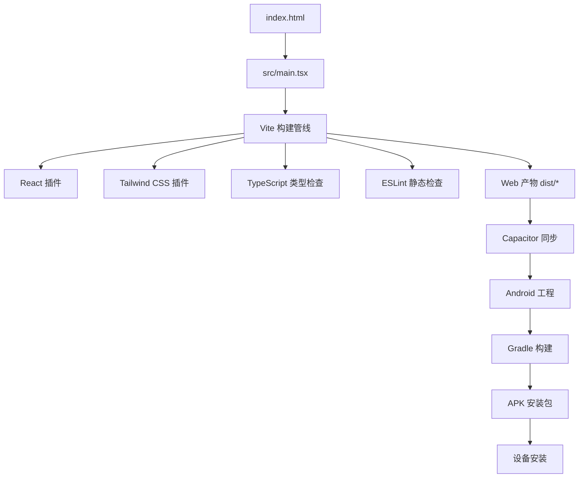
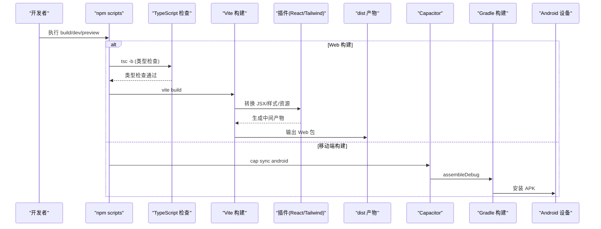
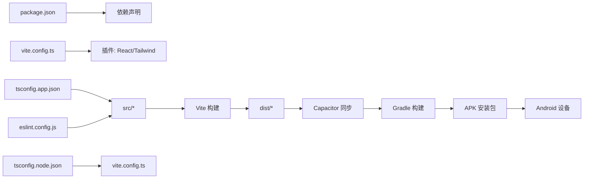

# 构建配置

<cite>
**本文引用的文件**
- [vite.config.ts](file://vite.config.ts)
- [package.json](file://package.json)
- [tsconfig.json](file://tsconfig.json)
- [tsconfig.app.json](file://tsconfig.app.json)
- [tsconfig.node.json](file://tsconfig.node.json)
- [eslint.config.js](file://eslint.config.js)
- [index.html](file://index.html)
- [src/main.tsx](file://src/main.tsx)
- [src/config/version.ts](file://src/config/version.ts)
- [capacitor.config.ts](file://capacitor.config.ts)
- [android/build.gradle](file://android/build.gradle)
- [android/app/build.gradle](file://android/app/build.gradle)
- [android/variables.gradle](file://android/variables.gradle)
- [android/settings.gradle](file://android/settings.gradle)
- [android/gradle.properties](file://android/gradle.properties)
- [android/app/capacitor.build.gradle](file://android/app/capacitor.build.gradle)
- [install-apk.bat](file://install-apk.bat)
- [install-apk.ps1](file://install-apk.ps1)
</cite>

## 更新摘要
**变更内容**
- 新增 Android 构建配置章节，涵盖 Gradle 构建系统、Capacitor 集成
- 新增 APK 安装与部署脚本说明
- 更新项目结构以包含移动端构建支持
- 扩展性能优化建议以涵盖移动端构建优化
- 新增移动端构建故障排查指南

## 目录
1. [简介](#简介)
2. [项目结构](#项目结构)
3. [核心组件](#核心组件)
4. [架构总览](#架构总览)
5. [详细组件分析](#详细组件分析)
6. [依赖关系分析](#依赖关系分析)
7. [性能优化建议](#性能优化建议)
8. [故障排查指南](#故障排查指南)
9. [结论](#结论)
10. [附录](#附录)

## 简介
本文件为 AIShop 项目的完整构建配置文档，覆盖 Vite 开发服务器与生产构建、插件与环境变量、TypeScript 编译配置、npm scripts 使用方式、Android 移动端构建、Capacitor 集成、APK 安装部署、性能优化策略以及常见构建问题的排查方法。目标是帮助开发者快速理解并高效维护项目的跨平台构建流程。

## 项目结构
AIShop 采用现代前端工程化结构，同时支持 Web 和 Android 移动端：
- 入口 HTML 位于根目录 index.html，加载 src/main.tsx 作为应用入口。
- Vite 配置文件 vite.config.ts 集中管理插件、开发服务器、常量注入等。
- TypeScript 配置拆分为 tsconfig.app.json（应用代码）与 tsconfig.node.json（Node/构建脚本），由 tsconfig.json 引用聚合。
- ESLint 通过 eslint.config.js 启用 React Hooks 与 React Refresh 规则。
- npm scripts 在 package.json 中定义 dev/build/lint/preview 等常用命令。
- **新增** Android 工程位于 android/ 目录，使用 Gradle 构建系统。
- **新增** Capacitor 配置文件 capacitor.config.ts 用于 Web 到移动端的桥接。
- **新增** APK 安装脚本 install-apk.bat 和 install-apk.ps1 提供一键打包安装功能。

**图表来源**
- [index.html:1-23](file://index.html#L1-L23)
- [src/main.tsx:1-8](file://src/main.tsx#L1-L8)
- [vite.config.ts:1-18](file://vite.config.ts#L1-L18)
- [capacitor.config.ts:1-18](file://capacitor.config.ts#L1-L18)
- [android/build.gradle:1-30](file://android/build.gradle#L1-L30)
- [install-apk.ps1:1-176](file://install-apk.ps1#L1-L176)

**章节来源**
- [index.html:1-23](file://index.html#L1-L23)
- [src/main.tsx:1-8](file://src/main.tsx#L1-L8)
- [vite.config.ts:1-18](file://vite.config.ts#L1-L18)
- [eslint.config.js:1-23](file://eslint.config.js#L1-L23)
- [capacitor.config.ts:1-18](file://capacitor.config.ts#L1-L18)
- [android/build.gradle:1-30](file://android/build.gradle#L1-L30)

## 核心组件
- Vite 配置：包含 React 与 Tailwind CSS 插件、开发服务器 host 设置、构建时常量注入。
- TypeScript 配置：目标 ES2023、模块系统 esnext、bundler 解析模式、JSX react-jsx、严格 lint 相关选项。
- npm Scripts：dev、build、lint、preview 四个常用命令。
- ESLint：基于 flat config，启用 JS 推荐、TS 推荐、React Hooks、React Refresh 与浏览器全局。
- **新增** Capacitor 配置：appId、appName、webDir 设置，SystemBars 插件配置。
- **新增** Android Gradle 配置：compileSdkVersion、minSdkVersion、targetSdkVersion 版本管理。
- **新增** APK 安装脚本：自动化设备检测、构建、安装流程。

**章节来源**
- [vite.config.ts:1-18](file://vite.config.ts#L1-L18)
- [tsconfig.app.json:1-26](file://tsconfig.app.json#L1-L26)
- [tsconfig.node.json:1-25](file://tsconfig.node.json#L1-L25)
- [package.json:1-58](file://package.json#L1-L58)
- [eslint.config.js:1-23](file://eslint.config.js#L1-L23)
- [capacitor.config.ts:1-18](file://capacitor.config.ts#L1-L18)
- [android/variables.gradle:1-16](file://android/variables.gradle#L1-L16)
- [install-apk.ps1:1-176](file://install-apk.ps1#L1-L176)

## 架构总览
下图展示了从源码到产物的完整构建链路，包括 Web 构建、移动端转换、原生编译和设备部署。

**图表来源**
- [package.json:6-10](file://package.json#L6-L10)
- [vite.config.ts:1-18](file://vite.config.ts#L1-L18)
- [capacitor.config.ts:1-18](file://capacitor.config.ts#L1-L18)
- [android/app/build.gradle:1-55](file://android/app/build.gradle#L1-L55)
- [install-apk.ps1:106-138](file://install-apk.ps1#L106-L138)

## 详细组件分析

### Vite 配置详解
- 插件
  - React：提供 JSX/TSX 支持与 React Refresh。
  - Tailwind CSS：通过 @tailwindcss/vite 集成 Tailwind v4 的构建期处理。
- 开发服务器
  - host: '0.0.0.0'，允许局域网访问。
- 构建时常量注入
  - define 中将 __APP_VERSION__ 注入为 package.json 的 version，便于运行时获取版本信息。
- 环境变量
  - 当前未显式配置 .env 文件；可通过 Vite 默认的环境变量约定（如 import.meta.env.*）在后续扩展。

**章节来源**
- [vite.config.ts:1-18](file://vite.config.ts#L1-L18)
- [package.json:1-58](file://package.json#L1-L58)
- [src/config/version.ts:1-16](file://src/config/version.ts#L1-L16)

### TypeScript 编译配置
- 目标与库
  - target: es2023，lib: ES2023 + DOM（应用）或仅 ES2023（Node）。
- 模块系统
  - module: esnext，moduleResolution: bundler，支持现代模块语法与导入导出。
- JSX
  - jsx: react-jsx，启用新的 JSX 转换。
- 类型与检查
  - skipLibCheck: true 提升构建速度。
  - noUnusedLocals/noUnusedParameters/noFallthroughCasesInSwitch 增强代码质量。
  - verbatimModuleSyntax/moduleDetection: force 确保模块语法一致性。
- 文件范围
  - tsconfig.app.json include: ["src"]，tsconfig.node.json include: ["vite.config.ts"]。
- 聚合引用
  - tsconfig.json 通过 references 引用 app 与 node 两个子配置。

**章节来源**
- [tsconfig.app.json:1-26](file://tsconfig.app.json#L1-L26)
- [tsconfig.node.json:1-25](file://tsconfig.node.json#L1-L25)
- [tsconfig.json:1-8](file://tsconfig.json#L1-L8)

### npm Scripts 使用
- dev：启动 Vite 开发服务器，支持热更新。
- build：先执行 tsc -b 进行跨项目类型检查，再执行 vite build 生成生产包。
- lint：运行 ESLint 检查。
- preview：本地预览构建产物。

**章节来源**
- [package.json:6-10](file://package.json#L6-L10)

### Capacitor 移动端配置
- 应用标识：appId 设置为 "com.portai.app"，appName 为 "PortAI"
- Web 目录：webDir 指向构建输出的 "dist" 目录
- 插件配置：禁用 SystemBars 自动 insets 处理，避免 Android 16 上的视口裁剪问题
- 原生桥接：通过 MainActivity 注入 --native-inset-top/bottom 真实值

**章节来源**
- [capacitor.config.ts:1-18](file://capacitor.config.ts#L1-L18)

### Android Gradle 构建配置
- SDK 版本管理：
  - compileSdkVersion: 36
  - minSdkVersion: 24  
  - targetSdkVersion: 36
- 应用配置：
  - applicationId: "com.portai.app"
  - versionCode: 1
  - versionName: "1.2.0"
- 构建类型：release 模式启用 ProGuard 混淆
- 依赖管理：集成 Capacitor 核心库和相关插件
- Java 版本：要求 JDK 21+，sourceCompatibility 和 targetCompatibility 均设置为 VERSION_21

**章节来源**
- [android/build.gradle:1-30](file://android/build.gradle#L1-L30)
- [android/app/build.gradle:1-55](file://android/app/build.gradle#L1-L55)
- [android/variables.gradle:1-16](file://android/variables.gradle#L1-L16)
- [android/app/capacitor.build.gradle:1-26](file://android/app/capacitor.build.gradle#L1-L26)

### APK 安装与部署脚本
- Windows 批处理脚本：install-apk.bat 调用 PowerShell 脚本
- PowerShell 自动化脚本：install-apk.ps1 提供完整的构建安装流程
- 主要功能：
  - 自动检测设备连接状态
  - 智能查找 ADB 工具位置
  - 验证 JDK 21+ 环境
  - 执行 Web 构建和 Capacitor 同步
  - 调用 Gradle 编译 APK
  - 自动安装到已连接设备
  - 可选立即启动应用

**章节来源**
- [install-apk.bat:1-10](file://install-apk.bat#L1-L10)
- [install-apk.ps1:1-176](file://install-apk.ps1#L1-L176)

### 环境变量管理
- 当前仓库未包含 .env 文件；可在根目录创建 .env、.env.development、.env.production 等文件，并通过 import.meta.env.* 读取。
- 已使用 define 注入 __APP_VERSION__，示例用法见版本配置模块。

**章节来源**
- [vite.config.ts:14-16](file://vite.config.ts#L14-L16)
- [src/config/version.ts:1-16](file://src/config/version.ts#L1-L16)

### 入口与页面
- index.html 引入 /src/main.tsx 作为应用入口。
- main.tsx 初始化 React 根节点并挂载 App。

**章节来源**
- [index.html:1-23](file://index.html#L1-L23)
- [src/main.tsx:1-8](file://src/main.tsx#L1-L8)

## 依赖关系分析
- 构建工具链
  - Vite 作为核心构建器，配合 @vitejs/plugin-react 与 @tailwindcss/vite。
  - TypeScript 负责类型检查与语法转换（由 Vite 在开发时即时编译，构建前通过 tsc -b 做增量类型检查）。
  - ESLint 负责静态代码检查。
  - **新增** Capacitor 负责 Web 到移动端的桥接。
  - **新增** Gradle 负责 Android 原生应用的编译打包。
- 运行时依赖
  - React、ReactDOM 等 UI 框架与生态库。
  - Tailwind CSS 用于样式。
  - **新增** Capacitor 插件：camera、filesystem、haptics、share、status-bar 等。
- 外部服务
  - 字体等资源通过 CDN 预连接，减少首屏延迟。

**图表来源**
- [package.json:12-56](file://package.json#L12-L56)
- [vite.config.ts:1-18](file://vite.config.ts#L1-L18)
- [capacitor.config.ts:1-18](file://capacitor.config.ts#L1-L18)
- [android/app/build.gradle:33-43](file://android/app/build.gradle#L33-L43)

**章节来源**
- [package.json:12-56](file://package.json#L12-L56)
- [vite.config.ts:1-18](file://vite.config.ts#L1-L18)
- [tsconfig.app.json:1-26](file://tsconfig.app.json#L1-L26)
- [tsconfig.node.json:1-25](file://tsconfig.node.json#L1-L25)
- [eslint.config.js:1-23](file://eslint.config.js#L1-L23)

## 性能优化建议
- 代码分割
  - 利用动态 import() 对大体积功能模块进行按需加载（例如 PDF、Excel、Markdown 渲染等重型依赖）。
  - 将第三方库按路由或功能拆分，减少首屏体积。
- 资源压缩
  - 生产构建可开启 gzip/brotli 压缩（部署层或 CDN 侧），减小传输体积。
  - 图片与图标使用合适格式与尺寸，必要时进行压缩与懒加载。
- 缓存策略
  - 利用 Vite 默认的内容哈希文件名，结合服务端长缓存策略提高重复访问性能。
  - 静态资源（public 下）与构建产物分离缓存。
- 构建加速
  - 保持 skipLibCheck: true，避免不必要的类型检查开销。
  - 合理使用 monorepo 或分包时，确保增量构建生效。
  - **新增** Gradle 构建缓存：首次构建较慢，后续构建会利用缓存显著提升速度。
- 网络优化
  - 保留 preconnect 与 dns-prefetch 以加速外部资源（如字体）加载。
- **新增** 移动端优化
  - 合理配置 minSdkVersion 以平衡兼容性和性能。
  - 使用 ProGuard 混淆减少 APK 体积。
  - 按需启用 Capacitor 插件以减少包大小。

## 故障排查指南
- 构建时报 TypeScript 错误
  - 现象：tsc -b 失败导致构建中断。
  - 排查：检查 src 下的类型错误与未使用变量/参数告警；确认 tsconfig.app.json 的 include 是否覆盖所有需要检查的文件。
  - 参考：构建脚本顺序为先类型检查后构建。
- 开发服务器无法局域网访问
  - 现象：其他设备无法访问 localhost。
  - 排查：确认 vite.config.ts 中 server.host 是否为 '0.0.0.0'。
- 环境变量未生效
  - 现象：import.meta.env.* 为空或 undefined。
  - 排查：确认 .env 文件命名与位置正确；重启开发服务器；注意区分 development/production 环境。
- 样式未生效
  - 现象：Tailwind 类名无效。
  - 排查：确认已安装并启用 @tailwindcss/vite；检查 CSS 入口是否正确引入 Tailwind 指令（若存在）。
- 版本常量未注入
  - 现象：运行时无法获取版本号。
  - 排查：确认 vite.config.ts 中 define 已注入 __APP_VERSION__，并在版本配置模块中正确导出。
- **新增** Android 构建失败
  - 现象：Gradle 构建报错或找不到 JDK。
  - 排查：确认已安装 JDK 21+；检查 JAVA_HOME 环境变量；验证 Android SDK 路径配置。
- **新增** APK 安装失败
  - 现象：adb 连接失败或设备安装错误。
  - 排查：确认 USB 调试已开启；检查设备授权状态；验证 adb 工具路径；清理旧版本应用后重试。
- **新增** Capacitor 同步问题
  - 现象：cap sync 命令失败或 Web 资源未同步。
  - 排查：确认 dist 目录存在；检查 Capacitor 配置；重新执行 npx cap add android。

**章节来源**
- [package.json:6-10](file://package.json#L6-L10)
- [vite.config.ts:11-16](file://vite.config.ts#L11-L16)
- [src/config/version.ts:1-16](file://src/config/version.ts#L1-L16)
- [install-apk.ps1:78-104](file://install-apk.ps1#L78-L104)
- [android/app/build.gradle:19-24](file://android/app/build.gradle#L19-L24)

## 结论
本项目采用 Vite + TypeScript + ESLint 的现代前端构建方案，并成功集成了 Capacitor 和 Gradle 实现跨平台移动端构建。通过合理的插件组合、严格的类型检查、规范的脚本组织以及完善的移动端构建流程，能够在保证开发体验的同时产出高质量的 Web 和 Android 应用包。建议在后续迭代中继续优化构建性能，完善移动端适配，并考虑添加 iOS 构建支持。

## 附录
- 常用命令速查
  - Web 开发：npm run dev
  - Web 构建：npm run build
  - 代码检查：npm run lint
  - 预览构建：npm run preview
  - **新增** Android 构建：双击 install-apk.bat 或使用 npx cap sync android && cd android && ./gradlew assembleDebug
  - **新增** 一键安装：双击 install-apk.bat 或运行 powershell install-apk.ps1
- 关键配置路径
  - Vite：vite.config.ts
  - TypeScript：tsconfig.app.json、tsconfig.node.json、tsconfig.json
  - ESLint：eslint.config.js
  - Capacitor：capacitor.config.ts
  - **新增** Android：android/build.gradle、android/app/build.gradle、android/variables.gradle
  - **新增** 安装脚本：install-apk.bat、install-apk.ps1
  - 入口：index.html、src/main.tsx

**章节来源**
- [package.json:6-10](file://package.json#L6-L10)
- [vite.config.ts:1-18](file://vite.config.ts#L1-L18)
- [tsconfig.json:1-8](file://tsconfig.json#L1-L8)
- [tsconfig.app.json:1-26](file://tsconfig.app.json#L1-L26)
- [tsconfig.node.json:1-25](file://tsconfig.node.json#L1-L25)
- [eslint.config.js:1-23](file://eslint.config.js#L1-L23)
- [capacitor.config.ts:1-18](file://capacitor.config.ts#L1-L18)
- [android/build.gradle:1-30](file://android/build.gradle#L1-L30)
- [android/app/build.gradle:1-55](file://android/app/build.gradle#L1-L55)
- [android/variables.gradle:1-16](file://android/variables.gradle#L1-L16)
- [install-apk.bat:1-10](file://install-apk.bat#L1-L10)
- [install-apk.ps1:1-176](file://install-apk.ps1#L1-L176)
- [index.html:1-23](file://index.html#L1-L23)
- [src/main.tsx:1-8](file://src/main.tsx#L1-L8)