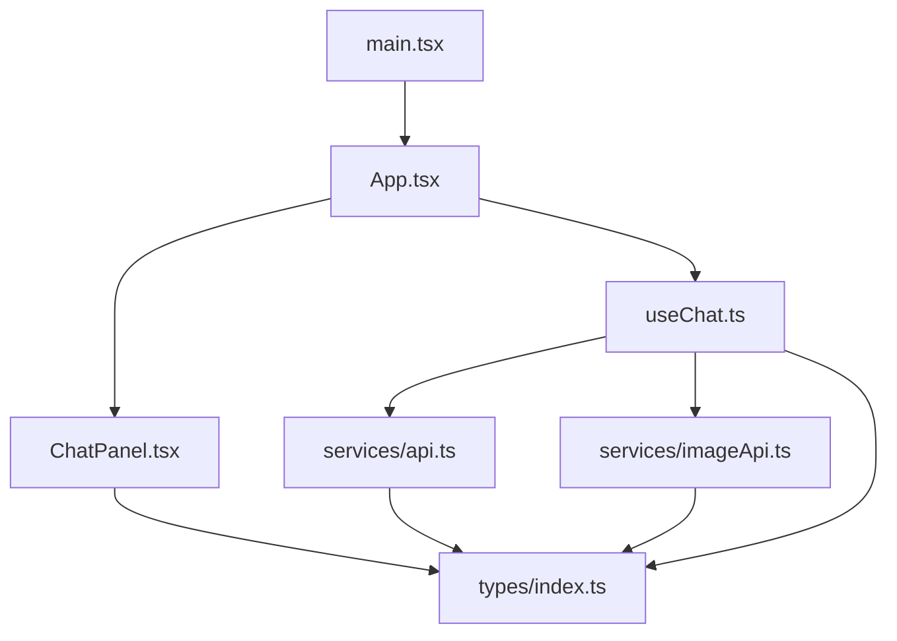
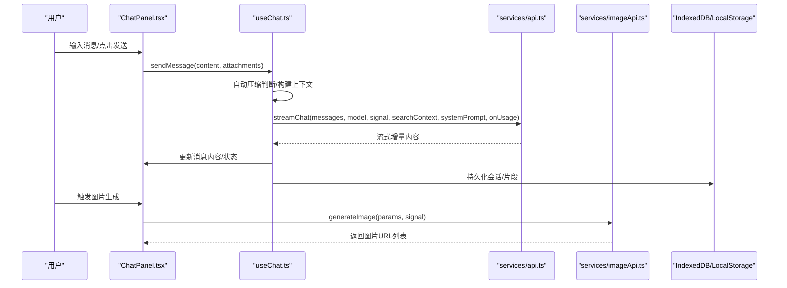
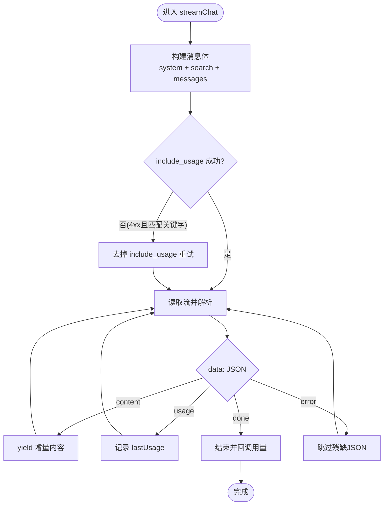
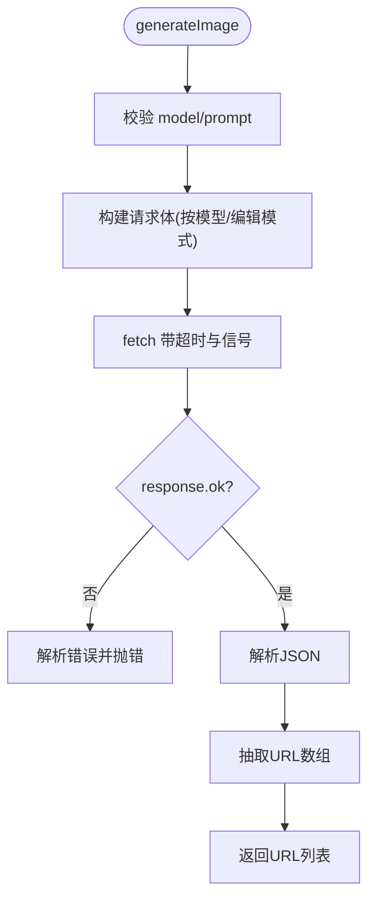
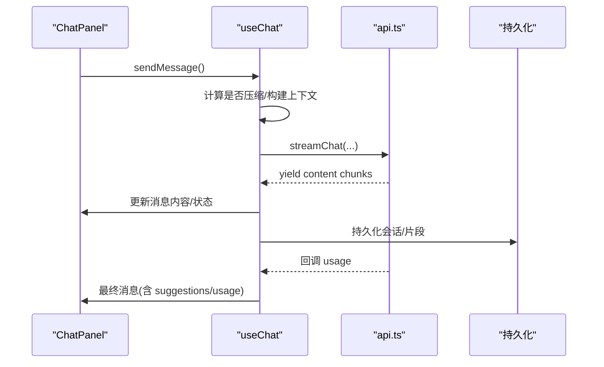
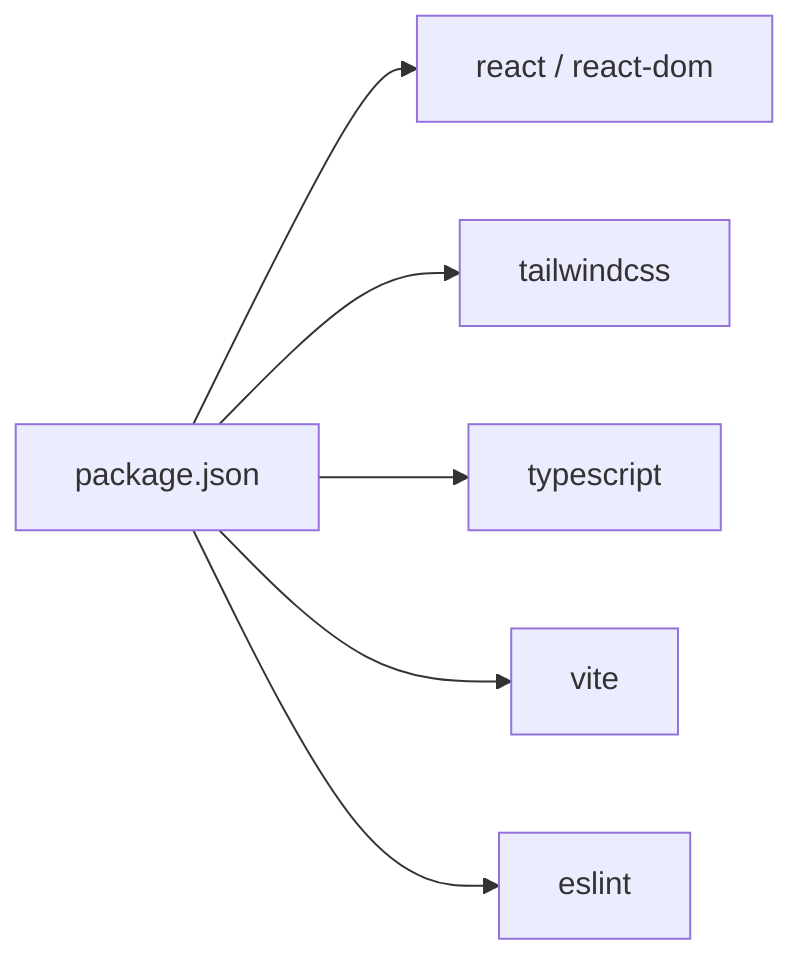

# 测试策略

<cite>
**本文引用的文件**
- [package.json](file://package.json)
- [vite.config.ts](file://vite.config.ts)
- [README.md](file://README.md)
- [eslint.config.js](file://eslint.config.js)
- [tsconfig.app.json](file://tsconfig.app.json)
- [App.tsx](file://src/App.tsx)
- [main.tsx](file://src/main.tsx)
- [api.ts](file://src/services/api.ts)
- [imageApi.ts](file://src/services/imageApi.ts)
- [useChat.ts](file://src/hooks/useChat.ts)
- [ChatPanel.tsx](file://src/components/chat/ChatPanel.tsx)
- [index.ts](file://src/types/index.ts)
</cite>

## 目录
1. [简介](#简介)
2. [项目结构](#项目结构)
3. [核心组件](#核心组件)
4. [架构总览](#架构总览)
5. [详细组件分析](#详细组件分析)
6. [依赖分析](#依赖分析)
7. [性能考虑](#性能考虑)
8. [故障排查指南](#故障排查指南)
9. [结论](#结论)
10. [附录](#附录)

## 简介
本测试策略面向 AIShop（React + TypeScript + Vite）前端应用，目标是建立覆盖单元测试、集成测试与端到端测试的分层体系，确保聊天流式生成、图片生成、状态持久化、错误处理等关键路径稳定可靠。文档将明确各层测试的适用范围、编写规范、Mock 策略、覆盖率目标、持续集成配置与维护建议，并结合项目现有代码给出可落地的实践方案。

## 项目结构
AIShop 采用典型的前端分层：
- 入口与根组件：main.tsx 挂载 App；App.tsx 管理全局 Tab、主题、对话与收藏等跨模块状态。
- 业务 Hook：useChat.ts 封装会话生命周期、消息发送、流式响应、上下文压缩、联网搜索等复杂逻辑。
- UI 组件：ChatPanel.tsx 负责对话渲染、折叠/展开、搜索、滚动定位、Artifact 预览等交互。
- 服务层：api.ts 提供流式聊天接口；imageApi.ts 提供图片生成接口；其他服务用于设置、存储、搜索等。
- 类型定义：types/index.ts 统一消息、用量、会话、图片参数等数据结构。
- 构建与工具：vite.config.ts、eslint.config.js、tsconfig.app.json 等。

图表来源
- [main.tsx:1-8](file://src/main.tsx#L1-L8)
- [App.tsx:1-147](file://src/App.tsx#L1-L147)
- [ChatPanel.tsx:1-623](file://src/components/chat/ChatPanel.tsx#L1-L623)
- [useChat.ts:1-800](file://src/hooks/useChat.ts#L1-L800)
- [api.ts:1-173](file://src/services/api.ts#L1-L173)
- [imageApi.ts:1-257](file://src/services/imageApi.ts#L1-L257)
- [index.ts:1-252](file://src/types/index.ts#L1-L252)

章节来源
- [package.json:1-47](file://package.json#L1-L47)
- [vite.config.ts:1-18](file://vite.config.ts#L1-L18)
- [README.md:1-74](file://README.md#L1-L74)
- [eslint.config.js:1-22](file://eslint.config.js#L1-L22)
- [tsconfig.app.json:1-25](file://tsconfig.app.json#L1-L25)

## 核心组件
- 根应用与路由切换：App.tsx 根据 activeTab 渲染 ChatPanel/ImagePanel/FavoritesPanel/SettingsPanel，并传递模型、搜索开关、收藏状态等。
- 聊天 Hook：useChat.ts 实现启动恢复、持久化、自动压缩、消息发送、流式接收、联网搜索、用量统计、错误处理等。
- 聊天面板：ChatPanel.tsx 负责消息列表渲染、折叠浏览、搜索高亮、滚动定位、Artifact 预览、输入框交互。
- API 服务：api.ts 提供流式聊天请求、SSE 解析、用量提取、失败重试；imageApi.ts 提供图片生成请求、多上游兼容、超时与取消控制。
- 类型系统：types/index.ts 定义 Message、Conversation、TokenUsage、ImageGenerationParams 等，贯穿全栈。

章节来源
- [App.tsx:1-147](file://src/App.tsx#L1-L147)
- [useChat.ts:1-800](file://src/hooks/useChat.ts#L1-L800)
- [ChatPanel.tsx:1-623](file://src/components/chat/ChatPanel.tsx#L1-L623)
- [api.ts:1-173](file://src/services/api.ts#L1-L173)
- [imageApi.ts:1-257](file://src/services/imageApi.ts#L1-L257)
- [index.ts:1-252](file://src/types/index.ts#L1-L252)

## 架构总览
下图展示从用户输入到流式输出、再到状态更新与持久化的完整流程，以及图片生成的并行链路。

图表来源
- [ChatPanel.tsx:1-623](file://src/components/chat/ChatPanel.tsx#L1-L623)
- [useChat.ts:1-800](file://src/hooks/useChat.ts#L1-L800)
- [api.ts:1-173](file://src/services/api.ts#L1-L173)
- [imageApi.ts:1-257](file://src/services/imageApi.ts#L1-L257)

## 详细组件分析

### 聊天流式发送与接收（API 层）
- 职责：组装消息体、鉴权、发起 SSE 流、解析 usage、异常重试与错误抛出。
- 关键点：
  - 首次尝试 include_usage，若网关不支持则去掉该字段重试一次。
  - 逐行解析 data: JSON，提取 delta.content 与 usage。
  - 流结束或异常时清理资源并回调用量。
- 测试要点：
  - Mock fetch 返回流式数据，验证增量内容正确拼接与最终 usage 回调。
  - 模拟 4xx 且包含 stream_options/unknown/unsupported/invalid 的错误文本，验证重试行为。
  - 模拟无 body、空 choices、残缺 JSON 等边界情况，验证健壮性。

图表来源
- [api.ts:44-173](file://src/services/api.ts#L44-L173)

章节来源
- [api.ts:1-173](file://src/services/api.ts#L1-L173)

### 图片生成（API 层）
- 职责：按模型选择 endpoint、构造请求体、合并 AbortSignal、超时控制、错误信息规范化、结果 URL 抽取。
- 关键点：
  - 支持多种上游响应格式（images/data/image_urls）。
  - 编辑模式区分 base64 与 URL，GPT Image 2 要求 data URI。
  - 120s 超时，外部取消与内部超时分歧抛错。
- 测试要点：
  - Mock fetch 返回不同结构响应，验证 URL 抽取。
  - 模拟 4xx 错误，校验 detail/error.message 的拼接。
  - 模拟超时与取消，验证错误语义。

图表来源
- [imageApi.ts:149-243](file://src/services/imageApi.ts#L149-L243)

章节来源
- [imageApi.ts:1-257](file://src/services/imageApi.ts#L1-L257)

### 聊天 Hook（useChat）
- 职责：会话启动恢复、持久化 diff、自动压缩、消息发送、流式更新、联网搜索、用量统计、错误处理。
- 关键点：
  - 启动时加载会话列表与上次活跃会话，必要时新建会话。
  - 发送前评估是否自动压缩，避免上下文超限。
  - 流式过程中实时更新 UI，结束后清理 artifact 标记与建议。
  - 联网搜索可选，失败不影响主流程。
- 测试要点：
  - 验证发送前后消息状态变化（isStreaming、suggestions、usage）。
  - 验证自动压缩触发条件与 segment 插入。
  - 验证联网搜索开关与失败场景的状态更新。
  - 验证取消生成时的状态回退。

图表来源
- [useChat.ts:494-783](file://src/hooks/useChat.ts#L494-L783)
- [api.ts:44-173](file://src/services/api.ts#L44-L173)

章节来源
- [useChat.ts:1-800](file://src/hooks/useChat.ts#L1-L800)

### 聊天面板（ChatPanel）
- 职责：消息渲染、折叠/展开、搜索高亮、滚动定位、Artifact 预览、输入框交互。
- 关键点：
  - 折叠态下保持滚动锚点，避免闪烁。
  - 搜索时定位命中项并平滑滚动。
  - Artifact 流式期间打开面板并逐步更新代码。
- 测试要点：
  - 用户交互：发送消息、停止生成、切换折叠态、搜索跳转。
  - 状态变化：消息列表更新、Artifact 面板打开/关闭。
  - 异步操作：流式内容追加、滚动位置修正。

章节来源
- [ChatPanel.tsx:1-623](file://src/components/chat/ChatPanel.tsx#L1-L623)

### 类型与数据契约
- 通过 types/index.ts 统一消息、会话、用量、图片参数等结构，所有测试断言应基于这些类型进行约束，保证前后端契约一致。

章节来源
- [index.ts:1-252](file://src/types/index.ts#L1-L252)

## 依赖分析
- 运行时依赖：React、Tailwind、PDF/Office/Pinyin 等库，主要用于渲染与数据处理。
- 开发依赖：Vite、TypeScript、ESLint、React 插件。
- 测试相关依赖：当前 package.json 未内置测试框架，需在策略中引入。

图表来源
- [package.json:12-45](file://package.json#L12-L45)

章节来源
- [package.json:1-47](file://package.json#L1-L47)

## 性能考虑
- 流式渲染：大量增量更新需避免重排抖动，测试应关注 UI 在高频更新下的稳定性。
- 持久化：使用 diff 写入减少 IO 压力，测试需覆盖频繁保存场景。
- 网络超时与取消：图片生成与聊天流均需合理超时与取消，测试应覆盖边界。
- 内存占用：长历史会话与大图附件需关注内存泄漏风险，测试应包含长时间运行场景。

[本节为通用指导，不直接分析具体文件]

## 故障排查指南
- API 失败：检查 Authorization、stream_options 兼容性、错误文本关键字匹配与重试逻辑。
- 流式中断：确认 AbortController 是否正确释放，finally 块是否执行。
- 用量缺失：当网关不返回 usage 时，onUsage 不会被调用，需在上层做兜底。
- 图片生成错误：区分超时、取消、4xx 错误，优先显示上游 detail 或 error.message。

章节来源
- [api.ts:102-118](file://src/services/api.ts#L102-L118)
- [imageApi.ts:183-243](file://src/services/imageApi.ts#L183-L243)

## 结论
本策略以“金字塔”思想组织测试：底层单元测试保障核心算法与服务层的稳定性；中间集成测试验证 Hook 与组件协作；顶层端到端测试覆盖真实用户路径。结合 Mock 策略、覆盖率目标与 CI 流水线，可有效提升 AIShop 的质量与交付效率。

[本节为总结，不直接分析具体文件]

## 附录

### 测试金字塔与分层策略
- 单元测试（Unit Tests）
  - 范围：纯函数、Hook 内部逻辑、API 服务层（Mock 网络）、工具函数。
  - 目标：快速反馈、高覆盖率（建议 ≥80% 分支覆盖率）。
  - 推荐框架：Vitest（与 Vite 生态契合），配合 tsconfig 与 ES 模块。
- 集成测试（Integration Tests）
  - 范围：Hook 与服务的组合（如 useChat 与 api.ts）、组件与服务交互（Mock fetch）。
  - 目标：验证模块间契约与数据流。
  - 推荐框架：Vitest + React Testing Library（组件集成）。
- 端到端测试（E2E Tests）
  - 范围：用户关键路径（发送消息、查看结果、图片生成、收藏/设置）。
  - 目标：真实浏览器环境下的功能验证。
  - 推荐框架：Playwright（跨浏览器、稳定、易集成 CI）。

### 单元测试编写指南
- 测试框架选择
  - 首选 Vitest：原生支持 Vite、TS、ESM、Fast Refresh，易于与现有工程集成。
  - 组件测试：React Testing Library + @testing-library/react，聚焦用户行为与可见 DOM。
- 测试用例设计
  - 正向路径：正常请求、成功流式、用量回调、状态更新。
  - 反向路径：网络错误、超时、取消、非法参数、空响应。
  - 边界条件：大消息、长历史、多图、多模型版本、压缩区间。
- Mock 策略
  - 网络层：Mock fetch，返回 Response 与 ReadableStream（SSE 数据）。
  - 外部服务：settingsService、storage、IndexedDB、webSearch 等通过模块级 Mock 替换。
  - 时间与环境：使用 vi.useFakeTimers 控制定时器与异步时序。
- 示例断言要点
  - 流式：验证增量内容拼接顺序、最终 usage 回调次数与值。
  - 错误：验证错误信息可读性与重试逻辑。
  - 状态：验证 isStreaming、suggestions、artifact 等状态变化。

### 组件测试最佳实践
- 用户交互测试
  - 发送消息：触发 sendMessage，验证消息列表新增、loading 状态。
  - 停止生成：触发 stopGeneration，验证最后一条 assistant 消息状态。
  - 折叠/展开：验证滚动位置与锚点保持。
- 状态变化测试
  - 流式更新：验证内容逐步渲染、Artifact 面板打开/关闭。
  - 搜索高亮：验证命中项定位与滚动。
- 异步操作测试
  - 使用 waitFor/findBy* 等待异步更新完成。
  - Mock 网络与定时器，确保确定性。

### API 测试方法
- 接口测试
  - 聊天流：Mock fetch 返回 SSE 流，验证增量内容与 usage。
  - 图片生成：Mock fetch 返回不同结构响应，验证 URL 抽取。
- 数据验证
  - 校验返回结构是否符合 types/index.ts 定义。
  - 校验用量字段存在性与数值合理性。
- 错误场景测试
  - 4xx/5xx、超时、取消、空 body、非法 JSON。
  - 校验错误信息可读性与提示文案。

### 测试覆盖率要求
- 语句/分支覆盖率：≥80%（核心逻辑建议 ≥90%）。
- 行覆盖率：≥85%。
- 排除规则：忽略第三方库、配置文件、类型声明、纯样式文件。
- 报告：生成 HTML 与 JSON 报告，便于 CI 归档与质量门禁。

### 持续集成配置
- 步骤
  - 安装依赖：npm ci。
  - 类型检查：tsc --noEmit。
  - Lint：eslint .。
  - 单元测试：vitest run --coverage。
  - 组件集成测试：vitest run src/**/*.test.*。
  - E2E：playwright test。
- 缓存与并行
  - 缓存 node_modules。
  - 并行执行单元与集成测试。
- 质量门禁
  - 覆盖率阈值不达标则失败。
  - 类型错误或 lint 失败则阻断。

### 测试维护建议
- 用例命名：以“描述_场景_期望”命名，清晰表达意图。
- 数据驱动：对多模型、多响应结构使用数据驱动用例。
- 隔离依赖：严格 Mock 外部服务，避免不稳定因素。
- 定期复盘：根据线上问题补充回归用例。
- 文档同步：变更公共接口时同步更新测试用例与文档。