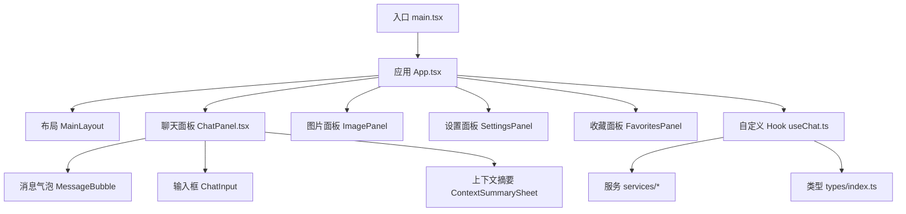
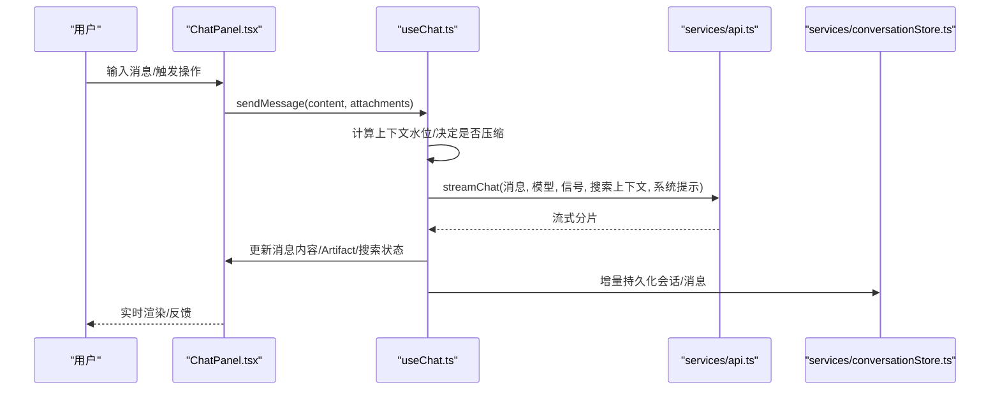
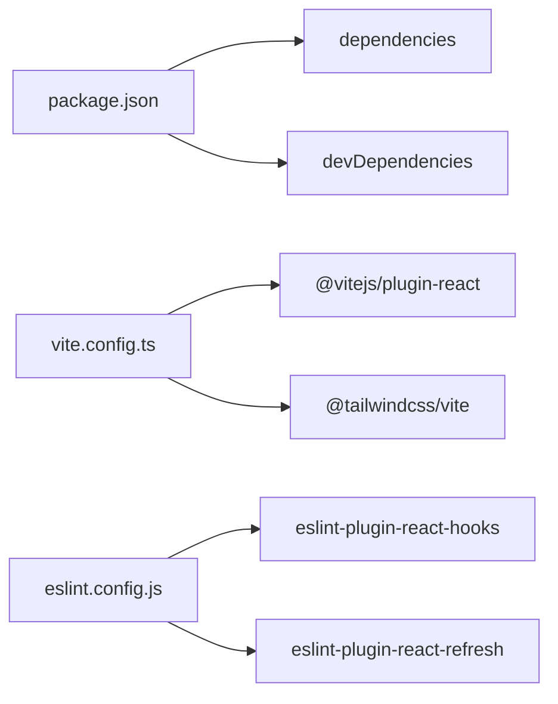

# 编码规范

<cite>
**本文引用的文件**
- [eslint.config.js](file://eslint.config.js)
- [tsconfig.json](file://tsconfig.json)
- [tsconfig.app.json](file://tsconfig.app.json)
- [package.json](file://package.json)
- [vite.config.ts](file://vite.config.ts)
- [src/App.tsx](file://src/App.tsx)
- [src/main.tsx](file://src/main.tsx)
- [src/types/index.ts](file://src/types/index.ts)
- [src/hooks/useChat.ts](file://src/hooks/useChat.ts)
- [src/components/chat/ChatPanel.tsx](file://src/components/chat/ChatPanel.tsx)
- [src/config/models.ts](file://src/config/models.ts)
- [README.md](file://README.md)
</cite>

## 目录
1. [简介](#简介)
2. [项目结构](#项目结构)
3. [核心组件](#核心组件)
4. [架构总览](#架构总览)
5. [详细组件分析](#详细组件分析)
6. [依赖分析](#依赖分析)
7. [性能考虑](#性能考虑)
8. [故障排查指南](#故障排查指南)
9. [结论](#结论)
10. [附录](#附录)

## 简介
本编码规范面向 AIShop 前端工程，覆盖 ESLint 规则、TypeScript 类型检查配置、React Hooks 与 React Refresh 集成、组件开发最佳实践、代码风格约定以及反模式避免指南。目标是在保证一致性与可维护性的同时，提升团队协作效率与代码质量。

## 项目结构
AIShop 基于 Vite + React + TypeScript 构建，采用模块化目录组织：
- src/components：按功能域划分组件（chat、image、layout、common 等）
- src/hooks：业务逻辑封装为自定义 Hook（如 useChat）
- src/services：API 调用、存储、工具服务
- src/types：统一类型定义
- src/config：模型配置等静态资源
- 根目录：ESLint、TSConfig、Vite 配置与脚本

图表来源
- [src/main.tsx:1-8](file://src/main.tsx#L1-L8)
- [src/App.tsx:1-147](file://src/App.tsx#L1-L147)
- [src/components/chat/ChatPanel.tsx:1-623](file://src/components/chat/ChatPanel.tsx#L1-L623)
- [src/hooks/useChat.ts:1-800](file://src/hooks/useChat.ts#L1-L800)
- [src/types/index.ts:1-252](file://src/types/index.ts#L1-L252)

章节来源
- [src/main.tsx:1-8](file://src/main.tsx#L1-L8)
- [src/App.tsx:1-147](file://src/App.tsx#L1-L147)
- [src/components/chat/ChatPanel.tsx:1-623](file://src/components/chat/ChatPanel.tsx#L1-L623)
- [src/hooks/useChat.ts:1-800](file://src/hooks/useChat.ts#L1-L800)
- [src/types/index.ts:1-252](file://src/types/index.ts#L1-L252)

## 核心组件
- 应用入口与挂载：使用 createRoot 渲染 App，注入全局样式。
- 应用主容器 App：管理主题初始化、持久化存储申请、标签页切换、会话状态聚合与 UI 组装。
- 聊天面板 ChatPanel：负责消息列表渲染、折叠浏览、搜索、滚动定位、流式 Artifact 预览、上下文压缩区间标记与摘要编辑。
- 聊天逻辑 Hook useChat：封装会话生命周期、消息发送与流式接收、上下文压缩策略、联网搜索、持久化与错误处理。

章节来源
- [src/main.tsx:1-8](file://src/main.tsx#L1-L8)
- [src/App.tsx:1-147](file://src/App.tsx#L1-L147)
- [src/components/chat/ChatPanel.tsx:1-623](file://src/components/chat/ChatPanel.tsx#L1-L623)
- [src/hooks/useChat.ts:1-800](file://src/hooks/useChat.ts#L1-L800)

## 架构总览
下图展示从用户交互到数据流的关键路径：App 作为编排层，ChatPanel 负责 UI 与交互，useChat 承载业务逻辑并调用 services 完成 API 请求与本地持久化。

图表来源
- [src/components/chat/ChatPanel.tsx:1-623](file://src/components/chat/ChatPanel.tsx#L1-L623)
- [src/hooks/useChat.ts:1-800](file://src/hooks/useChat.ts#L1-L800)

## 详细组件分析

### ESLint 配置与规则
- 基础规则：启用 JS 推荐规则与 TypeScript ESLint 推荐规则。
- React Hooks 规则：启用 react-hooks 的 flat recommended 配置，确保 Hooks 调用顺序与依赖正确性。
- React Refresh：启用 react-refresh 的 vite 配置，支持开发时热更新。
- 全局环境：浏览器全局变量。

建议与实践
- 保持默认推荐规则，逐步引入类型感知规则以获得更严格的检查。
- 在团队内统一 lint 命令与 IDE 集成，确保提交前通过。

章节来源
- [eslint.config.js:1-23](file://eslint.config.js#L1-L23)
- [README.md:14-44](file://README.md#L14-L44)

### TypeScript 类型检查配置
- 目标与库：target es2023，lib 包含 ES2023 与 DOM。
- 模块解析：bundler 模式，允许导入 .ts/.tsx 扩展名，强制 moduleDetection，verbatimModuleSyntax。
- JSX：react-jsx。
- 严格检查：noUnusedLocals、noUnusedParameters、erasableSyntaxOnly、noFallthroughCasesInSwitch。
- 项目引用：根 tsconfig 引用 app 与 node 两个子配置。

建议与实践
- 开启类型感知 lint（参考 README 中的 tseslint 推荐），获得更准确的错误提示。
- 统一使用相对路径或路径别名（若后续引入），并在 tsconfig 中声明。

章节来源
- [tsconfig.json:1-8](file://tsconfig.json#L1-L8)
- [tsconfig.app.json:1-26](file://tsconfig.app.json#L1-L26)
- [README.md:14-44](file://README.md#L14-L44)

### React Hooks 与 React Refresh 集成
- 使用函数组件与 Hooks 进行状态与副作用管理。
- 通过 @vitejs/plugin-react 提供 React Refresh，配合 eslint-plugin-react-refresh 在开发期检测刷新问题。
- 在复杂状态场景中，优先使用自定义 Hook 封装逻辑（如 useChat）。

最佳实践
- 将副作用与状态逻辑下沉至 Hook，组件仅负责渲染与事件绑定。
- 对异步流程使用 AbortController 控制取消，避免内存泄漏。

章节来源
- [vite.config.ts:1-18](file://vite.config.ts#L1-L18)
- [eslint.config.js:1-23](file://eslint.config.js#L1-L23)
- [src/hooks/useChat.ts:1-800](file://src/hooks/useChat.ts#L1-L800)

### 组件开发最佳实践
- 函数组件：以函数形式定义组件，使用 props 传递数据与回调。
- Hooks 使用：useState、useEffect、useCallback、useMemo、useRef 等按需使用，避免过度优化。
- 状态管理：局部状态放在组件内；跨组件共享状态通过 Hook（如 useChat）或服务层管理。
- 错误处理：捕获异常并给出友好提示，区分网络错误与业务错误。
- 可访问性：为关键交互提供 aria 属性与键盘支持。

示例路径
- 函数组件与 Props：[src/components/chat/ChatPanel.tsx:18-70](file://src/components/chat/ChatPanel.tsx#L18-L70)
- 状态与副作用：[src/App.tsx:16-43](file://src/App.tsx#L16-L43)
- 错误提示与反馈：[src/App.tsx:40-56](file://src/App.tsx#L40-L56)

章节来源
- [src/components/chat/ChatPanel.tsx:18-70](file://src/components/chat/ChatPanel.tsx#L18-L70)
- [src/App.tsx:16-56](file://src/App.tsx#L16-L56)

### 命名规范与文件组织
- 组件与 Hook：使用 PascalCase 命名组件文件名与导出名；Hook 以 use 开头。
- 类型与接口：使用 PascalCase，语义清晰（如 Conversation、Message、ContextSegment）。
- 常量与配置：集中放置在 config 目录（如 models.ts）。
- 服务与工具：按职责拆分 services 与 utils，避免大文件。

示例路径
- 类型定义：[src/types/index.ts:1-252](file://src/types/index.ts#L1-L252)
- 模型配置：[src/config/models.ts:1-284](file://src/config/models.ts#L1-L284)

章节来源
- [src/types/index.ts:1-252](file://src/types/index.ts#L1-L252)
- [src/config/models.ts:1-284](file://src/config/models.ts#L1-L284)

### 注释标准
- 对外暴露的 Hook/组件添加 JSDoc 说明参数与返回值。
- 复杂逻辑处添加行内注释解释意图与边界条件。
- 保留必要的“为什么”而非“是什么”，帮助后续维护者理解决策。

示例路径
- 启动加载与恢复逻辑注释：[src/hooks/useChat.ts:185-288](file://src/hooks/useChat.ts#L185-L288)
- 折叠动画与滚动定位注释：[src/components/chat/ChatPanel.tsx:73-111](file://src/components/chat/ChatPanel.tsx#L73-L111)

章节来源
- [src/hooks/useChat.ts:185-288](file://src/hooks/useChat.ts#L185-L288)
- [src/components/chat/ChatPanel.tsx:73-111](file://src/components/chat/ChatPanel.tsx#L73-L111)

### 反模式避免指南
- 避免在组件中直接发起复杂 API 请求，应封装到 Hook 或服务层。
- 避免在 useEffect 中创建闭包陷阱，必要时使用 useRef 保存最新值。
- 避免重复渲染：合理使用 useMemo/useCallback，但不过度优化。
- 避免未处理的异步错误：对所有 Promise 添加 catch 或 try/catch。
- 避免长耗时同步阻塞：将重计算放入 Web Worker 或延迟执行。

示例路径
- 异步错误处理与状态更新：[src/hooks/useChat.ts:741-780](file://src/hooks/useChat.ts#L741-L780)
- 流式更新与中间态隐藏：[src/hooks/useChat.ts:678-711](file://src/hooks/useChat.ts#L678-L711)

章节来源
- [src/hooks/useChat.ts:678-780](file://src/hooks/useChat.ts#L678-L780)

## 依赖分析
- 运行时依赖：React、TailwindCSS、Markdown/KaTeX 渲染、PDF/Office 解析、IndexedDB 等。
- 开发依赖：Vite、TypeScript、ESLint、React 插件、Tailwind 插件。
- 构建与脚本：dev/build/lint/preview 脚本在 package.json 中定义。

图表来源
- [package.json:1-47](file://package.json#L1-L47)
- [vite.config.ts:1-18](file://vite.config.ts#L1-L18)
- [eslint.config.js:1-23](file://eslint.config.js#L1-L23)

章节来源
- [package.json:1-47](file://package.json#L1-L47)
- [vite.config.ts:1-18](file://vite.config.ts#L1-L18)
- [eslint.config.js:1-23](file://eslint.config.js#L1-L23)

## 性能考虑
- 流式渲染：使用流式响应逐步更新 UI，减少首屏等待时间。
- 增量持久化：对比前后状态差异，仅写入变更部分，避免全量写盘。
- 滚动与动画：使用 requestAnimationFrame 与防抖/节流，避免频繁重排。
- 上下文压缩：根据阈值与热点窗口自动压缩历史，降低 token 消耗与传输开销。
- 资源加载：按需引入第三方库，避免打包体积过大。

章节来源
- [src/hooks/useChat.ts:290-313](file://src/hooks/useChat.ts#L290-L313)
- [src/hooks/useChat.ts:494-783](file://src/hooks/useChat.ts#L494-L783)
- [src/components/chat/ChatPanel.tsx:192-353](file://src/components/chat/ChatPanel.tsx#L192-L353)

## 故障排查指南
- 启动失败：检查 createRoot 与根节点是否存在，确认入口文件与样式引入。
- 热更新不生效：确认 Vite 插件与 React Refresh 配置正确。
- 类型报错：检查 tsconfig 与 ESLint 类型感知配置是否启用。
- 网络请求失败：查看错误信息，区分超时、鉴权、参数校验等问题。
- 持久化异常：检查 IndexedDB 权限与版本兼容，关注 flush 时机。

章节来源
- [src/main.tsx:1-8](file://src/main.tsx#L1-L8)
- [vite.config.ts:1-18](file://vite.config.ts#L1-L18)
- [tsconfig.app.json:1-26](file://tsconfig.app.json#L1-L26)
- [src/hooks/useChat.ts:741-780](file://src/hooks/useChat.ts#L741-L780)

## 结论
本规范围绕 ESLint、TypeScript、React Hooks 与组件实践，结合 AIShop 的实际代码结构与服务集成，提供了清晰的规则与最佳实践。遵循这些约定有助于提升代码一致性、可维护性与用户体验。建议在团队内推广并持续迭代，结合 CI 与 IDE 集成确保落地。

## 附录

### 代码风格约定速查
- 文件命名：组件 PascalCase，Hook 以 use 开头，配置文件 kebab-case。
- 类型定义：集中存放于 types，接口与类型命名清晰。
- 常量与配置：集中于 config，避免散落各处。
- 注释：JSDoc 用于公共 API，行内注释解释复杂逻辑。

### 常见反模式清单
- 在组件中直接操作 DOM 与状态耦合。
- 滥用 useEffect 导致循环更新。
- 未处理异步错误与取消请求。
- 过度优化导致可读性下降。

### 相关实现路径参考
- 应用入口与挂载：[src/main.tsx:1-8](file://src/main.tsx#L1-L8)
- 应用主容器与状态编排：[src/App.tsx:16-147](file://src/App.tsx#L16-L147)
- 聊天面板与交互：[src/components/chat/ChatPanel.tsx:18-623](file://src/components/chat/ChatPanel.tsx#L18-L623)
- 聊天逻辑与流式处理：[src/hooks/useChat.ts:152-800](file://src/hooks/useChat.ts#L152-L800)
- 类型定义与模型配置：[src/types/index.ts:1-252](file://src/types/index.ts#L1-L252), [src/config/models.ts:1-284](file://src/config/models.ts#L1-L284)