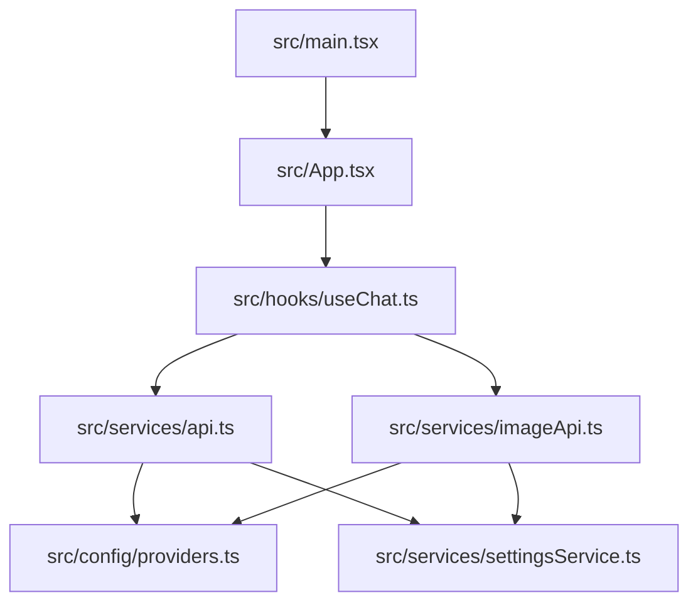
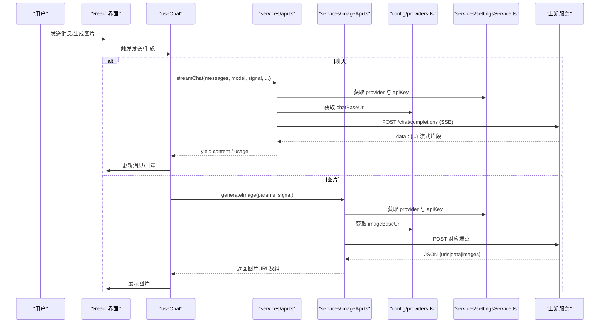
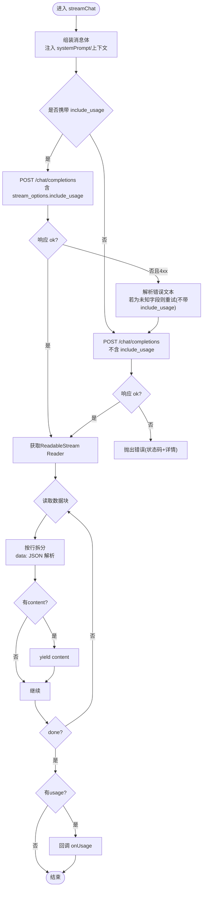
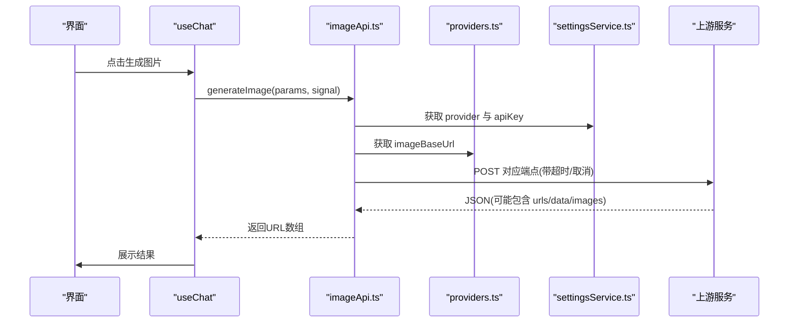
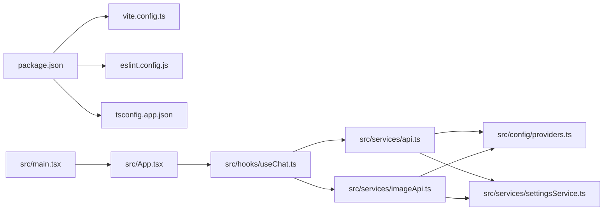

# 调试指南

<cite>
**本文引用的文件**
- [package.json](file://package.json)
- [vite.config.ts](file://vite.config.ts)
- [eslint.config.js](file://eslint.config.js)
- [tsconfig.app.json](file://tsconfig.app.json)
- [src/main.tsx](file://src/main.tsx)
- [src/App.tsx](file://src/App.tsx)
- [src/services/api.ts](file://src/services/api.ts)
- [src/services/imageApi.ts](file://src/services/imageApi.ts)
- [src/config/providers.ts](file://src/config/providers.ts)
- [src/services/settingsService.ts](file://src/services/settingsService.ts)
- [src/hooks/useChat.ts](file://src/hooks/useChat.ts)
</cite>

## 目录
1. [简介](#简介)
2. [项目结构](#项目结构)
3. [核心组件](#核心组件)
4. [架构总览](#架构总览)
5. [详细组件分析](#详细组件分析)
6. [依赖关系分析](#依赖关系分析)
7. [性能考虑](#性能考虑)
8. [故障排查指南](#故障排查指南)
9. [结论](#结论)
10. [附录](#附录)

## 简介
本指南面向 AIShop 项目的开发与联调，聚焦以下目标：
- 浏览器开发者工具与 React DevTools 的调试技巧
- 网络请求调试（SSE 流式聊天、图片生成）
- API 联调方法（后端接口对接、错误处理、日志记录）
- 性能调试（内存泄漏检测、渲染性能分析、Bundle 分析）
- 常见问题排查（构建错误、运行时异常、兼容性问题）
- 推荐调试工具与扩展、最佳实践

## 项目结构
AIShop 基于 Vite + React + TypeScript，前端入口在 src/main.tsx，应用根组件为 App。聊天与图片能力通过服务层封装：
- 聊天流式调用：src/services/api.ts 中的 streamChat
- 图片生成：src/services/imageApi.ts 中的 generateImage
- 提供商配置：src/config/providers.ts 与 src/services/settingsService.ts
- 构建与开发脚本：package.json、vite.config.ts、eslint.config.js、tsconfig.app.json

图表来源
- [src/main.tsx:1-8](file://src/main.tsx#L1-L8)
- [src/App.tsx:1-147](file://src/App.tsx#L1-L147)
- [src/hooks/useChat.ts:1-800](file://src/hooks/useChat.ts#L1-L800)
- [src/services/api.ts:1-173](file://src/services/api.ts#L1-L173)
- [src/services/imageApi.ts:1-257](file://src/services/imageApi.ts#L1-L257)
- [src/config/providers.ts:1-19](file://src/config/providers.ts#L1-L19)
- [src/services/settingsService.ts:1-101](file://src/services/settingsService.ts#L1-L101)

章节来源
- [package.json:1-47](file://package.json#L1-L47)
- [vite.config.ts:1-18](file://vite.config.ts#L1-L18)
- [eslint.config.js:1-23](file://eslint.config.js#L1-L23)
- [tsconfig.app.json:1-26](file://tsconfig.app.json#L1-L26)

## 核心组件
- 启动与挂载：main.tsx 使用 createRoot 挂载 App；App 负责主题加载、持久化存储申请、Tab 切换与子面板渲染。
- 聊天流程：useChat 管理会话、消息、压缩策略、联网搜索、流式输出与用量统计；streamChat 负责 SSE 流解析与用量提取。
- 图片生成：imageApi 根据模型映射到不同上游端点，统一抽取图片 URL，支持编辑/文生图，带超时与取消控制。
- 提供商与密钥：providers 定义端点基址，settingsService 管理 provider、API Key 与压缩参数等本地设置。

章节来源
- [src/main.tsx:1-8](file://src/main.tsx#L1-L8)
- [src/App.tsx:1-147](file://src/App.tsx#L1-L147)
- [src/hooks/useChat.ts:1-800](file://src/hooks/useChat.ts#L1-L800)
- [src/services/api.ts:1-173](file://src/services/api.ts#L1-L173)
- [src/services/imageApi.ts:1-257](file://src/services/imageApi.ts#L1-L257)
- [src/config/providers.ts:1-19](file://src/config/providers.ts#L1-L19)
- [src/services/settingsService.ts:1-101](file://src/services/settingsService.ts#L1-L101)

## 架构总览
下图展示了从 UI 到上游服务的完整链路，包括聊天流式响应与图片生成的关键路径。

图表来源
- [src/hooks/useChat.ts:1-800](file://src/hooks/useChat.ts#L1-L800)
- [src/services/api.ts:1-173](file://src/services/api.ts#L1-L173)
- [src/services/imageApi.ts:1-257](file://src/services/imageApi.ts#L1-L257)
- [src/config/providers.ts:1-19](file://src/config/providers.ts#L1-L19)
- [src/services/settingsService.ts:1-101](file://src/services/settingsService.ts#L1-L101)

## 详细组件分析

### 聊天流式调用（SSE）调试要点
- 请求构造与重试：当上游不支持 include_usage/stream_options 时，会去掉该参数重试一次，避免阻塞主流程。
- 流解析：按行读取 data: 片段，解析 JSON，提取 choices[0].delta.content 并逐块 yield；同时捕获 usage 并在结束时回调。
- 错误处理：非 2xx 且包含未知字段时抛出错误；无 body 或 reader 不可用时给出明确提示。
- 用量统计：兼容多种字段命名，最终汇总 prompt/completion/total/cached 等指标。

图表来源
- [src/services/api.ts:1-173](file://src/services/api.ts#L1-L173)

章节来源
- [src/services/api.ts:1-173](file://src/services/api.ts#L1-L173)

### 图片生成调试要点
- 端点映射：根据模型选择 textToImage/edit 路径，区分 GPT Image 2 与 Gemini 系列参数差异。
- 输入规范：GPT Image 2 编辑模式要求 base64 必须带 data URI 前缀；Gemini 编辑模式区分 image_urls 与 image_base64s。
- 超时与取消：内置 120s 超时，支持外部 AbortSignal 合并，区分“已取消”和“超时”。
- 响应解析：兼容多种返回结构，统一抽取 URL 列表；未返回地址时抛出错误。

图表来源
- [src/services/imageApi.ts:1-257](file://src/services/imageApi.ts#L1-L257)
- [src/config/providers.ts:1-19](file://src/config/providers.ts#L1-L19)
- [src/services/settingsService.ts:1-101](file://src/services/settingsService.ts#L1-L101)

章节来源
- [src/services/imageApi.ts:1-257](file://src/services/imageApi.ts#L1-L257)

### 会话与状态管理（useChat）调试要点
- 启动恢复：冷启动时恢复上次会话，优先复用空会话，避免重复创建。
- 自动压缩：根据阈值与热窗口判断是否需要压缩，压缩后标记消息并追加 segment。
- 联网搜索：可选开关，先由小模型判断是否需要搜索，再并行抓取结果注入上下文。
- 流式显示：实时拼接内容，隐藏中间态标记，结束后清理 artifact/suggestions。
- 错误与取消：AbortError 特殊处理，保留已有内容并标记停止；其他错误回退到失败提示。

章节来源
- [src/hooks/useChat.ts:1-800](file://src/hooks/useChat.ts#L1-L800)

### 提供商与设置（settingsService & providers）调试要点
- Provider 配置：默认 fastapi，可切换不同提供商；端点基址集中管理。
- 本地设置：apiKey、provider、压缩参数均存 localStorage，提供读写接口。
- 调试建议：在控制台打印当前 provider、apiKey 是否存在、端点是否正确。

章节来源
- [src/config/providers.ts:1-19](file://src/config/providers.ts#L1-L19)
- [src/services/settingsService.ts:1-101](file://src/services/settingsService.ts#L1-L101)

## 依赖关系分析
- 构建与开发：Vite 作为开发服务器与打包器，启用 React 插件与 Tailwind；ESLint 启用 React Hooks 与 Refresh 规则；TypeScript 严格选项开启。
- 运行依赖：React、Tailwind、Markdown/KaTeX 渲染、IndexedDB 等。
- 模块耦合：useChat 强依赖 api 与 imageApi；两者均依赖 providers 与 settingsService。

图表来源
- [package.json:1-47](file://package.json#L1-L47)
- [vite.config.ts:1-18](file://vite.config.ts#L1-L18)
- [eslint.config.js:1-23](file://eslint.config.js#L1-L23)
- [tsconfig.app.json:1-26](file://tsconfig.app.json#L1-L26)
- [src/main.tsx:1-8](file://src/main.tsx#L1-L8)
- [src/App.tsx:1-147](file://src/App.tsx#L1-L147)
- [src/hooks/useChat.ts:1-800](file://src/hooks/useChat.ts#L1-L800)
- [src/services/api.ts:1-173](file://src/services/api.ts#L1-L173)
- [src/services/imageApi.ts:1-257](file://src/services/imageApi.ts#L1-L257)
- [src/config/providers.ts:1-19](file://src/config/providers.ts#L1-L19)
- [src/services/settingsService.ts:1-101](file://src/services/settingsService.ts#L1-L101)

章节来源
- [package.json:1-47](file://package.json#L1-L47)
- [vite.config.ts:1-18](file://vite.config.ts#L1-L18)
- [eslint.config.js:1-23](file://eslint.config.js#L1-L23)
- [tsconfig.app.json:1-26](file://tsconfig.app.json#L1-L26)

## 性能考虑
- 流式渲染：SSE 逐块更新，避免整段渲染卡顿；注意大消息的分片与节流。
- 自动压缩：在高水位时压缩历史消息，减少上下文体积，降低延迟与成本。
- 资源加载：图片生成耗时较长，需做好超时与取消；避免重复请求。
- 本地存储：频繁写入 IndexedDB/localStorage 时使用批处理与防抖，避免阻塞主线程。
- Bundle 分析：使用 Vite 插件或第三方工具分析包大小，移除无用依赖。

## 故障排查指南

### 浏览器开发者工具与 React DevTools
- 网络面板：查看请求头、响应体、SSE 流式片段；过滤 XHR/Fetch，关注 /chat/completions 与图片端点。
- 控制台日志：定位错误堆栈；对关键函数添加临时 console.log 观察执行路径。
- React DevTools：检查组件树、Props/State 变化；使用 Profiler 分析重渲染热点。
- 断点调试：在 streamChat、generateImage、useChat.sendMessage 等处打断点，逐步验证数据流转。

### 网络请求调试（聊天与图片）
- 聊天流式：确认 Authorization 头正确；检查 include_usage 不被支持时的重试逻辑；观察 data: 片段是否被正确解析。
- 图片生成：校验 base64 是否带 data URI 前缀（GPT Image 2）；确认超时与取消信号；检查响应中 URL 字段是否被正确抽取。
- 跨域与代理：如需本地联调后端，配置 Vite server.proxy 指向后端地址，确保同源策略不阻断。

章节来源
- [src/services/api.ts:1-173](file://src/services/api.ts#L1-L173)
- [src/services/imageApi.ts:1-257](file://src/services/imageApi.ts#L1-L257)

### API 联调方法
- 提供商配置：在设置中配置 provider 与 apiKey；确认 providers.ts 中端点基址正确。
- 最小用例：先用简单 prompt 测试聊天与图片接口，逐步增加附件与复杂参数。
- 错误处理：捕获 4xx/5xx，记录 detail/error.message；对未知字段做兼容处理。
- 日志记录：在关键分支打印入参与出参（脱敏），便于问题复现与定位。

章节来源
- [src/config/providers.ts:1-19](file://src/config/providers.ts#L1-L19)
- [src/services/settingsService.ts:1-101](file://src/services/settingsService.ts#L1-L101)

### 性能调试
- 内存泄漏：使用 Chrome Memory 面板录制 Heap Snapshot，对比前后差异；关注闭包与事件监听未释放。
- 渲染性能：React Profiler 记录交互耗时；优化不必要的重渲染（memo/useMemo/useCallback）。
- Bundle 分析：使用 vite-bundle-analyzer 或 rollup-plugin-visualizer 分析包体积；按需引入库。

### 常见问题排查
- 构建错误：检查 TypeScript 严格选项与 ESLint 规则；修复类型错误与未使用变量。
- 运行时异常：优先查看控制台错误；对未捕获异常添加全局 try/catch 与上报。
- 兼容性问题：确认目标浏览器特性（如 Web Streams、IndexedDB）；必要时降级或提示升级。

章节来源
- [eslint.config.js:1-23](file://eslint.config.js#L1-L23)
- [tsconfig.app.json:1-26](file://tsconfig.app.json#L1-L26)

## 结论
通过合理的调试策略与工具链，可以快速定位 AIShop 的前端与 API 问题。重点在于：
- 利用浏览器开发者工具与 React DevTools 进行可视化调试
- 针对 SSE 流式与图片生成进行专项网络调试
- 结合提供商配置与本地设置，确保联调环境稳定
- 持续监控性能与包体积，保障用户体验

## 附录

### 调试工具与扩展推荐
- 浏览器：Chrome DevTools（Network、Console、Memory、Performance、React Profiler）
- 扩展：React Developer Tools、JSON Viewer、HTTP Request Blocker
- 构建与分析：Vite 官方插件、bundle 分析工具
- 代码质量：ESLint、TypeScript 编译器、IDE 集成调试

### 调试最佳实践
- 在关键路径添加结构化日志（时间戳、模块名、入参/出参摘要）
- 对异步操作使用 AbortController 管理取消，避免悬挂请求
- 对敏感信息（apiKey）进行脱敏与保护
- 使用最小可复现用例快速定位问题
- 定期审查性能瓶颈与内存占用，及时优化