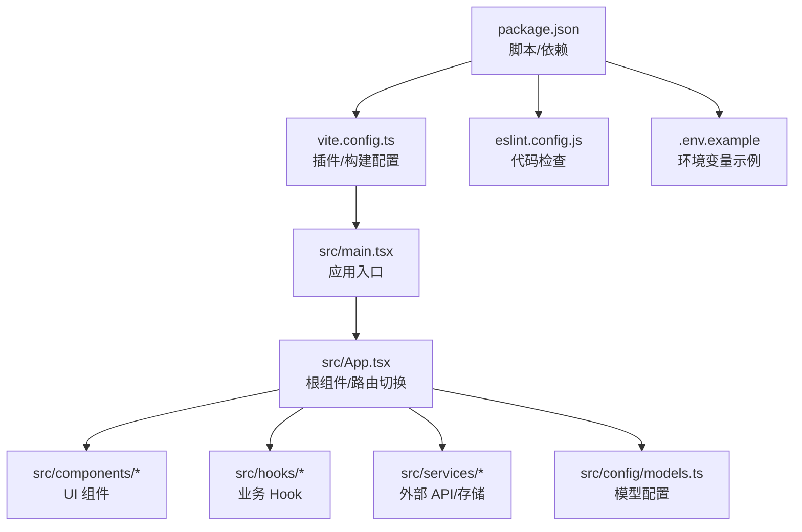
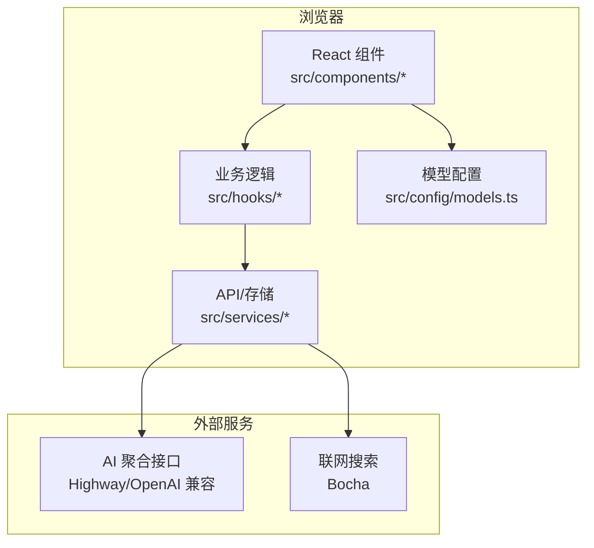
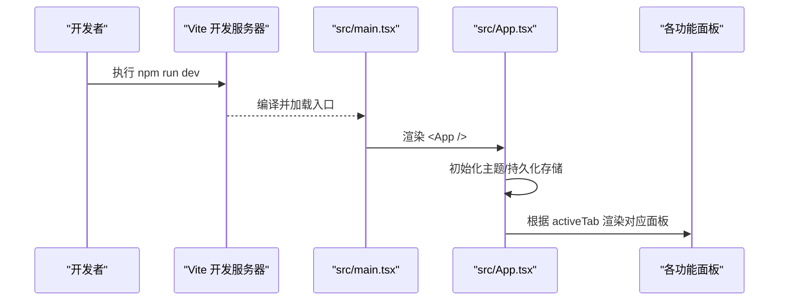
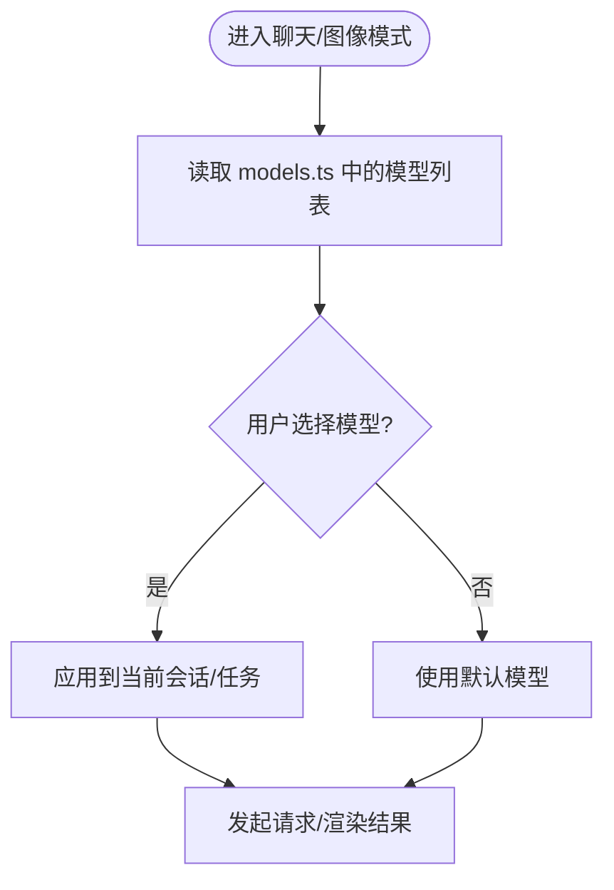
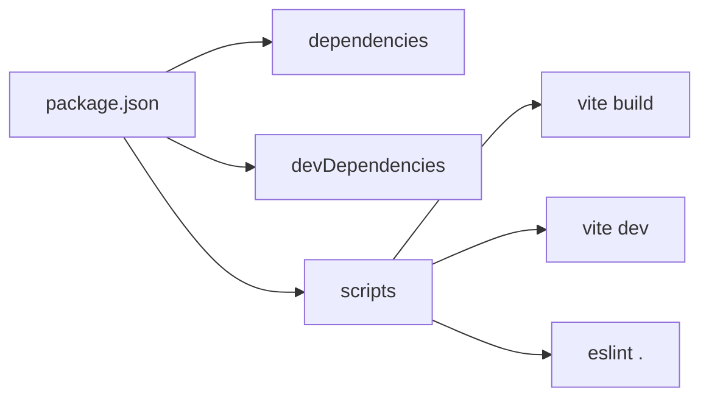

# 贡献指南

<cite>
**本文引用的文件**
- [package.json](file://package.json)
- [vite.config.ts](file://vite.config.ts)
- [eslint.config.js](file://eslint.config.js)
- [.gitignore](file://.gitignore)
- [README.md](file://README.md)
- [src/main.tsx](file://src/main.tsx)
- [src/App.tsx](file://src/App.tsx)
- [src/config/models.ts](file://src/config/models.ts)
- [.env.example](file://.env.example)
</cite>

## 目录
1. [简介](#简介)
2. [项目结构](#项目结构)
3. [核心组件](#核心组件)
4. [架构总览](#架构总览)
5. [详细组件分析](#详细组件分析)
6. [依赖分析](#依赖分析)
7. [性能考虑](#性能考虑)
8. [故障排查指南](#故障排查指南)
9. [结论](#结论)
10. [附录](#附录)

## 简介
本贡献指南面向 AIShop 项目的开发者与贡献者，目标是统一协作方式、降低沟通成本、提升代码质量与发布效率。内容涵盖：
- 分支管理与提交流程（含提交信息规范、Pull Request 流程）
- 开发环境搭建（依赖安装、配置、启动运行）
- 代码审查标准（代码质量检查、功能测试、文档更新）
- 发布流程（版本管理、构建部署、变更日志维护）
- 社区贡献规范、问题报告模板与功能请求流程

## 项目结构
AIShop 是基于 React + TypeScript + Vite 的前端应用，采用模块化组织：
- src：前端源码（入口、页面、组件、服务、类型等）
- public：静态资源
- 配置文件：package.json、vite.config.ts、eslint.config.js、tsconfig.*、.env.example
- 文档与参考：需求文档、API 参考等

图表来源
- [package.json:1-47](file://package.json#L1-L47)
- [vite.config.ts:1-18](file://vite.config.ts#L1-L18)
- [src/main.tsx:1-8](file://src/main.tsx#L1-L8)
- [src/App.tsx:1-147](file://src/App.tsx#L1-L147)
- [src/config/models.ts:1-284](file://src/config/models.ts#L1-L284)
- [eslint.config.js:1-23](file://eslint.config.js#L1-L23)
- [.env.example:1-13](file://.env.example#L1-L13)

章节来源
- [package.json:1-47](file://package.json#L1-L47)
- [vite.config.ts:1-18](file://vite.config.ts#L1-L18)
- [src/main.tsx:1-8](file://src/main.tsx#L1-L8)
- [src/App.tsx:1-147](file://src/App.tsx#L1-L147)
- [src/config/models.ts:1-284](file://src/config/models.ts#L1-L284)
- [eslint.config.js:1-23](file://eslint.config.js#L1-L23)
- [.env.example:1-13](file://.env.example#L1-L13)

## 核心组件
- 应用入口与挂载：main.tsx 负责创建根节点并渲染 App
- 根组件：App.tsx 负责主题初始化、持久化存储申请、标签页切换、聊天面板集成、收藏与设置等
- 模型配置：models.ts 集中管理聊天/图像等模型元数据，并提供按类型获取模型的函数
- 构建与开发：vite.config.ts 启用 React 与 Tailwind CSS 插件，暴露应用版本号常量
- 代码质量：eslint.config.js 启用 JS/TS/React Hooks/Refresh 规则
- 环境变量：.env.example 提供 HIGHWAY_API_KEY、BOCHA_API_KEY、ACCESS_CODE 等变量说明

章节来源
- [src/main.tsx:1-8](file://src/main.tsx#L1-L8)
- [src/App.tsx:1-147](file://src/App.tsx#L1-L147)
- [src/config/models.ts:1-284](file://src/config/models.ts#L1-L284)
- [vite.config.ts:1-18](file://vite.config.ts#L1-L18)
- [eslint.config.js:1-23](file://eslint.config.js#L1-L23)
- [.env.example:1-13](file://.env.example#L1-L13)

## 架构总览
前端以 React 为视图层，Vite 作为开发与构建工具；通过 services 层调用外部 AI 聚合接口（如 Highway），使用本地存储（IndexedDB/LocalStorage）保存会话与偏好；Tailwind 提供样式能力；ESLint 保障代码质量。

图表来源
- [src/App.tsx:1-147](file://src/App.tsx#L1-L147)
- [src/config/models.ts:1-284](file://src/config/models.ts#L1-L284)
- [.env.example:1-13](file://.env.example#L1-L13)

## 详细组件分析

### 应用启动与渲染流程
- main.tsx 创建根节点并渲染 App
- App.tsx 在启动时加载主题、申请持久化存储、初始化状态与 Hook
- 根据 activeTab 切换不同功能面板（聊天、图片、收藏、设置）

图表来源
- [src/main.tsx:1-8](file://src/main.tsx#L1-L8)
- [src/App.tsx:1-147](file://src/App.tsx#L1-L147)

章节来源
- [src/main.tsx:1-8](file://src/main.tsx#L1-L8)
- [src/App.tsx:1-147](file://src/App.tsx#L1-L147)

### 模型配置与选择
- models.ts 定义多厂商聊天/图像模型元数据（名称、提供商、上下文长度、价格等）
- 提供 getModelsByType 按类型返回模型列表，供 UI 下拉选择
- App.tsx 将模型列表与当前选中模型传递给布局与面板

图表来源
- [src/config/models.ts:1-284](file://src/config/models.ts#L1-L284)
- [src/App.tsx:1-147](file://src/App.tsx#L1-L147)

章节来源
- [src/config/models.ts:1-284](file://src/config/models.ts#L1-L284)
- [src/App.tsx:1-147](file://src/App.tsx#L1-L147)

### 构建与预览
- 开发：npm run dev 启动 Vite 开发服务器（监听 0.0.0.0）
- 构建：npm run build 先进行类型检查再打包
- 预览：npm run preview 预览构建产物
- 版本注入：vite.config.ts 将 package.json 的版本注入到 __APP_VERSION__

章节来源
- [package.json:1-47](file://package.json#L1-L47)
- [vite.config.ts:1-18](file://vite.config.ts#L1-L18)

## 依赖分析
- 运行时依赖：React、Tailwind、Markdown/KaTeX 渲染、PDF/XLSX 处理、IndexedDB 等
- 开发依赖：Vite、TypeScript、ESLint、React 插件等
- 构建产物：dist 目录被忽略，node_modules 不入库

图表来源
- [package.json:1-47](file://package.json#L1-L47)

章节来源
- [package.json:1-47](file://package.json#L1-L47)
- [.gitignore:1-34](file://.gitignore#L1-L34)

## 性能考虑
- 使用 Vite 的 HMR 与 SWC/Oxc 加速编译
- 按需引入 Markdown/KaTeX/PDF/XLSX 等重型库
- 合理拆分组件与 Hook，避免不必要的重渲染
- 对大文本或长对话进行压缩/分段展示（由业务 Hook 实现）
- 利用浏览器缓存与 IndexedDB 减少重复请求与 IO 开销

[本节为通用建议，无需特定文件引用]

## 故障排查指南
- 无法启动开发服务器
  - 检查 node_modules 是否已安装，清理后重新安装
  - 确认端口未被占用，必要时修改 vite 配置
- 环境变量未生效
  - 确保 .env.local 存在且包含所需密钥（HIGHWAY_API_KEY、BOCHA_API_KEY、ACCESS_CODE）
  - 本地使用 vercel dev 时，.env.local 会被自动加载
- 构建失败
  - 运行 npm run lint 检查语法与类型错误
  - 查看控制台输出定位具体模块问题
- 访问受限
  - 若开启 ACCESS_CODE，首次访问需输入访问码，后续请求会携带该头

章节来源
- [.env.example:1-13](file://.env.example#L1-L13)
- [eslint.config.js:1-23](file://eslint.config.js#L1-L23)
- [package.json:1-47](file://package.json#L1-L47)

## 结论
遵循本指南可显著提升团队协作效率与交付质量。请严格遵循分支策略、提交规范与 PR 流程；在提交前完成本地构建与代码检查；发布前更新版本与变更日志；遇到问题优先查阅本指南并在社区中按模板反馈。

[本节为总结性内容，无需特定文件引用]

## 附录

### 一、分支管理策略
- 主分支
  - main：稳定可发布分支，仅接受合并经过审查的变更
- 开发分支
  - develop：日常集成分支，所有特性最终合并至此
- 功能分支
  - feature/<描述>：新功能开发，从 develop 切出，完成后合并回 develop
- 修复分支
  - fix/<描述>：缺陷修复，从 main 或 develop 切出，完成后合并回对应分支
- 发布分支
  - release/<版本号>：用于冻结版本、回归测试与打标签，完成后合并至 main 并打 tag
- 热修复分支
  - hotfix/<描述>：针对线上紧急问题，从 main 切出，修复后同时合并至 main 与 develop

命名约定
- 使用小写英文与短横线，语义清晰，例如：feature/add-image-panel、fix/chat-timeout

### 二、提交信息规范
- 格式：type(scope): subject
- type 可选：feat、fix、docs、style、refactor、perf、test、build、ci、chore、revert
- scope 可选：模块名，如 chat、image、config
- 要求
  - 一行简短摘要（不超过 72 字符）
  - 空行后补充动机与变更点（必要时）
  - 关联 Issue/PR 编号（如有）
- 示例
  - feat(chat): 新增消息压缩与分段查看
  - fix(image): 修复图片上传尺寸校验
  - docs: 更新贡献指南与环境配置

### 三、Pull Request 流程
- 前提
  - 基于最新 develop/main 分支创建功能分支
  - 本地通过 npm run lint 与 npm run build
- 提交 PR
  - 标题：简洁明确，体现变更范围
  - 描述：背景、变更点、影响面、测试方法
  - 关联：链接相关 Issue/讨论
- 审查
  - 至少一名 Maintainer 审查通过
  - CI 检查通过（lint/build）
- 合并
  - 使用 squash 或 rebase 保持历史整洁
  - 合并后删除源分支

### 四、开发环境搭建
- 前置条件
  - Node.js 与包管理器（npm/yarn/pnpm）
- 安装依赖
  - 在项目根目录执行包管理器安装命令
- 配置环境变量
  - 复制 .env.example 为 .env.local，填入 HIGHWAY_API_KEY、BOCHA_API_KEY、ACCESS_CODE
- 启动开发服务器
  - 执行开发脚本以启用 HMR
- 构建与预览
  - 构建生产包并本地预览

章节来源
- [package.json:1-47](file://package.json#L1-L47)
- [.env.example:1-13](file://.env.example#L1-L13)

### 五、代码审查标准
- 代码质量
  - 通过 ESLint 与 TypeScript 类型检查
  - 遵循现有命名与目录约定
- 功能测试
  - 关键路径需覆盖正常与异常分支
  - 涉及网络请求需考虑超时与重试
- 文档更新
  - 变更公共接口或配置项需同步更新 README/文档
  - 新增模型或第三方服务需在配置与文档中登记
- 安全与隐私
  - 禁止提交敏感信息（密钥、令牌）
  - 环境变量统一通过 .env 管理

### 六、发布流程
- 版本管理
  - 使用语义化版本（主.次.修订）
  - 在 package.json 中更新版本号
- 构建与制品
  - 执行构建脚本生成 dist
  - 记录构建时间与版本哈希
- 部署
  - 将 dist 部署至目标平台（如 Vercel/CDN）
  - 配置环境变量（HIGHWAY_API_KEY、BOCHA_API_KEY、ACCESS_CODE）
- 变更日志
  - 按版本维护 CHANGELOG，记录新增、修复、破坏性变更
  - 标注影响范围与迁移指引（如有）

### 七、社区贡献规范
- 行为准则
  - 尊重他人、理性讨论、聚焦问题
- 贡献渠道
  - 提交 Issue 报告问题或提出功能请求
  - 提交 PR 参与开发
- 反馈与跟进
  - 及时回复审查意见
  - 对长期未处理的 Issue 进行温和提醒

### 八、问题报告模板
- 基本信息
  - 操作系统与浏览器版本
  - 应用版本（可从构建产物或页面显示获取）
- 复现步骤
  - 逐步描述如何触发问题
- 期望行为与实际行为
  - 清晰对比
- 附加信息
  - 截图/录屏、控制台日志、网络请求详情

### 九、功能请求流程
- 描述需求
  - 背景与目标用户
  - 预期交互与边界情况
- 可行性评估
  - 技术实现难度与影响面
  - 与现有功能的兼容性
- 优先级与排期
  - 由 Maintainer 评估并标注优先级
- 验收标准
  - 明确可验证的完成条件