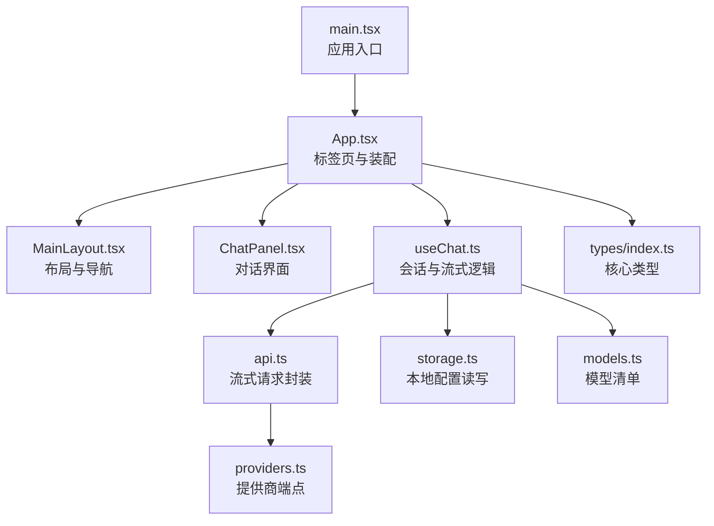
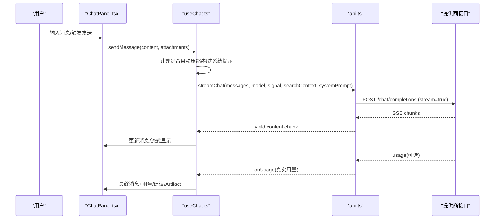
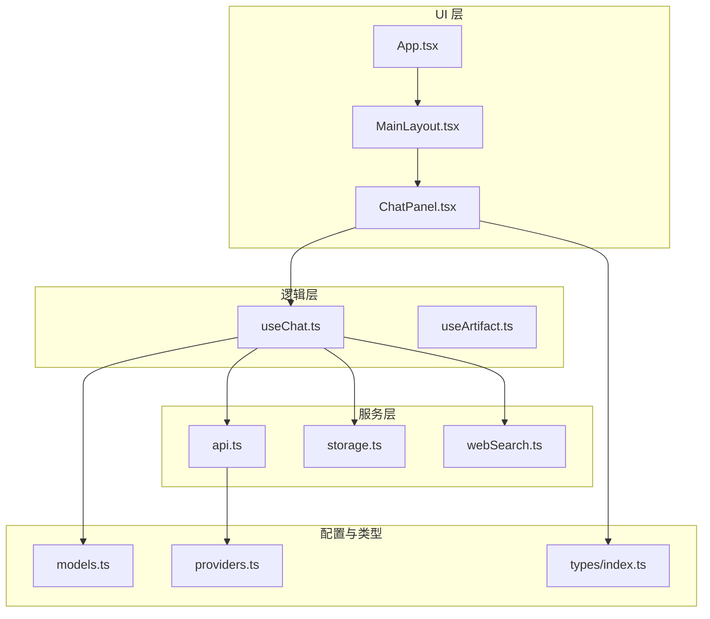
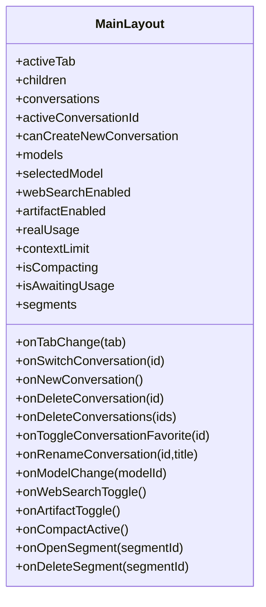
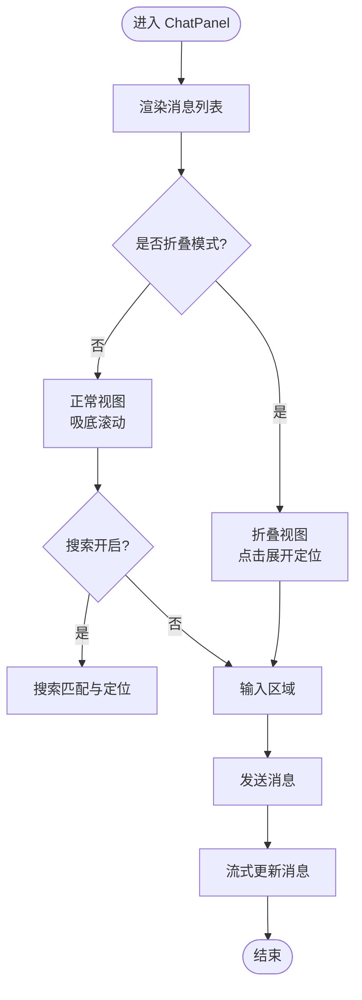
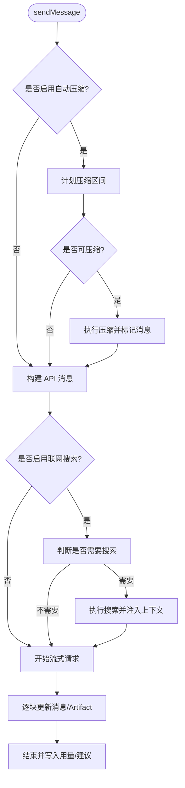
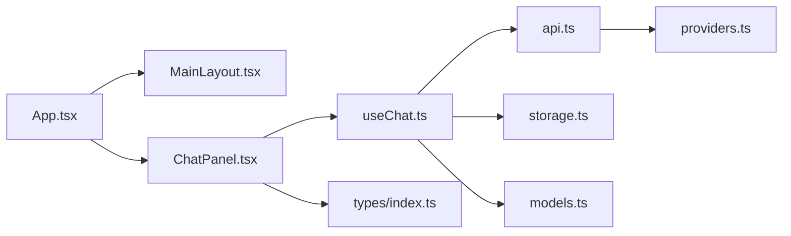

# 项目结构

<cite>
**本文引用的文件**
- [src/main.tsx](file://src/main.tsx)
- [src/App.tsx](file://src/App.tsx)
- [src/components/layout/MainLayout.tsx](file://src/components/layout/MainLayout.tsx)
- [src/components/chat/ChatPanel.tsx](file://src/components/chat/ChatPanel.tsx)
- [src/hooks/useChat.ts](file://src/hooks/useChat.ts)
- [src/services/api.ts](file://src/services/api.ts)
- [src/config/models.ts](file://src/config/models.ts)
- [src/config/providers.ts](file://src/config/providers.ts)
- [src/types/index.ts](file://src/types/index.ts)
- [src/services/storage.ts](file://src/services/storage.ts)
- [vite.config.ts](file://vite.config.ts)
- [package.json](file://package.json)
</cite>

## 目录与职责总览
本指南面向 AIShop 项目的结构与组织方式，重点说明 src 目录下各文件夹的职责、命名约定、模块划分标准、新模块添加流程，以及基于当前代码的演进建议。

- 入口与根组件
  - main.tsx：应用启动，挂载 React 根节点并引入全局样式。
  - App.tsx：顶层路由/标签页切换（聊天、图片、收藏、设置），装配布局与业务 Hook，管理主题与持久化存储申请。
- 组件层 components
  - layout：页面骨架与导航（侧边栏、顶栏、底栏）。
  - chat：对话界面与消息气泡、输入框、上下文摘要面板等。
  - image/music/video：多模态能力的面板容器（按功能域拆分）。
  - common：跨功能复用的通用 UI（确认弹窗、模型选择器等）。
  - artifact/settings/usage：特定功能域的子模块（如 Artifact 预览、设置、用量统计）。
- 状态与逻辑 hooks
  - useChat：会话生命周期、流式发送、压缩、联网搜索、标题生成、持久化等核心逻辑。
  - 其他领域 Hook 可按需扩展（例如 useImage）。
- 服务层 services
  - api：LLM 流式请求封装、SSE 解析、用量提取与重试策略。
  - storage：小体积同步配置读写（主题、上次会话、模型、联网开关）。
  - webSearch/titleGenerator/imageApi 等：按能力划分的后端交互或工具服务。
- 配置 config
  - models：模型清单与按类型筛选函数。
  - providers：提供商端点配置。
- 类型 types
  - index.ts：集中定义 Message、Conversation、Model、TokenUsage 等核心类型。

**图表来源**
- [src/main.tsx:1-8](file://src/main.tsx#L1-L8)
- [src/App.tsx:1-147](file://src/App.tsx#L1-L147)
- [src/components/layout/MainLayout.tsx:1-205](file://src/components/layout/MainLayout.tsx#L1-L205)
- [src/components/chat/ChatPanel.tsx:1-623](file://src/components/chat/ChatPanel.tsx#L1-L623)
- [src/hooks/useChat.ts:1-800](file://src/hooks/useChat.ts#L1-L800)
- [src/services/api.ts:1-173](file://src/services/api.ts#L1-L173)
- [src/config/models.ts:1-284](file://src/config/models.ts#L1-L284)
- [src/config/providers.ts:1-19](file://src/config/providers.ts#L1-L19)
- [src/types/index.ts:1-252](file://src/types/index.ts#L1-L252)

**章节来源**
- [src/main.tsx:1-8](file://src/main.tsx#L1-L8)
- [src/App.tsx:1-147](file://src/App.tsx#L1-L147)
- [src/components/layout/MainLayout.tsx:1-205](file://src/components/layout/MainLayout.tsx#L1-L205)
- [src/components/chat/ChatPanel.tsx:1-623](file://src/components/chat/ChatPanel.tsx#L1-L623)
- [src/hooks/useChat.ts:1-800](file://src/hooks/useChat.ts#L1-L800)
- [src/services/api.ts:1-173](file://src/services/api.ts#L1-L173)
- [src/config/models.ts:1-284](file://src/config/models.ts#L1-L284)
- [src/config/providers.ts:1-19](file://src/config/providers.ts#L1-L19)
- [src/types/index.ts:1-252](file://src/types/index.ts#L1-L252)

## 核心组件与数据流
- 应用启动与装配
  - main.tsx 创建根节点并渲染 App。
  - App 初始化主题、持久化存储申请、标签页状态，并通过 MainLayout 承载内容区。
- 布局与导航
  - MainLayout 提供侧边栏、顶栏、底栏与手势滑动；将 Tab 切换、会话列表、模型选择、上下文占用等能力以 props 形式注入子组件。
- 对话面板
  - ChatPanel 负责消息渲染、折叠浏览模式、对话内搜索、Artifact 流式预览、上下文摘要编辑等。
- 会话与流式逻辑
  - useChat 维护会话列表、活跃会话、消息流、压缩策略、联网搜索、标题生成、持久化落盘等。
- API 调用
  - api.ts 实现 LLM 流式请求、SSE 解析、用量提取、失败重试（兼容不同网关字段）。

**图表来源**
- [src/components/chat/ChatPanel.tsx:1-623](file://src/components/chat/ChatPanel.tsx#L1-L623)
- [src/hooks/useChat.ts:1-800](file://src/hooks/useChat.ts#L1-L800)
- [src/services/api.ts:1-173](file://src/services/api.ts#L1-L173)

**章节来源**
- [src/App.tsx:1-147](file://src/App.tsx#L1-L147)
- [src/components/layout/MainLayout.tsx:1-205](file://src/components/layout/MainLayout.tsx#L1-L205)
- [src/components/chat/ChatPanel.tsx:1-623](file://src/components/chat/ChatPanel.tsx#L1-L623)
- [src/hooks/useChat.ts:1-800](file://src/hooks/useChat.ts#L1-L800)
- [src/services/api.ts:1-173](file://src/services/api.ts#L1-L173)

## 命名约定
- 文件命名
  - 组件文件使用 PascalCase（如 ChatPanel.tsx、MainLayout.tsx）。
  - Hook 文件使用 useXxx.ts（如 useChat.ts）。
  - 服务文件使用名词或动词短语（如 api.ts、storage.ts、webSearch.ts）。
  - 配置文件使用名词（如 models.ts、providers.ts）。
  - 类型文件统一在 types/index.ts 中集中导出。
- 组件命名
  - 组件名采用 PascalCase，语义清晰（如 MessageBubble、CompactionMarker、ContextSummarySheet）。
  - 布局类组件以 Layout 结尾（MainLayout）。
  - 功能面板以 Panel 结尾（ChatPanel、ImagePanel）。
- Hook 命名
  - 以 use 开头，描述行为（useChat、useAssets、useDrawerSwipe）。
- 类型命名
  - 接口使用 PascalCase（Message、Conversation、Model、TokenUsage）。
  - 联合类型使用小写或驼峰（TabMode、ThemeId）。
- 常量与配置
  - 枚举/常量使用大写或语义化名称（CHAT_MODELS、IMAGE_MODELS）。
  - 提供商配置使用 PROVIDERS 记录。

**章节来源**
- [src/components/chat/ChatPanel.tsx:1-623](file://src/components/chat/ChatPanel.tsx#L1-L623)
- [src/components/layout/MainLayout.tsx:1-205](file://src/components/layout/MainLayout.tsx#L1-L205)
- [src/hooks/useChat.ts:1-800](file://src/hooks/useChat.ts#L1-L800)
- [src/config/models.ts:1-284](file://src/config/models.ts#L1-L284)
- [src/config/providers.ts:1-19](file://src/config/providers.ts#L1-L19)
- [src/types/index.ts:1-252](file://src/types/index.ts#L1-L252)

## 模块划分标准
- 功能域优先
  - 每个功能域一个目录（chat、image、music、video），内部再细分组件、Hook、服务。
  - 跨功能复用放入 common。
- 依赖关系管理
  - 组件只依赖 Hook 与服务，不直接耦合外部库的业务逻辑。
  - Hook 聚合服务与工具，向上暴露稳定的方法集。
  - 服务仅关注网络/存储/算法，不持有 UI 状态。
- 接口设计
  - 通过 TypeScript 类型约束组件 Props、Hook 返回值、服务入参出参。
  - 对外暴露最小必要接口，隐藏内部实现细节（如 useChat 暴露 sendMessage、stopGeneration 等）。
- 配置与类型分离
  - 运行时配置（模型、提供商）集中在 config。
  - 类型集中在 types，避免散落定义。

**章节来源**
- [src/config/models.ts:1-284](file://src/config/models.ts#L1-L284)
- [src/config/providers.ts:1-19](file://src/config/providers.ts#L1-L19)
- [src/types/index.ts:1-252](file://src/types/index.ts#L1-L252)
- [src/hooks/useChat.ts:1-800](file://src/hooks/useChat.ts#L1-L800)
- [src/services/api.ts:1-173](file://src/services/api.ts#L1-L173)

## 新增模块最佳实践
- 创建步骤
  - 在对应功能域下新建目录（如 src/components/newFeature）。
  - 新建组件文件（PascalCase.tsx），并在同目录编写 Hook（useNewFeature.ts）与服务（newFeatureService.ts）。
  - 在 types/index.ts 补充相关类型。
  - 在 config/models.ts 或 providers.ts 中注册新能力（如新增模型或提供商）。
- 注册流程
  - 在 App.tsx 或 MainLayout.tsx 中引入新组件，按需加入标签页或菜单。
  - 若涉及模型选择，确保在 models.ts 中声明并可通过 getModelsByType 获取。
- 样式管理
  - 使用 Tailwind 原子类进行样式编排，必要时在 index.css 中定义 CSS 变量或动画。
  - 保持主题一致，遵循现有颜色与间距规范。
- 测试与可维护性
  - 为复杂 Hook 或服务编写单元测试。
  - 对关键流程（发送消息、压缩、联网搜索）增加错误边界与日志。

**章节来源**
- [src/App.tsx:1-147](file://src/App.tsx#L1-L147)
- [src/components/layout/MainLayout.tsx:1-205](file://src/components/layout/MainLayout.tsx#L1-L205)
- [src/config/models.ts:1-284](file://src/config/models.ts#L1-L284)
- [src/types/index.ts:1-252](file://src/types/index.ts#L1-L252)

## 架构概览

**图表来源**
- [src/App.tsx:1-147](file://src/App.tsx#L1-L147)
- [src/components/layout/MainLayout.tsx:1-205](file://src/components/layout/MainLayout.tsx#L1-L205)
- [src/components/chat/ChatPanel.tsx:1-623](file://src/components/chat/ChatPanel.tsx#L1-L623)
- [src/hooks/useChat.ts:1-800](file://src/hooks/useChat.ts#L1-L800)
- [src/services/api.ts:1-173](file://src/services/api.ts#L1-L173)
- [src/services/storage.ts:1-63](file://src/services/storage.ts#L1-L63)
- [src/config/models.ts:1-284](file://src/config/models.ts#L1-L284)
- [src/config/providers.ts:1-19](file://src/config/providers.ts#L1-L19)
- [src/types/index.ts:1-252](file://src/types/index.ts#L1-L252)

## 详细组件分析
### 布局组件 MainLayout
- 职责
  - 管理侧边栏打开/关闭、输入聚焦时隐藏底部导航、横滑手势拉出/收起侧边栏。
  - 接收并透传会话列表、模型选择、上下文占用、片段管理等能力给子组件。
- 关键点
  - 使用自定义 Hook 处理手势与触觉反馈。
  - 通过 CSS transform 与过渡实现流畅的抽屉效果。
  - 顶部导航根据传入条件动态渲染。

**图表来源**
- [src/components/layout/MainLayout.tsx:1-205](file://src/components/layout/MainLayout.tsx#L1-L205)

**章节来源**
- [src/components/layout/MainLayout.tsx:1-205](file://src/components/layout/MainLayout.tsx#L1-L205)

### 对话面板 ChatPanel
- 职责
  - 渲染消息列表、支持折叠浏览模式、对话内搜索、Artifact 流式预览、上下文摘要编辑。
  - 与 useChat 协作完成发送、停止、比较模型、切换版本等操作。
- 关键点
  - 滚动锚定与动画：在折叠/展开时保持视觉连续性。
  - 搜索高亮与定位：实时匹配并平滑滚动到命中位置。
  - Artifact 面板：全屏覆盖，支持流式更新与完成后预览。

**图表来源**
- [src/components/chat/ChatPanel.tsx:1-623](file://src/components/chat/ChatPanel.tsx#L1-L623)

**章节来源**
- [src/components/chat/ChatPanel.tsx:1-623](file://src/components/chat/ChatPanel.tsx#L1-L623)

### 会话与流式逻辑 useChat
- 职责
  - 会话启动与恢复、消息持久化、自动压缩、联网搜索、标题生成、流式发送与终止。
- 关键点
  - 启动阶段从 IndexedDB 加载会话元数据，恢复上次会话或创建新会话。
  - 发送前评估上下文水位，决定是否自动压缩。
  - 流式响应逐块更新 UI，结束时写入真实用量与建议。
  - 异常处理：AbortError 标记为用户停止，其他错误回退到友好提示。

**图表来源**
- [src/hooks/useChat.ts:1-800](file://src/hooks/useChat.ts#L1-L800)
- [src/services/api.ts:1-173](file://src/services/api.ts#L1-L173)

**章节来源**
- [src/hooks/useChat.ts:1-800](file://src/hooks/useChat.ts#L1-L800)
- [src/services/api.ts:1-173](file://src/services/api.ts#L1-L173)

## 依赖分析
- 组件依赖
  - App 依赖 MainLayout、ChatPanel、ImagePanel、SettingsPanel 等。
  - MainLayout 依赖 Sidebar、TopNavBar、BottomNavBar 及手势 Hook。
  - ChatPanel 依赖 MessageBubble、ChatInput、ArtifactPanel、ContextSummarySheet。
- Hook 依赖
  - useChat 依赖 services（api、storage、webSearch、titleGenerator）、utils（tokenEstimate、buildApiMessages）、db（IndexedDB）。
- 服务依赖
  - api 依赖 providers 配置与 settingsService，读取 API Key 与端点。
- 配置与类型
  - models 提供模型清单与按类型筛选。
  - types 集中定义所有数据结构。

**图表来源**
- [src/App.tsx:1-147](file://src/App.tsx#L1-L147)
- [src/components/layout/MainLayout.tsx:1-205](file://src/components/layout/MainLayout.tsx#L1-L205)
- [src/components/chat/ChatPanel.tsx:1-623](file://src/components/chat/ChatPanel.tsx#L1-L623)
- [src/hooks/useChat.ts:1-800](file://src/hooks/useChat.ts#L1-L800)
- [src/services/api.ts:1-173](file://src/services/api.ts#L1-L173)
- [src/config/providers.ts:1-19](file://src/config/providers.ts#L1-L19)
- [src/services/storage.ts:1-63](file://src/services/storage.ts#L1-L63)
- [src/config/models.ts:1-284](file://src/config/models.ts#L1-L284)
- [src/types/index.ts:1-252](file://src/types/index.ts#L1-L252)

**章节来源**
- [src/App.tsx:1-147](file://src/App.tsx#L1-L147)
- [src/components/layout/MainLayout.tsx:1-205](file://src/components/layout/MainLayout.tsx#L1-L205)
- [src/components/chat/ChatPanel.tsx:1-623](file://src/components/chat/ChatPanel.tsx#L1-L623)
- [src/hooks/useChat.ts:1-800](file://src/hooks/useChat.ts#L1-L800)
- [src/services/api.ts:1-173](file://src/services/api.ts#L1-L173)
- [src/config/providers.ts:1-19](file://src/config/providers.ts#L1-L19)
- [src/services/storage.ts:1-63](file://src/services/storage.ts#L1-L63)
- [src/config/models.ts:1-284](file://src/config/models.ts#L1-L284)
- [src/types/index.ts:1-252](file://src/types/index.ts#L1-L252)

## 性能考虑
- 流式渲染
  - 使用异步生成器逐块推送内容，减少首屏等待时间。
  - 在流式过程中隐藏中间标记（如 suggestions、artifact 标记），提升用户体验。
- 持久化优化
  - 使用 diff 机制仅写入变化的会话，避免全量序列化导致的卡顿。
  - 在可见性变化与页面隐藏时主动 flush 挂起写入，防止数据丢失。
- 滚动与动画
  - 折叠/展开时使用 requestAnimationFrame 钉住滚动位置，避免惯性滚动造成的闪烁。
  - 使用 CSS transform 与 transition 实现高性能动画。
- 网络容错
  - 对不支持 include_usage 的网关进行降级重试，保证基本功能可用。
  - 对 SSE 解析中的残缺 JSON 进行跳过处理，提高鲁棒性。

[本节为通用指导，无需具体文件引用]

## 故障排查指南
- 常见问题
  - 未配置 API Key：会抛出“请先在设置中配置 API Key”的错误。
  - 网关不支持 include_usage：会自动去掉该参数重试一次。
  - 流式中断：AbortError 会被捕获并标记为用户停止。
- 调试建议
  - 检查 providers.ts 中的端点是否正确。
  - 查看 storage.ts 中的本地配置是否被正确读写。
  - 在 useChat 中打印关键状态（如压缩计划、搜索结果、用量）。
- 日志与错误
  - 在服务层与 Hook 中添加 try/catch 与 console.error。
  - 对网络请求返回非 2xx 的情况记录错误文本以便定位。

**章节来源**
- [src/services/api.ts:1-173](file://src/services/api.ts#L1-L173)
- [src/services/storage.ts:1-63](file://src/services/storage.ts#L1-L63)
- [src/hooks/useChat.ts:1-800](file://src/hooks/useChat.ts#L1-L800)

## 结论
AIShop 的项目结构以功能域为核心进行组织，组件、Hook、服务、配置与类型各司其职，形成清晰的依赖层次。通过流式渲染、持久化优化与网络容错，兼顾了性能与稳定性。新增模块应遵循现有命名与划分规范，在 App 与 MainLayout 中完成注册，并确保类型与配置的完整性。未来可继续细化领域服务、增强测试覆盖与监控指标，进一步提升可维护性与可扩展性。

[本节为总结性内容，无需具体文件引用]

## 附录
- 构建与脚本
  - package.json 定义了 dev、build、lint、preview 等脚本。
  - vite.config.ts 启用了 React 与 Tailwind 插件，并注入应用版本号。
- 入口与样式
  - main.tsx 挂载根节点并引入 index.css。
  - App.tsx 负责主题与持久化存储申请。

**章节来源**
- [package.json:1-47](file://package.json#L1-L47)
- [vite.config.ts:1-18](file://vite.config.ts#L1-L18)
- [src/main.tsx:1-8](file://src/main.tsx#L1-L8)
- [src/App.tsx:1-147](file://src/App.tsx#L1-L147)