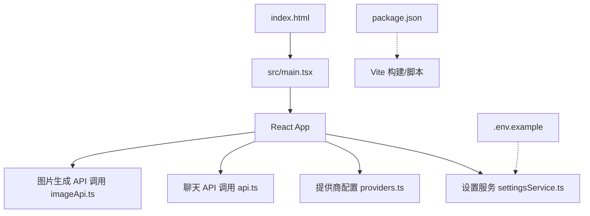
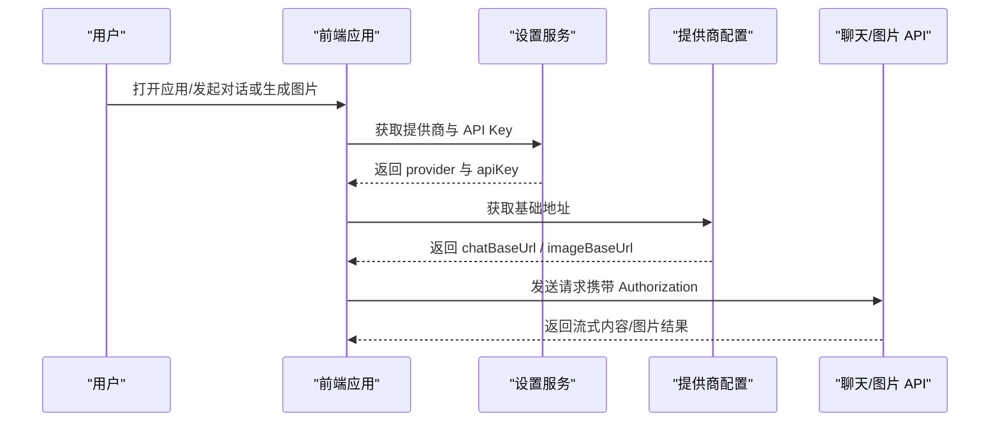
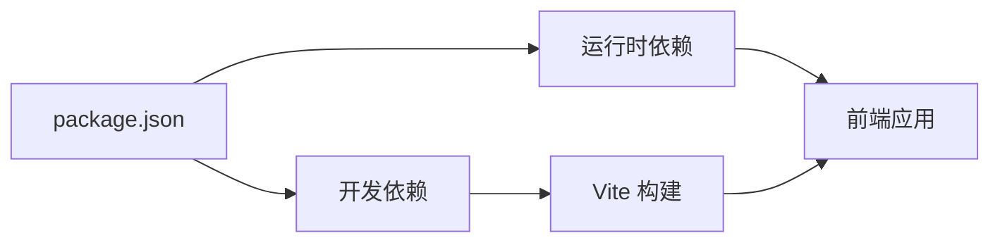

# 快速开始

<cite>
**本文引用的文件**
- [package.json](file://package.json)
- [vite.config.ts](file://vite.config.ts)
- [.env.example](file://.env.example)
- [src/config/providers.ts](file://src/config/providers.ts)
- [src/services/settingsService.ts](file://src/services/settingsService.ts)
- [src/services/api.ts](file://src/services/api.ts)
- [src/services/imageApi.ts](file://src/services/imageApi.ts)
- [src/config/models.ts](file://src/config/models.ts)
- [index.html](file://index.html)
- [src/main.tsx](file://src/main.tsx)
</cite>

## 目录
1. [简介](#简介)
2. [项目结构](#项目结构)
3. [核心组件](#核心组件)
4. [架构总览](#架构总览)
5. [详细组件分析](#详细组件分析)
6. [依赖关系分析](#依赖关系分析)
7. [性能注意事项](#性能注意事项)
8. [故障排除指南](#故障排除指南)
9. [结论](#结论)
10. [附录：第一个功能实现示例](#附录第一个功能实现示例)

## 简介
本指南帮助你从零开始运行并配置 AIShop，包括环境要求、依赖安装、开发服务器启动、生产构建流程、环境变量与访问码配置、AI 模型提供商设置，以及常见问题的排查方法。文末提供“第一个功能”的完整示例，帮助你快速上手项目开发。

## 项目结构
AIShop 是一个基于 React + TypeScript + Vite 的前端应用，通过统一的设置服务与提供商配置，对接多种 AI 模型（聊天、图片等）。关键要点：
- 构建与脚本由 package.json 管理，Vite 作为开发与构建工具。
- 应用入口为 index.html 与 src/main.tsx。
- 提供商地址与默认值在 src/config/providers.ts 中定义。
- 用户设置（提供商选择、API Key）持久化在浏览器 localStorage，由 src/services/settingsService.ts 管理。
- 环境变量模板位于 .env.example，用于本地或部署时注入密钥。

**图表来源**
- [index.html:1-23](file://index.html#L1-L23)
- [src/main.tsx:1-8](file://src/main.tsx#L1-L8)
- [src/services/settingsService.ts:1-101](file://src/services/settingsService.ts#L1-L101)
- [src/config/providers.ts:1-19](file://src/config/providers.ts#L1-L19)
- [src/services/api.ts:1-173](file://src/services/api.ts#L1-L173)
- [src/services/imageApi.ts:1-257](file://src/services/imageApi.ts#L1-L257)
- [package.json:1-47](file://package.json#L1-L47)

**章节来源**
- [package.json:1-47](file://package.json#L1-L47)
- [vite.config.ts:1-18](file://vite.config.ts#L1-L18)
- [index.html:1-23](file://index.html#L1-L23)
- [src/main.tsx:1-8](file://src/main.tsx#L1-L8)

## 核心组件
- 设置服务（settingsService.ts）：负责读取/保存提供商选择与 API Key，默认使用 fastapi 提供商；Key 存储在浏览器 localStorage。
- 提供商配置（providers.ts）：集中定义各提供商的基础 URL，默认 fastapi 指向统一网关地址。
- 聊天流式接口（api.ts）：封装流式对话请求，自动处理用量统计、错误重试与兼容不同网关返回。
- 图片生成接口（imageApi.ts）：封装文生图/编辑请求，支持多上游响应格式，内置超时控制与错误解析。
- 模型清单（models.ts）：列出支持的聊天与图片模型元信息，便于前端展示与选择。

**章节来源**
- [src/services/settingsService.ts:1-101](file://src/services/settingsService.ts#L1-L101)
- [src/config/providers.ts:1-19](file://src/config/providers.ts#L1-L19)
- [src/services/api.ts:1-173](file://src/services/api.ts#L1-L173)
- [src/services/imageApi.ts:1-257](file://src/services/imageApi.ts#L1-L257)
- [src/config/models.ts:1-284](file://src/config/models.ts#L1-L284)

## 架构总览
下图展示了从用户界面到后端 AI 服务的整体数据流：前端通过设置服务获取当前提供商与 API Key，再根据提供商配置决定请求地址，最终调用聊天或图片生成接口。

**图表来源**
- [src/services/settingsService.ts:59-84](file://src/services/settingsService.ts#L59-L84)
- [src/config/providers.ts:7-18](file://src/config/providers.ts#L7-L18)
- [src/services/api.ts:44-118](file://src/services/api.ts#L44-L118)
- [src/services/imageApi.ts:149-242](file://src/services/imageApi.ts#L149-L242)

## 详细组件分析

### 环境与依赖准备
- Node.js 版本：建议使用 Node.js 20（参考 CI 配置）。
- 包管理器：npm（也可使用 pnpm/yarn，但需确保 lock 文件一致）。
- 安装依赖：在项目根目录执行安装命令。
- 开发服务器：启动热重载开发服务器。
- 生产构建：类型检查后构建静态资源。
- 预览构建产物：本地预览构建后的静态站点。

可复制粘贴的命令：
- 安装依赖：npm install
- 启动开发服务器：npm run dev
- 构建生产版本：npm run build
- 预览构建产物：npm run preview

**章节来源**
- [package.json:1-47](file://package.json#L1-L47)
- [.github/workflows/release.yml:1-35](file://.github/workflows/release.yml#L1-L35)

### 环境变量与访问码配置
- 将 .env.example 复制为 .env.local（本地开发），或在部署平台的环境变量中配置。
- 关键字段说明：
  - HIGHWAY_API_KEY：大模型聚合接口密钥（聊天与图片均使用）。
  - BOCHA_API_KEY：联网搜索接口密钥（如启用搜索）。
  - ACCESS_CODE：访问码（防滥用），留空则不启用；部署公网建议设置。首次访问需输入密码，后续请求会携带该头。

注意：
- 若使用 Vercel，请在控制台的环境变量中配置上述键。
- 本地开发时，部分框架会在启动时加载 .env.local。

可复制粘贴的配置项（填入真实值）：
- HIGHWAY_API_KEY=你的密钥
- BOCHA_API_KEY=你的密钥
- ACCESS_CODE=你的访问码

**章节来源**
- [.env.example:1-13](file://.env.example#L1-L13)

### 提供商与 API Key 初始化
- 默认提供商：fastapi（聊天与图片均默认使用该提供商）。
- 提供商地址：chatBaseUrl 与 imageBaseUrl 在 providers.ts 中定义。
- API Key 存储：通过设置服务写入浏览器 localStorage，下次启动自动读取。
- 首次使用：在应用设置面板中选择提供商并填写 API Key；或直接修改浏览器存储中的 aishop_settings。

可复制粘贴的操作步骤：
- 在应用设置中选择“提供商”为 fastapi。
- 在对应类别下输入 HIGHWAY_API_KEY（聊天与图片共用）。
- 如需联网搜索，额外输入 BOCHA_API_KEY。
- 如需访问码保护，设置 ACCESS_CODE 并在首次访问时输入。

**章节来源**
- [src/config/providers.ts:7-18](file://src/config/providers.ts#L7-L18)
- [src/services/settingsService.ts:37-84](file://src/services/settingsService.ts#L37-L84)
- [.env.example:1-13](file://.env.example#L1-L13)

### 开发服务器启动与调试
- 启动命令：npm run dev
- 监听主机：vite.config.ts 中 host 设置为 0.0.0.0，便于局域网访问。
- 应用入口：index.html 引入 src/main.tsx 渲染 React 应用。
- 构建时注入：__APP_VERSION__ 来自 package.json 的版本号。

可复制粘贴的命令：
- npm run dev

**章节来源**
- [vite.config.ts:1-18](file://vite.config.ts#L1-L18)
- [index.html:1-23](file://index.html#L1-L23)
- [src/main.tsx:1-8](file://src/main.tsx#L1-L8)
- [package.json:1-47](file://package.json#L1-L47)

### 生产构建流程
- 构建命令：npm run build（先进行类型检查，再构建静态资源）。
- 输出目录：dist（由 Vite 默认行为产出）。
- 部署方式：将 dist 目录部署至任意静态托管平台（如 Vercel、Netlify、Nginx 等）。
- 环境变量：在部署平台的环境变量中配置 HIGHWAY_API_KEY、BOCHA_API_KEY、ACCESS_CODE。

可复制粘贴的命令：
- npm run build

**章节来源**
- [package.json:1-47](file://package.json#L1-L47)

## 依赖关系分析
- 运行时依赖：React、TailwindCSS、Markdown 渲染、PDF/XLSX 处理、IndexedDB 等。
- 开发依赖：TypeScript、ESLint、Vite、React 插件等。
- 构建脚本：dev/build/lint/preview 分别对应开发、构建、代码检查与预览。

**图表来源**
- [package.json:12-45](file://package.json#L12-L45)

**章节来源**
- [package.json:12-45](file://package.json#L12-L45)

## 性能注意事项
- 流式对话：聊天接口采用流式传输，减少首字节延迟，提升交互体验。
- 图片生成超时：图片生成默认超时时间为 120 秒，避免长时间挂起。
- 用量统计：聊天接口尝试索取 usage，若网关不支持会自动降级重试。
- 上下文压缩：可通过设置服务调整压缩阈值与热点窗口大小，平衡成本与性能。

**章节来源**
- [src/services/api.ts:44-173](file://src/services/api.ts#L44-L173)
- [src/services/imageApi.ts:183-216](file://src/services/imageApi.ts#L183-L216)
- [src/services/settingsService.ts:27-33](file://src/services/settingsService.ts#L27-L33)

## 故障排除指南
常见问题与解决方案：
- 未配置 API Key：
  - 现象：聊天或图片请求失败，提示请先配置 API Key。
  - 解决：在设置中为对应类别（llm 或 image）设置 fastapi 提供商并填入 HIGHWAY_API_KEY。
- 网关不支持 include_usage：
  - 现象：首次请求带 usage 参数失败，随后自动重试不带 usage 的请求。
  - 解决：无需手动干预，系统已做兼容处理。
- 图片生成超时：
  - 现象：超过 120 秒无响应。
  - 解决：检查网络与上游服务状态；必要时重试或更换模型。
- 访问码未生效：
  - 现象：首次访问未要求输入访问码。
  - 解决：确认已在 .env.local 或部署平台设置 ACCESS_CODE，并确保服务端校验逻辑启用。
- 构建失败：
  - 现象：npm run build 报错。
  - 解决：检查 Node.js 版本是否为 20+；清理缓存后重新安装依赖；查看具体错误日志定位问题。

**章节来源**
- [src/services/api.ts:57-118](file://src/services/api.ts#L57-L118)
- [src/services/imageApi.ts:149-242](file://src/services/imageApi.ts#L149-L242)
- [.env.example:1-13](file://.env.example#L1-L13)

## 结论
通过以上步骤，你可以完成 AIShop 的环境准备、依赖安装、开发服务器启动、生产构建与环境变量配置。借助设置服务与提供商配置，灵活切换不同的 AI 模型与服务端地址。遇到问题时，可参考故障排除指南快速定位与解决。

## 附录：第一个功能实现示例
目标：完成一次简单的聊天对话，验证环境配置是否正确。

步骤：
1. 安装依赖并启动开发服务器：
   - 可复制粘贴：npm install && npm run dev
2. 配置环境变量：
   - 复制 .env.example 为 .env.local，并填入 HIGHWAY_API_KEY（与 BOCHA_API_KEY 可选）。
   - 可复制粘贴配置项：
     - HIGHWAY_API_KEY=你的密钥
     - BOCHA_API_KEY=你的密钥
     - ACCESS_CODE=你的访问码
3. 在应用设置中配置提供商与 API Key：
   - 选择提供商为 fastapi。
   - 在聊天类别下输入 HIGHWAY_API_KEY。
4. 发起一次聊天：
   - 在聊天面板输入任意消息并发送。
   - 观察是否收到流式回复。
5. 若需要访问码保护：
   - 首次访问时会要求输入 ACCESS_CODE，后续请求会自动携带。

预期结果：
- 成功收到流式文本回复，表示聊天链路配置正确。
- 若失败，请检查 API Key 是否正确、网络是否可达、上游服务是否正常。

**章节来源**
- [src/services/api.ts:44-173](file://src/services/api.ts#L44-L173)
- [src/services/settingsService.ts:59-84](file://src/services/settingsService.ts#L59-L84)
- [src/config/providers.ts:7-18](file://src/config/providers.ts#L7-L18)
- [.env.example:1-13](file://.env.example#L1-L13)
- [package.json:1-47](file://package.json#L1-L47)