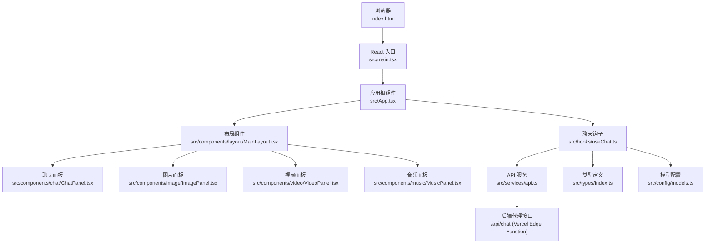
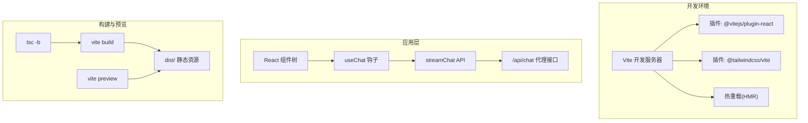
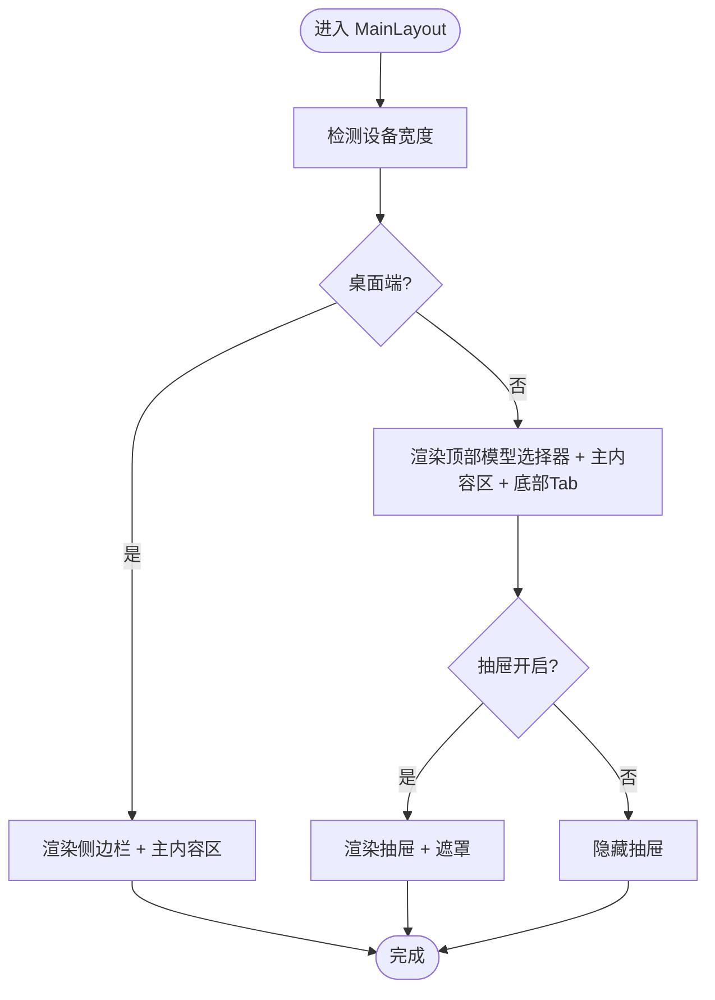
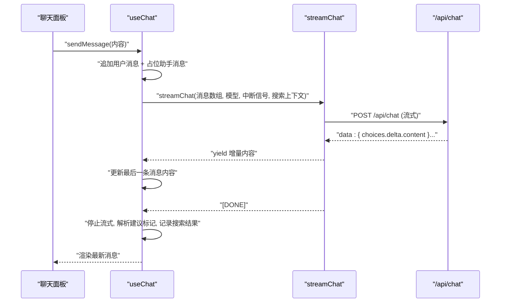
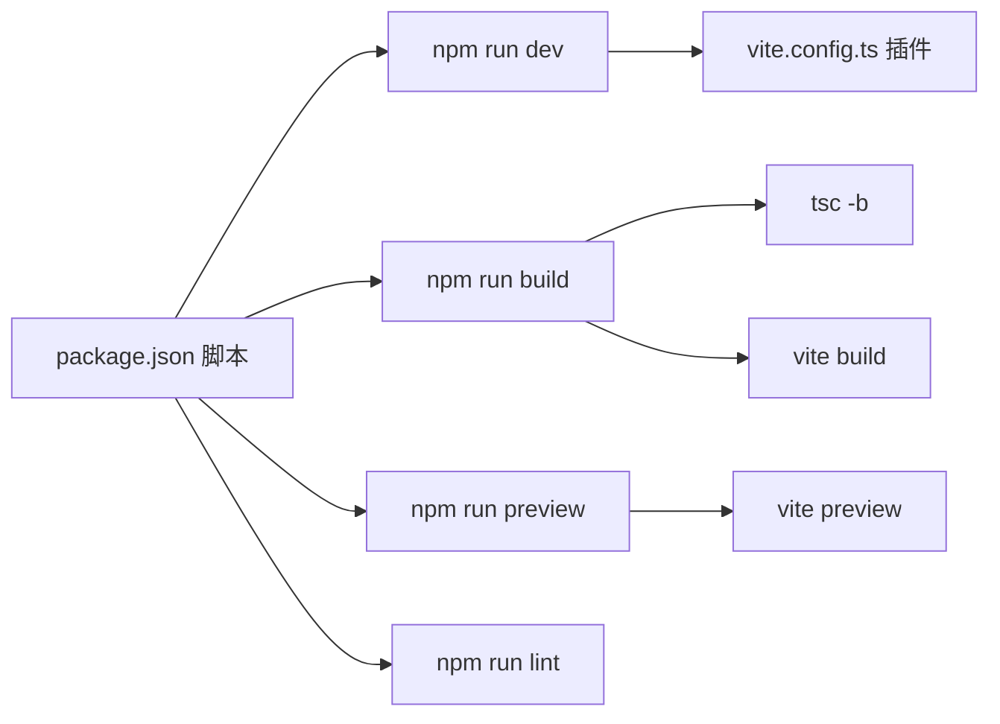

# 快速开始

<cite>
**本文引用的文件**
- [package.json](file://package.json)
- [vite.config.ts](file://vite.config.ts)
- [tsconfig.json](file://tsconfig.json)
- [tsconfig.app.json](file://tsconfig.app.json)
- [tsconfig.node.json](file://tsconfig.node.json)
- [eslint.config.js](file://eslint.config.js)
- [index.html](file://index.html)
- [src/main.tsx](file://src/main.tsx)
- [src/App.tsx](file://src/App.tsx)
- [src/components/layout/MainLayout.tsx](file://src/components/layout/MainLayout.tsx)
- [src/hooks/useChat.ts](file://src/hooks/useChat.ts)
- [src/services/api.ts](file://src/services/api.ts)
- [src/types/index.ts](file://src/types/index.ts)
- [src/config/models.ts](file://src/config/models.ts)
- [README.md](file://README.md)
</cite>

## 目录
1. [简介](#简介)
2. [项目结构](#项目结构)
3. [核心组件](#核心组件)
4. [架构总览](#架构总览)
5. [详细组件分析](#详细组件分析)
6. [依赖分析](#依赖分析)
7. [性能考虑](#性能考虑)
8. [故障排查指南](#故障排查指南)
9. [结论](#结论)
10. [附录](#附录)

## 简介
本指南面向初学者，帮助你在本地快速搭建并运行 AIShop 项目。你将学到：
- 环境要求与推荐工具
- 依赖安装与常见问题
- 启动开发服务器与热重载
- 生产构建与部署准备
- 常见问题排查
- 基本使用示例（访问应用与简单功能测试）

## 项目结构
AIShop 是一个基于 React + TypeScript + Vite 的前端应用，采用模块化组件与类型驱动设计，支持聊天、图片、视频、音乐等多模态能力入口，并内置访问控制门禁组件。

图表来源
- [index.html:1-14](file://index.html#L1-L14)
- [src/main.tsx:1-11](file://src/main.tsx#L1-L11)
- [src/App.tsx:1-74](file://src/App.tsx#L1-L74)
- [src/components/layout/MainLayout.tsx:1-227](file://src/components/layout/MainLayout.tsx#L1-L227)
- [src/hooks/useChat.ts:1-370](file://src/hooks/useChat.ts#L1-L370)
- [src/services/api.ts:1-83](file://src/services/api.ts#L1-L83)
- [src/types/index.ts:1-103](file://src/types/index.ts#L1-L103)
- [src/config/models.ts:1-228](file://src/config/models.ts#L1-L228)

章节来源
- [index.html:1-14](file://index.html#L1-L14)
- [src/main.tsx:1-11](file://src/main.tsx#L1-L11)
- [src/App.tsx:1-74](file://src/App.tsx#L1-L74)
- [src/components/layout/MainLayout.tsx:1-227](file://src/components/layout/MainLayout.tsx#L1-L227)

## 核心组件
- 应用入口与渲染：通过 HTML 的根容器挂载 React 根节点，渲染 App 根组件。
- 应用根组件：负责根据当前标签页切换渲染对应面板，并承载访问控制门禁。
- 布局组件：提供桌面端侧边栏与移动端抽屉、底部 Tab、会话历史等交互。
- 聊天钩子：封装消息流式传输、会话持久化、联网搜索、模型选择等功能。
- API 服务：封装与后端代理接口的通信，支持流式数据读取。
- 类型系统：统一定义消息、会话、媒体项、模型等类型。
- 模型配置：集中管理聊天与图片等模型清单及能力描述。

章节来源
- [src/App.tsx:1-74](file://src/App.tsx#L1-L74)
- [src/components/layout/MainLayout.tsx:1-227](file://src/components/layout/MainLayout.tsx#L1-L227)
- [src/hooks/useChat.ts:1-370](file://src/hooks/useChat.ts#L1-L370)
- [src/services/api.ts:1-83](file://src/services/api.ts#L1-L83)
- [src/types/index.ts:1-103](file://src/types/index.ts#L1-L103)
- [src/config/models.ts:1-228](file://src/config/models.ts#L1-L228)

## 架构总览
前端通过 Vite 提供开发服务器与热重载，打包阶段由 Vite 执行 TypeScript 编译与资源构建。应用通过相对路径代理调用后端接口，实现流式响应与实时渲染。

图表来源
- [vite.config.ts:1-11](file://vite.config.ts#L1-L11)
- [package.json:6-11](file://package.json#L6-L11)
- [src/services/api.ts:1-83](file://src/services/api.ts#L1-L83)

章节来源
- [vite.config.ts:1-11](file://vite.config.ts#L1-L11)
- [package.json:6-11](file://package.json#L6-L11)

## 详细组件分析

### 组件：MainLayout（布局）
- 功能要点
  - 桌面端：左侧侧边栏 + 主内容区
  - 移动端：顶部胶囊式模型选择器 + 底部 Tab + 左侧抽屉（仅聊天）
  - 响应式判断与抽屉状态管理
  - 会话列表联动与新建/删除/重命名操作
- 关键交互
  - 切换标签页自动收起抽屉
  - ESC 键关闭抽屉
  - 移动端抽屉遮罩与滑入动画

图表来源
- [src/components/layout/MainLayout.tsx:31-82](file://src/components/layout/MainLayout.tsx#L31-L82)
- [src/components/layout/MainLayout.tsx:84-100](file://src/components/layout/MainLayout.tsx#L84-L100)
- [src/components/layout/MainLayout.tsx:102-164](file://src/components/layout/MainLayout.tsx#L102-L164)
- [src/components/layout/MainLayout.tsx:166-223](file://src/components/layout/MainLayout.tsx#L166-L223)

章节来源
- [src/components/layout/MainLayout.tsx:1-227](file://src/components/layout/MainLayout.tsx#L1-L227)

### 组件：useChat（聊天钩子）
- 功能要点
  - 会话持久化（localStorage）
  - 流式消息生成与显示（AsyncGenerator）
  - 联网搜索上下文注入与结果格式化
  - 停止生成（AbortController）
  - 标题自动生成与会话导入
- 数据流
  - 用户输入 -> 追加临时消息 -> 调用 streamChat -> 更新消息内容 -> 结束或错误处理

图表来源
- [src/hooks/useChat.ts:135-250](file://src/hooks/useChat.ts#L135-L250)
- [src/services/api.ts:13-83](file://src/services/api.ts#L13-L83)

章节来源
- [src/hooks/useChat.ts:1-370](file://src/hooks/useChat.ts#L1-L370)
- [src/services/api.ts:1-83](file://src/services/api.ts#L1-L83)

### 组件：App（应用根）
- 功能要点
  - 默认激活标签页为“聊天”
  - 渲染 AccessGate（访问控制门禁）
  - 传递标签页切换、会话列表、新建/删除/重命名等回调至 MainLayout
  - 根据当前标签页渲染对应面板

章节来源
- [src/App.tsx:1-74](file://src/App.tsx#L1-L74)

### 组件：API 服务（streamChat）
- 功能要点
  - 将消息与系统提示拼装为请求体
  - 使用 fetch 发送流式请求
  - 解析 SSE 风格的数据块，提取增量内容
  - 错误处理与中断信号支持

章节来源
- [src/services/api.ts:1-83](file://src/services/api.ts#L1-L83)

### 类型系统与模型配置
- 类型系统
  - 统一定义消息、会话、媒体项、模型等类型，保证组件间契约一致
- 模型配置
  - 聊天模型清单覆盖多家厂商与不同能力
  - 图片模型清单用于图片生成入口

章节来源
- [src/types/index.ts:1-103](file://src/types/index.ts#L1-L103)
- [src/config/models.ts:1-228](file://src/config/models.ts#L1-L228)

## 依赖分析
- 包管理与脚本
  - 开发：vite
  - 构建：tsc -b && vite build
  - 预览：vite preview
  - 代码检查：eslint
- 核心依赖
  - React 19 与 React DOM
  - Vite 与 React 插件
  - TailwindCSS v4 与 Tailwind Vite 插件
  - React Markdown 与 GFM 支持
  - Lucide React 图标
- 开发依赖
  - TypeScript 6.x
  - ESLint 与 React Hooks/React Refresh 规则
  - @vitejs/plugin-react 与 @vercel/node（可选）

图表来源
- [package.json:6-11](file://package.json#L6-L11)
- [vite.config.ts:1-11](file://vite.config.ts#L1-L11)

章节来源
- [package.json:1-40](file://package.json#L1-L40)
- [vite.config.ts:1-11](file://vite.config.ts#L1-L11)
- [tsconfig.json:1-8](file://tsconfig.json#L1-L8)
- [tsconfig.app.json:1-26](file://tsconfig.app.json#L1-L26)
- [tsconfig.node.json:1-25](file://tsconfig.node.json#L1-L25)
- [eslint.config.js:1-23](file://eslint.config.js#L1-L23)

## 性能考虑
- 开发性能
  - Vite 提供快速冷启动与热重载
  - React 插件优化 JSX 转换
- 构建性能
  - TypeScript 与 Vite 并行构建
  - TailwindCSS Vite 插件按需扫描类名
- 运行时性能
  - 流式渲染减少首屏等待
  - 会话持久化避免重复加载

## 故障排查指南
- 端口占用
  - 症状：开发服务器无法启动，提示端口被占用
  - 处理：修改 Vite 配置中的端口或释放占用进程
  - 参考：Vite 默认端口配置
- 依赖安装失败
  - 症状：npm install 报错或部分包安装不完整
  - 处理：清理缓存、更换镜像源、确认 Node.js 版本满足要求
- 依赖版本不兼容
  - 症状：TypeScript 或 ESLint 报错
  - 处理：核对 tsconfig 与 ESLint 配置，确保版本匹配
- 流式接口异常
  - 症状：聊天无输出或报错
  - 处理：检查 /api/chat 代理是否可达，确认服务端返回格式符合预期
- 热重载无效
  - 症状：修改代码后页面未刷新
  - 处理：检查 Vite 插件配置与浏览器缓存，重启开发服务器

章节来源
- [vite.config.ts:1-11](file://vite.config.ts#L1-L11)
- [eslint.config.js:1-23](file://eslint.config.js#L1-L23)
- [src/services/api.ts:1-83](file://src/services/api.ts#L1-L83)

## 结论
通过本指南，你可以完成从环境准备到开发调试再到生产构建的全流程。建议在开发过程中充分利用热重载与流式渲染体验，在生产构建前完成代码检查与依赖验证，确保应用稳定上线。

## 附录

### 环境要求与推荐工具
- Node.js
  - 推荐使用长期支持版本（LTS），确保与 TypeScript 6.x 和 Vite 8.x 兼容
- 包管理器
  - 使用 npm（推荐）或 pnpm/yarn
- 开发工具
  - VS Code + ESLint 插件
  - 浏览器开发者工具（Network/Console）

章节来源
- [package.json:24-38](file://package.json#L24-L38)
- [tsconfig.app.json:1-26](file://tsconfig.app.json#L1-L26)
- [tsconfig.node.json:1-25](file://tsconfig.node.json#L1-L25)
- [eslint.config.js:1-23](file://eslint.config.js#L1-L23)

### 依赖安装
- 步骤
  - 在项目根目录执行安装命令
  - 等待依赖下载与编译
- 常见问题
  - 权限不足：使用管理员权限或更换全局缓存目录
  - 网络超时：切换镜像源或使用代理
  - Node 版本过低：升级到 LTS 版本

章节来源
- [package.json:12-38](file://package.json#L12-L38)

### 启动开发服务器
- 步骤
  - 在项目根目录执行开发命令
  - 浏览器打开默认地址（通常为本地回环地址）
- 热重载
  - 修改源码后自动刷新页面
  - 如未生效，检查 Vite 插件与浏览器缓存

章节来源
- [package.json:6-11](file://package.json#L6-L11)
- [vite.config.ts:1-11](file://vite.config.ts#L1-L11)
- [index.html:1-14](file://index.html#L1-L14)
- [src/main.tsx:1-11](file://src/main.tsx#L1-L11)

### 生产构建与部署准备
- 步骤
  - 执行构建命令生成 dist 目录
  - 使用预览命令本地验证构建产物
- 部署
  - 将 dist 目录部署至静态站点或反向代理
  - 确保 /api/chat 代理在目标环境可用

章节来源
- [package.json:6-11](file://package.json#L6-L11)
- [README.md:1-74](file://README.md#L1-L74)

### 基本使用示例
- 访问应用
  - 启动开发服务器后，打开浏览器访问默认地址
- 功能测试
  - 在聊天面板输入消息，观察流式输出
  - 切换标签页查看各功能入口
  - 使用移动端布局测试抽屉与底部 Tab

章节来源
- [src/App.tsx:1-74](file://src/App.tsx#L1-L74)
- [src/components/layout/MainLayout.tsx:1-227](file://src/components/layout/MainLayout.tsx#L1-L227)
- [src/hooks/useChat.ts:135-250](file://src/hooks/useChat.ts#L135-L250)