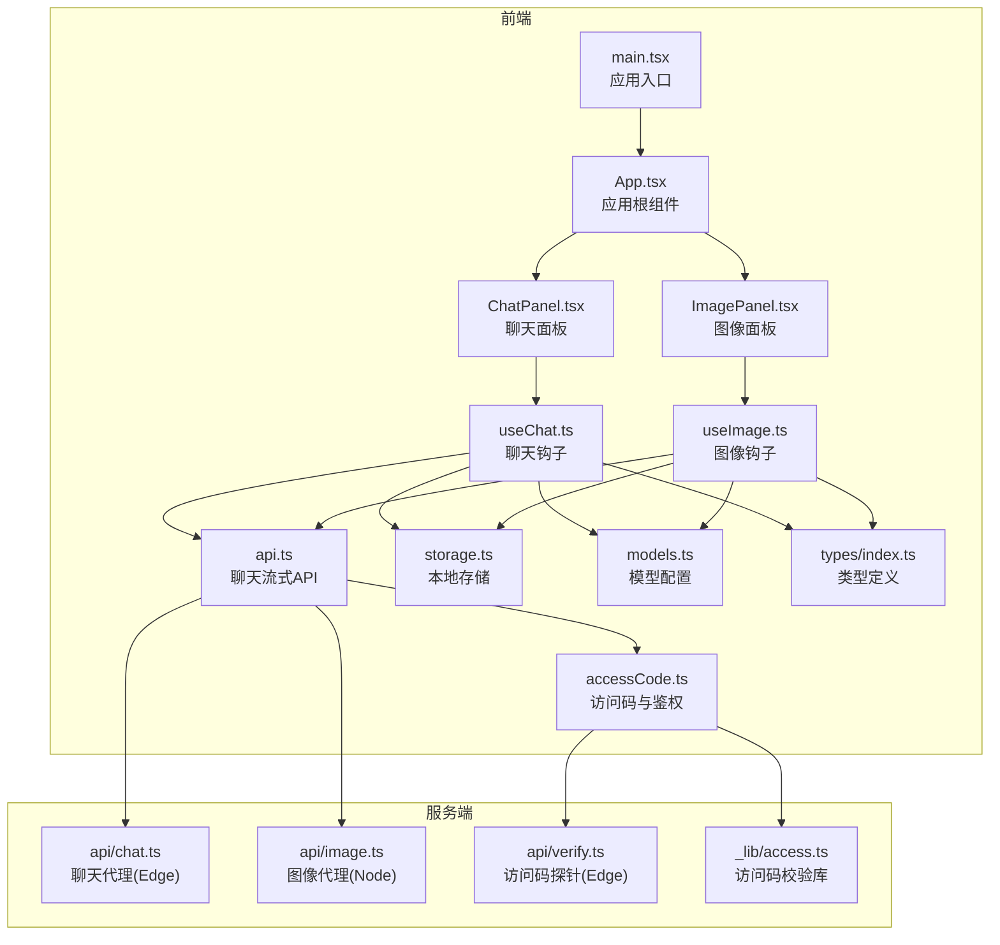
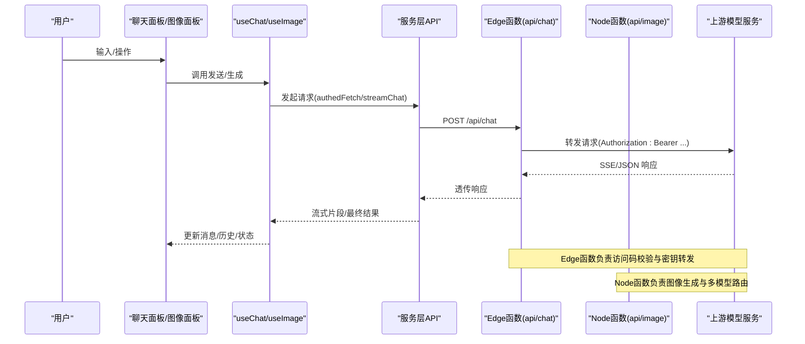
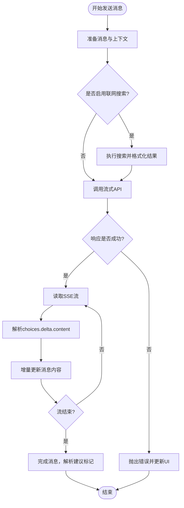
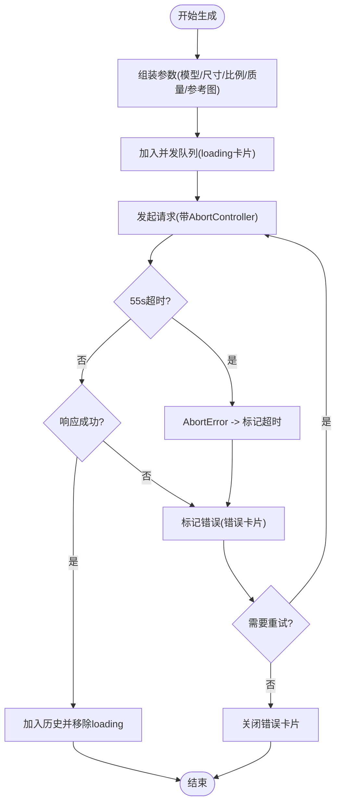
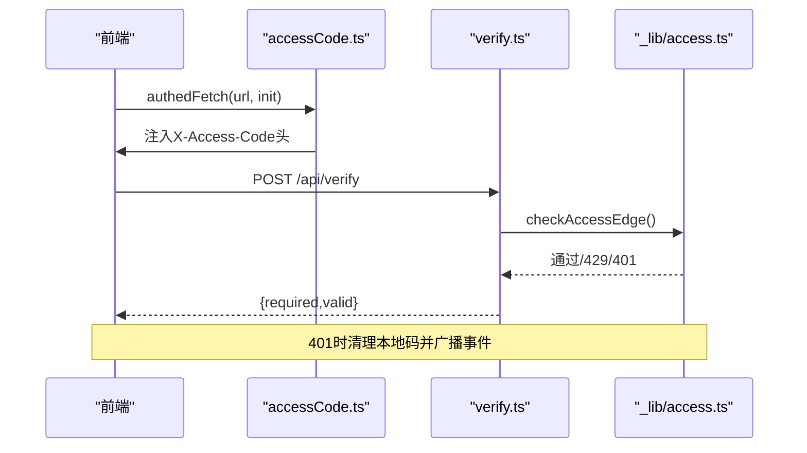
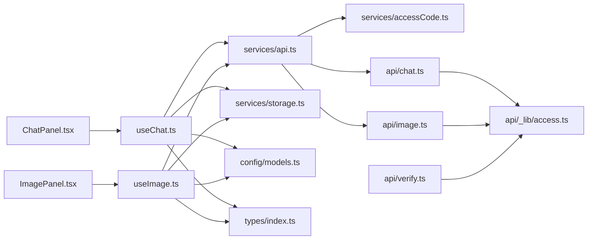

# 故障排除

<cite>
**本文引用的文件**   
- [README.md](file://README.md)
- [package.json](file://package.json)
- [src/main.tsx](file://src/main.tsx)
- [src/App.tsx](file://src/App.tsx)
- [src/components/chat/ChatPanel.tsx](file://src/components/chat/ChatPanel.tsx)
- [src/components/image/ImagePanel.tsx](file://src/components/image/ImagePanel.tsx)
- [src/hooks/useChat.ts](file://src/hooks/useChat.ts)
- [src/hooks/useImage.ts](file://src/hooks/useImage.ts)
- [src/services/api.ts](file://src/services/api.ts)
- [src/services/accessCode.ts](file://src/services/accessCode.ts)
- [src/services/storage.ts](file://src/services/storage.ts)
- [src/types/index.ts](file://src/types/index.ts)
- [src/config/models.ts](file://src/config/models.ts)
- [api/chat.ts](file://api/chat.ts)
- [api/image.ts](file://api/image.ts)
- [api/verify.ts](file://api/verify.ts)
- [api/_lib/access.ts](file://api/_lib/access.ts)
</cite>

## 目录
1. [简介](#简介)
2. [项目结构](#项目结构)
3. [核心组件](#核心组件)
4. [架构总览](#架构总览)
5. [详细组件分析](#详细组件分析)
6. [依赖关系分析](#依赖关系分析)
7. [性能考虑](#性能考虑)
8. [故障排除指南](#故障排除指南)
9. [结论](#结论)
10. [附录](#附录)

## 简介
本指南面向 AIShop 项目的使用者与维护者，系统化梳理常见问题的诊断与解决流程，覆盖网络连接、API 调用失败、数据加载异常、性能问题、调试工具与技巧、日志与错误追踪、特定功能故障（聊天、图像生成、会话数据）以及预防性维护与监控建议。文档基于仓库现有代码进行分析，确保建议与实现一致。

## 项目结构
AIShop 采用 React + TypeScript + Vite 构建，前端通过 Edge/Serverless 函数代理第三方模型服务，核心模块包括：
- 应用入口与布局：入口、应用根组件、主布局与侧边栏
- 功能面板：聊天、图像、视频、音乐
- 业务钩子：useChat、useImage
- 服务层：API 代理、访问码、存储、Web 搜索、标题生成
- 类型定义：消息、会话、媒体、模型等
- 配置：模型清单
- 边缘/服务端：聊天与图像代理、访问码校验

**图表来源**
- [src/main.tsx:1-11](file://src/main.tsx#L1-L11)
- [src/App.tsx:1-67](file://src/App.tsx#L1-L67)
- [src/components/chat/ChatPanel.tsx:1-354](file://src/components/chat/ChatPanel.tsx#L1-L354)
- [src/components/image/ImagePanel.tsx:1-434](file://src/components/image/ImagePanel.tsx#L1-L434)
- [src/hooks/useChat.ts:1-370](file://src/hooks/useChat.ts#L1-L370)
- [src/hooks/useImage.ts:1-393](file://src/hooks/useImage.ts#L1-L393)
- [src/services/api.ts:1-83](file://src/services/api.ts#L1-L83)
- [src/services/accessCode.ts:1-113](file://src/services/accessCode.ts#L1-L113)
- [src/services/storage.ts:1-66](file://src/services/storage.ts#L1-L66)
- [src/config/models.ts:1-228](file://src/config/models.ts#L1-L228)
- [src/types/index.ts:1-103](file://src/types/index.ts#L1-L103)
- [api/chat.ts:1-50](file://api/chat.ts#L1-L50)
- [api/image.ts:1-310](file://api/image.ts#L1-L310)
- [api/verify.ts:1-33](file://api/verify.ts#L1-L33)
- [api/_lib/access.ts:1-156](file://api/_lib/access.ts#L1-L156)

**章节来源**
- [src/main.tsx:1-11](file://src/main.tsx#L1-L11)
- [src/App.tsx:1-67](file://src/App.tsx#L1-L67)
- [src/components/chat/ChatPanel.tsx:1-354](file://src/components/chat/ChatPanel.tsx#L1-L354)
- [src/components/image/ImagePanel.tsx:1-434](file://src/components/image/ImagePanel.tsx#L1-L434)
- [src/hooks/useChat.ts:1-370](file://src/hooks/useChat.ts#L1-L370)
- [src/hooks/useImage.ts:1-393](file://src/hooks/useImage.ts#L1-L393)
- [src/services/api.ts:1-83](file://src/services/api.ts#L1-L83)
- [src/services/accessCode.ts:1-113](file://src/services/accessCode.ts#L1-L113)
- [src/services/storage.ts:1-66](file://src/services/storage.ts#L1-L66)
- [src/config/models.ts:1-228](file://src/config/models.ts#L1-L228)
- [src/types/index.ts:1-103](file://src/types/index.ts#L1-L103)
- [api/chat.ts:1-50](file://api/chat.ts#L1-L50)
- [api/image.ts:1-310](file://api/image.ts#L1-L310)
- [api/verify.ts:1-33](file://api/verify.ts#L1-L33)
- [api/_lib/access.ts:1-156](file://api/_lib/access.ts#L1-L156)

## 核心组件
- 应用入口与根组件：负责初始化、路由态切换与权限门控
- 聊天面板与钩子：负责消息流式接收、联网搜索、会话持久化、建议标记解析与显示
- 图像面板与钩子：负责参数校验、并发队列、超时控制、错误卡片、历史持久化
- 服务层：聊天流式 API、访问码鉴权、本地存储、模型配置
- 服务端代理：聊天与图像代理、访问码校验与限速

**章节来源**
- [src/App.tsx:11-67](file://src/App.tsx#L11-L67)
- [src/hooks/useChat.ts:69-370](file://src/hooks/useChat.ts#L69-L370)
- [src/hooks/useImage.ts:128-393](file://src/hooks/useImage.ts#L128-L393)
- [src/services/api.ts:13-83](file://src/services/api.ts#L13-L83)
- [src/services/accessCode.ts:37-113](file://src/services/accessCode.ts#L37-L113)
- [src/services/storage.ts:7-66](file://src/services/storage.ts#L7-L66)
- [src/config/models.ts:3-228](file://src/config/models.ts#L3-L228)
- [api/chat.ts:11-50](file://api/chat.ts#L11-L50)
- [api/image.ts:104-310](file://api/image.ts#L104-L310)
- [api/verify.ts:11-33](file://api/verify.ts#L11-L33)
- [api/_lib/access.ts:120-156](file://api/_lib/access.ts#L120-L156)

## 架构总览
前端通过 Edge/Serverless 函数代理上游模型服务，聊天使用 SSE 流式传输，图像生成支持多模型与多参数组合。访问码与限速在服务端统一实现，前端通过探针判断是否需要登录。

**图表来源**
- [src/services/api.ts:13-83](file://src/services/api.ts#L13-L83)
- [src/services/accessCode.ts:37-57](file://src/services/accessCode.ts#L37-L57)
- [api/chat.ts:11-50](file://api/chat.ts#L11-L50)
- [api/image.ts:104-310](file://api/image.ts#L104-L310)

## 详细组件分析

### 聊天组件与错误处理
- 流式处理：使用可读流 Reader 逐行解析 SSE 数据，解析 choices.delta.content 片段
- 错误处理：当 response.ok 为否时抛出错误；AbortController 支持中断；finally 清理资源
- 建议标记：支持 <<<SUGGESTIONS>>> 与 <<<END_SUGGESTIONS>>> 标记，流式显示时隐藏中间态
- 联网搜索：可选开启，失败时标记并在消息中标注

**图表来源**
- [src/hooks/useChat.ts:135-250](file://src/hooks/useChat.ts#L135-L250)
- [src/services/api.ts:13-83](file://src/services/api.ts#L13-L83)

**章节来源**
- [src/hooks/useChat.ts:135-250](file://src/hooks/useChat.ts#L135-L250)
- [src/services/api.ts:13-83](file://src/services/api.ts#L13-L83)

### 图像生成组件与并发控制
- 参数校验：根据模型类型与编辑模式拼装请求体，GPT 与 Gemini 路径不同
- 并发队列：每项任务独立 AbortController + 55s 超时，错误时转为“错误卡片”
- 重试/取消：基于任务 ID 重试或取消，历史持久化
- 上传压缩：JPEG 压缩至最大边 1024px，质量 0.85

**图表来源**
- [src/hooks/useImage.ts:228-286](file://src/hooks/useImage.ts#L228-L286)
- [src/hooks/useImage.ts:289-317](file://src/hooks/useImage.ts#L289-L317)
- [api/image.ts:104-310](file://api/image.ts#L104-L310)

**章节来源**
- [src/hooks/useImage.ts:128-393](file://src/hooks/useImage.ts#L128-L393)
- [api/image.ts:104-310](file://api/image.ts#L104-L310)

### 访问码与鉴权
- 前端：localStorage 存储访问码，authedFetch 自动注入 X-Access-Code；收到 401 清理并广播事件
- 探针：/api/verify 判断服务端是否启用访问码与本地码有效性
- 服务端：checkAccessEdge 实现恒定时间比较、失败计数与锁定、失败延迟

**图表来源**
- [src/services/accessCode.ts:37-113](file://src/services/accessCode.ts#L37-L113)
- [api/verify.ts:11-33](file://api/verify.ts#L11-L33)
- [api/_lib/access.ts:120-156](file://api/_lib/access.ts#L120-L156)

**章节来源**
- [src/services/accessCode.ts:37-113](file://src/services/accessCode.ts#L37-L113)
- [api/verify.ts:11-33](file://api/verify.ts#L11-L33)
- [api/_lib/access.ts:120-156](file://api/_lib/access.ts#L120-L156)

## 依赖关系分析
- 组件依赖：ChatPanel 与 ImagePanel 依赖各自钩子；钩子依赖服务层与类型定义
- 服务层依赖：api.ts 依赖 accessCode.ts；useChat/useImage 依赖 storage.ts 与 models.ts
- 服务端依赖：chat.ts 与 image.ts 依赖 _lib/access.ts；verify.ts 依赖 _lib/access.ts

**图表来源**
- [src/components/chat/ChatPanel.tsx:1-354](file://src/components/chat/ChatPanel.tsx#L1-L354)
- [src/components/image/ImagePanel.tsx:1-434](file://src/components/image/ImagePanel.tsx#L1-L434)
- [src/hooks/useChat.ts:1-370](file://src/hooks/useChat.ts#L1-L370)
- [src/hooks/useImage.ts:1-393](file://src/hooks/useImage.ts#L1-L393)
- [src/services/api.ts:1-83](file://src/services/api.ts#L1-L83)
- [src/services/accessCode.ts:1-113](file://src/services/accessCode.ts#L1-L113)
- [src/services/storage.ts:1-66](file://src/services/storage.ts#L1-L66)
- [src/config/models.ts:1-228](file://src/config/models.ts#L1-L228)
- [src/types/index.ts:1-103](file://src/types/index.ts#L1-L103)
- [api/chat.ts:1-50](file://api/chat.ts#L1-L50)
- [api/image.ts:1-310](file://api/image.ts#L1-L310)
- [api/verify.ts:1-33](file://api/verify.ts#L1-L33)
- [api/_lib/access.ts:1-156](file://api/_lib/access.ts#L1-L156)

**章节来源**
- [src/components/chat/ChatPanel.tsx:1-354](file://src/components/chat/ChatPanel.tsx#L1-L354)
- [src/components/image/ImagePanel.tsx:1-434](file://src/components/image/ImagePanel.tsx#L1-L434)
- [src/hooks/useChat.ts:1-370](file://src/hooks/useChat.ts#L1-L370)
- [src/hooks/useImage.ts:1-393](file://src/hooks/useImage.ts#L1-L393)
- [src/services/api.ts:1-83](file://src/services/api.ts#L1-L83)
- [src/services/accessCode.ts:1-113](file://src/services/accessCode.ts#L1-L113)
- [src/services/storage.ts:1-66](file://src/services/storage.ts#L1-L66)
- [src/config/models.ts:1-228](file://src/config/models.ts#L1-L228)
- [src/types/index.ts:1-103](file://src/types/index.ts#L1-L103)
- [api/chat.ts:1-50](file://api/chat.ts#L1-L50)
- [api/image.ts:1-310](file://api/image.ts#L1-L310)
- [api/verify.ts:1-33](file://api/verify.ts#L1-L33)
- [api/_lib/access.ts:1-156](file://api/_lib/access.ts#L1-L156)

## 性能考虑
- 流式渲染：聊天使用 SSE，前端按片段增量更新，避免一次性渲染大量文本
- 并发与超时：图像生成任务独立 AbortController + 55s 超时，避免长时间占用
- 本地缓存：会话与模型选择、联网开关持久化到 localStorage，减少重复计算
- 图片压缩：上传前 JPEG 压缩，降低体积与网络压力
- 滚动优化：聊天面板自动滚动至底部，避免频繁重排

**章节来源**
- [src/services/api.ts:13-83](file://src/services/api.ts#L13-L83)
- [src/hooks/useImage.ts:228-286](file://src/hooks/useImage.ts#L228-L286)
- [src/services/storage.ts:19-25](file://src/services/storage.ts#L19-L25)
- [src/hooks/useImage.ts:89-125](file://src/hooks/useImage.ts#L89-L125)
- [src/components/chat/ChatPanel.tsx:45-67](file://src/components/chat/ChatPanel.tsx#L45-L67)

## 故障排除指南

### 通用网络与API问题
- 症状：请求失败、无响应、超时
  - 检查服务端密钥与访问码配置（HIGHWAY_API_KEY、ACCESS_CODE）
  - 查看服务端代理返回状态：401（无效访问码）、429（限速锁定）、5xx（上游错误）
  - 前端 authedFetch 收到 401 会清理本地访问码并触发登出事件
  - 聊天流式：确认 SSE 响应头与数据片段解析
  - 图像：确认请求体字段与模型路由匹配，注意 GPT 与 Gemini 的差异

- 诊断步骤
  - 打开浏览器开发者工具 Network 面板，观察 /api/chat 与 /api/image 的请求与响应
  - 查看响应状态码与响应体，关注 502（上游非 JSON/无图片）与 504（上游超时）
  - 检查 X-Access-Code 请求头是否正确注入
  - 使用 /api/verify 探针验证访问码有效性与服务端是否启用校验

- 解决方案
  - 补充或修正环境变量（HIGHWAY_API_KEY、ACCESS_CODE）
  - 等待限速解锁（服务端返回 Retry-After 或锁定时长）
  - 重试请求；图像生成失败时使用“重试”按钮
  - 聊天失败时查看错误消息并重试

**章节来源**
- [api/chat.ts:11-50](file://api/chat.ts#L11-L50)
- [api/image.ts:104-310](file://api/image.ts#L104-L310)
- [api/verify.ts:11-33](file://api/verify.ts#L11-L33)
- [src/services/accessCode.ts:37-57](file://src/services/accessCode.ts#L37-L57)
- [src/services/api.ts:48-51](file://src/services/api.ts#L48-L51)

### 聊天功能异常
- 症状：消息不显示、卡顿、中断
  - 检查 isStreaming 标记与建议标记解析逻辑
  - 确认 AbortController 正确中断与 finally 清理
  - 联网搜索失败时的消息标注

- 诊断步骤
  - Network 面板查看 /api/chat 的 SSE 流是否持续
  - Console 查看错误消息与堆栈
  - 检查 messages 与 activeConversation 的状态同步

- 解决方案
  - 点击“停止生成”中断流式输出
  - 重试发送；若仍失败，检查上游密钥与访问码
  - 清理会话并重新开始

**章节来源**
- [src/hooks/useChat.ts:135-250](file://src/hooks/useChat.ts#L135-L250)
- [src/components/chat/ChatPanel.tsx:321-333](file://src/components/chat/ChatPanel.tsx#L321-L333)

### 图像生成失败
- 症状：生成卡住、错误卡片、无图片返回
  - 检查模型与参数：GPT vs Gemini 的字段差异
  - 检查参考图格式：GPT 需 data URI 前缀；Gemini 支持裸 base64 与 URL
  - 检查上传大小与数量限制

- 诊断步骤
  - Network 面板查看 /api/image 的请求体与响应
  - 确认响应体包含 image_urls/data/images/b64_json
  - 查看错误卡片上的错误信息与“重试/关闭”操作

- 解决方案
  - 按模型要求调整参数与参考图格式
  - 降低图片尺寸或质量，减少体积
  - 使用“重试”按钮；超时则等待后重试

**章节来源**
- [api/image.ts:177-254](file://api/image.ts#L177-L254)
- [src/hooks/useImage.ts:228-286](file://src/hooks/useImage.ts#L228-L286)
- [src/components/image/ImagePanel.tsx:258-299](file://src/components/image/ImagePanel.tsx#L258-L299)

### 会话数据丢失/异常
- 症状：刷新后会话消失、标题未更新
  - 检查 localStorage 是否可用与容量限制
  - 确认 saveConversations/loadConversations 的调用时机

- 诊断步骤
  - Application/Storage 面板查看 aishop_conversations
  - Console 查看保存失败的错误日志
  - 检查 createConversation 与持久化键名

- 解决方案
  - 清理浏览器存储或更换隐私模式
  - 确保页面具备写入 localStorage 权限
  - 导出 .aishop.json 作为备份

**章节来源**
- [src/services/storage.ts:7-25](file://src/services/storage.ts#L7-L25)
- [src/hooks/useChat.ts:326-347](file://src/hooks/useChat.ts#L326-L347)

### 访问码与鉴权问题
- 症状：反复要求登录、401/429 错误
  - 检查 ACCESS_CODE 是否配置
  - 检查失败计数与锁定状态
  - 检查探针 /api/verify 的返回

- 诊断步骤
  - Network 面板查看 /api/verify 的响应
  - Console 查看 unauthorized 事件广播
  - 检查 X-Access-Code 请求头

- 解决方案
  - 正确填写访问码；等待锁定解除
  - 服务端未启用时自动跳过登录

**章节来源**
- [api/verify.ts:11-33](file://api/verify.ts#L11-L33)
- [api/_lib/access.ts:63-104](file://api/_lib/access.ts#L63-L104)
- [src/services/accessCode.ts:37-57](file://src/services/accessCode.ts#L37-L57)

### 性能问题排查
- 内存泄漏检测
  - 监控组件卸载：useImage 在卸载时清理所有 AbortController
  - 检查事件监听器与定时器是否清理

- 渲染性能优化
  - 聊天：使用增量更新与建议标记隐藏逻辑
  - 图像：懒加载、网格布局、错误卡片不挤占已有内容

- API 响应时间分析
  - Network 面板查看 TTFB、首包时间与总时长
  - 服务端超时：图像函数 maxDuration=60s；聊天 Edge 仅 25s，建议使用 Node 函数

**章节来源**
- [src/hooks/useImage.ts:149-155](file://src/hooks/useImage.ts#L149-L155)
- [src/components/chat/ChatPanel.tsx:45-67](file://src/components/chat/ChatPanel.tsx#L45-L67)
- [api/image.ts:17-26](file://api/image.ts#L17-L26)

### 调试工具与技巧
- 浏览器开发者工具
  - Network：监控请求/响应、SSE 流、超时与错误
  - Console：查看错误消息、localStorage 写入失败
  - Application：查看 localStorage 与键名
  - Performance/Memory：检测内存增长与渲染卡顿

- 网络请求监控
  - 关注 /api/chat 与 /api/image 的请求体与响应体
  - 检查 Authorization 与 X-Access-Code 头

- 状态检查
  - useChat/useImage 的状态与 pendingTasks/history
  - 探针 /api/verify 的返回值

**章节来源**
- [src/services/accessCode.ts:37-113](file://src/services/accessCode.ts#L37-L113)
- [src/hooks/useChat.ts:69-370](file://src/hooks/useChat.ts#L69-L370)
- [src/hooks/useImage.ts:128-393](file://src/hooks/useImage.ts#L128-L393)

### 日志记录与错误追踪
- 错误边界与异常捕获
  - 聊天：try/catch 捕获 AbortError 与未知错误，更新消息与错误状态
  - 图像：AbortError 区分手动取消与超时，错误卡片展示错误信息

- 用户反馈收集
  - 错误卡片提供“重试/关闭”操作
  - 控制台日志辅助定位问题

**章节来源**
- [src/hooks/useChat.ts:231-247](file://src/hooks/useChat.ts#L231-L247)
- [src/hooks/useImage.ts:265-285](file://src/hooks/useImage.ts#L265-L285)

### 特定功能故障排除
- 聊天：SSE 断流、建议标记闪烁、联网搜索失败
  - 解决：停止生成、重试、检查系统提示与搜索上下文

- 图像：参考图格式错误、尺寸/比例不生效、并发超时
  - 解决：按模型规范准备参考图、调整参数、重试

- 会话：标题未更新、导入失败
  - 解决：触发标题生成、检查 .aishop.json 格式

**章节来源**
- [src/hooks/useChat.ts:21-67](file://src/hooks/useChat.ts#L21-L67)
- [src/hooks/useChat.ts:326-347](file://src/hooks/useChat.ts#L326-L347)
- [src/hooks/useImage.ts:228-286](file://src/hooks/useImage.ts#L228-L286)

### 预防性维护与监控指标
- 环境变量与配置
  - HIGHWAY_API_KEY、ACCESS_CODE 必填；定期轮换密钥
  - 模型配置与参数选项定期校验

- 监控指标建议
  - 请求成功率、P95/P99 延迟、错误分布（401/429/5xx）
  - 流式响应首包时间、总字节数
  - 并发任务数、超时率、重试率
  - 会话持久化成功率、localStorage 可用性

- 运维建议
  - 服务端限速策略与失败延迟合理配置
  - 前端超时与重试策略与服务端超时匹配
  - 定期导出会话备份，保障数据可恢复

**章节来源**
- [api/_lib/access.ts:7-111](file://api/_lib/access.ts#L7-L111)
- [api/chat.ts:9-48](file://api/chat.ts#L9-L48)
- [api/image.ts:17-26](file://api/image.ts#L17-L26)
- [src/services/storage.ts:19-25](file://src/services/storage.ts#L19-L25)

## 结论
本指南基于 AIShop 代码实现，提供了从架构到组件、从通用问题到特定功能的系统化故障排除方法。遵循本文的诊断步骤与解决方案，可快速定位并修复网络、API、性能与数据相关问题，并通过预防性维护与监控提升系统稳定性与用户体验。

## 附录
- 项目基础信息与依赖
  - 项目名称与版本、依赖与脚本
  - React/TypeScript/Vite 基础配置

**章节来源**
- [README.md:1-74](file://README.md#L1-L74)
- [package.json:1-40](file://package.json#L1-L40)