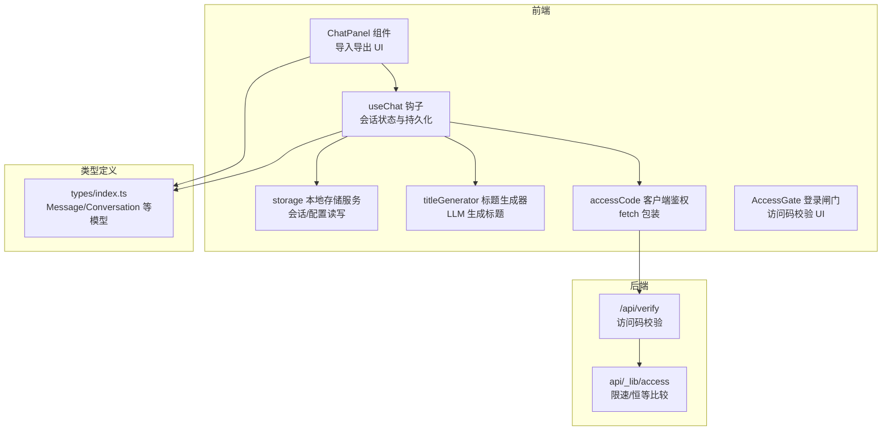
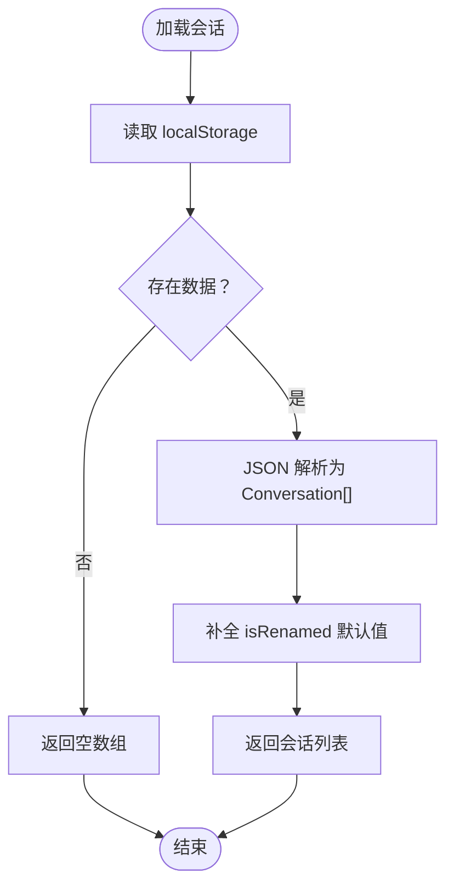
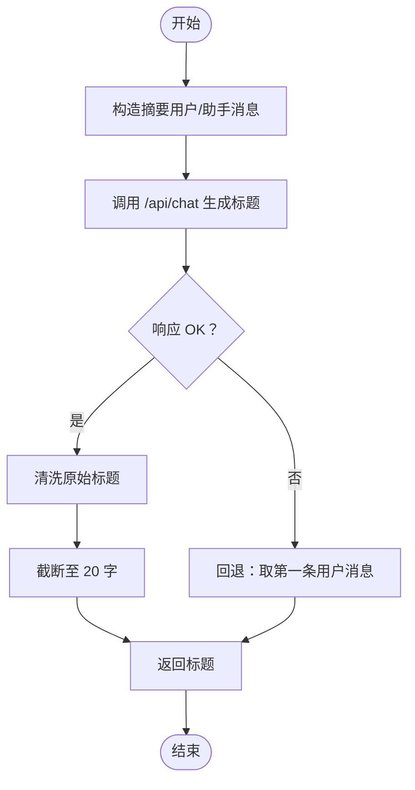
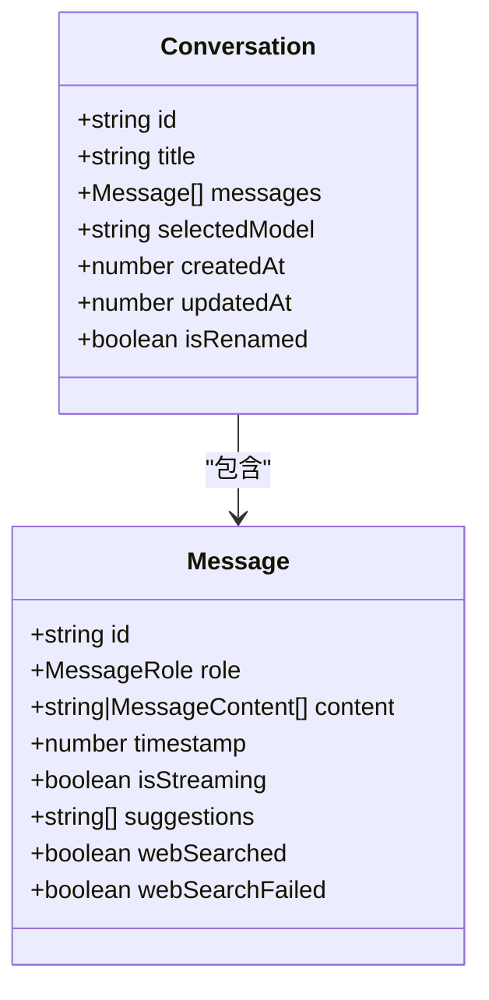
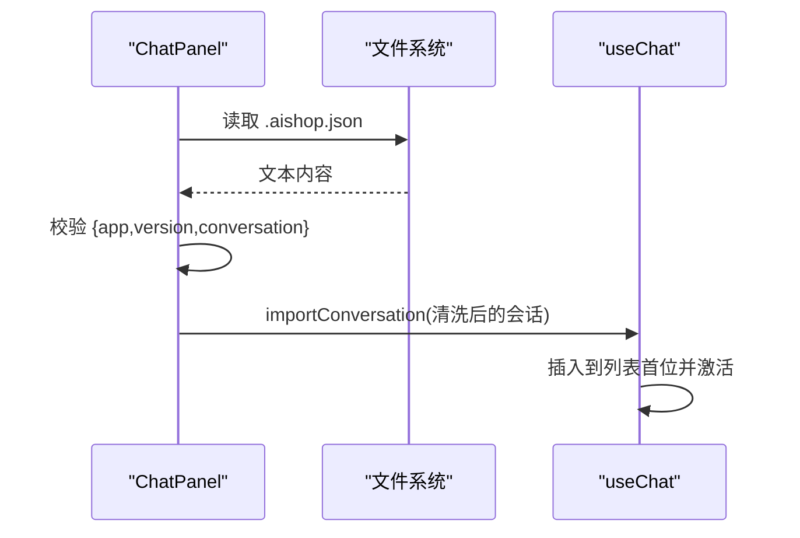
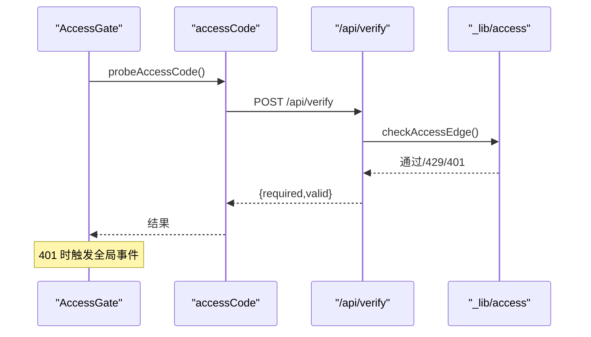
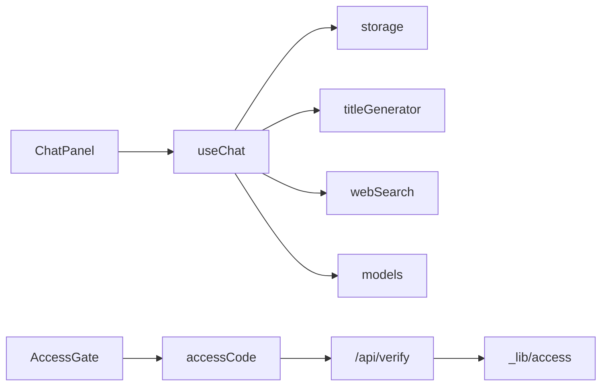

# 数据持久化

<cite>
**本文引用的文件**
- [src/services/storage.ts](file://src/services/storage.ts)
- [src/hooks/useChat.ts](file://src/hooks/useChat.ts)
- [src/types/index.ts](file://src/types/index.ts)
- [src/components/chat/ChatPanel.tsx](file://src/components/chat/ChatPanel.tsx)
- [src/services/titleGenerator.ts](file://src/services/titleGenerator.ts)
- [src/services/api.ts](file://src/services/api.ts)
- [src/services/webSearch.ts](file://src/services/webSearch.ts)
- [src/services/accessCode.ts](file://src/services/accessCode.ts)
- [src/components/auth/AccessGate.tsx](file://src/components/auth/AccessGate.tsx)
- [src/config/models.ts](file://src/config/models.ts)
- [api/_lib/access.ts](file://api/_lib/access.ts)
- [api/verify.ts](file://api/verify.ts)
</cite>

## 目录
1. [简介](#简介)
2. [项目结构](#项目结构)
3. [核心组件](#核心组件)
4. [架构总览](#架构总览)
5. [详细组件分析](#详细组件分析)
6. [依赖关系分析](#依赖关系分析)
7. [性能考虑](#性能考虑)
8. [故障排查指南](#故障排查指南)
9. [结论](#结论)
10. [附录](#附录)

## 简介
本文件聚焦 AIShop 的数据持久化系统，覆盖本地存储服务、会话数据管理、配置持久化、标题自动生成、数据模型设计、序列化与反序列化、导入导出与迁移、性能优化与安全隐私等主题。文档以代码为依据，结合可视化图示帮助读者快速理解系统设计与实现细节。

## 项目结构
AIShop 的前端采用 React + TypeScript 开发，数据持久化主要通过浏览器本地存储（localStorage）完成，同时提供会话导入导出能力。后端通过 Vercel Edge Functions 提供访问码校验与代理接口，确保前端请求的安全性与可控性。



图表来源
- [src/hooks/useChat.ts:69-369](file://src/hooks/useChat.ts#L69-L369)
- [src/services/storage.ts:1-66](file://src/services/storage.ts#L1-L66)
- [src/services/titleGenerator.ts:1-70](file://src/services/titleGenerator.ts#L1-L70)
- [src/components/chat/ChatPanel.tsx:1-365](file://src/components/chat/ChatPanel.tsx#L1-L365)
- [src/services/accessCode.ts:1-113](file://src/services/accessCode.ts#L1-L113)
- [src/components/auth/AccessGate.tsx:1-150](file://src/components/auth/AccessGate.tsx#L1-L150)
- [api/verify.ts:1-33](file://api/verify.ts#L1-L33)
- [api/_lib/access.ts:1-156](file://api/_lib/access.ts#L1-L156)

章节来源
- [src/hooks/useChat.ts:69-369](file://src/hooks/useChat.ts#L69-L369)
- [src/services/storage.ts:1-66](file://src/services/storage.ts#L1-L66)
- [src/services/accessCode.ts:1-113](file://src/services/accessCode.ts#L1-L113)
- [src/components/chat/ChatPanel.tsx:1-365](file://src/components/chat/ChatPanel.tsx#L1-L365)
- [api/verify.ts:1-33](file://api/verify.ts#L1-L33)
- [api/_lib/access.ts:1-156](file://api/_lib/access.ts#L1-L156)

## 核心组件
- 本地存储服务：封装 localStorage 的读写，负责会话列表、最后使用的模型、网络搜索开关等配置的持久化。
- 会话状态钩子：在组件挂载时加载本地会话，每次状态变化自动保存；提供新建、切换、删除、重命名、导入等操作。
- 标题生成器：基于 LLM 自动生成会话标题，包含摘要构造、系统提示、降噪清洗与回退策略。
- 导入导出组件：提供 Markdown 与 JSON 两种导出格式，支持拖拽导入与格式校验。
- 访问码鉴权：前端 fetch 包装，自动注入访问码头并在 401 时触发全局事件；后端提供限速与恒等比较防护。

章节来源
- [src/services/storage.ts:1-66](file://src/services/storage.ts#L1-L66)
- [src/hooks/useChat.ts:69-369](file://src/hooks/useChat.ts#L69-L369)
- [src/services/titleGenerator.ts:1-70](file://src/services/titleGenerator.ts#L1-L70)
- [src/components/chat/ChatPanel.tsx:127-217](file://src/components/chat/ChatPanel.tsx#L127-L217)
- [src/services/accessCode.ts:37-113](file://src/services/accessCode.ts#L37-L113)

## 架构总览
前端通过 useChat 钩子与 storage 服务交互，实现会话的增删改查与持久化；标题生成由 titleGenerator 发起请求至后端代理接口；导入导出由 ChatPanel 组件提供 UI 与数据转换；访问码校验由 AccessGate 与 accessCode 协作完成，后端 verify 与 _lib/access 提供限速与安全校验。

```mermaid
sequenceDiagram
participant UI as "ChatPanel"
participant Hook as "useChat"
participant Store as "storage"
participant Title as "titleGenerator"
participant Auth as "accessCode"
participant Verify as "/api/verify"
UI->>Hook : 用户操作新建/切换/导入
Hook->>Store : 读取/保存会话
Hook->>Title : 生成标题异步 fire-and-forget
Title->>Auth : authedFetch(带访问码头)
Auth->>Verify : POST /api/verify
Verify-->>Auth : {required,valid} 或 401
Auth-->>Title : 返回响应
Title-->>Hook : 标题结果
Hook->>Store : 更新标题并保存
```

图表来源
- [src/components/chat/ChatPanel.tsx:127-217](file://src/components/chat/ChatPanel.tsx#L127-L217)
- [src/hooks/useChat.ts:117-133](file://src/hooks/useChat.ts#L117-L133)
- [src/services/titleGenerator.ts:23-69](file://src/services/titleGenerator.ts#L23-L69)
- [src/services/accessCode.ts:37-79](file://src/services/accessCode.ts#L37-L79)
- [api/verify.ts:11-32](file://api/verify.ts#L11-L32)

## 详细组件分析

### 本地存储服务（storage）
- 功能职责
  - 会话列表：加载/保存 Conversation 数组，兼容旧字段 isRenamed。
  - 配置持久化：保存/加载最后使用的模型 ID、网络搜索开关。
  - 会话创建：生成新会话的唯一 ID、初始标题与时间戳。
- 关键点
  - 使用 localStorage 存储 JSON 字符串，异常时返回空数组或 null。
  - 会话保存在每次状态变更时自动触发，确保实时一致性。
- 版本兼容
  - 加载时对 isRenamed 字段进行默认值补全，避免旧数据导致渲染异常。



图表来源
- [src/services/storage.ts:7-17](file://src/services/storage.ts#L7-L17)

章节来源
- [src/services/storage.ts:1-66](file://src/services/storage.ts#L1-L66)

### 会话状态与持久化（useChat）
- 初始化与激活
  - 首次加载时从 localStorage 读取会话；若无则创建首个会话。
  - 激活会话 ID 来源于已保存会话或新建会话。
- 变更与保存
  - 通过 updateActiveConversation 更新当前会话，每次变更触发保存。
  - setSelectedModel 同步更新模型并保存最近模型。
  - setWebSearchEnabled 切换网络搜索并持久化开关。
- 标题生成
  - 新建/切换会话时，若标题仍为默认且存在消息，则异步触发标题生成。
  - 标题生成失败静默处理，避免阻塞主流程。
- 导入导出
  - importConversation 对导入数据进行清洗（移除 isStreaming）并插入到列表首位。
  - ChatPanel 提供 .aishop.json 导出与拖拽导入，包含版本与应用标识校验。

```mermaid
sequenceDiagram
participant Comp as "ChatPanel"
participant Hook as "useChat"
participant Store as "storage"
participant Title as "titleGenerator"
Comp->>Hook : newConversation/switchConversation
Hook->>Store : loadConversations()
alt 首次或空会话
Hook->>Store : createConversation()
end
Hook->>Store : saveConversations()
Hook->>Title : generateTitle(消息摘要)
Title-->>Hook : 标题
Hook->>Store : 更新标题并保存
```

图表来源
- [src/hooks/useChat.ts:69-369](file://src/hooks/useChat.ts#L69-L369)
- [src/services/storage.ts:19-25](file://src/services/storage.ts#L19-L25)
- [src/services/titleGenerator.ts:23-69](file://src/services/titleGenerator.ts#L23-L69)

章节来源
- [src/hooks/useChat.ts:69-369](file://src/hooks/useChat.ts#L69-L369)
- [src/components/chat/ChatPanel.tsx:127-217](file://src/components/chat/ChatPanel.tsx#L127-L217)

### 标题生成器（titleGenerator）
- 输入摘要构造
  - 从消息中提取用户与 AI 的内容，拼接成不超过 500 字的摘要文本。
- LLM 调用
  - 通过 authedFetch 调用后端代理接口，携带系统提示与温度、最大 token 等参数。
- 标题清洗
  - 去除首尾空白、引号与多余标点，末尾标点清理，截断至 20 字以内。
- 回退策略
  - 若 LLM 失败或响应为空，回退到取第一条用户消息的前 20 字作为标题。



图表来源
- [src/services/titleGenerator.ts:23-69](file://src/services/titleGenerator.ts#L23-L69)

章节来源
- [src/services/titleGenerator.ts:1-70](file://src/services/titleGenerator.ts#L1-L70)

### 数据模型与序列化
- 模型定义
  - Message：角色、内容（文本或富媒体）、时间戳、流式状态、建议、网络搜索结果等。
  - Conversation：会话 ID、标题、消息列表、选择模型、创建/更新时间、重命名标记。
- 序列化策略
  - 会话列表与配置以 JSON 字符串形式存储于 localStorage。
  - 导出 JSON 时包含版本号与应用标识，便于未来迁移与兼容。
- 兼容性
  - 加载时对 isRenamed 进行默认值补全；导出时移除 isStreaming 字段，避免污染。



图表来源
- [src/types/index.ts:9-66](file://src/types/index.ts#L9-L66)

章节来源
- [src/types/index.ts:1-103](file://src/types/index.ts#L1-L103)
- [src/services/storage.ts:12-13](file://src/services/storage.ts#L12-L13)
- [src/components/chat/ChatPanel.tsx:134-151](file://src/components/chat/ChatPanel.tsx#L134-L151)

### 导入导出与迁移
- 导出
  - Markdown：按用户/助手分节导出，保留图片链接。
  - JSON：包含版本号、应用标识、导出时间与会话完整数据。
- 导入
  - 支持拖拽 .aishop.json 文件，读取并校验版本与应用标识，清洗 isStreaming 后插入列表。
- 迁移
  - 通过版本号（如 version=1）与应用标识（app=AIShop）进行格式识别，未来可扩展多版本迁移策略。



图表来源
- [src/components/chat/ChatPanel.tsx:127-217](file://src/components/chat/ChatPanel.tsx#L127-L217)
- [src/hooks/useChat.ts:325-347](file://src/hooks/useChat.ts#L325-L347)

章节来源
- [src/components/chat/ChatPanel.tsx:127-217](file://src/components/chat/ChatPanel.tsx#L127-L217)
- [src/hooks/useChat.ts:325-347](file://src/hooks/useChat.ts#L325-L347)

### 访问码与安全
- 前端
  - accessCode 提供 get/set/clear 与 authedFetch 包装，自动注入 X-Access-Code 头。
  - 401 时清除本地访问码并广播全局事件，AccessGate 监听后回到登录界面。
  - probeAccessCode 与 verifyAccessCode 支持在线探测与校验。
- 后端
  - verify 根据环境变量 ACCESS_CODE 决定是否需要访问码，并返回 required 标识。
  - _lib/access 提供恒等比较、IP 限速（失败阈值、窗口、锁定时长）与失败延迟，降低爆破风险。



图表来源
- [src/components/auth/AccessGate.tsx:29-54](file://src/components/auth/AccessGate.tsx#L29-L54)
- [src/services/accessCode.ts:66-110](file://src/services/accessCode.ts#L66-L110)
- [api/verify.ts:11-32](file://api/verify.ts#L11-L32)
- [api/_lib/access.ts:120-155](file://api/_lib/access.ts#L120-L155)

章节来源
- [src/services/accessCode.ts:1-113](file://src/services/accessCode.ts#L1-L113)
- [src/components/auth/AccessGate.tsx:1-150](file://src/components/auth/AccessGate.tsx#L1-L150)
- [api/verify.ts:1-33](file://api/verify.ts#L1-L33)
- [api/_lib/access.ts:1-156](file://api/_lib/access.ts#L1-L156)

## 依赖关系分析
- 组件耦合
  - useChat 依赖 storage、titleGenerator、webSearch、models 等模块。
  - ChatPanel 依赖 useChat 的导出/导入回调与 types。
  - AccessGate 依赖 accessCode 的探测与事件监听。
- 外部依赖
  - 浏览器 localStorage 与 Web API（Blob、URL.createObjectURL、FileReader）。
  - 后端 Edge Functions 提供访问码校验与代理接口。



图表来源
- [src/hooks/useChat.ts:1-15](file://src/hooks/useChat.ts#L1-L15)
- [src/components/chat/ChatPanel.tsx:1-32](file://src/components/chat/ChatPanel.tsx#L1-L32)
- [src/services/accessCode.ts:1-113](file://src/services/accessCode.ts#L1-L113)
- [api/verify.ts:1-33](file://api/verify.ts#L1-L33)
- [api/_lib/access.ts:1-156](file://api/_lib/access.ts#L1-L156)

章节来源
- [src/hooks/useChat.ts:1-15](file://src/hooks/useChat.ts#L1-L15)
- [src/components/chat/ChatPanel.tsx:1-32](file://src/components/chat/ChatPanel.tsx#L1-L32)
- [src/services/accessCode.ts:1-113](file://src/services/accessCode.ts#L1-L113)

## 性能考虑
- 数据压缩
  - 当前使用 JSON 字符串直接存储，未见压缩实现。可在导出时启用 gzip 压缩，或在后端存储层引入压缩策略。
- 索引策略
  - localStorage 为键值存储，无索引。可通过消息数量与大小限制、分页加载或分块存储提升大会话性能。
- 缓存机制
  - useChat 在内存中维护会话列表与激活会话，避免频繁读写 localStorage。
  - 标题生成采用 fire-and-forget，避免阻塞主流程。
- I/O 优化
  - 仅在状态变更时保存会话，减少写入频率；导出时批量序列化，避免多次 stringify。

[本节为通用建议，无需特定文件引用]

## 故障排查指南
- 标题生成失败
  - 检查 /api/chat 可达性与响应体结构；确认系统提示与温度参数合理。
  - 若 LLM 不可用，回退逻辑会使用第一条用户消息作为标题。
- 导入失败
  - 确认文件为 .aishop.json，且包含正确的 app 与 version 字段；检查 JSON 格式与 conversation 结构。
- 访问码问题
  - 前端 401 会触发全局事件，AccessGate 自动回到登录界面；检查后端 ACCESS_CODE 环境变量与限速状态。
- 本地存储异常
  - localStorage 可能因配额不足或隐私模式抛错；storage.ts 已捕获异常并返回默认值，建议清理无用数据或迁移到 IndexedDB。

章节来源
- [src/services/titleGenerator.ts:58-68](file://src/services/titleGenerator.ts#L58-L68)
- [src/components/chat/ChatPanel.tsx:204-216](file://src/components/chat/ChatPanel.tsx#L204-L216)
- [src/services/accessCode.ts:49-56](file://src/services/accessCode.ts#L49-L56)
- [src/services/storage.ts:14-16](file://src/services/storage.ts#L14-L16)

## 结论
AIShop 的数据持久化以 localStorage 为核心，结合 React Hooks 实现状态与本地存储的双向同步；通过访问码与后端限速保障安全；标题生成与导入导出提供良好的用户体验。未来可在数据压缩、索引与缓存方面进一步优化，并考虑引入版本化的迁移工具以增强长期兼容性。

[本节为总结，无需特定文件引用]

## 附录
- 模型清单：CHAT_MODELS/IMAGE_MODELS 等定义了可用模型与能力，便于在会话中选择与持久化。
- 流式聊天：streamChat 通过流式读取响应增量内容，提升交互体验。

章节来源
- [src/config/models.ts:1-228](file://src/config/models.ts#L1-L228)
- [src/services/api.ts:13-83](file://src/services/api.ts#L13-L83)