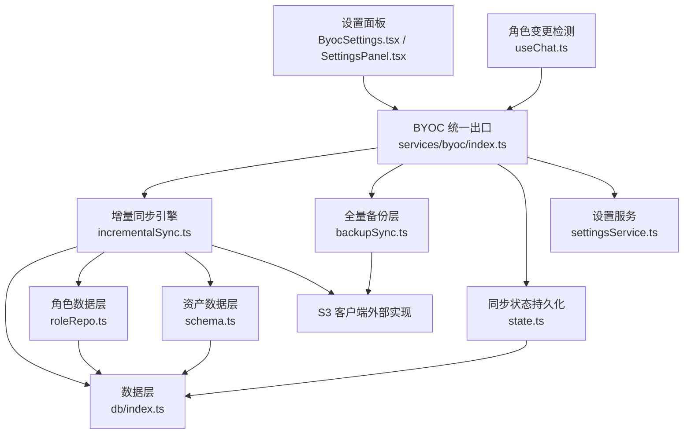
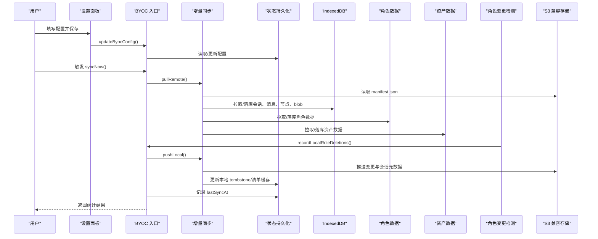
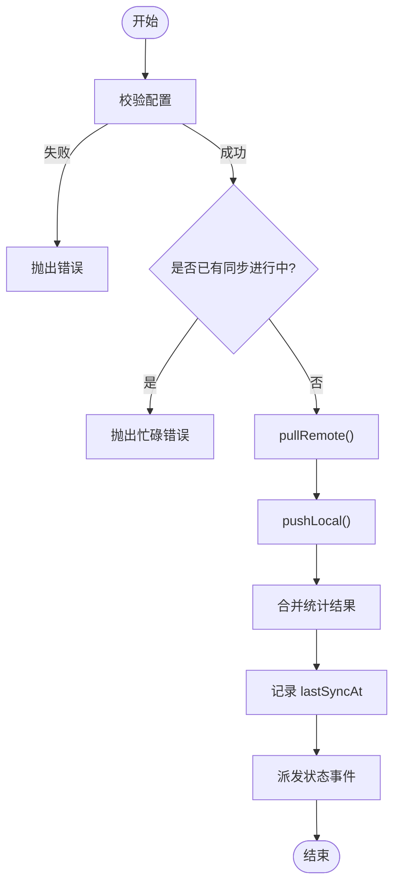
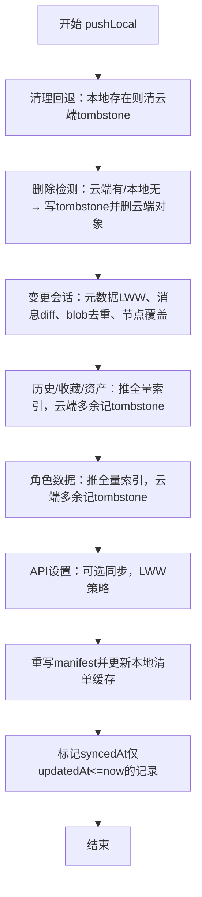
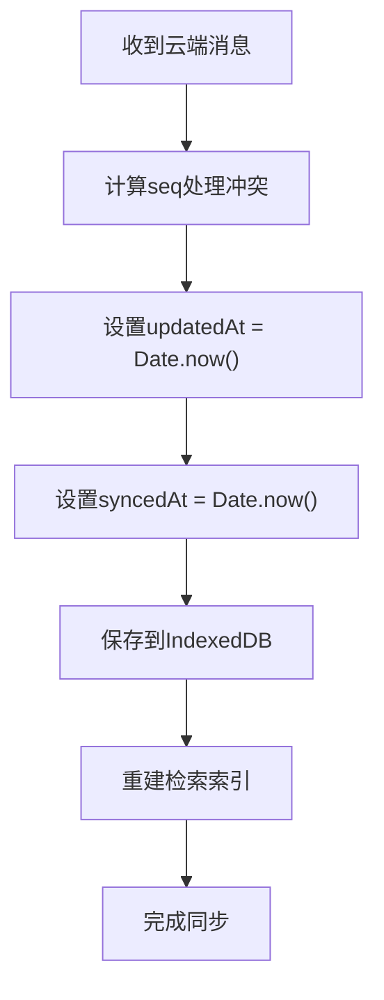
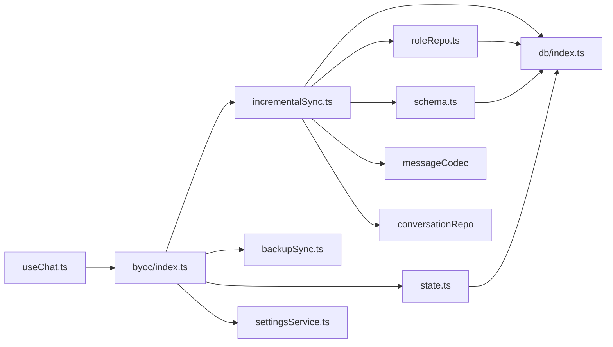

# BYOC云同步系统

<cite>
**本文引用的文件**
- [src/services/byoc/index.ts](file://src/services/byoc/index.ts)
- [src/services/byoc/incrementalSync.ts](file://src/services/byoc/incrementalSync.ts)
- [src/services/byoc/backupSync.ts](file://src/services/byoc/backupSync.ts)
- [src/services/byoc/state.ts](file://src/services/byoc/state.ts)
- [src/services/byoc/types.ts](file://src/services/byoc/types.ts)
- [src/components/settings/ByocSettings.tsx](file://src/components/settings/ByocSettings.tsx)
- [src/components/settings/SettingsPanel.tsx](file://src/components/settings/SettingsPanel.tsx)
- [src/services/settingsService.ts](file://src/services/settingsService.ts)
- [src/db/index.ts](file://src/db/index.ts)
- [src/db/roleRepo.ts](file://src/db/roleRepo.ts)
- [src/db/schema.ts](file://src/db/schema.ts)
- [src/hooks/useChat.ts](file://src/hooks/useChat.ts)
- [test-byoc-s3.mjs](file://test-byoc-s3.mjs)
</cite>

## 更新摘要
**所做更改**
- 增强了状态管理系统，新增assets字段支持资产删除记录和同步
- 改进了类型定义，增加assetIds和settingsUpdatedAt字段支持资产和API设置同步
- 完善了增量同步引擎，实现完整的资产、角色和API设置双向同步
- 优化了消息同步稳定性，通过本地时间戳设置防止无限同步循环
- 增强了待同步计数功能，支持资产和API设置的统计

## 目录
1. [简介](#简介)
2. [项目结构](#项目结构)
3. [核心组件](#核心组件)
4. [架构总览](#架构总览)
5. [详细组件分析](#详细组件分析)
6. [依赖关系分析](#依赖关系分析)
7. [性能考量](#性能考量)
8. [故障排查指南](#故障排查指南)
9. [结论](#结论)
10. [附录](#附录)

## 简介
本系统为"自带云存储（BYOC）"的浏览器端数据同步方案，支持将对话、消息、图片历史、收藏、**角色（系统提示词预设）**、**「我的库」资产**等数据增量同步到用户自己的 S3 兼容对象存储（如腾讯云 COS、阿里云 OSS、Cloudflare R2、MinIO、Backblaze B2 或自定义 S3）。系统提供：
- 全量备份与恢复（独立于增量同步）
- 增量双向同步（先拉后推，收敛本地与云端状态）
- **增强的资产数据自动同步**（通过现有 BYOC 基础设施，支持 artifact、markdown、image 资产的完整同步）
- **API 设置同步**（providers + apiKeys 的跨设备同步）
- **增强的角色数据自动同步**（通过现有 BYOC 基础设施，支持自动变更检测和删除传播）
- 自动调度（启动延迟拉取、周期轮询、回到前台拉取）
- 连接性测试与配置校验
- 多设备并发安全（Web Locks 串行化）

## 项目结构
BYOC 能力集中在 services/byoc 目录，对外暴露统一入口；设置面板在 components/settings 中；持久化状态通过 state.ts 写入 IndexedDB；数据库访问通过 db/index.ts 统一导出。**资产数据通过 schema.ts 中的 StoredAsset 接口管理，并集成到增量同步流程中，支持完整的同步生命周期**。

**图表来源**
- [src/services/byoc/index.ts:1-249](file://src/services/byoc/index.ts#L1-L249)
- [src/services/byoc/incrementalSync.ts:1-922](file://src/services/byoc/incrementalSync.ts#L1-L922)
- [src/services/byoc/backupSync.ts:1-69](file://src/services/byoc/backupSync.ts#L1-L69)
- [src/services/byoc/state.ts:1-192](file://src/services/byoc/state.ts#L1-L192)
- [src/services/settingsService.ts:1-115](file://src/services/settingsService.ts#L1-L115)
- [src/db/index.ts:1-110](file://src/db/index.ts#L1-L110)
- [src/db/roleRepo.ts:1-72](file://src/db/roleRepo.ts#L1-L72)
- [src/db/schema.ts:220-358](file://src/db/schema.ts#L220-L358)
- [src/hooks/useChat.ts:380-450](file://src/hooks/useChat.ts#L380-L450)

章节来源
- [src/services/byoc/index.ts:1-249](file://src/services/byoc/index.ts#L1-L249)
- [src/services/byoc/types.ts:1-128](file://src/services/byoc/types.ts#L1-L128)

## 核心组件
- 统一入口与自动调度：负责配置校验、连通性测试、手动/自动同步触发、事件广播。
- 增量同步引擎：维护云端清单 manifest，处理会话/消息/节点/blobs/历史/收藏/**资产/角色/API设置**的双向同步与删除传播。
- 全量备份层：将应用内备份格式直接上传至用户桶，或从最新备份恢复。
- 状态持久化：设备 ID、云端清单缓存、本地 tombstone、最近同步时间等。
- 设置服务：读写 BYOC 配置（localStorage），提供默认值与合并策略。
- 设置界面：可视化配置、预设填充、连通性检测反馈。
- **增强的资产数据管理**：通过 schema.ts 中的 StoredAsset 接口提供资产的创建、删除、列表查询等功能，集成自动变更检测、删除传播和同步状态计数。
- **API 设置同步**：支持 providers 和 apiKeys 的跨设备同步，采用 LWW 冲突解决策略。

章节来源
- [src/services/byoc/index.ts:1-249](file://src/services/byoc/index.ts#L1-L249)
- [src/services/byoc/incrementalSync.ts:1-922](file://src/services/byoc/incrementalSync.ts#L1-L922)
- [src/services/byoc/backupSync.ts:1-69](file://src/services/byoc/backupSync.ts#L1-L69)
- [src/services/byoc/state.ts:1-192](file://src/services/byoc/state.ts#L1-L192)
- [src/services/settingsService.ts:1-115](file://src/services/settingsService.ts#L1-L115)
- [src/components/settings/ByocSettings.tsx:1-180](file://src/components/settings/ByocSettings.tsx#L1-L180)
- [src/db/roleRepo.ts:1-72](file://src/db/roleRepo.ts#L1-L72)
- [src/db/schema.ts:220-358](file://src/db/schema.ts#L220-L358)

## 架构总览
BYOC 采用"分层 + 清单驱动"的设计：
- 全量备份层：独立于增量同步，用于灾难恢复。
- 增量同步层：以 manifest.json 作为"目录"，按 updatedAt/syncedAt 判断变更，使用 tombstones 传播删除。**现已全面支持资产数据、角色数据和 API 设置的同步，包括自动变更检测和删除传播**。
- 状态层：持久化设备标识、清单缓存、本地 tombstone、最近同步时间。
- 设置层：管理用户配置（endpoint、bucket、密钥等）。
- 数据层：IndexedDB 中的会话、消息、节点、blob、历史、收藏、**资产、角色**等。

**图表来源**
- [src/services/byoc/index.ts:56-123](file://src/services/byoc/index.ts#L56-L123)
- [src/services/byoc/incrementalSync.ts:139-323](file://src/services/byoc/incrementalSync.ts#L139-L323)
- [src/services/byoc/incrementalSync.ts:364-509](file://src/services/byoc/incrementalSync.ts#L364-L509)
- [src/services/byoc/state.ts:22-73](file://src/services/byoc/state.ts#L22-L73)
- [src/hooks/useChat.ts:389-411](file://src/hooks/useChat.ts#L389-L411)

## 详细组件分析

### 统一入口与自动调度（index.ts）
- 配置校验与连通性测试：validateConfig 检查 endpoint、bucket、accessKey/secretKey；testConnection 调用 listObjects 验证签名、网络与 CORS。
- 手动同步：syncNow 使用 Web Locks 串行化，避免多标签页并发写冲突；先拉后推，合并统计结果。
- 自动调度：scheduleAutoSync 在启动后延迟拉取一次、每 60 秒检查待同步量并触发 safeSync、页面回到前台时立即拉取。
- 事件机制：通过自定义事件通知 UI 刷新（状态变化、同步完成）。
- **角色删除检测**：新增 recordLocalRoleDeletions() 函数，用于记录本地角色删除操作，确保删除能跨设备传播。

**图表来源**
- [src/services/byoc/index.ts:40-123](file://src/services/byoc/index.ts#L40-L123)

章节来源
- [src/services/byoc/index.ts:1-249](file://src/services/byoc/index.ts#L1-L249)

### 增量同步引擎（incrementalSync.ts）
- 桶布局约定：manifest.json、convs/{id}.json、msgs/{convId}/{msgId}.json、nodes/{convId}/{nodeId}.json、blobs/{sha256}、history/favs/assets 及其 index.json、**roles/{id}.json 及其 index.json、settings.json**。
- 推送流程（pushLocal）：
  - 清理回退：若本地仍存在某会话，则移除云端 tombstone。
  - 删除检测：云端有而本地无且已知（缓存清单或本地 tombstone）→ 写 tombstone 并尝试删除云端对象。
  - 变更会话：仅当本地 updatedAt > 云端 updatedAt 才覆盖元数据；消息按 diff 推送；引用 blob 用 HEAD 探测去重；节点覆盖式同步并清理云端多余节点。
  - 历史/收藏/资产：以本地为准推全量索引；云端多余项记 tombstone。
  - **增强的角色数据同步**：以本地为准推全量索引；云端多余项记 tombstone；支持旧版本清单向后兼容；**新增 markRolesSynced() 函数批量标记角色同步状态**。
  - **API 设置同步**：可选同步，采用 LWW 策略，整体覆盖写。
  - 重写清单：更新 manifest.updatedAt 与 deviceId，并落盘本地清单缓存。
  - 标记 syncedAt：全部成功后批量标记，保证下次不重复推送。
- 拉取流程（pullRemote）：
  - 本机删除检测：云端有、缓存清单也有、本地没有 → 记本地 tombstone，防止"拉缺失"把刚删的拉回。
  - 应用 tombstone：删除本地对应记录，并清理本地 tombstone。
  - 会话拉取：按清单遍历，按 updatedAt/syncedAt 判断是否需要拉取；消息按 msgId 去重并以 updatedAt 大者胜；节点根据云端较新与否决定覆盖或补全；元数据 LWW。
  - 历史/收藏/资产：以云端 index 为准拉缺失；本地多余不删（防丢数据）。
  - **增强的角色数据拉取**：以云端 index 为准拉缺失；本地多余不删（防丢数据）；**新增 putStoredRole() 函数自动标记 syncedAt**。
  - **API 设置拉取**：云端较新且本机无更新变更时整体覆盖写回（LWW）。
  - 更新本地清单缓存。

**图表来源**
- [src/services/byoc/incrementalSync.ts:139-323](file://src/services/byoc/incrementalSync.ts#L139-L323)

章节来源
- [src/services/byoc/incrementalSync.ts:1-922](file://src/services/byoc/incrementalSync.ts#L1-L922)

### 全量备份层（backupSync.ts）
- 备份：构建应用内备份文件（自包含 JSON），以时间戳命名上传至 backups 目录。
- 恢复：列出备份，取字典序最后一个（最新），下载并调用 restoreBackup 导入（以新 id 导入，不覆盖现有数据）。
- 可用性检测：listObjects 判断是否存在至少一份备份。

章节来源
- [src/services/byoc/backupSync.ts:1-69](file://src/services/byoc/backupSync.ts#L1-L69)

### 状态持久化（state.ts）
- 设备 ID：首次生成并持久化，用于清单中标记最后推送方。
- 云端清单缓存：本地副本，用于判断"新增/删除"语义。
- 本地 tombstone：区分"本机已删"和"从未拉过"，避免误拉回或删除。**新增 assets 字段支持资产删除记录**。
- 最近同步时间：供 UI 展示。
- **增强的待同步计数**：**countPending() 函数现在包含资产和 API 设置待同步数量的统计**，综合 updatedAt/syncedAt 与 tombstone 计算，支撑 60 秒轮询。

章节来源
- [src/services/byoc/state.ts:1-192](file://src/services/byoc/state.ts#L1-L192)

### 类型定义（types.ts）
- ByocConfig：enabled、provider、endpoint、region、bucket、prefix、pathStyle、accessKey、secretKey、lastSyncAt。
- 服务商预设：cos/oss/r2/minio/b2 的默认 region/pathStyle。
- SyncManifestV1：schema、deviceId、updatedAt、convs、tombstones、historyIds、favIds、**roleIds、assetIds、settingsUpdatedAt**。
- 结果与进度回调：SyncResult、CloudBackupResult、ProgressFn。
- **新增 SyncedSettings**：包含 providers 和 apiKeys 的同步设置。

章节来源
- [src/services/byoc/types.ts:1-128](file://src/services/byoc/types.ts#L1-L128)

### 资产数据管理（schema.ts）
- 资产数据结构：StoredAsset 接口包含 id、kind、title、createdAt、artifact、content、blobIds、thumbnailBlobId、sourceRef 字段。
- 资产类型：支持 artifact、markdown、image 三种 kind。
- 同步支持：遵循与其他数据相同的同步约定（updatedAt/syncedAt），支持完整的增量同步流程。
- **增强的同步集成**：通过 listStoredAssets 获取原始存储记录，供增量同步使用；**支持完整的同步生命周期管理**。

章节来源
- [src/db/schema.ts:220-358](file://src/db/schema.ts#L220-L358)

### 角色数据管理（roleRepo.ts）
- 角色数据结构：StoredRole 接口包含 id、name、systemPrompt、createdAt、updatedAt、syncedAt 字段。
- 角色操作：createRole（自动提取名称）、deleteRole、listRoles、listStoredRoles。
- 队列管理：使用 enqueue 确保异步操作的顺序执行。
- **增强的同步集成**：通过 listStoredRoles 获取原始存储记录，供增量同步使用；**支持完整的同步生命周期管理**。

章节来源
- [src/db/roleRepo.ts:1-72](file://src/db/roleRepo.ts#L1-L72)

### 角色变更检测（useChat.ts）
- **自动角色变更检测**：通过 rolesRef 状态变量跟踪角色变更历史，检测角色创建、删除和修改。
- **本地删除记录**：检测到角色删除时调用 recordLocalRoleDeletions() 记录删除操作，确保删除能跨设备传播。
- **防抖同步触发**：角色变更后触发防抖同步，让角色像会话一样创建后 3 秒内自动上云、删除自动传播。

章节来源
- [src/hooks/useChat.ts:389-411](file://src/hooks/useChat.ts#L389-L411)

### 设置界面（ByocSettings.tsx / SettingsPanel.tsx）
- 由 ByocSettings 提供表单与预设选择，并在配置变更后防抖执行 testConnection，通过自定义事件上报连接状态。
- SettingsPanel 集成 BYOC 标签，显示连接状态图标（可用/不可用）。

章节来源
- [src/components/settings/ByocSettings.tsx:1-180](file://src/components/settings/ByocSettings.tsx#L1-L180)
- [src/components/settings/SettingsPanel.tsx:138-148](file://src/components/settings/SettingsPanel.tsx#L138-L148)

### 设置服务（settingsService.ts）
- 提供 getByocSettings/setByocSettings，合并默认值与用户配置，持久化到 localStorage。
- **新增 API 设置同步**：getSyncApiSettings/getSyncedSettings 等方法支持 API 设置的同步。

章节来源
- [src/services/settingsService.ts:105-113](file://src/services/settingsService.ts#L105-L113)

### 消息同步增强（putStoredMessage函数更新）
**重要更新**：putStoredMessage函数现在显式设置updatedAt和syncedAt字段为当前本地时间，这一改进解决了以下关键问题：

- **防止无限同步循环**：通过将updatedAt设置为本地时间，避免了云端推送时刻恒小于云端对象lastModified导致的全量重拉覆盖问题。
- **改善冲突解决**：当云端seq因任何原因错乱时，本地能够正确识别并避免被持续覆盖，实现了自愈能力。
- **增强同步稳定性**：确保消息同步的收敛性，防止由于时间戳不一致导致的同步循环。

**图表来源**
- [src/services/byoc/incrementalSync.ts:818-847](file://src/services/byoc/incrementalSync.ts#L818-L847)

章节来源
- [src/services/byoc/incrementalSync.ts:818-847](file://src/services/byoc/incrementalSync.ts#L818-L847)

## 依赖关系分析
- 入口模块依赖：
  - settingsService 获取/更新 BYOC 配置
  - incrementalSync 提供 pushLocal/pullRemote
  - backupSync 提供备份/恢复
  - state 提供设备ID、清单缓存、本地 tombstone、最近同步时间
  - s3Client（外部实现）提供 S3 操作
- 增量同步依赖：
  - db/index.ts 提供的会话、消息、节点、blob、历史、收藏、**资产、角色**等读写接口
  - messageCodec 提取消息中的 blob 引用
  - conversationRepo 删除会话
- 状态持久化依赖：
  - db/open 打开 IndexedDB 并执行事务
- 设置界面依赖：
  - byoc 入口的 validateConfig/testConnection/BYOC_STATUS_EVENT
  - types 中的预设与类型
- **角色变更检测依赖**：
  - useChat 中的 rolesRef 状态跟踪
  - recordLocalRoleDeletions 函数用于记录删除操作

**图表来源**
- [src/services/byoc/index.ts:13-24](file://src/services/byoc/index.ts#L13-L24)
- [src/services/byoc/incrementalSync.ts:21-59](file://src/services/byoc/incrementalSync.ts#L21-L59)
- [src/services/byoc/state.ts:7-9](file://src/services/byoc/state.ts#L7-L9)
- [src/db/roleRepo.ts:9-10](file://src/db/roleRepo.ts#L9-L10)
- [src/db/schema.ts:220-358](file://src/db/schema.ts#L220-L358)
- [src/hooks/useChat.ts:389-411](file://src/hooks/useChat.ts#L389-L411)

章节来源
- [src/services/byoc/index.ts:13-24](file://src/services/byoc/index.ts#L13-L24)
- [src/services/byoc/incrementalSync.ts:21-59](file://src/services/byoc/incrementalSync.ts#L21-L59)
- [src/services/byoc/state.ts:7-9](file://src/services/byoc/state.ts#L7-L9)

## 性能考量
- 并发控制：
  - 列表处理 mapLimit 限制并发度，避免对 S3 的请求风暴（会话、消息、节点、历史/收藏、**资产、角色**均有限流保护）。
  - 多标签页通过 navigator.locks.request 串行化同步，避免并发写冲突。
- 去重与最小化传输：
  - 推送 blob 前使用 headObject 探测，已存在则跳过上传。
  - 消息按 diff（updatedAt > syncedAt）推送，减少冗余。
- 资源回收：
  - 节点与历史/收藏、**资产、角色**的索引与 tombstone 配合，确保多余对象被清理或不再拉取。
- 数据库事务：
  - markSynced 使用事务批量更新 syncedAt，降低 IO 次数。
- **增强的资产同步性能**：
  - **资产同步采用与历史/收藏相同的批量处理模式，减少数据库操作次数**。
  - **assetsRef 状态变量避免重复的资产变更检测**。
- **增强的角色同步性能**：
  - **markRolesSynced() 函数批量标记角色同步状态，减少数据库操作次数**。
  - **rolesRef 状态变量避免重复的角色变更检测**。
- **消息同步性能优化**：
  - **putStoredMessage函数通过设置本地时间戳，避免了不必要的重复同步**。
  - **减少了由于时间戳不一致导致的无效同步操作**。
- **API 设置同步优化**：
  - **采用整体覆盖策略，减少频繁的小量更新**。
  - **LWW 冲突解决策略确保数据一致性**。

[本节为通用指导，无需特定文件来源]

## 故障排查指南
- 配置不完整：
  - 现象：testConnection 抛错或连接状态不可用。
  - 排查：确认 endpoint、bucket、accessKey、secretKey 已填写；检查 CORS 与签名是否正确。
- 自动同步未触发：
  - 现象：待同步数量不为零但未同步。
  - 排查：确认 enabled 为 true；检查 scheduleAutoSync 是否已注册；查看 countPending 逻辑是否识别到 tombstone 或 updatedAt 变更。
- 删除未跨设备生效：
  - 现象：一端删除后另一端仍可见。
  - 排查：确认 pushLocal 已将 tombstone 写入 manifest；确认 pullRemote 正确应用 tombstone 并清理本地 tombstone。
- 多标签页冲突：
  - 现象：并发同步导致数据不一致。
  - 排查：确认使用了 Web Locks；检查 runSync 是否在锁内执行。
- 签名异常（非 HTTPS/局域网）：
  - 现象：签名失败或行为不一致。
  - 排查：参考测试脚本验证 SigV4 签名路径与降级实现一致性。
- **增强的资产同步问题**：
  - 现象：资产数据未同步或不同步。
  - 排查：确认 manifest.assetIds 字段存在；检查 assets/index.json 是否正确更新；验证资产 tombstone 机制是否正常工作。
  - 现象：资产删除未传播到其他设备。
  - 排查：确认本地 tombstones.assets 是否正确记录删除；验证 pullRemote 中的资产删除处理逻辑。
- **增强的角色同步问题**：
  - 现象：角色数据未同步或不同步。
  - 排查：确认 manifest.roleIds 字段存在；检查 roles/index.json 是否正确更新；验证角色 tombstone 机制是否正常工作；**检查 rolesRef 状态变量是否正确跟踪角色变更**。
  - 现象：角色删除未传播到其他设备。
  - 排查：确认 recordLocalRoleDeletions() 函数被正确调用；检查本地 tombstones.roles 是否正确记录删除；**验证 useChat 中的角色变更检测逻辑是否正常工作**。
- **API 设置同步问题**：
  - 现象：API 设置未同步或同步不正确。
  - 排查：确认 settingsService.getSyncApiSettings() 返回 true；检查 manifest.settingsUpdatedAt 字段；验证 LWW 冲突解决逻辑。
  - 现象：设置同步后出现冲突。
  - 排查：确认 updatedAt/syncedAt 时间戳正确设置；检查 getSettingsSyncMeta 和 setSettingsSyncMeta 的使用。
- **消息同步问题**：
  - 现象：出现无限同步循环或消息被反复覆盖。
  - 排查：确认putStoredMessage函数正确设置了updatedAt和syncedAt为本地时间；检查云端seq是否出现错乱；验证消息同步的时间戳处理逻辑。
  - 现象：消息同步后无法自愈。
  - 排查：确认putStoredMessage函数中的时间戳设置逻辑；检查云端对象lastModified与本地updatedAt的关系；验证同步收敛机制是否正常工作。

章节来源
- [src/services/byoc/index.ts:40-54](file://src/services/byoc/index.ts#L40-L54)
- [src/services/byoc/index.ts:192-210](file://src/services/byoc/index.ts#L192-L210)
- [src/services/byoc/incrementalSync.ts:162-194](file://src/services/byoc/incrementalSync.ts#L162-L194)
- [src/services/byoc/incrementalSync.ts:416-441](file://src/services/byoc/incrementalSync.ts#L416-L441)
- [src/services/byoc/incrementalSync.ts:316-335](file://src/services/byoc/incrementalSync.ts#L316-L335)
- [src/services/byoc/incrementalSync.ts:442-448](file://src/services/byoc/incrementalSync.ts#L442-L448)
- [src/services/byoc/index.ts:89-100](file://src/services/byoc/index.ts#L89-L100)
- [src/hooks/useChat.ts:389-411](file://src/hooks/useChat.ts#L389-L411)
- [test-byoc-s3.mjs:1-86](file://test-byoc-s3.mjs#L1-L86)

## 结论
本 BYOC 系统以"清单驱动 + 增量同步 + 全量备份"的组合，实现了在浏览器端对任意 S3 兼容存储的安全、可靠、低侵入的数据同步。**最新的增强功能包括全面的资产数据自动同步、角色数据同步、API 设置同步和消息同步稳定性改进**，通过现有的 BYOC 基础设施，系统现在能够无缝同步用户的自定义资产（artifact、markdown、image）、角色（系统提示词预设）和 API 设置。通过 rolesRef 状态变量跟踪角色变更、recordLocalRoleDeletions() 函数处理本地角色删除、markRolesSynced() 函数批量标记角色同步状态等改进，系统提供了更完善的同步体验。**特别是putStoredMessage函数的更新，通过显式设置updatedAt和syncedAt字段为当前本地时间，有效防止了无限同步循环并改善了本地与云端消息状态的冲突解决**。通过 tombstone 与本地 tombstone 的配合，删除可跨设备传播；通过 Web Locks 与 mapLimit，保障并发与限流；通过自动调度，提升用户体验。建议在生产环境结合服务端日志与监控，持续优化并发度与重试策略。

[本节为总结性内容，无需特定文件来源]

## 附录
- 桶内对象布局示例（prefix 为用户配置的前缀，默认 aishop）：
  - sync/v1/manifest.json
  - sync/v1/convs/{convId}.json
  - sync/v1/msgs/{convId}/{msgId}.json
  - sync/v1/nodes/{convId}/{nodeId}.json
  - sync/v1/blobs/{sha256}
  - sync/v1/history/{id}.json + index.json
  - sync/v1/favs/{id}.json + index.json
  - **sync/v1/assets/{id}.json + index.json**
  - **sync/v1/roles/{id}.json + index.json**
  - **sync/v1/settings.json**

章节来源
- [src/services/byoc/incrementalSync.ts:9-19](file://src/services/byoc/incrementalSync.ts#L9-L19)
- [src/services/byoc/incrementalSync.ts:316-335](file://src/services/byoc/incrementalSync.ts#L316-L335)
- [src/services/byoc/incrementalSync.ts:549-559](file://src/services/byoc/incrementalSync.ts#L549-L559)
- [src/services/byoc/incrementalSync.ts:375-395](file://src/services/byoc/incrementalSync.ts#L375-L395)
- [src/services/byoc/incrementalSync.ts:399-403](file://src/services/byoc/incrementalSync.ts#L399-L403)