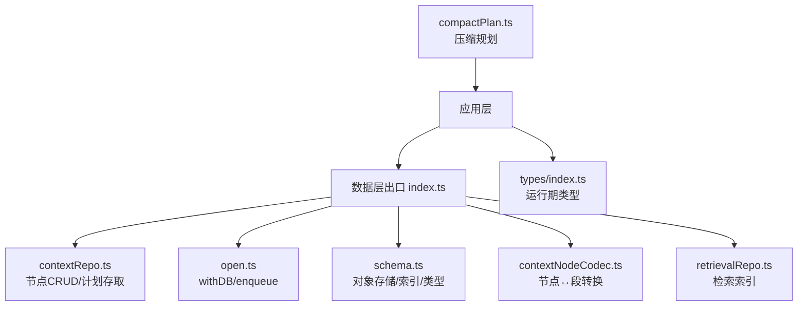
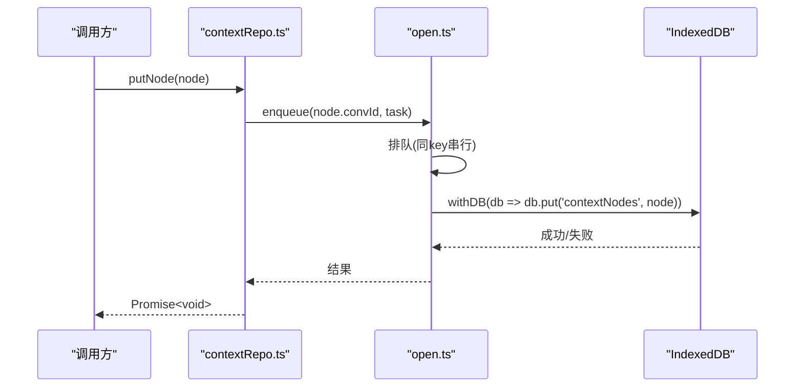
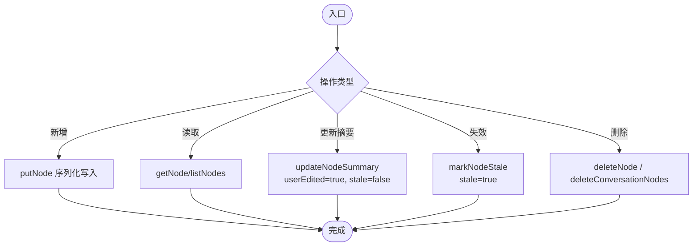
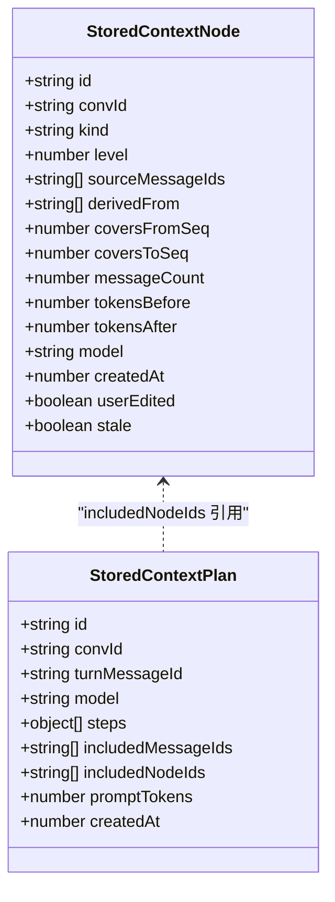
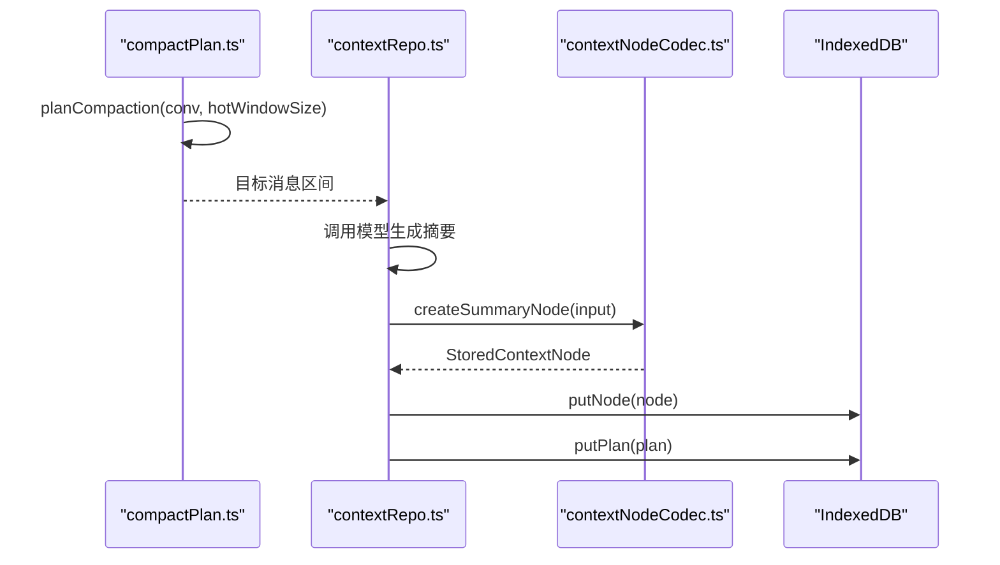
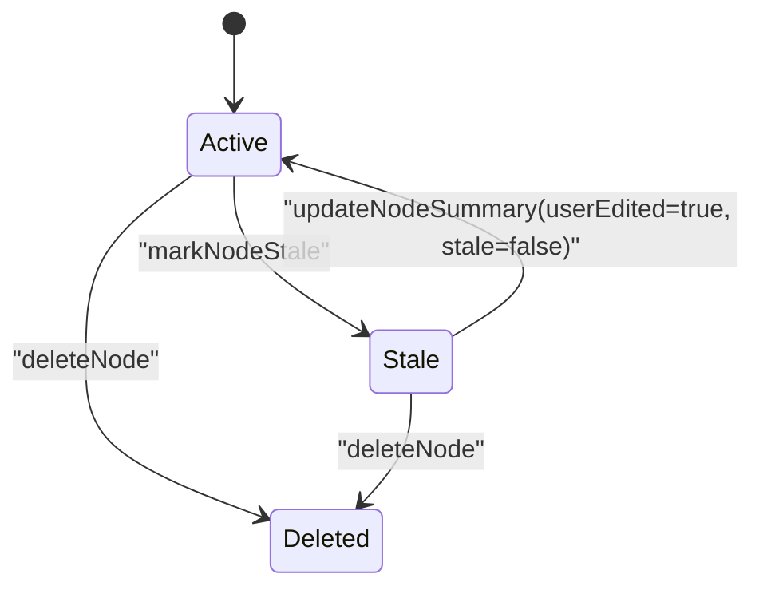
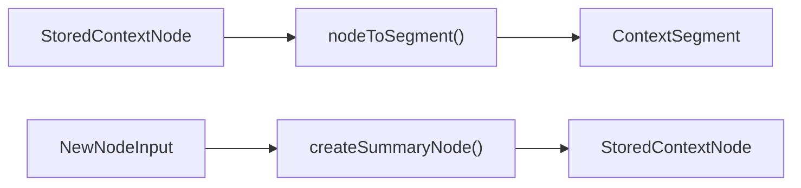
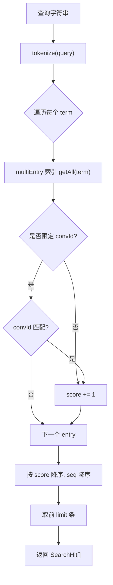
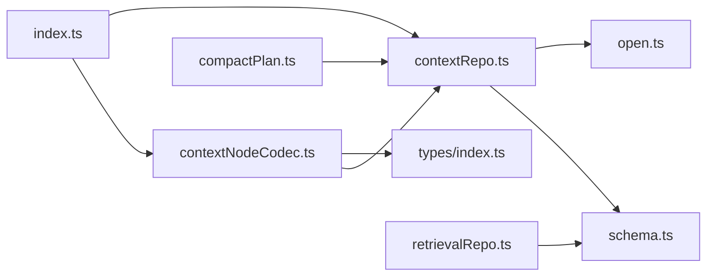

# 上下文仓库

<cite>
**本文引用的文件**
- [src/db/contextRepo.ts](file://src/db/contextRepo.ts)
- [src/db/schema.ts](file://src/db/schema.ts)
- [src/db/open.ts](file://src/db/open.ts)
- [src/db/index.ts](file://src/db/index.ts)
- [src/db/contextNodeCodec.ts](file://src/db/contextNodeCodec.ts)
- [src/types/index.ts](file://src/types/index.ts)
- [src/utils/compactPlan.ts](file://src/utils/compactPlan.ts)
- [src/db/retrievalRepo.ts](file://src/db/retrievalRepo.ts)
</cite>

## 目录
1. [简介](#简介)
2. [项目结构](#项目结构)
3. [核心组件](#核心组件)
4. [架构总览](#架构总览)
5. [详细组件分析](#详细组件分析)
6. [依赖关系分析](#依赖关系分析)
7. [性能考量](#性能考量)
8. [故障排查指南](#故障排查指南)
9. [结论](#结论)
10. [附录](#附录)

## 简介
本仓库聚焦于“上下文节点”的持久化与管理，提供对会话内压缩摘要、笔记与置顶等派生记录的增删改查、失效重建、版本与状态管理，以及与检索索引和消息压缩流程的集成。其设计原则是：原文不可变，所有上下文信息以“节点”形式派生存储；通过 level 与 derivedFrom 构建可无限收敛的上下文树；通过 stale/userEdited 等状态字段实现稳健的重建与用户干预机制。

## 项目结构
围绕上下文仓库的关键文件与职责如下：
- schema.ts：定义 IndexedDB 对象存储与索引（contextNodes、contextPlans、retrieval 等）及类型。
- open.ts：数据库连接、升级、withDB 重试封装、按会话键的写入串行化队列 enqueue。
- contextRepo.ts：上下文节点 CRUD、会话级清理、拼装计划存取。
- contextNodeCodec.ts：StoredContextNode 与运行时 ContextSegment 互转，以及创建摘要节点的工厂。
- index.ts：数据层统一出口，集中导出上下文相关 API。
- types/index.ts：运行期类型（如 ContextSegment），用于上层消费。
- compactPlan.ts：压缩规划器，决定哪些消息区间需要被压缩，并评估可行性。
- retrievalRepo.ts：关键词检索索引的构建与查询，支持跨会话或单会话检索。

图表来源
- [src/db/index.ts:1-97](file://src/db/index.ts#L1-L97)
- [src/db/contextRepo.ts:1-98](file://src/db/contextRepo.ts#L1-L98)
- [src/db/open.ts:1-115](file://src/db/open.ts#L1-L115)
- [src/db/schema.ts:1-283](file://src/db/schema.ts#L1-L283)
- [src/db/contextNodeCodec.ts:1-65](file://src/db/contextNodeCodec.ts#L1-L65)
- [src/db/retrievalRepo.ts:42-128](file://src/db/retrievalRepo.ts#L42-L128)
- [src/utils/compactPlan.ts:1-127](file://src/utils/compactPlan.ts#L1-L127)
- [src/types/index.ts:1-252](file://src/types/index.ts#L1-L252)

章节来源
- [src/db/index.ts:1-97](file://src/db/index.ts#L1-L97)
- [src/db/schema.ts:1-283](file://src/db/schema.ts#L1-L283)

## 核心组件
- 节点 ID 生成：newNodeId 生成全局唯一、可读性好的标识符，避免自增冲突。
- 节点列表：listNodes 按覆盖区间排序返回某会话的全部节点。
- 节点读取：getNode 按 id 获取单个节点。
- 节点写入：putNode 将节点持久化到 contextNodes 表。
- 摘要更新：updateNodeSummary 在事务中更新摘要并标记 userEdited、清除 stale。
- 失效标记：markNodeStale 将节点标记为 stale，触发后续重建而不立即删除旧摘要。
- 节点删除：deleteNode 删除指定节点；deleteConversationNodes 批量清理会话的节点与计划。
- 计划存储：putPlan/listPlans/getLatestPlan 记录每轮上下文的拼装过程，便于缓存与调试。

章节来源
- [src/db/contextRepo.ts:11-98](file://src/db/contextRepo.ts#L11-L98)
- [src/db/index.ts:61-78](file://src/db/index.ts#L61-L78)

## 架构总览
上下文仓库基于 IndexedDB 的对象存储，使用 by_conv 索引快速定位会话范围的数据；写入操作通过 enqueue 按会话键串行化，避免流式输出期间的并发写竞争；读取走 withDB 封装，自动处理连接异常并重试一次。节点与运行期段之间通过 codec 进行双向转换，使现有压缩/渲染逻辑无需大改即可接入新的节点体系。

图表来源
- [src/db/contextRepo.ts:25-27](file://src/db/contextRepo.ts#L25-L27)
- [src/db/open.ts:76-114](file://src/db/open.ts#L76-L114)

## 详细组件分析

### 上下文节点管理与状态
- newNodeId：生成 ctx-前缀的唯一 id，结合时间与随机片段，保证全局唯一且可读。
- listNodes：通过 by_conv 索引获取会话全部节点，并按 coversFromSeq 升序排序，确保时间/顺序语义正确。
- getNode：按主键 id 获取节点，未命中返回 undefined。
- putNode：写入 contextNodes，使用 enqueue 保证同一会话的写入串行化。
- updateNodeSummary：事务内读取节点，更新 summary，置 userEdited=true 并清除 stale，防止自动重压覆盖用户编辑。
- markNodeStale：将节点标记 stale，保留旧摘要直到重建完成，提升鲁棒性。
- deleteNode/deleteConversationNodes：单条删除与会话级批量删除（同时清理 contextPlans）。

图表来源
- [src/db/contextRepo.ts:11-66](file://src/db/contextRepo.ts#L11-L66)

章节来源
- [src/db/contextRepo.ts:11-66](file://src/db/contextRepo.ts#L11-L66)

### 上下文树结构与节点关系
- 节点层次：level=0 表示直接压缩原始消息；level>0 表示对下层节点再压缩，形成层级收敛。
- 派生关系：derivedFrom 指向被压缩的下层节点 ids，从而构建“上下文树”。
- 覆盖区间：coversFromSeq/coversToSeq 描述节点覆盖的消息序列范围，用于排序与合并。
- 原文保护：原文消息永不删除，节点只是派生视图，允许无限次重建与回溯。

图表来源
- [src/db/schema.ts:115-166](file://src/db/schema.ts#L115-L166)

章节来源
- [src/db/schema.ts:115-166](file://src/db/schema.ts#L115-L166)

### 摘要生成与计划存储
- 摘要生成：由上层压缩规划器（compactPlan.ts）决定待压缩消息区间，调用模型后产出摘要文本，再通过 createSummaryNode 构造节点并持久化。
- 计划存储：每轮拼装记录（StoredContextPlan）包含步骤、包含的消息/节点、promptTokens 等，便于调试与复用前缀，getLatestPlan 取最近一轮以稳定缓存。

图表来源
- [src/utils/compactPlan.ts:45-71](file://src/utils/compactPlan.ts#L45-L71)
- [src/db/contextNodeCodec.ts:45-64](file://src/db/contextNodeCodec.ts#L45-L64)
- [src/db/contextRepo.ts:85-98](file://src/db/contextRepo.ts#L85-L98)

章节来源
- [src/utils/compactPlan.ts:45-71](file://src/utils/compactPlan.ts#L45-L71)
- [src/db/contextNodeCodec.ts:45-64](file://src/db/contextNodeCodec.ts#L45-L64)
- [src/db/contextRepo.ts:85-98](file://src/db/contextRepo.ts#L85-L98)

### 版本控制与状态管理
- 版本控制：StoredMessageVersion 支持多模型对比的版本列表；activeVersionIndex 指示当前展示版本。
- 节点状态：
  - userEdited：用户手动修改摘要后，不再被自动重压，尊重用户意图。
  - stale：标记需要重建，但不立即删除，保证过渡期可用性。
- 会话清理：deleteConversationNodes 同时清理 contextNodes 与 contextPlans，保持数据一致性。

图表来源
- [src/db/schema.ts:124-147](file://src/db/schema.ts#L124-L147)
- [src/db/contextRepo.ts:29-66](file://src/db/contextRepo.ts#L29-L66)

章节来源
- [src/db/schema.ts:124-147](file://src/db/schema.ts#L124-L147)
- [src/db/contextRepo.ts:29-66](file://src/db/contextRepo.ts#L29-L66)

### 节点序列化/反序列化与数据转换
- nodeToSegment：将 StoredContextNode 映射为 ContextSegment，供现有渲染与压缩逻辑消费。
- nodesToSegments：过滤出 level=0、kind=summary、非 stale 的节点作为 segment 暴露给 UI。
- createSummaryNode：从输入参数构造标准节点，填充元数据与统计信息。

图表来源
- [src/db/contextNodeCodec.ts:12-32](file://src/db/contextNodeCodec.ts#L12-L32)
- [src/db/contextNodeCodec.ts:45-64](file://src/db/contextNodeCodec.ts#L45-L64)
- [src/types/index.ts:9-27](file://src/types/index.ts#L9-L27)

章节来源
- [src/db/contextNodeCodec.ts:12-32](file://src/db/contextNodeCodec.ts#L12-L32)
- [src/db/contextNodeCodec.ts:45-64](file://src/db/contextNodeCodec.ts#L45-L64)
- [src/types/index.ts:9-27](file://src/types/index.ts#L9-L27)

### 上下文检索与查询优化策略
- 索引构建：indexMessage 对消息正文与附件名分词后写入 retrieval 表，terms 使用 multiEntry 索引。
- 检索算法：searchMessages 将查询分词，遍历 terms 索引累加命中分数，按 score 降序、seq 降序取 top N。
- 会话限定：可选传入 convId 限制搜索范围，提高精度与性能。
- 清理策略：removeFromIndex/removeConversationFromIndex 支持按消息或会话清理索引。

图表来源
- [src/db/retrievalRepo.ts:42-128](file://src/db/retrievalRepo.ts#L42-L128)

章节来源
- [src/db/retrievalRepo.ts:42-128](file://src/db/retrievalRepo.ts#L42-L128)

## 依赖关系分析
- contextRepo.ts 依赖 open.ts 的 withDB/enqueue 进行数据库访问与写入串行化。
- contextRepo.ts 依赖 schema.ts 的类型定义（StoredContextNode/StoredContextPlan）。
- contextNodeCodec.ts 依赖 types/index.ts 的 ContextSegment 与 contextRepo.ts 的 newNodeId。
- index.ts 作为统一出口，聚合各 repo 的导出，降低上层耦合。
- compactPlan.ts 与 contextRepo.ts 协作：前者决定压缩区间，后者负责落盘与状态管理。
- retrievalRepo.ts 独立维护检索索引，与上下文节点解耦但共享 IndexedDB。

图表来源
- [src/db/contextRepo.ts:1-98](file://src/db/contextRepo.ts#L1-L98)
- [src/db/open.ts:1-115](file://src/db/open.ts#L1-L115)
- [src/db/schema.ts:1-283](file://src/db/schema.ts#L1-L283)
- [src/db/contextNodeCodec.ts:1-65](file://src/db/contextNodeCodec.ts#L1-L65)
- [src/db/index.ts:1-97](file://src/db/index.ts#L1-L97)
- [src/utils/compactPlan.ts:1-127](file://src/utils/compactPlan.ts#L1-L127)
- [src/db/retrievalRepo.ts:42-128](file://src/db/retrievalRepo.ts#L42-L128)

章节来源
- [src/db/contextRepo.ts:1-98](file://src/db/contextRepo.ts#L1-L98)
- [src/db/open.ts:1-115](file://src/db/open.ts#L1-L115)
- [src/db/schema.ts:1-283](file://src/db/schema.ts#L1-L283)
- [src/db/contextNodeCodec.ts:1-65](file://src/db/contextNodeCodec.ts#L1-L65)
- [src/db/index.ts:1-97](file://src/db/index.ts#L1-L97)
- [src/utils/compactPlan.ts:1-127](file://src/utils/compactPlan.ts#L1-L127)
- [src/db/retrievalRepo.ts:42-128](file://src/db/retrievalRepo.ts#L42-L128)

## 性能考量
- 写入串行化：enqueue 按会话键串行化写入，避免流式输出期间多次更新互相穿插，减少锁竞争与不一致风险。
- 索引优化：by_conv 索引加速会话级查询；retrieval 的 terms 使用 multiEntry 索引提升关键词检索效率。
- 排序策略：listNodes 按 coversFromSeq 排序，保证时间/顺序一致性；searchMessages 按 score 与 seq 排序，优先返回高相关且较新的结果。
- 失败重试：withDB 捕获异常并尝试重开连接，增强稳定性。
- 估算与阈值：compactPlan 使用 token 估算与阈值判断，避免不必要的压缩调用，保护 prompt 缓存命中率。

[本节为通用性能讨论，不直接分析具体代码行]

## 故障排查指南
- 写入冲突或丢失：检查是否在同一会话频繁并发写入；确认 enqueue 已生效，必要时增加日志观察队列行为。
- 节点未更新：updateNodeSummary 会设置 userEdited=true 并清除 stale，若仍被自动重压，检查是否有其他流程再次标记 stale。
- 检索无结果：确认 indexMessage 是否执行成功；检查 terms 索引是否存在；必要时调用 removeConversationFromIndex 重建索引。
- 连接异常：withDB 会自动重试一次；若持续失败，检查 IndexedDB 权限与存储空间。

章节来源
- [src/db/open.ts:76-114](file://src/db/open.ts#L76-L114)
- [src/db/contextRepo.ts:29-66](file://src/db/contextRepo.ts#L29-L66)
- [src/db/retrievalRepo.ts:54-77](file://src/db/retrievalRepo.ts#L54-L77)

## 结论
上下文仓库通过“原文不可变 + 派生节点”的设计，实现了安全、可扩展的上下文管理。借助 level/derivedFrom 构建的上下文树支持无限压缩与回溯；通过 stale/userEdited 的状态机保障重建与用户编辑的稳健性；配合检索索引与压缩规划器，形成完整的上下文生命周期管理闭环。未来可在检索中引入 embedding 字段以支持语义检索，并在服务端同步时利用 syncedAt 字段实现增量同步。

[本节为总结性内容，不直接分析具体代码行]

## 附录
- 关键 API 路径参考：
  - 节点管理：newNodeId/listNodes/getNode/putNode/updateNodeSummary/markNodeStale/deleteNode
  - 计划存储：putPlan/listPlans/getLatestPlan
  - 节点转换：nodeToSegment/nodesToSegments/createSummaryNode
  - 检索：indexMessage/searchMessages/removeFromIndex/removeConversationFromIndex

章节来源
- [src/db/contextRepo.ts:11-98](file://src/db/contextRepo.ts#L11-L98)
- [src/db/contextNodeCodec.ts:12-64](file://src/db/contextNodeCodec.ts#L12-L64)
- [src/db/retrievalRepo.ts:54-128](file://src/db/retrievalRepo.ts#L54-L128)