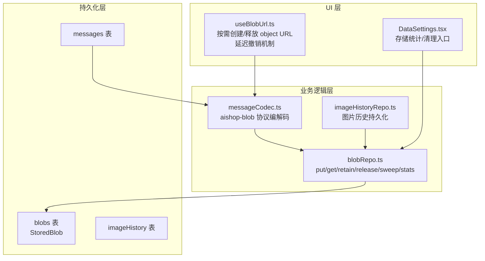
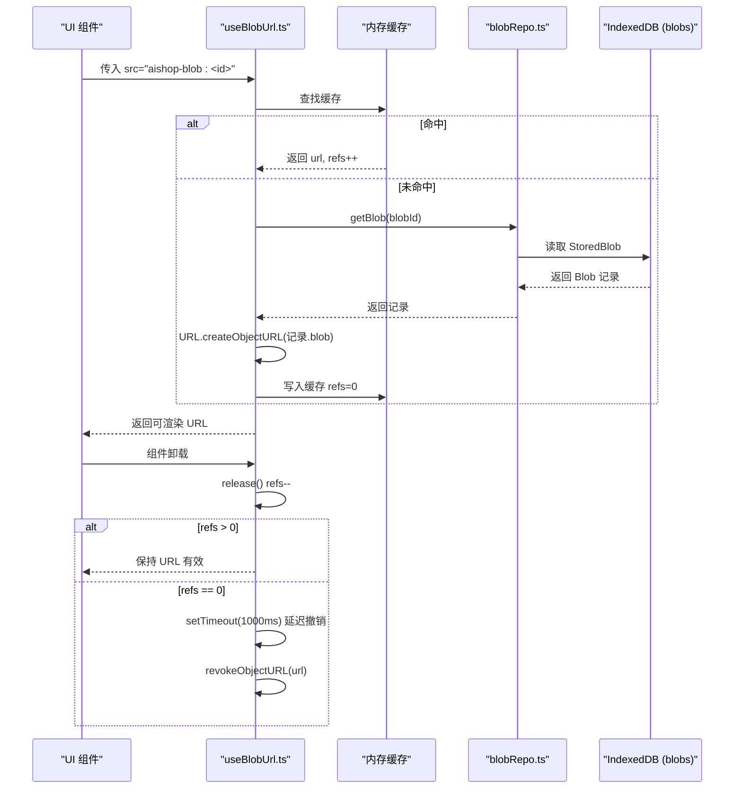
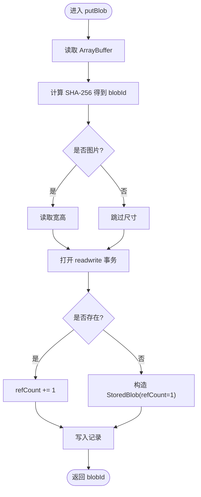
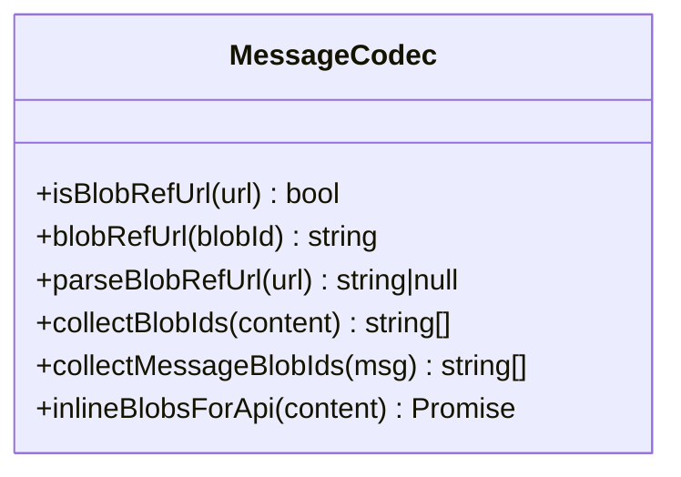
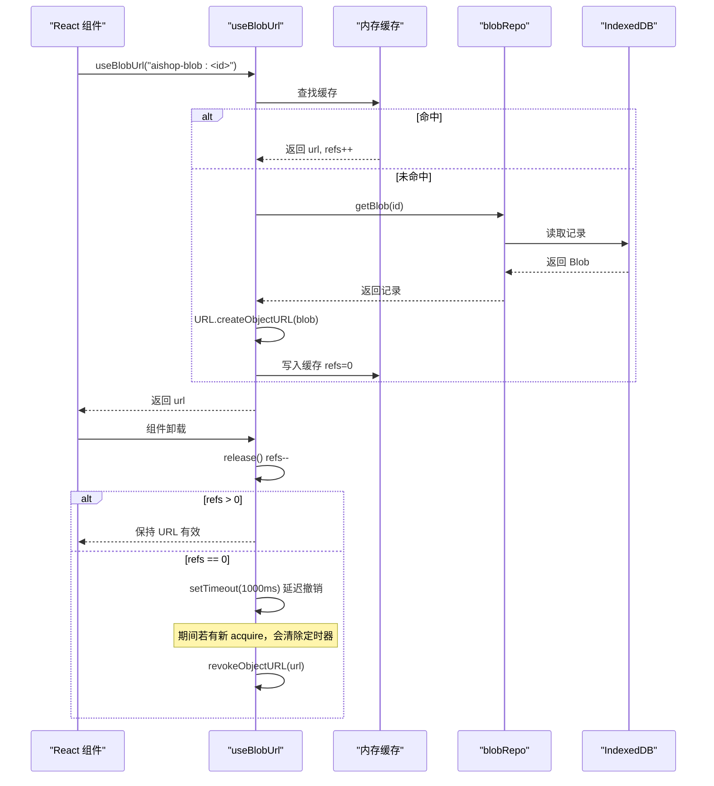
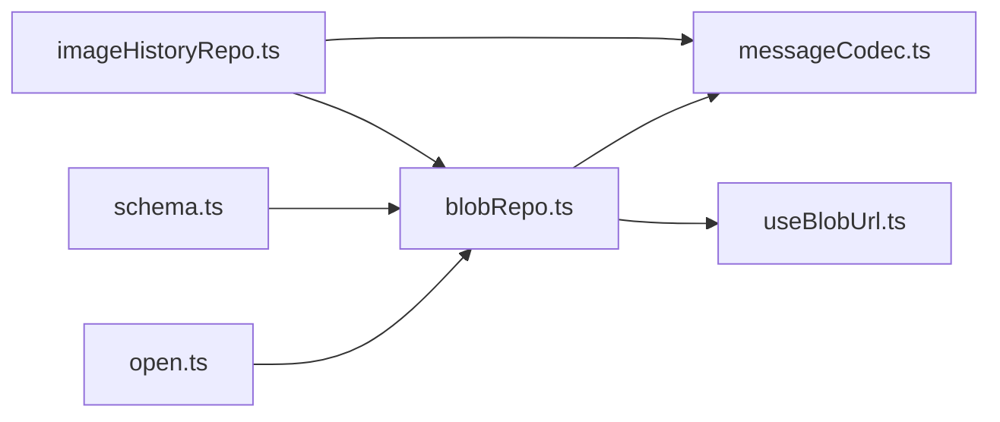

# 二进制仓库

<cite>
**本文引用的文件**
- [blobRepo.ts](file://src/db/blobRepo.ts)
- [messageCodec.ts](file://src/db/messageCodec.ts)
- [schema.ts](file://src/db/schema.ts)
- [open.ts](file://src/db/open.ts)
- [useBlobUrl.ts](file://src/hooks/useBlobUrl.ts)
- [imageHistoryRepo.ts](file://src/db/imageHistoryRepo.ts)
- [DataSettings.tsx](file://src/components/settings/DataSettings.tsx)
</cite>

## 更新摘要
**变更内容**
- 增强了 useBlobUrl hook 的延迟撤销机制（1秒超时），防止并发获取期间的 URL 过早清理
- 改进了引用计数逻辑，使用 Math.max(0, entry.refs - 1) 处理释放操作在获取完成前发生的边界情况
- 优化了对象 URL 的生命周期管理，避免竞态条件导致的图片加载失败

## 目录
1. [简介](#简介)
2. [项目结构](#项目结构)
3. [核心组件](#核心组件)
4. [架构总览](#架构总览)
5. [详细组件分析](#详细组件分析)
6. [依赖关系分析](#依赖关系分析)
7. [性能考量](#性能考量)
8. [故障排查指南](#故障排查指南)
9. [结论](#结论)
10. [附录](#附录)

## 简介
本仓库实现了一个基于内容寻址与引用计数的二进制数据（Blob）存储子系统，用于在浏览器环境中高效、安全地管理图片等二进制资源。其核心目标包括：
- 提供 putBlob、putBlobFromDataUrl、getBlob、getBlobs、retainBlobs、releaseBlobs、sweepOrphanBlobs、getBlobStats 等完整生命周期操作。
- 通过自定义协议 aishop-blob:<id> 生成和解析 Blob 引用 URL，解耦持久化与渲染。
- 实现基于引用计数的垃圾回收策略，避免关键路径上的写放大。
- 提供存储空间统计与清理入口，便于用户感知与干预。
- 说明大文件分块与流式处理的现状与扩展点。
- 明确访问控制与安全边界，确保本地存储的隔离性与安全性。

**最新更新**：增强了 useBlobUrl hook 的并发安全性和对象 URL 生命周期管理，通过延迟撤销机制和健壮的引用计数逻辑，有效解决了竞态条件问题。

## 项目结构
二进制仓库位于 src/db 目录下，围绕 IndexedDB 构建，并通过 hooks 层为 UI 提供按需加载能力。主要文件职责如下：
- blobRepo.ts：Blob 写入、读取、引用计数、清理与统计的核心实现。
- messageCodec.ts：消息与持久化之间的编解码，负责将 data URL 转为 Blob 引用并还原。
- schema.ts：IndexedDB 表结构与类型定义，包含 blobs 表及 StoredBlob 字段。
- open.ts：数据库连接、事务封装、按 key 串行化的写队列。
- useBlobUrl.ts：UI 层将 aishop-blob:<id> 解析为可渲染的 object URL，并做缓存与释放。
- imageHistoryRepo.ts：图片历史记录的持久化，复用 Blob 机制。
- DataSettings.tsx：设置页中展示存储占用、触发清理等操作。

**图表来源**
- [blobRepo.ts:1-168](file://src/db/blobRepo.ts#L1-L168)
- [messageCodec.ts:15-79](file://src/db/messageCodec.ts#L15-L79)
- [schema.ts:182-241](file://src/db/schema.ts#L182-L241)
- [useBlobUrl.ts:1-148](file://src/hooks/useBlobUrl.ts#L1-L148)
- [imageHistoryRepo.ts:1-150](file://src/db/imageHistoryRepo.ts#L1-L150)
- [DataSettings.tsx:31-41](file://src/components/settings/DataSettings.tsx#L31-L41)

**章节来源**
- [blobRepo.ts:1-168](file://src/db/blobRepo.ts#L1-L168)
- [schema.ts:182-241](file://src/db/schema.ts#L182-L241)
- [open.ts:1-139](file://src/db/open.ts#L1-L139)

## 核心组件
- 内容寻址存储：以字节内容的 SHA-256 作为 blobId，相同内容只存一份，天然去重。
- 引用计数：每条记录维护 refCount，新增引用 +1，释放 -1；归零后由后台扫描清理。
- 写操作串行化：所有涉及 refCount 的读写通过统一队列串行，避免竞态。
- 懒加载渲染：UI 侧仅在渲染时创建 object URL，卸载即释放，避免内存泄漏。
- **增强的并发安全**：通过延迟撤销机制（1秒超时）和健壮的引用计数逻辑，防止并发获取时的 URL 过早清理。
- 统计与清理：提供 getBlobStats 统计总量与孤儿空间，sweepOrphanBlobs 批量清理。

**章节来源**
- [blobRepo.ts:14-18](file://src/db/blobRepo.ts#L14-L18)
- [blobRepo.ts:40-67](file://src/db/blobRepo.ts#L40-L67)
- [blobRepo.ts:89-124](file://src/db/blobRepo.ts#L89-L124)
- [blobRepo.ts:131-168](file://src/db/blobRepo.ts#L131-L168)
- [useBlobUrl.ts:22-89](file://src/hooks/useBlobUrl.ts#L22-L89)

## 架构总览
下图展示了从 UI 到持久化的调用链路与数据流向，重点体现 Blob 引用 URL 的生成、解析与对象 URL 的按需创建与释放，以及最新的延迟撤销机制。

**图表来源**
- [useBlobUrl.ts:23-89](file://src/hooks/useBlobUrl.ts#L23-L89)
- [blobRepo.ts:76-78](file://src/db/blobRepo.ts#L76-L78)
- [schema.ts:182-195](file://src/db/schema.ts#L182-L195)

## 详细组件分析

### Blob 仓库（blobRepo.ts）
- putBlob(blob)：计算 SHA-256 得到 blobId，尝试读取图片尺寸，存入或递增 refCount。
- putBlobFromDataUrl(dataUrl)：将 data URL 转为 Blob 再入库。
- getBlob(blobId)/getBlobs(ids)：单条或多条读取。
- retainBlobs(ids)/releaseBlobs(ids)：批量调整引用计数，考虑重复项次数。
- sweepOrphanBlobs()：遍历删除 refCount<=0 的记录，返回释放字节数。
- getBlobStats()：统计总数、总字节、孤儿字节。

**图表来源**
- [blobRepo.ts:40-67](file://src/db/blobRepo.ts#L40-L67)
- [blobRepo.ts:21-33](file://src/db/blobRepo.ts#L21-L33)

**章节来源**
- [blobRepo.ts:40-74](file://src/db/blobRepo.ts#L40-L74)
- [blobRepo.ts:76-87](file://src/db/blobRepo.ts#L76-L87)
- [blobRepo.ts:89-124](file://src/db/blobRepo.ts#L89-L124)
- [blobRepo.ts:131-168](file://src/db/blobRepo.ts#L131-L168)

### 引用 URL 协议（messageCodec.ts）
- 生成：blobRefUrl(blobId) -> "aishop-blob:" + blobId
- 解析：parseBlobRefUrl(url) -> 提取 id 或 null
- 收集：collectMessageBlobIds(msg) 汇总消息及其版本中的 blobId
- 发送前展开：inlineBlobsForApi(content) 将 aishop-blob 转回 data URL 供模型消费

**图表来源**
- [messageCodec.ts:15-27](file://src/db/messageCodec.ts#L15-L27)
- [messageCodec.ts:29-39](file://src/db/messageCodec.ts#L29-L39)
- [messageCodec.ts:57-79](file://src/db/messageCodec.ts#L57-L79)

**章节来源**
- [messageCodec.ts:15-79](file://src/db/messageCodec.ts#L15-L79)
- [messageCodec.ts:81-112](file://src/db/messageCodec.ts#L81-L112)

### UI 层对象 URL 管理（useBlobUrl.ts）
- 并发合并：同一 blobId 的多次请求合并为一次查库。
- 缓存共享：多个组件共享同一 object URL，内部 refs 计数决定何时释放。
- **延迟撤销机制**：引用归零后延迟 1 秒撤销，防止新 acquire 拿到已被撤销的 URL。
- **健壮的引用计数**：使用 Math.max(0, entry.refs - 1) 防止负数计数。
- 生命周期：组件挂载 acquire，卸载 release，避免内存泄漏。

**更新**：新增了延迟撤销机制和引用计数保护，有效解决并发场景下的竞态条件问题。

**图表来源**
- [useBlobUrl.ts:23-89](file://src/hooks/useBlobUrl.ts#L23-L89)
- [blobRepo.ts:76-78](file://src/db/blobRepo.ts#L76-L78)

**章节来源**
- [useBlobUrl.ts:1-148](file://src/hooks/useBlobUrl.ts#L1-L148)

### 图片历史（imageHistoryRepo.ts）
- 区分远程 http 链接与本地 data URL，仅后者落库为 Blob。
- 读回时将本地 blobId 转换为 aishop-blob 协议，UI 统一处理。

**章节来源**
- [imageHistoryRepo.ts:1-150](file://src/db/imageHistoryRepo.ts#L1-L150)

### 存储统计与清理（DataSettings.tsx）
- 获取整体存储估计与 Blob 统计，展示用量与孤儿空间。
- 提供手动触发 sweepOrphanBlobs 的入口。

**章节来源**
- [DataSettings.tsx:31-41](file://src/components/settings/DataSettings.tsx#L31-L41)
- [blobRepo.ts:151-168](file://src/db/blobRepo.ts#L151-L168)

## 依赖关系分析
- blobRepo.ts 依赖 open.ts 的 withDB/enqueue 进行事务与串行化。
- messageCodec.ts 依赖 blobRepo.ts 进行 data URL 转 Blob 与读取。
- useBlobUrl.ts 依赖 blobRepo.ts 读取记录并创建 object URL。
- schema.ts 定义 blobs 表结构与 StoredBlob 字段。
- imageHistoryRepo.ts 复用 blobRepo.ts 与 messageCodec.ts 的协议。

**图表来源**
- [open.ts:76-139](file://src/db/open.ts#L76-L139)
- [blobRepo.ts:1-12](file://src/db/blobRepo.ts#L1-L12)
- [messageCodec.ts:10-13](file://src/db/messageCodec.ts#L10-L13)
- [useBlobUrl.ts:10-12](file://src/hooks/useBlobUrl.ts#L10-L12)
- [imageHistoryRepo.ts:11-15](file://src/db/imageHistoryRepo.ts#L11-L15)

**章节来源**
- [open.ts:76-139](file://src/db/open.ts#L76-L139)
- [blobRepo.ts:1-12](file://src/db/blobRepo.ts#L1-L12)
- [messageCodec.ts:10-13](file://src/db/messageCodec.ts#L10-L13)
- [useBlobUrl.ts:10-12](file://src/hooks/useBlobUrl.ts#L10-L12)
- [imageHistoryRepo.ts:11-15](file://src/db/imageHistoryRepo.ts#L11-L15)

## 性能考量
- 内容去重：SHA-256 保证相同内容不重复存储，降低磁盘占用。
- 串行写队列：所有涉及 refCount 的写操作通过 enqueue 串行，避免竞态与锁竞争。
- 懒加载渲染：object URL 按需创建与释放，减少内存占用，尤其在长会话场景下显著。
- 批量读取：getBlobs 使用单次事务内并行查询，减少事务开销。
- 统计与清理：sweepOrphanBlobs 适合在空闲时段执行，避免阻塞关键路径。
- **并发优化**：延迟撤销机制减少了不必要的 URL 重建，提升并发场景下的性能表现。

## 故障排查指南
- 连接异常重试：withDB 捕获未知错误后自动关闭并重试一次，适用于 Safari 内存压力导致的 UnknownError。
- 升级阻塞：open.ts 对 blocked/blocking/terminated 事件进行处理，提示并等待其他标签页释放旧版本连接。
- **对象 URL 泄漏防护**：延迟撤销机制确保组件卸载与重新挂载间隙的 URL 有效性，避免图片加载失败。
- **引用计数异常**：Math.max(0, entry.refs - 1) 防止负数计数导致的内存泄漏。
- 孤儿空间累积：定期调用 sweepOrphanBlobs 或在设置页手动触发，释放无引用记录。

**章节来源**
- [open.ts:76-88](file://src/db/open.ts#L76-L88)
- [open.ts:46-57](file://src/db/open.ts#L46-L57)
- [useBlobUrl.ts:68-89](file://src/hooks/useBlobUrl.ts#L68-L89)
- [blobRepo.ts:131-147](file://src/db/blobRepo.ts#L131-L147)

## 结论
该二进制仓库通过内容寻址与引用计数实现了高效、安全的本地 Blob 管理。结合 UI 层的懒加载与缓存机制，有效控制了内存与存储占用。**最新增强**的延迟撤销机制和健壮的引用计数逻辑进一步提升了并发安全性，避免了竞态条件导致的图片加载失败问题。提供统计与清理能力，便于用户感知与维护。对于大文件与流式处理，当前实现以整块 Blob 为主，可在未来引入分块上传与流式写入以提升体验。

## 附录

### API 参考（函数与用途）
- putBlob(blob): 将 Blob 存入仓库，返回 blobId。
- putBlobFromDataUrl(dataUrl): 将 data URL 转为 Blob 后存入。
- getBlob(blobId): 读取指定 blob 记录。
- getBlobs(blobIds[]): 批量读取多条记录。
- retainBlobs(blobIds[]): 增加引用计数。
- releaseBlobs(blobIds[]): 减少引用计数。
- sweepOrphanBlobs(): 清理无引用记录，返回释放字节数。
- getBlobStats(): 返回 count、bytes、orphanBytes。

**章节来源**
- [blobRepo.ts:40-74](file://src/db/blobRepo.ts#L40-L74)
- [blobRepo.ts:76-87](file://src/db/blobRepo.ts#L76-L87)
- [blobRepo.ts:89-124](file://src/db/blobRepo.ts#L89-L124)
- [blobRepo.ts:131-168](file://src/db/blobRepo.ts#L131-L168)

### 数据模型（StoredBlob）
- blobId: 内容哈希标识
- blob: 原始二进制数据
- mime: MIME 类型
- bytes: 字节大小
- width/height: 图片尺寸（可选）
- refCount: 引用计数
- createdAt: 创建时间戳

**章节来源**
- [schema.ts:182-195](file://src/db/schema.ts#L182-L195)

### 大文件分块与流式处理
- 现状：当前实现以整块 Blob 为单位进行存储与传输，未实现分块上传或流式写入。
- 建议：
  - 前端分块：将大文件切分为固定大小的块，逐块计算哈希并写入，最后合并元信息。
  - 流式写入：利用 IndexedDB 的事务特性，逐步写入块并更新进度状态。
  - 断点续传：记录已上传块的索引与哈希，支持中断后恢复。
  - 内存优化：避免一次性加载整个文件到内存，采用流式 Reader 与缓冲池。

### 访问权限控制与安全考虑
- 本地隔离：IndexedDB 按站点隔离，不同域名无法互相访问。
- 协议限制：aishop-blob 为自定义协议，仅在本应用内解析，外部不可直接访问。
- 最小暴露：UI 层仅在渲染时创建 object URL，并在卸载时释放，避免泄露。
- 输入校验：对 data URL 与远程链接进行基本判断，防止恶意注入。
- 备份与迁移：导出/导入功能需确保数据完整性与隐私保护。

### 并发安全增强详解
**延迟撤销机制**：当引用计数归零时，不立即撤销 object URL，而是延迟 1 秒执行。这为并发场景提供了缓冲时间，防止以下竞态条件：
- 组件卸载后立即重新挂载
- 多个组件同时获取同一 blob 的 URL
- 网络请求期间的 URL 失效

**引用计数保护**：使用 Math.max(0, entry.refs - 1) 确保引用计数不会变为负数，防止内存泄漏和状态不一致。

**定时器管理**：通过 revokeTimers Map 跟踪待撤销的 URL，新 acquire 时会清除相关定时器，确保 URL 的有效性。

**章节来源**
- [useBlobUrl.ts:22-89](file://src/hooks/useBlobUrl.ts#L22-L89)