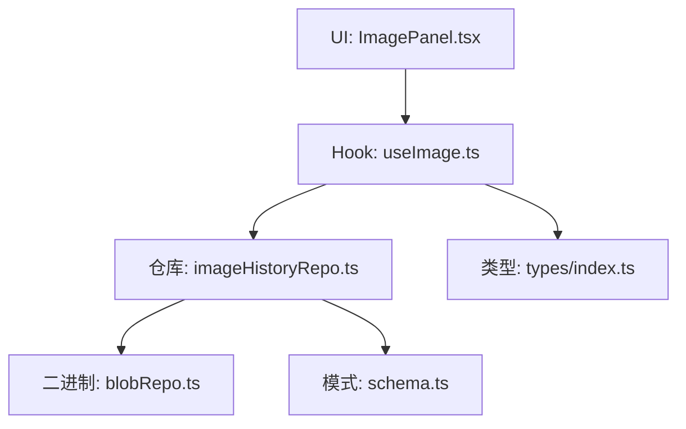
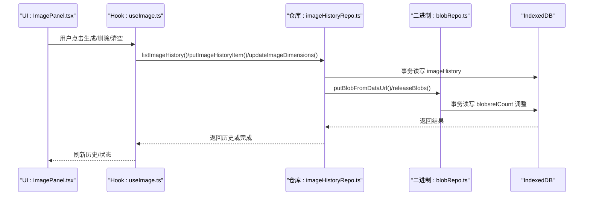
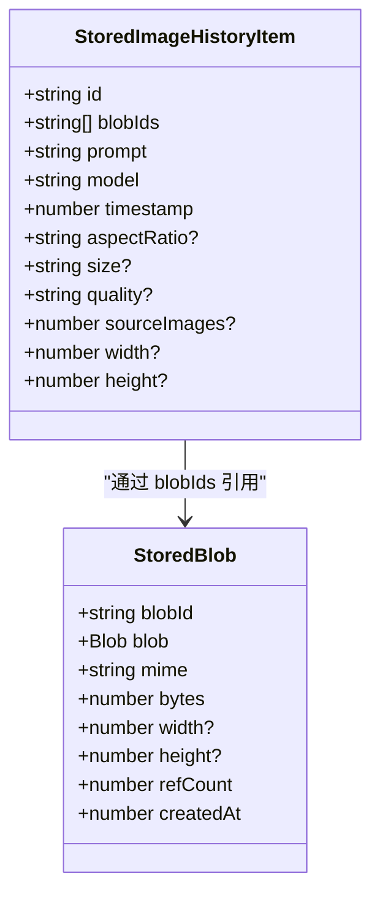
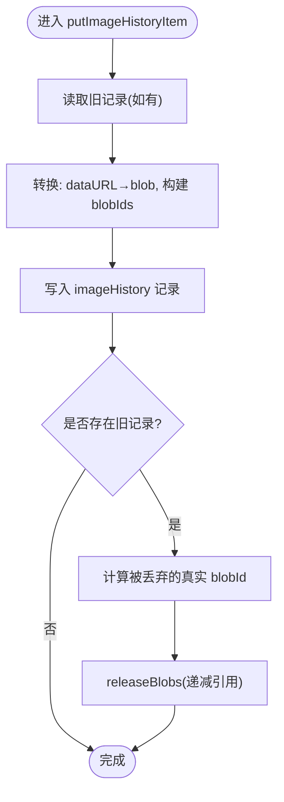
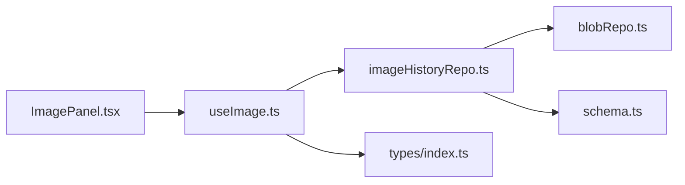

# 图像历史仓库

<cite>
**本文引用的文件**
- [imageHistoryRepo.ts](file://src/db/imageHistoryRepo.ts)
- [blobRepo.ts](file://src/db/blobRepo.ts)
- [schema.ts](file://src/db/schema.ts)
- [useImage.ts](file://src/hooks/useImage.ts)
- [index.ts（类型定义）](file://src/types/index.ts)
- [ImagePanel.tsx](file://src/components/image/ImagePanel.tsx)
</cite>

## 目录
1. [简介](#简介)
2. [项目结构](#项目结构)
3. [核心组件](#核心组件)
4. [架构总览](#架构总览)
5. [详细组件分析](#详细组件分析)
6. [依赖关系分析](#依赖关系分析)
7. [性能与存储优化](#性能与存储优化)
8. [故障排查指南](#故障排查指南)
9. [结论](#结论)
10. [附录：API 与数据模型](#附录api-与数据模型)

## 简介
本仓库实现了“图像生成历史”的本地持久化与管理，覆盖以下能力：
- 列表查询：按时间升序读取全部历史。
- 写入与更新：新增/覆盖历史项、仅更新图片尺寸（用于瀑布流占位）。
- 删除与清空：单条删除与批量清空，并同步释放底层二进制引用计数。
- 元数据管理：记录提示词、模型、宽高比、尺寸、质量、来源图数量等。
- 引用管理与空间优化：将 base64 转为内容寻址的 blob 存储，http 链接原样保留；通过引用计数实现去重与回收。
- 分页与筛选：当前实现为全量按时间排序读取；可扩展索引以支持分页与筛选。
- 批量操作与清理策略：批量删除时统一释放引用；提供孤儿 blob 扫描清理接口。

## 项目结构
围绕图像历史的代码主要分布在数据库层、Hook 层与 UI 层：
- 数据库层：imageHistoryRepo.ts 负责历史记录的读写与队列串行化；blobRepo.ts 负责二进制内容与引用计数；schema.ts 定义 IndexedDB 表结构与索引。
- Hook 层：useImage.ts 负责加载历史、回填缺失尺寸、触发生成并将结果落库。
- UI 层：ImagePanel.tsx 消费 useImage 暴露的历史与操作，并提供下载等交互。

图表来源
- [imageHistoryRepo.ts:1-144](file://src/db/imageHistoryRepo.ts#L1-L144)
- [blobRepo.ts:1-168](file://src/db/blobRepo.ts#L1-L168)
- [schema.ts:199-270](file://src/db/schema.ts#L199-L270)
- [useImage.ts:140-194](file://src/hooks/useImage.ts#L140-L194)
- [index.ts:177-203](file://src/types/index.ts#L177-L203)

章节来源
- [imageHistoryRepo.ts:1-144](file://src/db/imageHistoryRepo.ts#L1-L144)
- [blobRepo.ts:1-168](file://src/db/blobRepo.ts#L1-L168)
- [schema.ts:199-270](file://src/db/schema.ts#L199-L270)
- [useImage.ts:140-194](file://src/hooks/useImage.ts#L140-L194)
- [index.ts:177-203](file://src/types/index.ts#L177-L203)

## 核心组件
- 历史记录仓库（imageHistoryRepo.ts）
  - listImageHistory：按 by_timestamp 索引升序返回全部历史。
  - putImageHistoryItem：写入或覆盖历史项；base64 转 blob；覆盖写时释放不再引用的旧 blob。
  - updateImageDimensions：仅更新 width/height，不重写图片。
  - deleteImageHistoryItem：删除历史项并释放其真实 blob 引用。
  - clearImageHistory：批量删除所有历史项并释放所有真实 blob 引用。
- 二进制仓库（blobRepo.ts）
  - putBlob / putBlobFromDataUrl：内容寻址存储，自动读取图片尺寸，重复内容只存一份并递增 refCount。
  - retainBlobs / releaseBlobs：按出现次数调整引用计数。
  - sweepOrphanBlobs：清理 refCount<=0 的孤儿 blob，统计释放字节数。
  - getBlobStats：统计总条目、总字节与孤儿字节。
- 数据模式（schema.ts）
  - StoredImageHistoryItem：id、blobIds、prompt、model、timestamp、aspectRatio、size、quality、sourceImages、width、height。
  - imageHistory store：主键 id，索引 by_timestamp。
  - blobs store：主键 blobId，字段包含 blob、mime、bytes、width、height、refCount、createdAt。

章节来源
- [imageHistoryRepo.ts:84-144](file://src/db/imageHistoryRepo.ts#L84-L144)
- [blobRepo.ts:35-168](file://src/db/blobRepo.ts#L35-L168)
- [schema.ts:184-270](file://src/db/schema.ts#L184-L270)

## 架构总览
下图展示了从 UI 到数据库再到二进制的完整调用链，以及引用计数的协作方式。

图表来源
- [useImage.ts:275-335](file://src/hooks/useImage.ts#L275-L335)
- [imageHistoryRepo.ts:84-144](file://src/db/imageHistoryRepo.ts#L84-L144)
- [blobRepo.ts:35-124](file://src/db/blobRepo.ts#L35-L124)

## 详细组件分析

### 数据结构与元数据
- 历史项（ImageHistoryItem / StoredImageHistoryItem）
  - 标识与时间：id、timestamp
  - 生成参数：prompt、model、aspectRatio、size、quality、sourceImages
  - 显示优化：width、height（用于瀑布流占位）
  - 图片引用：urls（对外）映射为 blobIds（对内），其中 http 链接原样保留，base64 转为 blob 的 sha-256 作为引用
- 二进制（StoredBlob）
  - 内容寻址：blobId = sha256(字节)
  - 元信息：mime、bytes、width、height、refCount、createdAt

图表来源
- [schema.ts:184-211](file://src/db/schema.ts#L184-L211)

章节来源
- [schema.ts:184-211](file://src/db/schema.ts#L184-L211)
- [index.ts:177-203](file://src/types/index.ts#L177-L203)

### 写入与覆盖：putImageHistoryItem
- 流程要点
  - 将 urls 中的 data URL 转为 blob 并记录 blobId；http 链接直接保留。
  - 若存在同 id 旧记录，计算被丢弃的真实 blobId 并调用 releaseBlobs 递减引用。
  - 使用队列串行化写操作，避免与 blob 引用计数并发冲突。
- 复杂度
  - 写一次 imageHistory 记录；可能触发若干次 blobs 的 refCount 调整。
- 错误处理
  - 异常由上层捕获并记录日志；队列保证顺序执行。

图表来源
- [imageHistoryRepo.ts:90-103](file://src/db/imageHistoryRepo.ts#L90-L103)
- [blobRepo.ts:89-124](file://src/db/blobRepo.ts#L89-L124)

章节来源
- [imageHistoryRepo.ts:90-103](file://src/db/imageHistoryRepo.ts#L90-L103)
- [blobRepo.ts:89-124](file://src/db/blobRepo.ts#L89-L124)

### 仅更新尺寸：updateImageDimensions
- 用途：在首次加载或回补阶段，为历史项填充 width/height，避免布局抖动。
- 行为：打开 readwrite 事务，定位记录后仅覆盖 width/height 字段，不触碰图片数据。
- 性能：最小化 IO，仅写两个数字字段。

章节来源
- [imageHistoryRepo.ts:105-119](file://src/db/imageHistoryRepo.ts#L105-L119)

### 删除与清空：deleteImageHistoryItem / clearImageHistory
- 删除单条：
  - 删除 imageHistory 记录。
  - 提取其中的真实 blobId 并 releaseBlobs。
- 批量清空：
  - 遍历全部记录，批量删除。
  - 汇总所有真实 blobId 并一次性释放引用。
- 注意：http 链接不计入引用释放。

章节来源
- [imageHistoryRepo.ts:121-144](file://src/db/imageHistoryRepo.ts#L121-L144)

### 列表查询：listImageHistory
- 通过 by_timestamp 索引获取全部历史，按时间升序返回。
- 读回时将 blobId 转换为 aishop-blob: 引用协议，供 UI 统一解析。

章节来源
- [imageHistoryRepo.ts:84-88](file://src/db/imageHistoryRepo.ts#L84-L88)

### 尺寸回填与缓存：useImage 侧逻辑
- 启动时加载历史；对缺失 width/height 的记录，优先从 blob 中读取已缓存的尺寸，否则解码图片获取尺寸。
- 获取成功后调用 updateImageDimensions 写回，下次无需再算。
- 失败路径忽略错误，不影响整体渲染。

章节来源
- [useImage.ts:152-194](file://src/hooks/useImage.ts#L152-L194)
- [blobRepo.ts:21-33](file://src/db/blobRepo.ts#L21-L33)

### 下载与引用解析：ImagePanel
- 下载时若 url 为 aishop-blob: 引用，则先取 blob 创建临时 object URL，下载完成后释放。
- 文件名基于 prompt 与时间戳生成，避免非法字符。

章节来源
- [ImagePanel.tsx:66-86](file://src/components/image/ImagePanel.tsx#L66-L86)

## 依赖关系分析
- 模块耦合
  - imageHistoryRepo 依赖 blobRepo 进行二进制存储与引用计数。
  - useImage 依赖 imageHistoryRepo 与 blobRepo，同时消费 types 中的模型。
  - ImagePanel 消费 useImage 暴露的状态与方法。
- 外部依赖
  - IndexedDB（通过 idb 封装 withDB/enqueue）。
  - 浏览器 API：createImageBitmap、crypto.subtle.digest、URL.createObjectURL 等。

图表来源
- [ImagePanel.tsx:369-408](file://src/components/image/ImagePanel.tsx#L369-L408)
- [useImage.ts:1-13](file://src/hooks/useImage.ts#L1-L13)
- [imageHistoryRepo.ts:11-15](file://src/db/imageHistoryRepo.ts#L11-L15)
- [blobRepo.ts:1-12](file://src/db/blobRepo.ts#L1-L12)
- [schema.ts:199-270](file://src/db/schema.ts#L199-L270)
- [index.ts:177-203](file://src/types/index.ts#L177-L203)

章节来源
- [ImagePanel.tsx:369-408](file://src/components/image/ImagePanel.tsx#L369-L408)
- [useImage.ts:1-13](file://src/hooks/useImage.ts#L1-L13)
- [imageHistoryRepo.ts:11-15](file://src/db/imageHistoryRepo.ts#L11-L15)
- [blobRepo.ts:1-12](file://src/db/blobRepo.ts#L1-L12)
- [schema.ts:199-270](file://src/db/schema.ts#L199-L270)
- [index.ts:177-203](file://src/types/index.ts#L177-L203)

## 性能与存储优化
- 去重存储：同一内容的图片只存一份，通过 sha-256 作为 key，减少重复占用。
- 引用计数：多处以引用计数共享同一 blob，删除时仅递减，归零后才可被清理。
- 懒回填尺寸：首次加载时按需计算并缓存 width/height，避免重复解码。
- 队列串行：imageHistory 与 blobs 各自独立队列，确保引用计数读改写一致。
- 批量清理：sweepOrphanBlobs 适合在空闲或设置页触发，避免阻塞关键路径。
- 扩展建议
  - 分页：可在 imageHistory 上增加 by_createdAt 或自定义游标索引，结合前端分页请求。
  - 筛选：可按 model、size、quality、sourceImages 等字段建立复合索引或二次过滤。
  - 过期策略：对 http 链接可引入过期标记，定期清理无效记录。

[本节为通用指导，不直接分析具体文件]

## 故障排查指南
- 历史加载失败
  - 现象：useImage 加载历史报错。
  - 排查：检查 IndexedDB 是否可用、imageHistory 表是否存在、by_timestamp 索引是否生效。
- 图片无法显示
  - 现象：url 为 aishop-blob: 引用但无法加载。
  - 排查：确认对应 blob 是否存在且 refCount>0；必要时调用 getBlob 验证。
- 存储空间未释放
  - 现象：删除历史后仍占用空间。
  - 排查：确认 releaseBlobs 是否被执行；运行 sweepOrphanBlobs 清理孤儿 blob；查看 getBlobStats 统计。
- 尺寸未回填
  - 现象：瀑布流布局抖动。
  - 排查：确认 updateImageDimensions 是否成功；检查 blob 中是否已有 width/height；重试 getImageDimensions。

章节来源
- [useImage.ts:140-194](file://src/hooks/useImage.ts#L140-L194)
- [blobRepo.ts:126-168](file://src/db/blobRepo.ts#L126-L168)
- [imageHistoryRepo.ts:84-144](file://src/db/imageHistoryRepo.ts#L84-L144)

## 结论
该图像历史仓库通过 IndexedDB 与内容寻址的二进制存储，实现了高效、可扩展的本地历史管理。核心优势包括：
- 安全的引用计数与去重存储，避免重复占用。
- 细粒度的尺寸缓存与回填机制，提升渲染性能。
- 清晰的职责划分：仓库负责数据一致性，Hook 负责业务编排，UI 负责交互。
未来可通过分页与筛选增强检索能力，并结合过期策略进一步优化长期存储成本。

[本节为总结性内容，不直接分析具体文件]

## 附录：API 与数据模型
- 公开方法（imageHistoryRepo.ts）
  - listImageHistory(): Promise<ImageHistoryItem[]>
  - putImageHistoryItem(item): Promise<void>
  - updateImageDimensions(id, width, height): Promise<void>
  - deleteImageHistoryItem(id): Promise<void>
  - clearImageHistory(): Promise<void>
- 二进制方法（blobRepo.ts）
  - putBlob(blob): Promise<string>
  - putBlobFromDataUrl(dataUrl): Promise<string>
  - getBlob(blobId): Promise<StoredBlob | undefined>
  - retainBlobs(blobIds): Promise<void>
  - releaseBlobs(blobIds): Promise<void>
  - sweepOrphanBlobs(): Promise<number>
  - getBlobStats(): Promise<{count; bytes; orphanBytes}>
- 数据模型（schema.ts / types/index.ts）
  - StoredImageHistoryItem：id、blobIds、prompt、model、timestamp、aspectRatio、size、quality、sourceImages、width、height
  - StoredBlob：blobId、blob、mime、bytes、width、height、refCount、createdAt
  - ImageHistoryItem：id、urls、prompt、model、timestamp、aspectRatio、size、quality、sourceImages、width、height、thumbnailUrl?

章节来源
- [imageHistoryRepo.ts:84-144](file://src/db/imageHistoryRepo.ts#L84-L144)
- [blobRepo.ts:35-168](file://src/db/blobRepo.ts#L35-L168)
- [schema.ts:184-211](file://src/db/schema.ts#L184-L211)
- [index.ts:177-203](file://src/types/index.ts#L177-L203)