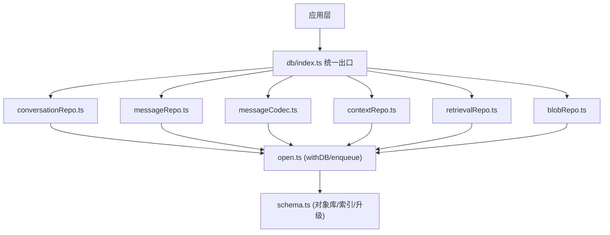
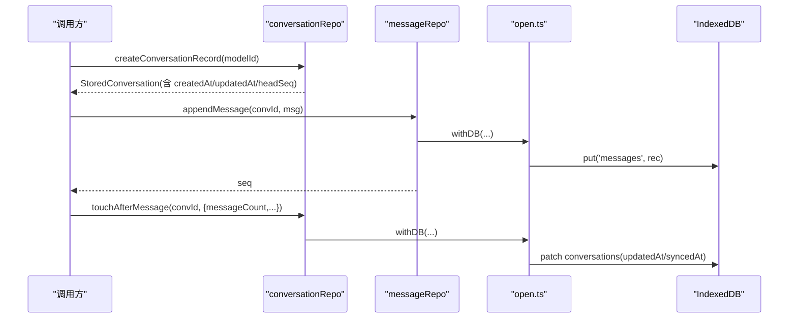
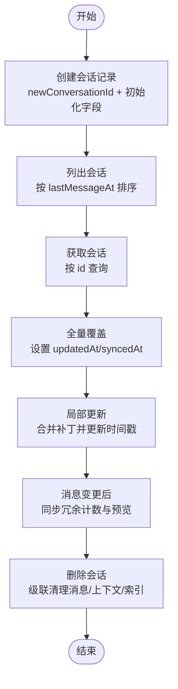
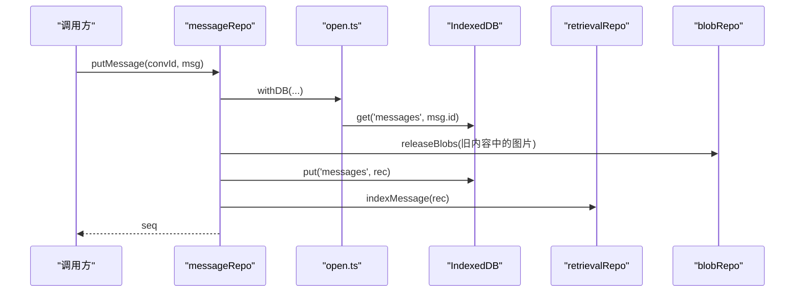
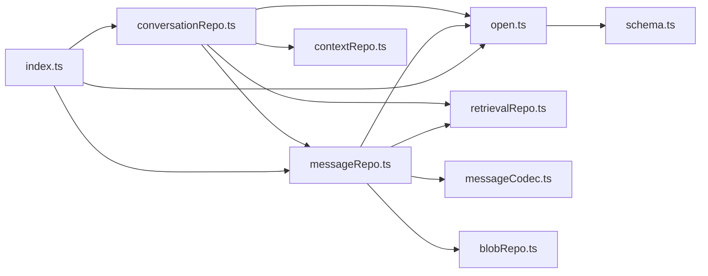

# 对话仓库

<cite>
**本文引用的文件**
- [conversationRepo.ts](file://src/db/conversationRepo.ts)
- [messageRepo.ts](file://src/db/messageRepo.ts)
- [open.ts](file://src/db/open.ts)
- [index.ts](file://src/db/index.ts)
- [schema.ts](file://src/db/schema.ts)
- [messageCodec.ts](file://src/db/messageCodec.ts)
- [contextRepo.ts](file://src/db/contextRepo.ts)
- [retrievalRepo.ts](file://src/db/retrievalRepo.ts)
- [blobRepo.ts](file://src/db/blobRepo.ts)
- [types/index.ts](file://src/types/index.ts)
</cite>

## 目录
1. [简介](#简介)
2. [项目结构](#项目结构)
3. [核心组件](#核心组件)
4. [架构总览](#架构总览)
5. [详细组件分析](#详细组件分析)
6. [依赖关系分析](#依赖关系分析)
7. [性能考量](#性能考量)
8. [故障排查指南](#故障排查指南)
9. [结论](#结论)
10. [附录](#附录)

## 简介
本文件面向“对话仓库”的完整技术文档，聚焦于对话记录的 CRUD 操作、数据结构设计、会话状态与时间戳更新机制、对话与消息的关联关系及一致性保证、批量操作、查询优化与事务处理，以及数据迁移与版本兼容性方案。仓库基于 IndexedDB 实现，采用会话级写队列串行化写入，确保流式输出期间的密集更新不会互相穿插；通过反范式冗余字段提升列表渲染性能，并通过索引与游标实现高效分页与范围读取。

## 项目结构
对话相关的数据访问集中在 src/db 目录下：
- 数据库连接与升级、重试与写队列：open.ts
- 会话仓库（CRUD、冗余计数、删除级联）：conversationRepo.ts
- 消息仓库（追加/插入/覆盖/批量/删除/分页/范围读取）：messageRepo.ts
- 消息编解码（内存 Message 与持久化 StoredMessage 转换）：messageCodec.ts
- 上下文节点与计划（压缩、摘要等）：contextRepo.ts
- 检索索引（全文检索、按会话清理）：retrievalRepo.ts
- Blob 存储（图片等大对象引用计数与回收）：blobRepo.ts
- 统一导出入口：index.ts
- 类型定义（Conversation、Message 等）：types/index.ts
- 数据库模式与对象库定义：schema.ts

图表来源
- [open.ts:14-57](file://src/db/open.ts#L14-L57)
- [conversationRepo.ts:1-109](file://src/db/conversationRepo.ts#L1-L109)
- [messageRepo.ts:1-276](file://src/db/messageRepo.ts#L1-L276)
- [messageCodec.ts:158-218](file://src/db/messageCodec.ts#L158-L218)
- [contextRepo.ts:64-98](file://src/db/contextRepo.ts#L64-L98)
- [index.ts:1-72](file://src/db/index.ts#L1-L72)

章节来源
- [open.ts:14-57](file://src/db/open.ts#L14-L57)
- [index.ts:1-72](file://src/db/index.ts#L1-L72)

## 核心组件
- 会话仓库（conversationRepo.ts）
  - 提供 createConversationRecord、listConversations、getConversation、putConversation、patchConversation、touchAfterMessage、deleteConversation、deleteConversations。
  - 维护元数据冗余字段 messageCount、lastMessageAt、headSeq，用于快速排序与展示。
- 消息仓库（messageRepo.ts）
  - 提供 appendMessage、insertMessageAfter、putMessage、putMessages、markCompressed、deleteMessage、deleteConversationMessages，以及多种查询：getAllMessages、getRecentMessages、getMessagesBefore、getMessageRange、countMessages、getHeadSeq。
  - 所有写操作经 enqueue 按会话串行化，避免并发冲突。
- 数据库连接与队列（open.ts）
  - withDB 封装 IDB 访问并支持失败后重连重试一次。
  - enqueue 实现 key 级别的写队列，防止同一条消息多次更新交错。
- 消息编解码（messageCodec.ts）
  - toStored/fromStored 负责内存模型与持久化记录之间的转换，过滤瞬时状态，计算 token 估算与预览文本。
- 上下文与检索（contextRepo.ts、retrievalRepo.ts）
  - 删除会话时级联清理上下文节点与检索索引。
- Blob 管理（blobRepo.ts）
  - 在消息覆盖或删除时释放不再使用的图片引用，避免存储泄漏。

章节来源
- [conversationRepo.ts:1-109](file://src/db/conversationRepo.ts#L1-L109)
- [messageRepo.ts:1-276](file://src/db/messageRepo.ts#L1-L276)
- [open.ts:76-114](file://src/db/open.ts#L76-L114)
- [messageCodec.ts:158-218](file://src/db/messageCodec.ts#L158-L218)
- [contextRepo.ts:64-98](file://src/db/contextRepo.ts#L64-L98)
- [retrievalRepo.ts:1-200](file://src/db/retrievalRepo.ts#L1-L200)
- [blobRepo.ts:1-200](file://src/db/blobRepo.ts#L1-L200)

## 架构总览
对话仓库以“会话为粒度”组织数据，会话仅存元数据，消息独立存储并按 [convId, seq] 复合键索引。会话列表渲染只读元数据，不加载消息，从而保障长历史下的秒开体验。写路径通过 enqueue 串行化，读路径使用索引与游标进行分页与范围读取。删除会话会级联清理消息、上下文节点与检索索引，并释放 Blob 引用。

图表来源
- [conversationRepo.ts:19-33](file://src/db/conversationRepo.ts#L19-L33)
- [conversationRepo.ts:81-96](file://src/db/conversationRepo.ts#L81-L96)
- [messageRepo.ts:130-138](file://src/db/messageRepo.ts#L130-L138)
- [open.ts:76-88](file://src/db/open.ts#L76-L88)

## 详细组件分析

### 会话 CRUD 与状态管理
- createConversationRecord
  - 生成全局唯一 id（基于时间与随机），初始化 title、selectedModel、createdAt、updatedAt、isRenamed、messageCount=0、lastMessageAt=now、headSeq=0、syncedAt=null。
- listConversations
  - 读取全部会话元数据并按 lastMessageAt 降序排序，用于侧栏列表渲染。
- getConversation
  - 按 id 获取单条会话元数据。
- putConversation
  - 全量覆盖会话元数据，自动设置 updatedAt=Date.now() 并重置 syncedAt=null。
- patchConversation
  - 局部更新会话元数据（如改名、切换模型），内部开启 readwrite 事务，合并旧记录与补丁，设置 updatedAt 与 syncedAt。
- touchAfterMessage
  - 在消息变更后同步冗余字段 messageCount、headSeq、lastMessageAt、lastMessagePreview，用于列表展示。
- deleteConversation / deleteConversations
  - 级联删除消息、上下文节点、检索索引，最后删除会话记录。

图表来源
- [conversationRepo.ts:14-33](file://src/db/conversationRepo.ts#L14-L33)
- [conversationRepo.ts:35-51](file://src/db/conversationRepo.ts#L35-L51)
- [conversationRepo.ts:58-72](file://src/db/conversationRepo.ts#L58-L72)
- [conversationRepo.ts:81-96](file://src/db/conversationRepo.ts#L81-L96)
- [conversationRepo.ts:98-108](file://src/db/conversationRepo.ts#L98-L108)

章节来源
- [conversationRepo.ts:14-108](file://src/db/conversationRepo.ts#L14-L108)

### 消息读写与一致性
- 追加消息 appendMessage
  - 分配 seq（基于当前 headSeq+1），转换为 StoredMessage 并写入 messages，随后建立检索索引。
- 插入消息 insertMessageAfter
  - 在 afterSeq 之后插入，计算中间 seq，写入并建索引。
- 覆盖消息 putMessage
  - 保留原 seq，若存在则释放被替换的 Blob 引用，写入新内容并重建索引。
- 批量写入 putMessages
  - 按传入顺序分配 seq，事务内批量 put，再逐个建立索引。
- 标记压缩 markCompressed
  - 仅更新 compressedInto 与 updatedAt/syncedAt，供压缩流程使用。
- 删除消息与批量删除
  - 删除消息同时移除检索索引并释放 Blob 引用；删除整个会话的消息时批量删除并释放引用。

图表来源
- [messageRepo.ts:173-201](file://src/db/messageRepo.ts#L173-L201)
- [open.ts:76-88](file://src/db/open.ts#L76-L88)
- [retrievalRepo.ts:1-200](file://src/db/retrievalRepo.ts#L1-L200)
- [blobRepo.ts:1-200](file://src/db/blobRepo.ts#L1-L200)

章节来源
- [messageRepo.ts:130-276](file://src/db/messageRepo.ts#L130-L276)

### 会话与消息的关联关系与一致性
- 关联关系
  - 消息通过 convId 与会话关联，按 [convId, seq] 复合索引有序存储。
  - 会话元数据包含 messageCount、lastMessageAt、headSeq 等冗余字段，由 touchAfterMessage 维护。
- 一致性保证
  - 写操作经 enqueue 按会话串行化，避免流式期间多次更新交错。
  - 删除会话时级联清理消息、上下文节点与检索索引，确保无孤立数据。
  - 覆盖消息时释放旧 Blob 引用，避免存储泄漏。

章节来源
- [conversationRepo.ts:74-108](file://src/db/conversationRepo.ts#L74-L108)
- [messageRepo.ts:1-276](file://src/db/messageRepo.ts#L1-L276)
- [open.ts:90-114](file://src/db/open.ts#L90-L114)

### 时间戳更新机制
- 会话级别
  - putConversation 与 patchConversation 均设置 updatedAt=Date.now() 并重置 syncedAt=null，用于标识本地变更未同步。
- 消息级别
  - toStored 中设置 updatedAt=Date.now()，表示持久化时间；timestamp 来自消息原始时间。
- 列表排序
  - listConversations 按 lastMessageAt 降序排列，反映最近活跃会话。

章节来源
- [conversationRepo.ts:45-72](file://src/db/conversationRepo.ts#L45-L72)
- [messageCodec.ts:158-197](file://src/db/messageCodec.ts#L158-L197)

### 批量操作与查询优化
- 批量写入
  - putMessages 使用事务批量 put，减少事务开销。
- 分页与范围读取
  - getRecentMessages 使用反向游标读取最新 limit 条，避免加载整段历史。
  - getMessagesBefore 支持向上滚动加载。
  - getMessageRange 支持按 seq 区间读取，便于按需加载上下文。
- 计数与头部序列
  - countMessages 与 getHeadSeq 提供统计与边界信息，辅助 UI 判断是否还有更早消息。

章节来源
- [messageRepo.ts:27-122](file://src/db/messageRepo.ts#L27-L122)
- [messageRepo.ts:204-220](file://src/db/messageRepo.ts#L204-L220)

### 事务处理
- 会话元数据更新
  - patchConversation 显式开启 readwrite 事务，读取旧记录后合并补丁并写入。
- 消息覆盖与批量写入
  - putMessage 与 putMessages 分别使用事务保证原子性。
- 删除会话
  - 先删除消息、上下文节点与检索索引，最后删除会话记录，确保级联一致性。

章节来源
- [conversationRepo.ts:58-72](file://src/db/conversationRepo.ts#L58-L72)
- [messageRepo.ts:204-220](file://src/db/messageRepo.ts#L204-L220)
- [conversationRepo.ts:98-108](file://src/db/conversationRepo.ts#L98-L108)

### 数据迁移与版本兼容性
- 数据库升级
  - open.ts 中 create 函数定义对象库与索引，IDB 会在版本号变化时执行升级逻辑。
- 兼容策略
  - 通过 withDB 封装失败重试，遇到 UnknownError 或 AbortError 时关闭并重连。
  - blocked/blocking 回调处理多标签页升级阻塞，主动让路并在下次访问重开连接。
- 建议
  - 新增字段时保持向后兼容，旧客户端可忽略新字段；必要时在升级回调中填充默认值。

章节来源
- [open.ts:14-57](file://src/db/open.ts#L14-L57)
- [open.ts:76-88](file://src/db/open.ts#L76-L88)

## 依赖关系分析
- conversationRepo 依赖 open（withDB/enqueue）、schema（StoredConversation）、messageRepo（级联删除）、contextRepo（级联删除）、retrievalRepo（索引清理）。
- messageRepo 依赖 open、schema（StoredMessage）、seq（nextSeq/seqBetween）、messageCodec（toStored/fromStored）、blobRepo（释放引用）、retrievalRepo（索引维护）。
- open 依赖 schema（DB_NAME/DB_VERSION/AiShopDB），定义对象库与索引。
- index.ts 统一导出各仓库能力，作为上层唯一入口。

图表来源
- [conversationRepo.ts:1-109](file://src/db/conversationRepo.ts#L1-L109)
- [messageRepo.ts:1-276](file://src/db/messageRepo.ts#L1-L276)
- [open.ts:14-57](file://src/db/open.ts#L14-L57)
- [index.ts:1-72](file://src/db/index.ts#L1-L72)

章节来源
- [conversationRepo.ts:1-109](file://src/db/conversationRepo.ts#L1-L109)
- [messageRepo.ts:1-276](file://src/db/messageRepo.ts#L1-L276)
- [open.ts:14-57](file://src/db/open.ts#L14-L57)
- [index.ts:1-72](file://src/db/index.ts#L1-L72)

## 性能考量
- 列表渲染优化
  - 会话列表仅读取元数据，不加载消息，利用 lastMessageAt 排序与冗余字段提升性能。
- 分页与游标
  - getRecentMessages 与 getMessagesBefore 使用游标限制读取量，避免大会话导致内存压力。
- 写串行化
  - enqueue 按会话串行化写操作，避免流式输出时的频繁更新造成竞争条件。
- 索引设计
  - by_conv_seq、by_conv_time 等复合索引支持高效范围查询与排序。
- Blob 回收
  - 覆盖或删除消息时释放不再使用的图片引用，防止存储膨胀。

[本节为通用性能指导，无需特定文件引用]

## 故障排查指南
- 常见错误
  - UnknownError/AbortError：withDB 会自动关闭并重连一次，检查是否有其他标签页占用或浏览器资源不足。
  - 升级阻塞：blocked/blocking 回调提示多标签页升级冲突，等待或关闭其他页面后重试。
- 数据不一致
  - 若会话元数据与消息数量不一致，检查 touchAfterMessage 是否在消息变更后正确调用。
  - 若出现孤立 Blob，确认覆盖/删除消息时是否正确释放引用。
- 日志与调试
  - 关注控制台警告信息，定位 db 操作失败与重试情况。

章节来源
- [open.ts:76-88](file://src/db/open.ts#L76-L88)
- [open.ts:46-57](file://src/db/open.ts#L46-L57)
- [messageRepo.ts:173-201](file://src/db/messageRepo.ts#L173-L201)
- [conversationRepo.ts:74-108](file://src/db/conversationRepo.ts#L74-L108)

## 结论
对话仓库通过会话级写队列、反范式冗余字段、索引与游标、级联删除与 Blob 回收，实现了高性能、强一致性的对话数据管理。CRUD 操作清晰分层，批量与分页查询满足复杂场景，数据库升级与重试机制保障稳定性。建议在后续迭代中继续完善服务端同步与版本兼容策略，进一步提升跨端一致性与扩展性。

[本节为总结性内容，无需特定文件引用]

## 附录

### 数据结构与字段含义
- Conversation（会话）
  - id：全局唯一标识
  - title：会话标题
  - selectedModel：当前选择的模型
  - createdAt/updatedAt：创建与更新时间
  - isRenamed：是否已手动重命名
  - messageCount：消息总数（冗余）
  - lastMessageAt：最后消息时间（冗余）
  - headSeq：当前最大 seq（冗余）
  - syncedAt：上次与服务端同步时间
  - segments：压缩后的上下文区间
  - compactFocusHint：会话级压缩重点提示
  - hydrated：消息是否已从 IndexedDB 加载（内存字段）
  - totalMessageCount：库中该会话的消息总数（用于空会话判断）
  - hasMoreMessages：是否还有更早消息未加载
  - lastMessagePreview：最后一条消息预览文本
- Message（消息）
  - id：消息唯一标识
  - role：角色（user/assistant/system）
  - content：文本或多媒体内容
  - timestamp：消息时间
  - isStreaming：是否正在流式生成（不落盘）
  - suggestions：建议回复
  - webSearching/webSearched/webSearchFailed：联网搜索状态
  - searchResults：搜索结果
  - attachments：文件附件
  - artifact：关联的产物块
  - model：生成该消息的模型
  - versions/activeVersionIndex：多模型回答版本
  - stoppedByUser：用户是否停止生成
  - compressedInto：所属压缩区间 id
  - usage：真实 token 用量

章节来源
- [types/index.ts:143-175](file://src/types/index.ts#L143-L175)
- [types/index.ts:84-107](file://src/types/index.ts#L84-L107)
- [messageCodec.ts:158-218](file://src/db/messageCodec.ts#L158-L218)