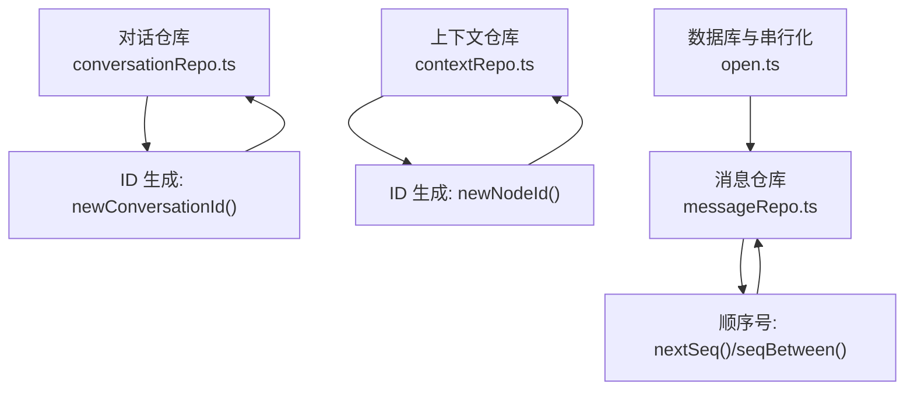
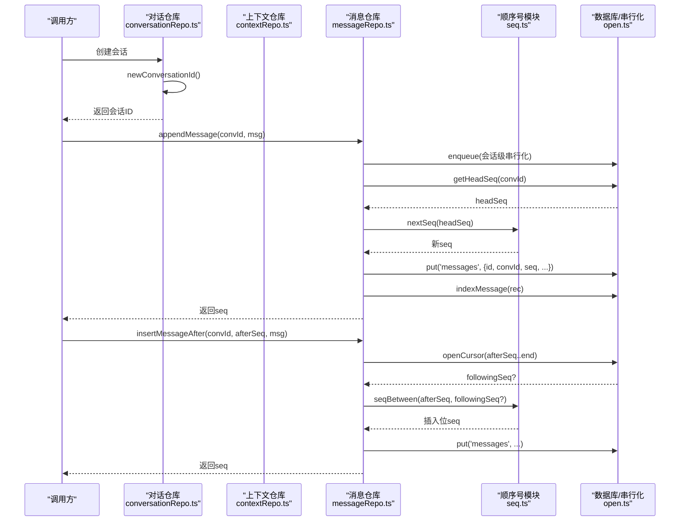
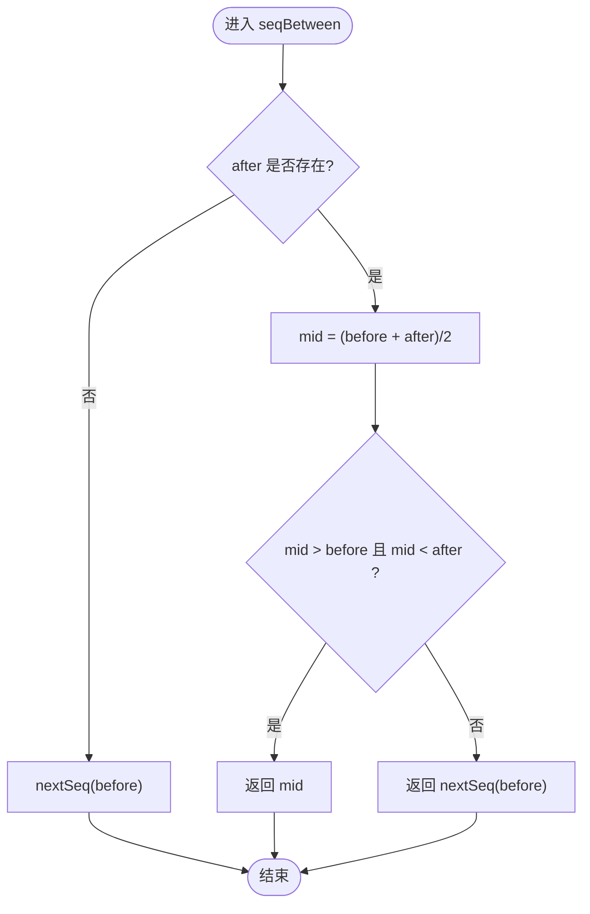
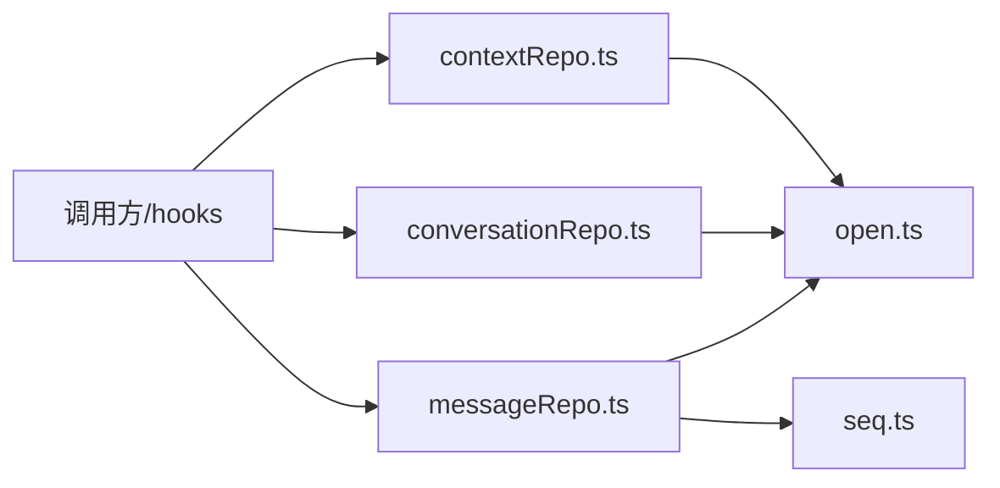

# 序列号生成器

<cite>
**本文引用的文件**
- [conversationRepo.ts](file://src/db/conversationRepo.ts)
- [contextRepo.ts](file://src/db/contextRepo.ts)
- [seq.ts](file://src/db/seq.ts)
- [messageRepo.ts](file://src/db/messageRepo.ts)
- [open.ts](file://src/db/open.ts)
</cite>

## 目录
1. [简介](#简介)
2. [项目结构](#项目结构)
3. [核心组件](#核心组件)
4. [架构总览](#架构总览)
5. [详细组件分析](#详细组件分析)
6. [依赖分析](#依赖分析)
7. [性能考虑](#性能考虑)
8. [故障排查指南](#故障排查指南)
9. [结论](#结论)
10. [附录](#附录)

## 简介
本文件系统化梳理并文档化“序列号生成器”的设计与实现，覆盖全局唯一标识符（会话 ID、上下文节点 ID）与消息顺序号（seq）的生成算法、分布式策略、冲突避免机制、格式规范、可读性与排序特性、并发安全与性能优化，以及验证与解析工具的使用建议。该方案以浏览器端 IndexedDB 为持久化载体，通过会话级队列串行化写入，确保在高并发流式场景下的正确性与稳定性。

## 项目结构
围绕序列号生成的关键代码集中在 db 层：
- 会话 ID 生成：conversationRepo.ts
- 上下文节点 ID 生成：contextRepo.ts
- 消息顺序号生成与插入位计算：seq.ts
- 消息读写与 seq 使用：messageRepo.ts
- 数据库连接与会话级写入串行化：open.ts

图表来源
- [conversationRepo.ts:14-17](file://src/db/conversationRepo.ts#L14-L17)
- [contextRepo.ts:11-13](file://src/db/contextRepo.ts#L11-L13)
- [seq.ts:7-24](file://src/db/seq.ts#L7-L24)
- [messageRepo.ts:130-165](file://src/db/messageRepo.ts#L130-L165)
- [open.ts:1-32](file://src/db/open.ts#L1-L32)

章节来源
- [conversationRepo.ts:1-109](file://src/db/conversationRepo.ts#L1-L109)
- [contextRepo.ts:1-99](file://src/db/contextRepo.ts#L1-L99)
- [seq.ts:1-25](file://src/db/seq.ts#L1-L25)
- [messageRepo.ts:1-276](file://src/db/messageRepo.ts#L1-L276)
- [open.ts:1-32](file://src/db/open.ts#L1-L32)

## 核心组件
- 会话 ID 生成器：newConversationId()
  - 基于时间戳与随机串拼接，保证跨进程/多标签页的全局唯一性，便于未来与服务端同步复用。
- 上下文节点 ID 生成器：newNodeId()
  - 带前缀的短 ID，结合时间与随机部分，满足局部命名空间内的唯一性。
- 消息顺序号生成器：nextSeq() 与 seqBetween()
  - 采用浮点排序键思想：追加时按固定步长递增；插入时在相邻两序之间取中点，避免重编号。
- 写入串行化：enqueue()
  - 会话级队列串行化写操作，避免流式更新交错导致的数据不一致。

章节来源
- [conversationRepo.ts:14-17](file://src/db/conversationRepo.ts#L14-L17)
- [contextRepo.ts:11-13](file://src/db/contextRepo.ts#L11-L13)
- [seq.ts:7-24](file://src/db/seq.ts#L7-L24)
- [messageRepo.ts:130-165](file://src/db/messageRepo.ts#L130-L165)
- [open.ts:1-32](file://src/db/open.ts#L1-L32)

## 架构总览
下图展示从调用方到持久化的完整流程，包括 ID 生成、顺序号分配、索引构建与事务提交。

图表来源
- [conversationRepo.ts:14-17](file://src/db/conversationRepo.ts#L14-L17)
- [messageRepo.ts:130-165](file://src/db/messageRepo.ts#L130-L165)
- [seq.ts:7-24](file://src/db/seq.ts#L7-L24)
- [open.ts:1-32](file://src/db/open.ts#L1-L32)

## 详细组件分析

### 会话 ID 生成：newConversationId()
- 算法要点
  - 使用时间戳（base36）+ 随机片段拼接，形成短小且全局唯一的字符串。
  - 不依赖本地自增，便于未来与服务端同步时直接复用。
- 格式与长度
  - 形如“时间戳(base36)-随机串”，整体较短，适合 URL/索引键等场景。
- 可读性与排序
  - 非字典序可排序，但可通过 createdAt 字段进行排序。
- 并发与冲突
  - 基于时间与随机组合，碰撞概率极低；若需强一致，可在服务端做幂等校验。
- 使用位置
  - 创建会话记录时作为主键。

章节来源
- [conversationRepo.ts:14-17](file://src/db/conversationRepo.ts#L14-L17)
- [conversationRepo.ts:19-33](file://src/db/conversationRepo.ts#L19-L33)

### 上下文节点 ID 生成：newNodeId()
- 算法要点
  - 带“ctx-”前缀，后接时间戳(base36)与随机片段，用于上下文节点的唯一标识。
- 格式与长度
  - 短 ID，具备语义前缀，便于调试与过滤。
- 可读性与排序
  - 非字典序可排序，通常配合 createdAt 排序。
- 并发与冲突
  - 同会话内唯一性由业务逻辑保障；跨会话通过 convId 区分。
- 使用位置
  - 构造新的上下文节点记录时使用。

章节来源
- [contextRepo.ts:11-13](file://src/db/contextRepo.ts#L11-L13)

### 消息顺序号生成：nextSeq() 与 seqBetween()
- 设计目标
  - 支持追加与插入两种场景，无需对后续消息重编号。
- 算法要点
  - 追加：headSeq + SEQ_STEP（固定步长）。
  - 插入：在 before 与 after 之间取中点；若精度耗尽或无法插入，则回退为追加。
- 复杂度
  - O(1) 时间计算；查询“下一条”使用索引游标，近似 O(logN)。
- 冲突避免
  - 双精度中点在极端连续对半后会退化，此时自动回退到追加，避免重复键。
- 使用位置
  - appendMessage、insertMessageAfter、putMessages 等路径均通过此模块分配 seq。

图表来源
- [seq.ts:7-24](file://src/db/seq.ts#L7-L24)

章节来源
- [seq.ts:1-25](file://src/db/seq.ts#L1-L25)
- [messageRepo.ts:130-165](file://src/db/messageRepo.ts#L130-L165)
- [messageRepo.ts:204-220](file://src/db/messageRepo.ts#L204-L220)

### 写入串行化与并发安全：enqueue()
- 设计目标
  - 将同一会话的所有写操作串行化，避免流式输出期间的密集更新互相穿插。
- 行为特征
  - 所有写操作经 withDB 执行，并在 Safari 内存压力下具备连接重建重试能力。
- 影响范围
  - 消息追加/插入/覆盖写、批量导入、删除等写路径均受保护。
- 性能权衡
  - 串行化带来轻微延迟，但显著降低竞态风险与数据不一致概率。

章节来源
- [open.ts:1-32](file://src/db/open.ts#L1-L32)
- [messageRepo.ts:1-6](file://src/db/messageRepo.ts#L1-L6)
- [messageRepo.ts:130-165](file://src/db/messageRepo.ts#L130-L165)

### 读取与排序：by_conv_seq 索引
- 索引设计
  - 复合索引 [convId, seq]，保证同一会话内按顺序高效读取与区间扫描。
- 典型用法
  - 获取最近 N 条、向上滚动加载、按 seq 区间读取（供上下文 agent 按需拉取原文）。
- 性能
  - 反向游标仅访问所需条目，避免全量加载，适合长历史场景。

章节来源
- [open.ts:22-24](file://src/db/open.ts#L22-L24)
- [messageRepo.ts:27-79](file://src/db/messageRepo.ts#L27-L79)
- [messageRepo.ts:81-105](file://src/db/messageRepo.ts#L81-L105)

## 依赖分析
- 模块耦合
  - messageRepo.ts 依赖 seq.ts 进行顺序号分配，依赖 open.ts 进行数据库访问与串行化。
  - conversationRepo.ts 与 contextRepo.ts 提供 ID 生成，被上层业务与 hooks 使用。
- 外部依赖
  - idb 库用于 IndexedDB 封装；浏览器环境提供 Date.now() 与 Math.random()。
- 潜在循环
  - 当前无循环依赖；各仓库职责清晰，解耦良好。

图表来源
- [messageRepo.ts:1-18](file://src/db/messageRepo.ts#L1-L18)
- [conversationRepo.ts:1-13](file://src/db/conversationRepo.ts#L1-L13)
- [contextRepo.ts:1-13](file://src/db/contextRepo.ts#L1-L13)
- [open.ts:1-32](file://src/db/open.ts#L1-L32)

章节来源
- [messageRepo.ts:1-18](file://src/db/messageRepo.ts#L1-L18)
- [conversationRepo.ts:1-13](file://src/db/conversationRepo.ts#L1-L13)
- [contextRepo.ts:1-13](file://src/db/contextRepo.ts#L1-L13)
- [open.ts:1-32](file://src/db/open.ts#L1-L32)

## 性能考虑
- 顺序号分配
  - nextSeq() 与 seqBetween() 均为 O(1)，插入位计算开销极小。
- 索引与游标
  - by_conv_seq 复合索引使区间查询与分页读取高效；反向游标减少不必要 I/O。
- 写入串行化
  - 会话级队列避免竞争，提升一致性；在高并发流式场景下尤为关键。
- 存储体积
  - 会话 ID 与节点 ID 保持短小，有利于索引与网络传输。
- 可扩展性
  - 若未来引入服务端同步，ID 生成策略可直接复用；顺序号仍可在客户端独立工作。

[本节为通用性能讨论，不直接分析具体文件]

## 故障排查指南
- 常见症状
  - 列表顺序错乱：检查是否误用数组下标而非 seq；确认 by_conv_seq 索引存在。
  - 重复 seq：确认未绕过 enqueue 直接写库；检查 seqBetween 退化回退逻辑。
  - Safari 异常：withDB 已内置连接重建重试；若仍失败，检查内存压力与事务大小。
- 定位步骤
  - 查看 getHeadSeq 返回值是否符合预期；核对 appendMessage/insertMessageAfter 调用链。
  - 检查消息覆盖写 putMessage 是否正确保留原 seq。
- 修复建议
  - 统一通过仓库 API 写入；避免直接操作 IndexedDB。
  - 对批量导入使用 putMessages，确保顺序稳定。

章节来源
- [messageRepo.ts:111-122](file://src/db/messageRepo.ts#L111-L122)
- [messageRepo.ts:130-165](file://src/db/messageRepo.ts#L130-L165)
- [messageRepo.ts:173-202](file://src/db/messageRepo.ts#L173-L202)
- [open.ts:1-32](file://src/db/open.ts#L1-L32)

## 结论
该序列号生成器以简洁可靠的算法实现了全局唯一 ID 与消息顺序号的分配，并通过会话级串行化与高效索引保障了高并发下的正确性与性能。其设计兼顾了可读性、扩展性与未来服务端同步需求，适合作为前端离线优先应用的基石组件。

[本节为总结性内容，不直接分析具体文件]

## 附录

### 序列号格式规范与长度限制
- 会话 ID（newConversationId）
  - 格式：时间戳(base36) + 分隔符 + 随机串
  - 长度：较短，适合索引与传输
  - 排序：非字典序；建议使用 createdAt 字段排序
- 上下文节点 ID（newNodeId）
  - 格式：前缀“ctx-” + 时间戳(base36) + 随机串
  - 长度：短 ID，便于阅读与过滤
  - 排序：非字典序；建议配合 createdAt 排序
- 消息顺序号（seq）
  - 类型：数字（浮点排序键）
  - 追加步长：SEQ_STEP（固定增量）
  - 插入策略：相邻两值的中点；精度耗尽时回退追加
  - 排序：天然数值升序，完美支持区间查询与分页

章节来源
- [conversationRepo.ts:14-17](file://src/db/conversationRepo.ts#L14-L17)
- [contextRepo.ts:11-13](file://src/db/contextRepo.ts#L11-L13)
- [seq.ts:7-24](file://src/db/seq.ts#L7-L24)

### 分布式生成策略与冲突避免
- 全局唯一 ID
  - 基于时间与随机组合，碰撞概率极低；未来可无缝迁移至服务端生成策略。
- 顺序号
  - 客户端独立维护，不依赖服务端；通过中点插入避免重编号，极大降低冲突概率。
- 冲突检测
  - 建议在服务端同步时对 ID 做幂等校验；对 seq 冲突走“覆盖写保留原 seq”的策略。

章节来源
- [conversationRepo.ts:14-17](file://src/db/conversationRepo.ts#L14-L17)
- [messageRepo.ts:167-202](file://src/db/messageRepo.ts#L167-L202)

### 并发安全与性能优化
- 并发安全
  - 会话级队列串行化写操作，避免流式更新交错。
  - withDB 封装在异常时重建连接并重试一次。
- 性能优化
  - 使用 by_conv_seq 索引进行高效区间查询与分页。
  - 反向游标仅加载必要数据，降低内存占用。
  - 顺序号分配 O(1)，插入位计算开销极小。

章节来源
- [open.ts:1-32](file://src/db/open.ts#L1-L32)
- [messageRepo.ts:27-79](file://src/db/messageRepo.ts#L27-L79)
- [seq.ts:7-24](file://src/db/seq.ts#L7-L24)

### 验证与解析工具函数（建议）
以下为推荐的前端工具函数思路，便于在 UI 层进行输入校验与展示格式化：
- 验证会话 ID
  - 规则：匹配“时间戳(base36)-随机串”的基本结构；可选增加长度上限校验。
  - 用途：表单输入校验、URL 参数校验。
- 验证上下文节点 ID
  - 规则：以“ctx-”开头，后接时间戳(base36)与随机串；可选增加长度上限。
  - 用途：节点链接校验、日志过滤。
- 解析顺序号
  - 规则：数字类型；区间查询时确保 fromSeq <= toSeq。
  - 用途：分页参数校验、调试输出。
- 注意
  - 上述工具函数为建议实现，不在当前仓库中直接提供；可按需添加至 utils 或 db 层辅助模块。

[本节为概念性说明，不直接分析具体文件]