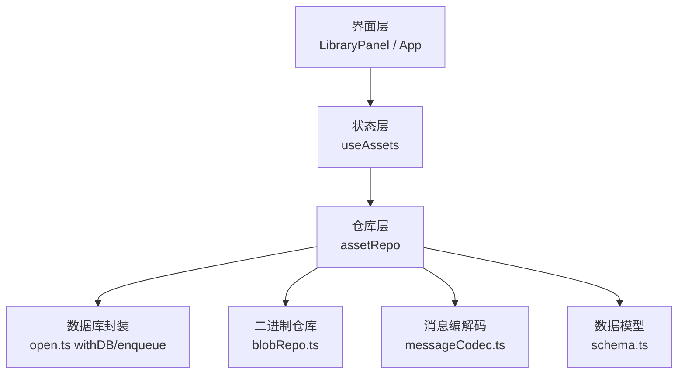
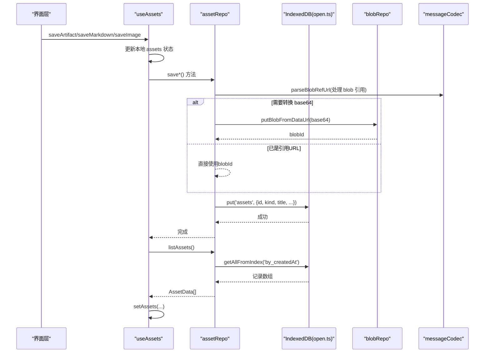
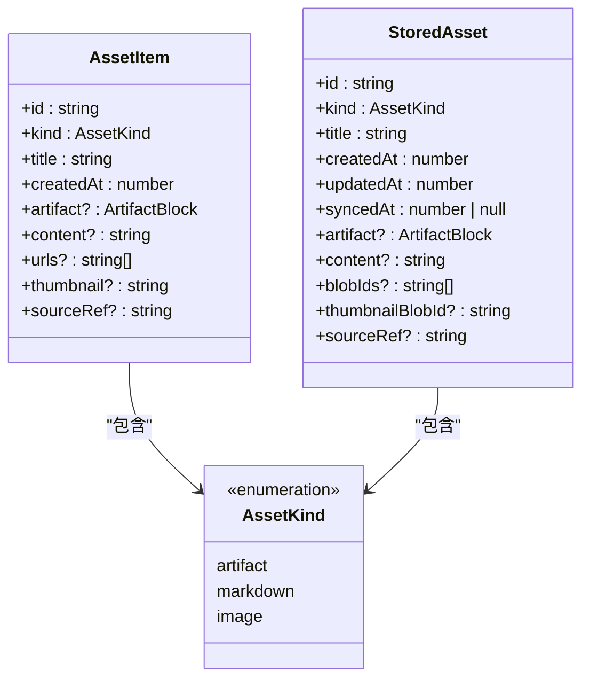
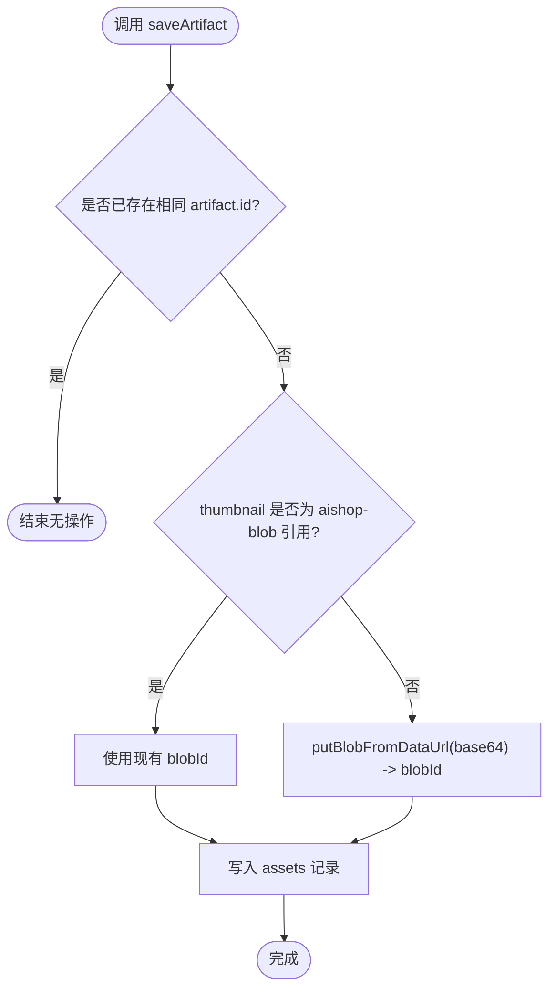
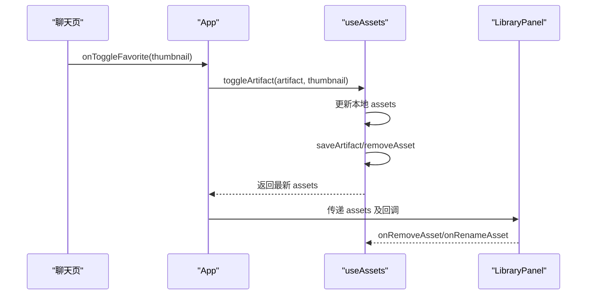
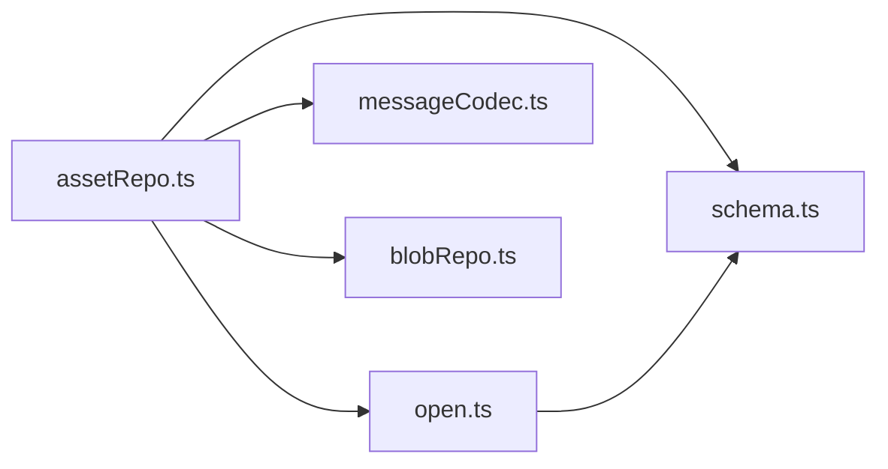

# 收藏仓库

<cite>
**本文引用的文件**
- [src/components/artifact/LibraryPanel.tsx](file://src/components/artifact/LibraryPanel.tsx)
- [src/hooks/useAssets.ts](file://src/hooks/useAssets.ts)
- [src/db/assetRepo.ts](file://src/db/assetRepo.ts)
- [src/db/schema.ts](file://src/db/schema.ts)
- [src/db/open.ts](file://src/db/open.ts)
- [src/db/blobRepo.ts](file://src/db/blobRepo.ts)
- [src/db/messageCodec.ts](file://src/db/messageCodec.ts)
- [src/services/backup.ts](file://src/services/backup.ts)
- [src/types/index.ts](file://src/types/index.ts)
- [src/App.tsx](file://src/App.tsx)
</cite>

## 更新摘要
**变更内容**
- 将原有的单一收藏功能（FavoritesPanel）重构为多类型资产管理库（LibraryPanel）
- 新增资产类型支持：应用（artifact）、文档（markdown）、图片（image）
- 统一资产数据模型和存储结构，替代原有的收藏表
- 增强资产管理和同步机制，支持跨设备同步
- 改进用户界面，提供分类筛选、预览、下载等功能

## 目录
1. [简介](#简介)
2. [项目结构](#项目结构)
3. [核心组件](#核心组件)
4. [架构总览](#架构总览)
5. [详细组件分析](#详细组件分析)
6. [依赖关系分析](#依赖关系分析)
7. [性能与存储特性](#性能与存储特性)
8. [故障排查指南](#故障排查指南)
9. [结论](#结论)
10. [附录：数据模型与导入导出](#附录数据模型与导入导出)

## 简介
本文件系统化文档化「我的库」资产管理系统，覆盖多类型资产的增删改查、数据结构设计、缩略图与二进制存储、同步与备份机制、搜索与过滤能力，以及导入导出格式。该系统将 Artifact（可执行代码块）、Markdown 文档和图片统一管理到 IndexedDB，并通过 React Hook 暴露给 UI 层进行展示与管理。

## 项目结构
资产管理系统由以下层次组成：
- 数据层：IndexedDB schema、blob 引用计数、消息编解码、统一数据库访问封装
- 仓库层：assetRepo 提供 list/save/remove/rename 等 API，支持三种资产类型
- 状态层：useAssets Hook 管理本地 state 并协调落库和同步
- 界面层：LibraryPanel 展示资产列表、预览、重命名、删除；App 路由到库页并与聊天页联动保存

图表来源
- [src/components/artifact/LibraryPanel.tsx:164-534](file://src/components/artifact/LibraryPanel.tsx#L164-L534)
- [src/App.tsx:105-214](file://src/App.tsx#L105-L214)
- [src/hooks/useAssets.ts:24-175](file://src/hooks/useAssets.ts#L24-L175)
- [src/db/assetRepo.ts:21-216](file://src/db/assetRepo.ts#L21-L216)
- [src/db/open.ts:63-85](file://src/db/open.ts#L63-L85)
- [src/db/blobRepo.ts:1-168](file://src/db/blobRepo.ts#L1-L168)
- [src/db/messageCodec.ts:15-27](file://src/db/messageCodec.ts#L15-L27)
- [src/db/schema.ts:233-264](file://src/db/schema.ts#L233-L264)

章节来源
- [src/App.tsx:105-214](file://src/App.tsx#L105-L214)
- [src/components/artifact/LibraryPanel.tsx:164-534](file://src/components/artifact/LibraryPanel.tsx#L164-L534)
- [src/hooks/useAssets.ts:24-175](file://src/hooks/useAssets.ts#L24-L175)
- [src/db/assetRepo.ts:21-216](file://src/db/assetRepo.ts#L21-L216)
- [src/db/open.ts:63-85](file://src/db/open.ts#L63-L85)
- [src/db/blobRepo.ts:1-168](file://src/db/blobRepo.ts#L1-L168)
- [src/db/messageCodec.ts:15-27](file://src/db/messageCodec.ts#L15-L27)
- [src/db/schema.ts:233-264](file://src/db/schema.ts#L233-L264)

## 核心组件
- AssetItem：资产在运行时的数据类型，包含 id、kind、title、createdAt 及对应类型的字段
- assetRepo：IndexedDB 读写封装，提供 listAssets、saveArtifact、saveMarkdown、saveImageHistory、removeAsset、renameAsset
- useAssets：React Hook，维护 assets 本地状态，先更新 UI 再异步落库，失败不阻断，支持 BYOC 同步
- LibraryPanel：资产列表 UI，支持分类筛选、网格展示、预览、长按菜单、重命名、删除确认
- App：集成资产 Hook，并在聊天页中触发保存动作，自动保存聊天生成的图片

章节来源
- [src/db/assetRepo.ts:21-34](file://src/db/assetRepo.ts#L21-L34)
- [src/hooks/useAssets.ts:24-175](file://src/hooks/useAssets.ts#L24-L175)
- [src/components/artifact/LibraryPanel.tsx:18-22](file://src/components/artifact/LibraryPanel.tsx#L18-L22)
- [src/App.tsx:105-214](file://src/App.tsx#L105-L214)

## 架构总览
资产数据流从 UI 到 IndexedDB 的完整路径如下：

图表来源
- [src/hooks/useAssets.ts:58-119](file://src/hooks/useAssets.ts#L58-L119)
- [src/db/assetRepo.ts:102-189](file://src/db/assetRepo.ts#L102-L189)
- [src/db/messageCodec.ts:21-27](file://src/db/messageCodec.ts#L21-L27)
- [src/db/blobRepo.ts:70-74](file://src/db/blobRepo.ts#L70-L74)
- [src/db/open.ts:63-85](file://src/db/open.ts#L63-L85)

## 详细组件分析

### 资产数据模型与类型定义
- AssetItem：运行时类型，包含 id、kind、title、createdAt 及对应类型的字段（artifact/content/urls/thumbnail/sourceRef）
- StoredAsset：持久化类型，使用 SyncMeta 支持同步，不同 kind 使用不同的字段存储
- AssetKind：资产类型枚举，包括 'artifact' | 'markdown' | 'image'

图表来源
- [src/types/index.ts:143-167](file://src/types/index.ts#L143-L167)
- [src/db/schema.ts:233-264](file://src/db/schema.ts#L233-L264)
- [src/db/assetRepo.ts:21-34](file://src/db/assetRepo.ts#L21-L34)

章节来源
- [src/types/index.ts:143-167](file://src/types/index.ts#L143-L167)
- [src/db/schema.ts:233-264](file://src/db/schema.ts#L233-L264)
- [src/db/assetRepo.ts:21-34](file://src/db/assetRepo.ts#L21-L34)

### 资产操作实现
- listAssets：按 createdAt 升序读取资产列表，映射为 AssetData
- saveArtifact：去重检查（同 artifact.id），将 base64 转为 blob 或复用引用，写入 assets 表
- saveMarkdown：按 sourceRef 查重，生成随机 id，存储纯文本内容
- saveImageHistory：按源历史 id 查重，处理 urls 中的 data URL 和 blob 引用
- removeAsset：删除记录并释放对应 blob 引用计数
- renameAsset：事务内更新 title，同时更新 artifact.title 保持一致性

图表来源
- [src/db/assetRepo.ts:102-124](file://src/db/assetRepo.ts#L102-L124)
- [src/db/messageCodec.ts:21-27](file://src/db/messageCodec.ts#L21-L27)
- [src/db/blobRepo.ts:70-74](file://src/db/blobRepo.ts#L70-L74)

章节来源
- [src/db/assetRepo.ts:81-216](file://src/db/assetRepo.ts#L81-L216)

### 状态管理与 UI 交互
- useAssets：启动时加载列表；保存/删除/重命名先更新本地 state，再异步落库；isSaved/toggleArtifact 提供便捷判断与切换
- LibraryPanel：网格展示资产项，支持分类筛选、长按弹出菜单、预览、重命名、删除确认；通过 props 接收回调
- App：在聊天页中根据当前消息的 artifact 触发保存，并将资产状态传递给库面板

图表来源
- [src/App.tsx:188-214](file://src/App.tsx#L188-L214)
- [src/hooks/useAssets.ts:150-175](file://src/hooks/useAssets.ts#L150-L175)
- [src/components/artifact/LibraryPanel.tsx:164-534](file://src/components/artifact/LibraryPanel.tsx#L164-L534)

章节来源
- [src/hooks/useAssets.ts:24-175](file://src/hooks/useAssets.ts#L24-L175)
- [src/components/artifact/LibraryPanel.tsx:164-534](file://src/components/artifact/LibraryPanel.tsx#L164-L534)
- [src/App.tsx:105-214](file://src/App.tsx#L105-L214)

### 分类与标签系统
- 内置三种资产类型：应用（artifact）、文档（markdown）、图片（image）
- 每种类型有对应的图标和标签显示
- 支持按类型筛选查看，默认显示全部
- 可扩展更多资产类型，只需在 KIND_FILTERS 和 KIND_META 中添加配置

章节来源
- [src/components/artifact/LibraryPanel.tsx:26-41](file://src/components/artifact/LibraryPanel.tsx#L26-L41)
- [src/types/index.ts:143-144](file://src/types/index.ts#L143-L144)

### 搜索与过滤
- 支持按资产类型筛选：全部、应用、文档、图片
- 支持按创建时间排序（新的追加在末尾）
- 可在 UI 层基于 assets 数组进行前端过滤（如按 title 模糊匹配）
- 支持空状态提示，引导用户保存内容

章节来源
- [src/components/artifact/LibraryPanel.tsx:165-186](file://src/components/artifact/LibraryPanel.tsx#L165-L186)
- [src/components/artifact/LibraryPanel.tsx:380-390](file://src/components/artifact/LibraryPanel.tsx#L380-L390)

### 同步与备份机制
- 同步：assets 随 BYOC 增量同步跨设备，资产变更后防抖 3 秒触发一次 safeSync
- 备份：当前备份模块主要覆盖会话、消息、节点等，未包含资产列表
- 建议：若需将资产纳入备份，可在备份构建阶段添加资产数据的序列化与恢复逻辑

章节来源
- [src/hooks/useAssets.ts:27-36](file://src/hooks/useAssets.ts#L27-L36)
- [src/db/schema.ts:27-33](file://src/db/schema.ts#L27-L33)
- [src/services/backup.ts:104-132](file://src/services/backup.ts#L104-L132)

### 导入导出格式
- 当前备份文件格式为 JSON，包含 app、version、exportedAt、conversations 等字段；资产数据不在其中
- 如需导出资产，可扩展备份模块，将 assets 表内容序列化为 JSON 并合并进备份文件；恢复时反向写入

章节来源
- [src/services/backup.ts:43-48](file://src/services/backup.ts#L43-L48)
- [src/services/backup.ts:104-132](file://src/services/backup.ts#L104-L132)

## 依赖关系分析
- assetRepo 依赖 open.ts 的 withDB/enqueue 保证连接健壮性与写串行化
- assetRepo 依赖 messageCodec.ts 的 blob 引用 URL 解析与生成
- assetRepo 依赖 blobRepo.ts 的 putBlobFromDataUrl/releaseBlobs 管理缩略图二进制
- schema.ts 定义 AiShopDB 中的 assets 对象存储与索引 by_createdAt、by_kind
- open.ts 在升级阶段创建 assets 对象存储与索引，并迁移旧收藏数据

图表来源
- [src/db/assetRepo.ts:13-17](file://src/db/assetRepo.ts#L13-L17)
- [src/db/open.ts:63-85](file://src/db/open.ts#L63-L85)
- [src/db/messageCodec.ts:15-27](file://src/db/messageCodec.ts#L15-L27)
- [src/db/blobRepo.ts:1-12](file://src/db/blobRepo.ts#L1-L12)
- [src/db/schema.ts:233-264](file://src/db/schema.ts#L233-L264)

章节来源
- [src/db/assetRepo.ts:13-17](file://src/db/assetRepo.ts#L13-L17)
- [src/db/open.ts:63-85](file://src/db/open.ts#L63-L85)
- [src/db/messageCodec.ts:15-27](file://src/db/messageCodec.ts#L15-L27)
- [src/db/blobRepo.ts:1-12](file://src/db/blobRepo.ts#L1-L12)
- [src/db/schema.ts:233-264](file://src/db/schema.ts#L233-L264)

## 性能与存储特性
- 缩略图存储：base64 转 blob 后以内容寻址（sha-256）存储，重复图片只存一份，减少空间占用
- 引用计数：releaseBlobs 递减引用，归零后由 sweepOrphanBlobs 批量清理，避免关键路径写放大
- 索引优化：assets 按 createdAt 建立索引，listAssets 高效排序读取；按 kind 建立索引支持类型筛选
- 并发控制：enqueue 对同一 key 的写操作串行化，避免竞态；blobs 写队列确保 refCount 一致性
- 内存压力：withDB 捕获 UnknownError 并重试一次，提升稳定性
- 去重策略：不同资产类型采用不同的去重策略，避免重复保存

章节来源
- [src/db/blobRepo.ts:14-68](file://src/db/blobRepo.ts#L14-L68)
- [src/db/blobRepo.ts:89-148](file://src/db/blobRepo.ts#L89-L148)
- [src/db/open.ts:63-85](file://src/db/open.ts#L63-L85)
- [src/db/schema.ts:338-345](file://src/db/schema.ts#L338-L345)
- [src/db/assetRepo.ts:8-12](file://src/db/assetRepo.ts#L8-L12)

## 故障排查指南
- 保存失败：useAssets 中 catch 打印错误日志；检查 IndexedDB 连接与权限
- 缩略图无法显示：确认 thumbnail 为 aishop-blob:<id> 形式，UI 侧使用 useBlobUrl 解析；检查 blobRepo 中是否存在对应 blob
- 存储空间不足：使用 getBlobStats 查看占用与孤儿 blob；必要时触发 sweepOrphanBlobs 清理
- 备份恢复：确保备份版本兼容；恢复后页面重载以刷新内存状态
- 资产类型问题：检查 kind 字段是否正确设置，确保对应类型的字段填充完整

章节来源
- [src/hooks/useAssets.ts:72-90](file://src/hooks/useAssets.ts#L72-L90)
- [src/db/blobRepo.ts:150-168](file://src/db/blobRepo.ts#L150-L168)
- [src/services/backup.ts:209-271](file://src/services/backup.ts#L209-L271)

## 结论
「我的库」资产管理系统以 IndexedDB 为核心，结合 blob 引用计数与消息编解码，实现了高效的多种类型资产持久化与展示。系统支持应用、文档、图片三种资产类型，提供完整的 CRUD 操作、分类筛选、预览下载等功能，并通过 BYOC 同步实现跨设备数据同步。相比原有的单一收藏功能，新系统具有更强的扩展性和更好的用户体验。

## 附录：数据模型与导入导出

### 数据模型
- AssetItem：{ id, kind, title, createdAt, artifact?, content?, urls?, thumbnail?, sourceRef? }
- StoredAsset：{ id, kind, title, createdAt, updatedAt, syncedAt, artifact?, content?, blobIds?, thumbnailBlobId?, sourceRef? }
- AssetKind：'artifact' | 'markdown' | 'image'

章节来源
- [src/types/index.ts:143-167](file://src/types/index.ts#L143-L167)
- [src/db/schema.ts:233-264](file://src/db/schema.ts#L233-L264)
- [src/db/assetRepo.ts:21-34](file://src/db/assetRepo.ts#L21-L34)

### 导入导出格式
- 当前备份文件为 JSON，包含 conversations/messages/nodes 等；资产数据未包含在内
- 如需导出资产，建议在备份构建阶段追加 assets 列表；恢复时反向写入 IndexedDB
- 资产数据支持按类型分别处理，不同类型有不同的存储格式和字段要求

章节来源
- [src/services/backup.ts:43-48](file://src/services/backup.ts#L43-L48)
- [src/services/backup.ts:104-132](file://src/services/backup.ts#L104-L132)
- [src/db/assetRepo.ts:81-216](file://src/db/assetRepo.ts#L81-L216)